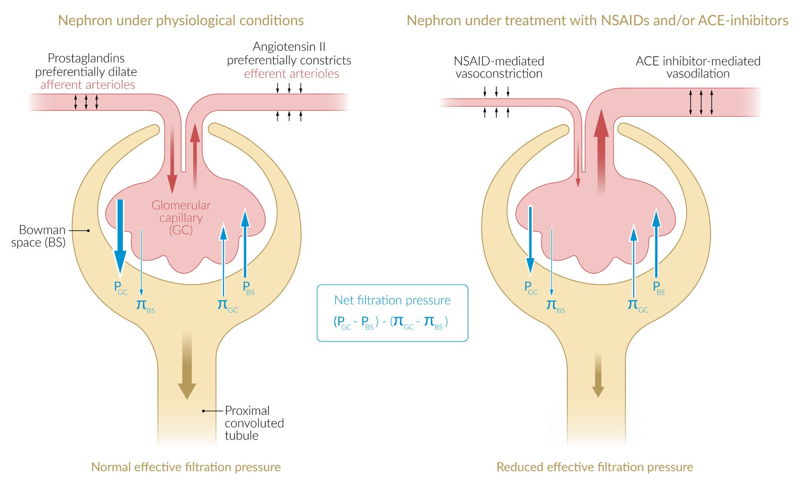
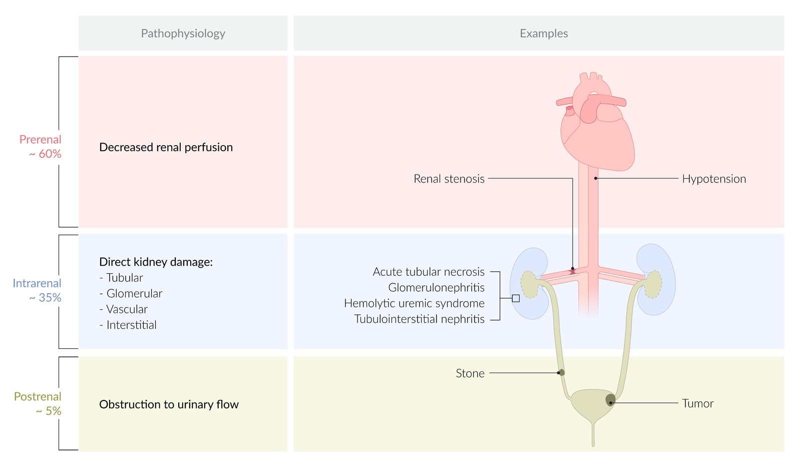
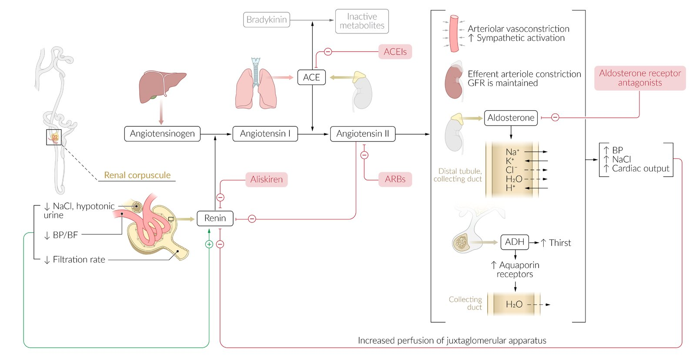
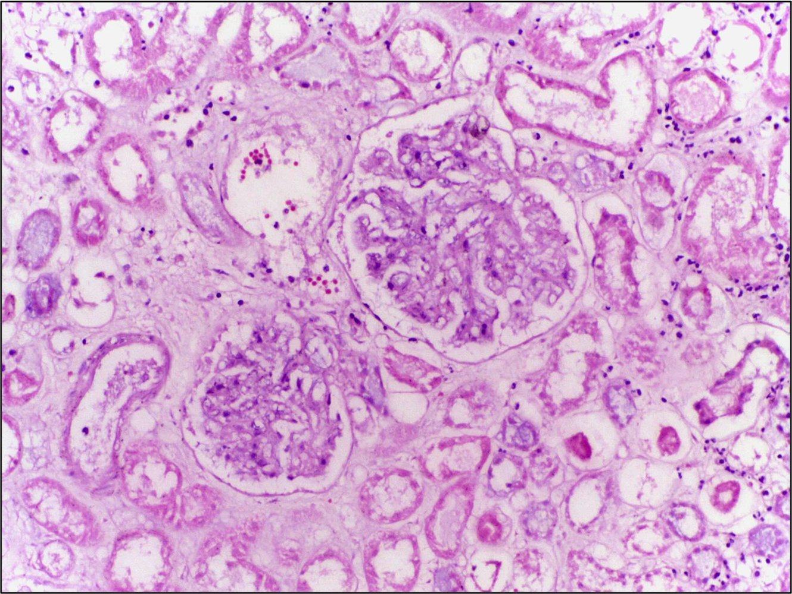
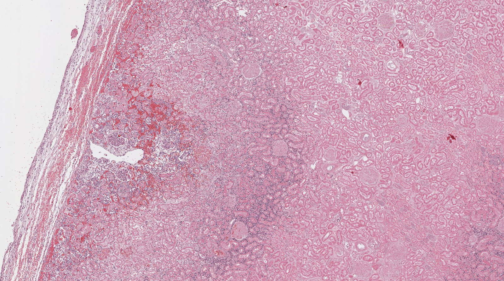
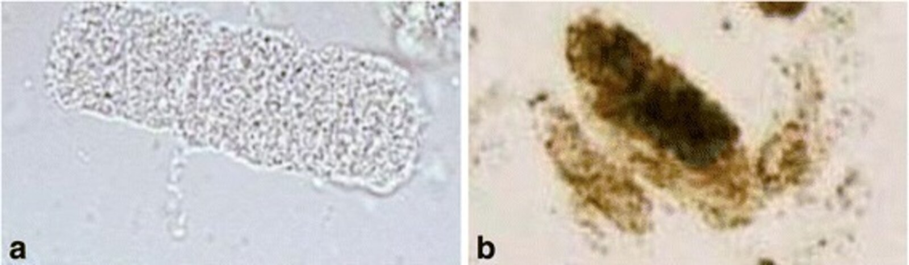
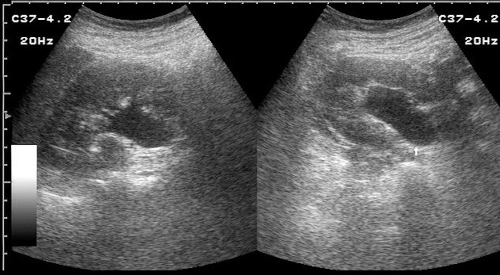
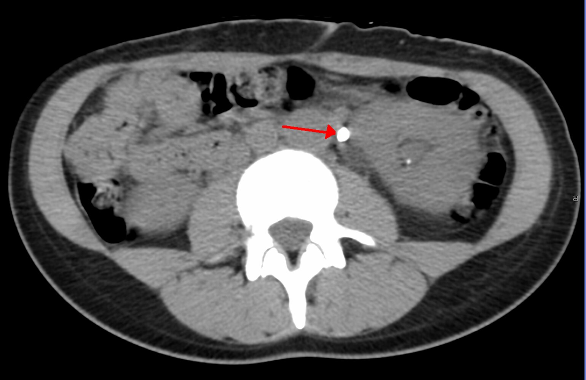

# Acute kidney injury

*Categories: Clinical knowledge > Surgery > Preoperative and postoperative care > Acute kidney injury*

[Original Article Link](https://coursology-qbank.com/amboss/article/Og0Iv2)

---

## Summary

Acute <u>kidney injury</u> (AKI) is a sudden loss of renal function with a subsequent rise in <u>creatinine</u> and <u>blood urea nitrogen</u> (<u>BUN</u>). It is most frequently caused by decreased renal <u>perfusion</u> (<u>prerenal</u>) but may also be due to direct damage to the <u>kidneys</u> (intrarenal or intrinsic) or inadequate urine drainage (postrenal). In AKI, the acid-base, fluid, and <u>electrolyte</u> balances are disturbed and the urinary excretion of substances such as drugs is impaired. AKI may be asymptomatic or manifest with <u>oliguria</u> or <u>anuria</u> and, when <u>kidney</u> dysfunction is severe, it may manifest with symptoms and signs of <u>uremia</u>; in some cases, <u>polyuria</u> may occur as a result of impaired tubular reabsorption. A <u>diagnosis of AKI</u> can be made based on an increase in serum <u>creatinine</u> concentration and/or decrease in urine output. Initial evaluation includes blood and urine studies, which may help identify the mechanism of <u>kidney injury</u> and any <u>metabolic complications of AKI</u>. Additional specific investigations are guided by the suspected cause. Rapid evaluation, diagnosis, and treatment are necessary to prevent irreversible loss of renal function. Management is based on the mechanism of <u>kidney injury</u> and the underlying causes. Treatment is primarily supportive and aims to ensure adequate <u>kidney</u> <u>perfusion</u> and prevent complications and further <u>kidney</u> damage.

---

## Etiology

### Prerenal acute kidney injury [[1]](https://coursology-qbank.com/amboss/article/nrY73q)[[2]](https://coursology-qbank.com/amboss/article/U30b3f)[[3]](https://coursology-qbank.com/amboss/article/piYLsK)

<u>Prerenal</u> causes include any condition that leads to decreased renal <u>perfusion</u> (∼ 60% of cases of AKI). [[1]](https://coursology-qbank.com/amboss/article/nrY73q)[[2]](https://coursology-qbank.com/amboss/article/U30b3f)[[3]](https://coursology-qbank.com/amboss/article/piYLsK)

* <u>Hypovolemia</u>: e.g., due to hemorrhage, <u>vomiting</u>, <u>diarrhea</u>, sweating, <u>burns</u>, <u>diuretics</u>, poor oral intake, <u>dehydration</u>, <u>hypercalcemia</u>

* <u>Hypotension</u>: e.g., due to <u>sepsis</u>, <u>cardiogenic shock</u> (decreased <u>cardiac output</u>), <u>anaphylactic shock</u>

* Decreased circulating volume (↓ <u>effective arterial volume</u>)

* <u>Cardiorenal syndrome</u>: e.g., in <u>congestive heart failure</u>

* <u>Hepatorenal syndrome</u>: e.g., in <u>cirrhosis</u>, <u>liver</u> failure

* <u>Abdominal compartment syndrome</u>

* <u>Nephrotic syndrome</u>

* <u>Acute pancreatitis</u>

* <u>Renal artery stenosis</u>

* Drugs that affect <u>glomerular</u> <u>perfusion</u>: e.g., <u>cyclosporine</u>, <u>tacrolimus</u>, <u>NSAIDs</u> , <u>ACE inhibitors</u> (<u>ACE-Is</u>)

> [!NOTE]
> Prolonged <u>prerenal</u> injury leads to intrinsic injury, as decreased renal <u>perfusion</u> causes <u>tubular necrosis</u>.

Effects of NSAIDs and ACEIs on renal filtration

### Intrinsic acute kidney injury

Intrinsic causes include any condition that leads to severe direct <u>kidney</u> damage (∼ 35% of cases of AKI). [[1]](https://coursology-qbank.com/amboss/article/nrY73q)[[2]](https://coursology-qbank.com/amboss/article/U30b3f)[[3]](https://coursology-qbank.com/amboss/article/piYLsK)

* <u>Acute tubular necrosis</u> (causes ∼ 85% of intrinsic AKIs)

* <u>Ischemia</u>: e.g., due to prolonged <u>hypotension</u>

* <u>Nephrotoxic drugs</u>: e.g., radiographic contrast agents, <u>aminoglycosides</u>, <u>cisplatin</u>, <u>methotrexate</u>, <u>ethylene glycol</u>, <u>amphotericin B</u>

* <u>Endogenous</u> toxins: e.g., <u>hemoglobin</u> in <u>intravascular hemolysis</u>, <u>myoglobin</u> in <u>rhabdomyolysis</u>, <u>uric acid</u> in <u>TLS</u>, <u>Bence-Jones protein</u> <u>light chains</u> in <u>multiple myeloma</u>

* <u>Acute interstitial nephritis</u>

* Medication: e.g., <u>antibiotics</u> , <u>phenytoin</u>, <u>interferon</u>, <u>PPIs</u>, <u>NSAIDs</u>, <u>cyclosporine</u>

* Infection 

* Bacterial: e.g., <u>Legionella</u> spp., <u>Streptococcus</u> spp.

* Fungi: <u>Candida</u>, <u>Histoplasma</u>

* Viral: e.g., <u>hepatitis C virus</u>, <u>cytomegalovirus</u>, <u>HIV</u>

* Infiltrative diseases: e.g., <u>sarcoidosis</u>, <u>amyloidosis</u>

* Vascular diseases

* <u>Hemolytic uremic syndrome</u> (<u>HUS</u>)

* <u>Thrombotic thrombocytopenic purpura</u> (<u>TTP</u>)

* <u>Hypertensive emergency</u>

* <u>Vasculitis</u>, <u>scleroderma renal crisis</u>

* <u>Renal vein thromboses</u>, renal <u>atheroemboli</u>, <u>renal infarction</u>

* <u>Glomerulonephritis</u>:e.g., <u>rapidly progressive glomerulonephritis</u>

### Postrenal acute kidney injury

Postrenal causes include any condition that results in bilateral obstruction of urinary flow from the <u>renal pelvis</u> to the <u>urethra</u> (∼ 5% of cases of AKI). [[1]](https://coursology-qbank.com/amboss/article/nrY73q)[[2]](https://coursology-qbank.com/amboss/article/U30b3f)[[3]](https://coursology-qbank.com/amboss/article/piYLsK)

* Acquired obstructions

* <u>Benign prostatic hyperplasia</u> (<u>BPH</u>)

* <u>Iatrogenic</u>: e.g., catheter-associated injuries

* Tumors: e.g., <u>bladder</u>, <u>prostate</u>, cervical, <u>metastases</u>

* Stones

* Bleeding with subsequent blood clot formation

* <u>Neurogenic bladder</u>: e.g., due to <u>multiple sclerosis</u>, <u>spinal cord lesions</u>, or <u>peripheral neuropathy</u>

* Congenital <u>malformations</u>: e.g., <u>posterior urethral valves</u>

> [!TIP]
> As long as the <u>contralateral</u> <u>kidney</u> remains intact, patients with unilateral <u>ureteral obstruction</u> typically maintain normal serum <u>creatinine</u> levels.

Etiology of acute kidney injury

### Overview of nephrotoxic medications

| Overview |  |  |
| --- | --- | --- |
| Class |  | Examples |
| Antimicrobials | <u>Antibiotics</u> |   * <u>Aminoglycosides</u>  * <u>Vancomycin</u>  * <u>Cephalosporins</u>  * <u>Colistin</u>  * <u>Sulfonamides</u>  * <u>Streptomycin</u>    |
| Antivirals |   * <u>Acyclovir</u>  * <u>Foscarnet</u>  * <u>Cidofovir</u>  * <u>Tenofovir</u>    |  |
| <u>Antifungals</u> |  * <u>Amphotericin B</u>   |  |
| <u>Antimetabolites</u> |  |   * <u>Methotrexate</u>  * <u>Cladribine</u>    |
|  <u>Chemotherapeutic agents</u> (e.g., <u>platinum-based chemotherapeutic agents</u>) |  |   * <u>Cisplatin</u>  * <u>Carboplatin</u>    |
| Antiinflammatories and <u>immunosuppressants</u> |  |   * <u>NSAIDs</u>  * <u>Cyclosporine</u>  * <u>Calcineurin inhibitors</u>    |
| Others |  |   * <u>Inhalational anesthetics</u>  * <u>Lithium</u>  * Herbal remedies  * <u>Phosphate</u>-containing bowel preparations    |

---

## Pathophysiology

### <u>Prerenal</u>

* Decreased blood supply to <u>kidneys</u> (due to <u>hypovolemia</u>, <u>hypotension</u>, or renal <u>vasoconstriction</u>);  → failure of renal vascular autoregulation to maintain renal <u>perfusion</u> → decreased <u>GFR</u> → activation of <u>renin-angiotensin system</u> → increased <u>aldosterone</u> release → increased reabsorption of Na+, H2O → increased <u>urine osmolality</u> → secretion of <u>antidiuretic hormone</u> → increased reabsorption of H2O and <u>urea</u>

* <u>Creatinine</u> is still secreted in the <u>proximal</u> tubules, so the blood <u>BUN:creatinine ratio</u> increases.

Mechanism of action: renin-angiotensin-aldosterone system (RAAS) inhibitors

### Intrinsic

* Damage to a vascular or tubular component of the <u>nephron</u> → <u>necrosis</u> or <u>apoptosis</u> of tubular cells → decreased reabsorption capacity of <u>electrolytes</u> (e.g., Na+), water, and/or <u>urea</u>;  (depending on the location of injury along the tubular system) → increased Na+ and H2O in the urine → decreased <u>urine osmolality</u>

### Postrenal

* Bilateral <u>urinary outflow obstruction</u> (e.g., stones, <u>BPH</u>, <u>neoplasia</u>, congenital anomalies) → increased retrograde <u>hydrostatic pressure</u> within renal tubules → decreased <u>GFR</u> and compression of the renal vasculature → <u>acidosis</u>, <u>fluid overload</u>, and increased <u>BUN</u>, Na+, and <u>K+</u>.

* A normal <u>GFR</u> can be maintained as long as one <u>kidney</u> functions normally.

### Four phases of AKI

| Overview of the four <u>phases of AKI</u> |  |  |
| --- | --- | --- |
| Phase |  Characteristic features (some patients may not undergo all phases) | Duration |
| Initiating event (<u>kidney injury</u>) |  * Symptoms of the underlying illness causing AKI may be present.   |  * Hours to days   |
| <u>Oliguric</u> or <u>anuric</u> phase (maintenance phase) |   * Progressive deterioration of <u>kidney function</u>  * Reduced <u>urine production</u> (<u>oliguria</u>), < 50 ml/24 hrs = <u>anuria</u>  * Increased retention of <u>urea</u> and <u>creatinine</u> (azotemia)  * Complications: fluid retention (<u>pulmonary edema</u>), <u>hyperkalemia</u>, <u>metabolic acidosis</u>, <u>uremia</u>, <u>lethargy</u>, <u>asterixis</u>    |  * 1–3 weeks   |
| <u>Polyuric</u>/<u>diuretic</u> phase |   * <u>Glomerular filtration</u> returns to normal, which increases <u>urine production</u> (<u>polyuria</u>), while tubular reabsorption remains disturbed.  * Complications: loss of <u>electrolytes</u> and water (<u>dehydration</u>, <u>hyponatremia</u>, and <u>hypokalemia</u>)    |  * ∼ 2 weeks   |
| Recovery phase |  * <u>Kidney function</u> and <u>urine production</u> normalize.   |  * Months to years   |

References:[[2]](https://coursology-qbank.com/amboss/article/U30b3f)[[4]](https://coursology-qbank.com/amboss/article/p30Ljf)

---

## Clinical features

* May be asymptomatic.

* <u>Oliguria</u> or <u>anuria</u>

* <u>Signs of volume depletion</u> (in <u>prerenal AKI</u> caused by volume loss)

* Orthostatic or frank <u>hypotension</u> and <u>tachycardia</u>

* Reduced <u>skin turgor</u>

* <u>Signs of fluid overload</u> (from Na+ and H2O retention)

* Peripheral and <u>pulmonary edema</u>

* <u>Hypertension</u>

* <u>Heart failure</u>

* <u>Shortness of breath</u>

* Signs of <u>uremia</u>

* <u>Anorexia</u>, <u>nausea</u>

* <u>Encephalopathy</u>, <u>asterixis</u>

* <u>Pericarditis</u>

* <u>Platelet dysfunction</u>

* Signs of <u>renal obstruction</u> (in <u>postrenal AKI</u>)

* Distended <u>bladder</u>

* Incomplete voiding

* <u>Pain</u> over the <u>bladder</u> or flanks

* Fatigue, confusion, and <u>lethargy</u>

* In severe cases: <u>seizures</u> or <u>coma</u>

* Affected individuals have a higher risk of secondary infection throughout all phases (most common reason for fatalities).

---

## Subtypes and variants

### Acute tubular necrosis

* <u>Epidemiology</u>: : causes ∼ 85% of intrinsic AKIs

* Location 

* The straight segment of the <u>proximal</u> tubule and the straight segment of the <u>distal</u> tubule (i.e., the thick ascending limb) are particularly susceptible to <u>ischemic</u> damage.

* The convoluted segment of the <u>proximal</u> tubule is particularly susceptible to damage from toxins.

* Etiology

* <u>Ischemic</u>: Injury occurs secondary to decreased <u>renal blood flow</u>.

* Severe <u>hypotension</u>, especially in the context of <u>shock</u>: <u>hypovolemic</u> (e.g., hemorrhage, <u>severe dehydration</u>), <u>septic</u>, cardiogenic (e.g., <u>heart failure</u>), or <u>neurogenic shock</u>

* <u>Thromboembolism</u>

* <u>Thrombotic microangiopathy</u>

* <u>Cholesterol embolism</u> (<u>atheroemboli</u>)

* Toxic: Injury occurs directly due to <u>nephrotoxic substances</u>.

* <u>Contrast-induced nephropathy</u>

* Medication: <u>aminoglycosides</u>, <u>cisplatin</u>, amphotericin, lead, <u>ethylene glycol</u>

* Pigment nephropathy: an acute <u>kidney injury</u> that occurs as a result of the toxic effects of <u>heme</u>-containing pigments (e.g., <u>hemoglobin</u>, <u>myoglobin</u>) on <u>proximal</u> renal tubular cells (toxin-induced <u>acute tubular necrosis</u>)

* <u>Myoglobinuria</u> due to <u>rhabdomyolysis</u> (<u>crush syndrome</u>)

* <u>Hemoglobinuria</u> associated with <u>hemolysis</u>

* <u>Acute uric acid nephropathy</u>

* Other: <u>sepsis</u>, infections

* Pathophysiology: <u>necrotic</u> <u>proximal</u> tubular cells fall into the tubular lumen → debris obstructs tubules → decreased <u>GFR</u> → sequence of pathophysiological events similar to <u>prerenal failure</u> (i.e., activation of <u>RAAS</u>; see “Pathophysiology” above)

* Clinical features: same as AKI (see “Clinical features” and four <u>phases of AKI</u> above)

* Diagnostics (see “Diagnostics” below)

* Blood findings: <u>azotemia</u>, <u>hyperkalemia</u>, and <u>metabolic acidosis</u>

* Urinary findings

* ↑ <u>Fractional excretion of sodium</u> (<u>FENa</u>)

* <u>Myoglobinuria</u>, <u>hemoglobinuria</u>

* <u>Urinary sediment</u>

* Muddy brown <u>granular casts</u>

* <u>Epithelial</u> cell casts

* Free renal tubular <u>epithelial</u> cells (due to denudation of the <u>tubular basement membrane</u>)

* Management: See “Management” below.

* Prognosis

* After 1–3 weeks, most patients with <u>ATN</u> will experience tubular re-epithelialization and spontaneous full recovery is common.

* Can be lethal;  if AKI is severe and not managed adequately (e.g., dialysis may be required in <u>oliguric</u> patients with <u>volume overload</u> or severe <u>hyperkalemia</u>)

Renal infarction

Coagulative necrosis in renal infarction

Urine casts in acute tubular necrosis

### Renal cortical necrosis

* Definition: rare cause of AKI caused by acute generalized <u>ischemic necrosis</u> of the <u>renal cortex</u> in both <u>kidneys</u>

* Etiology: <u>septic shock</u>, <u>disseminated intravascular coagulation</u> (<u>DIC</u>); , <u>hemolytic uremic syndrome</u> (<u>HUS</u>), obstetric complications;  (e.g., <u>abruptio placentae</u>, <u>septic abortion</u>, <u>postpartum hemorrhage</u>)

* Pathophysiology: vasospasms and <u>microvascular</u> injury with vascular <u>thrombosis</u> → prolonged severe renal <u>ischemia</u>;   → diffuse and/or patchy destruction of the <u>renal cortex</u> [[5]](https://coursology-qbank.com/amboss/article/XKc9UW0)

* Clinical features: flank <u>pain</u>, <u>CVA tenderness</u> and <u>signs of AKI</u> (see also “Clinical features” above and <u>shock</u>)

* Management: Dialysis can improve outcomes (see “Management” below).

* Prognosis: high <u>mortality rates</u> without treatment

### Contrast-induced nephropathy

* Definition: AKI after IV administration of iodinated contrast medium

* <u>Risk factors</u>

* <u>Chronic kidney disease</u> (<u>CKD</u>): esp. in patients with <u>diabetes mellitus</u>, <u>multiple myeloma</u>

* <u>Congestive heart failure</u>, arterial <u>hypotension</u>

* <u>Nephrotoxic drugs</u>: esp. <u>NSAIDs</u>

* <u>Anemia</u>

* <u>Dehydration</u>

* Clinical features/diagnostics: See “Clinical features” above and “Diagnostics” below.

* Course

* <u>Creatinine</u> is highest 3–5 days after injury and usually falls back to the baseline level within 1 week.

* The course is typically mild because <u>end-stage renal disease</u> usually only occurs in patients with pre-existing <u>CKD</u>.

* Prevention of contrast-induced nephropathy

* Always evaluate <u>kidney function</u> before administering a contrast agent.

* Use a low dose and low concentration of contrast medium.

* The patient should discontinue <u>nephrotoxic substances</u> before administration.

* Ensure hydration: isotonic NaCl before and after administration of contrast medium

* <u>Acetylcysteine</u> (no clear recommendations )

References:[[2]](https://coursology-qbank.com/amboss/article/U30b3f)[[3]](https://coursology-qbank.com/amboss/article/piYLsK)[[6]](https://coursology-qbank.com/amboss/article/ROalHk)

---

## Diagnosis

A <u>diagnosis of AKI</u> can be made based on an acute increase in serum <u>creatinine</u> and/or decrease in urine output in accordance with the <u>definition of AKI</u>.

### Approach [[7]](https://coursology-qbank.com/amboss/article/b9bHND)[[8]](https://coursology-qbank.com/amboss/article/dyboVw)[[9]](https://coursology-qbank.com/amboss/article/LrYw3q)

* Compare current and previous <u>creatinine</u> levels to determine if the process is acute.

* Check diagnostic criteria and perform <u>staging of AKI</u>.

* Determine the most likely mechanism of AKI (i.e., <u>prerenal</u>, intrinsic, or postrenal) based on:

* A comprehensive chart review, history, and <u>physical examination</u>

* Supportive diagnostic findings and response to initial interventions

* Consider further testing for specific underlying causes of AKI.

> [!TIP]
> In the absence of previously documented <u>creatinine</u> levels, stable <u>creatinine</u> levels with findings such as chronic <u>anemia</u> and small <u>hyperechoic</u> <u>kidneys</u> on <u>ultrasound</u> suggest <u>CKD</u> rather than AKI.

> [!TIP]
> Clinical presentation, laboratory tests, imaging, response to initial therapy, and, in some cases, <u>histopathology</u> are required to determine the underlying cause of AKI.

### Diagnostic criteria of acute kidney injury

* Acute <u>kidney injury</u> is defined as the presence of any of the following criteria: ;  [[7]](https://coursology-qbank.com/amboss/article/b9bHND)

* Increase in serum <u>creatinine</u> by ≥ 0.3 mg/dL (≥ 26.5 μmol/L) within 48 hours.

* Increase in serum <u>creatinine</u> to ≥ 1.5 times baseline level within 7 days.

* Decrease in urine output to < 0.5 mL/kg/hour for ≥ 6 hours.

### Staging of acute kidney injury

* The <u>KDIGO</u> stages are widely used and correlate with the risk of <u>death</u>, need for <u>renal replacement therapy</u>, and long-term outcomes (e.g., <u>CKD</u>).

* Other classifications include: [[7]](https://coursology-qbank.com/amboss/article/b9bHND)

* RIFLE criteria: A classification system for acute <u>kidney injury</u>

* The acronym stands for Risk, Injury, Failure, Loss, and <u>End-stage kidney disease</u>.

* For the first three categories, patients are classified according to the level of <u>kidney injury</u> (i.e., degree of increase in serum <u>creatinine</u> and/or decrease in <u>GFR</u> and urine output) and for the last two categories, according to the duration of complete loss of <u>kidney function</u>.

* Acute <u>Kidney</u> Injury Network (AKIN) criteria

|  Kidney Disease Improving Global outcomes (KDIGO) criteria for staging of AKI [[7]](https://coursology-qbank.com/amboss/article/b9bHND)  |  |  |
| --- | --- | --- |
| Stage | Serum <u>creatinine</u> | Urine output |
| AKI stage 1 |   * Increase of 0.3 mg/dL (26.5 μmol/L)  * OR 1.5–1.9 times baseline    |  * < 0.5 mL/kg/hour for 6–12 hours   |
| AKI stage 2 |  * 2.0–2.9 times baseline   |  * < 0.5 mL/kg/hour for ≥12 hours   |
| AKI stage 3 |   * ≥ 3 times baseline  * OR increase to ≥ 4 mg/dL (≥ 354 μmol/L)  * OR <u>renal replacement therapy</u> initiated  * OR in patients < 18 years of age: decrease in <u>eGFR</u> to < 35 mL/min/1.73 m2    |   * < 0.3 mL/kg/hour for ≥ 24 hours  * OR <u>anuria</u> for ≥ 12 hours    |
| If serum <u>creatinine</u> and urine output correlate with different stages, consider staging based on the criterion that corresponds to the highest stage. [[9]](https://coursology-qbank.com/amboss/article/LrYw3q)  |  |  |

### Initial evaluation

#### <u>Laboratory studies</u>

* Serum <u>creatinine</u> and <u>BUN</u>

* Serum <u>electrolytes</u>: <u>sodium</u>, <u>potassium</u>, <u>magnesium</u>, <u>calcium</u>, and <u>phosphate</u>

* <u>CBC</u>

* Blood gases: <u>ABG</u> or <u>VBG</u>

* <u>Urinalysis</u> with <u>urine sediment</u> microscopy

* Urine <u>sodium</u>, <u>urea</u>, <u>creatinine</u>, and <u>osmolality</u>

* Calculate excretion fractions: may help to differentiate <u>prerenal AKI</u> from <u>intrinsic AKI</u>  [[10]](https://coursology-qbank.com/amboss/article/ogc0wb0)

* <u>Fractional excretion of sodium</u> (<u>FENa</u>)

* <u>Fractional excretion of urea</u> (<u>FEUrea</u>)

Fractional excretion of sodium (FENa)

Fractional excretion of urea (FEUrea)

#### Overview of diagnostic findings

| Determination of the likely mechanism of acute kidney injury |  |  |  |
| --- | --- | --- | --- |
|  | <u>Prerenal</u> | Intrinsic | Postrenal |
| <u>BUN:creatinine ratio</u> |  * > 20:1   |  * < 15:1   |  * Varies   |
| <u>FENa</u> |  * < 1%   |  * > 2–3%   |  |
| <u>FEUrea</u> |  * < 35%   |  * > 50%   |  |
| Urine <u>sodium</u> concentration |  * < 20 mEq/L   |  * > 40 mEq/L   |  |
| <u>Urine osmolality</u> |  * > 500 mOsm/kg   |  * < 350 mOsm/kg   |  * < 350 mOsm/kg   |
| <u>Urine sediment</u> |  * <u>Hyaline casts</u>   |   * Renal tubular <u>epithelial</u> cells or granular, muddy brown, or pigmented casts (e.g., due to <u>ATN</u>)  * <u>RBC casts</u> (e.g., due to <u>glomerulonephritis</u>)  * <u>Fatty casts</u> (e.g., due to <u>nephrotic syndrome</u>)  * <u>WBC casts</u> (e.g., due to <u>allergic interstitial nephritis</u>)    |   * <u>Hematuria</u> (stones, <u>bladder cancer</u>, clots)  * Absent (<u>neurogenic bladder</u>)    |

> [!WARNING]
> Despite the common use of <u>BUN:creatinine ratio</u> and urinary fractional excretions (i.e., <u>FENa</u>, <u>FEUrea</u>) in clinical practice, observational data suggest that they do not reliably distinguish <u>prerenal AKI</u> from <u>intrinsic AKI</u>. [[10]](https://coursology-qbank.com/amboss/article/ogc0wb0)[[11]](https://coursology-qbank.com/amboss/article/eybxVw)

> [!TIP]
> The most likely mechanism of AKI is primarily determined based on clinical presentation and response to therapy. Evaluating patients' response to initial interventions is key to confirming the mechanism of AKI and guiding further workup and management steps.

Urine casts in acute tubular necrosis

Red blood cell (RBC) casts in urine sediment

Maltese cross sign

White blood cell casts

#### <u>Prerenal AKI</u> [[8]](https://coursology-qbank.com/amboss/article/dyboVw)[[9]](https://coursology-qbank.com/amboss/article/LrYw3q)

* Blood study findings

* Elevated serum <u>creatinine</u>

* Serum <u>BUN:creatinine ratio</u> ≥ 20:1   [[12]](https://coursology-qbank.com/amboss/article/JTcs7b0)

* Urine study findings

* Normal <u>urinalysis</u>

* Low urinary <u>sodium</u> and <u>urea</u> excretion 

* Low <u>fractional excretion of sodium</u> (<u>FENa</u> < 1%)

* Low <u>fractional excretion of urea</u> (<u>FEUrea</u> < 35%)

* High <u>urine osmolality</u> (> 500 mOsm/kg) and specific gravity (> 1.020)  [[13]](https://coursology-qbank.com/amboss/article/Tyb6ew)[[14]](https://coursology-qbank.com/amboss/article/xbbEDH)

* <u>Urine sediment</u>: <u>hyaline casts</u> due to concentrated urine in the setting of low renal <u>perfusion</u>

* Clinical findings: rapid improvement in renal function following acute intervention

> [!TIP]
> Patients with <u>prerenal AKI</u> receiving <u>diuretic</u> therapy may have a falsely elevated <u>FENa</u>. Therefore, <u>FEUrea</u> may be more informative in this setting. [[15]](https://coursology-qbank.com/amboss/article/Uybbew)

#### <u>Intrinsic AKI</u>

* Blood study findings

* Elevated serum <u>creatinine</u> concentration and rapidly rising serum <u>creatinine</u> level

* <u>BUN:creatinine ratio</u> ≤ 15:1

* Urine study findings

* High urinary <u>sodium</u> and <u>urea</u> excretion 

* High urine <u>sodium</u> concentration (> 40 mEq/L)

* High <u>fractional excretion of sodium</u> (<u>FENa</u> > 2–3%) [[8]](https://coursology-qbank.com/amboss/article/dyboVw)[[15]](https://coursology-qbank.com/amboss/article/Uybbew)

* High <u>fractional excretion of urea</u> (<u>FEUrea</u> > 50%) [[15]](https://coursology-qbank.com/amboss/article/Uybbew)

* Low <u>urine osmolality</u> (< 350 mOsm/kg)

* <u>Urine sediment</u>: renal tubular <u>epithelial</u> cells or granular, muddy brown, or pigmented casts

* <u>Biopsy</u>: e.g., in suspected <u>rapidly progressive glomerulonephritis</u>

* Clinical findings: lack of response to acute intervention

> [!TIP]
> A falsely low <u>FENa</u> may be seen in some patients with <u>intrinsic AKI</u>, e.g., due to <u>glomerulonephritis</u>, <u>acute interstitial nephritis</u>, <u>rhabdomyolysis</u>, or <u>contrast-induced nephropathy</u>. [[15]](https://coursology-qbank.com/amboss/article/Uybbew)

#### <u>Postrenal AKI</u>

* Blood study findings

* Elevated serum <u>creatinine</u> concentration in bilateral obstruction

* <u>BUN:creatinine ratio</u> varies; usually normal (i.e., 10:1–20:1)

* Urine study findings

* Normal <u>urinalysis</u>; : e.g., when due to <u>neurogenic bladder</u>

* <u>Hematuria</u>; : e.g., when due to stones, <u>bladder cancer</u>, clots

* <u>Urine osmolality</u> varies.  [[16]](https://coursology-qbank.com/amboss/article/HybKgw)

* Imaging (<u>renal ultrasound</u> or <u>noncontrast CT scan</u>)

* <u>Bladder</u> distention, high <u>postvoid residual volume</u>, bilateral <u>hydronephrosis</u>, and/or obstructing stones

* See “Imaging modalities” in “<u>Urinary tract obstruction</u>.”

* Clinical findings: rapid improvement in renal function following resolution of the obstruction

Hydronephrosis (grade 4)

### Additional evaluation

#### Imaging [[17]](https://coursology-qbank.com/amboss/article/-ybD3w)

Imaging of the <u>kidneys</u> and <u>urinary tract</u> is not necessary to establish a <u>diagnosis of AKI</u> but may be needed to determine the etiology.

* <u>Ultrasound</u>

* Obtain urgently to assess for <u>hydronephrosis</u> in patients with <u>risk factors for urinary tract obstruction</u>.   [[8]](https://coursology-qbank.com/amboss/article/dyboVw)[[18]](https://coursology-qbank.com/amboss/article/WybPVw)

* Consider when evaluating renal dysfunction of unclear etiology.

* Noncontrast CT

* Obtain if <u>ultrasound</u> shows <u>hydronephrosis</u> but does not reveal the cause of the obstruction.

* Consider when clinical suspicion of obstruction remains high despite the absence of <u>hydronephrosis</u> on <u>ultrasound</u>.

* See also “Imaging modalities” in “<u>Urinary tract obstruction</u>.”

> [!WARNING]
> Obtain an urgent <u>ultrasound</u> to rule out <u>hydronephrosis</u> in patients with <u>risk factors for urinary tract obstruction</u>.

> [!TIP]
> While <u>ultrasound</u> is the initial test of choice to assess for <u>urinary tract obstruction</u>, CT has greater <u>sensitivity</u> for detecting obstructions and stones. [[19]](https://coursology-qbank.com/amboss/article/qybCTw)

Hydronephrosis

Hydronephrosis (grade 4)

Hydronephrosis (grade I)

Chronic ureteral obstruction

Ureter calculus with hydronephrosis

#### <u>Renal biopsy</u> [[8]](https://coursology-qbank.com/amboss/article/dyboVw)[[20]](https://coursology-qbank.com/amboss/article/kIYm1q)

* Not routinely indicated

* Consider if:

* The cause of AKI cannot be identified after a thorough initial evaluation

* Diagnostic confirmation of the cause (e.g., <u>glomerulonephritis</u>, myeloma nephropathy) is needed prior to initiating disease-specific therapy

#### Additional specific testing

Usually reserved for cases in which <u>intrinsic AKI</u> is initially suspected or interventions aimed at reversing presumed <u>prerenal AKI</u> or <u>postrenal AKI</u> fail to improve renal function. Studies should be guided by clinical suspicion.

|  Noninvasive testing for specific underlying causes of AKI [[1]](https://coursology-qbank.com/amboss/article/nrY73q)[[20]](https://coursology-qbank.com/amboss/article/kIYm1q)  |  |  |  |
| --- | --- | --- | --- |
| Examples |  | Characteristic clinical features | Diagnostic findings |
| <u>Nephrotoxin</u>-induced AKI |  * <u>Rhabdomyolysis</u>   |   * History of trauma or nontraumatic <u>causes of rhabdomyolysis</u>  * <u>Myalgia</u>, generalized <u>weakness</u>, and/or dark urine    |   * ↑ <u>CPK</u> (5000–100,000 U/L)  * <u>Urine dipstick</u> positive for <u>heme</u> but no <u>RBCs</u> on microscopy  * <u>FENa</u> may be low (< 1%). [[1]](https://coursology-qbank.com/amboss/article/nrY73q)    |
|  * <u>Hemolysis</u>   |   * <u>Pallor</u>, <u>jaundice</u>, and/or dark urine  * <u>Severe anemia</u>    |   * ↓ <u>Hb</u>  * ↑ Total <u>bilirubin</u>, ↑ <u>LDH</u>, ↓ <u>haptoglobin</u>  * <u>Urine dipstick</u> positive for <u>heme</u> but no <u>RBCs</u> on microscopy  * <u>FENa</u> may be low (< 1%). [[15]](https://coursology-qbank.com/amboss/article/Uybbew)    |  |
|  * <u>Tumor lysis syndrome</u>   |   * Recent <u>chemotherapy</u>  * <u>Hyperleukocytosis</u>    |   * ↑ <u>K+</u> and <u>PO43-</u>  * ↑ <u>Uric acid</u> and <u>LDH</u>  * ↓ <u>Calcium</u>  * <u>Urine sediment</u> positive for <u>uric acid crystals</u>    |  |
|  * <u>Crystal-induced AKI</u>   |  * Exposure to typical culprit medications (e.g., <u>acyclovir</u>, <u>indinavir</u>, <u>ciprofloxacin</u>, <u>methotrexate</u>)   |  * <u>Birefringent</u> crystals in the urine   |  |
|  * <u>Ethylene glycol</u> or <u>methanol poisoning</u>   |   * Suspected accidental or intentional ingestion  * History of <u>alcohol use disorder</u>  * <u>Hyperpnea</u> and <u>altered mental status</u>    |   * <u>Anion-gap metabolic acidosis</u>  * ↑ <u>Osmolar gap</u>    |  |
| <u>Rapidly progressive glomerulonephritis</u> |  * <u>Anti-GBM disease</u>   |   * <u>Cough</u>, <u>hemoptysis</u>, and/or <u>dyspnea</u>  * <u>Nephritic syndrome</u>    |  * ↑ <u>Anti-GBM antibodies</u>   |
|  * <u>Poststreptococcal glomerulonephritis</u>   |   * Recent throat and/or <u>skin infection</u>  * <u>Nephritic syndrome</u>    |  * ↑ <u>Antistreptolysin O</u>   |  |
|  * Other infection-associated <u>glomerulonephritides</u>   |   * Evidence of systemic infection  * Previous or current IV drug use  * <u>Nephritic syndrome</u> or <u>nephrotic syndrome</u>    |   * ↓ <u>Complement</u>  * Positive viral <u>serology</u> (e.g., in <u>HIV</u>, <u>HCV</u>, or <u>HBV infection</u>)  * Positive <u>blood cultures</u> (e.g., in <u>endocarditis</u>)    |  |
|  * <u>Lupus nephritis</u>   |   * Previous <u>SLE</u> diagnosis  * Presence of other <u>clinical features of SLE</u>  * <u>Nephritic syndrome</u> or <u>nephrotic syndrome</u>    |   * ↑ <u>ANA</u>  * ↑ dsDNA  * ↓ <u>Complement</u>    |  |
|  * <u>IgA nephropathy</u>   |   * Recurrent <u>gross hematuria</u> during or immediately following infection (e.g., <u>URTI</u>, <u>gastroenteritis</u>) and/or strenuous exercise  * <u>Nephritic syndrome</u>    |   * ↑ Serum <u>IgA</u>  * Normal <u>complement</u>    |  |
|  * <u>Pauci-immune glomerulonephritis</u>   |   * Symptoms affecting the upper or <u>lower respiratory tract</u>, <u>skin</u>, and/or <u>eye</u>  * <u>Nephritic syndrome</u>    |   * ↑ <u>c-ANCA</u> in <u>granulomatosis with polyangiitis</u>  * ↑ <u>p-ANCA</u> in <u>microscopic polyangiitis</u>    |  |
| Others |  * <u>Multiple myeloma</u>   |  * <u>CRAB criteria</u>   |   * <u>Monoclonal spike</u> on <u>serum protein electrophoresis</u>  * Urine <u>Bence Jones protein</u>    |
|  * <u>TTP</u> or <u>HUS</u>   |   * <u>TTP</u>: systemically unwell patient with <u>fever</u> and/or neurological features  * <u>HUS</u>: young patient with recent gastrointestinal illness, typically with bloody <u>diarrhea</u>  * <u>Atypical HUS</u> [[21]](https://coursology-qbank.com/amboss/article/wrXhjz)  * <u>Family history</u> of <u>thrombotic microangiopathy</u>  * Recent trigger (e.g., <u>pregnancy</u>, viral infection, cancer)  * <u>Elevated blood pressure</u>    |   * <u>Microangiopathic hemolytic anemia with thrombocytopenia</u>  * <u>TTP</u>: ↓ <u>ADAMTS13</u> activity  * <u>HUS</u>: evidence of <u>Shiga toxin</u>-producing <u>E. coli</u> infection  * <u>Atypical HUS</u>: abnormalities in extended plasma <u>complement</u> levels and <u>genetic testing</u> for <u>complement</u> mutations [[21]](https://coursology-qbank.com/amboss/article/wrXhjz)    |  |
|  * <u>Atheroembolic disease</u>   |   * Recent catheterization (e.g., femoral <u>cardiac catheterization</u>)  * <u>Livedo reticularis</u> and/or toe discoloration    |   * ↓ <u>Complement</u>  * Variable <u>eosinophiluria</u>    |  |
|  * <u>Acute interstitial nephritis</u>   |   * Exposure to typical culprit medications  * <u>Fever</u>, drug <u>rash</u>, flank <u>pain</u>    |  * Variable <u>eosinophilia</u> and <u>eosinophiluria</u>   |  |
|  * <u>Scleroderma renal crisis</u>   |   * <u>Clinical features of scleroderma</u>  * Acute blood pressure elevation  * <u>Encephalopathy</u>    |   * ↑ <u>ANA</u>  * ↑ <u>Scleroderma</u>-specific <u>antibodies</u>  * <u>Thrombocytopenia</u>  * <u>Microangiopathic hemolytic anemia</u>    |  |

---

## Management

### Approach [[7]](https://coursology-qbank.com/amboss/article/b9bHND)[[8]](https://coursology-qbank.com/amboss/article/dyboVw)[[9]](https://coursology-qbank.com/amboss/article/LrYw3q)

* Initiate <u>treatment for the underlying cause of AKI</u> based on the presumed mechanism.

* <u>Prerenal</u>: Correct adverse hemodynamic factors and replace the depleted volume as needed.

* Postrenal: Relieve the <u>urinary tract obstruction</u>.

* Intrinsic: Consider a trial of <u>IV fluids</u>; identify and treat underlying causes that require specific interventions.

* Consider <u>indications for acute dialysis</u> and early nephrology consultation.

* Provide <u>supportive care</u> to all patients.

* Hold potentially <u>nephrotoxic substances</u>, <u>ACE-Is</u>, <u>ARBs</u>, <u>NSAIDs</u>, and nonessential medications.

* Adjust the dosing of essential <u>renally cleared medications</u>.

* Manage <u>volume status</u> and blood pressure to optimize <u>kidney</u> <u>perfusion</u>.

* Identify and manage complications (e.g., <u>electrolyte</u> disturbances, <u>acidosis</u>, <u>fluid overload</u>).

* Consider additional <u>supportive care</u> measures (e.g., <u>nutritional support</u>, <u>VTE prophylaxis</u>).

* Provide patient education and ensure adequate post-discharge follow-up.

> [!TIP]
> AKI management is primarily supportive. Currently, there are no specific pharmacotherapies for AKI. [[9]](https://coursology-qbank.com/amboss/article/LrYw3q)

> [!WARNING]
> Avoid coadministering <u>RAAS inhibitors</u> and <u>NSAIDs</u> in patients with reduced renal <u>perfusion</u> (e.g., in <u>congestive heart failure</u>, <u>renal artery stenosis</u>) because doing so can significantly decrease their <u>GFR</u>.

#### Early nephrology consult

* Common indications [[22]](https://coursology-qbank.com/amboss/article/zCbruD)

* <u>Indications for acute dialysis</u> or <u>renal biopsy</u>

* <u>AKI stage</u> 3

* Inadequate response to initial treatment

* <u>Intrinsic AKI</u>

* Presence of <u>CKD</u>, if:

* The patient has received a <u>renal transplant</u>

* <u>CKD category</u> G4 or higher

### Treatment of underlying causes [[7]](https://coursology-qbank.com/amboss/article/b9bHND)[[8]](https://coursology-qbank.com/amboss/article/dyboVw)[[9]](https://coursology-qbank.com/amboss/article/LrYw3q)

| ‎Treatment for the underlying cause of AKI  |  |  |
| --- | --- | --- |
| AKI subtype | Cause | Management |
| <u>Prerenal</u> |  * <u>Hypovolemia</u>   |  * <u>IV fluid resuscitation</u> with <u>isotonic crystalloids</u> to restore fluid losses   |
|  * <u>Shock</u>   |   * <u>Immediate hemodynamic support</u>  * Identification of the cause of <u>shock</u>    |  |
|  * Reduced <u>effective arterial volume</u>   |   * <u>Cardiorenal syndrome</u>: <u>diuretic therapy in acute heart failure</u>  * <u>Hepatorenal syndrome</u> management strategies include:  * IV <u>albumin</u>, <u>midodrine</u>, and/or <u>octreotide</u>  * <u>TIPS</u> for refractory <u>HRS</u>  * Specialist consultation (e.g., cardiology, hepatology, nephrology) is advised    |  |
|  * Drugs that affect <u>glomerular</u> <u>perfusion</u>   |   * Discontinuation of offending medications (e.g., <u>ACE-Is</u>, <u>ARBs</u>, <u>NSAIDs</u>)  * Ensure adequate hydration.    |  |
| Intrinsic |  * <u>ATN</u>   |   * Discontinuation of potential <u>nephrotoxins</u>  * <u>Supportive care</u> of AKI (mainstay of treatment) including <u>IV fluid therapy</u> with <u>isotonic crystalloids</u>   * <u>Oliguric</u> phase: strict <u>fluid balance monitoring</u> to avoid <u>fluid overload</u>  * <u>Polyuric</u> phase: matching of fluid and <u>electrolyte</u> losses to prevent a secondary <u>kidney</u> insult from <u>hypovolemia</u> [[23]](https://coursology-qbank.com/amboss/article/_xb5_D)[[24]](https://coursology-qbank.com/amboss/article/AxbR_D)    |
|  * <u>AIN</u>   |   * Discontinuation of potential <u>nephrotoxins</u>  * Treatment of the underlying etiology  * <u>Glucocorticoid</u> therapy may be considered.  * See also “Treatment” in “<u>Tubulointerstitial diseases</u>.”    |  |
|  * <u>Contrast-induced nephropathy</u>   |   * <u>Supportive care</u> of AKI (mainstay of treatment) including prevention of further <u>nephrotoxin</u> exposure  [[25]](https://coursology-qbank.com/amboss/article/zxbr_D)  * Management of any complications  * <u>Supportive care for AKI</u>    |  |
|  * <u>Glomerulonephritis</u>   |   * <u>Glucocorticoids</u> and/or other <u>immunosuppressive therapy</u> may be considered.  * See “Treatment” in “<u>Rapidly progressive glomerulonephritis</u>.”    |  |
|  * Vascular causes   |   * <u>Management of hypertensive crises</u>: e.g., <u>IV antihypertensives</u>  * <u>Scleroderma renal crisis</u>: urgent initiation of an <u>ACE-I</u>; <u>captopril</u> is preferred  [[26]](https://coursology-qbank.com/amboss/article/bicHJX0)  * <u>TTP</u> or <u>HUS</u> management  * Plasma exchange therapy  * See “Treatment” in “<u>Thrombotic thrombocytopenic purpura</u>” and “<u>Hemolytic uremic syndrome</u>”  * Specialist consultation is advised.    |  |
| Postrenal |  * <u>Bladder outlet obstruction</u>   |  * Urgent relief of <u>urinary tract obstruction</u>  * <u>Urethral catheterization</u>  * Consider <u>suprapubic catheterization</u> if a urethral catheter cannot be passed.   |
|  |  * Ureteral or renal <u>pelvic</u> obstruction   |   * Urgent urology consult to relieve <u>urinary tract obstruction</u>  * Management strategies include:  * <u>Ureteral stenting</u>  * <u>Percutaneous nephrostomy</u>    |

> [!TIP]
> The longer the underlying cause has been present, the greater the chance that AKI will progress to <u>renal failure</u> and/or <u>CKD</u>. Treat potential causes of AKI early.

### <u>Renal replacement therapy</u> [[7]](https://coursology-qbank.com/amboss/article/b9bHND)[[9]](https://coursology-qbank.com/amboss/article/LrYw3q)

See also “<u>Indications for acute dialysis</u>.”

* Indications; consider urgently for:

* Complications refractory to medical management

* Refractory <u>fluid overload</u>

* <u>Electrolyte</u> imbalances

* <u>Acid-base disturbances</u>

* Acute <u>poisoning</u> (e.g., by <u>ethylene glycol</u>); see “<u>Approach to the poisoned patient</u>.”

* Uremic symptoms

* Modalities include:  [[7]](https://coursology-qbank.com/amboss/article/b9bHND)[[9]](https://coursology-qbank.com/amboss/article/LrYw3q)

* <u>Hemodialysis</u> and/or <u>hemofiltration</u> (i.e., by <u>CRRT</u> or <u>intermittent hemodialysis</u>)

* <u>Peritoneal dialysis</u>  [[7]](https://coursology-qbank.com/amboss/article/b9bHND)

---

## Special patient groups

### Neonatal acute kidney injury [[43]](https://coursology-qbank.com/amboss/article/lG1vzR0)[[44]](https://coursology-qbank.com/amboss/article/NG1-zR0)[[45]](https://coursology-qbank.com/amboss/article/Rt1lWi0)

* <u>Epidemiology</u>: AKI is common in critically ill <u>newborns</u> (approx. 30% of <u>NICU</u> patients). [[45]](https://coursology-qbank.com/amboss/article/Rt1lWi0)

* Etiology [[46]](https://coursology-qbank.com/amboss/article/tG1Xai0)

* ∼85% <u>prerenal</u>

* ∼10% renal

* ∼5% postrenal

* <u>Infant</u> <u>risk factors</u> 

* <u>Perinatal</u>: <u>prematurity</u>, <u>low birth weight</u>, <u>asphyxia</u>, <u>congenital heart disease</u>

* Inflammatory: <u>NEC</u>, <u>sepsis</u>

* <u>Iatrogenic</u>: <u>nephrotoxic medications</u>, cardiac <u>surgery</u>, <u>ECMO</u> therapy

* Diagnostics: Modifications to <u>KDIGO</u> staging [[44]](https://coursology-qbank.com/amboss/article/NG1-zR0)

* Baseline serum <u>creatinine</u> in <u>neonates</u> is defined as the lowest previously measured value.

* The cut-off for AKI stage 3 is a serum <u>creatinine</u> level ≥ 3 times baseline OR ≥ 2.5 mg/dL.

* Accurate measurement of urine output in <u>neonates</u> poses challenges (esp. regarding urine collection) but is still being used to diagnose and stage AKI.

* Other diagnostic biomarkers, e.g., <u>cystatin C</u>, are currently being investigated to improve early and accurate detection of AKI in <u>neonates</u>. [[44]](https://coursology-qbank.com/amboss/article/NG1-zR0)

* See “Diagnostics” section above.

* Management

* Monitor serum <u>creatinine</u> and urine output in at-risk <u>neonates</u>.

* Treat underlying causes.

* Avoid/adjust <u>nephrotoxic medications</u>.

* Provide supportive management (e.g., fluid, <u>electrolyte</u>, and nutritional).

* Consider <u>renal replacement therapy</u>.

---