# Acute respiratory distress syndrome

*Categories: Clinical knowledge > Surgery > Preoperative and postoperative care > Acute respiratory distress syndrome*

[Original Article Link](https://coursology-qbank.com/amboss/article/tg0XC2)

---

## Summary

Acute <u>respiratory distress</u> syndrome (ARDS) is a severe inflammatory reaction of the <u>lungs</u> to pulmonary damage. While <u>sepsis</u> is the most common cause, a variety of systemic and pulmonary factors (e.g., <u>pneumonia</u>, <u>aspiration</u>) can lead to ARDS. Affected individuals initially present with acute-onset <u>dyspnea</u>, <u>tachypnea</u>, and <u>cyanosis</u>. The chief finding in ARDS is <u>hypoxemic respiratory failure</u> with decreased arterial oxygen pressure, which can progress to <u>hypercapnic respiratory failure</u>. <u>Chest x-ray</u> typically shows diffuse bilateral infiltrates. A defining feature of ARDS is a <u>PaO2/FiO2 ratio</u> ≤ 300 mm Hg. <u>Management of ARDS</u> is focused on maintaining adequate oxygenation, which often requires <u>intubation</u> and <u>lung-protective mechanical ventilation</u>. <u>Glucocorticoids</u> should be considered and any treatable causes of ARDS should be addressed. Even if adequate treatment is initiated, ARDS remains an acutely life-threatening disease with a high <u>mortality rate</u>. Most patients improve significantly in the weeks following the initial presentation, but some cases progress to <u>pulmonary fibrosis</u>, which prolongs hospital stays and delays the resolution of symptoms.

---

## Etiology

### Systemic causes

* <u>Sepsis</u> (most common cause), e.g., secondary to trauma, infection, or <u>peritonitis</u> [[2]](https://coursology-qbank.com/amboss/article/YO0nIT)

* Trauma

* <u>Shock</u>

* Massive <u>transfusion</u> (See “<u>TRALI</u>” for details)

* <u>Acute pancreatitis</u>

* <u>Hematopoietic stem cell transplantation</u>

* Medication (e.g., <u>salicylic acid</u>, <u>tricyclic antidepressants</u>, <u>bleomycin</u>) [[3]](https://coursology-qbank.com/amboss/article/DIX1Uz)

* <u>Recreational drug</u> overdose (e.g., <u>cocaine</u>)

* Major <u>burns</u> [[4]](https://coursology-qbank.com/amboss/article/y-Yd-7)

### Primary damage to the <u>lungs</u>

* <u>Pneumonia</u>

* <u>Aspiration</u>

* Inhaled toxins

* <u>Pulmonary contusion</u> [[5]](https://coursology-qbank.com/amboss/article/XO09IT)

* <u>Inhalation injury</u> (e.g., inhalation of <u>hyperbaric oxygen</u>)

* <u>Drowning</u> incidents [[6]](https://coursology-qbank.com/amboss/article/hDXcVZ0)

* <u>Fat embolism</u> (e.g., through <u>blunt trauma</u>)

* <u>Amniotic fluid embolism</u> (e.g., during <u>labor</u>)

* <u>Lung transplantation</u>

> [!NOTE]
> <u>Sepsis</u> is the most common cause of ARDS. [[2]](https://coursology-qbank.com/amboss/article/YO0nIT)

---

## Pathophysiology

* Tissue damage (pulmonary or extrapulmonary) → release of inflammatory mediators (e.g., <u>interleukin-1</u>) → inflammatory reaction → migration of <u>neutrophils</u> into <u>alveoli</u> → excessive release of neutrophilic mediators (e.g., <u>cytokines</u>, <u>proteases</u>, <u>reactive oxygen species</u>) → injury to alveolar <u>capillaries</u> and <u>endothelial</u> cells (diffuse alveolar damage, DAD) ;  leading to: [[7]](https://coursology-qbank.com/amboss/article/cO0arT)

* <u>Exudative</u> phase: excess fluid in <u>interstitium</u> and on alveolar surface → <u>pulmonary edema</u> with normal <u>pulmonary capillary wedge pressure</u> (<u>noncardiogenic pulmonary edema</u>) → decreased <u>lung compliance</u> and <u>respiratory distress</u>

* <u>Hyaline membrane</u> formation: exudation of <u>neutrophils</u> and protein-rich fluid into the alveolar space → formation of alveolar <u>hyaline membranes</u>  → impaired <u>gas exchange</u> → <u>hypoxemia</u> 

* <u>Hypoxemia</u> → compensation through <u>hyperventilation</u> → <u>respiratory alkalosis</u>

* <u>Hypoxemia</u> → chronic <u>hypoxic pulmonary vasoconstriction</u> → <u>pulmonary hypertension</u> and right-to-left pulmonary shunt (increased <u>shunt fraction</u>)

* Damage to type I and <u>type II pneumocytes</u> → decrease in <u>surfactant</u> → alveolar collapse → intrapulmonary shunting

* Organizing phase (late stage): <u>proliferation</u> of <u>type II pneumocytes</u> and infiltration of <u>fibroblasts</u> → progressive <u>interstitial</u> <u>fibrosis</u>

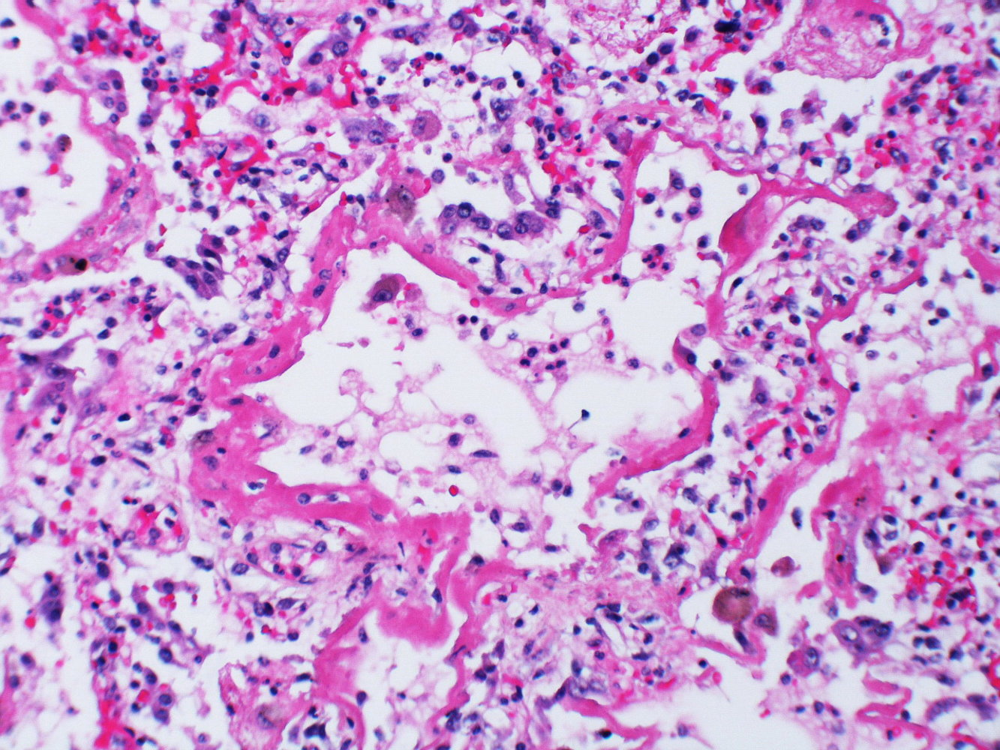

ARDS (acute exudative phase)

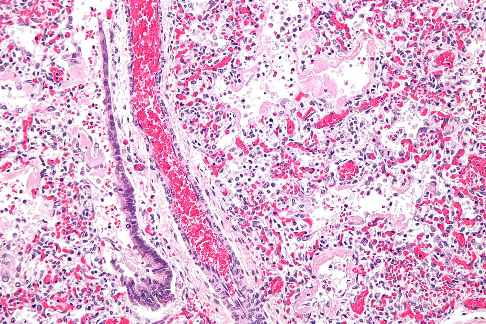

Hyaline membranes in ARDS

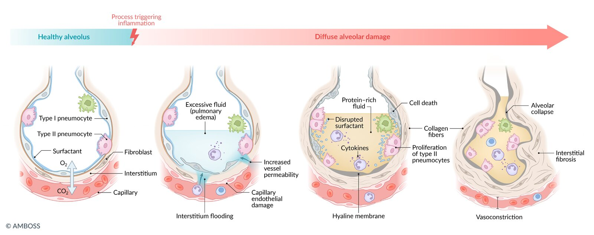

Pathophysiology of acute respiratory distress syndrome (ARDS)

---

## Clinical features

* Acute <u>dyspnea</u>

* <u>Tachypnea</u> and <u>tachycardia</u>

* <u>Cyanosis</u>

* Diffuse <u>crackles</u>

* <u>Fever</u>, <u>cough</u>, and <u>chest pain</u> may also be present.

---

## Diagnosis

### Approach [[4]](https://coursology-qbank.com/amboss/article/y-Yd-7)[[8]](https://coursology-qbank.com/amboss/article/UKdbfI0)

ARDS is a diagnosis of exclusion.

* Consider ARDS in patients with acute-onset <u>respiratory failure</u> and a potential trigger.

* Order <u>chest x-ray</u> to evaluate for bilateral infiltrates.

* Perform <u>ABG analysis</u> and calculate the <u>PaO2/FiO2 ratio</u> to confirm the diagnosis and assess severity.

* Consider additional testing (e.g., CT chest, <u>echocardiography</u>, and <u>BNP</u>) to:

* Identify triggers

* Rule out differential diagnoses

* Assess for complications

### Global definition of ARDS [[1]](https://coursology-qbank.com/amboss/article/TKd6fI0)

The <u>Global definition of ARDS</u> requires the presence of all of the following:

* Acute-onset <u>respiratory failure</u>

* Within one week of a confirmed trigger (e.g., <u>sepsis</u>, <u>pneumonia</u>) and/or of worsening respiratory symptoms

* Cannot be fully accounted for by <u>heart failure</u> or <u>fluid overload</u>

* Bilateral opacities on <u>chest x-ray</u>, CT, or <u>ultrasound</u>

* Similar appearance to <u>pulmonary edema</u>

* Findings cannot be fully attributed to <u>pleural effusions</u>, lobar or <u>lung</u> collapse, and/or <u>nodules</u>

* <u>Hypoxemia</u>

* Measurements

* <u>PaO2</u>/<u>FiO2</u>≤ 300 mm Hg (preferred)

* <u>SpO2/FiO2</u>≤ 315 mm Hg if <u>SpO2</u> is ≤ 97% (alternative if <u>ABG</u> is not available)

* Severity categories (intubated ARDS only)

* Mild ARDS: <u>PaO2/FiO2</u>201–300 mm Hg and/or <u>SpO2/FiO2</u>235–315 mm Hg

* Moderate ARDS: <u>PaO2/FiO2</u>101–200 mm Hg and/or <u>SpO2/FiO2</u>148–235 mm Hg

* Severe ARDS: <u>PaO2/FiO2</u>≤ 100 mm Hg and/or <u>SpO2/FiO2</u>≤ 148 mm Hg

* <u>Respiratory support</u> required

* Intubated ARDS

* Nonintubated ARDS

* <u>NIPPV</u> or <u>CPAP</u> with ≥ 5 cm H2O <u>PEEP</u> [[1]](https://coursology-qbank.com/amboss/article/TKd6fI0)

* <u>High-flow nasal cannula oxygen therapy</u> (<u>HFNC</u>) with a flow of ≥ 30 L/minute

> [!NOTE]
> ARDS diagnostic criteria include: Abnormal <u>x-ray</u>, Respiratory failure < 1 week after a known or suspected trigger, Decreased <u>PaO2/FiO2</u>, Support required for respiration.

> [!TIP]
> In resource-limited settings, ARDS may be diagnosed in patients who are not currently receiving <u>respiratory support</u> but meet the other three criteria. [[1]](https://coursology-qbank.com/amboss/article/TKd6fI0)

### Imaging

<u>Chest x-ray</u> is usually sufficient for diagnosis. However, distinguishing between ARDS and <u>CHF</u> can be challenging. In these cases, <u>correlation</u> with other tests (e.g., CT chest, <u>lung</u> <u>ultrasound</u>, <u>echocardiogram</u>) may be useful.

#### <u>Chest x-ray</u> [[9]](https://coursology-qbank.com/amboss/article/zdbrss)[[10]](https://coursology-qbank.com/amboss/article/ReblAs)

* Indications: all patients suspected of having ARDS

* Acute findings (1–7 days) 

* Often normal in the first 24 hours

* Diffuse bilateral symmetrical infiltrates

* In severe cases: bilateral attenuations that make the <u>lung</u> appear white on <u>x-ray</u> (“<u>white lung</u>”)

* <u>Air bronchograms</u> may be visible.

* Intermediate (8–14 days) to late (> 15 days) findings

* Typical course: Acute features remain stable, then resolve.

* <u>Fibrotic</u> course: Reticular opacities begin to appear and may become permanent.

* Findings supportive of ARDS rather than <u>CHF</u>

* Predominantly peripheral opacities

* Small or absent <u>pleural effusions</u>

* No <u>cardiomegaly</u> or <u>septal lines</u>

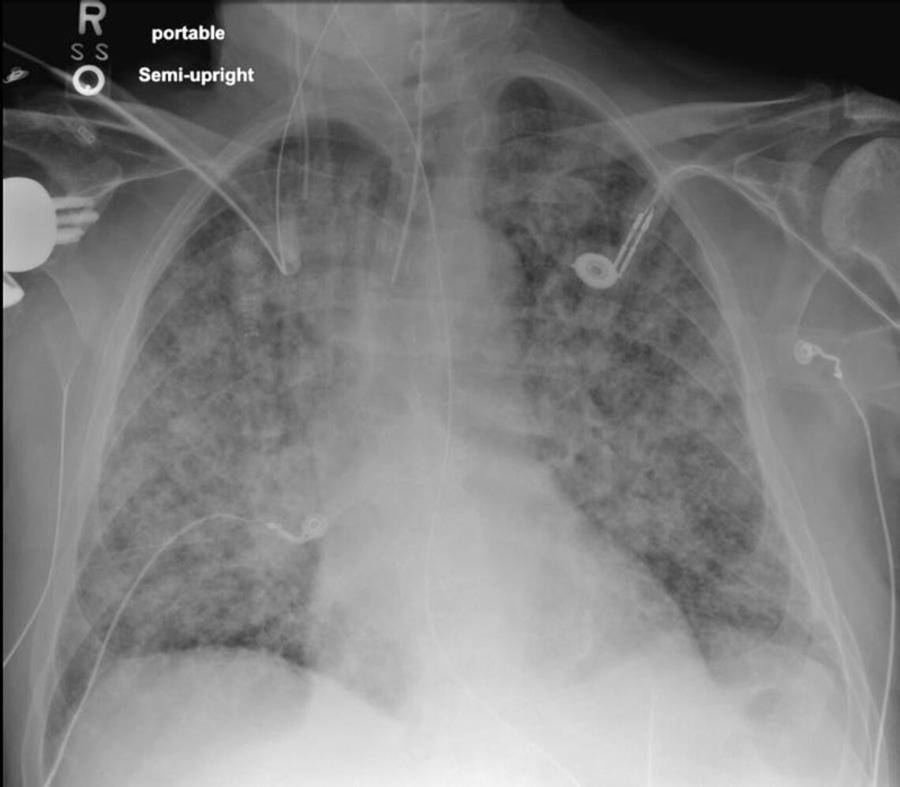

Noncardiogenic edema

Diffuse airspace opacification

Acute lung injury after transfusion

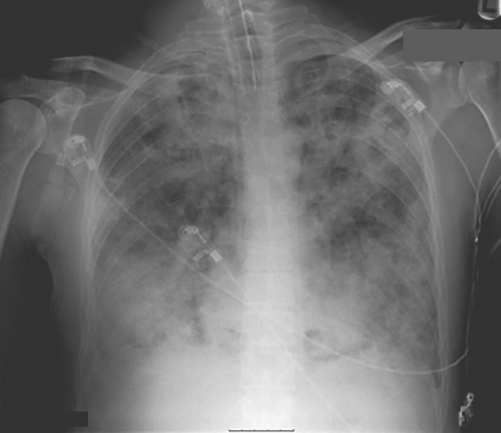

Opacities in setting of ARDS

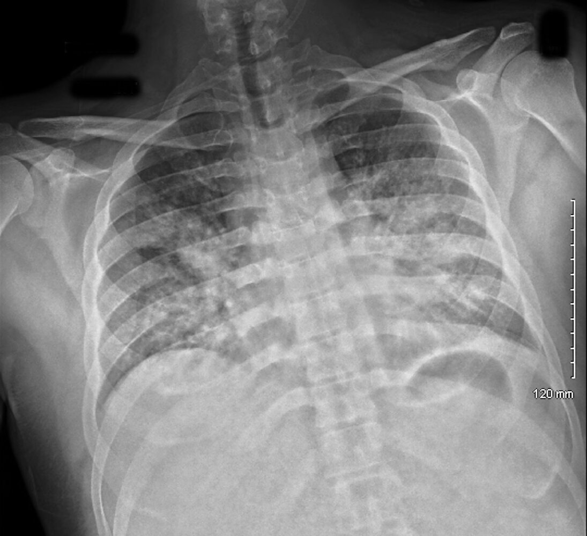

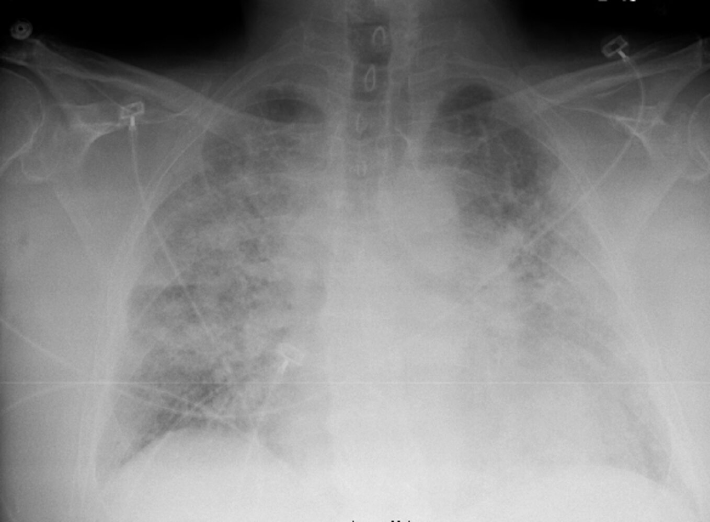

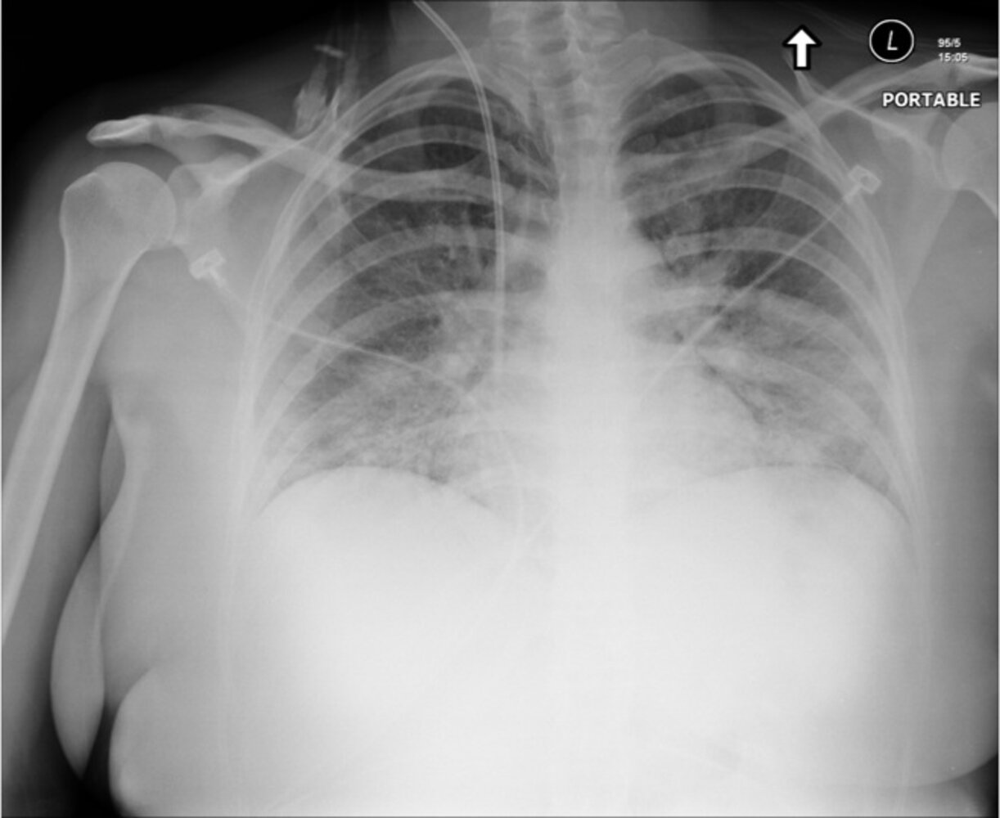

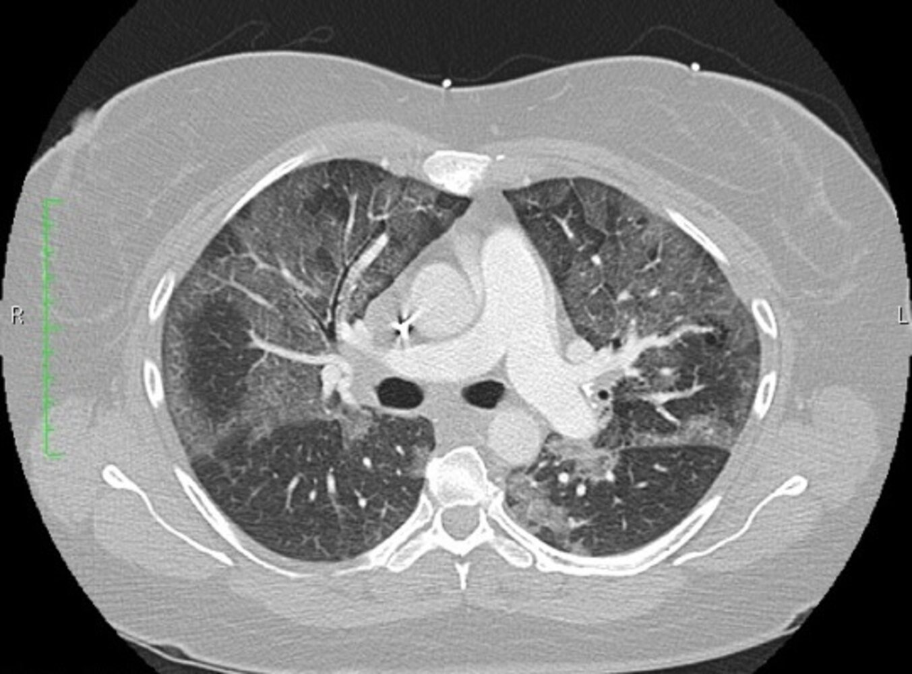

Bilateral ground-glass opacification

#### CT chest without contrast [[9]](https://coursology-qbank.com/amboss/article/zdbrss)[[10]](https://coursology-qbank.com/amboss/article/ReblAs)[[11]](https://coursology-qbank.com/amboss/article/FZbgWH)

* Indications: may be used if <u>chest x-ray</u> findings are insufficient or to further investigate for underlying causes or complications

* Acute findings (1–7 days)

* Symmetrical <u>ground-glass opacities</u> are the most important finding.

* Gravity-dependent density gradient 

* The <u>lungs</u> may appear normal in nondependent regions.

* Dense consolidation in <u>dependent regions</u>

* Bronchial dilatation may be visible.

* Additional findings may include small <u>pleural effusions</u>, <u>air bronchograms</u> (see “<u>Chest x-ray</u>” above).

* Intermediate (8–14 days) to late (> 15 days) findings: a phase of stability is followed either by resolution or progressive development of <u>fibrosis</u>

* Mixed findings may be seen.

* Potential long-term persistence of <u>ground-glass opacities</u>

* Cysts and <u>bullae</u> may develop.

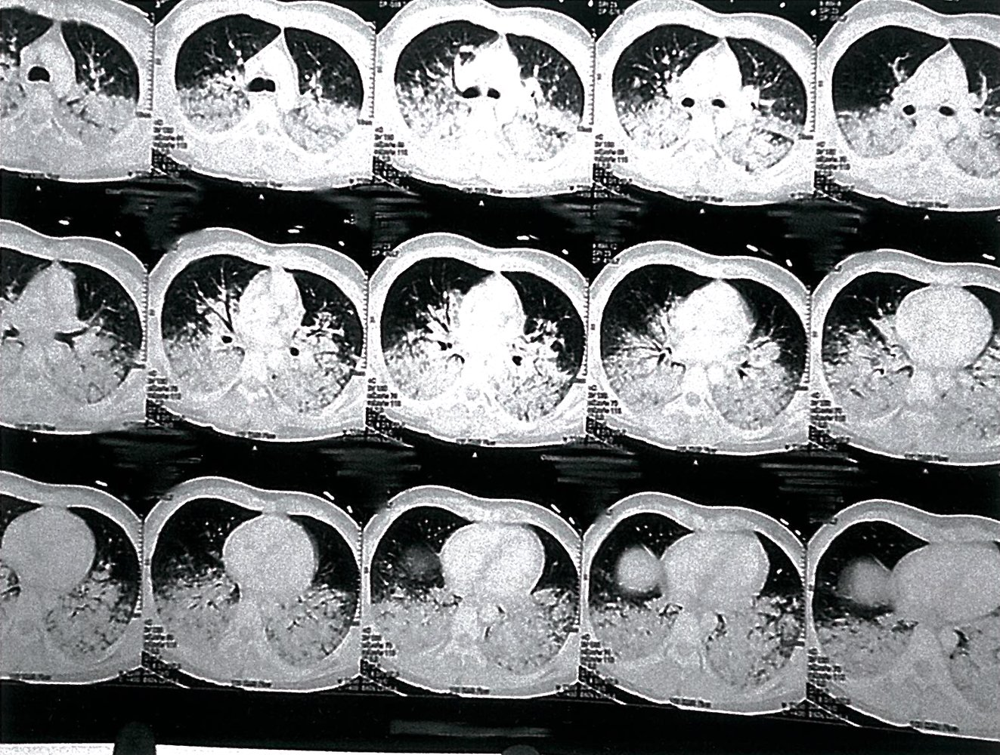

Acute respiratory distress syndrome (ARDS)

#### <u>Lung</u> <u>ultrasound</u> [[1]](https://coursology-qbank.com/amboss/article/TKd6fI0)[[11]](https://coursology-qbank.com/amboss/article/FZbgWH)

* Indications: may be helpful in differentiating between <u>cardiogenic pulmonary edema</u> and ARDS

* Key findings

* Bilateral <u>B pattern</u>

* C pattern (consolidation)

* Abnormal <u>pleural line</u> (thickening, irregular pattern, and/or alterations in <u>lung sliding</u>)

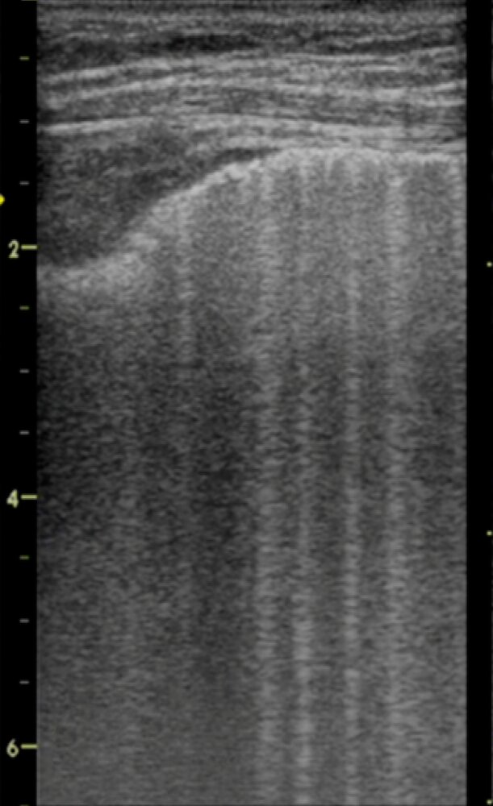

Multiple B-lines on lung ultrasound

### <u>Laboratory studies</u> [[11]](https://coursology-qbank.com/amboss/article/FZbgWH)

* <u>Arterial blood gas</u>

* <u>Hypoxemic respiratory failure</u> (↓ <u>PaO2</u>) and, initially, <u>respiratory alkalosis</u> (↑ <u>pH</u>) 

* <u>PaO2</u>/<u>FiO2</u> ≤ 300 mm Hg

* Increased <u>A-a gradient</u>

* With disease progression, <u>hypercapnic respiratory failure</u> (↑ <u>PaCO2</u>; ↓ <u>pH</u>) may develop due to respiratory exhaustion.

* Additional <u>laboratory studies</u> to consider

* Underlying causes/triggers

* <u>CBC</u>: <u>leukocytosis</u> in <u>sepsis</u> or <u>pneumonia</u>

* <u>Lipase</u>: elevated in <u>pancreatitis</u>

* <u>Blood cultures</u>: to identify <u>bacteremia</u>

* <u>Sputum</u> <u>gram stain</u> and culture: to identify bacterial <u>pneumonia</u>

* Advanced tests: urine <u>antigen</u> testing, <u>serologic tests</u> (see “Diagnostics” in <u>pneumonia</u>)

* Differential diagnoses

* <u>BNP</u>: to evaluate for <u>heart failure</u>  [[10]](https://coursology-qbank.com/amboss/article/ReblAs)

* <u>D-dimer</u>: to evaluate for <u>pulmonary embolism</u> (in patients with low to moderate <u>pretest probability of PE</u>)

* <u>Troponin</u>: to evaluate for cardiac <u>ischemia</u>

* Complications; see also:

* <u>Diagnosis of AKI</u>

* <u>Diagnosis of sepsis</u>

* <u>Diagnosis of DIC</u>

### Additional diagnostic studies  [[11]](https://coursology-qbank.com/amboss/article/FZbgWH)

* <u>ECG</u>: Signs of <u>STEMI</u>, <u>LVH</u>, or <u>cardiac arrhythmias</u> may indicate <u>CHF</u>.

* <u>Echocardiography</u>: to exclude or assess the degree of <u>heart failure</u> [[10]](https://coursology-qbank.com/amboss/article/ReblAs)

* <u>Bronchoscopy</u> with <u>bronchoalveolar lavage</u> (<u>BAL</u>) [[11]](https://coursology-qbank.com/amboss/article/FZbgWH)

* Useful for infections that are hard to diagnose, inflammatory disease (e.g., <u>vasculitis</u>), and cancer

* <u>BAL</u> samples can be tested with Giemsa/<u>Gram staining</u> as well as specialized cultures for intracellular bacteria, <u>viruses</u>, and fungi.

* <u>Right heart catheterization</u>

* To exclude <u>CHF</u> in the absence of any <u>risk factors</u>

* <u>PCWP</u> > 18 mm Hg is considered to confirm the presence of cardiac insufficiency. [[10]](https://coursology-qbank.com/amboss/article/ReblAs)

* <u>Lung</u> <u>biopsy</u>: consider in rare cases [[11]](https://coursology-qbank.com/amboss/article/FZbgWH)

* To evaluate the stage of <u>lung</u> <u>fibrosis</u> after a prolonged ARDS course and decide whether treatment with <u>steroids</u> may be indicated [[11]](https://coursology-qbank.com/amboss/article/FZbgWH)

* Indicated if other studies (e.g., <u>BAL</u>, <u>blood cultures</u>) are inconclusive

---

## Differential diagnoses

* <u>Cardiogenic pulmonary edema</u>

* Acute exacerbations of <u>interstitial lung diseases</u>

* <u>Transfusion-related acute lung injury</u> (<u>TRALI</u>)

* <u>Transfusion-associated circulatory overload</u> (<u>TACO</u>)

* See also <u>differential diagnoses of dyspnea</u>.

The differential diagnoses listed here are not exhaustive.

---

## Management

### Approach [[8]](https://coursology-qbank.com/amboss/article/UKdbfI0)

* Admit all patients with ARDS to the <u>ICU</u>.

* Address <u>hypoxemia</u>.

* See “<u>Oxygen therapy</u>” and “<u>Airway management</u>” for details.

* Apply <u>lung-protective ventilation</u> in intubated ARDS.

* Identify and treat the underlying cause (e.g., <u>pneumonia</u>, <u>pancreatitis</u>, <u>sepsis</u>).

* Initiate <u>glucocorticoids</u> in patients with intubated ARDS and/or if the cause responds to <u>glucocorticoids</u>.

* Provide <u>supportive care</u>.

* Adjust therapy based on severity.

* Moderate or <u>severe ARDS</u>: Use <u>prone positioning</u> and consider a high <u>PEEP</u> strategy.

* Early <u>severe ARDS</u>: Consider <u>neuromuscular blockers</u>.

* <u>Severe ARDS</u> not responding to therapeutic adjustments: Consider <u>ECMO</u>.

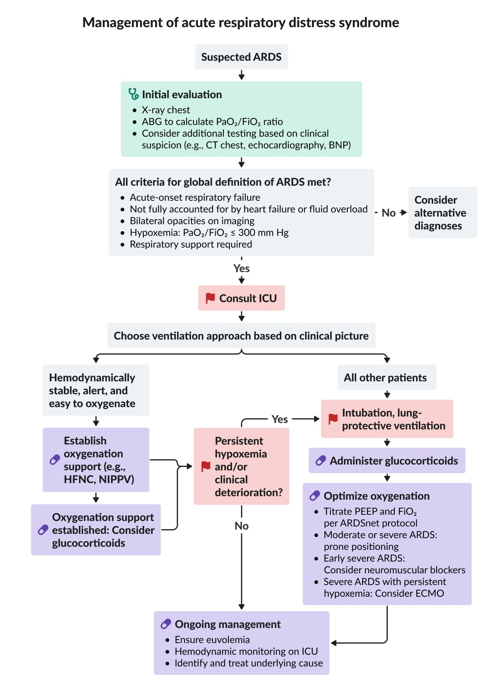

Management of acute respiratory distress syndrome

> [!TIP]
> ARDS is a life-threatening condition that usually requires early <u>lung-protective ventilation</u> (i.e., with low <u>tidal volumes</u> and low <u>plateau pressures</u>) to prevent further <u>lung</u> damage.

### All patients with ARDS [[4]](https://coursology-qbank.com/amboss/article/y-Yd-7)[[8]](https://coursology-qbank.com/amboss/article/UKdbfI0)[[12]](https://coursology-qbank.com/amboss/article/eEYxuI)[[13]](https://coursology-qbank.com/amboss/article/BUbz2G)

#### Oxygenation

<u>Hypoxemia</u> is a hallmark feature of ARDS and should be addressed immediately.

* Noninvasive: See “<u>Oxygen therapy</u>.”

* Indications [[14]](https://coursology-qbank.com/amboss/article/QNWuaN0)

* May be considered for hemodynamically stable, alert patients with easy to oxygenate, <u>mild ARDS</u>.

* <u>Preoxygenation</u> prior to <u>intubation</u>

* Methods: maximum <u>supplemental oxygen</u> by <u>HFNC</u>, <u>NIPPV</u>, or <u>nonrebreather mask</u>

* Invasive

* Indications: <u>respiratory failure</u> or rapid deterioration

* Methods: <u>Endotracheal intubation</u> (see “<u>Airway management</u>.”)

* <u>Rapid sequence intubation</u>

* Consider pre-oxygenation (see nonivasive methods).

#### Lung-protective ventilation [[8]](https://coursology-qbank.com/amboss/article/UKdbfI0)[[12]](https://coursology-qbank.com/amboss/article/eEYxuI)

All patients with intubated ARDS should be treated with <u>lung-protective ventilation</u> to decrease the risk of <u>VILI</u>.  [[12]](https://coursology-qbank.com/amboss/article/eEYxuI)

* General initial settings include:

* Low <u>tidal volume</u> (Vt 4–8 mL/kg) using <u>predicted body weight</u>: prevents alveolar distention [[8]](https://coursology-qbank.com/amboss/article/UKdbfI0)

* Low <u>plateau pressure</u> (<u>PPlat</u> ≤ 30 cm H2O): prevents <u>barotrauma</u>

* <u>PEEP</u> ≥ 5 cm H2O: allows for alveolar recruitment

* Allow for <u>permissive hypercapnia</u>.

* <u>PEEP</u> and <u>FiO2</u> can be adjusted to recruit collapsed <u>alveoli</u> and improve oxygenation.

* Oxygenation goal: <u>PaO2</u>55–80 mm Hg or <u>SpO2</u> 88–95%

* Avoid <u>oxygen toxicity</u>: use lowest <u>FiO2</u> possible

* See “<u>Lung-protective ventilation strategy</u>” in “<u>Mechanical ventilation</u>” for more information and specific parameter settings.

> [!TIP]
> A low <u>tidal volume</u> and low <u>plateau pressure</u> are the principles of <u>lung-protective ventilation</u>.

#### Glucocorticoids in ARDS [[8]](https://coursology-qbank.com/amboss/article/UKdbfI0)[[15]](https://coursology-qbank.com/amboss/article/bJdHsI0)

<u>Glucocorticoids</u> likely reduce mortality and the duration of <u>mechanical ventilation</u> in patients with ARDS.

* Optimal regimen is not established; consider: 

* <u>Dexamethasone</u> (<u>off-label</u>) DOSAGE until <u>extubation</u> [[15]](https://coursology-qbank.com/amboss/article/bJdHsI0)[[16]](https://coursology-qbank.com/amboss/article/56dilI0)

* OR <u>methylprednisolone</u> (<u>off-label</u>) DOSAGE [[15]](https://coursology-qbank.com/amboss/article/bJdHsI0)

* Indications

* Intubated ARDS

* A cause that responds to <u>glucocorticoids</u>; see also:  [[8]](https://coursology-qbank.com/amboss/article/UKdbfI0)

* <u>Treatment of pneumonia</u>

* <u>Management of hospitalized patients with COVID-19</u>

* <u>Treatment of pneumocystis pneumonia</u>

* Precaution: may be harmful if initiated after > 2 weeks of <u>mechanical ventilation</u>

#### <u>Supportive care</u>

* Conservative fluid management

* Consider <u>furosemide</u> for <u>volume overload</u>.

* <u>VTE prophylaxis</u>

* Optimize nutrition.

* Consider <u>stress ulcer prophylaxis</u>.

### Moderate to <u>severe ARDS</u> [[8]](https://coursology-qbank.com/amboss/article/UKdbfI0)[[14]](https://coursology-qbank.com/amboss/article/QNWuaN0)[[17]](https://coursology-qbank.com/amboss/article/A-YR-7)[[18]](https://coursology-qbank.com/amboss/article/xebEaG)

#### Prone positioning [[19]](https://coursology-qbank.com/amboss/article/FBYgc7)[[20]](https://coursology-qbank.com/amboss/article/HebKZG)[[21]](https://coursology-qbank.com/amboss/article/PNWWYN0)

<u>Prone positioning</u> should be initiated promptly after stabilization.

* Effects

* Reduces <u>V/Q mismatch</u> from dependent <u>atelectasis</u>

* Increases <u>lung compliance</u>

* Indications [[18]](https://coursology-qbank.com/amboss/article/xebEaG)

* <u>P/F ratio</u> < 150 mm Hg

* <u>Pulmonary edema</u>

* <u>Absolute contraindication</u>: <u>unstable spinal fracture</u>

* <u>Relative contraindications</u> include: [[14]](https://coursology-qbank.com/amboss/article/QNWuaN0)

* <u>Hemodynamic instability</u>

* Severe trauma, recent <u>sternotomy</u>, other <u>unstable fractures</u>

* <u>↑ ICP</u>

* <u>Massive hemoptysis</u>

* Duration: typically done for at least 12–16 hours/day

* Complications include:

* <u>ET tube</u> displacement or obstruction

* Abnormal <u>vital signs</u>: ↓ <u>SpO2</u>, ↓ HR, ↓ BP

* <u>Hemoptysis</u>

* Pressure injuries

* Other: facial <u>edema</u>, <u>ocular injury</u> , <u>venous stasis</u>

> [!WARNING]
> An <u>unstable spinal fracture</u> is the only <u>absolute contraindication</u> to <u>prone positioning</u>. [[21]](https://coursology-qbank.com/amboss/article/PNWWYN0)

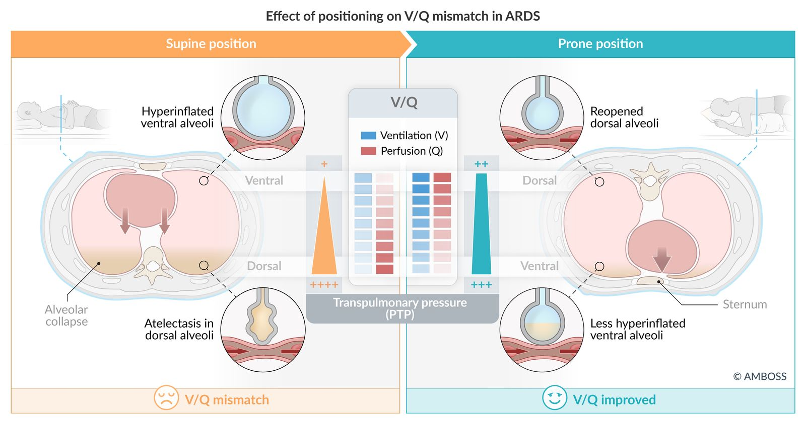

Effect of positioning on V/Q mismatch: ARDS

#### High <u>PEEP</u> [[8]](https://coursology-qbank.com/amboss/article/UKdbfI0)

* Methods 

* Oxygenation-based <u>PEEP</u> <u>titration</u>

* <u>Plateau pressure</u>-based <u>PEEP</u> <u>titration</u>

* <u>Titration</u> to maximal compliance

* Effects

* <u>Lung recruitment maneuver</u>: increases the surface area of <u>lung</u> available for <u>gas exchange</u>  [[8]](https://coursology-qbank.com/amboss/article/UKdbfI0)

* Improves oxygenation and is thought to reduce mortality

#### <u>FiO2</u>/<u>PEEP</u> <u>titration</u>

|  ARDSnet protocol for FiO2/PEEP titration  [[22]](https://coursology-qbank.com/amboss/article/7BY4X7)[[23]](https://coursology-qbank.com/amboss/article/HBYKX7)[[24]](https://coursology-qbank.com/amboss/article/fUbkcG)  |  |
| --- | --- |
|  Low <u>PEEP</u>/<u>FiO2</u> strategy: for patients with <u>mild ARDS</u>  |  |
| <u>FiO2</u> (%) | <u>PEEP</u> (cm H2O) |
| 30 | 5 |
| 40 | 5 |
| 40 | 8 |
| 50 | 8 |
| 50 | 10 |
| 60 | 10 |
| 70 | 10 |
| 70 | 12 |
| 70 | 14 |
| 80 | 14 |
| 90 | 14 |
| 90 | 16 |
| 90 | 18 |
| 100 | 18–24 |
|  High PEEP/FiO2 strategy: for patients with moderate to <u>severe ARDS</u>   |  |
| 30 | 5 |
| 30 | 8 |
| 30 | 10 |
| 30 | 12 |
| 30 | 14 |
| 40 | 14 |
| 40 | 16 |
| 50 | 16 |
| 50 | 18 |
| 50–80 | 20 |
| 80 | 22 |
| 90 | 22 |
| 100 | 22–24 |

#### <u>Neuromuscular blockers</u> [[8]](https://coursology-qbank.com/amboss/article/UKdbfI0)

* Consider within the first 48 hours for patients with a <u>PaO2/FiO2 ratio</u> < 150 mm Hg (i.e., early <u>severe ARDS</u>).  [[8]](https://coursology-qbank.com/amboss/article/UKdbfI0)[[18]](https://coursology-qbank.com/amboss/article/xebEaG)

* Optimal agent not established; <u>cisatracurium</u> may be considered.

* See “<u>Muscle relaxants</u>” for agents and dosages.

### <u>Severe ARDS</u> with persistent <u>hypoxemia</u> [[8]](https://coursology-qbank.com/amboss/article/UKdbfI0)[[14]](https://coursology-qbank.com/amboss/article/QNWuaN0)

The following interventions should only be considered in consultation with a specialist and if standard therapy is unsuccessful.

* Consider alternative <u>ventilator settings</u> (e.g., mode, parameters, or overall strategy): See “<u>Mechanical ventilation</u>.”

* Consider <u>ECMO</u> in patients with early ARDS (< 7 days) and:   [[18]](https://coursology-qbank.com/amboss/article/xebEaG)[[25]](https://coursology-qbank.com/amboss/article/2KdTfI0)

* Very severe <u>hypoxemia</u> (<u>PaO2/FiO2</u>< 80 mm Hg) or <u>hypercapnia</u> (<u>pH</u> < 7.25 and <u>PaCO2</u>≥ 60 mm Hg) despite optimal management (e.g., high <u>PEEP</u>, <u>neuromuscular blockers</u>, <u>prone positioning</u>)

* AND/OR if the <u>plateau pressure</u> becomes dangerously high (e.g., > 30 cm H2O)

* Use a monitoring tool (e.g., <u>Murray score</u>) to identify patients at risk for requiring <u>ECMO</u>, enabling transfer to an <u>ECMO</u> unit before deterioration. [[25]](https://coursology-qbank.com/amboss/article/2KdTfI0)

|  Murray score for ARDS [[26]](https://coursology-qbank.com/amboss/article/t-YX_7)  |  |  |
| --- | --- | --- |
| Clinical parameter | Findings | Points assigned |
| Alveolar consolidation on <u>x-ray</u> | None | 0 |
| 1 quadrant involved | 1 |  |
| 2 quadrants involved | 2 |  |
| 3 quadrants involved | 3 |  |
| 4 quadrants involved | 4 |  |
|  <u>P/F ratio</u> in mm Hg  | > 300 | 0 |
| 225–299 | 1 |  |
| 175–224 | 2 |  |
| 100–174 | 3 |  |
| ≤ 100 | 4 |  |
| <u>PEEP</u> in cm H2O | ≤ 5 | 0 |
| 6–8 | 1 |  |
| 9–11 | 2 |  |
| 12–14 | 3 |  |
| > 15 | 4 |  |
| Respiratory compliance in mL/cm H2O | > 80 | 0 |
| 60–79 | 1 |  |
| 40–59 | 2 |  |
| 20–39 | 3 |  |
| < 19 | 4 |  |
|  Interpretation: Add up the total points and divide the total by the number of parameters present.    * 0 points = no <u>lung injury</u>  * 1–2.5 points = mild to moderate <u>lung injury</u>  * > 2.5 points = severe <u>lung injury</u>     |  |  |

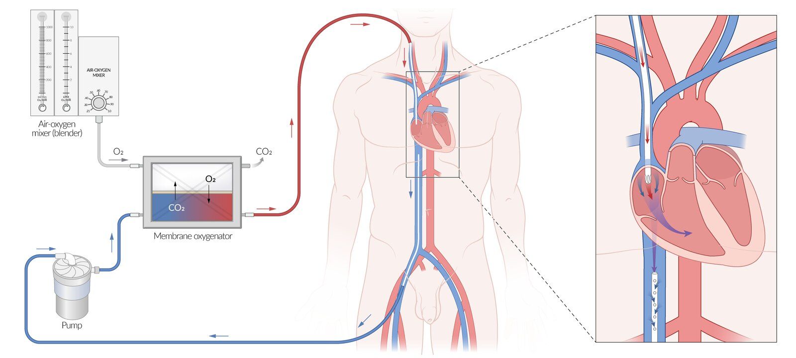

Venovenous extracorporeal membrane oxygenation

---

## Prognosis

* Disease course

* Most patients begin to improve after the first 1–3 weeks and symptoms usually resolve fully.

* Some develop <u>interstitial</u> <u>pulmonary fibrosis</u> with prolonged ventilator dependence and <u>restrictive lung disease</u>.

* In patients with simultaneous <u>multiorgan failure</u>, the <u>mortality rate</u> is 30–50%. [[27]](https://coursology-qbank.com/amboss/article/y2bd4G)

---