# Acute wounds

*Categories: Clinical knowledge > Surgery > Preoperative and postoperative care > Acute wounds*

[Original Article Link](https://coursology-qbank.com/amboss/article/ph0LUf)

---

## Summary

Acute wounds are disruptions of the normal structure and function of <u>skin</u> and underlying <u>soft tissue</u> caused by trauma or chronic mechanical <u>stress</u>. Acute wounds may be open or closed. All wounds should be assessed for the extent of injury, degree of contamination, and injury to adjacent neurovascular structures and bones. Patients with multiple wounds should be screened for concurrent injuries to deeper structures or organs, as well as complications such as <u>rhabdomyolysis</u>, <u>compartment syndrome</u>, and <u>venous thromboembolism</u>. <u>Open wounds</u> are managed with cleaning, removal of devitalized tissue, and, if feasible, wound closure. The type and timing of wound closure depend on the degree of contamination and how much time has passed since the injury. Options for wound closure range from glue, <u>wound closure strips</u>, and <u>suturing</u> to complex plastic <u>surgery</u> repairs such as <u>skin grafting</u>. Closed musculoskeletal wounds are managed according to the <u>POLICE principle</u>. Acute wounds typically proceed through an organized and predictable process of tissue repair. Wound complications include <u>hematomas</u>, <u>seromas</u>, infection, and delayed healing. Complications of abdominal surgical wounds additionally include <u>wound dehiscence</u> and <u>evisceration</u>, and <u>fistulas</u> of the <u>GI tract</u>.

<u>Needlestick injuries</u>, <u>chronic wounds</u>, and <u>bite wounds</u> are detailed in separate articles.

---

## Classification

### Types of acute wounds [[1]](https://coursology-qbank.com/amboss/article/8ZaOWQ)

* <u>Stab wounds</u>

* Abrasions: <u>superficial</u> <u>skin</u> injuries caused by rubbing, scraping, and/or irritation

* Lacerations: <u>skin</u> compression and splitting with irregular and <u>macerated</u> edges

* Avulsion injury [[2]](https://coursology-qbank.com/amboss/article/NCc-He0)

* Traumatic detachment of the <u>skin</u> and <u>subcutaneous fat</u> caused by a shearing force

* Can range from the detachment of small <u>skin</u> flaps to complete <u>degloving</u> of an extremity

* Bruises

* Rupture of <u>blood vessels</u> within the <u>skin</u> as a result of direct trauma, with the surface of the <u>skin</u> remaining intact

* Can also occur in muscles, bones, and internal organs

### Open vs. <u>closed wounds</u> [[3]](https://coursology-qbank.com/amboss/article/qI0Cdh)

* Open wound: a wound with <u>skin</u> breakage and exposure of underlying tissue to the outside environment

* <u>Lacerations</u>

* <u>Gunshot wounds</u>

* Punctures

* Closed wound: a wound with intact <u>skin</u>, and underlying tissue not directly exposed to the outside environment 

* <u>Contusions</u>

* <u>Hematomas</u>

* <u>Crush injuries</u>

* <u>Blunt trauma</u>

---

## Open wounds

### Approach

See “<u>Initial management of acute wounds</u>” for initial assessment and emergency measures.

* For all <u>open wounds</u>, perform <u>wound irrigation</u> and <u>wound debridement</u> of devitalized tissue. [[9]](https://coursology-qbank.com/amboss/article/MZWMXP0)

* Consider <u>closure of acute open wounds</u> depending on wound characteristics.

* <u>Primary wound closure</u> is indicated for recently sustained, clean, uninfected wounds that have edges that can be easily approximated.

* Consider <u>secondary wound closure</u> or <u>tertiary wound closure</u> for all other wounds (e.g., infected, contaminated, wide or irregular edges, delayed presentation).

* Identify if the wound should be repaired by a specialist (see “Specialist consults”).

* Consider referral to plastic <u>surgery</u> for <u>skin grafting</u> for wounds with extensive tissue loss.

* Consider <u>antibiotics for acute open wounds</u> depending on the wound and patient characteristics.

* Consider prophylaxis for <u>wounds at high risk of infection</u> including certain <u>bite wounds</u>.

* Treat infected wounds.

* Select <u>antibiotics</u> based on the likely pathogens  and local resistance patterns.

* Consider <u>tetanus prophylaxis</u> (<u>tetanus toxoid</u> DOSAGE ± <u>human tetanus immunoglobulin</u> DOSAGE).  [[4]](https://coursology-qbank.com/amboss/article/35YSPp)[[10]](https://coursology-qbank.com/amboss/article/6zcjFU0)

> [!TIP]
> When evaluating a wound for primary or secondary closure, consider the length of time that has elapsed since injury, wound characteristics, and comorbidities.

> [!WARNING]
> Refer patients with the following wounds for repair by a specialist: multiple, large, and/or complex wounds (e.g., <u>facial wounds</u> involving the eyelids, extensive hand injuries); wounds with damage to underlying structures (e.g., vessels, nerves, <u>tendons</u>); and wounds in the genitourinary tract.

---

## Wound closure

See “<u>Wound closure of bite wounds</u>” for guidance specific to <u>bite wounds</u>.

### Primary wound closure

* Definition: closure of recent wounds by approximation of the wound edges, allowing for <u>healing by primary intention</u>

* Indications

* Recent, clean wounds that have a low risk of infection

* For details, see “<u>Indications for primary wound closure</u>.”

* Procedure: : See “<u>Wound closure techniques</u>.”

* <u>Antibiotics</u> [[14]](https://coursology-qbank.com/amboss/article/TfX6lx)

* Minor, uncontaminated injuries: <u>Antibiotic prophylaxis</u> is not routinely required.

* <u>Wounds at high risk of infection</u>: Consider <u>antibiotic prophylaxis</u>.

* <u>Wound healing</u>

* Occurs by <u>primary intention</u>

* <u>Wound healing</u> occurs with minimal inflammation and minimal to no <u>granulation tissue</u> formation.

* Organ-specific tissue forms at the site of healing

* Minimal (hairline) <u>scar</u> formation

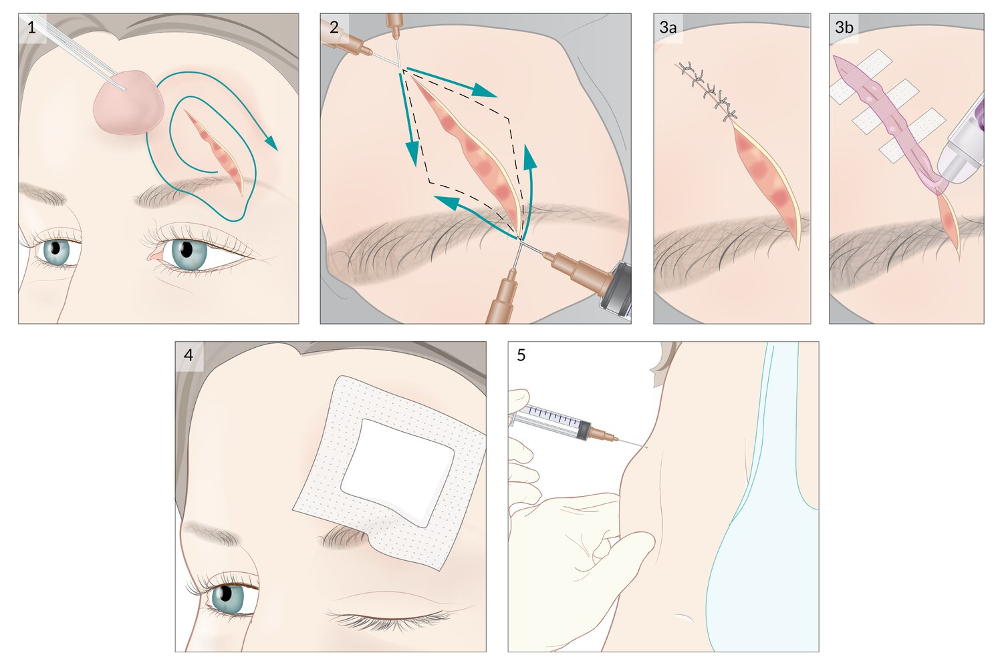

Acute wound management

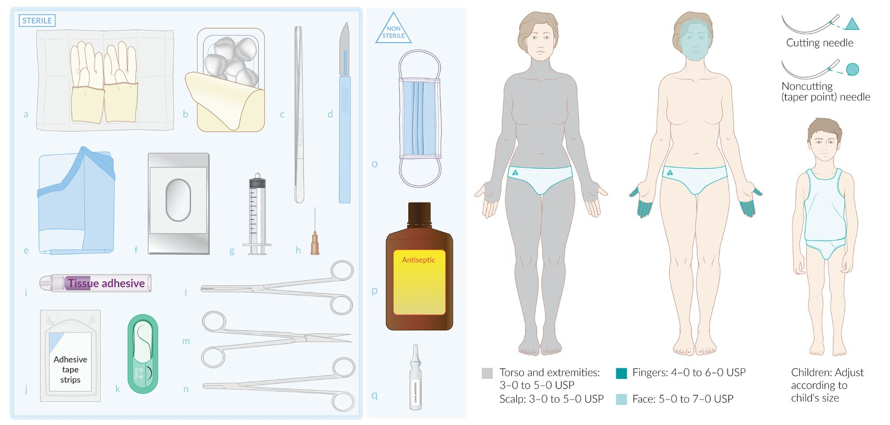

Wound management materials

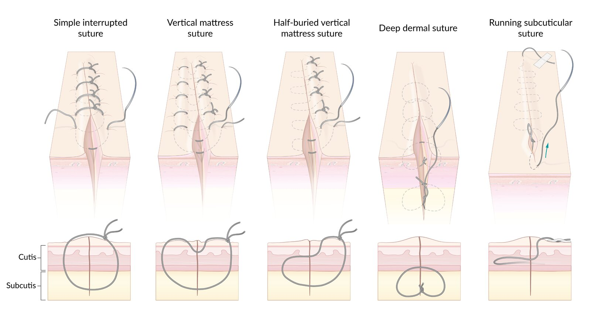

Suturing techniques

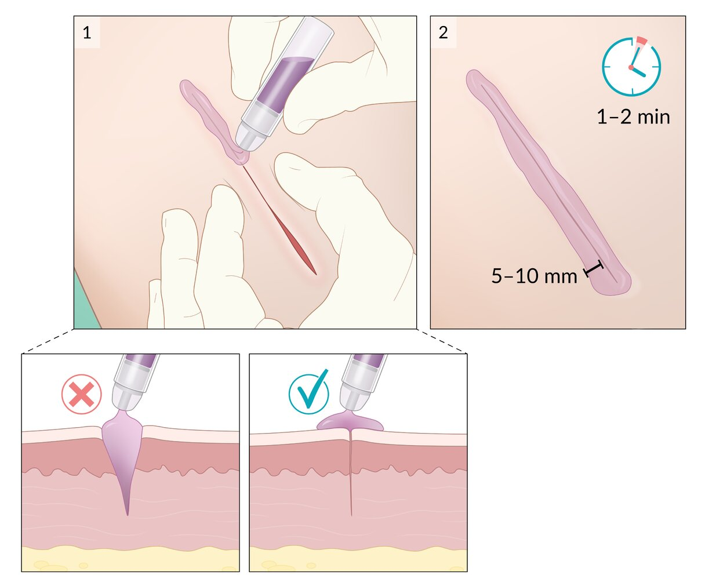

Tissue adhesive

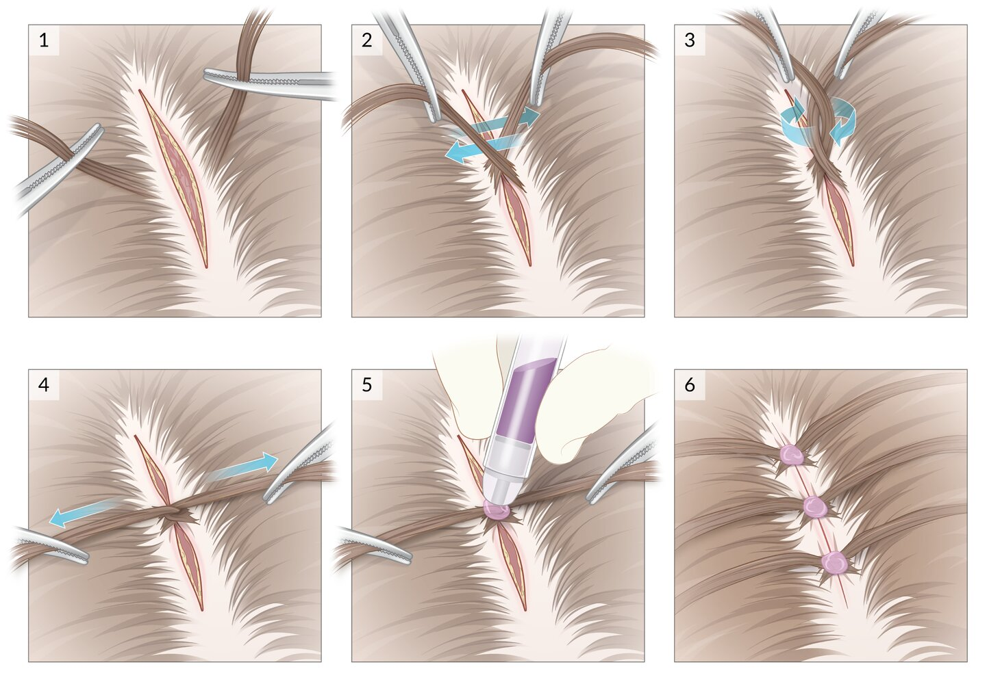

Hair apposition technique

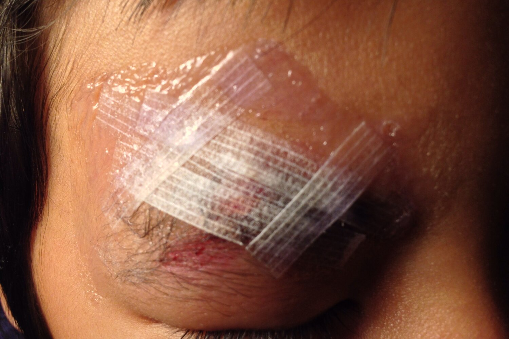

Wound closure strips

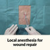

Local anesthesia for wound repair | AMBOSS

### Secondary wound closure

* Definition: leaving a wound to <u>heal by secondary intention</u> (i.e., without approximating the wound edges)

* Indications

* Infected wounds, e.g., <u>surgical site infection</u> [[15]](https://coursology-qbank.com/amboss/article/giXFIB)

* <u>Wounds at high risk of infection</u>, e.g., wounds with implanted foreign bodies  [[6]](https://coursology-qbank.com/amboss/article/hfXcNx)

* <u>Bite wounds</u> that do not meet the criteria for <u>primary closure</u> (see “<u>Bite wounds</u>” for details)

* Wounds older than the time frame within which <u>primary closure</u> can be safely performed.

* Large wounds with irregular edges that cannot be approximated without tension

* Goal: <u>debridement</u> to remove devitalized tissue; removal of contaminants and foreign bodies that may disrupt healing. [[6]](https://coursology-qbank.com/amboss/article/hfXcNx)

* Procedure [[6]](https://coursology-qbank.com/amboss/article/hfXcNx)
1. * Administer;  local, regional, or general anesthesia.
2. * Clean via pressured <u>irrigation</u> using warm, <u>isotonic saline</u>.  [[6]](https://coursology-qbank.com/amboss/article/hfXcNx)[[16]](https://coursology-qbank.com/amboss/article/ifXJNx)
3. * Perform surgical (sharp) <u>debridement</u>: removal of devitalized tissue and debris to allow for <u>wound healing</u>
4. * Ensure drainage (e.g., silicone/rubber drains, strip of gauze) of deep wounds.
5. * Apply moist dressing.
6. * Immobilize the affected extremity, if necessary.

* Further treatment

* <u>Wounds at high risk of infection</u>: Consider <u>antibiotic prophylaxis</u>.

* Infected wounds: Administer <u>antibiotics</u> (see “<u>Empiric antibiotic therapy for skin and soft tissue infections</u>”).

* Regular dressing changes

* Reevaluation for <u>delayed primary closure</u> (if needed) after ∼ 3 days

* Consider <u>negative pressure wound therapy</u> (<u>NPWT</u>) as an adjunct to stimulate the healing process for large wounds.  [[14]](https://coursology-qbank.com/amboss/article/TfX6lx)[[17]](https://coursology-qbank.com/amboss/article/gRXFmB)

* <u>Wound healing</u>

* Occurs by secondary intention

* Usually accompanied with pronounced inflammation

* Takes longer than wounds that have been repaired with <u>primary closure</u>

* Requires the formation of <u>granulation tissue</u>

* The wound bed is replaced with increased <u>proliferation</u> of <u>fibroblasts</u>.

* Pronounced <u>scar</u> formation

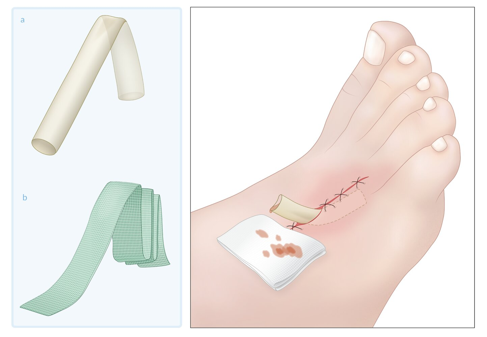

Open wound drainage system

> [!TIP]
> <u>Tetanus prophylaxis</u> is usually required for most wounds that need secondary closure.

### Tertiary wound closure (<u>delayed primary closure</u>)

* Definition: surgical closure of a wound after <u>healing by secondary intention</u> has already begun; also known as <u>healing by tertiary intention</u>

* Indications

* Clean wounds with healthy edges in patients presenting after the time frame within which <u>primary closure</u> can be safely performed.

* <u>Contaminated wounds</u> left to <u>heal by secondary intention</u> and with no signs of infection after 3–5 days  [[6]](https://coursology-qbank.com/amboss/article/hfXcNx)

* Procedure
1. * Clean the wound and perform <u>debridement</u> of any areas of devitalized tissue.
2. * Close the wound using an appropriate <u>wound closure technique</u> (e.g., <u>simple interrupted sutures</u>).

* <u>Wound healing</u>

* Occurs by tertiary intention

* Results in a larger <u>scar</u> than with primary or secondary closure due to an interruption in normal <u>wound healing</u>

> [!TIP]
> <u>Contaminated wounds</u> can be closed (i.e., by <u>delayed primary closure</u>) if there are no signs of infection after a few days of observation.

---

## Antibiotics

### Wounds at high risk of infection [[4]](https://coursology-qbank.com/amboss/article/35YSPp)[[6]](https://coursology-qbank.com/amboss/article/hfXcNx)[[22]](https://coursology-qbank.com/amboss/article/zNXrdA)

If one or more of the following high-risk features are present, <u>antibiotic prophylaxis</u> should be considered.

* Wound characteristics

* Complicated wounds, e.g., <u>crush injuries</u>, deep <u>puncture wounds</u>

* Significant contamination, e.g., with feces, saliva, or dirt

* Implanted foreign bodies

* Wound location

* Poorly vascularized areas, e.g., feet, hands

* Suspected extension to bones and <u>joints</u>, e.g., <u>open fractures</u>

* Areas with significant bacterial <u>colonization</u>, e.g., armpits, genitals, intraoral wounds  [[23]](https://coursology-qbank.com/amboss/article/MzcMtU0)

* Patient characteristics

* Advanced age

* <u>Immunosuppression</u>

* Significant comorbidities, e.g., <u>diabetes mellitus</u>

### <u>Antibiotic prophylaxis</u> [[24]](https://coursology-qbank.com/amboss/article/ZzcZrU0)

* A single dose is usually sufficient for <u>superficial</u> wounds, while deep wounds and <u>open fractures</u> may require longer regimens.

* Specific regimes depend on the type and location of the wound, e.g: 

* <u>Bite wounds</u>: See “<u>Antibiotics for bite wounds</u>.”

* Gaping intraoral <u>lacerations</u>: <u>Antibiotics</u> should cover oral flora, topical <u>antibiotics</u> (e.g., <u>bacitracin</u>) may be considered. [[4]](https://coursology-qbank.com/amboss/article/35YSPp)[[23]](https://coursology-qbank.com/amboss/article/MzcMtU0)

* <u>Puncture wounds</u> of the foot: Consider adding agents that cover <u>Pseudomonas aeruginosa</u> and/or <u>MRSA</u>. [[4]](https://coursology-qbank.com/amboss/article/35YSPp)

> [!TIP]
> Most wounds that can undergo <u>primary closure</u> do not require <u>antibiotic prophylaxis</u>, except <u>wounds at high risk of infection</u>.

### Infected wounds [[24]](https://coursology-qbank.com/amboss/article/ZzcZrU0)

* Obtain diagnostics for infection based on clinical evaluation. [[25]](https://coursology-qbank.com/amboss/article/Y1Vn2t0)[[26]](https://coursology-qbank.com/amboss/article/mAdV4s0)

* Indications

* <u>Signs of spreading wound infection</u>

* Failure to improve with antimicrobial treatment

* Specimen: <u>punch biopsy</u> (preferred) or <u>superficial</u> swab using the <u>Levine technique</u>

* Method: molecular analysis (preferred, if available) or wound culture

* See "<u>Management of infected wounds</u>."

* Specific <u>antibiotic</u> regimes may be necessary for certain <u>types of wounds</u>, including:

* Infected marine wounds  [[4]](https://coursology-qbank.com/amboss/article/35YSPp)[[10]](https://coursology-qbank.com/amboss/article/6zcjFU0)

* <u>Superficial</u> infections (e.g., <u>erysipelas</u>): Consider <u>penicillins</u> or <u>macrolides</u>.

* <u>Purulent</u> infections (e.g., <u>abscess</u>): Consider <u>penicillinase-resistant penicillins</u> or 1st generation <u>cephalosporins</u>

* Necrotizing infections, patients with <u>chronic wounds</u> or <u>immunocompromise</u>: <u>broad-spectrum antibiotics</u> with activity against <u>anaerobes</u>, gram-positive aerobes, and <u>gram-negative bacteria</u>

* Infected <u>bite wounds</u>: See “<u>Antibiotic prophylaxis and therapy for bite wounds</u>.”

---

## Closed wounds

* See “<u>Initial management of acute wounds</u>” for initial assessment, emergency measures, and diagnostics.

* Ensure proper <u>analgesia</u> (see “<u>Pain management</u>” for drugs and dosages).

* Treat concomitant injuries.

* Screen for and manage complications (e.g., <u>compartment syndrome</u>, <u>deep vein thrombosis</u>, <u>rhabdomyolysis</u>) [[8]](https://coursology-qbank.com/amboss/article/xRXE6B)[[27]](https://coursology-qbank.com/amboss/article/BRXz6B)

* Minimize further inflammation: <u>POLICE principle</u> for acute musculoskeletal injuries (e.g., injuries to bones, <u>tendons</u>, or <u>ligaments</u>)  [[28]](https://coursology-qbank.com/amboss/article/ZmXZVA)

* Protection

* Optimal Loading

* Ice

* Compression

* Elevation

---

## Plastic and reconstructive surgery

### Skin grafting [[29]](https://coursology-qbank.com/amboss/article/pI0Ldh)

<u>Skin grafts</u> may be used to close wounds, prevent fluid and <u>electrolyte</u> loss, and reduce bacterial burden and infection.

#### Full thickness skin graft (<u>FTSG</u>)

* Graft: <u>epidermis</u> and <u>dermis</u> (including <u>dermal</u> appendages), usually obtained from areas of redundant and pliable <u>skin</u> (e.g., groin, <u>lateral</u> thigh, lower abdomen, <u>lateral</u> chest)

* Indications: small, uncontaminated, well-vascularized wounds

* Advantages: good postoperative cosmetic outcome

* Disadvantages: high risk of <u>necrosis</u>, secondary injury to the donor area

#### Split-thickness skin graft (<u>STSG</u>)

* Graft: <u>epidermis</u> and upper part (¼–¾) of the <u>dermis</u> (without <u>dermal</u> appendages)

* Indications: many uses; resurface large wounds and <u>mucosal</u> deficits, line cavities, close donor sites of flaps, treat large <u>chronic wounds</u>

* Advantages: heals well, only <u>superficial</u> secondary defect in donor area, which does not have to be covered

* Disadvantages: <u>scar</u> formation when graft heals, <u>skin</u> pigmentation change, tendency to contract, more fragile

* Subtype: mesh graft 

* Graft can be stretched 3–6 times its original size by grid‑like <u>incisions</u>.

* Suitable for large <u>skin</u> defects

> [!WARNING]
> <u>Skin grafts</u> are contraindicated in the case of <u>contaminated wounds</u> or insufficient blood supply.

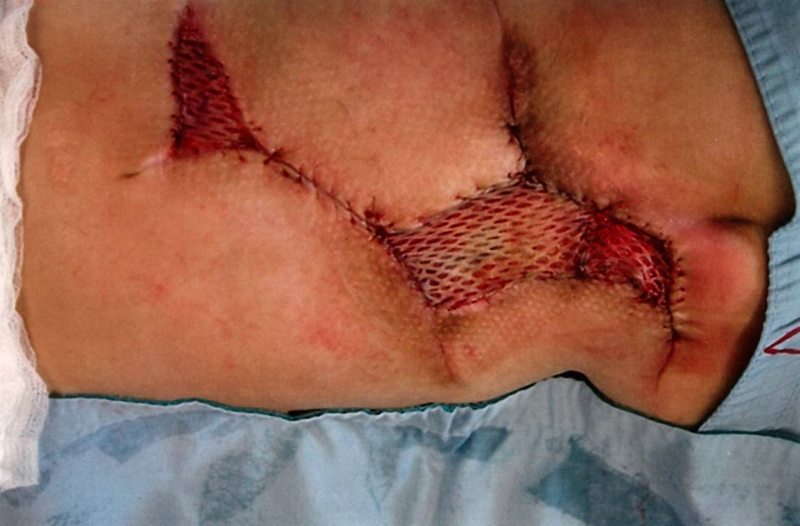

Mesh graft

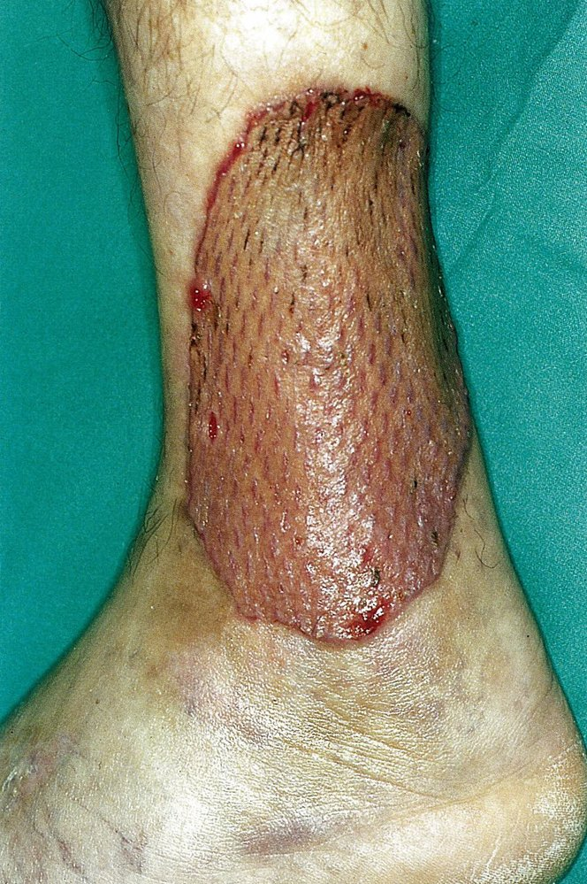

Excized venous ulcer with a split-thickness skin graft using mesh grafting

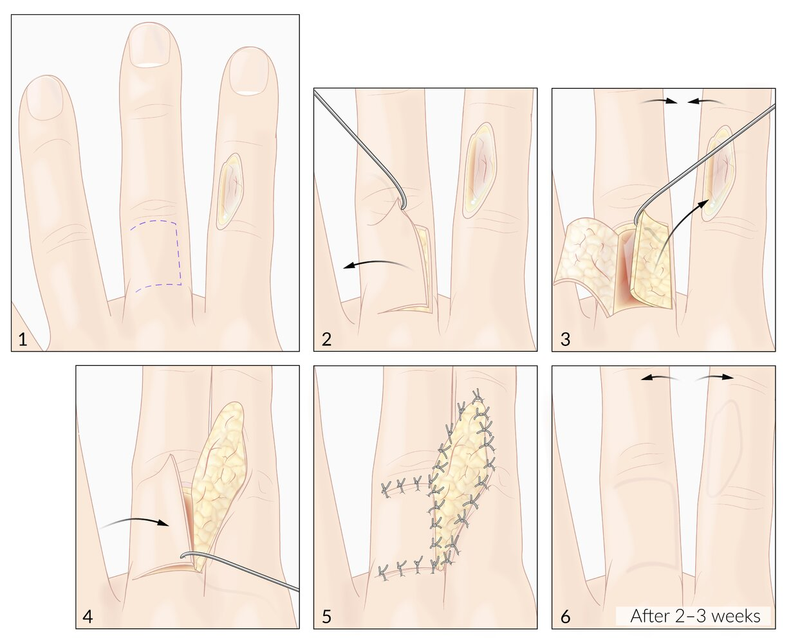

Reversed cross finger flap

### Composite graft [[30]](https://coursology-qbank.com/amboss/article/5SXiZB)

* Graft: a graft containing multiple structures, such as <u>skin</u> and other structures like muscles, bones, or <u>cartilage</u>

* Indications: <u>distal</u> <u>fingertip amputations</u>, nasal reconstructions, <u>ear</u> reconstructions

* Advantages: heals well, usually includes pedicle containing blood supply, aesthetically pleasing

* Disadvantages: higher infection rate, increased risk that graft does not take compared to local flaps

---

## Special wounds

### Amputations [[31]](https://coursology-qbank.com/amboss/article/OI0I1h)[[32]](https://coursology-qbank.com/amboss/article/mI0VWh)[[33]](https://coursology-qbank.com/amboss/article/Xjc9_X0)[[34]](https://coursology-qbank.com/amboss/article/cjcazX0)

An <u>amputation</u> is the surgical or traumatic severance of a body part.

#### Types

* Complete <u>amputation</u>: the body part is totally severed

* Partial <u>amputation</u>: some <u>soft tissue</u> remains connected to the affected body part and to the rest of the body

* Surgical <u>amputation</u>: the surgical removal of a body part

* Indications

* <u>Gangrene</u> (e.g., due to <u>diabetes mellitus</u>, bacterial infection such as <u>Clostridium perfringens</u>, or <u>peripheral arterial disease</u>)

* Infection (e.g., <u>osteomyelitis</u>)

* <u>Malignancy</u> (e.g., <u>osteosarcoma</u>)

* Irreparable trauma injury (e.g., <u>comminuted fracture</u> of a limb)

* Severely burned limbs

* <u>Compartment syndrome</u>

* Severe <u>contractures</u>

* Congenital anomalies

* Severe thermal and/or <u>electrical injury</u>

* Procedure 
1. * Preparation and <u>disinfection</u> of the limb
2. * Preparation of <u>skin</u> flaps (for closing the wound)
3. * Dissection of the <u>fascia</u>, muscles, vessels, and nerves
4. * Transsection of the bone (if necessary)
5. * Smoothing of the edges of the bone
6. * Fixation of the remaining muscles along the bone
7. * <u>Suturing</u> and closing of the <u>fascia</u>, <u>subcutaneous tissue</u>, and the <u>skin</u> (see “<u>Acute wound treatment</u>”)

* <u>Traumatic amputations</u>: Most <u>traumatic amputations</u> are unintentional, resulting from factory, farm, or power tool injuries.

* Fingers: See “Finger <u>amputations</u>.”

> [!WARNING]
> Do not allow the amputated part to be in direct contact with ice, because this can cause further damage.

#### Complications

* Wound infection: <u>stump pain</u>, <u>erythema</u>, <u>fever</u>, and wound drainage

* <u>Deep vein thrombosis</u>

* Stump <u>hematoma</u>

* Stump <u>ulcer</u>

* Etiology: most commonly due to friction and repetitive pressure from a prosthesis with a suboptimal fit

* <u>Risk factors</u>: conditions associated with poor <u>wound healing</u> (e.g., <u>diabetes</u>, <u>peripheral neuropathy</u>, <u>vasoconstriction</u>)

* Management of noninfected stump <u>ulcer</u>: pressure relief, <u>skin</u> care, frequent wound checks, and maintaining an optimal fit between prosthetic socket and residual limb

* <u>Edema</u>

* <u>Contractures</u> leading to deformities and diminished function in the <u>joint</u> adjacent to the stump

* <u>Skin</u> <u>necrosis</u> around the vital stump

* Phantom limb pain: the sensation of a lost limb after <u>amputation</u>, which often feels painful

* Phantom limb sensation: the sensation that an amputated or lost limb is still intact, often involving <u>pain</u> (<u>phantom limb pain</u>)

* Residual limb pain: <u>stump pain</u> following an <u>amputation</u>

### <u>Bite wounds</u>

See “<u>Bite wound management</u>” in “<u>Animal bites</u>” for details.

* Infection risk and transmitted organisms depend on the animal (e.g., <u>human bites</u>, <u>dog bites</u>, <u>cat bites</u>).

* Perform thorough <u>wound irrigation</u> and <u>debridement</u> for all patients.

* Provide <u>tetanus prophylaxis</u> for all patients with outdated or unknown <u>tetanus</u> <u>immunization</u>.

* Wound closure strategy, <u>rabies postexposure prophylaxis</u>, indications for <u>antibiotics for bite wounds</u>, and depend on animal and wound characteristics (see “<u>Overview of bite wound management</u>”).

* Manage <u>envenomation</u>, if present.

### Stab wounds

* When performing first aid, do not remove the foreign body from the wound, as this could stop the object's sealing and tamponading effect, which could result in bleeding.

* Removal in a hospital setting with staff prepared for immediate surgical intervention

* Treatment: see “<u>Penetrating trauma</u>”

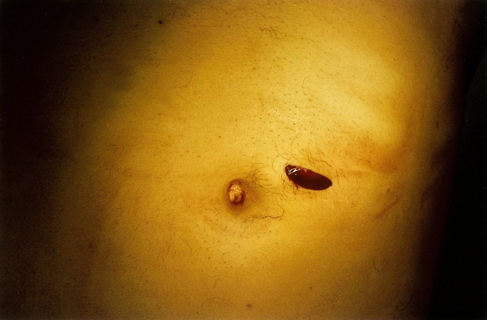

Stab wound in the left paraumbilical region

### Miscellaneous

* <u>Needlestick injuries</u>

* <u>Decubitus ulcers</u>

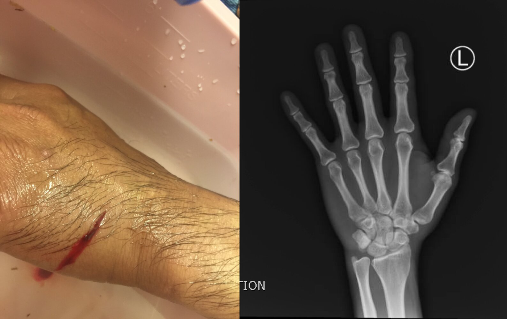

Stingray sting

---

## Complications

### Life-threatening and limb-threatening complications

[[8]](https://coursology-qbank.com/amboss/article/xRXE6B)[[27]](https://coursology-qbank.com/amboss/article/BRXz6B)

See also “<u>Management of trauma</u>.”

* Severe hemorrhage: <u>consumptive coagulopathy</u>, <u>hypothermia</u>

* Extremity trauma: vascular injury, <u>compartment syndrome</u>, <u>VTE</u>

* <u>Crush injury</u>: <u>compartment syndrome</u>, <u>rhabdomyolysis</u>

* Internal injuries: e.g., <u>pneumothorax</u>, <u>cardiac tamponade</u>, <u>hemoperitoneum</u>, <u>pneumoperitoneum</u>, <u>traumatic brain injury</u>

* <u>Open fractures</u>

### Other wound complications

* Bacterial wound infections

* <u>Tetanus</u>

* Associated <u>tendon</u>, nerve, or vascular injury

* Scarring, <u>fibrosis</u>, and <u>contractures</u>

* <u>Retained foreign bodies</u>

### <u>Complications of surgical incisions</u>

* <u>Surgical site infection</u>

* <u>Intestinal fistulas</u>

* Wound dehiscence: the spontaneous separation of wound edges following surgical wound repair 

* Can be <u>superficial</u> (<u>skin</u> and <u>subcutaneous tissue</u>) or deep (fascial)

* Common after abdominal <u>surgery</u>; see “<u>Fascial dehiscence</u>.”

* Consult <u>surgery</u> for treatment, e.g., <u>secondary wound closure</u>.

* <u>Hematomas</u> and <u>seromas</u>

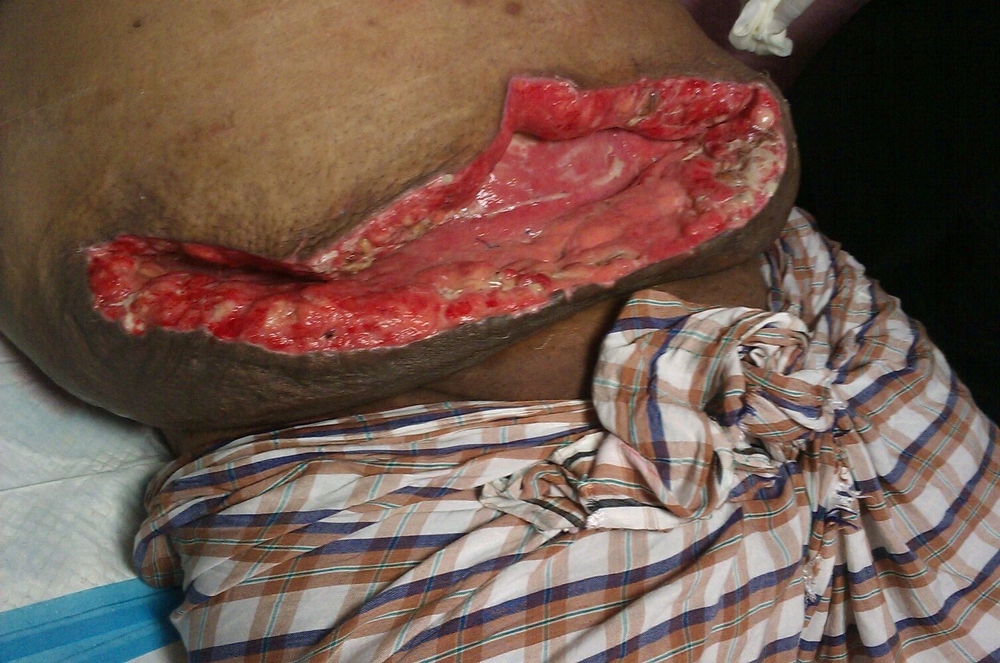

Wound dehiscence after inguinal hernia repair

We list the most important complications. The selection is not exhaustive.

---