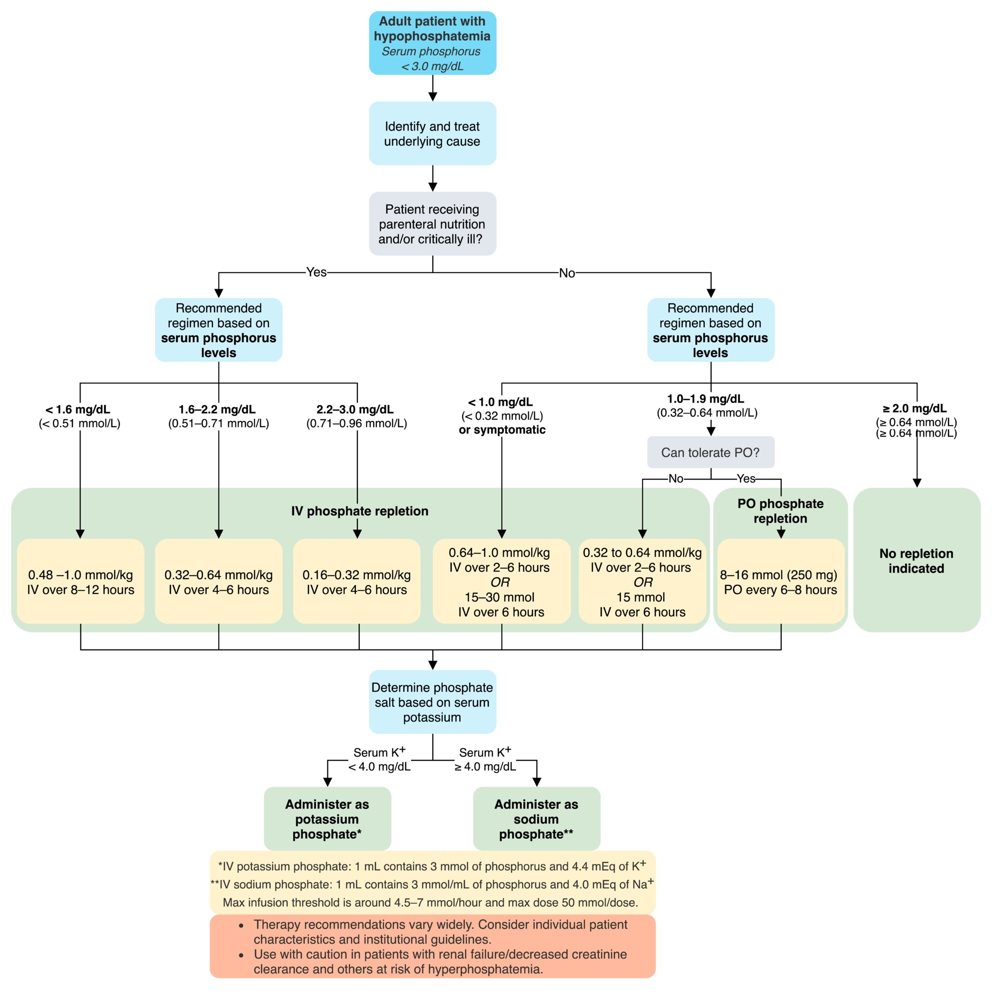

# Electrolyte repletion

*Categories: Clinical knowledge > Surgery > Preoperative and postoperative care > Electrolyte repletion*

[Original Article Link](https://coursology-qbank.com/amboss/article/QJ0uFS)

---

## Summary

<u>Hypokalemia</u>, <u>hypocalcemia</u>, <u>hypomagnesemia</u>, and <u>hypophosphatemia</u> are common <u>electrolyte</u> disturbances in hospitalized and critically ill patients. Repletion regimens vary widely and standardized recommendations do not exist. For this reason, institutional guidelines and individual patient factors should always be taken into consideration when planning <u>electrolyte</u> repletion. Always consider renal and hepatic clearance and the potential for adverse effects when repleting <u>electrolytes</u> and attempt to identify and treat the underlying cause. It is also important to correct any concurrent <u>electrolyte</u> abnormalities (e.g., repletion of concurrent <u>hypomagnesemia</u> in a patient with <u>hypokalemia</u>) and consider the level of monitoring required during the correction (e.g., continuous <u>telemetry</u> during high-dose IV <u>potassium repletion</u>).

---

## Potassium repletion

Management of hypokalemia

> [!TIP]
> Always check the serum <u>magnesium</u> level and <u>replete magnesium</u> prior to repleting <u>potassium</u>. Low <u>magnesium</u> can exacerbate renal <u>potassium</u> losses.

### Repletion regimens

Various concentrations of <u>potassium</u> <u>chloride</u> are available; consult your local hospital protocol. IV solutions with high concentrations (e.g., 300–400 mEq/L) should be exclusively administered via a <u>central line</u>.

|  Repletion regimens for hypokalemia [[1]](https://coursology-qbank.com/amboss/article/FpYgrJ)[[2]](https://coursology-qbank.com/amboss/article/cpYaoJ)  |  |  |
| --- | --- | --- |
| Serum <u>potassium</u> level | Recommended regimen | Monitoring |
|  < 2.5 mEq/L  and/or symptomatic   |   * Intravenous <u>potassium</u> <u>chloride</u> DOSAGE [[3]](https://coursology-qbank.com/amboss/article/6ucjHV0)  * Maximum rate of 40 mEq/hour is recommended for administration via a <u>central line</u>.  * Oral and IV <u>potassium</u> can be given together, but this should only be done in a closely monitored setting. [[3]](https://coursology-qbank.com/amboss/article/6ucjHV0)[[4]](https://coursology-qbank.com/amboss/article/5zaitM)    |   * Monitor serum <u>potassium</u> every hour.  * Serial <u>ECG</u> and continuous <u>telemetry</u> recommended.  * Consider <u>ICU</u> <u>level of care</u>.    |
|  2.5 mEq/L–2.9 mEq/L  and/or unable to tolerate PO  |   * Oral <u>potassium</u> <u>chloride</u> DOSAGE  is preferred if the patient is able to tolerate PO. [[3]](https://coursology-qbank.com/amboss/article/6ucjHV0)  * Intravenous <u>potassium</u> <u>chloride</u> via peripheral line DOSAGE  * Maximum rate of 10–20 mEq/hour is recommended for <u>peripheral IV</u>. [[4]](https://coursology-qbank.com/amboss/article/5zaitM)[[5]](https://coursology-qbank.com/amboss/article/pucLHV0)    |   * Monitor serum <u>potassium</u> at least daily.  * Consider continuous <u>telemetry</u>.    |
| 3.0–3.4 mEq/L |   * Oral <u>potassium</u> <u>chloride</u> DOSAGE  * Consider oral <u>potassium</u> <u>bicarbonate</u> DOSAGE if <u>hypokalemia</u> is due to <u>metabolic acidosis</u>.    |  * Monitor serum <u>potassium</u> daily.   |
| ≥ 3.5 mEq/L |   * Repletion generally not necessary.  * Consider oral <u>potassium</u> <u>chloride</u> DOSAGE for patients with <u>DKA</u>, <u>CHF</u>, and/or undergoing active diuresis.    |  * Monitor serum <u>potassium</u> as needed.   |

> [!WARNING]
> The maximum infusion rate of <u>potassium</u> <u>chloride</u> should not exceed 10–20 mEq/L per hour in a <u>peripheral IV</u> or 40 mEq/L per hour in a <u>central line</u>.

#### General considerations

* Therapeutic goals

* Target serum <u>potassium</u> level: ∼ 4.0 mEq/L

* Expected increase in serum <u>potassium</u> levels: ∼ 0.1 mEq/L after an IV dose of 10 mEq

* Route of replacement: depends on <u>hypokalemia</u> severity, symptoms, and ability to tolerate/absorb oral medication

* Oral supplementation is typically preferred, due to a lower risk of <u>cardiac arrhythmia</u> and venous <u>sclerosis</u>.

* IV and oral supplementation can be combined in severe cases where GI absorption is intact.

* Oral uptake can be improved by administration with or after a meal. [[2]](https://coursology-qbank.com/amboss/article/cpYaoJ)

* Cautions

* <u>Replete potassium</u> judiciously in patients with impaired renal function to avoid rebound <u>hyperkalemia</u>.

* Avoid <u>transcellular</u> <u>potassium</u> shift by using regular saline instead of 5% <u>glucose</u> as infusion fluid. [[2]](https://coursology-qbank.com/amboss/article/cpYaoJ)

* In patients with a high risk of sudden <u>cardiac arrest</u> (e.g., post-<u>MI</u>, preexisting <u>QT prolongation</u>):   ; [[6]](https://coursology-qbank.com/amboss/article/HCYKtr)[[7]](https://coursology-qbank.com/amboss/article/xBYE17)[[8]](https://coursology-qbank.com/amboss/article/z8br6v)

* Maintain normal <u>potassium</u> and <u>magnesium</u> levels.

* Treat <u>torsades de pointes</u> with IV <u>magnesium</u>.

#### Adverse effects of <u>potassium repletion</u>

* <u>Hyperkalemia</u>

* <u>Cardiac arrhythmias</u>   [[9]](https://coursology-qbank.com/amboss/article/izXJs00)

* GI upset (PO administration)

* Extravasation (IV administration)

* Local irritation (IV administration)

### Acute management checklist for hypokalemia

* Check <u>ECG</u>.

* <u>Replete potassium</u> according to severity (see <u>repletion regimens for hypokalemia</u>).

* Identify and treat the underlying cause (see differential diagnoses of <u>hypokalemia</u>).

* Identify and treat <u>hypomagnesemia</u> (see <u>repletion regimens for hypomagnesemia</u>).

* Discontinue any contributing medications.

* Consider starting a <u>potassium-sparing diuretic</u> (if appropriate).

* Restrict dietary <u>sodium</u> intake.

* Encourage dietary <u>potassium</u> intake.

* Order monitoring labs.

* Continuous <u>telemetry</u> and serial <u>ECGs</u> if <u>hypokalemia</u> is severe (< 3.0 mEq/L) or symptomatic

---

## Calcium repletion

### Repletion regimens

|  Repletion regimens for hypocalcemia [[10]](https://coursology-qbank.com/amboss/article/upYprJ)[[11]](https://coursology-qbank.com/amboss/article/EpY8rJ)  |  |  |
| --- | --- | --- |
|  <u>Corrected serum calcium</u>   | Recommended regimen | Monitoring |
|  ≤ 7.5 mg/dL (≤ 1.9 mmol/L)  (<u>ionized Ca</u> ≤ 3.0 mg/dL (≤ 0.8 mmol/L)) and/or symptomatic   |  * IV <u>calcium</u>  * IV <u>calcium gluconate</u> DOSAGE  * IV <u>calcium</u> <u>chloride</u> DOSAGE   |   * Monitor serum <u>calcium</u> level every 4–8 hours.  * Continuous <u>telemetry</u> and frequent <u>vital sign</u> monitoring  * Consider <u>ICU</u> <u>level of care</u>.    |
|  7.6 mg/dL–8.4 mg/dL (2.0–2.1 mmol/L) (<u>ionized Ca</u> 3.1–4.3 mg/dL)  |  * Oral <u>calcium</u>  * <u>Calcium carbonate</u> DOSAGE  * <u>Calcium</u> <u>citrate</u> (<u>off-label</u>) DOSAGE   |  * Monitor serum <u>calcium</u> level daily or as needed.   |
|  ≥ 8.5 mg/dL (≥ 2.2 mmol/L) (<u>ionized Ca</u> ≥ 4.4 mg/dL)  |  * No repletion indicated   |  * Monitor serum <u>calcium</u> as needed.   |

> [!WARNING]
> Use extreme caution when administering IV <u>calcium</u> in patients receiving <u>cardiac glycosides</u> or avoid it altogether, as the combination increases the risk of <u>ventricular fibrillation</u>.

> [!WARNING]
> If <u>hypomagnesemia</u> is present, <u>replete magnesium</u> concurrently with <u>calcium</u> as low <u>magnesium</u> can disrupt <u>PTH</u>-mediated <u>calcium</u> <u>hemostasis</u>. [[12]](https://coursology-qbank.com/amboss/article/AN1Rdh0)

#### General considerations

* Goal serum <u>calcium</u> level: low–normal range (e.g., ∼ 8.5 mg/dL)

* The <u>ionized calcium</u> level is the best measure of physiologically active <u>calcium</u>.

* When using serum <u>calcium</u>, make sure to correct for <u>albumin</u>.

#### Adverse effects of <u>calcium repletion</u>

* Local irritation

* <u>IV extravasation</u> and <u>soft tissue</u> calcifications

* <u>Hypotension</u>, <u>bradycardia</u>, <u>cardiac arrest</u>

### Acute management checklist for hypocalcemia

* Confirm <u>hypocalcemia</u> (i.e., check <u>ionized calcium</u> and/or correct serum <u>calcium</u> for <u>albumin</u>).

* Replete <u>calcium</u> according to severity (see <u>repletion regimens for hypocalcemia</u>).

* Identify and treat <u>hypomagnesemia</u> (see <u>repletion regimens for hypomagnesemia</u>).

* Identify and treat <u>hypokalemia</u> (see <u>repletion regimens for hypokalemia</u>).

* Identify and <u>treat vitamin D deficiency</u>.

* Identify and treat the underlying cause (see <u>causes of hypocalcemia</u>).

* Discontinue any contributing medications (e.g., <u>loop diuretics</u>).

* Order monitoring labs.

* Continuous <u>telemetry</u> in patients with severe (< 7.5 mg/dL) or symptomatic <u>hypocalcemia</u>

---

## Magnesium repletion

### Repletion regimens

|  Repletion regimens for hypomagnesemia [[13]](https://coursology-qbank.com/amboss/article/_pY5HJ)[[14]](https://coursology-qbank.com/amboss/article/eJYxGJ)[[15]](https://coursology-qbank.com/amboss/article/bJYHsJ)  |  |  |
| --- | --- | --- |
| Serum <u>magnesium</u> | Recommended regimen | Monitoring |
|  < 1 mEq/dL  and/or symptomatic   |  * IV <u>magnesium sulfate</u>  * <u>Hemodynamically unstable</u> and/or <u>torsades de pointes</u> DOSAGE  * Hemodynamically stable and symptomatic DOSAGE  * Hemodynamically stable and asymptomatic DOSAGE   |   * Monitor serum <u>magnesium</u> 6–12 hours after every dose of IV <u>magnesium</u>.  * Continuous <u>telemetry</u>    |
|  1.0–1.5 mEq/dL  |   * IV <u>magnesium sulfate</u> DOSAGE  * Or oral <u>magnesium</u>  * <u>Magnesium</u> oxide DOSAGE  * <u>Magnesium</u> gluconate DOSAGE    |  * Monitor serum <u>magnesium</u> 6–12 hours after every dose of IV <u>magnesium</u> or at least daily.   |
| ≥ 1.6 mEq/dL |   * Repletion generally not necessary.  * Consider oral or IV repletion in patients at risk for <u>hypomagnesemia</u> or <u>cardiac arrhythmias</u>  [[14]](https://coursology-qbank.com/amboss/article/eJYxGJ)  * Oral <u>magnesium</u>  * <u>Magnesium</u> oxide DOSAGE  * <u>Magnesium</u> gluconate DOSAGE  * IV <u>magnesium sulfate</u> DOSAGE    |  * Monitor serum <u>magnesium</u> as needed.   |

> [!WARNING]
> Because the risk of <u>hypermagnesemia</u> is elevated in patients with impaired renal function (especially if the <u>creatinine clearance</u> is < 30 mL/min/1.73 m2), consider reducing the dose in this group by 50%.

#### General considerations

* Goal serum <u>magnesium</u> level

* Most patients: 1.5–2.4 mg/dL

* In patients with an underlying cardiac disorder and/or at risk of <u>arrhythmias</u>: consider higher goal > 1.7 mg/dL

* 1 g of IV <u>magnesium sulfate</u> has about 8 mEq of elemental <u>magnesium</u>.

* Oral repletion is generally preferred when possible

* <u>Magnesium repletion</u> should be continued 1–2 days after normalization of serum levels.

#### Adverse effects

* Soft stools, <u>diarrhea</u>

* <u>Nausea</u>, <u>vomiting</u>

* Fatigue

* <u>Muscle weakness</u>, attenuation of muscle reflexes

* <u>Low blood pressure</u>

* Impaired respiratory effort, <u>cardiac arrest</u>

* <u>Hypermagnesemia</u>

### Acute management checklist for hypomagnesemia

* <u>Replete magnesium</u> according to severity (see <u>repletion regimens for hypomagnesemia</u>).

* Identify and treat the underlying cause (see <u>differential diagnoses of hypomagnesemia</u>).

* Identify and treat <u>hypocalcemia</u> (see <u>repletion regimens for hypocalcemia</u>).

* Identify and treat <u>hypokalemia</u> (see <u>repletion regimens for hypokalemia</u>).

* Identify and treat <u>hypophosphatemia</u> (see <u>repletion regimens for hypophosphatemia</u>).

* Encourage dietary <u>magnesium</u> intake.

* Order monitoring labs.

* Continuous <u>telemetry</u> if severe < 1 mEq/dL or symptomatic

---

## Phosphate repletion

Electrolyte repletion - Hypophosphatemia

### Repletion regimens for hypophosphatemia

#### Approach

1. * Determine whether IV or PO repletion is indicated.
2. * Calculate how many millimoles of elemental <u>phosphorus</u> are indicated.
3. * Decide which <u>phosphate</u> salt should be administered.

* If the serum <u>potassium</u> is < 4.0 mg/dL, administer as <u>potassium</u> <u>phosphate</u>.

* If the serum <u>potassium</u> is ≥ 4.0 mg/dL, administer as <u>sodium</u> <u>phosphate</u>.
4. * Round the total dose calculated to the closest preparation dose available (e.g., typically 7.5 mmol for IV, 8 mmol for PO).

> [!WARNING]
> There are no standard guidelines for <u>phosphate repletion</u> and individual recommendations vary. Consult your pharmacy with any questions, as individual formulations may vary!

> [!WARNING]
> Do not confuse phosphorous (P) with <u>phosphate</u> (<u>PO43−</u>). The concentration of the substances measured in mmol/L is identical but the mass measured in mg/dL differs by a <u>ratio</u> of around 3:1 (<u>phosphate</u>:<u>phosphorus</u>). [[16]](https://coursology-qbank.com/amboss/article/LtYwVI)

#### For patients who are critically ill and/or receiving <u>parenteral nutrition</u>  [[17]](https://coursology-qbank.com/amboss/article/otY0eI)[[18]](https://coursology-qbank.com/amboss/article/ZHYZKq)

| <u>Phosphate repletion</u> for critically ill patients and/or receiving <u>TPN</u> |  |  |
| --- | --- | --- |
| Serum <u>phosphorus</u> | Recommended regimen | Monitoring |
|  < 1.6 mg/dL (< 0.51 mmol/L)  |  * IV <u>phosphate</u> DOSAGE   |   * Monitor serum <u>phosphorus</u> level 6 hours after infusion.  * Consider continuous <u>telemetry</u>.    |
|  1.6–2.2 mg/dL (0.51–0.71 mmol/L)  |  * IV <u>phosphate</u> DOSAGE   |  * Monitor serum <u>phosphorus</u> level 6 hours after infusion.   |
|  2.2–3.0 mg/dL (0.71–0.96 mmol/L)  |  * IV <u>phosphate</u> DOSAGE   |  * Monitor serum <u>phosphorus</u> level 6 hours after infusion.   |

#### All other patients [[14]](https://coursology-qbank.com/amboss/article/eJYxGJ)[[18]](https://coursology-qbank.com/amboss/article/ZHYZKq)

| <u>Phosphate repletion</u> for patients who are not critically ill and not receiving <u>TPN</u> |  |  |
| --- | --- | --- |
| Serum <u>phosphorus</u> | Recommended regimen | Monitoring |
|  < 1.0 mg/dL (< 0.32 mmol/L), symptomatic, and/or unable to take PO   |  * IV <u>phosphate</u> DOSAGE   |  * Monitor serum <u>phosphorus</u> level 6 hours after infusion.   |
|  1.0–1.9 mg/dL (0.32–0.64 mmol/L)  |   * If able to take PO: oral <u>phosphate</u> DOSAGE  * If unable to take PO: IV <u>phosphate</u> DOSAGE    |  * Monitor serum <u>phosphorus</u> level 6 hours after infusion (if IV) or at least daily.   |
|  ≥ 2.0 mg/dL (> 0.64 mmol/L)  |  * Repletion generally not indicated   |  * Monitor serum <u>phosphorus</u> as needed.   |

> [!TIP]
> If the serum <u>potassium</u> is < 4.0 mg/dL, administer <u>phosphate</u> as <u>potassium</u> <u>phosphate</u>. If the serum <u>potassium</u> is ≥ 4.0 mg/dL, administer <u>phosphate</u> as <u>sodium</u> <u>phosphate</u>.

#### General considerations

* Goal serum <u>phosphorus</u> level: > 2–3 mg/dL

* Expected increase in serum <u>phosphorus</u> levels: ∼ 0.5 mg/dL with a dose of 0.10 mmol/kg body weight (but this is somewhat unpredictable)

* Serum <u>phosphorus</u> levels may not reflect total body stores, as most of the body's <u>phosphorus</u> is stored in the bones and <u>soft tissues</u>.

* Critically ill patients often have higher <u>phosphorus</u> requirements due to <u>hypermetabolism</u> and high urinary <u>phosphorus</u> excretion.

* Dosing

* A standard IV dose is around 15–30 mmol and should not be administered faster than 4.5–7.0 mmol/hour.

* Reduce the dose by 50% in patients with impaired renal function who are not on <u>hemodialysis</u>.

* <u>Phosphorus</u> preparations [[16]](https://coursology-qbank.com/amboss/article/LtYwVI)

* 1 mmol of <u>potassium</u> <u>phosphate</u> contains ∼ 1.5 mEq of <u>potassium</u>.

* 1 mmol of <u>sodium</u> <u>phosphate</u> contains ∼ 1.33 mEq of <u>sodium</u>.

> [!TIP]
> For IV administration, round the total <u>phosphate</u> dose to the nearest 7.5 mmol for ease of preparation

#### Adverse effects of <u>phosphate repletion</u> [[18]](https://coursology-qbank.com/amboss/article/ZHYZKq)

* <u>Hypocalcemia</u>, <u>hypernatremia</u>

* <u>Osmotic diuresis</u>

* <u>Renal failure</u>

* <u>Arrhythmias</u>

* Confusion, <u>dizziness</u>, <u>seizure</u>, <u>tetany</u>

* Precipitation with <u>calcium</u>

* <u>Hyperkalemia</u>

* <u>Diarrhea</u>, flatulence, <u>nausea</u>, <u>vomiting</u>

* <u>Sore throat</u>

### Acute management checklist for hypophosphatemia

* Determine if the patient is critically ill or is receiving <u>parenteral nutrition</u>.

* <u>Replete phosphate</u> according to serum <u>phosphorus</u> levels and serum <u>potassium</u> levels (see <u>repletion regimens for hypophosphatemia</u>).

* Identify and treat the underlying cause (see differential diagnoses of <u>hypophosphatemia</u>).

* Order monitoring labs.

---