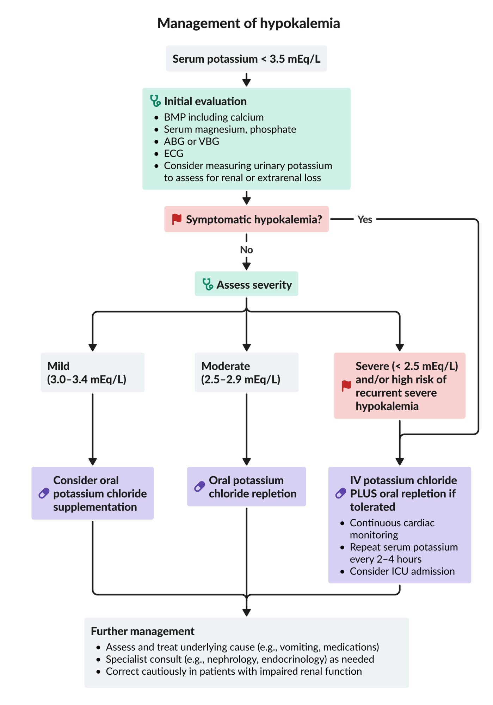

# Hypokalemia

*Categories: Clinical knowledge > Surgery > Preoperative and postoperative care > Hypokalemia*

[Original Article Link](https://coursology-qbank.com/amboss/article/lI0v1h)

---

## Summary

Hypokalemia (low serum <u>potassium</u>) is a common <u>electrolyte</u> disorder that is typically caused by <u>potassium</u> loss (e.g., due to <u>diarrhea</u>, <u>vomiting</u>, or <u>diuretic</u> medication). Mild hypokalemia may be asymptomatic or cause mild nonspecific symptoms such as <u>nausea</u>, <u>muscle weakness</u>, and fatigue. Severe deficiency can cause <u>cardiac arrhythmias</u> and <u>death</u>. Treatment consists of oral or IV supplementation in conjunction with treatment of the underlying cause. In concurrent <u>hypomagnesemia</u>, which may lead to refractory hypokalemia, the simultaneous repletion of <u>magnesium</u> and <u>potassium</u> is necessary.

See also “<u>Hyperkalemia</u>.”

---

## Definitions

* Hypokalemia: serum <u>potassium</u> (<u>K+</u>) level < 3.5 mEq/L [[2]](https://coursology-qbank.com/amboss/article/cpYaoJ)

* Severe hypokalemia: serum <u>K+</u> level < 2.5 mEq/L [[2]](https://coursology-qbank.com/amboss/article/cpYaoJ)

---

## Etiology

Hypokalemia is most often caused by renal or gastrointestinal <u>potassium</u> loss. Other <u>electrolyte</u> imbalances (e.g., <u>hypomagnesemia</u>), <u>alkalosis</u>, and several medications can also have an impact on <u>potassium</u> <u>homeostasis</u>.

|  Etiology of hypokalemia [[2]](https://coursology-qbank.com/amboss/article/cpYaoJ)[[3]](https://coursology-qbank.com/amboss/article/cebaBs)  |  |
| --- | --- |
|  | Causes |
| Gastrointestinal loss |   * Primary losses due to gastrointestinal diseases/symptoms  * <u>Vomiting</u>  * <u>Diarrhea</u>  * <u>Villous adenoma</u> of the <u>colon</u>  * Secondary losses due to medication or other causes  * <u>Laxatives</u> (e.g., <u>laxative abuse</u> or <u>bowel preparation</u>)  * Bentonite ingestion    |
| Renal loss |   * Primary losses due to renal diseases  * Type I and II <u>renal tubular acidosis</u>  * <u>Cushing syndrome</u>  * <u>Renin</u>-secreting tumors  * <u>Fanconi syndrome</u>  * Genetic disorders  * <u>Congenital adrenal hyperplasia</u>  * <u>Bartter syndrome</u>  * <u>Gitelman syndrome</u>  * <u>Liddle syndrome</u>  * Secondary losses due to medication or other causes  * <u>Diuretics</u>: <u>thiazides</u>, <u>loop diuretics</u>, and <u>osmotic diuretics</u>  * <u>Beta-2 adrenergic agonists</u>: <u>beta-2 receptor</u>-mediated stimulation of the <u>Na+/K+-ATPase</u> pump (e.g., <u>albuterol</u>, <u>terbutaline</u>)  * <u>Glucocorticoids</u>  * <u>Catecholamines</u>  * <u>Antibiotics</u> (e.g., <u>penicillin</u>, <u>aminoglycoside</u>, <u>clindamycin</u>)  * <u>Antifungals</u> (e.g., <u>amphotericin B</u>, <u>azoles</u>)  * <u>Theophylline</u>  * Licorice (<u>aldosterone</u>-like action)  * Endocrine causes: hyperaldosteronism, <u>hypercortisolism</u>  * <u>Hypomagnesemia</u>  (See also the “Pathophysiology” section.)    |
| Intracellular shift |   * <u>Alkalosis</u> (See also the “Pathophysiology” section.)  * <u>Insulin</u>: stimulation of the <u>Na+/K+-ATPase</u> pump, which transports <u>potassium</u> into <u>the cell</u>  * <u>Hyposmolality</u>  * Increased <u>glycogenesis</u> (e.g., as a result of <u>total parenteral nutrition</u>)  * Increased <u>sympathetic</u> tone  * <u>Sympathomimetic</u> use  * <u>Pheochromocytoma</u>  * <u>Alcohol withdrawal</u>  * <u>Acute myocardial infarction</u>  * <u>Head trauma</u>  * Familial <u>periodic paralysis</u>  * <u>Thyrotoxicosis</u> (<u>thyrotoxic periodic paralysis</u>)  * <u>Hypothermia</u>  * Intoxication (e.g., <u>caffeine</u>, <u>toluene</u>, or barium)    |
| Insufficient intake |   * Older age  * <u>Alcohol abuse</u>  * <u>Eating disorders</u>    |

---

## Pathophysiology

* <u>Potassium</u> is an important factor in maintaining the <u>resting membrane potential</u>.

* ↓ Extracellular <u>K+</u> concentration → resting membrane potential becomes more negative than -90 mV → ↓ excitability [[4]](https://coursology-qbank.com/amboss/article/VebGBs)

* <u>Alkalosis</u> can impact <u>potassium</u> balance via intracellular shifts and vice versa.  [[5]](https://coursology-qbank.com/amboss/article/bwcHhe0)

* <u>Alkalosis</u> → ↓ extracellular H+ → stimulation of the <u>Na+/H+ antiporter</u> (transfers H+ out of the cells in exchange for Na+) → ↑ intracellular Na+ → ↑ <u>sodium</u> gradient stimulates the <u>Na+/K+-ATPase</u> (transfers <u>K+</u> into the cells in exchange for Na+) → ↓ extracellular <u>K+</u> concentration

* Hypokalemia → ↓ extracellular <u>K+</u> concentration → ↓ <u>potassium</u> gradient inhibits the <u>Na+/K+-ATPase</u> → ↓ extracellular Na+ → ↓ <u>sodium</u> gradient inhibits the <u>Na+/H+ antiporter</u> → ↓ extracellular H+ → <u>alkalosis</u>

* Exception: In <u>renal tubular acidosis</u>, findings include hypokalemia and <u>metabolic acidosis</u>!

> [!NOTE]
> <u>K+</u> acts like H+: Hypokalemia leads to <u>alkalosis</u> and vice versa!

> [!NOTE]
> Particularly acute extracellular changes in concentration influence excitability! Chronic changes lead to intracellular compensation!

* <u>Hypomagnesemia</u> can impact <u>potassium</u> balance via the following mechanisms of increased renal loss: [[6]](https://coursology-qbank.com/amboss/article/Yebnxs)

* <u>Magnesium</u> serves as a <u>cofactor</u> in Na+/<u>K+</u>-ATPases → <u>hypomagnesemia</u> disrupts the <u>Na+/K+-ATPase</u> in the basolateral membrane of the <u>proximal</u> convoluted <u>loop of Henle</u> → ↓ Na+ reabsorption → ↑ luminal Na+ → ↑ Na+ reabsorption and ↑ <u>K+</u> secretion by the <u>principal cells</u> distally

* Apical <u>ROMK channels</u> in <u>principal cells</u> are inhibited by intracellular <u>magnesium</u>. With low levels of <u>magnesium</u> available, the <u>ROMK channels</u> are not inhibited, resulting in increased <u>K+</u> secretion.

> [!TIP]
> <u>Hypomagnesemia</u> can lead to refractory hypokalemia!

---

## Clinical features

Patients may be asymptomatic, particularly if the deficiency is mild. Symptoms usually occur if serum <u>K+</u> levels are < 3.0 mEq/L and/or decrease rapidly. [[3]](https://coursology-qbank.com/amboss/article/cebaBs)

* Cardiovascular manifestations

* Symptoms of <u>cardiac arrhythmia</u> (e.g., <u>palpitations</u>, irregular <u>pulse</u>, <u>syncope</u>)

* <u>Hypotension</u>

* Neuromuscular manifestations

* Muscle cramps and spasms [[7]](https://coursology-qbank.com/amboss/article/1eb2Bs)

* <u>Muscle weakness</u>, <u>paralysis</u>

* <u>Respiratory failure</u> secondary to <u>paralysis</u> of the respiratory muscles

* <u>Rhabdomyolysis</u>

* Decreased <u>deep tendon reflexes</u>

* Gastrointestinal manifestations

* <u>Nausea</u>, <u>vomiting</u> [[7]](https://coursology-qbank.com/amboss/article/1eb2Bs)

* <u>Constipation</u> or <u>ileus</u>

* Fatigue

* Other manifestations

* <u>Hyperglycemia</u>  [[8]](https://coursology-qbank.com/amboss/article/WebPBs)

* <u>Polyuria</u>  [[9]](https://coursology-qbank.com/amboss/article/Xeb9xs)

* Symptoms of underlying causes, including:

* <u>Dehydration</u> in <u>gastroenteritis</u>

* <u>Tachycardia</u> and <u>tremors</u> in <u>alcohol withdrawal</u>

* <u>Symptoms of thyrotoxicosis</u>

* Symptoms of <u>digoxin toxicity</u> in patients treated with <u>digoxin</u>  [[10]](https://coursology-qbank.com/amboss/article/deboBs)

> [!TIP]
> Hypokalemia (and <u>hyperkalemia</u>) can cause <u>cardiac arrhythmia</u> and may lead to <u>ventricular fibrillation</u>!

Hypokalemia fact sheet

---

## Diagnosis

All patients require an <u>ECG</u> and <u>laboratory studies</u> to confirm the diagnosis and rule out concurrent <u>electrolyte</u> abnormalities. Further diagnostic tests depend on the suspected underlying etiology.

### Initial evaluation

#### <u>Laboratory studies</u> [[2]](https://coursology-qbank.com/amboss/article/cpYaoJ)

* <u>Electrolytes</u> and <u>kidney function</u>

* <u>BMP</u>

* Low serum <u>K+</u> levels

* <u>Renal function tests</u>

* Other <u>electrolytes</u>

* Serum <u>calcium</u>, <u>magnesium</u>, <u>phosphate</u>

* <u>Blood gas</u> (venous or arterial): : may show <u>metabolic alkalosis</u>

* Urinary <u>potassium</u>: Consider measuring to narrow down underlying etiology. [[11]](https://coursology-qbank.com/amboss/article/XUb9bG)[[12]](https://coursology-qbank.com/amboss/article/HkbK6F)[[13]](https://coursology-qbank.com/amboss/article/V6bGPu)

* Methods

* <u>Spot urine</u>: rapid assessment, indicated in urgent cases , less reliable than 24-hour collections

* 24-hour urine collection: less practical, indicated for chronic cases and uncertain diagnoses, more accurate than <u>spot urine</u>

* Findings

* Renal loss; : <u>spot urine</u> 15–20 mEq/L (24-hour collection > 15 mEq/L)  [[2]](https://coursology-qbank.com/amboss/article/cpYaoJ)[[12]](https://coursology-qbank.com/amboss/article/HkbK6F)

* Extrarenal loss; : <u>spot urine</u> 15–20 mEq/L (24-hour collection < 15 mEq/L)  [[13]](https://coursology-qbank.com/amboss/article/V6bGPu)

> [!TIP]
> Consider confirming abnormal serum <u>potassium</u> levels with a repeat blood draw.

#### ECG findings in hypokalemia [[3]](https://coursology-qbank.com/amboss/article/cebaBs)[[14]](https://coursology-qbank.com/amboss/article/eebxBs)

* Mild to moderate hypokalemia

* <u>T-wave</u> flattening  or <u>inversion</u>

* <u>ST depression</u>

* Prolonged <u>PR interval</u>

* Moderate to severe hypokalemia

* Presence of U waves: small waveform following the <u>T wave</u> that is often absent but becomes more pronounced in hypokalemia or <u>bradycardia</u>  [[3]](https://coursology-qbank.com/amboss/article/cebaBs)

* T and <u>U wave</u> fusion

* <u>QT prolongation</u>  [[14]](https://coursology-qbank.com/amboss/article/eebxBs)

* <u>Dysrhythmias</u>

* Premature atrial and <u>ventricular complexes</u>

* <u>Sinus bradycardia</u>

* <u>Paroxysmal</u> atrial or <u>junctional tachycardia</u>

* Ventricular <u>dysrhythmias</u>, e.g., <u>Torsades de pointes</u>

* <u>PEA</u>/<u>asystole</u>

> [!NOTE]
> To remember that low <u>pot</u>assium may result in a flattened T wave, think of: "No <u>pot</u>, no tea (T)!"

### Identification of underlying etiology

* Review the patient's history and medication list to help identify potential <u>causes of hypokalemia</u>.

* If the etiology is still unclear, further testing can help determine the underlying etiology.

* Imaging is not routinely required but may be necessary if certain underlying etiologies are suspected.  [[2]](https://coursology-qbank.com/amboss/article/cpYaoJ)

|  Evaluation of underlying etiology in hypokalemia [[2]](https://coursology-qbank.com/amboss/article/cpYaoJ)[[15]](https://coursology-qbank.com/amboss/article/f6bk4u)  |  |  |  |  |
| --- | --- | --- | --- | --- |
| Type of <u>potassium</u> loss | Clinical features | Recommended tests | Findings and interpretation |  |
|  Extrarenal losses   |  * <u>Symptoms of thyrotoxicosis</u>   |   * <u>TSH</u>  * T3 and T4    |   * ↓ <u>TSH</u>  * ↑ T3 and T4    |  |
|  * <u>Vomiting</u> or <u>diarrhea</u>   |   * <u>Stool microscopy</u>, culture, and <u>sensitivities</u>  * <u>Fecal calprotectin</u>    |   * Positive <u>stool microscopy</u>, culture, and <u>sensitivities</u>: infectious pathogens  * ↑ <u>Fecal calprotectin</u>: <u>inflammatory bowel disease</u>    |  |  |
|  Renal loss   |  * <u>Hypertension</u>   |   * Plasma <u>renin</u>  * Plasma <u>aldosterone</u>  * <u>Aldosterone-to-renin ratio</u>    |   * ↑ <u>Aldosterone</u> and ↑ <u>renin</u>  * Renovascular disease  * <u>Renin</u> secreting <u>tumor</u>  * ↑ <u>Aldosterone</u> and ↓ <u>renin</u> (high <u>aldosterone-to-renin ratio</u>): primary aldosteronism (see also “<u>Diagnosis of primary hyperaldosteronism</u>”)   * <u>Familial hyperaldosteronism</u>  * Bilateral <u>adrenal hyperplasia</u>  * <u>Adrenal</u> tumors  * ↓ <u>Aldosterone</u> and ↓ <u>renin</u>  * <u>Cushing syndrome</u>: requires <u>pituitary</u> <u>MRI</u> (see “<u>Diagnosis of Cushing syndrome</u>”)  * <u>Liddle syndrome</u>  * <u>Congenital adrenal hyperplasia</u>  * <u>Glucocorticoid</u> resistance    |  |
|  * <u>Hypotension</u> or <u>normotension</u>   |   * Serum <u>bicarbonate</u> (<u>HCO3-</u>)  * OR <u>blood gas</u>    |   * ↓ <u>HCO3-</u> or <u>metabolic acidosis</u>:  * <u>Renal tubular acidosis</u>  * <u>Diabetic ketoacidosis</u>  * ↑ <u>HCO3-</u> or <u>metabolic alkalosis</u>:  * <u>Diuretic</u> use  * <u>Magnesium</u> deficiency  * <u>Bartter syndrome</u>: on further testing  * ↑ Urinary <u>calcium</u>  * ↑ Serum <u>aldosterone</u>  * ↑ Serum <u>renin</u>  * <u>Gitelman syndrome</u>: on further testing  * ↓ Urinary <u>calcium</u>  * ↑ Serum <u>aldosterone</u>  * ↑ Serum <u>renin</u>    |  |  |

---

## Treatment

### Approach

Most patients require <u>potassium</u> <u>chloride</u> (KCl) repletion, management of concurrent <u>electrolyte</u> abnormalities (see “<u>Electrolyte repletion</u>”), and treatment of the underlying cause. See “<u>Potassium replacement</u>” for further details on <u>repletion regimens for hypokalemia</u>, treatment goals, warnings, and adverse effects.

* Severe hypokalemia (< 2.5 mEq/L) and/or high risk of recurrent severe hypokalemia 

* KCl: IV repletion DOSAGE PLUS oral repletion if tolerated DOSAGE [[16]](https://coursology-qbank.com/amboss/article/5zaitM)[[17]](https://coursology-qbank.com/amboss/article/6ucjHV0)[[18]](https://coursology-qbank.com/amboss/article/pucLHV0)

* Rate of repletion should not exceed 10–20 mEq/hour through a <u>peripheral IV</u>. 10–20 mEq [[16]](https://coursology-qbank.com/amboss/article/5zaitM)[[18]](https://coursology-qbank.com/amboss/article/pucLHV0)

* Higher doses (up to 40 mEq/hour) must be administered through a <u>central line</u>.

* Order <u>continuous cardiac monitoring</u> for IV <u>potassium</u> infusions over 10 mEq/hour.

* Check <u>potassium</u> levels every 2–4 hours or after a maximum of 60 mEq (combined total from oral and IV sources) has been repleted.

* Consider admission to <u>ICU</u>, <u>continuous cardiac monitoring</u>, and <u>central line</u> placement.

* Moderate hypokalemia (2.5–2.9 mEq/L)

* KCl: Oral repletion  DOSAGE is preferred unless the patient is unable to tolerate PO, has severe symptoms, or has <u>ECG changes in hypokalemia</u>. [[17]](https://coursology-qbank.com/amboss/article/6ucjHV0)

* Disposition is usually determined by treatment of the underlying disorder.

* Mild hypokalemia (3.0–3.4 mEq/L) with easily reversible cause

* Prioritize treatment of the underlying condition (e.g., GI fluid losses).

* Consider oral supplementation, e.g., KCl DOSAGE

* Consider increasing dietary <u>potassium</u> intake.  [[19]](https://coursology-qbank.com/amboss/article/2ebTys)

* Patients can usually be discharged after stabilization.

Management of hypokalemia

> [!WARNING]
> High concentrations of IV <u>potassium</u> can cause local venous irritation and potentially lead to <u>cardiac arrhythmias</u>. Limit the rate of infusion according to the type of <u>IV access</u> and place patients on a continuous <u>cardiac monitor</u>.

> [!TIP]
> Correction of hypokalemia is a common cause of hyperkalemia in hospitalized patients; monitor <u>K+</u> levels frequently in patients receiving <u>potassium repletion</u>. [[17]](https://coursology-qbank.com/amboss/article/6ucjHV0)[[18]](https://coursology-qbank.com/amboss/article/pucLHV0)

> [!WARNING]
> In patients with hypokalemia, avoid solutions containing dextrose, which can increase <u>insulin</u> secretion and worsen hypokalemia. [[16]](https://coursology-qbank.com/amboss/article/5zaitM)

### Treatment of the underlying condition in hypokalemia

See “<u>Etiology of hypokalemia</u>.”

* <u>Review medications</u> that may be affecting <u>potassium</u> balance, e.g., <u>β2 agonists</u>, <u>laxatives</u>.

* <u>Diuretic</u>-induced hypokalemia (e.g., <u>loop diuretics</u> or <u>thiazides</u>) [[2]](https://coursology-qbank.com/amboss/article/cpYaoJ)

* Discontinue the <u>diuretic</u> or reduce the dose and combine with <u>potassium-sparing</u> <u>diuretics</u>, e.g., <u>spironolactone</u>. DOSAGE

* Rehydrate with <u>normal saline</u> if the patient has both <u>volume depletion</u> and <u>contraction alkalosis</u>.

* Start oral or IV <u>magnesium</u> for patients with <u>hypomagnesemia</u>.

* Treat <u>nausea and vomiting</u> and provide <u>fluid resuscitation</u> for <u>dehydration and hypovolemia</u>.

* Consider aggressive <u>potassium repletion</u> for conditions at high risk of relapsing or refractory hypokalemia, e.g., <u>DKA</u>, high-dose <u>insulin therapy</u>, <u>refeeding syndrome</u>.

* Consider specialist consult (e.g., nephrology, <u>endocrinology</u>, dietician) as directed by the suspected underlying etiology.

> [!WARNING]
> <u>Potassium</u> supplementation will be ineffective if concurrent <u>hypomagnesemia</u> is left untreated (see “<u>Magnesium repletion</u>”).

> [!TIP]
> Patients with a continued source of <u>potassium</u> loss (e.g., those on <u>diuretics</u>) may require long-term <u>potassium</u> supplementation. [[16]](https://coursology-qbank.com/amboss/article/5zaitM)

---