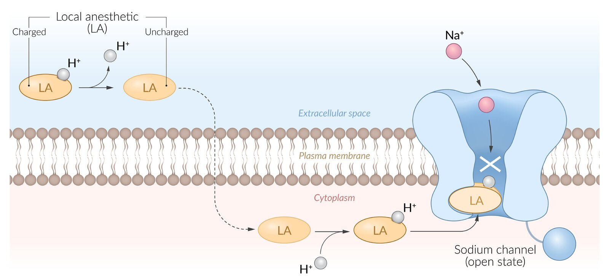
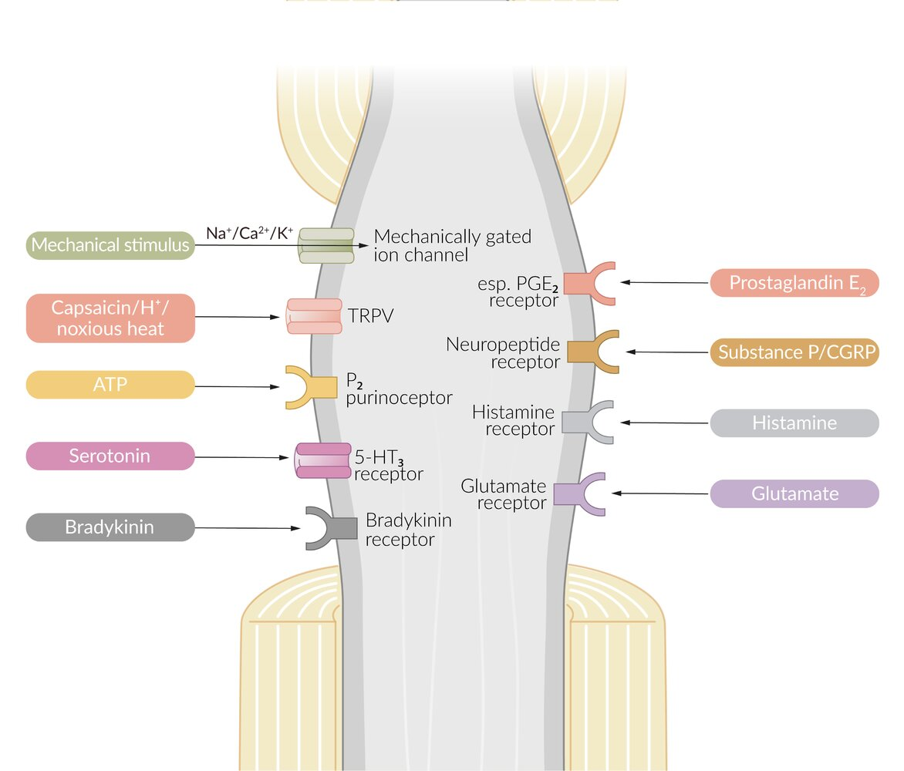
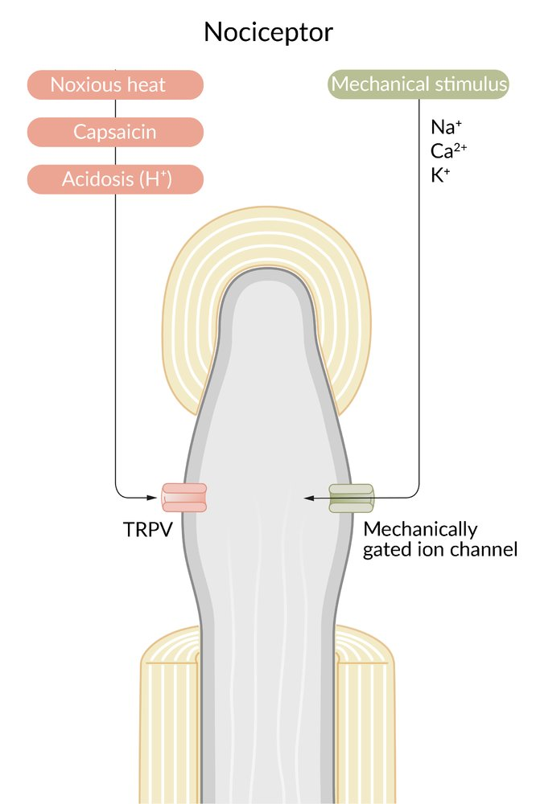
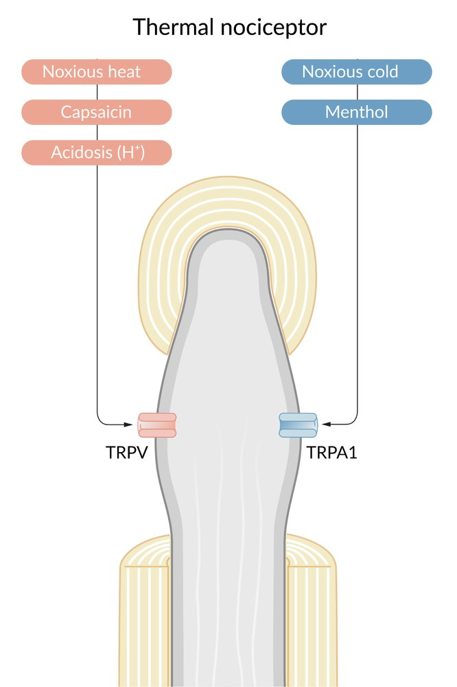

# Local anesthetic agents

*Categories: Clinical knowledge > Surgery > Preoperative and postoperative care > Local anesthetic agents*

[Original Article Link](https://coursology-qbank.com/amboss/article/wN0hWg)

---

## Summary

Local <u>anesthetics</u> (LAs) are drugs that block the sensation of <u>pain</u> in the region where they are administered. LAs act by reversibly blocking the <u>sodium</u> channels of nerve fibers, thereby inhibiting the conduction of nerve impulses. Nerve fibers that carry <u>pain</u> sensation have the smallest diameter and are the first to be blocked by LAs. Loss of <u>motor function</u> and sensation of touch and pressure follow, depending on the duration of action and dose of the LA used. LAs can be infiltrated into <u>skin</u>/subcutaneous tissues to achieve <u>local anesthesia</u> or into the epidural/<u>subarachnoid space</u> to achieve <u>regional anesthesia</u> (e.g., <u>spinal anesthesia</u>, <u>epidural anesthesia</u>). Some LAs (<u>lidocaine</u>, <u>prilocaine</u>, <u>tetracaine</u>) are effective on topical application and are used before minor invasive procedures (<u>venipuncture</u>, <u>bladder catheterization</u>, endoscopy/<u>laryngoscopy</u>). LAs are divided into two groups based on their chemical structure. The amide group (<u>lidocaine</u>, <u>prilocaine</u>, <u>mepivacaine</u>, etc.) is safer and, hence, more commonly used in clinical practice. The <u>ester group</u> (<u>procaine</u>, <u>tetracaine</u>) has a higher risk of causing <u>allergic reactions</u> or systemic toxicity and is therefore reserved for patients with known <u>allergies</u> to drugs of the amide group. <u>Local anesthetic systemic toxicity</u> may result from <u>intravascular</u> injection or administration of LA that exceeds the <u>maximum recommended local anesthetic dose</u>. Toxicity may affect the <u>CNS</u> (e.g., <u>tinnitus</u>, <u>seizures</u>) or <u>cardiovascular system</u> (e.g., <u>arrhythmias</u>, <u>cardiac arrest</u>).

See “<u>Local anesthesia</u>” and “<u>Regional anesthesia</u>” for the clinical applications of these agents.

---

## Overview

* Clinical applications: See “<u>Local anesthesia</u>” and “<u>Regional anesthesia</u>” for details.

* <u>Topical anesthesia</u> (e.g., <u>lidocaine</u>, <u>tetracaine</u>, <u>prilocaine</u>)

* <u>Infiltration anesthesia</u>

* <u>Skin</u> <u>surgery</u> (e.g., <u>skin biopsy</u>)

* <u>Epidural anesthesia</u>

* <u>Spinal anesthesia</u>

* Pharmacology [[1]](https://coursology-qbank.com/amboss/article/edYxKL)

* LAs have a <u>lipophilic</u> group linked with a <u>hydrophilic</u> group by a hydrocarbon chain

* Bind to the inner portion of <u>voltage-gated sodium channels</u> of the nerve fibers → reversible blockage of <u>sodium</u> channels → inhibition of nerve excitation and impulse conduction (<u>pain</u> signals)

* Adverse effects [[2]](https://coursology-qbank.com/amboss/article/UdYb6L)

* <u>Allergy</u> (acute <u>anaphylaxis</u> or delayed pruritic <u>rash</u>)

* Cross-reactivity between amide group and <u>ester group</u> agents is very rare.

* If a patient has an <u>allergy</u> to one group, prescribe agents from the other group.

* <u>Local anesthetic systemic toxicity</u> (LAST)

* <u>Methemoglobinemia</u> (mostly with <u>benzocaine</u>)

|  Comparison of local <u>anesthetic agents</u> [[1]](https://coursology-qbank.com/amboss/article/edYxKL)[[2]](https://coursology-qbank.com/amboss/article/UdYb6L)  |  |  |  |  |
| --- | --- | --- | --- | --- |
|  | Ester group anesthetics |  | Amide group anesthetics |  |
| Short-acting | Long-acting | Intermediate-acting | Long-acting |  |
| Common agents |   * Procaine  * Chloroprocaine  * Benzocaine    |  * Tetracaine   |   * Lidocaine  * Prilocaine  * Mepivacaine    |   * Bupivacaine  * Etidocaine  * Ropivacaine    |
| Metabolism |  * Metabolized in the serum by esterases   |  |  * Metabolized in the <u>liver</u>   |  |
| Safety profile |  * Higher risk of causing <u>allergic reactions</u> or LAST   |  |  * Generally safer than the ester agents   |  |

> [!NOTE]
> Amide LAs (e.g., lidocaine, bupivacaine) contain an "i" in their name preceding “-caine.” Ester LAs do not.

---

## Pharmacodynamics

* Pain pathway: thermal, mechanical, or chemical stimuli → <u>nociceptor</u> stimulation → conversion of stimulus to an electric signal (<u>action potential</u>) → neural conduction of electric signal to the <u>CNS</u> → perception of <u>pain</u>

* LAs bind to the inner portion of <u>voltage</u>-gated <u>sodium</u> channels of the nerve fibers;   → reversible blockage of <u>sodium</u> channels → inhibition of nerve excitation and impulse conduction (<u>pain</u> signals)  → <u>local anesthesia</u> in the area supplied by the nerve

* LAs with 3° amine structure infiltrate membranes in their uncharged form, then bind to ion channels in their charged form.

* The susceptibility of nerve fibers to LA depends on their firing rate, size, and myelination. 

* Rapidly firing <u>neurons</u> are blocked more effectively than slow-firing <u>neurons</u>.

* Small diameter nerves are the first to be anesthetized.

* Myelinated nerves are blocked faster than unmyelinated nerves.

* Because size is thought to outweigh myelination, nerve fibers are blocked in the following order:
1. * Small myelinated fibers
2. * Small unmyelinated fibers
3. * Large myelinated fibers
4. * Large unmyelinated fibers

* Loss of sensation occurs in the following order:
1. * <u>Pain</u>
2. * Temperature
3. * Touch
4. * Pressure

* Factors that affect the <u>efficacy</u> of LA

* Use of vasoconstrictors (e.g., <u>epinephrine</u>) reduces bleeding and systemic absorption of LAs, leading to a prolonged <u>anesthetic</u> effect.

* Inflamed/infected tissue: decreased <u>efficacy</u> of LAs

* LAs are composed of a <u>lipophilic</u> group and a <u>hydrophilic</u> group, and permeability depends on which group is predominant.

* Because inflamed tissue has an acidic environment, alkaline <u>anesthetics</u> are charged;  and the <u>hydrophilic</u> group predominates → ↓ ability to penetrate the nerve cell membranes → ↓ <u>efficacy</u>

Mechanism of action: Local anesthetics

Polymodal nociceptor

Mechanosensory nociceptor

Thermal nociceptor

References:[[3]](https://coursology-qbank.com/amboss/article/JE0s93)[[4]](https://coursology-qbank.com/amboss/article/IE0YC3)[[5]](https://coursology-qbank.com/amboss/article/rE0fC3)[[6]](https://coursology-qbank.com/amboss/article/7E04C3)[[7]](https://coursology-qbank.com/amboss/article/HE0KC3)

---

## Adverse effects

Complications are generally uncommon.

### Local anesthetic systemic toxicity (LAST) [[8]](https://coursology-qbank.com/amboss/article/AN1Rdh0)[[9]](https://coursology-qbank.com/amboss/article/K71U5R0)[[10]](https://coursology-qbank.com/amboss/article/Cs1qCR0)

LAST is a potentially fatal <u>adverse event</u> caused by dose-dependent LA blockade of <u>sodium</u> channels in the <u>CNS</u> and <u>cardiovascular system</u> (<u>CVS</u>). [[8]](https://coursology-qbank.com/amboss/article/AN1Rdh0)[[9]](https://coursology-qbank.com/amboss/article/K71U5R0)

#### Etiology

* <u>Iatrogenic</u> causes

* Local <u>anesthetic</u> overdose

* Inadvertent <u>intravascular</u> administration of <u>infiltration anesthesia</u>

* Patient risk factors for LAST [[9]](https://coursology-qbank.com/amboss/article/K71U5R0)[[11]](https://coursology-qbank.com/amboss/article/BG1zYi0)

* Extremes of age (e.g., < 4 months or > 70 years)

* Low body weight and/or <u>frailty</u>

* <u>Heart</u>, <u>liver</u>, or <u>kidney</u> disease

* <u>Hypoxia</u> and/or <u>acidosis</u>

#### Clinical features [[8]](https://coursology-qbank.com/amboss/article/AN1Rdh0)[[9]](https://coursology-qbank.com/amboss/article/K71U5R0)

* Onset: typically within minutes of LA injection but may occur hours later [[12]](https://coursology-qbank.com/amboss/article/KH1UrR0)[[13]](https://coursology-qbank.com/amboss/article/As1RxR0)

* <u>Prodrome</u>: Minor <u>CNS</u> symptoms often precede major toxicity. [[9]](https://coursology-qbank.com/amboss/article/K71U5R0)[[13]](https://coursology-qbank.com/amboss/article/As1RxR0)[[14]](https://coursology-qbank.com/amboss/article/_s15xR0)

* <u>CNS</u> manifestations

* <u>Prodromal</u> symptoms: <u>tinnitus</u>, metallic <u>taste</u>, perioral <u>paresthesias</u>, <u>agitation</u> and/or confusion

* <u>Seizures</u> (most common single <u>CNS</u> feature)

* <u>CNS depression</u> (e.g., <u>somnolence</u>, <u>coma</u>)

* Cardiovascular manifestations (especially with <u>bupivacaine</u>): initial cardiac excitation followed by cardiac <u>depression</u>

* <u>Tachycardia</u>, <u>hypertension</u>; , <u>tachyarrhythmia</u> (especially with <u>cocaine</u>)

* <u>Bradycardia</u>;  , <u>atrioventricular block</u> , <u>asystole</u>

* Decreased cardiac contractility;  , <u>hypotension</u>, <u>cardiogenic shock</u>

> [!WARNING]
> Be vigilant for symptoms of LAST when administering moderate to large doses of local <u>anesthetics</u>. [[9]](https://coursology-qbank.com/amboss/article/K71U5R0)

#### Management [[9]](https://coursology-qbank.com/amboss/article/K71U5R0)[[12]](https://coursology-qbank.com/amboss/article/KH1UrR0)[[15]](https://coursology-qbank.com/amboss/article/LH1wIR0)

* <u>Primary survey</u>

* Call for help.

* <u>Secure the airway</u> and start 100% <u>oxygen therapy</u>.

* <u>Treat acute seizures</u> preferentially with <u>benzodiazepines</u>.

* <u>Hemodynamic instability</u>: Start <u>lipid emulsion therapy</u>.

* LAST-induced cardiac arrest: Provide <u>ACLS</u> with the following modifications. [[16]](https://coursology-qbank.com/amboss/article/HnXKuA)

* Administer low-dose <u>epinephrine</u> (≤ 1 mcg/kg).

* Treat <u>shockable rhythms</u> with <u>amiodarone</u>; avoid <u>lidocaine</u>.

* Consider <u>cardiopulmonary bypass</u> or <u>ECMO</u> early in refractory arrest. [[9]](https://coursology-qbank.com/amboss/article/K71U5R0)[[15]](https://coursology-qbank.com/amboss/article/LH1wIR0)

* <u>Shock</u>: Low-dose <u>epinephrine</u> is the preferred <u>vasopressor</u>; avoid <u>vasopressin</u>.

* <u>Tachyarrhythmias</u>

* <u>Amiodarone</u> is the preferred antiarrhythmic.

* Avoid <u>lidocaine</u>, <u>procainamide</u>, <u>CCBs</u>, and <u>beta blockers</u>.

* Disposition

* <u>Continuous cardiac monitoring</u> for a minimum of: [[15]](https://coursology-qbank.com/amboss/article/LH1wIR0)

* 4–6 hours following resolution of <u>arrhythmia</u> or <u>shock</u>

* 2 hours following <u>seizure</u> termination

* Admit all patients with <u>ROSC</u> after <u>cardiac arrest</u> to <u>ICU</u>.

> [!WARNING]
> Consider <u>lipid emulsion therapy</u> early for all patients with LAST.

#### Intravenous lipid emulsion therapy  [[15]](https://coursology-qbank.com/amboss/article/LH1wIR0)[[17]](https://coursology-qbank.com/amboss/article/MFXMi-)

* Indications

* LAST

* Life-threatening, refractory toxicity from other lipid-soluble drugs

* Contraindications: known egg <u>allergy</u>, <u>chronic liver disease</u>, fat metabolism disorders

* Administration protocol

* Lipid emulsion 20% bolus DOSAGE followed by lipid emulsion 20% infusion DOSAGE [[15]](https://coursology-qbank.com/amboss/article/LH1wIR0)[[17]](https://coursology-qbank.com/amboss/article/MFXMi-)[[18]](https://coursology-qbank.com/amboss/article/JFXsQ-)

* Consider a repeat bolus and doubling the infusion if the patient remains unstable after 5 minutes.  [[12]](https://coursology-qbank.com/amboss/article/KH1UrR0)

* Continue lipid emulsion infusion for ≥ 15 minutes once hemodynamically stable.

* Maximum lipid dose: 12 mL/kg

#### Prevention [[9]](https://coursology-qbank.com/amboss/article/K71U5R0)

* Do not exceed the <u>maximum local anesthetic dose</u>. [[8]](https://coursology-qbank.com/amboss/article/AN1Rdh0)[[9]](https://coursology-qbank.com/amboss/article/K71U5R0)

* Reduce the dose by 20–25% in patients with <u>risk factors for LAST</u>. [[9]](https://coursology-qbank.com/amboss/article/K71U5R0)[[11]](https://coursology-qbank.com/amboss/article/BG1zYi0)

* Use a proper technique for <u>infiltration anesthesia</u>.

> [!WARNING]
> <u>Aspirate</u> the syringe prior to each injection to avoid <u>intravascular</u> injection.

|  Maximum local anesthetic doses [[10]](https://coursology-qbank.com/amboss/article/Cs1qCR0)  |  |  |
| --- | --- | --- |
| Local <u>anesthetic</u> | Without <u>epinephrine</u> | With <u>epinephrine</u> |
| <u>Lidocaine</u> | 3–5 mg/kg | 7 mg/kg |
| <u>Mepivacaine</u> | 5 mg/kg | 7 mg/kg |
| <u>Bupivacaine</u> | 2 mg/kg | 3 mg/kg |
| <u>Ropivacaine</u> | 3 mg/kg | 3 mg/kg |

### Other adverse effects

* <u>Allergy</u>

* Acute: <u>anaphylaxis</u> (rare)

* Delayed: pruritic <u>rash</u> with <u>blisters</u> at site of LA injection within 72 hours of administration

* <u>Vasovagal syncope</u>

* <u>Methemoglobinemia</u>: hematologic;  toxicity following local <u>anesthetic</u> administration (most commonly following <u>benzocaine</u>)  [[19]](https://coursology-qbank.com/amboss/article/2dYT6L)[[20]](https://coursology-qbank.com/amboss/article/uG1pai0)

* Possible risk of <u>ischemic</u> complications if LA with a vasoconstrictor is used in areas supplied by <u>end arteries</u> (e.g., digits, <u>ears</u>, <u>penis</u>)  [[8]](https://coursology-qbank.com/amboss/article/AN1Rdh0)[[21]](https://coursology-qbank.com/amboss/article/2VWTF40)[[22]](https://coursology-qbank.com/amboss/article/VVWGt40)

We list the most important adverse effects. The selection is not exhaustive.

---