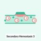
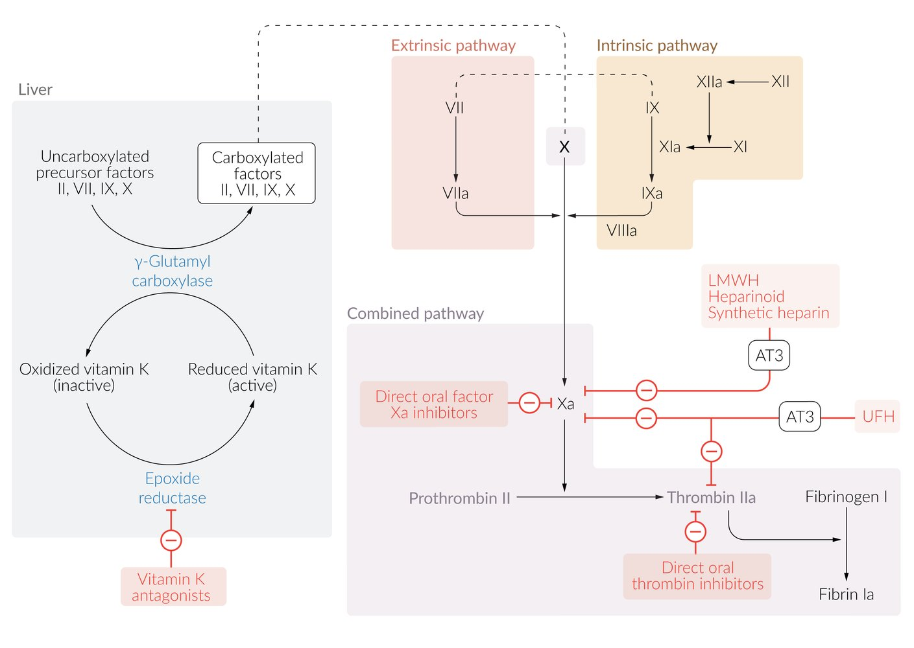
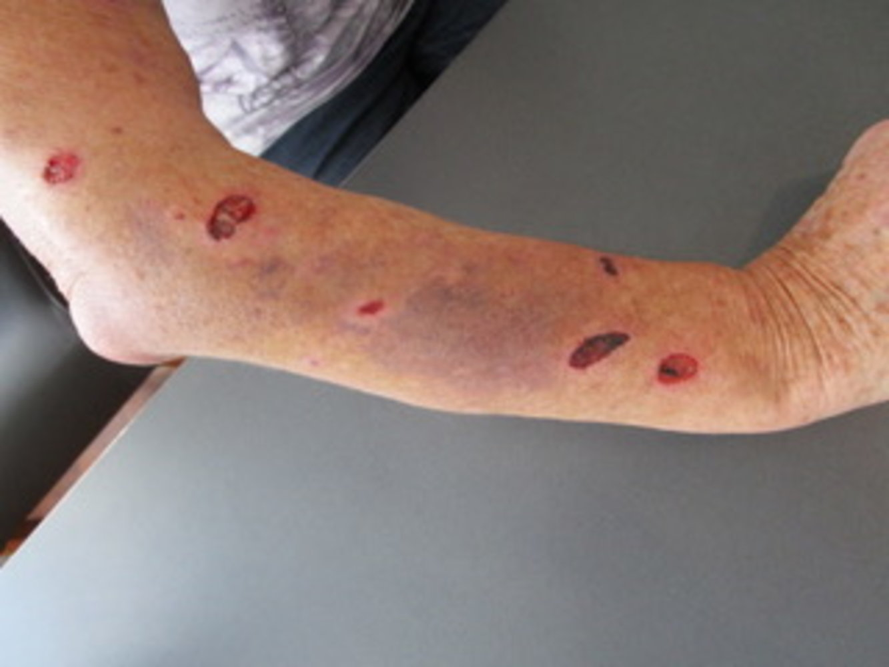
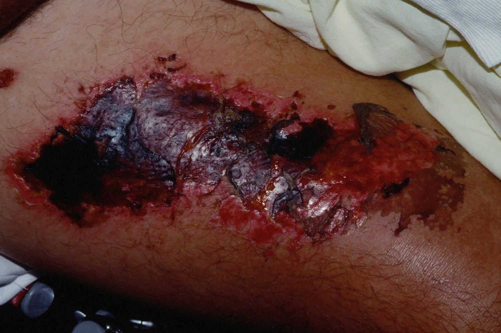

# Oral anticoagulants

*Categories: Clinical knowledge > Surgery > Preoperative and postoperative care > Oral anticoagulants*

[Original Article Link](https://coursology-qbank.com/amboss/article/Tm06Ug)

---

## Summary

<u>Anticoagulants</u> are used for treating and preventing embolic events. The most common oral anticoagulatory agents are <u>vitamin K antagonists</u> such as <u>warfarin</u> and <u>phenprocoumon</u>. Non-<u>vitamin K</u> <u>antagonist</u> oral <u>anticoagulants</u> (<u>NOACs</u>) like <u>dabigatran</u> and <u>rivaroxaban</u> have also gained popularity in recent years. <u>Vitamin K antagonists</u> inhibit the enzyme <u>vitamin K epoxide reductase</u>, thereby blocking hepatic synthesis of the active, reduced form of <u>vitamin K</u> (needed for <u>carboxylation</u> of <u>coagulation factors</u> II, VII, IX, and X, <u>protein C</u>, <u>protein S</u>). This effect can last for several days, which complicates exact dosing and makes regular monitoring necessary. <u>Vitamin K antagonists</u> are also metabolized by C-P450 (<u>CYP</u>) enzymes and therefore interact with a broad range of foods and drugs. <u>NOACs</u> act selectively via inhibition of <u>thrombin</u> (<u>dabigatran</u>) or <u>factor Xa</u> (<u>rivaroxaban</u>, <u>apixaban</u>, <u>edoxaban</u>). Because of their comparatively short <u>half-life</u> and fewer interactions, <u>NOACs</u> are easier to control and administer than <u>warfarin</u> and do not require regular monitoring to ensure their <u>efficacy</u> and safety. For all substances, it is important to consider the dose-dependent risk of bleeding, especially when combining different substances that affect <u>hemostasis</u> (e.g., <u>aspirin</u>, <u>clopidogrel</u>, <u>ticagrelor</u>).

See also “<u>Periprocedural management of oral anticoagulant therapy</u>” and “<u>Anticoagulation reversal</u>.”

---

## Overview

### <u>Overview of commonly used oral anticoagulants</u>

| Overview of commonly used oral anticoagulants |  |  |  |  |
| --- | --- | --- | --- | --- |
|  |  | Mechanism of action | Advantages | Disadvantages |
|  Vitamin K antagonists (<u>coumarins</u>) |  Phenprocoumon Warfarin [[1]](https://coursology-qbank.com/amboss/article/iB0J0i)[[2]](https://coursology-qbank.com/amboss/article/QB0u0i)  |   * Inhibit hepatic <u>vitamin K epoxide reductase</u> → ↓ hepatic synthesis (recycling) of the active, reduced form of <u>vitamin K</u> → ↓ γ-<u>carboxylation</u> of <u>glutamate</u> residues on coagulation <u>factors II</u>, VII, IX, and X as well as <u>protein C</u> and <u>protein S</u>  * Mutations and <u>polymorphisms</u> in <u>gene</u> <u>VKORC1</u>  alter the effect of <u>vitamin K antagonists</u>.    |   * Well-known effects and side effects  * Low costs  * In cases of <u>major bleeding</u>:  * Direct reversal by replacement (e.g., with <u>prothrombin complex concentrate</u>, <u>FFP</u>)  * Indirect/delayed reversal by increasing production of <u>coagulation factors</u> (e.g., with <u>vitamin K</u> substitution)    |   * Difficult to manage   * Long <u>half-life</u>  * Regular monitoring of the <u>PT</u>/<u>INR</u> required (as <u>vitamin K</u> <u>antagonists</u> affect the <u>extrinsic coagulation pathway</u>)  * Requires periprocedural <u>bridging anticoagulation</u>  * Broad range of interactions (see “<u>Warfarin</u> interactions” below)  * Not suited for acute therapy of <u>pulmonary embolism</u> or <u>deep vein thrombosis</u>    |
| Direct oral anticoagulants |  |  |  |  |
| Direct oral thrombin inhibitors |  Dabigatran [[3]](https://coursology-qbank.com/amboss/article/PB0Wai)  |   * Selective <u>thrombin</u> <u>antagonist</u>  * For more information about other drugs from this class, see <u>direct thrombin inhibitors</u> under <u>parenteral anticoagulation</u>    |   * Easily manageable (similar to heparins) when administered orally * Regular monitoring of <u>coagulation parameters</u> is not required → improved patient compliance  * <u>Antidotes</u> available in the case of <u>major bleeding</u>  * <u>Dabigatran</u>: idarucizumab (<u>monoclonal antibody</u>) [[4]](https://coursology-qbank.com/amboss/article/jB0_0i)  * <u>Apixaban</u> and <u>rivaroxaban</u>: <u>4-factor PCC</u> (<u>off-label</u>) or <u>aPCC</u> (<u>off-label</u>)    |   * Costly  * Limited clinical experience with these drugs  * Not recommended, and partially contraindicated, in patients with artificial cardiac valves  * Not suited for patients with <u>valvular atrial fibrillation</u>    |
| Direct oral factor Xa inhibitors |  Apixaban Rivaroxaban Edoxaban  |  * Selective and direct inhibition of <u>factor Xa</u>   |  |  |

### General notes regarding oral anticoagulation

* Indications for all oral <u>anticoagulants</u>

* Prophylaxis of <u>thromboembolism</u> following:

* <u>DVT</u> and/or <u>pulmonary embolism</u>

* Prolonged <u>immobilization</u> after <u>surgery</u> (e.g., especially in knee or hip <u>surgery</u>)

* <u>Nonvalvular atrial fibrillation</u>

* For specific indications, see “Indications” below.

* Expected laboratory changes

* <u>Warfarin</u>: increased <u>PT</u>/<u>INR</u>, no change to <u>PTT</u> or TT (routinely monitored)

* <u>Direct thrombin inhibitors</u>; : prolonged <u>thrombin time</u> (TT), no change to <u>PTT</u> or <u>PT</u> (not routinely monitored)

* Direct <u>factor Xa inhibitors</u>; : prolonged <u>PT</u> and <u>PTT</u>, unchanged <u>thrombin time</u> (not routinely monitored)

> [!NOTE]
> The most important side effect of all oral <u>anticoagulants</u> is a dose-dependent increase in bleeding risk.

> [!NOTE]
> DRAW: Dabigatran, Rivaroxaban, Apixaban, and Warfarin are the most important oral <u>anticoagulants</u>.

> [!NOTE]
> RivaroXaban, apiXaban, and edoXaban are factor Xa inhibitors.

> [!NOTE]
> WARsaw is an EXTRaordinary Place To check out: WARfarin affects the EXTRinsic pathway; therefore, <u>PT</u> should be regularly checked.

> [!NOTE]
> WEPT: Warfarin Extrinsic pathway <u>PT</u>

Secondary Hemostasis - Part 3: Coagulation on Negatively Charged Surfaces

Mechanism of action: anticoagulants that prevent secondary hemostasis

### <u>Comparison of heparin and warfarin</u>

| Heparin vs. warfarin |  |  |  |  |
| --- | --- | --- | --- | --- |
| <u>Anticoagulant</u> | Route of administratIon | Mechanism of action | Monitoring | Reversal agents |
| <u>Heparin</u> |   * Intravenous  * Subcutaneous    |   * Activates <u>antithrombin</u> → ↓ action of factors IIa and Xa  * Site of action: blood  * Rapid onset of action  * Shorter half time: duration of action is several hours    |  * <u>PTT</u> (affects intrinsic pathway)   |  * <u>Protamine sulfate</u>   |
| <u>Warfarin</u> |  * Oral   |   * ↓ Synthesis of   * <u>Factors II</u>, VII, IX, and X (<u>procoagulants</u>)  * And <u>proteins</u> C and S (<u>anticoagulants</u>)  * Site of action: <u>liver</u>  * Slow onset of action  * Longer half time: duration of action is several days    |  * <u>PT</u> or <u>INR</u> (affects extrinsic pathway)   |   * <u>Vitamin K</u>  * <u>FFP</u>, <u>PCC</u> (for rapid reversal)    |

---

## Adverse effects

### <u>Vitamin K antagonists</u>

* Dose-dependent increased risk of bleeding

* Small wounds cease to bleed spontaneously and no additional measures are required

* Severe cases of hemorrhage are usually <u>retroperitoneal</u>, intracranial, or gastrointestinal.

* Countermeasures for <u>major bleeding</u> (e.g., extensive or life-threatening) include

* Stop <u>coumarins</u>

* Administer <u>FFP</u> or <u>prothrombin complex concentrate</u> (<u>PCC</u>) for rapid <u>reversal of warfarin</u> effect

* <u>Vitamin K</u>: takes longer to take effect than <u>FFP</u> or <u>PCC</u>

* See also “<u>Reversal of vitamin K antagonists</u>.”

* Warfarin-induced skin necrosis 

* Seen within the first few days of treatment with high doses of <u>warfarin</u>

* <u>Warfarin</u> inhibits all <u>vitamin K</u>-dependent <u>coagulation factors</u>:  <u>anticoagulants</u> <u>protein C</u> and <u>protein S</u> have a relatively short <u>half-life</u> and are depleted more quickly than <u>procoagulants</u> <u>factors II</u>, IX, and X;   → increased <u>factor V</u> and VIII activity;   → initial <u>hypercoagulable state</u>;   → formation of microthrombi → vascular occlusion, tissue <u>infarction</u>, and blood extravasation

* Increased risk in patients with underlying hereditary <u>protein C deficiency</u>

* Presentation: painful <u>purpura</u>, hemorrhagic <u>blisters</u>, and large areas of <u>necrosis</u>; mostly affects <u>subcutaneous adipose tissue</u>

* Immediate management: discontinue <u>warfarin</u>, administer IV <u>vitamin K</u>, <u>unfractionated heparin</u>, and source of <u>protein C</u> (<u>protein C</u> concentrate, <u>FFP</u>); <u>surgical debridement</u> and grafting in therapy-refractory cases

* Prevention: temporary bridging anticoagulation with <u>heparin</u> until <u>warfarin</u> has started to act and the initial <u>hypercoagulable state</u> has been bridged

> [!NOTE]
> Individuals with <u>protein C</u> deficiency are at a higher risk of developing <u>warfarin</u> <u>necrosis</u>.

Warfarin-induced skin necrosis

Warfarin-induced skin necrosis

### Direct <u>factor Xa</u> inhibitors and <u>direct thrombin inhibitors</u>

* Dose-dependent increased risk of bleeding

* Interventional steps to stop the bleeding

* If <u>major bleeding</u> (e.g., critical site and/or life-threatening) occurs, administer <u>PCC</u>

* General management and specific medication <u>antidotes</u>

* <u>Antifibrinolytic</u> agents (e.g., <u>tranexamic acid</u>)

* Oral <u>activated charcoal</u>;  reduces absorption if <u>anticoagulants</u> were ingested in the past couple of hours.

* <u>Apixaban</u> and <u>rivaroxaban</u>: <u>PCC</u> (<u>off-label</u>)

* <u>Dabigatran</u>: <u>idarucizumab</u> (<u>monoclonal antibody</u>)

* See also “<u>DOAC reversal</u>.”

References:[[5]](https://coursology-qbank.com/amboss/article/NB0-ai)[[6]](https://coursology-qbank.com/amboss/article/MB0MYi)[[7]](https://coursology-qbank.com/amboss/article/LB0wYi)[[8]](https://coursology-qbank.com/amboss/article/QgYuEo)

We list the most important adverse effects. The selection is not exhaustive.

---

## Indications

|  Overview of indications of oral anticoagulants [[9]](https://coursology-qbank.com/amboss/article/pB0Lbi) |  |  |  |
| --- | --- | --- | --- |
| Drugs |  | Indications |  |
| <u>Coumarins</u> |  <u>Phenprocoumon</u> <u>Warfarin</u>  |   * Prophylaxis of <u>thromboembolism</u> (e.g., <u>stroke</u>) in patients with the following:  * <u>Valvular atrial fibrillation</u> and <u>nonvalvular atrial fibrillation</u>  * <u>Heart valve</u> replacement  * <u>Heart failure</u>  * <u>Myocardial</u> <u>ischemia</u>  * Standard target <u>INR</u>: 2.0–3.0 (higher in mechanical <u>heart valves</u> or in special high-risk circumstances; usually 2.0–3.5)    |   * Therapy and secondary prophylaxis of:  * <u>Deep vein thrombosis</u>  * <u>Pulmonary embolism</u>  * Prophylaxis of <u>thromboembolism</u> following: * Total knee or <u>hip replacement</u>, <u>hip fracture</u> <u>surgery</u>    |
| <u>Direct thrombin inhibitors</u> | <u>Dabigatran</u> |  * <u>Nonvalvular atrial fibrillation</u> (increased risk of <u>stroke</u>)   |  |
| Direct <u>factor Xa inhibitors</u> |  <u>Apixaban</u> <u>Rivaroxaban</u> <u>Edoxaban</u>  |  |  |

---

## Contraindications

* General contraindications

* Coagulopathies; hepatic dysfunction with impaired hepatic production of <u>coagulation factors</u>

* Acute bleeding

* Suspected vascular lesions, increased risk of severe bleeding

* Severe <u>arterial hypertension</u>, <u>aneurysm</u>

* <u>Endocarditis</u>

* Recent cardiovascular events (e.g., cerebral <u>ischemia</u>)

* <u>Gastrointestinal bleeding</u>

* <u>Surgery</u> or interventional procedures (e.g., <u>biopsy</u>)

* Tendency to fall

* Severe <u>renal insufficiency</u>

* Concurrent administration of several <u>anticoagulants</u>

* <u>Pregnancy</u> and <u>breastfeeding</u>

* <u>Warfarin</u> crosses the <u>placenta</u>, causing <u>teratogenicity</u> and fetal bleeding

* Side effects of <u>NOACs</u> during <u>pregnancy</u> and <u>breastfeeding</u> are unknown. Therefore, they are currently not recommended.

* Specific contraindications
* <u>Dabigatran</u>: concurrent administration of <u>ketoconazole</u>, <u>itraconazole</u>, <u>cyclosporine</u>, <u>tacrolimus</u>, or <u>dronedarone</u>

> [!NOTE]
> <u>Warfarin</u> crosses the <u>placenta</u> and is <u>teratogenic</u>, in contrast to <u>heparin</u>, which does not cross the <u>placenta</u>.

References:[[10]](https://coursology-qbank.com/amboss/article/IB0YXi)[[11]](https://coursology-qbank.com/amboss/article/rB0fXi)

We list the most important contraindications. The selection is not exhaustive.

---

## Interactions

### <u>Warfarin</u> interactions

<u>Warfarin</u> is metabolized by <u>cytochrome P450</u> (<u>CYP</u>) enzymes.  Its effects can be significantly impacted by a variety of interactions; for this reason, <u>warfarin</u> serum levels should be monitored regularly.

* Decrease of <u>anticoagulant</u> effect

* <u>Rifampicin</u>, <u>carbamazepine</u>, <u>St. John's wort</u>, ginger, licorice: induce metabolic breakdown of <u>warfarin</u> via induction of <u>cytochrome P450</u>

* Foods rich in <u>vitamin K</u> (e.g., kale, spinach): counter effect of <u>warfarin</u>

* <u>Gastric acid</u> inhibition (<u>PPI</u> use), <u>cholestyramine</u> treatment: impaired uptake of <u>warfarin</u>

* Increase of <u>anticoagulant</u> effect

* Several <u>antidepressants</u> and <u>antibiotics</u>, <u>PPIs</u>, <u>amiodarone</u>, grapefruit: impair metabolic breakdown via inhibition of <u>cytochrome P450</u>

* <u>Acetaminophen</u>: metabolite of <u>acetaminophen</u> interrupts <u>vitamin K</u> cycle via inhibition of <u>vitamin K</u>-dependent carboxylase

* <u>Sulfonamides</u>, <u>sulfonylureas</u>: competitively block or displace <u>warfarin</u> at <u>plasma protein binding</u> sites

* Damage to gut flora (e.g., <u>antibiotic therapy</u>): impaired bacterial <u>vitamin K</u> synthesis

> [!NOTE]
> “Chronic <u>alcohol</u>ics Steal Phen-Phen and Never Refuse Greasy Carbs): Chronic <u>alcohol</u> use, St. John's wort, Phenytoin, Phenobarbital, Nevirapine, Rifampin, Griseofulvin, and Carbamazepine are <u>P450 inducers</u> (↓ <u>warfarin</u> levels).

> [!NOTE]
> “sickfaces.com group”: Sulfonamides, Isoniazid, Cimetidine, Ketoconazole, Fluconazole, Alcohol (<u>binge drinking</u>), Ciprofloxacin, Erythromycin, Sodium <u>valproate</u>, Chloramphenicol, Omeprazole, Metronidazole, and Grapefruit juice are <u>P450 inhibitors</u>.
> References:[[12]](https://coursology-qbank.com/amboss/article/z3YrOK)

---

## Additional considerations

* <u>Bridging anticoagulation</u>: the administration of <u>heparin</u> for the duration of the transient <u>hypercoagulable state</u> caused by <u>warfarin</u> therapy. <u>Heparin</u> prevents coagulation by activating <u>antithrombin</u>.

* Reduces risk of <u>venous thromboembolism</u> and <u>skin</u> <u>necrosis</u>

* May also be used during interruptions of <u>warfarin</u> therapy (e.g., <u>surgery</u>)

* <u>Periprocedural bridging anticoagulation</u> (see “<u>Periprocedural management of VKAs</u>” for details) 
1. * Interrupt <u>VKAs</u> as needed (e.g., patients with high <u>periprocedural bleeding risk</u>) a few days before the procedure.
2. * Initiate <u>bridging anticoagulation</u> once the <u>INR</u> is in the subtherapeutic range,
3. * Administer the last dose of <u>LMWH</u> 24 hours before the procedure (4–6 hours before the procedure for <u>UFH</u>).
4. * Resume <u>VKA</u> after <u>surgery</u>;  ; consider <u>postprocedural bridging anticoagulation</u> as needed (e.g., patients with high <u>periprocedural thrombotic risk</u>.

References:[[13]](https://coursology-qbank.com/amboss/article/HB0KXi)

---