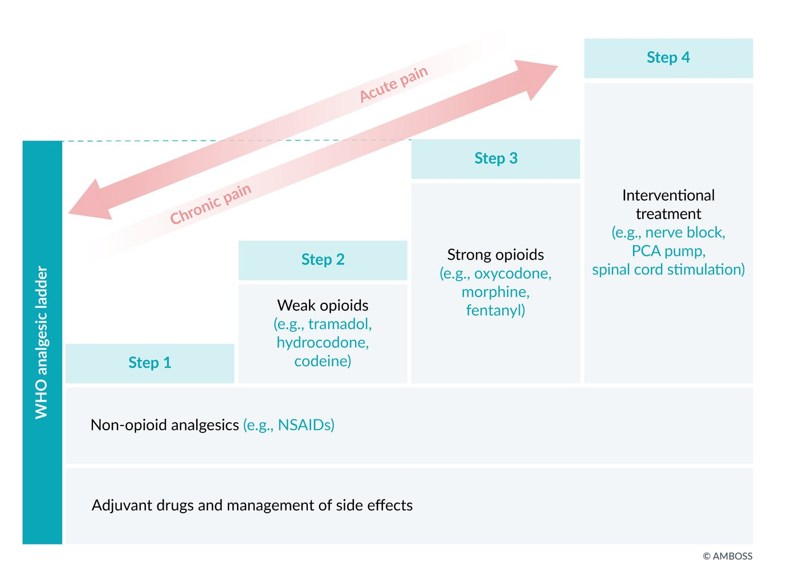
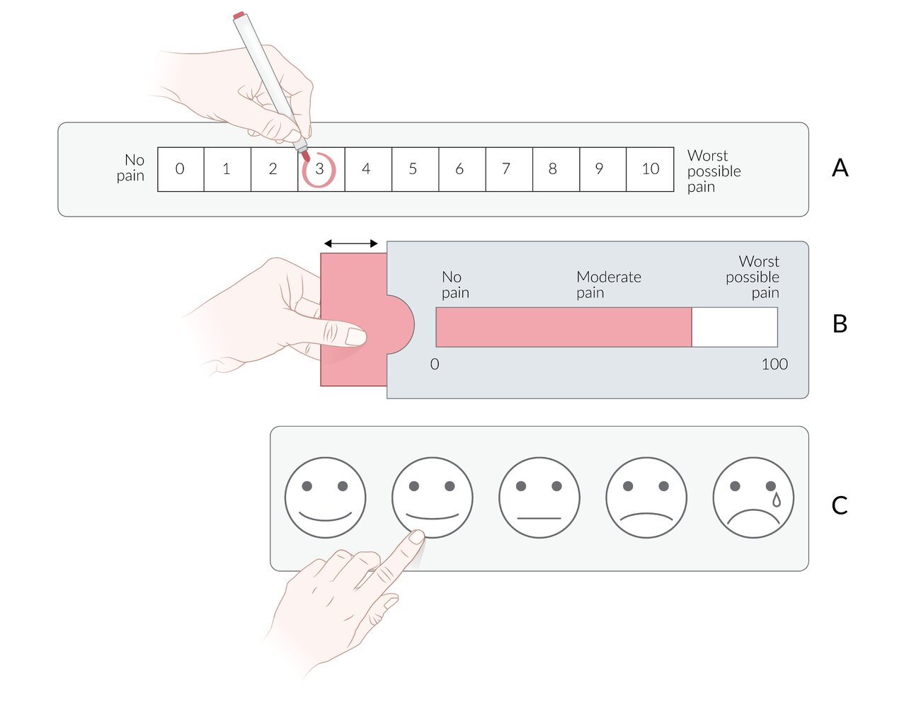

# Overview of palliative medicine

*Categories: Clinical knowledge > Surgery > Preoperative and postoperative care > Overview of palliative medicine*

[Original Article Link](https://coursology-qbank.com/amboss/article/3n0SGg)

---

## Summary

Palliative medicine is a comprehensive, interdisciplinary approach to medical care that aims to relieve suffering and provide optimal quality of life in patients with serious or life-threatening illnesses. It is often provided in conjunction with life-prolonging therapy. Crucial components of palliative medicine include symptom relief, assistance in the organization of nursing and social services, and psychological support of patients and their families. As a consequence, palliative care teams are typically multidisciplinary: Palliative care specialists identify needs and coordinate care, oncologists (or other specialists) manage the underlying disease, primary care providers address symptom relief, <u>pain</u> specialists treat advanced <u>pain</u>, and mental health providers and <u>chaplains</u> administer psychological and spiritual support. The palliative care team addresses symptoms including <u>pain</u>, <u>breathlessness</u>, <u>nausea</u>, <u>constipation</u>, and <u>delirium</u>, and provides end-of-life comfort care. Palliative care has been shown to decrease symptom intensity, improve quality of life, decrease hospital admissions, and help bereaved family members adapt to their loss. If a patient desires or meets the criteria for palliative care referral, it should be initiated as quickly as possible.

---

## Basics

* Key elements of palliative care

* Symptom relief, particularly sufficient <u>analgesia</u>

* Assistance in the organization of adequate, needs-based care

* Support regarding social services

* Psychological support of patients and their families

* Members of a palliative care team

* Physicians (including palliative care specialists)

* Nurses

* Social workers

* Psychologists

* <u>Chaplains</u>

* Pharmacists

> [!TIP]
> Palliative medicine is not synonymous with <u>end-of-life care</u>. It is often used to improve a patient's quality of life even as life-prolonging therapy continues.

References:[[1]](https://coursology-qbank.com/amboss/article/1hY21K)

---

## Symptoms and symptom control

### General approach [[2]](https://coursology-qbank.com/amboss/article/7bc4Ea0)[[3]](https://coursology-qbank.com/amboss/article/HbcKEa0)[[4]](https://coursology-qbank.com/amboss/article/sbctEa0)

* Consider enrolling patients with cancer or other high-<u>morbidity</u> illness in a palliative care program.

* Frequently reassess the patient's symptoms.

* If new symptoms arise or current symptoms change, consider investigating the etiology of the change in addition to managing symptoms.

* Discuss the risk-benefit profile and confirm <u>goals of care</u> with patients and caregivers prior to initiating management of a new or newly exacerbated complication.

* Adjust approach to eliminate diagnostic and therapeutic procedures that are too invasive, painful, or have other side effects that are not aligned with the patient's preferences or wishes.

* Involve associated healthcare professionals (e.g., dietitians, physical therapists, and occupational therapists) to help anticipate and prevent complications.

* See also “<u>Principles of cancer care</u>.”

### Overview of symptom management [[1]](https://coursology-qbank.com/amboss/article/1hY21K)[[5]](https://coursology-qbank.com/amboss/article/WhYP1K)[[6]](https://coursology-qbank.com/amboss/article/dhYo1K)

> [!TIP]
> Address reversible underlying causes of symptoms as long as the investigations and treatment required are consistent with the patient's <u>care plan</u> and wishes.

| Overview of <u>symptom management in palliative patients</u> |  |
| --- | --- |
| Symptoms | Symptomatic therapy |
| <u>Pain</u> |   * Optimize nonpharmacological therapy for all patients.  * Consider early escalation to <u>opioids</u> to provide sufficient <u>pain</u> relief and titrate to effect.  * Combine fixed-schedule slow-release <u>opioids</u> with <u>short-acting opioids</u> as needed.  * Consider specific therapy for <u>neuropathic pain</u> and bone <u>pain</u>.    |
| Gastrointestinal |   * <u>Nausea and vomiting</u>: <u>antiemetics</u> (e.g., <u>metoclopramide</u>), <u>fluid therapy</u>  * <u>Constipation</u>  * Optimize fluid and fiber intake.  * Consider treatment with <u>stimulant laxatives</u> with or without <u>osmotic laxatives</u>.  * Others  * Loss of appetite: <u>dexamethasone</u> or <u>prednisolone</u>  [[7]](https://coursology-qbank.com/amboss/article/xgcExb0)  * Thirst: <u>oral care</u>  * <u>Diarrhea</u>: fluid and <u>electrolyte replacement</u>    |
| Pulmonary |   * <u>Dyspnea</u>  * Consider treatment of reversible causes (e.g., <u>pleural effusion</u>).  * Low-dose <u>opioids</u>, e.g., <u>morphine</u>; breathing and relaxation techniques  * <u>Cough</u>: Consider <u>expectorant drugs</u> or <u>antitussive drugs</u> depending on the type of <u>cough</u> (e.g., productive or nonproductive).  [[8]](https://coursology-qbank.com/amboss/article/Ebc8va0)[[9]](https://coursology-qbank.com/amboss/article/Bgczxb0)    |
| <u>CNS</u> |   * <u>Anxiety</u> and <u>depression</u>: <u>benzodiazepines</u>, <u>antidepressants</u>, <u>psychotherapy</u>  * <u>Delirium</u>: <u>antipsychotics</u>, <u>benzodiazepines</u>  * Optimize nonpharmacological and preventative measures (see “<u>Delirium prevention</u>”).  * Consider pharmacotherapy with <u>antipsychotics</u>.  * Add <u>benzodiazepines</u> for refractory symptoms.    |
| Terminal phase |   * Discontinue unnecessary investigations, monitoring, and treatments not required for comfort care.  * Optimize <u>mouth care</u> and patient positioning.  * Optimize route of medication delivery for symptomatic treatment.  * Manage noisy terminal respiratory secretions.  * Respiratory <u>physiotherapy</u>  [[10]](https://coursology-qbank.com/amboss/article/Jgcswb0)  * Repositioning  * Consider <u>anticholinergic drugs</u> to reduce secretions: e.g., <u>glycopyrrolate</u>, <u>atropine</u>. [[5]](https://coursology-qbank.com/amboss/article/WhYP1K)  * Consider <u>palliative sedation</u> in select patients in consultation with a specialist for refractory <u>distress</u> or <u>agitation</u>.    |

---

## Pain

<u>Pain</u> is an unpleasant experience with sensory and emotional components that may occur with or without actual or potential tissue damage. [[11]](https://coursology-qbank.com/amboss/article/cXcaCa0)

### Approach

* Address multifactorial components of <u>pain</u>.

* <u>Nociceptive pain</u>: caused by damage or potential damage to tissue (excluding neural tissue)

* <u>Neuropathic pain</u>: caused by damage to a somatosensory nerve

* <u>Nociplastic pain</u>: caused by altered <u>nociception</u> despite there being no underlying tissue damage

* Mixed pain: the simultaneous or concurrent presence of <u>nociceptive</u>, neuropathic, and/or <u>nociplastic pain</u> in one area of the body [[12]](https://coursology-qbank.com/amboss/article/VXcGCa0)

* Emotional pain: a term used to describe both mental suffering and the impact of emotions on the experience of <u>pain</u>

* Total pain: the combination of physical, social, spiritual, and psychological/<u>emotional pain</u> components [[13]](https://coursology-qbank.com/amboss/article/dXcoCa0)

* Maximize nonpharmacological therapy to either <u>complement</u> or replace pharmacotherapy.

* Use the <u>WHO analgesic ladder</u> to structure treatment.  [[14]](https://coursology-qbank.com/amboss/article/0Xce9a0)[[15]](https://coursology-qbank.com/amboss/article/UXcbxa0)

* Consider the following causes of <u>pain</u> in patients with cancer: 

* Disorders associated with the <u>tumor</u> (e.g., <u>thrombosis</u>, <u>paraneoplastic syndrome</u>)

* Therapy: postoperative <u>pain</u>, side effects of <u>radiotherapy</u> or <u>chemotherapy</u> (e.g., <u>mucositis</u>, <u>polyneuropathies</u>, <u>stomach ulcer</u> associated with <u>NSAIDs</u>)

* <u>Tumor</u> effects: infiltration of <u>soft tissue</u> and bones; compression of nerves, lymphatic vessels, or <u>blood vessels</u>; <u>cerebral edema</u>

Modified WHO Analgesic Ladder

### Nonpharmacological therapy [[3]](https://coursology-qbank.com/amboss/article/HbcKEa0)[[4]](https://coursology-qbank.com/amboss/article/sbctEa0)

* Spiritual and social services: e.g., <u>chaplains</u>, spiritual advisors, and social workers

* Physical interventions: e.g., <u>physical therapy</u>, <u>acupuncture</u>, massage, <u>transcutaneous electrical nerve stimulation</u>

* Mental health interventions: e.g., <u>depression</u> and <u>anxiety</u> treatment, relaxation therapy, <u>cognitive behavioral therapy</u>

### Nonopioid pharmacotherapy [[3]](https://coursology-qbank.com/amboss/article/HbcKEa0)[[14]](https://coursology-qbank.com/amboss/article/0Xce9a0)[[16]](https://coursology-qbank.com/amboss/article/gXcFxa0)

* First-line agents: <u>acetaminophen</u> and <u>NSAIDs</u>

* <u>Neuropathic pain</u>: Consider adding <u>gabapentinoids</u> and <u>antidepressants</u>. [[17]](https://coursology-qbank.com/amboss/article/N1c-SY0)

* <u>Metastatic</u> bone <u>pain</u>

* Consider adding <u>bisphosphonates</u> and <u>denosumab</u>.  [[16]](https://coursology-qbank.com/amboss/article/gXcFxa0)

* Consult radiation oncology for <u>external beam radiotherapy</u>.

|  Nonopioid palliative pain management [[4]](https://coursology-qbank.com/amboss/article/sbctEa0)  |  |  |  |
| --- | --- | --- | --- |
| Medication class |  | Medication | Important considerations |
| <u>Acetaminophen</u> |  |  * <u>Acetaminophen</u> DOSAGE   |   * In patients at risk of hepatic injury, reduce the maximum daily dose to 3000 mg/day.  * May only provide limited <u>pain</u> relief; move quickly to <u>opioid analgesic</u> if <u>pain</u> does not improve.    |
|  <u>NSAIDs</u> [[18]](https://coursology-qbank.com/amboss/article/XtY9XI)  |  |   * <u>Ibuprofen</u> DOSAGE  * <u>Naproxen</u> DOSAGE  * <u>Celecoxib</u> DOSAGE    |   * Use with caution in patients with <u>renal insufficiency</u> or <u>CHF</u>.  * Monitor for signs of renal impairment, gastric <u>ulceration</u>, or bleeding.    |
|  <u>Neuropathic pain</u> [[19]](https://coursology-qbank.com/amboss/article/YgcnFb0)[[20]](https://coursology-qbank.com/amboss/article/bgcHFb0)  | <u>Gabapentinoids</u> |   * <u>Gabapentin</u> DOSAGE  * <u>Pregabalin</u> DOSAGE    |   * Sedation associated with gabapentinoid use is frequently severe.  * Reduce dose in patients > 65 years, frail patients, and those with <u>renal insufficiency</u>.    |
| <u>Antidepressants</u> |   * <u>Duloxetine</u> DOSAGE  * <u>Venlafaxine</u> DOSAGE  * <u>Tricyclic antidepressants</u> (<u>TCAs</u>): e.g., <u>nortriptyline</u> DOSAGE    |  * <u>TCAs</u> are associated with a high <u>incidence</u> of <u>anticholinergic</u> <u>adverse events</u> and should be used with caution.   |  |
|  Bone <u>pain</u> [[21]](https://coursology-qbank.com/amboss/article/Xgc9Fb0)[[22]](https://coursology-qbank.com/amboss/article/cgca8b0)  | <u>Bisphosphonates</u> |  * <u>Zoledronic acid</u> DOSAGE   |  * Must be administered in a clinic or hospital   |
| <u>Monoclonal antibodies</u> |  * <u>Denosumab</u> DOSAGE   |  * May lead to life-threatening <u>hypocalcemia</u>   |  |

> [!TIP]
> Although <u>acetaminophen</u> should be trialed as a first-line <u>analgesic</u>, many patients do not experience significant <u>pain</u> relief with <u>acetaminophen</u> alone. Consider escalation to <u>opioid therapy</u> early. [[23]](https://coursology-qbank.com/amboss/article/ZXcZ9a0)

### <u>Opioid therapy</u> [[23]](https://coursology-qbank.com/amboss/article/ZXcZ9a0)

Most patients require a combination of regularly scheduled slow-release <u>opioids</u> and fast-acting doses as needed for <u>breakthrough pain</u>.

* Treat severe <u>pain</u> first with parenteral therapy.

* Transition to oral medications once the <u>pain</u> is controlled.

* Consider administering preemptive doses before painful procedures, e.g., dressing changes, bed baths.

* Consider continuous <u>opioid</u> infusions to provide sufficient <u>pain</u> relief in terminally ill patients (see “<u>Management of imminently dying patients</u>").

* Consider extended-release formulations in patients whose <u>pain</u> is not controlled with as-needed dosing or those requiring ≥ 4 as-needed doses per day.

> [!TIP]
> Consider starting <u>opioid</u> treatment with lower doses of potent <u>opioids</u> instead of higher doses of weak <u>opioids</u>. [[16]](https://coursology-qbank.com/amboss/article/gXcFxa0)[[24]](https://coursology-qbank.com/amboss/article/vbcAva0)

#### Starting dosages

* Use short-acting agents (e.g., oral <u>morphine</u>, <u>oxycodone</u>, and <u>hydromorphone</u>) for initial doses. 

* Peak: 1–1.5 hours

* Duration: 2–4 hours

* Increase dose only after <u>steady state</u> is reached, i.e., at 4–5 drug <u>half-lives</u> or ∼ 24 hours for short-acting agents.

|  Opioids in palliative pain management [[2]](https://coursology-qbank.com/amboss/article/7bc4Ea0)[[23]](https://coursology-qbank.com/amboss/article/ZXcZ9a0)  |  |  |
| --- | --- | --- |
| Action | Dosing | Further information |
| Initiation of <u>opioid therapy</u> |   * <u>Morphine</u> (immediate release) DOSAGE  * <u>Oxycodone</u> DOSAGE  * <u>Hydromorphone</u> (immediate release) DOSAGE    |   * Consider higher starting doses for patients who have recently used narcotics. [[25]](https://coursology-qbank.com/amboss/article/UWcbkY0)  * Consider longer dosing intervals for patients with hepatic and renal impairment (6–8 hours between administrations). [[23]](https://coursology-qbank.com/amboss/article/ZXcZ9a0)[[26]](https://coursology-qbank.com/amboss/article/eWcx4Y0)    |
| Addressing <u>breakthrough pain</u> |   * Administer an additional as-needed dose if patients are still in <u>pain</u> after the drug has reached its peak effect.  [[27]](https://coursology-qbank.com/amboss/article/VWcG4Y0)[[28]](https://coursology-qbank.com/amboss/article/1gc28b0)  * In patients on an established regular dose, prescribe <u>breakthrough pain</u> relief doses of a short-acting <u>opioid</u> equivalent to 10–20% of the total daily dose. [[29]](https://coursology-qbank.com/amboss/article/WgcP8b0)    |  * Reassess total dose requirements at 24 and 48 hours after initiating treatment and make appropriate changes in daily dosing.   |
| Escalation of <u>opioid therapy</u> |   * Mild to moderate <u>pain</u>: Increase dose by 25–50%.  * Moderate to severe <u>pain</u>: Increase dose by 50–100%.    |  * Avoid dose increases until after 24 hours of therapy with immediate-release <u>opioids</u> (or 72 hours for sustained-release medications). [[23]](https://coursology-qbank.com/amboss/article/ZXcZ9a0)   |
| Parenteral treatment of severe <u>pain</u> |   * <u>Morphine</u> DOSAGE  * <u>Hydromorphone</u> DOSAGE    |  * When transitioning from PO to IV dosing, divide the usual PO dose by a factor of 2–4, depending on the <u>opioid</u> in question.   |
| Addition of an extended-release <u>opioid</u> |   * Calculate the total dose of as-needed <u>opioids</u> administered in the past 24 hours.  * Divide by 2 and round down to the nearest whole dose.  [[23]](https://coursology-qbank.com/amboss/article/ZXcZ9a0)[[29]](https://coursology-qbank.com/amboss/article/WgcP8b0)  * Give this dose twice a day as an extended-release preparation of the same narcotic. [[27]](https://coursology-qbank.com/amboss/article/VWcG4Y0)    |  * Consider transdermal preparations instead of oral ones, depending on patient preference.   |

> [!TIP]
> The dosing interval for most immediate-release narcotics should be 4 hours, unless the patient has significant renal or hepatic dysfunction.

### Refractory <u>pain</u> [[23]](https://coursology-qbank.com/amboss/article/ZXcZ9a0)[[30]](https://coursology-qbank.com/amboss/article/U1cbTY0)

Cancer <u>pain</u>, in particular, may be refractory to standard medical therapy. The following treatments may be considered under specialist supervision:

* Continuous narcotic infusions

* <u>Radiation therapy</u>: particularly helpful for bony <u>metastases</u>

* Drainage of <u>malignant effusions</u>

* Regional <u>nerve blocks</u> or epidural

* Intrathecal or epidural <u>analgesia</u>

* Neurolytic blocks

* <u>Corticosteroids</u>

* <u>Ketamine</u>

---

## Outcome measurement in palliative medicine

The <u>health care system</u> measures the outcome (quality of results) of medical treatment and its influence on the current and future health of patients and their quality of life.

* Features of outcome measurement in palliative medicine

* General outcome measurements assess, for instance, the physical and psychological aspects of an illness.

* Specific outcome measurements focus on the evaluation of symptoms, clinical situations, or patient populations.

* Common outcome measurements in palliative medicine

* <u>Numeric rating scale</u> (<u>NRS</u>) and <u>visual analog scale</u> (<u>VAS</u>)

* One-dimensional scales that are based on self-reported data: <u>NRS</u> scale 0–10, <u>VAS</u> scale 0–100

* E.g., report of <u>pain</u> level, level of <u>respiratory distress</u>, <u>nausea</u>, quality of life, satisfaction, <u>stress</u>

* Tools to assess functional performance of individuals receiving palliative care: Karnofsky performance status scale, palliative <u>performance status</u> (<u>PPS</u>), <u>Eastern Cooperative Oncology Group</u> (<u>ECOG</u>) <u>performance status</u>

Pain scales

---

## Hospice

### Definition

* Type of palliative care specifically given to patients at the end of life

### Principles

* Preserve the dignity of patients during the final stages of life.

* Provide maximum comfort to the patient.

* Ensure <u>pain</u> relief (including administration of <u>opioids</u>, <u>anxiolytics</u>, or sedatives).

* Prioritize positive effects over potential negative effects (e.g., <u>pain</u> relief over the risk of respiratory <u>depression</u>), according to the ethical <u>principle of double effect</u>.

### Who is eligible for <u>hospice care</u>?

* Estimated <u>life expectancy</u> < 6 months

* Patients are usually on <u>Medicare</u>, <u>Medicaid</u>, or <u>private insurance</u> plans.

* The patient (and family) has made the decision to stop curative or life-preserving treatment in order to maximize quality of life.

> [!TIP]
> Not all treatment should be withdrawn. <u>Antibiotics</u>, for example, can still be given if the patient develops an infection.

### Facilities

* Patients can receive <u>hospice care</u> at home, in a <u>skilled nursing facility</u>, or at a hospital.

* Home <u>hospice</u> services may consist of regular nursing visits, assistance with <u>activities of daily living</u> (e.g., cooking, cleaning, bathing, etc.), or support for home medical equipment (e.g., hospital beds, walkers, bedside commodes, etc.).

* <u>Hospice care</u> in a hospital or nursing facility may be indicated if the patient's <u>pain</u> or symptoms require more specialized care.

* Services are available 24 hours a day, 7 days a week.

### Deprescribing medications [[58]](https://coursology-qbank.com/amboss/article/EC18FQ0)[[59]](https://coursology-qbank.com/amboss/article/vC1AFQ0)[[60]](https://coursology-qbank.com/amboss/article/DC118Q0)

* General considerations

* To improve the quality of life in patients who are receiving <u>end-of-life care</u>, medications should be evaluated, and any nonessential or inappropriate drugs should be discontinued.

* High-risk medications (e.g., sedatives, <u>opioids</u>, <u>anticholinergics</u>) may be continued because their short-term benefits outweigh their long-term risks.

* Considerations for <u>deprescribing</u>

* <u>Drug interactions</u>

* Potential <u>adverse events</u>

* Treatment burden

* Drugs considered for <u>deprescribing</u>: medications indicated for primary or <u>secondary prevention</u> and/or with no short-term benefits 

* <u>Antihypertensives</u>

* <u>Statins</u>

* <u>Aspirin</u>

* Chronic <u>proton pump inhibitors</u>

* <u>Short-acting insulins</u> and <u>oral hypoglycemics</u>

* Antiresorptive <u>medications for osteoporosis</u>

---