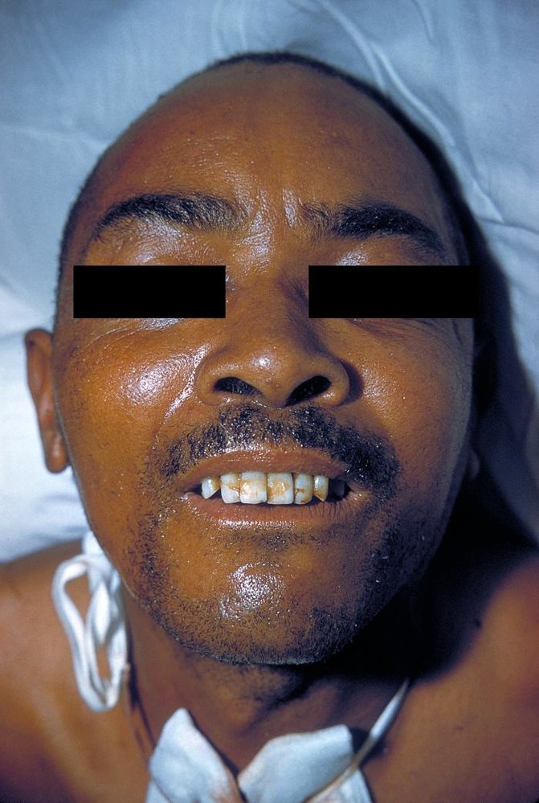
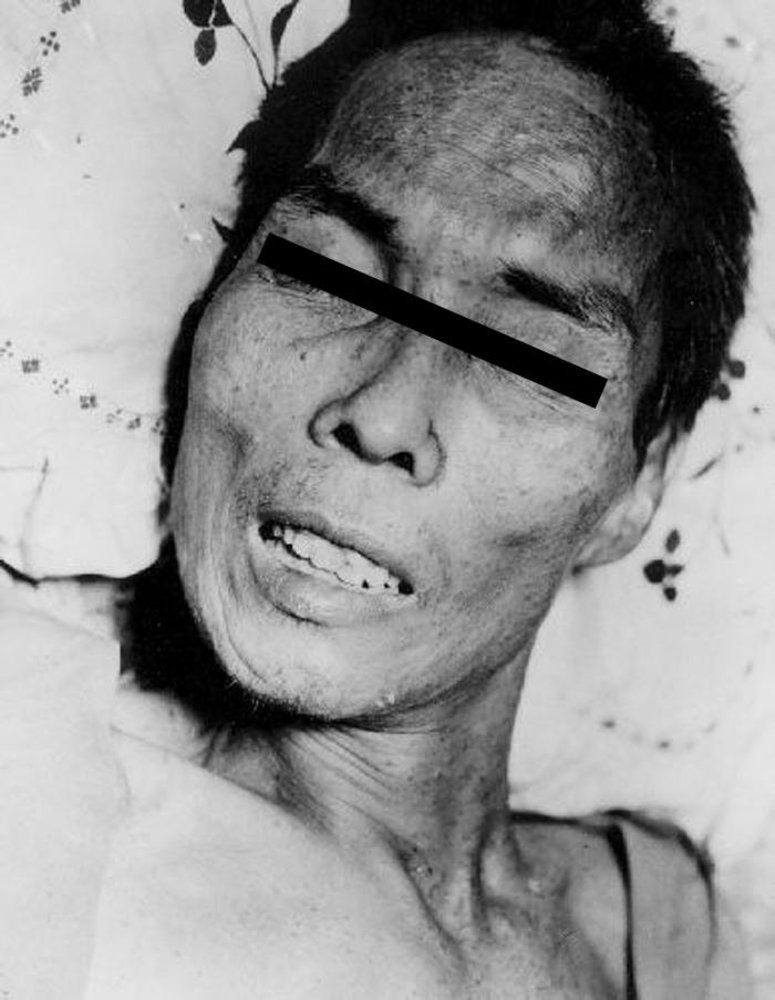

# Tetanus

*Categories: Clinical knowledge > Surgery > Preoperative and postoperative care > Tetanus*

[Original Article Link](https://coursology-qbank.com/amboss/article/ef0xO2)

---

## Summary

Tetanus (lockjaw) is an acute disease caused by <u>neurotoxins</u> from the bacterium <u>Clostridium tetani</u>. <u>C. tetani</u> is ubiquitous in spore form and enters the body through broken <u>skin</u> (e.g., deep <u>puncture wounds</u>). Its toxins then cause uncontrolled activation of <u>alpha motor neurons</u>, leading to muscular rigidity and spasms. Patients classically present with a triad of <u>trismus</u>, <u>risus sardonicus</u>, and <u>opisthotonus</u>. Tetanus is a <u>clinical diagnosis</u>, but diagnostic testing may help confirm the diagnosis. Treatment includes <u>airway management</u>, <u>wound debridement</u>, <u>immunoglobulin</u> therapy (e.g., <u>human tetanus immune globulin</u>), <u>antibiotics</u> (e.g., <u>metronidazole</u>), and pharmacological management of severe muscle spasms. <u>Prevention of tetanus</u> involves <u>routine immunization</u> with <u>tetanus vaccines</u> and administering <u>postexposure prophylaxis</u> for wounds.

---

## Etiology

* <u>Pathogen</u>

* Clostridium tetani: a gram-positive, obligate anaerobic, <u>spore-forming</u> rod

* Produces <u>neurotoxins</u> <u>tetanospasmin</u> and <u>tetanolysin</u>

* Ubiquitous (especially animal feces and soil)

* Route of infection

* Clostridial spores contaminate a wound (e.g., through dirt, saliva, feces).

* Localized <u>ischemia</u>, <u>necrosis</u>, foreign bodies and/or <u>coinfection</u> with other bacteria predispose to infection.

* Wounds with compromised blood supply create anaerobic conditions that are required for the germination and multiplication of <u>C. tetani</u>.

* Deep, penetrating wounds (e.g., knife, gunshot, <u>animal bites</u>)

* <u>Open fractures</u>

* Surgical procedures (e.g., bowel, <u>biliary tract</u>, or dental <u>surgery</u>)

* <u>Burns</u>

* Umbilical stump infections

* <u>Septic abortion</u>

* Groups with a higher risk: : non-immunized individuals, those with <u>diabetes</u>, <u>neonates</u>, people who inject drugs (PWID), certain patient groups (i.e., postsurgical, obstetric, dental)

---

## Pathophysiology

Ubiquitous <u>C. tetani</u> spores contaminate a wound → bacterial reproduction under anaerobic conditions → production of the neurotoxins <u>tetanospasmin</u> and <u>tetanolysin</u>

* Tetanospasmin: reaches the <u>CNS</u> through retrograde <u>axonal transport</u>

* Toxin binds to <u>receptors</u> of <u>peripheral nerves</u> and is then transported to interneurons (<u>Renshaw cells</u>) in the <u>CNS</u> via <u>vesicles</u>. [[1]](https://coursology-qbank.com/amboss/article/dg0o82)[[2]](https://coursology-qbank.com/amboss/article/Vg0G82)

* Acts as <u>protease</u> that cleaves <u>synaptobrevin</u>, a <u>SNARE</u> protein → prevention of inhibitory <u>neurotransmitters</u> (i.e., <u>GABA</u> and <u>glycine</u>) release from <u>Renshaw cells</u> in the spinal cord → uninhibited activation of <u>alpha motor neurons</u> → muscle spasms, rigidity, and <u>autonomic instability</u>

* Tetanolysin: causes <u>hemolysis</u> and has cardiotoxic effects

> [!NOTE]
> <u>Neurotoxins</u> (not the <u>pathogen</u> itself) cause tetanic contractions.

> [!NOTE]
> Tetanospasmin causes tetanic spasms.

---

## Clinical features

* <u>Incubation period</u>: 3–21 days (average: ∼ 10 days)

* Generalized tetanus: painful muscle spasms and rigidity 

* <u>Trismus</u>: lockjaw due to spasms of <u>jaw</u> musculature (commonly the first tetanus-specific symptom)

* Risus sardonicus: sustained facial muscle spasm that causes a characteristic, apparently sardonic grin and raised eyebrows

* Opisthotonus: backward arching of <u>spine</u>, neck, and head caused by spasms of the <u>back muscles</u>

* Neck stiffness

* <u>Abdominal rigidity</u>

* Life-threatening complications

* <u>Laryngospasm</u> and/or respiratory muscles spasms → <u>respiratory failure</u> [[3]](https://coursology-qbank.com/amboss/article/fg0ku2)

* <u>Autonomic dysfunction</u>  → circulatory arrest and <u>shock</u> [[1]](https://coursology-qbank.com/amboss/article/dg0o82)[[3]](https://coursology-qbank.com/amboss/article/fg0ku2)

Risus sardonicus in tetanus

Risus sardonicus ('sardonic laughter') in tetanus

Opisthotonus

---

## Subtypes and variants

### Neonatal tetanus

* Occurs in <u>infants</u> of inadequately immunized mothers after unsterile management of the umbilical stump

* Typically occurs 5–8 days after <u>birth</u>, but the <u>incubation period</u> can take up to several weeks

* Typically a rapid onset of symptoms as axonal length in <u>infants</u> is shorter than in adults  [[4]](https://coursology-qbank.com/amboss/article/Tg06u2)

* Symptoms

* Difficulty opening the mouth and feeding due to <u>trismus</u> and <u>risus sardonicus</u>

* Muscle stiffness and <u>opisthotonus</u>

* Clenched hands

### Other types [[5]](https://coursology-qbank.com/amboss/article/0iXeJB)

* Localized tetanus: Patients present with painful muscle contractions in areas surrounding the injury site only.

* Cephalic tetanus

* In patients with open head or neck injuries.

* Initially only affects <u>cranial nerves</u> (especially <u>flaccid paralysis</u> of <u>CN VII</u>), which can be mistaken for <u>stroke</u>

---

## Diagnosis

* Tetanus is a <u>clinical diagnosis</u> based on muscle spasms and rigidity associated with an entry point for bacteria and inadequate <u>immunization</u>. [[6]](https://coursology-qbank.com/amboss/article/gg0Fu2)

* Wound culture and <u>serology</u> may confirm the diagnosis but have low <u>sensitivity</u> and <u>specificity</u>.

---

## Treatment

The following relates to the treatment of clinically apparent tetanus. See "<u>Tetanus prophylaxis after injury</u>" for preventing tetanus in individuals with <u>acute wounds</u>.

### Approach [[7]](https://coursology-qbank.com/amboss/article/Ef18LT0)[[8]](https://coursology-qbank.com/amboss/article/gSWF_k0)[[9]](https://coursology-qbank.com/amboss/article/SSWy_k0)[[10]](https://coursology-qbank.com/amboss/article/NnW-tN0)

* Immediately manage life-threatening and severe symptoms (see “Acute stabilization”).

* Administer <u>passive immunization</u>, e.g., <u>human tetanus immunoglobulin</u>, as soon as possible.

* <u>Manage acute wounds</u>, e.g., <u>wound irrigation</u> and <u>debridement</u>

* Initiate <u>antibiotics</u>, preferably PO <u>metronidazole</u>.

* Admit all patients with suspected tetanus infection.

* <u>ICU</u> admission is often required.  [[11]](https://coursology-qbank.com/amboss/article/InWYuN0)[[12]](https://coursology-qbank.com/amboss/article/unWpEN0)[[13]](https://coursology-qbank.com/amboss/article/mSWVZO0)

* Follow <u>standard precautions</u>. [[14]](https://coursology-qbank.com/amboss/article/7Wc45Y0)

* Begin <u>active immunization</u>;  with the <u>tetanus vaccine</u> once the patient is improving.

> [!TIP]
> <u>Wound care</u> and <u>antibiotics</u> decrease bacterial load and toxin production. <u>Immunoglobulin</u> therapy neutralizes free toxins. [[9]](https://coursology-qbank.com/amboss/article/SSWy_k0)[[13]](https://coursology-qbank.com/amboss/article/mSWVZO0)

### Acute stabilization [[7]](https://coursology-qbank.com/amboss/article/Ef18LT0)[[8]](https://coursology-qbank.com/amboss/article/gSWF_k0)[[9]](https://coursology-qbank.com/amboss/article/SSWy_k0)[[10]](https://coursology-qbank.com/amboss/article/NnW-tN0)

* <u>Laryngospasm</u> or respiratory muscle spasms: <u>airway management</u> with <u>rapid sequence intubation</u> (<u>RSI</u>) [[13]](https://coursology-qbank.com/amboss/article/mSWVZO0)

* Cardiac instability: <u>immediate hemodynamic support</u>

* Severe muscle spasms: <u>benzodiazepines</u> and/or <u>paralytics</u>; , potentially in combination with <u>mechanical ventilation</u> [[8]](https://coursology-qbank.com/amboss/article/gSWF_k0)[[13]](https://coursology-qbank.com/amboss/article/mSWVZO0)

> [!WARNING]
> Prepare for <u>difficult airway management</u> and consider early <u>RSI</u>, as <u>trismus</u> and <u>laryngospasm</u> can limit successful <u>intubation</u>.

> [!TIP]
> Prolonged <u>mechanical ventilation</u> is often required; consider early <u>tracheostomy</u>. [[13]](https://coursology-qbank.com/amboss/article/mSWVZO0)

### <u>Antibiotics</u> [[7]](https://coursology-qbank.com/amboss/article/Ef18LT0)[[8]](https://coursology-qbank.com/amboss/article/gSWF_k0)[[9]](https://coursology-qbank.com/amboss/article/SSWy_k0)[[10]](https://coursology-qbank.com/amboss/article/NnW-tN0)

* Preferred: PO <u>metronidazole</u> (<u>off-label</u>) DOSAGE  [[7]](https://coursology-qbank.com/amboss/article/Ef18LT0)[[10]](https://coursology-qbank.com/amboss/article/NnW-tN0)[[13]](https://coursology-qbank.com/amboss/article/mSWVZO0)

* Alternative: <u>penicillin G</u> DOSAGE [[7]](https://coursology-qbank.com/amboss/article/Ef18LT0)[[9]](https://coursology-qbank.com/amboss/article/SSWy_k0)

### <u>Immunization</u> [[7]](https://coursology-qbank.com/amboss/article/Ef18LT0)[[8]](https://coursology-qbank.com/amboss/article/gSWF_k0)[[9]](https://coursology-qbank.com/amboss/article/SSWy_k0)[[10]](https://coursology-qbank.com/amboss/article/NnW-tN0)

* <u>Passive immunization</u>: <u>immunoglobulin</u> therapy  [[7]](https://coursology-qbank.com/amboss/article/Ef18LT0)[[8]](https://coursology-qbank.com/amboss/article/gSWF_k0)

* First-line: IM human tetanus immunoglobulin (<u>HTIG</u>) DOSAGE [[7]](https://coursology-qbank.com/amboss/article/Ef18LT0)[[8]](https://coursology-qbank.com/amboss/article/gSWF_k0)

* Consider infiltrating part of the <u>HTIG</u> dose into the affected wound.  [[7]](https://coursology-qbank.com/amboss/article/Ef18LT0)[[8]](https://coursology-qbank.com/amboss/article/gSWF_k0)

* <u>HTIG</u> unavailable: Consider <u>intravenous immunoglobulin</u> (<u>off-label</u>) DOSAGE.  [[7]](https://coursology-qbank.com/amboss/article/Ef18LT0)[[11]](https://coursology-qbank.com/amboss/article/InWYuN0)[[15]](https://coursology-qbank.com/amboss/article/EnW8EN0)

* <u>HTIG</u> and IVIG unavailable (e.g., resource-limited settings): Equine <u>tetanus immunoglobulin</u> may be considered.  [[7]](https://coursology-qbank.com/amboss/article/Ef18LT0)[[16]](https://coursology-qbank.com/amboss/article/VLWG9N0)

* <u>Active immunization</u>: <u>tetanus vaccine</u> administered at a separate site from <u>HTIG</u>  [[7]](https://coursology-qbank.com/amboss/article/Ef18LT0)[[8]](https://coursology-qbank.com/amboss/article/gSWF_k0)[[9]](https://coursology-qbank.com/amboss/article/SSWy_k0)

> [!TIP]
> Following <u>immunoglobulin</u> therapy, <u>live vaccines</u> (e.g., <u>MMR vaccine</u>, <u>varicella vaccine</u>) should not be given for 3–8 months (see “<u>Contraindications to live vaccines</u>”). [[7]](https://coursology-qbank.com/amboss/article/Ef18LT0)

---

## Prevention

### Tetanus vaccine [[17]](https://coursology-qbank.com/amboss/article/hg0cE2)[[18]](https://coursology-qbank.com/amboss/article/LWWwN40)

<u>Routine immunization</u> is recommended for all individuals.

* Active component: denatured tetanus toxin

* Available <u>vaccines</u> 

* Children < 7 years of age

* <u>DTaP</u> (<u>diphtheria</u>, tetanus, and <u>acellular pertussis</u>) <u>vaccines</u>

* DT (<u>diphtheria</u>, tetanus) if <u>acellular pertussis</u> <u>vaccines</u> are contraindicated  [[19]](https://coursology-qbank.com/amboss/article/YMWnMN0)

* Children ≥ 7 years of age and adults

* <u>Tdap</u> (tetanus, <u>diphtheria</u>, <u>pertussis</u>): routinely, at age 11 years   [[8]](https://coursology-qbank.com/amboss/article/gSWF_k0)

* Td (tetanus, <u>diphtheria</u>) OR <u>Tdap</u> boosters every 10 years

* Schedule: See “<u>ACIP immunization schedule</u>” for details.

> [!TIP]
> Boosters with Td or <u>Tdap</u> are recommended every 10 years for all <u>adolescents</u> and adults who have completed the primary <u>Tdap</u> and <u>DTaP</u> series. See “<u>ACIP immunization schedule</u>” for details. [[18]](https://coursology-qbank.com/amboss/article/LWWwN40)[[20]](https://coursology-qbank.com/amboss/article/6WWjm40)[[21]](https://coursology-qbank.com/amboss/article/pWWLm40)

> [!WARNING]
> <u>Acellular pertussis</u>-containing <u>vaccines</u> are contraindicated in patients who previously developed unexplained <u>encephalopathy</u> within a week after receiving an <u>acellular pertussis vaccine</u> (i.e., <u>DTaP</u> or <u>Tdap</u>). [[19]](https://coursology-qbank.com/amboss/article/YMWnMN0)

### Tetanus prophylaxis after injury [[7]](https://coursology-qbank.com/amboss/article/Ef18LT0)[[8]](https://coursology-qbank.com/amboss/article/gSWF_k0)[[9]](https://coursology-qbank.com/amboss/article/SSWy_k0)[[22]](https://coursology-qbank.com/amboss/article/qnYC8p)

* Management is based on:

* <u>Tetanus vaccine</u> history

* <u>Wound assessment</u>

* Immune status (e.g., <u>immunocompromised state</u>, <u>HIV infection</u>) [[9]](https://coursology-qbank.com/amboss/article/SSWy_k0)

* Tetanus-prone wounds include:

* <u>Dirty wounds</u>

* Deep injuries

* <u>Thermal injuries</u>

|  Postexposure tetanus prophylaxis [[8]](https://coursology-qbank.com/amboss/article/gSWF_k0)[[9]](https://coursology-qbank.com/amboss/article/SSWy_k0)[[22]](https://coursology-qbank.com/amboss/article/qnYC8p)  |  |  |
| --- | --- | --- |
| <u>Tetanus vaccine</u> history | Clean and minor wounds | <u>Tetanus prone wounds</u> |
| Unknown or < 3 doses |  * Administer <u>tetanus vaccine</u>.   |  * In separate sites, administer both:  * <u>Tetanus vaccine</u>  * <u>HTIG</u> DOSAGE  [[7]](https://coursology-qbank.com/amboss/article/Ef18LT0)[[8]](https://coursology-qbank.com/amboss/article/gSWF_k0)   |
| ≥ 3 doses |   * Last <u>tetanus vaccine</u> < 10 years ago: no action required  * Last <u>tetanus vaccine</u> ≥ 10 years ago: Administer <u>tetanus vaccine</u>.    |   * Last <u>tetanus vaccine</u> < 5 years ago: no action required  * Last <u>vaccine</u> ≥ 5 years ago: Administer <u>tetanus vaccine</u>.  * In patients who are severely <u>immunocompromised</u>, administer <u>HTIG</u>. DOSAGE  [[7]](https://coursology-qbank.com/amboss/article/Ef18LT0)[[8]](https://coursology-qbank.com/amboss/article/gSWF_k0)[[9]](https://coursology-qbank.com/amboss/article/SSWy_k0)    |

> [!WARNING]
> Administer <u>HTIG</u> to patients with severe <u>immunodeficiency</u> or <u>HIV infection</u> and a tetanus-<u>prone</u> wound regardless of <u>tetanus vaccine</u> history. [[9]](https://coursology-qbank.com/amboss/article/SSWy_k0)

---