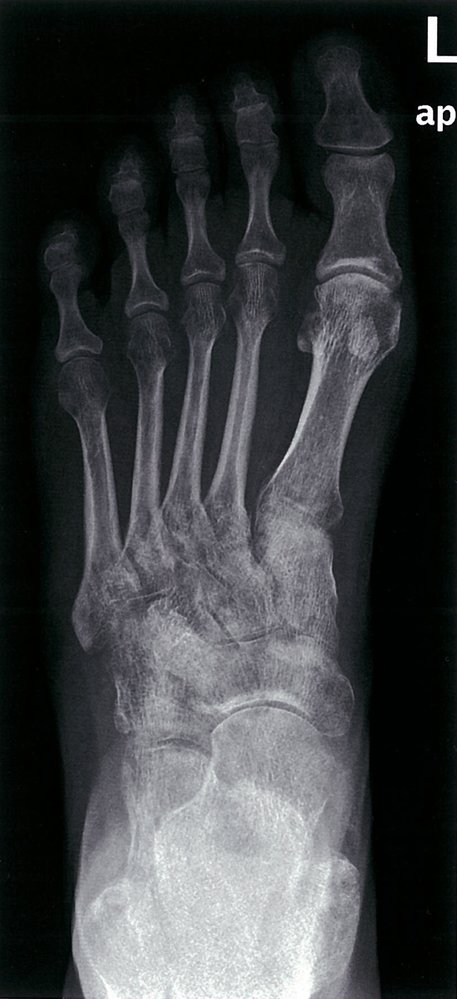
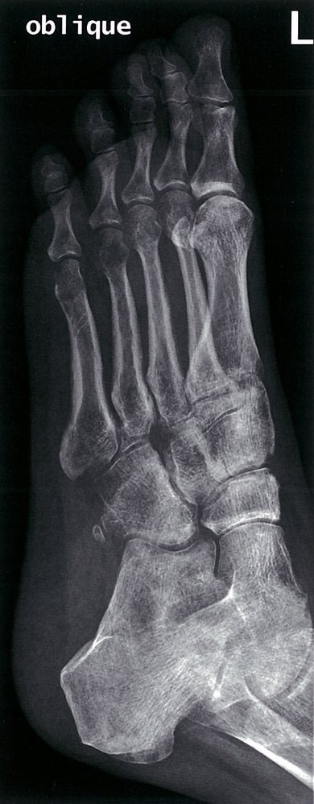

# Complex regional pain syndrome

*Categories: Clinical knowledge > Surgery > Trauma and orthopedic surgery > General orthopedics > Complex regional pain syndrome*

[Original Article Link](https://coursology-qbank.com/amboss/article/R30lRf)

---

## Summary

Complex regional <u>pain</u> syndrome (CRPS) is characterized by <u>pain</u>, typically in a limb, that is more prolonged and/or severe than expected given the inciting event. The <u>pain</u> is accompanied by sensory abnormalities (e.g., <u>hyperesthesia</u>, <u>allodynia</u>), signs of <u>autonomic dysfunction</u> (e.g., changes in the temperature and color of the <u>skin</u>), and/or loss of <u>motor function</u>. The pathogenesis of CRPS is unclear. On <u>physical examination</u>, patients present with <u>pain</u> and signs of sensory and motor dysfunction on the affected side. Although osseous changes may occur in CRPS, diagnosis is based on the <u>Budapest criteria</u> rather than imaging. Physical and medical therapy (e.g., oral <u>corticosteroids</u>, biphosphonates), initiated in the early stages of CRPS, can lead to remission.

---

## Etiology

* The pathogenesis of CRPS is unknown.

* CRPS usually develops 4–6 weeks after an inciting event, e.g.: [[1]](https://coursology-qbank.com/amboss/article/gedFyK0)[[2]](https://coursology-qbank.com/amboss/article/Ted6yK0)

* Direct injury (e.g., <u>fracture</u>, <u>sprain</u>, <u>crush injury</u> <u>surgery</u>, <u>frostbite</u>, local infection)

* Cerebrovascular event (e.g., <u>stroke</u>, <u>myocardial infarction</u>)

* <u>Pregnancy</u>

* CRPS is <u>idiopathic</u> in ∼ 7% of patients. [[3]](https://coursology-qbank.com/amboss/article/hgdcE60)

> [!TIP]
> CRPS is most commonly incited by trauma, especially <u>fractures</u> and <u>surgery</u>. [[1]](https://coursology-qbank.com/amboss/article/gedFyK0)[[2]](https://coursology-qbank.com/amboss/article/Ted6yK0)

---

## Clinical features

* <u>Pain</u> typically affects the extremities.  [[1]](https://coursology-qbank.com/amboss/article/gedFyK0)[[2]](https://coursology-qbank.com/amboss/article/Ted6yK0)

* <u>Pain</u> is excessive in duration or severity given the inciting event.  

* <u>Pain</u> is regional (i.e., not <u>dermatomal</u>).

* May be described as burning, tingling, or <u>shock</u>-like

* May worsen with activity

* <u>Pain</u> is accompanied by sensory, motor, vasomotor, sudomotor, and/or trophic changes; see “<u>Diagnostic criteria for CRPS</u>” for details.

> [!TIP]
> Symptoms usually develop within 4–6 weeks of an inciting event and can last years. [[1]](https://coursology-qbank.com/amboss/article/gedFyK0)

> [!NOTE]
> Symptoms of CRPS may progress through several stages: acute or traumatic within weeks of injury (redness, swelling, burning) → <u>dystrophic</u> within months of injury (increase in <u>pain</u> beyond injury site, <u>edema</u>, increased <u>hair</u> and <u>nail</u> growth) → chronic or <u>atrophic</u> for years after injury (<u>skin</u> and muscle <u>atrophy</u>, cold <u>skin</u>, constant <u>pain</u>). [[2]](https://coursology-qbank.com/amboss/article/Ted6yK0)

---

## Diagnosis

### General principles [[1]](https://coursology-qbank.com/amboss/article/gedFyK0)[[2]](https://coursology-qbank.com/amboss/article/Ted6yK0)

* CRPS is a <u>clinical diagnosis</u> based on the diagnostic criteria.

* Additional studies may be required to rule out differential diagnoses.

* Consider early referral to specialists (e.g., <u>neurology</u>, <u>pain</u> specialists) for evaluation and management.

> [!TIP]
> Diagnosing CRPS is challenging as the clinical presentation is heterogeneous and no confirmatory diagnostic studies exist. [[4]](https://coursology-qbank.com/amboss/article/mPWV2l0)

### Diagnostic criteria [[4]](https://coursology-qbank.com/amboss/article/mPWV2l0)

|  Diagnostic criteria for CRPS (<u>Budapest criteria</u>) [[4]](https://coursology-qbank.com/amboss/article/mPWV2l0)  |  |
| --- | --- |
| 1 |  * Persistent <u>pain</u> that is more prolonged and/or severe than expected given the inciting event   |
| 2 |  * Patient-reported symptoms in ≥ 3 of the following categories:  * Sensory: <u>hyperesthesia</u> and/or <u>allodynia</u>  * Vasomotor: hypo- or <u>hyperthermia</u> and/or hypo- or <u>hyperpigmentation</u> of the <u>skin</u>  * Sudomotor and/or <u>edema</u>: hypo- or <u>hyperhidrosis</u> and/or <u>edema</u>  * Motor and/or trophic: ↓ <u>range of motion</u> and/or strength, <u>tremors</u>, and/or changes in <u>nail</u> and <u>hair</u> growth   |
| 3 |  * Symptoms in ≥ 2 categories of the above categories elicited or observed on <u>physical examination</u>   |
| 4 |  * Exclusion of other possible etiologies (e.g., infection, <u>radiculopathy</u>, neuropathy, vascular disorder)   |
| All four criteria must be met. |  |

### Imaging [[1]](https://coursology-qbank.com/amboss/article/gedFyK0)[[2]](https://coursology-qbank.com/amboss/article/Ted6yK0)

* Consider as needed to rule out differential diagnoses.

* Supportive findings for CRPS include: [[2]](https://coursology-qbank.com/amboss/article/Ted6yK0)

* Bone demineralization

* <u>Joint effusion</u>, evidence of inflammation in the surrounding <u>soft tissue</u>, <u>bone marrow</u> <u>edema</u> (on <u>MRI</u>)

> [!TIP]
> Imaging is not routinely performed in the diagnosis of CRPS, as visible changes (if present) are nonspecific. [[1]](https://coursology-qbank.com/amboss/article/gedFyK0)[[2]](https://coursology-qbank.com/amboss/article/Ted6yK0)

Osteopenia in complex regional pain syndrome (1/2)

Osteopenia in complex regional pain syndrome (2/2)

### Additional diagnostics

The following studies are not routinely performed but can be considered on a case-by-case basis.

* <u>Nerve conduction studies</u> to evaluate for nerve involvement  [[1]](https://coursology-qbank.com/amboss/article/gedFyK0)

* Autonomic testing (e.g., thermography) as a supportive diagnostic tool [[2]](https://coursology-qbank.com/amboss/article/Ted6yK0)

* <u>Laboratory studies</u> (e.g., <u>diagnostics for rheumatoid arthritis</u>) to rule out differential diagnoses [[1]](https://coursology-qbank.com/amboss/article/gedFyK0)

---

## Differential diagnoses

* Infection (e.g., <u>tenosynovitis</u>, <u>osteomyelitis</u>)

* <u>Compartment syndrome</u>

* <u>Peripheral vascular disease</u>

* <u>Deep vein thrombosis</u>

* <u>Peripheral neuropathy</u>

* <u>Stress fracture</u>

* <u>Thoracic outlet syndrome</u>

* <u>Rheumatoid arthritis</u>

* <u>Raynaud phenomenon</u>

* <u>Conversion disorder</u>

* <u>Factitious disorder</u>

* <u>Gout</u>

* <u>Charcot foot</u>

The differential diagnoses listed here are not exhaustive.

---

## Treatment

### General principles [[1]](https://coursology-qbank.com/amboss/article/gedFyK0)[[2]](https://coursology-qbank.com/amboss/article/Ted6yK0)[[4]](https://coursology-qbank.com/amboss/article/mPWV2l0)

* The main goal of treatment is functional restoration and <u>pain management</u>.

* Initiating treatment as soon as symptoms arise may prevent long-term sequelae.

* Multidisciplinary management is recommended with:

* <u>Physical therapy</u> and <u>occupational therapy</u> to restore function

* Medical management of <u>pain</u>

* Psychological support for concurrent mental health conditions  [[2]](https://coursology-qbank.com/amboss/article/Ted6yK0)[[4]](https://coursology-qbank.com/amboss/article/mPWV2l0)

### Management of <u>pain</u> [[1]](https://coursology-qbank.com/amboss/article/gedFyK0)[[2]](https://coursology-qbank.com/amboss/article/Ted6yK0)[[4]](https://coursology-qbank.com/amboss/article/mPWV2l0)

* Refer patients to a <u>pain management</u> specialist.

* Counsel patients.

* Provide <u>patient education on chronic pain</u>.

* Reassure patients that <u>pain</u> does not reflect ongoing tissue damage.  [[1]](https://coursology-qbank.com/amboss/article/gedFyK0)

* Offer <u>nonpharmacological analgesia</u>.  [[2]](https://coursology-qbank.com/amboss/article/Ted6yK0)

* Options for early CRPS (≤ 6 months of symptoms) include:

* Oral <u>corticosteroids</u>: <u>prednisone</u> DOSAGE for 2–4 weeks  [[1]](https://coursology-qbank.com/amboss/article/gedFyK0)

* <u>Bisphosphonates</u>  [[1]](https://coursology-qbank.com/amboss/article/gedFyK0)[[2]](https://coursology-qbank.com/amboss/article/Ted6yK0)[[5]](https://coursology-qbank.com/amboss/article/ledv_K0)

* Transdermal <u>lidocaine</u> or <u>capsaicin</u>  [[2]](https://coursology-qbank.com/amboss/article/Ted6yK0)[[5]](https://coursology-qbank.com/amboss/article/ledv_K0)

* The following medications are often prescribed in CRPS, but studies show limited or no evidence of benefit. [[1]](https://coursology-qbank.com/amboss/article/gedFyK0)[[2]](https://coursology-qbank.com/amboss/article/Ted6yK0)

* Oral <u>NSAIDs</u>

* <u>Adjuvant analgesics</u> (e.g., <u>gabapentin</u> and <u>amitriptyline</u>)

* <u>Calcitonin</u>

* <u>Sympatholytic drugs</u> (e.g., <u>clonidine</u>)

> [!WARNING]
> Avoid <u>opioids</u> in CRPS, as use may worsen symptoms via <u>opioid-induced hyperalgesia</u>. [[4]](https://coursology-qbank.com/amboss/article/mPWV2l0)

> [!TIP]
> There is limited evidence to support any of the treatment options for CRPS. Use <u>shared decision-making</u>, including a careful assessment of risks and benefits. [[2]](https://coursology-qbank.com/amboss/article/Ted6yK0)[[5]](https://coursology-qbank.com/amboss/article/ledv_K0)

### Functional restoration [[2]](https://coursology-qbank.com/amboss/article/Ted6yK0)[[4]](https://coursology-qbank.com/amboss/article/mPWV2l0)

The following treatments are usually overseen by physical and/or <u>occupational therapy</u>.

* Graded increase in sensorimotor stimuli 

* <u>Mirror visual feedback therapy</u>  [[4]](https://coursology-qbank.com/amboss/article/mPWV2l0)

* <u>Graded motor imagery</u>

* Desensitization therapy

* Contrast baths

* Gradual increase in physical movements, such as:

* Passive and active <u>range of motion exercises</u>

* Use of affected limb in daily tasks

* Graded <u>weight-bearing</u> exercises

* Aquatic therapy

* Recreational therapy

### Management of limb <u>edema</u> [[2]](https://coursology-qbank.com/amboss/article/Ted6yK0)

* Exercise

* Limb elevation

* Compression garments

### Refractory CRPS

Specialist treatments include: [[1]](https://coursology-qbank.com/amboss/article/gedFyK0)[[2]](https://coursology-qbank.com/amboss/article/Ted6yK0)[[4]](https://coursology-qbank.com/amboss/article/mPWV2l0)

* <u>Ketamine</u> therapy

* Regional <u>botulinum toxin</u> injections

* Intrathecal <u>pain management</u>

* <u>Spinal cord stimulation</u>

* <u>Nerve blocks</u>  [[2]](https://coursology-qbank.com/amboss/article/Ted6yK0)

* <u>Surgery</u>  [[2]](https://coursology-qbank.com/amboss/article/Ted6yK0)

---