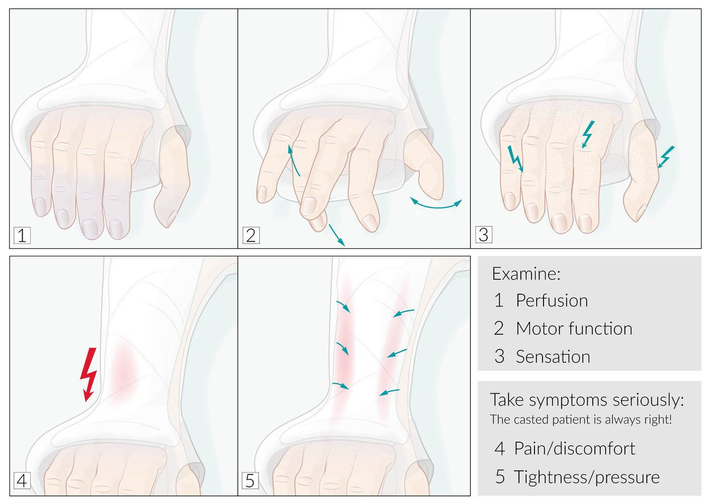

# Conservative treatment of fractures

*Categories: Clinical knowledge > Surgery > Trauma and orthopedic surgery > General orthopedics > Conservative treatment of fractures*

[Original Article Link](https://coursology-qbank.com/amboss/article/Dl01_T)

---

## Summary

<u>Conservative management</u> of <u>fractures</u> comprises <u>closed reduction</u>, <u>immobilization</u>, and <u>supportive care</u>. <u>Conservative management</u> is the definitive treatment for closed, stable, and/or simple <u>fractures</u>; it is generally contraindicated in open, unstable, and/or <u>complex fractures</u>. The <u>closed reduction</u> technique and type of <u>immobilization</u> device used are determined based on the individual patient and injury. Splinting is preferred over <u>casting</u> for the initial <u>immobilization</u> of most <u>fractures</u> because it better accommodates secondary swelling and is therefore associated with a lower risk of <u>compartment syndrome</u> and other pressure-related complications. <u>Neurovascular exams</u> of the extremity are required before and after <u>immobilization</u> to assess for such complications. <u>Supportive care</u> consists of <u>analgesia</u> and <u>thromboprophylaxis</u>. Most affected individuals can receive outpatient care with short-term follow-up (e.g., 3–7 days); those with uncontrolled <u>pain</u> and/or the inability to perform <u>activities of daily living</u> may need to be admitted. <u>Compartment syndrome</u>, the most significant complication of <u>fracture</u> management, is threatening to life and limb; patients should be educated on <u>compartment syndrome</u> symptoms and <u>return precautions</u>.

---

## Complications

* <u>Fracture complications</u> (e.g., <u>fat embolism</u>, <u>malunion</u>, <u>contracture</u>)

* <u>Complications of immobilization</u> (e.g., <u>VTE</u>, <u>pneumonia</u>)

* Complications of poor technique [[1]](https://coursology-qbank.com/amboss/article/oK10h30)[[4]](https://coursology-qbank.com/amboss/article/3wYSir)

* <u>Thermal injury</u>

* Conversion to <u>open fracture</u>

* <u>Pressure ulcers</u>

* Complications of <u>casting</u>/splinting [[4]](https://coursology-qbank.com/amboss/article/3wYSir)

* <u>Compartment syndrome</u>  [[1]](https://coursology-qbank.com/amboss/article/oK10h30)

* <u>Ischemic</u> injury, e.g., <u>Volkmann contracture</u>

* Infection

* Dermatitis, <u>pruritus</u>

* Cast related <u>pain</u>

> [!WARNING]
> <u>Compartment syndrome</u> is a life- and limb-threatening emergency. Promptly remove the constricting cast or <u>splint</u> and assess the limb of any patient with <u>clinical features of compartment syndrome</u>.

Control of orthopedic cast

We list the most important complications. The selection is not exhaustive.

---