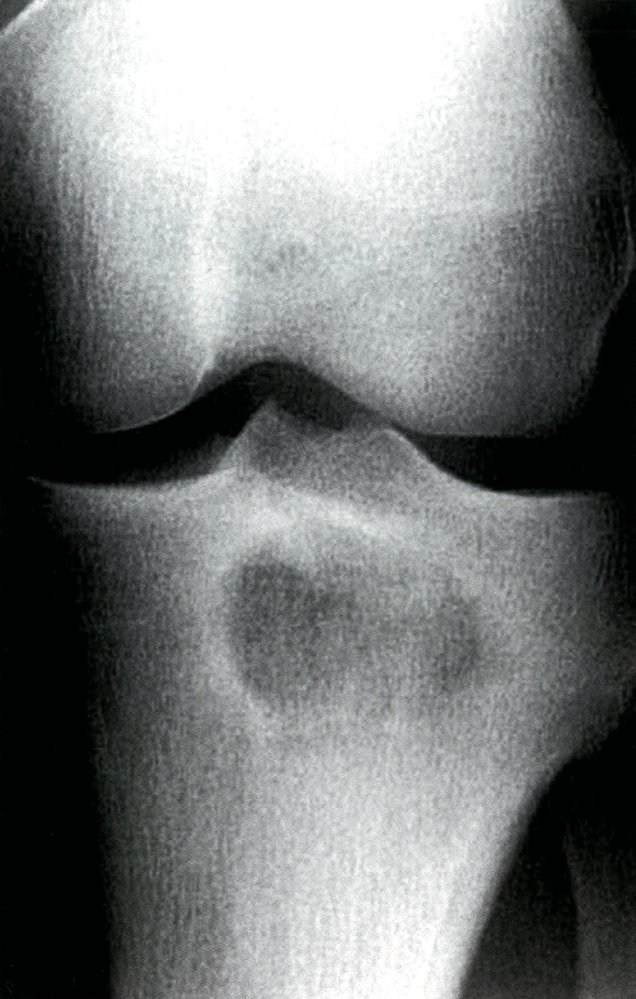
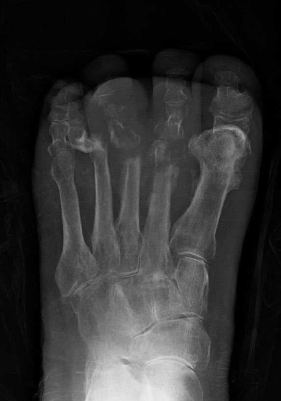
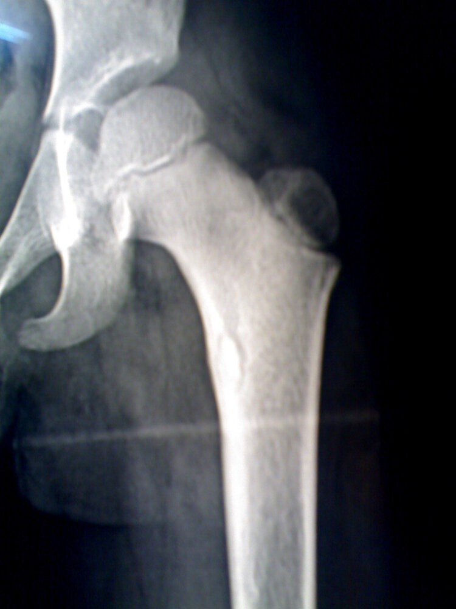
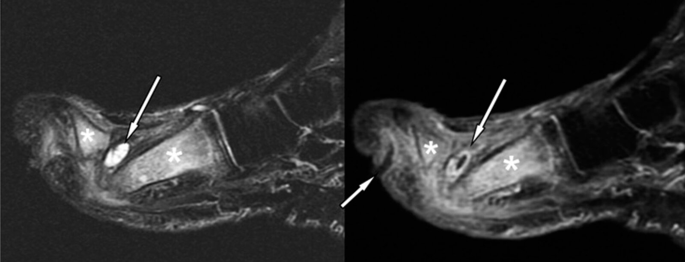
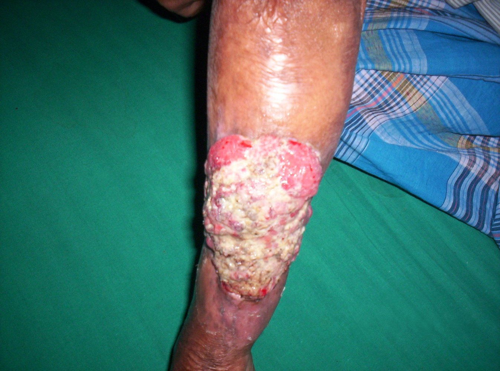

# Osteomyelitis

*Categories: Clinical knowledge > Surgery > Trauma and orthopedic surgery > General orthopedics > Osteomyelitis*

[Original Article Link](https://coursology-qbank.com/amboss/article/th0Xff)

---

## Summary

Osteomyelitis is an infection of the bone; it occurs following hematogenous (seeded from a remote source) or <u>exogenous</u> (expansion from nearby tissue) spread of pathogens, most commonly <u>Staphylococcus aureus</u>. Individuals are at increased risk of osteomyelitis following trauma, placement of surgical implants or hardware, or if they are <u>immunosuppressed</u> or have poor tissue <u>perfusion</u>. Osteomyelitis can be either acute or chronic and manifests with signs of local inflammation, including swelling, <u>pain</u>, redness, and warmth. Systemic signs, such as <u>fever</u> and chills, are more common in acute infection. Diagnosis is supported via laboratory tests, imaging, and/or <u>biopsy</u>. In most cases, <u>antibiotic therapy</u> should be delayed until culture results are obtained, so as to better tailor treatment. <u>Empiric antibiotic therapy for osteomyelitis</u> is reserved for patients with <u>signs of sepsis</u> or rapidly progressing infections. <u>Surgery</u> may be necessary to remove <u>necrotic</u> bone, <u>abscesses</u>, infected foreign bodies, or <u>fistulae</u>. Osteomyelitis in adults often assumes a chronic course and requires prolonged treatment, whereas children typically make a quick and full recovery.

The diagnosis and management of <u>vertebral osteomyelitis</u> are described in “<u>Spinal infections</u>.”

---

## Epidemiology

* <u>Incidence</u>: ∼ 20 per 100,000  [[1]](https://coursology-qbank.com/amboss/article/V01GU20)

* <u>Hematogenous osteomyelitis</u>

* More common in children and <u>adolescents</u>

* <u>Incidence</u> is increasing in adults, driven by a rise in <u>vertebral osteomyelitis</u>  [[2]](https://coursology-qbank.com/amboss/article/hCYc7r)

* <u>Exogenous osteomyelitis</u>: more common in adults

Epidemiological data refers to the US, unless otherwise specified.

---

## Etiology

### Routes of infection [[3]](https://coursology-qbank.com/amboss/article/U01b220)

* Hematogenous osteomyelitis:  (<u>endogenous osteomyelitis</u>): caused by hematogenous dissemination of a <u>pathogen</u>

* Exogenous osteomyelitis: caused by a spread of bacteria (typically multiple pathogens) from the surrounding environment [[4]](https://coursology-qbank.com/amboss/article/d01oU20)

* Posttraumatic: infection following deep injury (penetrating injury, <u>open fractures</u>, severe <u>soft tissue</u> injury)

* Contiguous: spread of infection from adjacent tissue

* Secondary to infected foot <u>ulcer</u> in patients with <u>diabetes</u>

* <u>Iatrogenic</u> (e.g., postoperative infection of a prosthetic <u>joint</u> implant)

### Risk factors for osteomyelitis [[5]](https://coursology-qbank.com/amboss/article/xzcEEU0)

* Local

* Poor tissue <u>perfusion</u>

* <u>Open fractures</u>

* Severe <u>soft tissue</u> injury

* Systemic

* <u>Immunosuppression</u>

* Systemic diseases (e.g., <u>diabetes mellitus</u>, <u>atherosclerosis</u>)

* IV drug use

* Microbial: highly <u>virulent</u> pathogens

### Pathogens

|  Most common pathogens causing osteomyelitis [[5]](https://coursology-qbank.com/amboss/article/xzcEEU0) |  |  |
| --- | --- | --- |
| Pathogens |  | Commonly affected groups |
| <u>Staphylococcus aureus</u> (most common cause) |  |   * Children and adults  * Individuals that recreationally use IV drugs [[6]](https://coursology-qbank.com/amboss/article/r2XfQx)  * Patients with <u>vertebral</u> lesions  * Patients with prosthetics [[7]](https://coursology-qbank.com/amboss/article/72X4Qx)  * Diabetic patients with foot <u>ulcers</u> and <u>pressure ulcers</u>    |
| <u>Staphylococcus epidermidis</u> |  |  * Patients with prosthetics   |
| <u>Streptococci</u> |  |   * Diabetic patients with foot <u>ulcers</u> and <u>pressure ulcers</u>  * <u>Neonates</u> and <u>infants</u>    |
| <u>Pseudomonas aeruginosa</u> |  |   * Persons who inject drugs [[6]](https://coursology-qbank.com/amboss/article/r2XfQx)  * <u>Plantar</u> <u>puncture wounds</u> (especially if wearing rubber-soled footwear)    |
|  <u>Enterobacteriaceae</u>  | <u>Salmonella</u> |  * Patients with <u>sickle cell anemia</u>   |
| <u>Klebsiella</u> |  * Patients with <u>UTIs</u>   |  |
| <u>Mycobacterium tuberculosis</u> |  |  * See “<u>Tuberculous spondylitis</u>” (<u>Pott disease</u>).   |
| <u>Pasteurella multocida</u> |  |  * Bites from dogs and cats   |
| Fungi (e.g., <u>Candida</u>) |  |   * <u>Immunocompromised</u> patients  * Individuals that recreationally use IV drugs    |

---

## Clinical features

### Acute osteomyelitis and subacute osteomyelitis [[5]](https://coursology-qbank.com/amboss/article/xzcEEU0)

* Onset: within days or weeks; associated with acute bone inflammation

* Duration: < 2 weeks (acute) or 2–6 weeks (subacute)  [[3]](https://coursology-qbank.com/amboss/article/U01b220)[[8]](https://coursology-qbank.com/amboss/article/HY1Kq20)

* Symptoms: <u>pain</u> at the site of infection; in patients with <u>peripheral neuropathy</u> the <u>pain</u> may be mild or absent

* Possible localized findings: point tenderness, swelling, redness, warmth

* Possible systemic findings: <u>malaise</u>, <u>fever</u>, chills

> [!TIP]
> Features of underlying disease (e.g., <u>peripheral neuropathy</u>, <u>signs of peripheral arterial disease</u>) may be seen in both acute and <u>chronic osteomyelitis</u>.

### Chronic osteomyelitis

* Onset: develops slowly (over months or years) following acute infection

* Associated with: <u>avascular bone necrosis</u> and sequestrum formation (<u>necrotic</u> bone fragment that has become detached from the original bone) [[9]](https://coursology-qbank.com/amboss/article/EW18Mf0)

* Duration: typically > 6 weeks

* Symptoms: recurrent <u>pain</u> lasting weeks to months, maybe cyclical  [[3]](https://coursology-qbank.com/amboss/article/U01b220)

* Possible localized findings

* Swelling, redness

* Deformity

* Impaired healing of overlying wounds

* Local sinus tract formation, perhaps draining <u>pus</u>

* Positive <u>probe-to-bone test</u> [[10]](https://coursology-qbank.com/amboss/article/tW1XMf0)

* Systemic findings: typically absent; may include low-grade <u>fever</u>, <u>malaise</u>

> [!TIP]
> A positive <u>probe-to-bone test</u> is strongly suggestive of osteomyelitis, especially in diabetic patients with <u>risk factors for osteomyelitis</u>. [[10]](https://coursology-qbank.com/amboss/article/tW1XMf0)[[11]](https://coursology-qbank.com/amboss/article/uW1pMf0)

> [!WARNING]
> The symptoms of <u>chronic osteomyelitis</u> may be subtle and the diagnosis may only become apparent when late complications occur (e.g., <u>pathological fracture</u>, loosening of implants). [[12]](https://coursology-qbank.com/amboss/article/301Sf20)

---

## Diagnosis

The following recommendations are for nonvertebral osteomyelitis; <u>diagnostics for vertebral osteomyelitis</u> are detailed separately in “<u>Spinal infections</u>.”

### Approach [[5]](https://coursology-qbank.com/amboss/article/xzcEEU0)[[10]](https://coursology-qbank.com/amboss/article/tW1XMf0)

* <u>Signs of sepsis</u> present: Start <u>management of sepsis</u> without waiting for diagnostic test results.

* Routine studies: <u>CBC</u>, <u>inflammatory markers</u>, <u>blood cultures</u>, and an <u>x-ray</u>; choice of further imaging depends on patient characteristics.

* Suspected <u>hematogenous osteomyelitis</u> : Consider additional studies (e.g., <u>urine culture</u>, <u>chest x-ray</u>) based on clinical presentation.

* Imaging findings and <u>blood cultures</u> inconclusive: Consider <u>bone biopsy</u> with cultures to confirm the diagnosis.

> [!WARNING]
> In stable patients, defer <u>antibiotics</u> until <u>blood cultures</u> and/or <u>bone biopsy</u> have been taken. Do not delay <u>antibiotic</u> administration in patients with <u>signs of sepsis</u>.

### <u>Laboratory studies</u> [[10]](https://coursology-qbank.com/amboss/article/tW1XMf0)

* Routine studies

* <u>CBC</u>: <u>thrombocytosis</u>, possible <u>leukocytosis</u>  [[5]](https://coursology-qbank.com/amboss/article/xzcEEU0)

* <u>Inflammatory markers</u>: ↑ <u>CRP</u>, ↑ <u>ESR</u> (sensitive but not specific)  [[12]](https://coursology-qbank.com/amboss/article/301Sf20)

* <u>Blood cultures</u>

* May be positive in <u>hematogenous osteomyelitis</u> (see “<u>Causative pathogens in osteomyelitis</u>”)

* Typically negative in <u>exogenous osteomyelitis</u>

* Additional studies (as needed)

* <u>Features of sepsis</u> present: full <u>diagnostic workup for sepsis</u>

* <u>Purulent</u> wounds/sinuses: Consider culture of <u>purulent</u> material.  [[10]](https://coursology-qbank.com/amboss/article/tW1XMf0)

### Imaging

#### Routine imaging [[10]](https://coursology-qbank.com/amboss/article/tW1XMf0)[[13]](https://coursology-qbank.com/amboss/article/Clbq_F)[[14]](https://coursology-qbank.com/amboss/article/-zcDvU0)

* <u>X-ray</u>: low <u>sensitivity</u> and <u>specificity</u> for osteomyelitis ;  [[15]](https://coursology-qbank.com/amboss/article/xScEbX0)

* Indication: initial evaluation as can also exclude <u>differential diagnoses of osteomyelitis</u>

* Characteristic findings

* <u>Acute osteomyelitis</u>: typically no pathological findings  [[5]](https://coursology-qbank.com/amboss/article/xzcEEU0)

* Subacute/<u>chronic osteomyelitis</u>: bone destruction, <u>sequestrum</u> formation, <u>periosteal reactions</u>   [[15]](https://coursology-qbank.com/amboss/article/xScEbX0)

* <u>MRI</u> with and without IV <u>gadolinium</u>: most sensitive study [[15]](https://coursology-qbank.com/amboss/article/xScEbX0)

* Indications

* Suspected <u>acute osteomyelitis</u> (evidence of inflammation can be seen ≤ 5 days after onset of infection)

* Negative <u>x-ray</u> but high clinical suspicion  [[13]](https://coursology-qbank.com/amboss/article/Clbq_F)

* Evaluation of the extent of osteomyelitis

* Characteristic findings [[15]](https://coursology-qbank.com/amboss/article/xScEbX0)

* Acute/<u>subacute osteomyelitis</u>: cortical destruction, <u>bone marrow</u> inflammation, soft-tissue involvement

* <u>Chronic osteomyelitis</u>: <u>fibrotic</u> scarring of the marrow

* Disadvantages [[15]](https://coursology-qbank.com/amboss/article/xScEbX0)

* Unable to differentiate infection from inflammation (e.g., in postoperative patients)

* Surgical hardware may decrease image quality.

> [!TIP]
> <u>X-ray</u> is the recommended initial imaging modality because it is inexpensive and can rule out differential diagnoses; however, it may miss <u>acute osteomyelitis</u> as findings are typically visible only 10–14 days after symptom onset. [[10]](https://coursology-qbank.com/amboss/article/tW1XMf0)[[13]](https://coursology-qbank.com/amboss/article/Clbq_F)

Lytic lesion in long bone from subacute osteomyelitis

Osteomyelitis

Bony sequestrum

Foot ulcer with abscess and osteomyelitis

#### Imaging in special circumstances [[15]](https://coursology-qbank.com/amboss/article/xScEbX0)

* <u>Contraindications to MRI</u>

* Adults: CT with contrast  [[15]](https://coursology-qbank.com/amboss/article/xScEbX0)[[16]](https://coursology-qbank.com/amboss/article/35YSPp)

* Children: <u>ultrasound</u>

* Recent <u>surgery</u> or <u>fracture</u>: <u>labeled leukocyte scintigraphy</u>  [[5]](https://coursology-qbank.com/amboss/article/xzcEEU0)[[10]](https://coursology-qbank.com/amboss/article/tW1XMf0)

* Surgical hardware (affecting <u>MRI</u> image quality): <u>triple-phase bone scintigraphy</u>

* Suspected overlying <u>abscess</u> (potentially requiring drainage): <u>ultrasound</u>

### <u>Bone biopsy</u> [[10]](https://coursology-qbank.com/amboss/article/tW1XMf0)[[14]](https://coursology-qbank.com/amboss/article/-zcDvU0)

* Indications: imaging findings and <u>blood culture</u> inconclusive

* Options: include <u>MRI</u>/CT-guided needle and <u>open biopsy</u>

* Timing: before administering <u>antibiotic therapy</u>, when feasible [[17]](https://coursology-qbank.com/amboss/article/k-cmxU0)

* Send specimens for:

* <u>Gram staining</u> and cultures

* <u>Histology</u>

> [!TIP]
> <u>Bone biopsy</u> with cultures is the <u>confirmatory test</u> for osteomyelitis and should be performed unless there are characteristic imaging features of osteomyelitis and positive <u>blood cultures</u>.

---

## Differential diagnoses

* <u>Septic arthritis</u>

* Infection of the <u>joint</u> (in contrast to osteomyelitis, involvement of the <u>metaphysis</u> is rare)

* May occur secondary to osteomyelitis in <u>infants</u>

* Bone tumors (e.g., <u>Ewing sarcoma</u>, <u>osteoid osteoma</u>)

* <u>Avascular bone necrosis</u>

* <u>Benign bone tumors</u> (e.g., bone cyst)

* <u>Fracture</u>

The differential diagnoses listed here are not exhaustive.

---

## Treatment

The following recommendations are for the treatment of nonvertebral osteomyelitis. For treatment of <u>vertebral osteomyelitis</u>, see “<u>Treatment of spinal infections</u>.”

### Approach

* All patients

* Admit for IV <u>antibiotics</u>; consult infectious disease specialists to help guide choice of <u>antibiotics</u>. [[16]](https://coursology-qbank.com/amboss/article/35YSPp)

* <u>Signs of sepsis</u> or severe or rapidly progressing infection: Administer <u>empiric antibiotic therapy for osteomyelitis</u>.

* All other patients: Administer <u>pathogen-directed antibiotic therapy for osteomyelitis</u> once cultures are available.

* Provide <u>pain management</u> and supportive treatment to optimize <u>bone healing</u>.

* Consider trending <u>inflammatory markers</u> to monitor response to therapy.  [[18]](https://coursology-qbank.com/amboss/article/W8cPlV0)[[19]](https://coursology-qbank.com/amboss/article/ouc0HV0)

* <u>Hematogenous osteomyelitis</u>: Identify and treat the underlying infection.

* Consultations

* Relevant specialists for management of comorbidities (e.g., <u>diabetic foot</u>, <u>sickle cell disease</u>)

* Surgeons (orthopedic or vascular) to determine the need for <u>surgery</u> based on:  [[20]](https://coursology-qbank.com/amboss/article/r-cfAU0)

* Extent of disease

* Presence of surgical hardware

* Patient comorbidities

> [!TIP]
> Acute <u>hematogenous osteomyelitis</u> can typically be treated with <u>antibiotic therapy</u> alone. Management of <u>acute osteomyelitis</u> due to contiguous spread and <u>chronic osteomyelitis</u> usually requires <u>surgical debridement</u> of infected tissue. [[18]](https://coursology-qbank.com/amboss/article/W8cPlV0)[[21]](https://coursology-qbank.com/amboss/article/CFcq4V0)

### <u>Antibiotic therapy</u> [[5]](https://coursology-qbank.com/amboss/article/xzcEEU0)[[18]](https://coursology-qbank.com/amboss/article/W8cPlV0)[[21]](https://coursology-qbank.com/amboss/article/CFcq4V0)

* <u>Empiric antibiotic therapy</u> is rarely required.

* Start most patients directly on <u>pathogen</u>-directed <u>antibiotics</u> based on culture results.

* Consider switching to oral <u>antibiotics</u> after an initial IV course.

* Duration of therapy is normally 4–8 weeks.  [[10]](https://coursology-qbank.com/amboss/article/tW1XMf0)[[18]](https://coursology-qbank.com/amboss/article/W8cPlV0)[[21]](https://coursology-qbank.com/amboss/article/CFcq4V0)

* Rarely, patients who are unsuitable for <u>surgery</u> remain on long-term <u>suppressive antibiotic therapy</u>.  [[18]](https://coursology-qbank.com/amboss/article/W8cPlV0)

> [!TIP]
> When indicated, obtain a <u>bone biopsy</u> preferably before administering <u>antibiotic therapy</u> to maximize diagnostic yield. [[17]](https://coursology-qbank.com/amboss/article/k-cmxU0)

#### Empiric antibiotic therapy for osteomyelitis

* Indications

* <u>Signs of sepsis</u>

* Severe or rapidly progressing infection

* Consider in <u>diabetic foot osteomyelitis</u>.

* Empiric regimens for adults should cover: [[22]](https://coursology-qbank.com/amboss/article/qZ1Cc20)

* <u>S. aureus</u>;  (e.g., with <u>vancomycin</u> DOSAGE)

* AND <u>gram-negative bacilli</u>, including <u>Pseudomonas</u>; recommended regimens include: ;  [[18]](https://coursology-qbank.com/amboss/article/W8cPlV0)

* <u>Meropenem</u> DOSAGE

* OR <u>cefepime</u>  DOSAGE PLUS <u>metronidazole</u> DOSAGE

* For empiric regimens in children, see “<u>Osteomyelitis in children</u>.”

> [!WARNING]
> Avoid giving <u>vancomycin</u> with <u>piperacillin-tazobactam</u>; while the combination provides cover against both <u>S. aureus</u> and <u>Pseudomonas</u>, it has a high risk of <u>nephrotoxicity</u>. [[22]](https://coursology-qbank.com/amboss/article/qZ1Cc20)

#### <u>Pathogen</u>-directed <u>antibiotics</u>

|  Pathogen-directed antibiotic therapy for osteomyelitis [[5]](https://coursology-qbank.com/amboss/article/xzcEEU0)[[10]](https://coursology-qbank.com/amboss/article/tW1XMf0)[[18]](https://coursology-qbank.com/amboss/article/W8cPlV0)[[21]](https://coursology-qbank.com/amboss/article/CFcq4V0)  |  |  |  |  |
| --- | --- | --- | --- | --- |
| <u>Pathogen</u> |  |  | First-line | Alternative |
| <u>Staphylococcus</u> spp. | <u>Methicillin</u>-susceptible <u>S. aureus</u> (<u>MSSA</u>) |  |   * <u>Nafcillin</u> DOSAGE  * OR <u>oxacillin</u> DOSAGE  * OR <u>cefazolin</u> DOSAGE    |   * <u>Ceftriaxone</u> DOSAGE [[18]](https://coursology-qbank.com/amboss/article/W8cPlV0)  * OR <u>vancomycin</u> DOSAGE [[23]](https://coursology-qbank.com/amboss/article/MRbMnt)    |
|  <u>Methicillin</u>-resistant <u>S. aureus</u> (<u>MRSA</u>) [[24]](https://coursology-qbank.com/amboss/article/rD0ffR)  |  |  * <u>Vancomycin</u> DOSAGE [[23]](https://coursology-qbank.com/amboss/article/MRbMnt)   |   * <u>Daptomycin</u> DOSAGE  * OR <u>linezolid</u> DOSAGE  * OR <u>clindamycin</u> DOSAGE    |  |
| <u>Enterococcus</u> spp. | <u>Penicillin</u>-susceptible |  |   * <u>Ampicillin</u> DOSAGE  * Consider addition of <u>gentamicin</u> DOSAGE  [[18]](https://coursology-qbank.com/amboss/article/W8cPlV0)    |   * <u>Vancomycin</u> DOSAGE  * OR <u>linezolid</u> DOSAGE    |
| <u>Penicillin</u>-resistant |  |  * <u>Vancomycin</u> DOSAGE   |  * <u>Linezolid</u> DOSAGE   |  |
| <u>Enterobacteriaceae</u> |  | <u>Quinolone</u>-sensitive |  * <u>Ciprofloxacin</u> DOSAGE   |  * <u>Ceftriaxone</u> DOSAGE   |
| <u>Quinolone</u>-resistant |   * <u>Piperacillin/tazobactam</u> DOSAGE  * OR <u>ticarcillin</u>    |  |  |  |
| <u>Pseudomonas aeruginosa</u> |  |  |   * <u>Cefepime</u> DOSAGE OR <u>piperacillin/tazobactam</u> DOSAGE  * PLUS <u>ciprofloxacin</u> DOSAGE    |   * <u>Imipenem</u> DOSAGE  * OR <u>meropenem</u> DOSAGE  * Consider addition of an <u>aminoglycoside</u>, e.g., <u>gentamicin</u>. DOSAGE  [[18]](https://coursology-qbank.com/amboss/article/W8cPlV0)    |
| <u>Beta-hemolytic</u> <u>streptococci</u> |  |  |  * <u>Penicillin G</u> DOSAGE   |   * <u>Clindamycin</u> DOSAGE  * OR <u>ceftriaxone</u> DOSAGE    |
| <u>Anaerobes</u> |  |  |   * <u>Clindamycin</u> DOSAGE  * OR <u>ticarcillin</u>    |   * <u>Metronidazole</u> DOSAGE  * OR <u>cefotetan</u> DOSAGE    |
|  * Consider adding <u>rifampin</u> DOSAGE in patients with retained surgical hardware/foreign bodies.  [[18]](https://coursology-qbank.com/amboss/article/W8cPlV0)   |  |  |  |  |

### Supportive therapy [[21]](https://coursology-qbank.com/amboss/article/CFcq4V0)

* Treat patient factors that affect healing, e.g.:

* Optimize nutrition.

* Treat <u>anemia</u>.

* Manage coexisting medical comorbidities (e.g., <u>diabetes</u>).

* Treat any associated <u>decubitus ulcers</u>.

* Manage <u>pain</u> with <u>analgesia</u>, <u>immobilization</u> of affected area, and <u>physiotherapy</u>.

### <u>Surgery</u> [[21]](https://coursology-qbank.com/amboss/article/CFcq4V0)[[25]](https://coursology-qbank.com/amboss/article/Tuc6qV0)

* Manage patient factors that may have impacted healing prior to <u>surgery</u> (e.g., <u>anemia</u>, poor nutrition).

* The decision for <u>surgery</u> should be made in consultation with infectious disease specialists.

* The choice of procedure depends on site of infection, presence of hardware, and patient factors (e.g., comorbidities).

* Continue <u>antibiotic therapy</u> after <u>surgery</u>, even if bone has been successfully debrided.

|  Potential surgical interventions in osteomyelitis [[10]](https://coursology-qbank.com/amboss/article/tW1XMf0)[[21]](https://coursology-qbank.com/amboss/article/CFcq4V0)  |  |
| --- | --- |
|  | Surgical intervention |
| <u>Chronic osteomyelitis</u> |   * <u>Debridement</u> of <u>necrotic</u> bone and tissue  * <u>Amputation</u> may be considered in severe disease.    |
| <u>Acute osteomyelitis</u> refractory to <u>antibiotic</u> treatment |  |
| Infected prosthetic <u>joint</u> or foreign body |  * Removal to promote remission (see “<u>Treatment of prosthetic joint infection</u>")   |
| Posttraumatic osteomyelitis |   * <u>Debridement</u> of grossly infected wounds  * Removal of surgical hardware may be required.    |
| Overlying <u>abscess</u> |  * <u>Incision and drainage</u>   |
| Poor <u>wound healing</u> or limb <u>ischemia</u> |   * <u>Revascularization</u> (see "<u>Peripheral artery disease</u>")  * <u>Amputation</u> may be considered in severe disease.    |

---

## Complications

* Infectious

* <u>Abscess</u>

* <u>Sequestrum</u>

* Recurrent or <u>chronic osteomyelitis</u>

* Pyarthrosis: infiltration of nearby <u>joints</u>

* Sinus tracts

* <u>Cellulitis</u>

* <u>Sepsis</u>

* Mechanical

* Progressive destruction of bone

* <u>Pathological fractures</u>

* <u>Pseudarthrosis</u>, abnormal <u>bone healing</u>

* Malignant: development of <u>Marjolin ulcer</u>   [[3]](https://coursology-qbank.com/amboss/article/U01b220)

Marjolin's ulcer

We list the most important complications. The selection is not exhaustive.

---

## Special patient groups

### Osteomyelitis in children [[10]](https://coursology-qbank.com/amboss/article/tW1XMf0)[[19]](https://coursology-qbank.com/amboss/article/ouc0HV0)[[27]](https://coursology-qbank.com/amboss/article/QZ1uY20)

#### Overview [[10]](https://coursology-qbank.com/amboss/article/tW1XMf0)

* Most common form: acute <u>hematogenous osteomyelitis</u>

* <u>Epidemiology</u>: typically occurs in children < 5 years of age (<u>♂</u>:<u>♀</u> 2:1)  [[28]](https://coursology-qbank.com/amboss/article/PZ1Wb20)

* <u>Risk factors</u>

* In <u>neonates</u>: <u>bacteremia</u>

* Children > 3 months: <u>immunodeficiency</u>, <u>sickle cell disease</u>

* Common pathogens include: 

* <u>Staphylococcus aureus</u>

* Group A <u>Streptococcus</u>

* <u>Kingella kingae</u> spp. (typically in children < 5 years of age)  [[10]](https://coursology-qbank.com/amboss/article/tW1XMf0)[[29]](https://coursology-qbank.com/amboss/article/KZ1Uc20)

* Most commonly affected areas: <u>metaphyses</u> of the <u>long bones</u> (<u>femur</u>, <u>tibia</u>, <u>humerus</u>)

#### Clinical features [[28]](https://coursology-qbank.com/amboss/article/PZ1Wb20)

* <u>Fever</u>

* Limb <u>pain</u>, which may manifest as:

* Limp

* Reduced <u>range of movement</u>

* Refusal to use the limb (pseudoparalysis)

* In <u>infants</u>, multiple sites may be affected.

#### Diagnostics

* Similar to <u>diagnostics for osteomyelitis</u> in adults

#### Management of osteomyelitis in children [[10]](https://coursology-qbank.com/amboss/article/tW1XMf0)[[19]](https://coursology-qbank.com/amboss/article/ouc0HV0)

##### Stable patients

* Most children can be managed with <u>antibiotic therapy</u> alone.  [[10]](https://coursology-qbank.com/amboss/article/tW1XMf0)

* Initiation of <u>antibiotics</u> can be delayed up to 72 hours to allow tailoring of <u>antibiotics</u> to culture results.

* Duration of <u>antibiotic therapy</u>: 3–4 weeks [[10]](https://coursology-qbank.com/amboss/article/tW1XMf0)[[19]](https://coursology-qbank.com/amboss/article/ouc0HV0)

* Consider referral for <u>incision and drainage</u> in patients with an <u>abscess</u> ≥ 2 cm in size.

##### <u>Signs of sepsis in children</u> or rapidly progressive infection

* Obtain <u>blood cultures</u> and start immediate <u>empiric antibiotics</u>.

* Urgent consultation with infectious diseases specialist for choice of <u>empiric antibiotics</u>; if a specialist is unavailable the following <u>antibiotics</u> are <u>IDSA</u>-recommended: 

* Low <u>prevalence</u> <u>MRSA</u> area : <u>cefazolin</u> DOSAGE OR an antistaphylococcal agent (e.g., <u>nafcillin</u> DOSAGE, <u>oxacillin</u> DOSAGE) [[19]](https://coursology-qbank.com/amboss/article/ouc0HV0)

* High <u>prevalence</u> <u>MRSA</u> area : options include <u>clindamycin</u> DOSAGE  OR <u>vancomycin</u> DOSAGE  [[19]](https://coursology-qbank.com/amboss/article/ouc0HV0)

* Urgent referral for <u>debridement</u> of infected bone and/or drainage of any <u>abscess</u>.  [[19]](https://coursology-qbank.com/amboss/article/ouc0HV0)

#### Complications [[27]](https://coursology-qbank.com/amboss/article/QZ1uY20)

* Similar to those seen in adults (see “Complications”)

* The following are more common in children

* Increased risk of <u>septic arthritis</u>  [[28]](https://coursology-qbank.com/amboss/article/PZ1Wb20)

* Impaired growth and long-term limb deformity

* <u>Pyomyositis</u>  [[28]](https://coursology-qbank.com/amboss/article/PZ1Wb20)

* <u>DVT</u> and <u>PE</u>  [[27]](https://coursology-qbank.com/amboss/article/QZ1uY20)

> [!WARNING]
> Maintain a high index of suspicion for <u>osteomyelitis in children</u>; delayed diagnosis and treatment can have detrimental effects on bone development, affecting growth and causing severe long-term impairment.

---