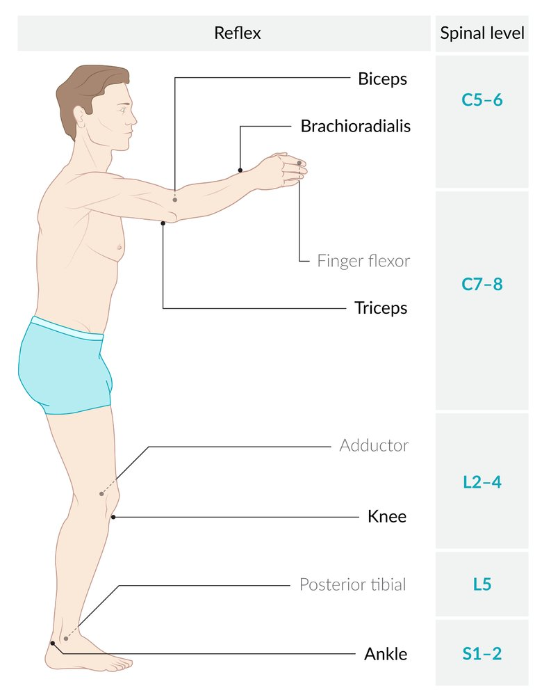
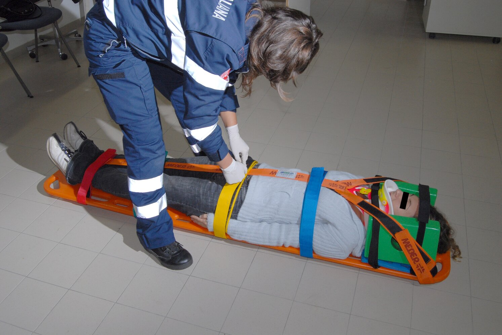
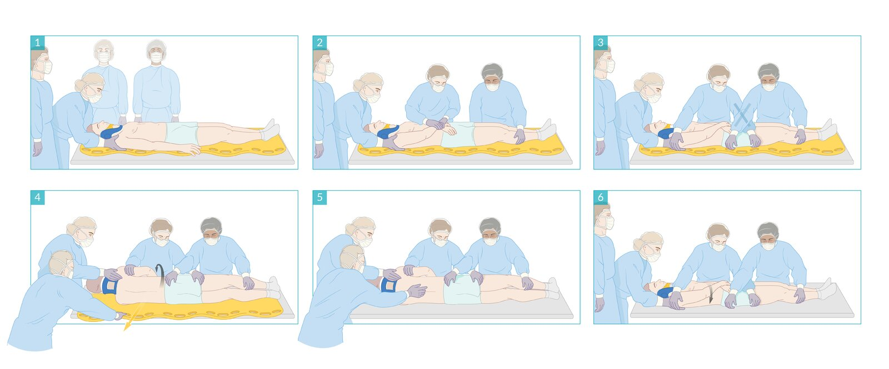
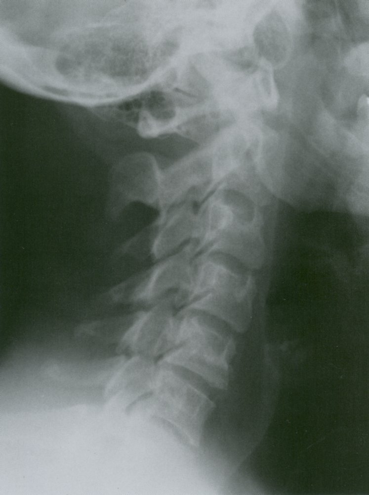
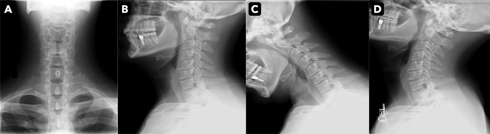
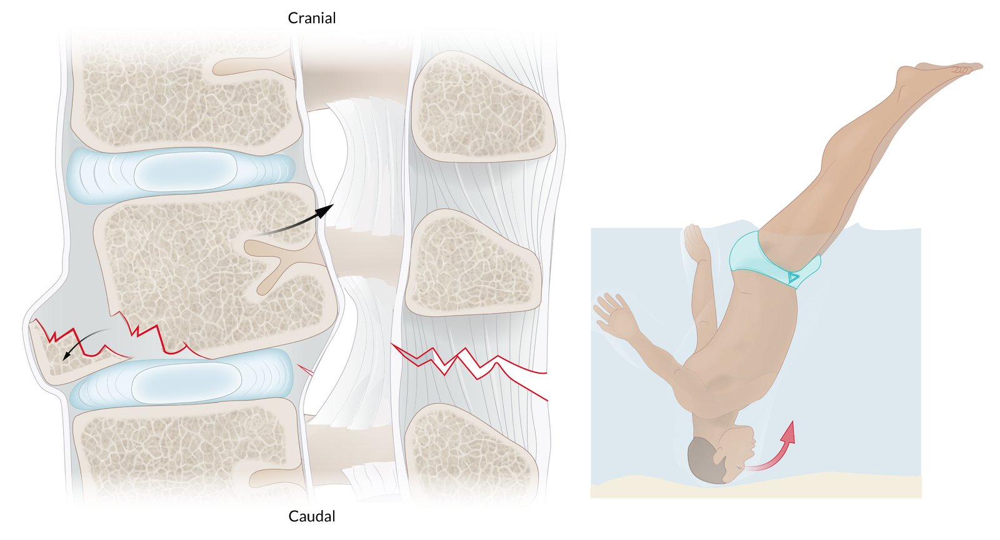
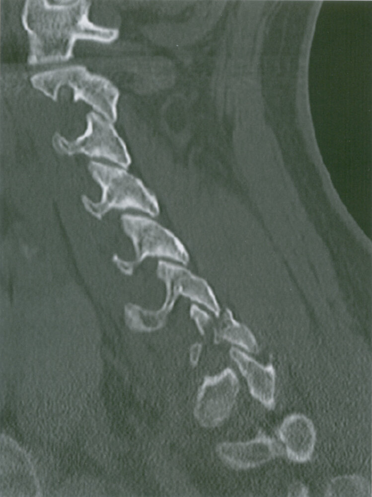

# Cervical spine injuries

*Categories: Clinical knowledge > Surgery > Trauma and orthopedic surgery > General trauma > Cervical spine injuries*

[Original Article Link](https://coursology-qbank.com/amboss/article/-u0DF3)

---

## Summary

<u>Cervical spine</u> injuries consist of <u>fractures</u>, subluxations, <u>dislocations</u>, and <u>ligamentous injuries</u> of the cervical spinal column with or without an associated neurological injury. They are most commonly caused by <u>blunt trauma</u>, e.g., <u>motor vehicle crashes</u> (<u>MVCs</u>) and falls. During initial evaluation, <u>spinal motion restrictions</u> must be maintained pending <u>cervical spine clearance</u>. <u>NEXUS criteria</u> and the <u>Canadian C-Spine Rule</u> are <u>clinical decision rules</u> used to determine whether imaging studies are indicated. CT of the head and neck is the preferred imaging modality in adults. <u>X-rays</u> of the <u>cervical spine</u> may be used in children to avoid radiation exposure, but expert consultation is recommended. <u>Stable spinal injuries</u> are often treated with external <u>immobilization</u>. <u>Unstable spinal injuries</u> typically require surgical fixation. Because treatment varies with the morphology and location of the injury, expert consultation is always required.

For thoracic and <u>lumbar spine</u> injuries, see “<u>Vertebral injuries</u>.” For injuries involving the spinal cord, see “<u>Spinal cord injury</u>.”

For minor neck <u>ligament</u> or <u>muscle injuries</u>, see “<u>Neck sprain</u>” and “<u>Whiplash injury</u>.”

---

## Initial management

### <u>Primary survey</u> [[4]](https://coursology-qbank.com/amboss/article/PcWWc40)[[5]](https://coursology-qbank.com/amboss/article/1vW2_M0)[[6]](https://coursology-qbank.com/amboss/article/cuWaJM0)

* Apply <u>spinal motion restrictions</u> as soon as <u>C-spine</u> injury is suspected, e.g., during prehospital management, before <u>airway management</u>. 

* <u>Cervical spine immobilization</u>

* <u>Log roll</u> during examination and/or transfers

* If <u>airway management</u> is required (e.g., <u>signs of airway compromise</u>, <u>respiratory failure</u>): [[5]](https://coursology-qbank.com/amboss/article/1vW2_M0)

* Retain the <u>posterior</u> portion of the <u>cervical collar</u>.

* Apply <u>manual in-line C-spine stabilization</u> while removing the <u>anterior</u> portion of the <u>cervical collar</u>.

* Perform <u>endotracheal intubation</u>.

* <u>Rapid-sequence intubation</u> with <u>video laryngoscopy</u> or <u>direct laryngoscopy</u> is appropriate for most cases.

* If other <u>difficult airway risk factors</u> (e.g., facial and neck trauma) are present, consult anesthesia for <u>awake intubation</u>.

* Stabilize life-threatening concurrent injuries, e.g., <u>TBI</u> or <u>hemorrhagic shock</u>. [[7]](https://coursology-qbank.com/amboss/article/ZuWZpM0)

> [!WARNING]
> Maintain <u>spinal motion restrictions</u> until <u>unstable spinal injury</u> is ruled out. [[4]](https://coursology-qbank.com/amboss/article/PcWWc40)[[5]](https://coursology-qbank.com/amboss/article/1vW2_M0)

### <u>Secondary survey</u> [[8]](https://coursology-qbank.com/amboss/article/CVWq940)[[9]](https://coursology-qbank.com/amboss/article/3ZdSYo0)

* Using <u>log roll</u> with <u>manual in-line C-spine stabilization</u>, inspect and palpate the entire <u>spine</u> for <u>bruising</u>, tenderness, gaps, and/or steps.

* Perform focused <u>neurological examination</u>, including:

* <u>Sensory level</u>

* <u>Segmental motor testing</u>

* <u>DTRs</u>

* <u>DRE</u> to assess rectal tone

* <u>Cranial nerve testing</u>

* Manage concurrent injuries, e.g., <u>facial fracture management</u>, <u>blunt chest trauma</u>. [[7]](https://coursology-qbank.com/amboss/article/ZuWZpM0)

> [!WARNING]
> Identify <u>brainstem</u> and <u>spinal cord injury</u> early.

Dermatome map

Deep tendon reflexes

### Initial diagnostics and early <u>C-spine clearance</u>

* Apply the <u>NEXUS criteria</u> or <u>Canadian C-Spine Rule</u> (<u>CCSR</u>) to determine the need for imaging.

* <u>Clear C-spine</u> clinically, if possible.

* If indicated, obtain <u>diagnostics for C-spine injury</u> (e.g., CT <u>C-spine</u>).

> [!TIP]
> Discontinue <u>C-spine immobilization</u> as soon as <u>C-spine clearance</u> criteria are met. [[3]](https://coursology-qbank.com/amboss/article/3uWSIM0)[[10]](https://coursology-qbank.com/amboss/article/TuW6qM0)

### Concurrent <u>spinal cord injury</u> (SCI) [[5]](https://coursology-qbank.com/amboss/article/1vW2_M0)[[11]](https://coursology-qbank.com/amboss/article/UVdbFK0)[[12]](https://coursology-qbank.com/amboss/article/TDW6dn0)

* Provide <u>acute management for SCI</u>.

* See ”<u>Respiratory support for SCI</u>.”

* See “<u>BP management for SCI</u>.”

> [!WARNING]
> Prepare to manage acute or delayed-onset <u>respiratory failure</u> in patients with cervical SCI. [[5]](https://coursology-qbank.com/amboss/article/1vW2_M0)[[11]](https://coursology-qbank.com/amboss/article/UVdbFK0)[[12]](https://coursology-qbank.com/amboss/article/TDW6dn0)

### Urgent consults

* Consult a <u>spine</u> <u>surgery</u> specialist early for known or suspected <u>C-spine</u> injury.

* Consult neurosurgery for concomitant <u>TBI</u>.

* Consult trauma <u>surgery</u> for <u>polytrauma</u> and other multisystem injuries.

> [!WARNING]
> For <u>unstable spinal injuries</u>, urgent surgical intervention is typically indicated to minimize the risk of irreversible neurological injury.

---

## Spinal immobilization

See “<u>C-spine immobilization in children</u>" for indications, steps, and <u>C-spine clearance</u> criteria specific to children.

### Definition  [[13]](https://coursology-qbank.com/amboss/article/SCWyrn0)

* The application of devices and techniques to restrict undesirable motion of the <u>vertebral column</u>

* Used to prevent further neurological and mechanical injury caused by patient movement (e.g., during transfers, transportation, or in response to stimuli)

### Indications for spinal immobilization [[4]](https://coursology-qbank.com/amboss/article/PcWWc40)[[13]](https://coursology-qbank.com/amboss/article/SCWyrn0)[[14]](https://coursology-qbank.com/amboss/article/VuWGJM0)

<u>Blunt trauma</u> with any of the following:

* <u>Altered mental status</u> (<u>AMS</u>), e.g., <u>GCS</u> < 15  [[4]](https://coursology-qbank.com/amboss/article/PcWWc40)

* <u>Pain</u> or tenderness at the midline of the back or neck

* <u>Focal neurological deficits</u>

* Spinal deformity

* <u>Distracting injuries</u>  [[13]](https://coursology-qbank.com/amboss/article/SCWyrn0)

> [!TIP]
> <u>Spinal immobilization</u> is not required in patients who are alert, neurologically intact, and have no <u>distracting injury</u> (e.g., <u>long bone</u> <u>fracture</u>), obvious spinal deformity, or <u>pain</u> or tenderness in the back or neck. [[5]](https://coursology-qbank.com/amboss/article/1vW2_M0)[[13]](https://coursology-qbank.com/amboss/article/SCWyrn0)

> [!WARNING]
> Do not apply <u>spinal immobilization</u> after <u>penetrating trauma</u>, as instability is unlikely, and <u>immobilization</u> can delay life-saving resuscitation. [[4]](https://coursology-qbank.com/amboss/article/PcWWc40)[[14]](https://coursology-qbank.com/amboss/article/VuWGJM0)

### Technique [[4]](https://coursology-qbank.com/amboss/article/PcWWc40)[[13]](https://coursology-qbank.com/amboss/article/SCWyrn0)[[14]](https://coursology-qbank.com/amboss/article/VuWGJM0)

* <u>C-spine</u>-specific <u>immobilization</u> methods

* Rigid <u>cervical collar</u>

* <u>Manual in-line C-spine stabilization</u>

* <u>Immobilization</u> of the rest of the <u>spine</u> (indicated as part of <u>C-spine immobilization</u>)

* Maintenance of <u>supine position</u>, i.e., no bending or twisting of the <u>spine</u>

* <u>Log-roll maneuver</u> to access the patient's back or protect the <u>airway</u> during emesis

* Additional measures during transfers and/or transport 

* Backboard (to immobilize the entire body)  [[13]](https://coursology-qbank.com/amboss/article/SCWyrn0)

* Supportive blocks on either side of the head (with the head secured to blocks and board)

* <u>Spinal immobilization</u> without <u>cervical collar</u>: can be maintained if there is an ongoing concern for T- or <u>L-spine</u> injury after successful <u>C-spine clearance</u> [[15]](https://coursology-qbank.com/amboss/article/ZyYZd7)

> [!TIP]
> When <u>C-spine immobilization</u> is indicated, routinely immobilize the entire <u>spine</u>. [[5]](https://coursology-qbank.com/amboss/article/1vW2_M0)[[13]](https://coursology-qbank.com/amboss/article/SCWyrn0)

> [!TIP]
> To minimize complications, remove the rigid backboard as soon as possible using a <u>log-roll maneuver</u> once patients have been transferred to a stretcher. [[15]](https://coursology-qbank.com/amboss/article/ZyYZd7)[[16]](https://coursology-qbank.com/amboss/article/54diPJ0)

Cervical spine immobilization

#### Manual in-line C-spine stabilization [[17]](https://coursology-qbank.com/amboss/article/m4dVPJ0)

* A <u>cervical spine immobilization</u> technique that involves placing the hands on either side of the patient's head while gripping the <u>skull base</u> to keep it in a neutral position

* Clinical applications

* Initial application of <u>C-spine immobilization</u>

* Ongoing <u>C-spine immobilization</u> if a <u>cervical collar</u> is unavailable

* Temporary <u>C-spine immobilization</u> if the <u>cervical collar</u> needs to be removed to allow unimpeded access to the neck, e.g., during examination or <u>airway management</u>

#### Log roll maneuver [[18]](https://coursology-qbank.com/amboss/article/3wYSir)[[19]](https://coursology-qbank.com/amboss/article/N4d-jJ0)

* A maneuver used to maintain <u>spinal immobilization</u> when repositioning patients between the <u>supine</u> and <u>lateral</u> <u>decubitus positions</u>

* Helpful for <u>posterior</u> body examination, preventing <u>aspiration</u> during emesis, and for transfers (e.g., from stretcher to examination table)

* Requires synchronized movement of multiple trained <u>healthcare providers</u>

* At least one provider maintains manual <u>C-spine</u> in-line stabilization.

* Others secure the limbs and support the patient's weight.

Log roll maneuver with spinal motion restrictions

### Complications [[5]](https://coursology-qbank.com/amboss/article/1vW2_M0)[[15]](https://coursology-qbank.com/amboss/article/ZyYZd7)

* <u>Pain</u>

* <u>Pressure ulcers</u>

* <u>Aspiration</u>

* <u>Ventilator-associated pneumonia</u>

* <u>Elevated ICP</u>

> [!WARNING]
> Complications occur more commonly with prolonged <u>spinal immobilization</u> and the use of rigid <u>cervical collars</u> and backboards. [[15]](https://coursology-qbank.com/amboss/article/ZyYZd7)[[16]](https://coursology-qbank.com/amboss/article/54diPJ0)

### Cervical spine clearance [[5]](https://coursology-qbank.com/amboss/article/1vW2_M0)[[10]](https://coursology-qbank.com/amboss/article/TuW6qM0)[[20]](https://coursology-qbank.com/amboss/article/guWFqM0)[[21]](https://coursology-qbank.com/amboss/article/euWxJM0)

* Definition: the safe discontinuation of unnecessary <u>C-spine immobilization</u> (e.g., rigid <u>cervical collar</u>) as soon as possible to minimize complications

* Clinical clearance (i.e., without imaging) is appropriate for patients at low risk of <u>C-spine</u> injury per the <u>CCSR</u> or <u>NEXUS criteria</u>.

* Radiographic clearance (i.e., no evidence of <u>fracture</u> or instability on CT <u>C-spine</u>) is appropriate for:

* Awake, lucid, and neurologically intact patients with <u>neck pain</u>

* Patients with <u>AMS</u> and grossly intact <u>motor function</u>  [[5]](https://coursology-qbank.com/amboss/article/1vW2_M0)[[20]](https://coursology-qbank.com/amboss/article/guWFqM0)[[22]](https://coursology-qbank.com/amboss/article/n4d7PJ0)

* Complex cases that require a <u>spine</u> specialist consult (and sometimes an <u>MRI</u>) include:

* Suspected <u>ligamentous injury</u>

* Persistent neurological symptoms

* <u>Clinical examination</u> findings that do not correlate with imaging interpretation

* High-risk degenerative changes on CT, e.g., <u>disc protrusion</u>  [[23]](https://coursology-qbank.com/amboss/article/tkdXpJ0)

> [!WARNING]
> Do not clear the <u>C-spine</u> in patients with obvious motor deficits and/or evidence of <u>unstable spinal injury</u> on imaging. [[5]](https://coursology-qbank.com/amboss/article/1vW2_M0)

---

## Diagnosis

### Approach [[8]](https://coursology-qbank.com/amboss/article/CVWq940)[[24]](https://coursology-qbank.com/amboss/article/OZdIbo0)[[25]](https://coursology-qbank.com/amboss/article/E8W8oM0)

* <u>Blunt trauma</u>

* Use <u>clinical decision rules</u> to determine the need for cervical imaging and avoid unnecessary radiation exposure.

* First-line imaging (if indicated)

* Adults: CT <u>C-spine</u> without IV contrast

* Concurrent <u>TBI</u> suspected: Obtain CT head and neck without IV contrast.

* <u>Polytrauma</u>: Obtain as part of <u>whole-body CT</u>.

* Children: <u>x-rays</u> (See “<u>C-spine x-rays in children</u>” for details.)

* <u>C-spine</u> injury identified on first-line imaging: Obtain CT of the whole <u>spine</u>.  [[26]](https://coursology-qbank.com/amboss/article/4xW39n0)

* Suspected <u>blunt cerebrovascular injury</u> (<u>BCVI</u>): Obtain <u>CTA</u> head and neck if <u>expanded Denver screening criteria</u> for <u>BCVI</u> are met.

* <u>Penetrating trauma</u>: Obtain <u>CTA</u> neck (see “<u>Penetrating neck trauma</u>” for details).

* Suspected neurological or <u>ligamentous injury</u>: Add <u>MRI</u> head and neck without IV contrast.

* Suspected T- or <u>L-spine</u> injuries: See “<u>Diagnosis of vertebral injuries</u>.”

> [!WARNING]
> Maintain a high clinical suspicion for significant <u>vertebral injury in older adults</u>.

### NEXUS criteria [[27]](https://coursology-qbank.com/amboss/article/icWJX40)[[28]](https://coursology-qbank.com/amboss/article/juW_IM0)

The <u>National Emergency X-Radiography Utilization Study (NEXUS) criteria</u> are a <u>clinical decision rule</u> for determining the need for <u>C-spine</u> imaging following <u>blunt trauma</u>.

* Patients meeting all the following criteria are at low risk for <u>C-spine</u> injury and do not require imaging: 

* No <u>posterior</u> midline <u>cervical spine</u> tenderness

* No <u>focal neurological deficits</u>

* Normal alertness

* No evidence of intoxication

* No <u>distracting injuries</u>

* Using <u>NEXUS criteria</u> reduces the rate of unnecessary imaging in low-risk patients.  [[24]](https://coursology-qbank.com/amboss/article/OZdIbo0)

* Less accurate in older adults and children  [[29]](https://coursology-qbank.com/amboss/article/pOdLtJ0)[[30]](https://coursology-qbank.com/amboss/article/JOdstJ0)

* Use with caution in patients ≥ 65 years old; consider cervical imaging even if low-risk. [[5]](https://coursology-qbank.com/amboss/article/1vW2_M0)[[8]](https://coursology-qbank.com/amboss/article/CVWq940)

* May be used in children > 3 years of age, consider alternative <u>clinical decision rules</u> (see “<u>C-spine injuries in children</u>”) [[9]](https://coursology-qbank.com/amboss/article/3ZdSYo0)

NEXUS C-Spine Criteria

### Canadian C-Spine Rule (<u>CCSR</u>) [[28]](https://coursology-qbank.com/amboss/article/juW_IM0)[[31]](https://coursology-qbank.com/amboss/article/y3WdOO0)[[32]](https://coursology-qbank.com/amboss/article/OuWIrM0)

* A validated <u>clinical decision rule</u> used to determine the need for <u>C-spine</u> imaging following <u>blunt trauma</u>

* Involves the stepwise assessment of eligible patients

* Using <u>CCSR</u> leads to less unnecessary imaging than using <u>NEXUS criteria</u>.  [[24]](https://coursology-qbank.com/amboss/article/OZdIbo0)[[33]](https://coursology-qbank.com/amboss/article/AN1Rdh0)

* Not applicable to children (see “<u>C-spine injuries in children</u>” for alternative <u>clinical decision rules</u>) [[34]](https://coursology-qbank.com/amboss/article/FkdgpJ0)

|  <u>Canadian C-Spine Rule</u> [[28]](https://coursology-qbank.com/amboss/article/juW_IM0)[[31]](https://coursology-qbank.com/amboss/article/y3WdOO0)[[32]](https://coursology-qbank.com/amboss/article/OuWIrM0)  |  |  |
| --- | --- | --- |
|  | Components | Management |
| High-risk features |   * Age ≥ 65 years  * Limb <u>paresthesias</u>  * Dangerous mechanism of injury    |   * Any present: Obtain imaging.  * All absent: Assess for low-risk features.    |
| Low-risk features |   * Low-speed rear-end <u>MVC</u>  * Patient ambulatory at any time  * Patient in a sitting position  * Absence of midline <u>cervical spine</u> tenderness  * Delayed onset of <u>neck pain</u>    |   * Any present: Assess neck <u>range of motion</u>.  * All absent: Obtain imaging.    |
| Neck <u>range of motion</u> |  * Ability to actively rotate neck 45° to the left and right   |   * Present: <u>Clear cervical spine</u>.  * Absent: Obtain imaging.    |
|  Only apply this <u>clinical decision rule</u> if all of the following eligibility criteria are met:   * History of <u>blunt trauma to the head</u> or neck  * Hemodynamically stable  * <u>GCS</u> = 15  * Clinical concern for <u>C-spine</u> injury     |  |  |

Canadian C-Spine Rule

### CT <u>C-spine</u> [[8]](https://coursology-qbank.com/amboss/article/CVWq940)[[24]](https://coursology-qbank.com/amboss/article/OZdIbo0)[[25]](https://coursology-qbank.com/amboss/article/E8W8oM0)

* Best imaging modality to assess bony injuries

* Modality: noncontrast <u>MDCT</u> with thin (2 mm) slices from the <u>skull base</u> to the <u>cervicothoracic junction</u> [[26]](https://coursology-qbank.com/amboss/article/4xW39n0)

* Can be obtained alone or in conjunction with other imaging (e.g., CT head and neck, <u>whole body CT</u>)

* Findings depend on injury level and type.

* See “<u>Upper C-spine injuries</u>.”

* See “Lower <u>C-spine injuries</u>.”

### <u>MRI</u> <u>C-spine</u> [[8]](https://coursology-qbank.com/amboss/article/CVWq940)[[24]](https://coursology-qbank.com/amboss/article/OZdIbo0)[[25]](https://coursology-qbank.com/amboss/article/E8W8oM0)

* Best imaging modality to assess neurological or <u>ligamentous injury</u>

* Often obtained in addition to CT in patients with <u>unstable vertebral injuries</u>

* Indicated for known or suspected spinal cord or <u>nerve root</u> injury (with or without <u>fracture</u> on CT) [[8]](https://coursology-qbank.com/amboss/article/CVWq940)

* Not routinely indicated to rule out <u>C-spine</u> injury in patients with <u>AMS</u> and a normal CT <u>C-spine</u>; consider in select cases (see “<u>C-spine clearance</u>” for details) [[5]](https://coursology-qbank.com/amboss/article/1vW2_M0)[[20]](https://coursology-qbank.com/amboss/article/guWFqM0)[[22]](https://coursology-qbank.com/amboss/article/n4d7PJ0)

### X-rays of the cervical spine

* Indications

* Often used as initial imaging in pediatric patients (see “<u>C-spine injury in children</u>”)  [[9]](https://coursology-qbank.com/amboss/article/3ZdSYo0)

* Not recommended in adults  [[5]](https://coursology-qbank.com/amboss/article/1vW2_M0)

* Views

* Anteroposterior (AP) and <u>lateral</u> views

* Odontoid view: an AP view of C2 obtained with the patient's mouth open to better visualize the <u>odontoid process</u> and <u>atlantoaxial joint</u> space.

* Swimmer's view: a modified <u>lateral</u> view obtained by <u>abducting</u> the arm closest to the detector <u>overhead</u> to better visualize the C7-T1 junction

* Abnormal findings: Any of the following requires further workup with CT and/or <u>MRI</u>. [[33]](https://coursology-qbank.com/amboss/article/AN1Rdh0)[[35]](https://coursology-qbank.com/amboss/article/dDWoWn0)[[36]](https://coursology-qbank.com/amboss/article/VwWG3n0)

* <u>Fracture</u> lines

* Evidence of subluxation or <u>dislocation</u>, e.g.:

* Misalignment at the <u>anterior vertebral line</u>, <u>posterior vertebral line</u>, or <u>spinolaminar line</u>

* <u>Basion dens interval</u> ≥ 12 mm in adults and children  [[37]](https://coursology-qbank.com/amboss/article/RZdlYo0)

* <u>Basion axial interval</u> ≥ 12 mm in adults and children [[33]](https://coursology-qbank.com/amboss/article/AN1Rdh0)

* <u>Powers ratio</u> ≥ 1 in adults and children [[33]](https://coursology-qbank.com/amboss/article/AN1Rdh0)

* <u>Predental space</u> [[36]](https://coursology-qbank.com/amboss/article/VwWG3n0)

* > 3 mm in individuals > 8 years

* > 5 mm in children ≤ 8 years

> [!WARNING]
> <u>X-ray</u> studies that do not allow complete visualization of all seven <u>cervical vertebrae</u> and the junction of C7–T1 are incomplete. [[35]](https://coursology-qbank.com/amboss/article/dDWoWn0)

Cervical spine lateral view

Cervical spine

---

## Lower cervical spine injuries

### General principles [[51]](https://coursology-qbank.com/amboss/article/4Zd3bo0)[[52]](https://coursology-qbank.com/amboss/article/LEWwwM0)[[53]](https://coursology-qbank.com/amboss/article/kZdmbo0)

* Subaxial, (i.e., C3–C7), <u>cervical injuries</u> account for over two-thirds of <u>C-spine injuries</u>. [[54]](https://coursology-qbank.com/amboss/article/nEW7wM0)

* Management is case-specific and requires <u>spine</u> <u>surgeon</u> consultation.  [[52]](https://coursology-qbank.com/amboss/article/LEWwwM0)[[53]](https://coursology-qbank.com/amboss/article/kZdmbo0)

* Usually guided by <u>AO Spine classification</u> [[55]](https://coursology-qbank.com/amboss/article/jvW_-M0)[[56]](https://coursology-qbank.com/amboss/article/4vW3Zn0)

* <u>Unstable vertebral injuries</u>: <u>surgery</u> typically required

* <u>Stable vertebral injuries</u>: Consider <u>conservative management</u>.

### Flexion teardrop fracture [[57]](https://coursology-qbank.com/amboss/article/LZdwXo0)[[58]](https://coursology-qbank.com/amboss/article/nvW70n0)[[59]](https://coursology-qbank.com/amboss/article/5vWi0n0)[[60]](https://coursology-qbank.com/amboss/article/FOdg8J0)[[61]](https://coursology-qbank.com/amboss/article/cldaDJ0)

* Description

* An extremely unstable wedge-shaped <u>fracture</u> of the anteroinferior <u>vertebral body</u>, typically C4, C5, or C6

* Usually caused by high energy axial compression of the flexed <u>cervical spine</u>

* Clinical features: See “<u>Clinical features of C-spine injury</u>.”

* Neurological manifestations range from asymptomatic to <u>quadriplegia</u>.

* <u>Clinical features of spinal cord injury</u> typically present, often <u>complete spinal cord injury</u>

* Diagnosis

* Imaging: both CT and <u>MRI</u> required for complete assessment

* Findings

* Forward displacement of the <u>anterior</u> <u>vertebral body</u> fragment

* <u>Posterior</u> displacement of the <u>posterior</u> <u>vertebral body</u> (commonly into the <u>spinal canal</u>)

* Disruption of <u>anterior</u> and <u>posterior</u> <u>vertebral</u> ligamentous structures

* See also “<u>Diagnostics for C-spine injury</u>.”

* Management: usually requires early surgical decompression and fixation

Flexion teardrop fracture

### Clay-shoveler fracture [[62]](https://coursology-qbank.com/amboss/article/6EWj9M0)

* Description

* An <u>avulsion fracture</u> of a <u>spinous process</u> in the lower <u>cervical spine</u> or upper <u>thoracic spine</u>, most commonly C6 or C7

* Typically caused by forceful <u>flexion</u> of the <u>cervical spine</u>

* Most commonly seen following <u>MVCs</u>

* Clinical features

* Acute onset of <u>pain</u> at the base of the neck

* Localized tenderness over the <u>spinous process</u>

* Reduced <u>ROM</u> of the neck

* Diagnosis: See “<u>Diagnostics for C-spine injury</u>."

* Usually identifiable on <u>lateral</u> neck <u>x-ray</u>

* CT may be indicated to rule out more severe <u>C-spine</u> injury.

* Management: usually <u>managed conservatively</u>

* <u>NSAIDs</u> and rest

* Rigid <u>cervical collar</u> for comfort (optional)

### Cervical facet dislocation

#### Background

* Definition: the displacement of one <u>cervical vertebra</u> over another due to separation of the <u>facet joints</u> [[63]](https://coursology-qbank.com/amboss/article/1DW2Wn0)

* <u>Facet joint</u> involvement can be unilateral or bilateral.

* May include facet <u>fracture</u> and/or ligamentous disruption

* May lead to cervical instability and cause SCI, especially with bilateral facet <u>dislocation</u>

* Location: most commonly involves the C5–C7 junction

* Mechanism: : forceful <u>flexion</u> ; and distraction of the neck

#### Clinical features

See “<u>Clinical features of C-spine injury</u>.”

* Unilateral facet <u>dislocation</u>: normal <u>neurological examination</u> or evidence of <u>monoradiculopathy</u> [[64]](https://coursology-qbank.com/amboss/article/JzWsFL0)

* C4/5: <u>C5 radiculopathy</u>

* C5/6: <u>C6 radiculopathy</u>

* C6/7: <u>C7 radiculopathy</u>

* Bilateral facet <u>dislocation</u>: <u>clinical features of spinal cord injury</u> (high risk), e.g.:  ;  [[64]](https://coursology-qbank.com/amboss/article/JzWsFL0)

* Bilateral <u>weakness</u> of the upper and lower extremities

* Sensory deficits below the level of the injury

#### Diagnostics [[38]](https://coursology-qbank.com/amboss/article/iZdJYo0)[[63]](https://coursology-qbank.com/amboss/article/1DW2Wn0)

See also “<u>Diagnosis of C-spine injury</u>.”

* Imaging modalities

* CT <u>C-spine</u>: recommended in all patients

* <u>X-ray</u> <u>C-spine</u>: Subtle facet subluxations may not be detectable.

* <u>MRI</u> <u>C-spine</u>; : required in all patients before surgical intervention  [[63]](https://coursology-qbank.com/amboss/article/1DW2Wn0)[[65]](https://coursology-qbank.com/amboss/article/4DW3en0)

* Findings [[35]](https://coursology-qbank.com/amboss/article/dDWoWn0)[[63]](https://coursology-qbank.com/amboss/article/1DW2Wn0)[[65]](https://coursology-qbank.com/amboss/article/4DW3en0)

* <u>Vertebral</u> subluxation: ∼ 25% in unilateral <u>dislocation</u> and ∼ 50% in bilateral <u>dislocation</u>

* Gross malalignment or subtle subluxation of the <u>vertebral</u> facets

* Widened distance between adjacent <u>spinous processes</u>

* Disc space narrowing, <u>soft tissue</u> swelling, hypolordosis at injury level

* Other: facet <u>fractures</u>, spinal cord or <u>nerve root</u> impingement, ligamentous disruption

Facet fracture-dislocation

#### Management [[38]](https://coursology-qbank.com/amboss/article/iZdJYo0)[[63]](https://coursology-qbank.com/amboss/article/1DW2Wn0)

* Early <u>closed reduction</u>: performed by a <u>spine</u> <u>surgeon</u> in awake patients  [[38]](https://coursology-qbank.com/amboss/article/iZdJYo0)

* Surgical stabilization and fusion: typically indicated in all patients (even if <u>closed reduction</u> is successful)

> [!WARNING]
> Displacement, <u>vertebral instability</u>, and neurological injury are more likely with bilateral than with unilateral facet <u>dislocation</u>. Do not delay <u>spine</u> <u>surgery</u> consult for early <u>closed reduction</u>, especially for bilateral facet <u>dislocations</u>. [[63]](https://coursology-qbank.com/amboss/article/1DW2Wn0)

---