# Elevated intracranial pressure and brain herniation

*Categories: Clinical knowledge > Surgery > Trauma and orthopedic surgery > General trauma > Elevated intracranial pressure and brain herniation*

[Original Article Link](https://coursology-qbank.com/amboss/article/HL0K_g)

---

## Summary

<u>Intracranial pressure</u> (<u>ICP</u>) is the pressure that exists within the <u>cranium</u>, including its compartments (e.g., the <u>subarachnoid space</u> and the ventricles). <u>ICP</u> varies as the position of the head changes relative to the body and is periodically influenced by normal physiological factors (e.g., cardiac contractions). Adults in the <u>supine position</u> typically have a physiological <u>ICP</u> of ≤ 15 mm Hgg; an <u>ICP</u> of ≥ 20 mm Hg indicates pathological <u>intracranial hypertension</u>. <u>ICP</u> may be elevated in a variety of conditions (e.g., <u>intracranial tumors</u>) and can result in a decrease in <u>cerebral perfusion pressure</u> (<u>CPP</u>) and/or <u>herniation</u> of cerebral structures. Symptoms of <u>elevated ICP</u> are generally nonspecific (e.g., impaired consciousness, <u>headache</u>, <u>vomiting</u>); however, more specific symptoms may be present depending on the affected structures (e.g., <u>Cushing triad</u> if the <u>brainstem</u> is compressed). Findings from <u>brain</u> imaging (e.g., a midline shift) and <u>physical examination</u> (e.g., <u>papilledema</u>) can indicate <u>ICP</u> elevation but may not be able to rule it out. Therefore, <u>ICP</u> monitoring and quantification are vital in at-risk patients. Management usually involves expedited <u>surgery</u> of resectable or drainable lesions, <u>conservative measures</u> (e.g., positioning, sedation, <u>analgesia</u>, and <u>antipyretics</u>), and medical therapy (e.g., hyperosmolar therapy such as <u>mannitol</u> or <u>hypertonic saline</u>, or <u>glucocorticoids</u>). Treatment options for refractory <u>intracranial hypertension</u> include temporary controlled <u>hyperventilation</u>, <u>CSF</u> drainage, and <u>decompressive craniectomy</u> (DC), as well as other advanced medical therapies (e.g., <u>barbiturate</u> <u>coma</u>, <u>therapeutic hypothermia</u>).

---

## Etiology

* <u>Pseudotumor cerebri syndrome</u>

* <u>Primary pseudotumor cerebri syndrome</u>

* <u>Secondary pseudotumor cerebri syndrome</u>

* <u>CNS</u> inflammation, infection, and/or <u>abscess</u>

* Space-occupying lesions

* <u>Intracranial hemorrhage</u> or <u>hematoma</u>

* <u>Aneurysm</u>

* <u>Intracranial tumors</u>

* Elevated venous pressure (e.g., as a result of <u>heart failure</u>)

* Increased <u>CSF</u> (<u>hydrocephalus</u>)

* Metabolic disturbances;  (e.g., <u>hyponatremia</u>, <u>hepatic encephalopathy</u>)

* <u>Epilepsy</u> and <u>seizures</u>  [[1]](https://coursology-qbank.com/amboss/article/_0a5iQ)

---

## Pathophysiology

### Physiology of <u>ICP</u> [[2]](https://coursology-qbank.com/amboss/article/94YNl6)

* Overview

* Physiological <u>ICP</u> is < 15 mm Hg in adults (in <u>supine position</u>); children generally have a lower <u>ICP</u>.

* <u>ICP</u> varies depending on the position of the head relative to the rest of the body and is influenced by certain physiological processes (e.g., cardiac contractions, sneezing, <u>coughing</u>, <u>Valsalva maneuver</u>).

* Volume of intracranial contents [[2]](https://coursology-qbank.com/amboss/article/94YNl6)

* <u>Brain</u>: approx. 85%

* <u>CSF</u>: approx. 10%

* Blood: approx. 5%

* Monro-Kellie principle: The sum of volumes of intracranial blood, <u>CSF</u>, and <u>brain</u> within the <u>cranium</u> is constant, which means that an increase in one component volume will be compensated for by a decrease in other(s). [[3]](https://coursology-qbank.com/amboss/article/n0W7gP0)

* Initial compensation allows for an increase in component volume with minimal change in <u>ICP</u>.

* Decrease in <u>CSF</u> volume via shifting into the <u>spinal canal</u>

* Decrease in cerebral blood volume via venous <u>vasoconstriction</u> and drainage

* Once the compensatory mechanisms are exhausted, <u>ICP</u> increases rapidly because of the <u>skull</u>'s inability to expand and accommodate the increase in intracranial volume.

### Physiology of <u>cerebral blood flow</u>

* Cerebral blood flow (<u>CBF</u>): the volume of blood (in mL) supplied to 100 g of <u>brain</u> tissue per minute  [[4]](https://coursology-qbank.com/amboss/article/w6chMW0)

* Cerebral autoregulation

* Process by which <u>CBF</u> is constantly maintained across a wide range of <u>mean arterial pressures</u> (MAPs), typically between 50–150 mm Hg

* Decreases in <u>MAP</u> cause <u>vasodilation</u> and increases in <u>MAP</u> trigger precapillary vascular constriction within seconds.

* Cerebral perfusion pressure (<u>CPP</u>): the effective pressure that delivers blood to the <u>brain</u> and is responsible for constant <u>perfusion</u> of <u>brain</u> tissue

* <u>CPP</u> = <u>MAP</u> - <u>ICP</u>

* A <u>CPP</u> of 0 equals the absence of <u>brain</u> <u>perfusion</u>.

* Cerebral <u>perfusion</u> is predominantly modulated by the <u>partial pressure of carbon dioxide</u> (<u>pCO2</u>).

* <u>CPP</u> linearly increases with <u>pCO2</u> until pCO₂ > 90 mm Hg. [[2]](https://coursology-qbank.com/amboss/article/94YNl6)

* Increased <u>pCO2</u> → ↓ <u>pH</u> → <u>vasodilation</u> → ↑ cerebral blood flow to remove excess CO2

* Decreased <u>pCO2</u> → <u>vasoconstriction</u> → ↓ cerebral blood flow

* Cerebral <u>perfusion</u> is, to a lesser degree, modulated by <u>brain</u> temperature through <u>cerebral metabolism</u>. [[5]](https://coursology-qbank.com/amboss/article/TYW6oP0)

* <u>Hyperthermia</u> → ↑ cerebral metabolism → ↑ <u>CBF</u> → ↑ cerebral blood volume → <u>↑ ICP</u>

* <u>Mild hypothermia</u> → ↓ cerebral metabolism → ↓ <u>CBF</u> → ↓ cerebral blood volume → ↓ <u>ICP</u>

* <u>Partial pressure</u> of oxygen (pO2) only modulates cerebral <u>perfusion</u> in severe <u>hypoxic</u> conditions when pO₂ < 50 mm Hg.

> [!TIP]
> Therapeutic <u>hyperventilation</u> reduces <u>pCO2</u> → ↓ cerebral blood flow → ↓ intracranial pressure (used, e.g., when patients with acute <u>cerebral edema</u> are unresponsive to other treatments).

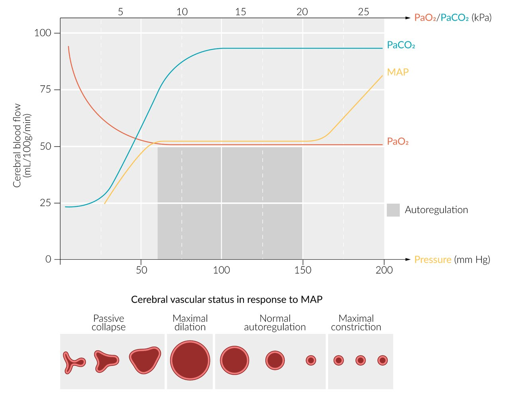

Cerebral blood flow

### Consequences of <u>elevated ICP</u>

* Decreased cerebral <u>perfusion</u> <u>CPP</u>

* If arterial pressure remains constant, an increase in <u>ICP</u> will cause a decrease in <u>CPP</u>.

* ↓ <u>CPP</u> → ↓ <u>CBF</u> → <u>ischemia</u>

* <u>Brain</u> tissue <u>herniation</u>

* Increased pressure gradient within the rigid <u>skull</u> → <u>brain</u> tissue shifts to other spaces of the <u>skull</u> → <u>brain</u> tissue <u>herniation</u>

* This may result in injury or in blocking of cerebral vessels and subsequent <u>ischemia</u>.

* Cushing's reflex

* ↑ <u>ICP</u> → ↓ <u>CPP</u> → compensatory activation of the <u>sympathetic nervous system</u> → ↑ systolic blood pressure → stimulation of <u>aortic arch</u> <u>baroreceptors</u> → activation of the <u>parasympathetic nervous system</u> (vagus) → <u>bradycardia</u> [[6]](https://coursology-qbank.com/amboss/article/ZcaZaj)

* ↑ Pressure on <u>brainstem</u> → dysfunction of <u>respiratory center</u> → irregular breathing

---

## Clinical features

* <u>Global</u>

* <u>Cushing triad</u>: irregular breathing, widening <u>pulse pressure</u>,;   and <u>bradycardia</u>

* Reduced <u>levels of consciousness</u>

* <u>Headache</u>

* <u>Vomiting</u>

* <u>Papilledema</u>

* Psychiatric changes

* In <u>infants</u>: <u>macrocephaly</u>, bulging <u>fontanel</u>, <u>sunset sign</u>

* Focal

* <u>Diplopia</u>

* <u>Cerebral herniation syndrome</u>: see “Subtypes and variants” below.

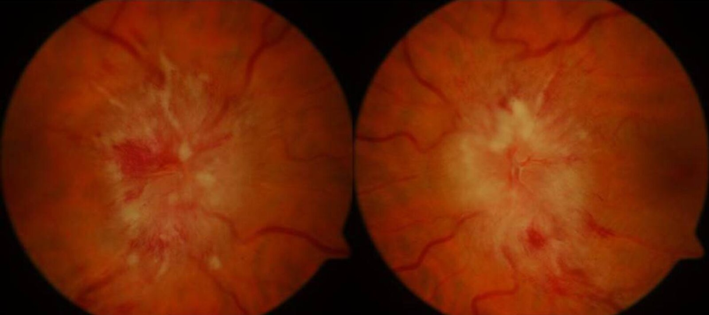

Bilateral papilledema

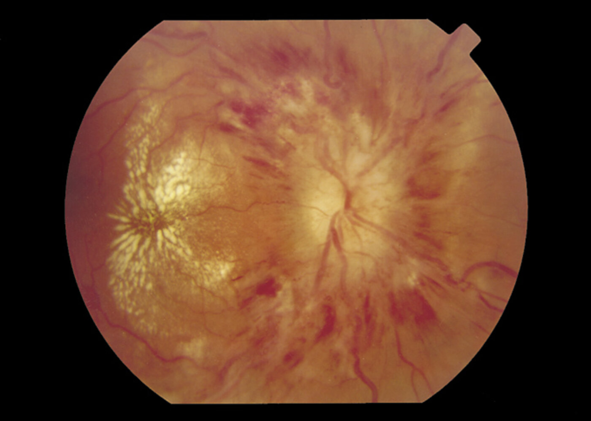

Papilledema

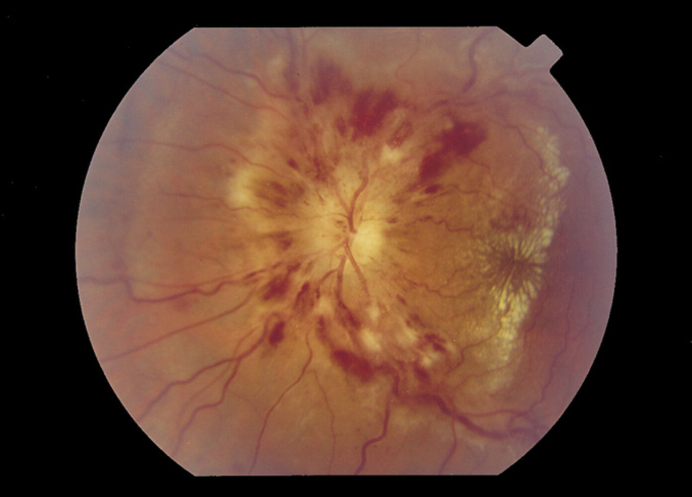

Papilledema

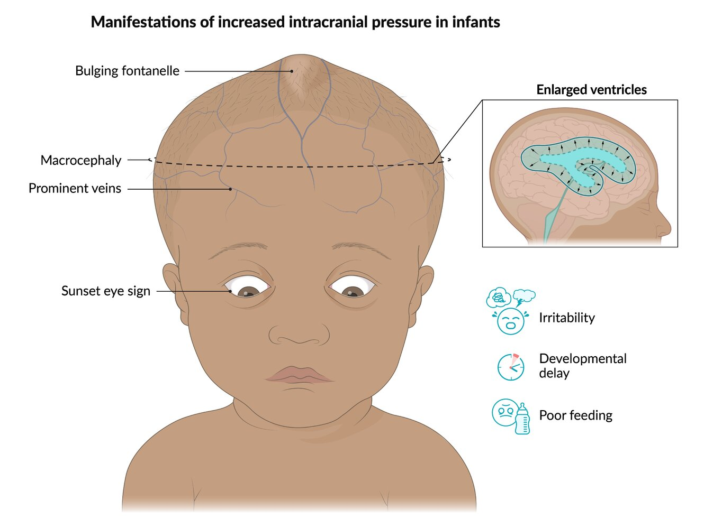

Manifestations of increased intracranial pressure in infants

---

## Subtypes and variants

### <u>Cerebral herniation syndromes</u>    [[7]](https://coursology-qbank.com/amboss/article/0aaeQQ)[[8]](https://coursology-qbank.com/amboss/article/YaanQQ)

#### Subfalcine herniation

* Most common type of <u>cerebral herniation</u>

* <u>Mass effect</u> due to affection of the <u>ipsilateral</u> frontal, parietal, or <u>temporal lobes</u> → <u>medial</u> displacement of the <u>cingulate gyrus</u> → <u>herniation</u> under the <u>falx cerebri</u> → compression of:  

* <u>Anterior cerebral artery</u> branches (specifically the <u>pericallosal artery</u>) → <u>contralateral</u> <u>hemiparesis</u> (predominantly lower limbs)

* <u>Contralateral</u> hemisphere → obstruction of the <u>foramen of Monro</u> → <u>hydrocephalus</u>

* Usually no <u>pupillary</u> involvement

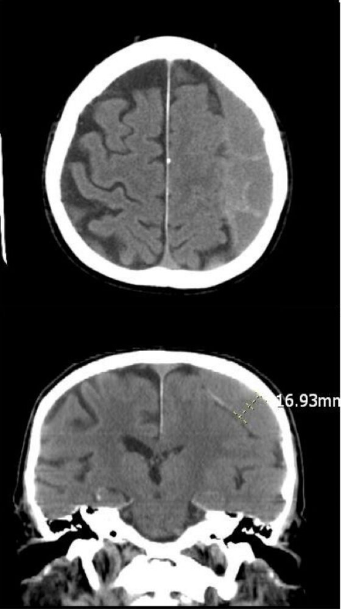

Subdural hematoma with subfalcine herniation

#### Descending transtentorial herniation

* Uncal herniation: <u>mass effect</u> caused by a <u>supratentorial</u> lesion → <u>medial</u> and downward displacement of the <u>uncus</u> at the tentorial incisure  

* Early manifestations

* <u>Ipsilateral</u> <u>posterior cerebral artery</u> compression→ <u>cortical blindness</u> with <u>contralateral</u> <u>homonymous hemianopia</u>

* <u>Ipsilateral</u> <u>oculomotor nerve</u> compression → Hutchinson pupil (<u>ipsilateral</u> fixed and <u>dilated pupil</u>)

* <u>Ipsilateral</u> <u>cerebral peduncle</u> compression → <u>contralateral</u> <u>hemiparesis</u>

* Midline shift → altered consciousness

* Late manifestations

* <u>Contralateral</u> <u>cerebral peduncle</u> compression against the tentorial notch → Kernohan phenomenon (a rare <u>false localizing sign</u> consisting of <u>hemiparesis</u> <u>ipsilateral</u> to the <u>brain</u> lesion)

* Downward shift of the <u>brainstem</u> → <u>brainstem</u> hemorrhages → focal deficits, impaired consciousness, <u>death</u>

* Central herniation: <u>mass effect</u> caused by bilateral or midline <u>supratentorial</u> lesions or severe <u>brain edema</u> → downward displacement of the <u>diencephalon</u>, <u>midbrain</u>, and <u>pons</u>

* <u>Oculomotor nerve</u> compression → <u>oculomotor nerve palsy</u> with fixed and <u>dilated pupils</u>

* <u>Brain stem</u> dysfunction → decerebrate or <u>decorticate posture</u>, <u>cardiac arrest</u>, <u>respiratory failure</u> → <u>vegetative state</u> or <u>death</u>

* Stretching or tearing of <u>basilar artery</u> perforating branches → <u>Duret hemorrhages</u>

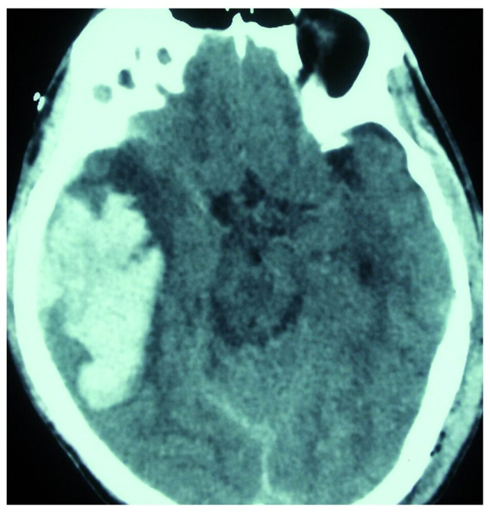

Temporoparietal hematoma with uncal herniation

#### Foramen magnum herniation

* Structures of the <u>posterior fossa</u> (e.g., <u>cerebellar tonsils</u>, medulla) herniate through the <u>foramen magnum</u>

* Symptoms include:

* Impaired consciousness

* <u>Decerebrate posturing</u>

* <u>Apnea</u>

* Impaired circulation

* <u>Death</u>

> [!TIP]
> The following clinical features should raise suspicion for a <u>cerebral herniation syndrome</u>, which can be fatal if not treated promptly: acutely worsening <u>level of consciousness</u> (e.g., <u>coma</u>), <u>pupillary</u> changes (e.g., <u>ipsilateral</u> <u>mydriasis</u>, <u>fixed dilated pupils</u>), new <u>focal neurological deficits</u> (e.g., <u>hemiparesis</u>, <u>decerebrate posturing</u>), and cardiorespiratory compromise (e.g., <u>bradycardia</u>, <u>apnea</u>).

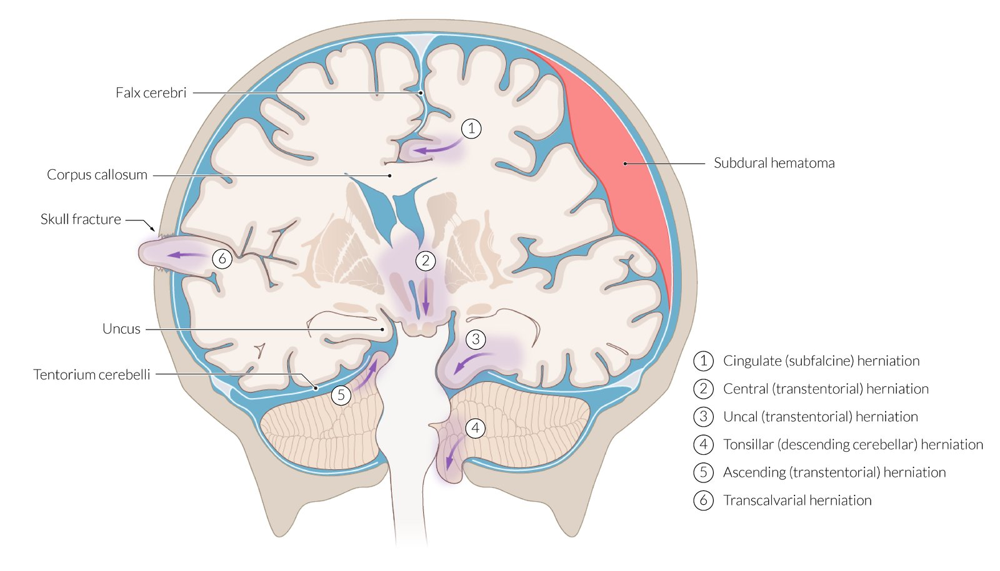

Brain herniation

Subdural hematoma with subfalcine herniation

Temporoparietal hematoma with uncal herniation

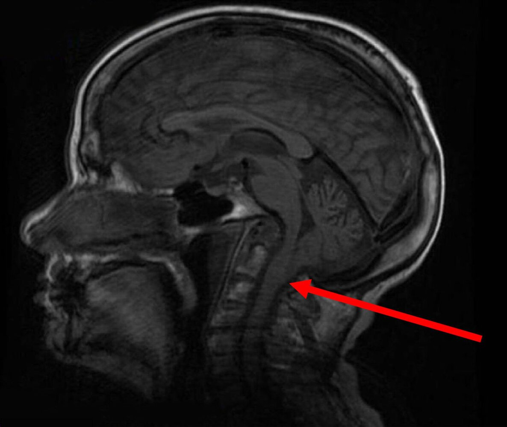

Chiari I.5 malformation

Neurological complications of dysnatremia

---

## Diagnosis

### <u>Neuroimaging</u> (CT head/<u>MRI</u> head) [[9]](https://coursology-qbank.com/amboss/article/35YSPp)

* Indications

* <u>Clinical features of increased ICP</u>

* Suspected intracerebral pathology: e.g., neurological compromise, <u>seizures</u>, <u>head trauma</u>

* See also “<u>Diagnostics in TBI</u>.”

* Neuroimaging findings of intracranial hypertension: indirect indicators of <u>elevated ICP</u> and <u>cerebral edema</u>

* Midline shift

* Mass lesions

* <u>TBIs</u>: e.g., <u>EDH</u>, <u>SDH</u>, <u>ICH</u>, <u>parenchymal</u> <u>contusions</u>

* <u>CNS</u> infections: e.g., <u>brain abscess</u>

* <u>Brain tumors</u> (with or without surrounding <u>vasogenic edema</u>)

* Effacement of the basilar cisterns

* Effacement of cerebral sulci

* Evidence of <u>brain herniation</u> (e.g., <u>uncal herniation</u> or <u>tonsillar herniation</u>)

* Changes in ventricular size (e.g., enlarged with <u>hydrocephalus</u>, reduced with diffuse <u>cerebral edema</u>)

> [!TIP]
> <u>Clinical examination</u> and imaging may indicate <u>elevated ICP</u>, but cannot rule it out. Additionally, neither allow <u>ICP</u> to be quantified, which is necessary to determine <u>CPP</u>.

### Invasive ICP monitoring

* Invasive monitoring is typically required for confirmation and accurate measurement of <u>ICP</u>.

* <u>ICP</u> should be evaluated in combination with <u>CPP</u> to guide therapeutic interventions and help prevent <u>secondary brain injury</u> and <u>brain herniation</u>. [[10]](https://coursology-qbank.com/amboss/article/h0bcfH)

* There are no <u>absolute contraindications</u> for <u>invasive ICP monitoring</u>.

* Consider the risks versus the benefits in consultation with a specialist.

#### Indications  [[11]](https://coursology-qbank.com/amboss/article/YbbnHH)[[12]](https://coursology-qbank.com/amboss/article/CZbqdH)[[13]](https://coursology-qbank.com/amboss/article/1bb2sH)

* <u>Traumatic brain injury</u>: <u>ICP</u> monitoring in <u>severe TBI</u> reduces in-hospital and two-week postinjury mortality. [[12]](https://coursology-qbank.com/amboss/article/CZbqdH)

* Mass lesions: e.g., <u>brain tumors</u>, <u>ICH</u>, <u>SAH</u>, <u>SDH</u>, <u>EDH</u>

* Diffuse <u>brain injury</u> due to:

* Infectious causes: e.g., <u>meningitis</u>, <u>encephalitis</u>

* Vascular causes: e.g., <u>ischemic stroke</u>, <u>cerebral venous thrombosis</u>

* Other causes: e.g., <u>hydrocephalus</u>, <u>idiopathic intracranial hypertension</u>

* Other: nonsurgical <u>intracranial hemorrhages</u> in patients who cannot undergo full clinical evaluation

#### Methods to monitor <u>ICP</u> [[10]](https://coursology-qbank.com/amboss/article/h0bcfH)[[14]](https://coursology-qbank.com/amboss/article/JabslH)[[15]](https://coursology-qbank.com/amboss/article/AbbRwH)

Intraventricular catheters;  with an <u>external ventricular drain</u> (<u>EVD</u>) and intraparenchymal catheters;  (<u>IPC</u>) are most commonly used to monitor <u>ICP</u>, as they have the highest <u>accuracy</u> compared with other monitoring methods.

* Intraventricular catheter: : a monitoring device placed into the ventricles of the <u>brain</u>;  along with a <u>CSF</u>;  drainage system (i.e., an <u>EVD</u>) [[16]](https://coursology-qbank.com/amboss/article/O0bITH)

* Allows for continuous <u>ICP</u> monitoring and evaluation of intracranial compliance

* Useful in conditions in which <u>CSF</u> drainage is required for both diagnostic and therapeutic purposes

* The preferred monitoring method for intracranial lesions associated with <u>hydrocephalus</u> [[10]](https://coursology-qbank.com/amboss/article/h0bcfH)

* Complications

* Infections

* Hemorrhage attributable to the placement of the device

* Malpositioning and/or accidental removal

* Blockage with blood or debris

* Intraparenchymal catheter: a fiberoptic device placed into the <u>brain</u> <u>parenchyma</u> without an accompanying <u>CSF</u> drainage system [[17]](https://coursology-qbank.com/amboss/article/3xXSwZ0)

* Allows for continuous <u>ICP</u> monitoring

* <u>Accuracy</u> and effect on patient outcomes are considered equivalent to intraventricular catheters

* Lower risk of infection and hemorrhage compared with intraventricular catheters

* Technical complications: e.g., dislodgement, breakage

#### Interpretation

* Generally, <u>ICP</u> > 20 mm Hg indicates <u>intracranial hypertension</u>, which requires treatment.  [[10]](https://coursology-qbank.com/amboss/article/h0bcfH)

* <u>ICP</u> varies in a complex cyclical manner and is influenced by hemodynamic and metabolic factors.

* Monitor <u>ICP</u> along with <u>MAP</u> to calculate <u>CPP</u> using the formula <u>CPP</u> = <u>MAP</u> − <u>ICP</u>.

> [!WARNING]
> Do not use the <u>ICP</u> value in isolation as a prognostic marker or to inform therapeutic decisions. [[10]](https://coursology-qbank.com/amboss/article/h0bcfH)

Cerebral perfusion pressure (CPP)

---

## Treatment

### Approach [[9]](https://coursology-qbank.com/amboss/article/35YSPp)[[10]](https://coursology-qbank.com/amboss/article/h0bcfH)[[12]](https://coursology-qbank.com/amboss/article/CZbqdH)[[18]](https://coursology-qbank.com/amboss/article/aabQQH)[[19]](https://coursology-qbank.com/amboss/article/l0bvTH)[[20]](https://coursology-qbank.com/amboss/article/Rabl4H)

* Indications for <u>ICP management</u>

* Clinical or radiographic signs of <u>elevated ICP</u>

* Confirmed <u>elevated ICP</u> on direct measurement

* Goals: Maintain <u>cerebral blood flow</u> (<u>CBF</u>) and prevent <u>secondary brain injury</u>.

* Acute resuscitation and stabilization: Follow the <u>ABCDE approach</u>.

* Emergency <u>airway management</u> (e.g., if <u>GCS</u> < 8): high-risk, as laryngeal manipulation can raise <u>ICP</u> (see “<u>Intubation of patients with increased ICP</u>”)

* <u>Mechanical ventilation</u> as needed: See “<u>Ventilation strategy for elevated ICP</u>.”

* <u>Hemodynamic support</u>: See “<u>Shock</u>.”

* Consultation: Early involvement of neurosurgery and a neurocritical care specialist is essential.

|  Stepwise ICP management (based on a multifactorial response)  [[9]](https://coursology-qbank.com/amboss/article/35YSPp)[[18]](https://coursology-qbank.com/amboss/article/aabQQH)[[21]](https://coursology-qbank.com/amboss/article/WCXPIZ0)[[22]](https://coursology-qbank.com/amboss/article/dCXoIZ0)  |  |
| --- | --- |
| Step | Intervention |
| Initial steps |  * Identify and expedite the treatment of lesions that are amenable to emergency surgical procedures.   * Resection of lesions causing <u>mass effect</u> (e.g., a <u>tumor</u>)  * <u>Hematoma</u> evacuation (e.g., for <u>EDH</u>, <u>SDH</u>)  * <u>CSF</u> drainage (e.g., <u>EVD</u>)   |
|  * Initiate <u>conservative therapy</u> and <u>neuroprotective measures</u>.   |  |
| Subsequent step |  * Add medical therapy (e.g., <u>hyperosmolar therapy for ICP management</u>).   |
| Elective temporizing step |  * Consider short-term (< 30 minutes) controlled <u>hyperventilation</u> in patients with signs of imminent <u>brain herniation</u> and refractory <u>elevated ICP</u> in the interim while waiting for:  * Surgical procedures  * Onset of action of medical therapy   |
| Advanced steps |  * Consider advanced therapies for persistently refractory <u>elevated ICP</u> (e.g., <u>barbiturate</u> <u>coma</u>).   |
|  * Consider <u>decompressive craniectomy</u>.   |  |

* General therapeutic targets: Base treatment decisions on trends identified using repeat assessments of <u>ICP</u>, <u>CPP</u>, and clinical status.  [[10]](https://coursology-qbank.com/amboss/article/h0bcfH)[[12]](https://coursology-qbank.com/amboss/article/CZbqdH)

* Target <u>ICP</u>: < 20 mm Hg

* Target <u>CPP</u> range: 60–70 mm Hg

### <u>Conservative therapy</u> [[23]](https://coursology-qbank.com/amboss/article/5CXisZ0)

See also “<u>Neuroprotective measures</u>.”

* Patient positioning :

* Head of bed elevation (∼ 30°): [[18]](https://coursology-qbank.com/amboss/article/aabQQH)[[24]](https://coursology-qbank.com/amboss/article/iabJ4H)

* Reduces <u>ICP</u> without compromising <u>CBF</u>

* Blunts the effect of high <u>PEEP</u> on <u>ICP</u>

* Should be avoided if the patient is <u>hypovolemic</u>

* Avoid neck <u>flexion</u> and rotation and situations that may provoke a Valsalva response.

* Sedation and <u>analgesia</u> [[18]](https://coursology-qbank.com/amboss/article/aabQQH)

* Prevents unnecessary spikes in <u>ICP</u> due to <u>pain</u>, <u>agitation</u>, and <u>patient-ventilator dyssynchrony</u>

* Combinations of <u>benzodiazepines</u>, <u>opioid analgesics</u>, and <u>dexmedetomidine</u> are generally used.

* <u>Ketamine</u> was previously contraindicated, but recent evidence suggests that it may be suitable for use.

* <u>Propofol</u> may be used but caution should be taken when using high doses because of the risk of <u>hypotension</u>. [[12]](https://coursology-qbank.com/amboss/article/CZbqdH)

* Minimize waking patients up for <u>neurological assessments</u>.[[10]](https://coursology-qbank.com/amboss/article/h0bcfH)[[24]](https://coursology-qbank.com/amboss/article/iabJ4H)

* See “<u>Adjunctive care of ventilated patients</u>” for dosages and further information.

* Temperature management: : Maintain <u>normothermia</u>; <u>fever</u> should be treated with <u>antipyretics</u>.

* Fluid management: Target <u>euvolemia</u> and avoid serum hypoosmolarity.

* <u>Seizure</u> control

* <u>Manage acute seizures</u> with <u>antiepileptics</u> and consider prophylaxis for patients at high risk of <u>seizures</u>.

* Routine <u>seizure</u> prophylaxis is not recommended.

### Medical therapy  [[23]](https://coursology-qbank.com/amboss/article/5CXisZ0)

* Hyperosmolar therapy 

* Indications

* <u>Elevated ICP</u> refractory to <u>conservative measures</u>

* Empiric therapy for patients with <u>elevated ICP</u> and <u>herniation</u> syndrome or neurological deterioration  [[12]](https://coursology-qbank.com/amboss/article/CZbqdH)

* Options  [[25]](https://coursology-qbank.com/amboss/article/1ab2jH)[[26]](https://coursology-qbank.com/amboss/article/mCXVsZ0)[[27]](https://coursology-qbank.com/amboss/article/LCXwsZ0)

* IV <u>hypertonic saline</u> (<u>HTS</u>)  [[28]](https://coursology-qbank.com/amboss/article/MCXMsZ0)[[29]](https://coursology-qbank.com/amboss/article/nCX7sZ0)

* IV <u>mannitol</u>

|  Overview of hyperosmolar therapies in ICP management  [[23]](https://coursology-qbank.com/amboss/article/5CXisZ0)[[30]](https://coursology-qbank.com/amboss/article/babHQH)[[31]](https://coursology-qbank.com/amboss/article/Xab9QH)[[32]](https://coursology-qbank.com/amboss/article/cabajH)  |  |  |
| --- | --- | --- |
|  | <u>Mannitol</u> | <u>HTS</u> |
|  Pharmacology [[9]](https://coursology-qbank.com/amboss/article/35YSPp)[[12]](https://coursology-qbank.com/amboss/article/CZbqdH)  |   * <u>Mannitol</u> 20% DOSAGE is most commonly used.  * Lowers <u>ICP</u> within minutes of administration  * Peak <u>efficacy</u>: 20–60 minutes after administration  * Duration of effect: 4–6 hours    |   * Multiple concentrations of <u>HTS</u> exist (e.g., 3–23.4%), with highly variable dosages and <u>pharmacokinetics</u>.  [[23]](https://coursology-qbank.com/amboss/article/5CXisZ0)  * 23.4% <u>HTS</u> DOSAGE is commonly used.    |
|  Therapeutic targets to consider  [[18]](https://coursology-qbank.com/amboss/article/aabQQH)[[23]](https://coursology-qbank.com/amboss/article/5CXisZ0)[[24]](https://coursology-qbank.com/amboss/article/iabJ4H)  |   * <u>Osmolar gap</u>  [[23]](https://coursology-qbank.com/amboss/article/5CXisZ0)  * Serum <u>osmolarity</u> (e.g., 300–320 mOsm/L)    |   * Symptom-based dosing is recommended for patients with <u>SAH</u>.  * Serum <u>osmolarity</u> (e.g., 300–320 mOsm/L) or <u>osmolar gap</u>  * Serum <u>sodium</u> (e.g., 145–155 mEq/L)  [[9]](https://coursology-qbank.com/amboss/article/35YSPp)[[33]](https://coursology-qbank.com/amboss/article/SabyPH)[[34]](https://coursology-qbank.com/amboss/article/habc4H)    |
|  Adverse effects [[9]](https://coursology-qbank.com/amboss/article/35YSPp)[[18]](https://coursology-qbank.com/amboss/article/aabQQH)[[20]](https://coursology-qbank.com/amboss/article/Rabl4H)  |   * Hemodynamic: <u>hypotension</u> or <u>renal failure</u> from the <u>diuretic</u> effect  * Hematologic: paradoxically increased bleeding of <u>intracranial hemorrhages</u>  * <u>CNS</u>: rebound <u>intracranial hypertension</u> upon discontinuation    |   * Hemodynamic: <u>fluid overload</u> from volume expansion effect  * Hematologic: bleeding secondary to <u>platelet aggregation</u>, <u>coagulopathy</u>  * Metabolic: <u>renal failure</u>, <u>hypokalemia</u>, <u>hypochloremic</u> <u>metabolic acidosis</u>  * <u>CNS</u>: rebound <u>intracranial hypertension</u> upon discontinuation    |
|  Considerations [[9]](https://coursology-qbank.com/amboss/article/35YSPp)  |  * Avoid if systolic BP < 90 mm Hg. [[12]](https://coursology-qbank.com/amboss/article/CZbqdH)   |  * Should be given via <u>central line</u> if possible   |

> [!WARNING]
> Although hyperosmolar therapies can lower <u>ICP</u>, they have not been shown to improve neurological outcomes in patients with underlying <u>TBI</u>, acute <u>ischemic stroke</u>, <u>ICH</u>, <u>SAH</u>, or <u>hepatic encephalopathy</u>. [[23]](https://coursology-qbank.com/amboss/article/5CXisZ0)

* <u>Glucocorticoids</u>: e.g., <u>dexamethasone</u> DOSAGE

* Recommended only if <u>elevated ICP</u> is caused by <u>vasogenic edema</u> secondary to: [[20]](https://coursology-qbank.com/amboss/article/Rabl4H)[[35]](https://coursology-qbank.com/amboss/article/3abS4H)

* <u>CNS</u> infection or inflammation (e.g., bacterial or <u>tuberculous meningitis</u>) [[23]](https://coursology-qbank.com/amboss/article/5CXisZ0)

* <u>Neoplasms</u>

* Avoid in patients with <u>ICH</u>.  [[23]](https://coursology-qbank.com/amboss/article/5CXisZ0)

* Not recommended in large hemispheric <u>stroke</u> [[24]](https://coursology-qbank.com/amboss/article/iabJ4H)

* Contraindicated in <u>TBI</u> (associated with increased mortality) [[12]](https://coursology-qbank.com/amboss/article/CZbqdH)

### Surgical therapy

* Emergency <u>surgery</u> (if possible): e.g., resection of <u>brain tumor</u>, <u>hematoma</u> evacuation [[20]](https://coursology-qbank.com/amboss/article/Rabl4H)

* <u>CSF</u> drainage

* Indications [[22]](https://coursology-qbank.com/amboss/article/dCXoIZ0)

* Acute <u>obstructive hydrocephalus</u> (can be caused by <u>TBI</u>, <u>ICH</u>, and <u>ischemic stroke</u>)

* Diffuse <u>cerebral edema</u>

* Intracranial lesion causing <u>mass effect</u>

* Options

* <u>External ventricular drain</u>  [[16]](https://coursology-qbank.com/amboss/article/O0bITH)

* Can be inserted at the bedside or in the operating room by a neurosurgeon or other trained clinician

* Drainage of 1–2 mL of <u>CSF</u> reduces <u>ICP</u> temporarily. 1–2 mm Hg [[18]](https://coursology-qbank.com/amboss/article/aabQQH)

* Lumbar drain

* <u>Cerebral shunt</u>

* Risks: hemorrhage, infection (e.g., ventriculitis, <u>encephalitis</u>, <u>meningitis</u>)

* Decompressive craniectomy (DC): removal of a portion of the <u>skull</u>, which allows the <u>brain</u> to expand in volume, thereby reducing <u>ICP</u> [[36]](https://coursology-qbank.com/amboss/article/9CXN8Z0)

* Primary DC: removal of a <u>skull</u> <u>flap</u> following evacuation or resection of an intracranial lesion (e.g., <u>brain tumor</u>)

* Secondary DC: removal of a <u>skull</u> <u>flap</u> without additional surgical procedures to treat refractory <u>elevated ICP</u>

* Recommended for (controversial):  [[36]](https://coursology-qbank.com/amboss/article/9CXN8Z0)

* Late refractory <u>elevated ICP</u>: reduced mortality, improved outcomes

* Early or late refractory <u>elevated ICP</u>: improved control of <u>ICP</u>, reduced <u>neuro-ICU</u> length of stay

* Large hemispheric <u>stroke</u> (e.g., malignant <u>MCA</u> <u>infarction</u>) in patients with an <u>infarct</u> > 12 cm and within 24–48 hours of symptom onset  [[24]](https://coursology-qbank.com/amboss/article/iabJ4H)[[37]](https://coursology-qbank.com/amboss/article/Qabu4H)

* Not recommended for patients with early refractory <u>elevated ICP</u>

* Multiple approaches have been described in the literature (suboccipital, subtemporal, frontotemporoparietal, etc.) depending on the type and location of the <u>brain</u> lesion. [[38]](https://coursology-qbank.com/amboss/article/yZbdVH)

* Lowers mortality in <u>TBI</u> without improving neurological or functional outcomes  [[19]](https://coursology-qbank.com/amboss/article/l0bvTH)

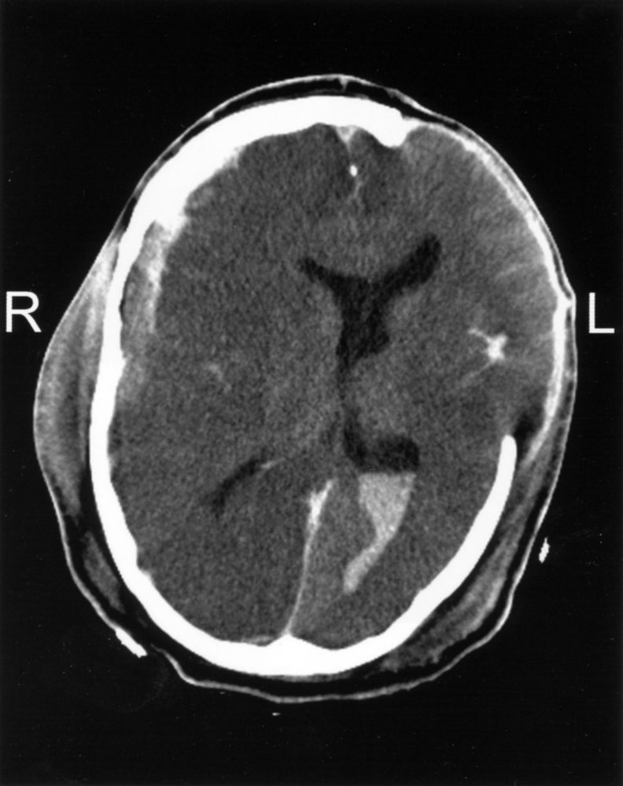

Posttraumatic intracranial hemorrhage

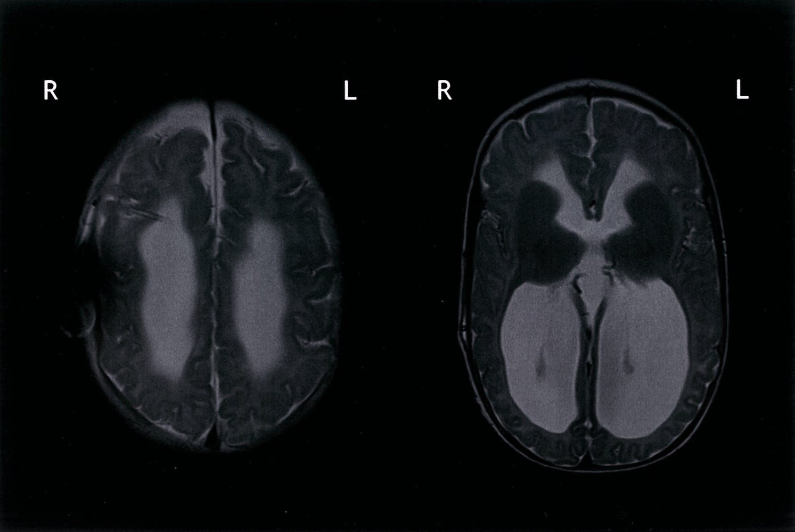

Hydrocephalus with a cerebral shunt in-situ

### Nonsurgical therapy for refractory <u>intracranial hypertension</u> [[23]](https://coursology-qbank.com/amboss/article/5CXisZ0)

#### Controlled <u>hyperventilation</u>

<u>Hyperventilation</u> is primarily used as a temporizing measure for <u>intracranial hypertension</u> refractory to medical therapy.  [[21]](https://coursology-qbank.com/amboss/article/WCXPIZ0)

* Indications [[39]](https://coursology-qbank.com/amboss/article/DBY117)

* Bridge to surgical therapy for expanding lesions (e.g., <u>intracranial hemorrhages</u>)

* Treatment of life-threatening <u>elevated ICP</u> pending investigation results and onset of action of medical therapy (e.g., hyperosmolar therapy)

* Therapeutic targets

* First 30 minutes: <u>PaCO₂</u> 30–35 mm Hg  [[39]](https://coursology-qbank.com/amboss/article/DBY117)

* After 30 minutes: <u>normocapnia</u>, i.e., <u>PaCO₂</u> 35–45 mm Hg (see “<u>Ventilation strategy for elevated ICP</u>”)

> [!WARNING]
> Controlled <u>hyperventilation</u> should only be used short-term and is not recommended routinely or for prophylaxis. Avoid excessive hyperventilation (< 30 mm Hg), prolonged hyperventilation, and <u>hypoventilation</u> of any kind, as <u>CBF</u> and <u>perfusion</u> may become compromised.

#### Advanced therapies

These are primarily reserved for patients with persistently refractory <u>intracranial hypertension</u>.

* <u>Barbiturate</u> <u>coma</u>: e.g., <u>pentobarbital</u> (<u>off-label</u>, not routinely recommended)  [[18]](https://coursology-qbank.com/amboss/article/aabQQH)[[40]](https://coursology-qbank.com/amboss/article/gabFPH)[[41]](https://coursology-qbank.com/amboss/article/WabPjH)

* Not recommended in patients with large hemispheric <u>stroke</u> [[24]](https://coursology-qbank.com/amboss/article/iabJ4H)

* Adverse effects: e.g., <u>hypotension</u>, <u>hypokalemia</u>, infection, <u>multiorgan dysfunction</u>  [[18]](https://coursology-qbank.com/amboss/article/aabQQH)

* <u>Therapeutic hypothermia</u>: highly controversial  [[14]](https://coursology-qbank.com/amboss/article/JabslH)[[42]](https://coursology-qbank.com/amboss/article/-ZbDVH)[[43]](https://coursology-qbank.com/amboss/article/Z0bZeH)[[44]](https://coursology-qbank.com/amboss/article/00beeH)[[45]](https://coursology-qbank.com/amboss/article/KabUlH)[[46]](https://coursology-qbank.com/amboss/article/6abjlH)[[47]](https://coursology-qbank.com/amboss/article/pabLlH)

* No benefit has been observed when used prophylactically [[14]](https://coursology-qbank.com/amboss/article/JabslH)

* Not recommended in <u>TBI</u>  [[12]](https://coursology-qbank.com/amboss/article/CZbqdH)[[43]](https://coursology-qbank.com/amboss/article/Z0bZeH)

---

## Complications

* <u>Irreversible loss of brain function</u> (<u>brain death</u>)

### Cerebral edema

* Definition: excess accumulation of fluid within the <u>brain</u> <u>parenchyma</u> as a result of damage to the <u>blood-brain</u> barrier and/or the <u>blood-CSF</u> barrier [[48]](https://coursology-qbank.com/amboss/article/5D0iUR)

| Overview of <u>cerebral edema</u> subtypes |  |  |  |  |
| --- | --- | --- | --- | --- |
| Characteristics | Vasogenic | Cytotoxic | <u>Interstitial</u> | Osmotic |
| Pathophysiology |  * Breakdown of tight <u>endothelial</u> junctions → impaired <u>capillary</u> permeability → extracellular accumulation of fluids   |  * Damage to <u>brain</u> <u>parenchyma</u> cells (e.g., due to <u>hypoxia</u>) → impaired <u>Na+/K+-ATPase</u> function → <u>intracellular accumulation</u> of Na+ and fluids → expansion of <u>neurons</u>, glial, and <u>endothelial</u> cells   |  * Blocked <u>CSF</u> drainage → ↑ ventricular pressure → <u>CSF</u> forced across the ependymal tissue and into the <u>brain</u> <u>parenchyma</u> → <u>interstitial</u> fluid accumulation   |  * Lower plasma <u>osmolarity</u> than intracerebral <u>osmolarity</u> → osmotic gradient → water <u>diffusion</u> across <u>BBB</u> into <u>interstitial</u> fluid   |
| Etiology |   * <u>Ischemic stroke</u> (late stages) [[49]](https://coursology-qbank.com/amboss/article/nl17xS0)  * Space-occupying lesions (e.g., <u>brain tumors</u>, <u>intracranial hemorrhage</u>, <u>abscess</u>)  * <u>Traumatic brain injury</u> (early stages) [[50]](https://coursology-qbank.com/amboss/article/Ml1MxS0)  * Inflammatory (e.g., <u>encephalitis</u>)  * Toxic (e.g., <u>lead poisoning</u>) [[51]](https://coursology-qbank.com/amboss/article/UqabBl)  * <u>High-altitude cerebral edema</u>    |   * <u>Ischemic stroke</u> (early stages) [[49]](https://coursology-qbank.com/amboss/article/nl17xS0)  * <u>Hyperammonemia</u> (e.g., due to <u>acute liver failure</u>)  * <u>Traumatic brain injury</u> (late stages) [[50]](https://coursology-qbank.com/amboss/article/Ml1MxS0)    |   * <u>Hydrocephalus</u>  * <u>Idiopathic intracranial hypertension</u>    |   * <u>Hyponatremia</u> (e.g., due to <u>SIADH</u>) [[52]](https://coursology-qbank.com/amboss/article/Ll1wxS0)  * <u>Iatrogenic</u> (e.g., due to rapid correction of <u>hyperglycemia</u> in <u>DKA</u> or rapid correction of <u>hypernatremia</u>)    |
| <u>BBB</u> integrity |  * Breakdown   |  * Intact   |  |  |
| Management |  * Treatment of underlying causes and <u>elevated ICP</u>, if present (see also “<u>Management of elevated ICP</u>”).   |  |  |  |

Interconnection of brainstem reflexes

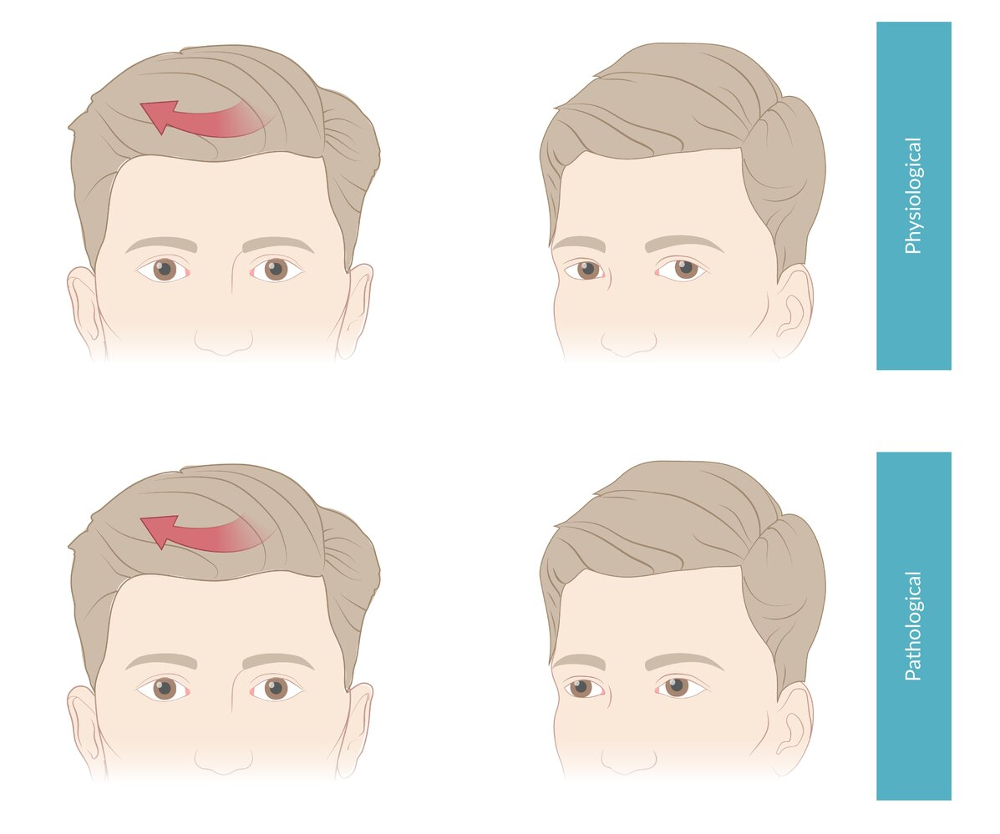

Testing the vestibuloocular reflex with oculocephalic maneuver

Absent Vestibuloocular Reflex

We list the most important complications. The selection is not exhaustive.

---