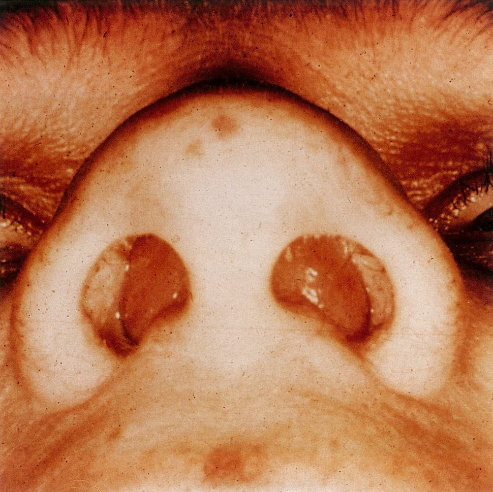

# Facial fractures

*Categories: Clinical knowledge > Surgery > Trauma and orthopedic surgery > General trauma > Facial fractures*

[Original Article Link](https://coursology-qbank.com/amboss/article/Ct0qf3)

---

## Summary

Facial <u>fractures</u> include <u>fractures</u> of the forehead, <u>orbits</u>, midface, and <u>mandible</u>. They are typically caused by high-energy <u>blunt trauma</u> related to sports, violent altercations, <u>motor vehicle collisions</u>, or falls. Facial <u>fractures</u> may be simple, involving a single bone (e.g., <u>nasal bone fracture</u>, <u>zygomatic arch fractures</u>), or complex, involving more than one bone (e.g., <u>Le Fort fractures</u>, <u>zygomaticomaxillary complex fractures</u>). Facial <u>fractures</u> can be further classified based on the number of <u>fracture</u> lines (simple or <u>comminuted fractures</u>), displacement, and <u>soft tissue</u> involvement (<u>open fractures</u> or <u>closed fractures</u>). Clinical features vary depending on the bones involved but usually include facial <u>pain</u>, <u>bruising</u>, palpable step-off, and mobile bone fragments. Initial <u>management of facial fractures</u> focuses on identifying and addressing life-threatening injuries. Complications of facial <u>fractures</u> include nasal and/or oropharyngeal bleeding, <u>traumatic eye injury</u>, <u>cranial nerve</u> deficits, <u>traumatic brain injury</u> (<u>TBI</u>), <u>CSF</u> leakage, sinus wall breach, <u>dental injury</u>, and facial disfiguration. <u>Expectant management</u> may be sufficient for simple <u>fractures</u> but <u>surgery</u> may be necessary for <u>unstable fractures</u> and <u>fractures</u> with associated complications.

For details on forehead and <u>frontal bone</u> <u>fractures</u>, see “<u>Skull fractures</u>.”

For details on <u>orbital fractures</u>, see “<u>Traumatic eye injuries</u>.”

---

## Nasal bone fracture

### <u>Epidemiology</u> [[13]](https://coursology-qbank.com/amboss/article/W0cPUa0)

* Most common type of facial bone <u>fracture</u>

* Adults: 5% of all facial <u>fractures</u> [[14]](https://coursology-qbank.com/amboss/article/vFcAPV0)

* <u>Infants</u>: 16% of all facial <u>fractures</u> [[14]](https://coursology-qbank.com/amboss/article/vFcAPV0)

### Etiology [[14]](https://coursology-qbank.com/amboss/article/vFcAPV0)

* <u>Motor vehicle crashes</u>

* Physical violence (e.g., punches, elbowing)

* Sports-related injuries (e.g., soccer, basketball)

### Clinical features [[15]](https://coursology-qbank.com/amboss/article/d0coUa0)

See also “Classification” and “Clinical features” in “<u>Midfacial fractures</u>” for complex facial <u>fractures</u> involving the <u>nasal bones</u>.

* <u>Epistaxis</u>

* Swelling, <u>ecchymosis</u>, and/or tenderness of the nasal bridge

* <u>Crepitus</u> upon palpation

* Nasal deformity

> [!WARNING]
> The inability to breathe through one or both nares indicates nasal <u>airway obstruction</u>. [[2]](https://coursology-qbank.com/amboss/article/AN1Rdh0)

### Diagnostics [[13]](https://coursology-qbank.com/amboss/article/W0cPUa0)[[15]](https://coursology-qbank.com/amboss/article/d0coUa0)

See also “<u>Diagnosis of facial fractures</u>.”

* <u>Physical examination</u>

* External examination

* Inspect all facial bony structures.

* Evaluate for <u>epistaxis</u>, <u>CSF rhinorrhea</u>, <u>airway obstruction</u>, and septal <u>hematoma</u> or deviation.

* Internal examination (after swelling has resolved)

* CT head and/or <u>high-resolution CT</u> face [[2]](https://coursology-qbank.com/amboss/article/AN1Rdh0)[[13]](https://coursology-qbank.com/amboss/article/W0cPUa0)

* Not indicated for isolated, uncomplicated <u>nasal fractures</u>

* Indicated if other facial <u>fractures</u> and/or <u>skull fractures</u> are suspected and prior to surgical reduction

> [!WARNING]
> Some abnormalities may not be immediately apparent. Patients with uncomplicated isolated nasal injury should be reevaluated 3–5 days after the injury once the swelling has subsided. [[2]](https://coursology-qbank.com/amboss/article/AN1Rdh0)

### Treatment [[13]](https://coursology-qbank.com/amboss/article/W0cPUa0)[[15]](https://coursology-qbank.com/amboss/article/d0coUa0)

#### Initial management

See also “<u>Approach to management of facial fractures</u>” for patients with nonisolated nasal injury or <u>multiple trauma</u>.

* Head elevation

* <u>Pain management</u>

* Ice packs

* <u>Epistaxis control</u> with compression or, if necessary, <u>anterior</u> packing

> [!WARNING]
> Obtain urgent specialist consult for patients with <u>nasal septal hematoma</u>, <u>CSF rhinorrhea</u>, and/or abnormal <u>extraocular movement examination</u>.

#### Definitive treatment

* <u>Conservative management</u>: uncomplicated <u>nasal fractures</u>

* Nondisplaced <u>nasal fractures</u>: no further treatment

* Displaced <u>nasal fractures</u>: <u>closed reduction</u> and <u>external fixation</u> with a nasal <u>splint</u>

* Indication: isolated, uncomplicated <u>nasal fractures</u> with nonsevere displacement

* Timing: 5–10 days after injury

* Operative management: complicated <u>nasal fractures</u>

* <u>Fractures</u> with severe displacement

* Acute <u>saddle nose deformity</u>

* <u>Nasal septal hematoma</u> or <u>airway obstruction</u>

* <u>Open fractures</u>

> [!TIP]
> Patients with isolated nasal injury, no septal <u>hematoma</u> or nasal <u>airway obstruction</u>, and controlled <u>epistaxis</u> may be discharged with close otolaryngology or plastic <u>surgery</u> follow-up after 3–5 days.

### Complications

#### Nasal septal hematoma [[13]](https://coursology-qbank.com/amboss/article/W0cPUa0)[[15]](https://coursology-qbank.com/amboss/article/d0coUa0)

* Definition: a collection of blood around the nasal septal bone or <u>cartilage</u> with intact nasal <u>mucosa</u>

* Etiology: nasal or facial trauma

* Clinical features

* Unilateral or bilateral obstruction of the nasal lumen with blood-filled <u>mucosa</u>

* Absence of overt bleeding (due to intact nasal <u>mucosa</u>)

* Diagnostics: rhinoscopy showing unilateral or bilateral balloon-like bloody protrusion

* Treatment: immediate surgical drainage

* Complications

* Infection

* Septal perforation

* Nasal deformities

> [!WARNING]
> Undiagnosed or improperly managed <u>nasal septal hematomas</u> may have severe consequences, such as infection, <u>nasal septal perforation</u>, and <u>saddle nose deformity</u>.

Hematoma of the nasal septum

#### Other

* <u>Nasal septal perforation</u> secondary to <u>nasal septal hematoma</u>

* <u>Saddle nose deformity</u>

* <u>Deviated nasal septum</u>

* Nasal ventilation problems and snoring

---