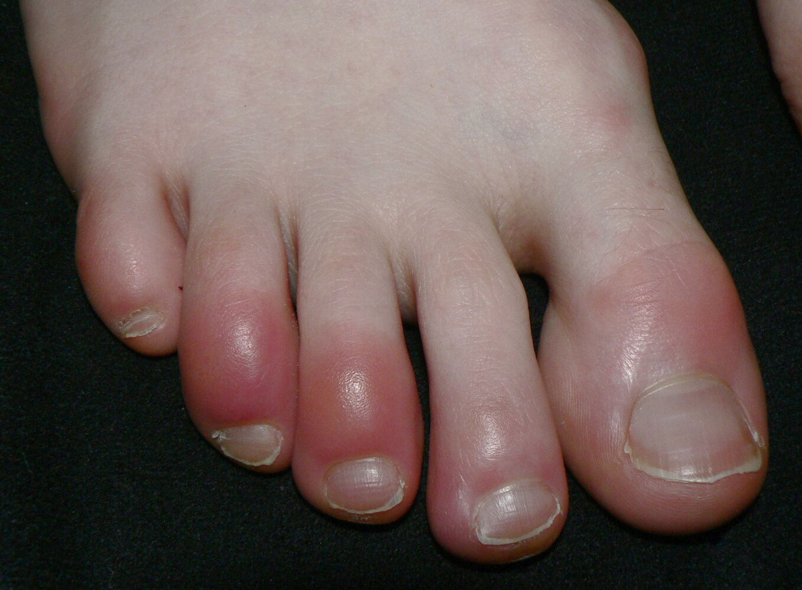
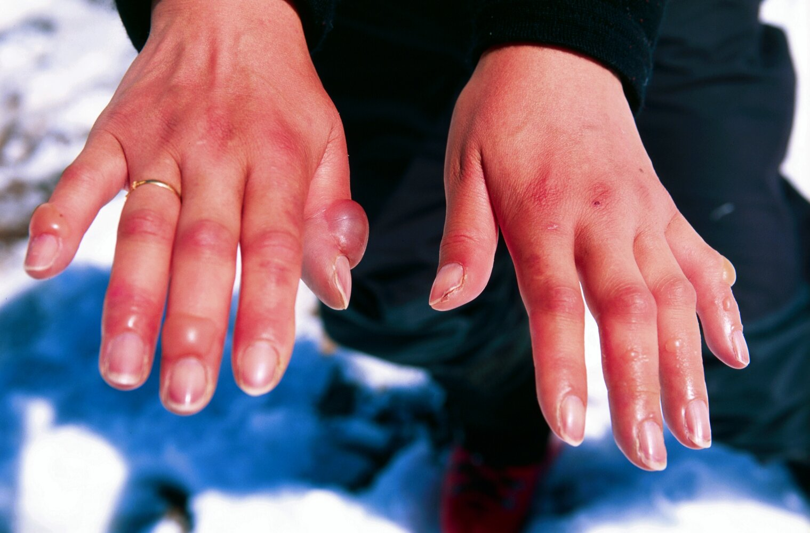
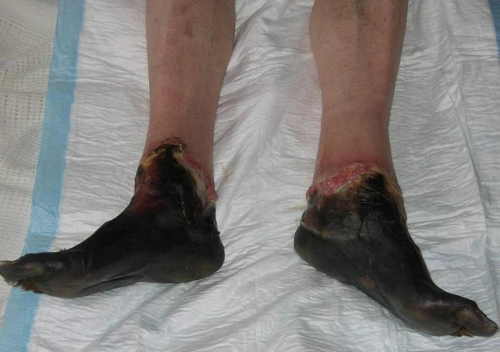
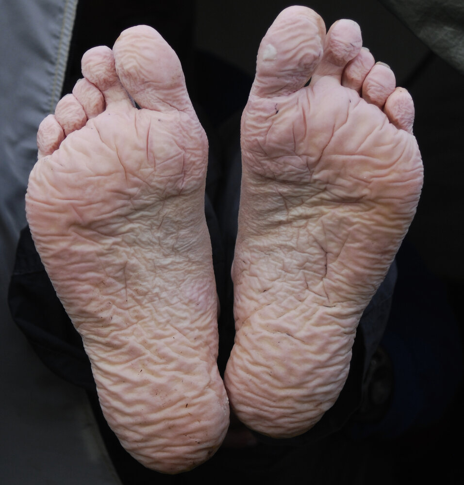

# Hypothermia and frostbite

*Categories: Clinical knowledge > Surgery > Trauma and orthopedic surgery > General trauma > Hypothermia and frostbite*

[Original Article Link](https://coursology-qbank.com/amboss/article/vL0Azg)

---

## Summary

<u>Hypothermia</u> is defined as a drop in core body temperature below 35°C. Impaired <u>thermoregulation</u>, decreased <u>heat production</u>, and increased <u>heat loss</u> can contribute to accidental <u>hypothermia</u>. <u>Hypothermia</u> is classified as mild, moderate, or severe based on core body temperature and clinical features, which range from shivering to progressive <u>bradycardia</u>, <u>coma</u>, and circulatory collapse. During the diagnostic assessment, the patient's core body temperature should be determined first, followed by an <u>ECG</u>. Further testing assesses for comorbidities and complications. Treatment involves rewarming and <u>supportive care</u>. <u>Cardiac arrhythmias</u> are the most common <u>cause of death</u> in <u>hypothermia</u>. <u>Frostbite</u> is a tissue injury that can occur after exposure to <u>freezing</u> temperatures and typically affects the face, <u>ears</u>, fingers, and/or toes; <u>frostbite</u> can occur with or without <u>hypothermia</u>. <u>Mild frostbite</u> is reversible, while severe cases may require <u>amputation</u>. <u>Nonfreezing cold injuries</u> are typically less severe and include <u>immersion injuries</u>, <u>panniculitis</u>, <u>cold urticaria</u>, and <u>pernio</u>. Preventive measures include avoiding cold temperatures, wearing layers, keeping <u>skin</u> dry, and rewarming quickly if numbness or <u>pain</u> develops in the extremities.

See “<u>Targeted temperature management</u>” for details about <u>therapeutic hypothermia</u>.

---

## Pathophysiology

* The body loses heat through radiation (most significant means of <u>heat loss</u>), evaporation, convection, and conduction.

* The <u>hypothalamus</u> attempts to maintain a temperature of approximately 36.5–37.5 °C by:

* Conserving heat (peripheral <u>vasoconstriction</u> – direct and <u>sympathetic</u>)

* Cold-induced <u>thermogenesis</u> (increasing <u>heat production</u>)

* Shivering <u>thermogenesis</u>

* Involuntary, rapid <u>oscillations</u> of <u>skeletal muscles</u> that use <u>ATP</u> and generate heat

* Shivering can increase <u>heat production</u> by up to 400%

* Primary means of maintaining core body temperature in cold environments

* Does not occur in <u>infants</u> (due to <u>skeletal muscle</u> immaturity)

* Cannot be sustained indefinitely due to discomfort and fatigue

* <u>Non-shivering thermogenesis</u>

* Increased <u>heat production</u> by <u>brown adipose tissue</u>

* Increases <u>heat production</u> by 10–30% following acute cold exposure

* Important for cold <u>acclimation</u> following sustained cold exposure

* Primary means of maintaining core body temperature among <u>infants</u>

* <u>Hypothermia</u> affects all organ systems

* General tissue oxygen demand decreases by ∼ 6% per degree Celsius below 35°C

* Weakened cellular <u>immune response</u>

* Cardiovascular effects: ↓ <u>depolarization</u> of cardiac cells → ↓ cardiac output and ↓ mean arterial pressure

* <u>CNS</u> effects: ↓ <u>CNS</u> metabolism

References:[[2]](https://coursology-qbank.com/amboss/article/caYajn)[[3]](https://coursology-qbank.com/amboss/article/1aY2jn)

---

## Hypothermia

### Definition [[4]](https://coursology-qbank.com/amboss/article/EU18UT0)

Accidental <u>hypothermia</u>: an involuntary drop in core body temperature < 35°C

### Clinical features of hypothermia [[5]](https://coursology-qbank.com/amboss/article/AN1Rdh0)[[6]](https://coursology-qbank.com/amboss/article/jU1_1T0)

Clinical findings, including <u>level of consciousness</u>, correlate with core body temperature, and together can be used to define stages of hypothermia.  [[7]](https://coursology-qbank.com/amboss/article/M1VMht0)[[8]](https://coursology-qbank.com/amboss/article/iU1J1T0)[[9]](https://coursology-qbank.com/amboss/article/ogV0wF0)

#### Mild hypothermia (89.6–95.0 °F)

* Alert, impaired judgment

* <u>Amnesia</u>, <u>dysarthria</u>, <u>ataxia</u>

* <u>Tachycardia</u>, <u>tachypnea</u>

* Shivering

* <u>Bleeding diathesis</u>

#### Moderate hypothermia (82.4–89.6 °F)

* Worsening <u>CNS depression</u> (e.g., <u>lethargy</u>, <u>stupor</u>)

* <u>Hypoventilation</u>

* <u>Bradycardia</u>, <u>cardiac arrhythmias</u>

* <u>Hyporeflexia</u>

* <u>Dilated pupils</u>

* Loss of shivering typically occurs  [[6]](https://coursology-qbank.com/amboss/article/jU1_1T0)

* Cold diuresis: Peripheral <u>vasoconstriction</u> in <u>hypothermia</u> increases central and <u>renal blood flow</u>, which causes <u>antidiuretic hormone</u> suppression, resulting in diluted urine.

* Paradoxical undressing: the abnormal removal of clothing by patients despite low ambient temperature

* <u>Ileus</u>, <u>pancreatitis</u>

> [!WARNING]
> The presence or absence of shivering does not accurately reflect the <u>stage of hypothermia</u>.

#### Severe hypothermia (< 28°C)

* <u>Coma</u>, areflexia

* Fixed and <u>dilated pupils</u>

* <u>Ventricular fibrillation</u>

* <u>Hypotension</u>

* <u>Pulmonary edema</u>, <u>apnea</u>

* <u>Oliguria</u> [[10]](https://coursology-qbank.com/amboss/article/LS1wZg0)

* Rigidity (pseudo-<u>rigor mortis</u>)

* Pulselessness  [[11]](https://coursology-qbank.com/amboss/article/KnbU88)

### Diagnostics [[5]](https://coursology-qbank.com/amboss/article/AN1Rdh0)[[11]](https://coursology-qbank.com/amboss/article/KnbU88)

#### Approach

* All patients: Measure core temperature and determine the <u>stage of hypothermia</u>. [[6]](https://coursology-qbank.com/amboss/article/jU1_1T0)

* First-line: esophageal temperature probe

* Second-line: rectal or <u>bladder</u> thermometer

* Avoid tympanic or oral thermometers, as they do not reflect core temperature.

* Moderate or <u>severe hypothermia</u>

* Obtain routine diagnostics, including <u>ECG</u>, routine <u>laboratory studies</u>, and <u>CXR</u>.

* Consider additional diagnostics (e.g., serum toxicology, <u>blood cultures</u>) if <u>level of consciousness</u> is inconsistent with core temperature.

* <u>Trauma patients</u>: Obtain imaging to evaluate concomitant injuries.

> [!TIP]
> Consider alternate diagnoses (e.g., <u>sepsis</u> or <u>stroke</u>) if the clinical features are inconsistent with the body temperature (e.g., <u>coma</u> at a core temperature of 32°C).

#### <u>ECG</u>  [[12]](https://coursology-qbank.com/amboss/article/GU1BeT0)

* Indication: best initial test to monitor for <u>arrhythmias</u>

* ECG findings in hypothermia

* <u>Heart blocks</u> and <u>dysrhythmias</u>: variable; depends on core temperature

* <u>J wave</u> (<u>Osborn wave</u>): elevated <u>J point</u>   [[5]](https://coursology-qbank.com/amboss/article/AN1Rdh0)[[11]](https://coursology-qbank.com/amboss/article/KnbU88)

* Prolongation of all <u>ECG</u> intervals

Osborne waves (J waves) in hypothermia

#### Routine <u>laboratory studies</u> [[5]](https://coursology-qbank.com/amboss/article/AN1Rdh0)[[11]](https://coursology-qbank.com/amboss/article/KnbU88)[[13]](https://coursology-qbank.com/amboss/article/PU1WWT0)

Obtain basic <u>laboratory studies</u> to rule out complications and guide resuscitation. Typical findings include:

* <u>CBC</u>

* ↑ <u>Hematocrit</u> due to <u>hemoconcentration</u>

* ↓ <u>WBC</u> and <u>platelets</u> secondary to sequestration

* <u>CMP</u>

* Variable <u>electrolyte</u> disturbances, e.g., ↑ <u>K+</u>

* <u>Hyperglycemia</u>  that progresses to <u>hypoglycemia</u>

* <u>ABG</u>: initial <u>respiratory alkalosis</u> followed by mixed <u>acidosis</u>

* <u>Coagulation studies</u>: may be normal despite clinically apparent <u>coagulopathy</u> [[14]](https://coursology-qbank.com/amboss/article/tU1XUT0)[[15]](https://coursology-qbank.com/amboss/article/vU1AUT0)

* <u>Lipase</u>: may be increased as a result of <u>ischemic</u> <u>pancreatitis</u>

* Serum <u>creatine kinase</u>: may be elevated secondary to <u>rhabdomyolysis</u>

> [!TIP]
> Use clinical findings to guide management, as cold and/or rewarmed blood samples may yield inaccurate results (e.g., due to <u>hemolysis</u>). [[11]](https://coursology-qbank.com/amboss/article/KnbU88)

> [!WARNING]
> The lethal triad of <u>hypothermia</u>, <u>acidosis</u>, and <u>coagulopathy</u> is associated with poor outcomes in patients with cold exposure and severe trauma. [[14]](https://coursology-qbank.com/amboss/article/tU1XUT0)

#### Additional <u>laboratory studies</u> [[5]](https://coursology-qbank.com/amboss/article/AN1Rdh0)

Consider the following to identify underlying etiologies or differential diagnoses:

* Serum ethanol and urine toxicology: to assess for intoxication

* <u>Blood cultures</u>: for patients with suspected <u>sepsis</u>

* <u>TFT</u>: to exclude <u>hypothyroidism</u> and <u>myxedema coma</u>

* Serum <u>cortisol</u> level: to assess for <u>adrenal insufficiency</u>  [[1]](https://coursology-qbank.com/amboss/article/OU1IWT0)

* <u>Cardiac biomarkers</u>: to exclude <u>myocardial infarction</u>

#### Imaging  [[5]](https://coursology-qbank.com/amboss/article/AN1Rdh0)

* All patients: <u>CXR</u>

* <u>Trauma patients</u>

* <u>FAST scan</u> and CT head

* See also “<u>Urgent diagnostics for trauma patients</u>.”

### Management of hypothermia [[4]](https://coursology-qbank.com/amboss/article/EU18UT0)[[5]](https://coursology-qbank.com/amboss/article/AN1Rdh0)[[6]](https://coursology-qbank.com/amboss/article/jU1_1T0)[[9]](https://coursology-qbank.com/amboss/article/ogV0wF0)

#### Initial resuscitation: <u>ABCDE approach</u>

* Unresponsive patient: Check pulses for 60 seconds; start <u>CPR</u> if pulseless (see “<u>Hypothermic cardiac arrest</u>” for details).

* Intubate early if needed.

* Provide <u>supplemental oxygen</u>.

* Initiate <u>IV fluid resuscitation</u> preferably through 2 large-bore <u>peripheral IVs</u>. 

* Alternative routes: <u>IO access</u> or <u>femoral line</u>

* Use warmed (104–107.6 °F) <u>normal saline</u>.

* <u>Vasopressors</u> may have limited benefit because of <u>vasoconstriction</u> due to <u>hypothermia</u>.

* Remove wet clothing and ensure a warm environment.

* Ensure continuous core temperature monitoring during resuscitation.

* Start <u>rewarming techniques</u> based on <u>hypothermia stage</u>.

* Identify and treat reversible or time-sensitive underlying causes.

Advanced cardiac life support (ACLS)

#### Rewarming techniques [[4]](https://coursology-qbank.com/amboss/article/EU18UT0)[[16]](https://coursology-qbank.com/amboss/article/3U1S1T0)[[17]](https://coursology-qbank.com/amboss/article/35YSPp)

##### Passive rewarming

* Patients with <u>mild hypothermia</u> may only require <u>passive rewarming</u>.

* Insulation (e.g., with blankets) allows patients to retain body heat.

* Active movement can increase heat generation.

##### Active rewarming

* Indications

* Moderate to <u>severe hypothermia</u>

* Cardiovascular instability

* Unsuccessful <u>passive rewarming</u>

* Impaired <u>thermoregulation</u> (e.g., due to <u>stroke</u>, endocrine dysfunction)

* Rate of rewarming

* A rate of 1–2°C/hour (1.8–3.6°F/hour) is thought to be safe in hemodynamically stable patients.

* Patients with cardiovascular instability can be rewarmed more quickly (e.g., <u>extracorporeal blood rewarming</u>).

* <u>Active external rewarming</u>

* Methods include warming blankets, radiant heat, and forced warm air.

* Rewarm the torso (e.g., <u>axillae</u>, chest, back) before the extremities to minimize the risk of <u>afterdrop</u>.

* <u>Active internal rewarming</u>

* Warmed <u>IV fluids</u>  [[4]](https://coursology-qbank.com/amboss/article/EU18UT0)

* Warm humidified air

* Body cavity <u>irrigation</u> with warmed fluid (e.g., <u>peritoneal dialysis</u>, thoracic lavage)

* Extracorporeal blood rewarming [[4]](https://coursology-qbank.com/amboss/article/EU18UT0)[[9]](https://coursology-qbank.com/amboss/article/ogV0wF0)[[11]](https://coursology-qbank.com/amboss/article/KnbU88)

* Indications include:

* <u>Hypothermic cardiac arrest</u>

* <u>Severe hypothermia</u>

* Unsuccessful rewarming with other techniques

* <u>Respiratory failure</u>

* Refractory <u>acidosis</u>

* Options include venovenous rewarming, <u>hemodialysis</u>, and <u>ECLS</u>.

* <u>ECLS</u> rates of rewarming

* Adults: 1.5–5°C/hour (2.7–9°F/hour)

* Children: < 5°C/hour (< 9°F/hour)

> [!TIP]
> If rewarming is unsuccessful, consider the possibility of an underlying infection, endocrine insufficiency, or insufficient resuscitation. [[5]](https://coursology-qbank.com/amboss/article/AN1Rdh0)

#### <u>Supportive care</u> [[5]](https://coursology-qbank.com/amboss/article/AN1Rdh0)[[16]](https://coursology-qbank.com/amboss/article/3U1S1T0)

* Handle patients with <u>severe hypothermia</u> gently to avoid precipitating ventricular arrythmias.

* Identify, treat and prevent disease and treatment complications (see “Complications”).

* Avoid administering medications in patients with <u>severe hypothermia</u>, if feasible.

* Avoid oral and intramuscular routes of administration.

* Identify and treat related trauma and cold injuries; see “<u>Frostbite</u>” and “<u>Management of trauma patients</u>.”

### Complications [[11]](https://coursology-qbank.com/amboss/article/KnbU88)

#### Hypothermic cardiac arrest [[6]](https://coursology-qbank.com/amboss/article/jU1_1T0)[[9]](https://coursology-qbank.com/amboss/article/ogV0wF0)

<u>Hypothermic cardiac arrest</u> is <u>cardiac arrest</u> that occurs after the development of <u>hypothermia</u>. In <u>severe hypothermia</u>, both <u>ventricular fibrillation</u> and <u>asystole</u> can occur spontaneously. Management of <u>hypothermic cardiac arrest</u> is similar for adults and children.

* <u>Vital signs</u> assessment

* Perform in patients without <u>signs of irreversible death</u>.

* Check breathing and <u>central pulse</u> for up to 60 seconds.

* Use <u>handheld Doppler</u> or <u>focused cardiac ultrasound</u> to assess <u>central pulse</u>.

* No signs of life: Start <u>ACLS</u> with the following modifications and continue until fully rewarmed (see “<u>ACLS</u>” for details) 

* Consider using a <u>mechanical CPR device</u> to compensate for <u>chest wall</u> rigidity.

* Consider defibrillating <u>shockable rhythms</u> once and, if unsuccessful, deferring additional <u>defibrillation</u> attempts until core temperature is ≥ 30°C.

* Consider delaying <u>epinephrine</u> until core temperature is ≥ 30°C.

* Prevent further <u>heat loss</u> and initiate <u>active internal rewarming</u>.

* Determine if <u>ECLS</u> is indicated based on local protocols and prognostication scores. 

* <u>ECLS</u>-capable hospital: Consult the <u>ECLS</u> team.

* Non-<u>ECLS</u>-capable hospital: Consider transfer to an <u>ECLS</u>-capable hospital if reachable within 6 hours.

* Address other <u>reversible causes of cardiac arrest</u>.

* Avoid terminating resuscitative efforts based on <u>EtCO2</u> measurements.

* Consider <u>termination of CPR</u> if:

* <u>Obvious signs of irreversible death</u> are present.

* <u>Cardiac arrest</u> was witnessed and happened prior to cooling.

* Serum <u>potassium</u> is > 12 mmol/L.

* There are no signs of <u>return of spontaneous circulation</u> despite <u>normothermia</u>.

> [!TIP]
> Initiate rewarming and do not withhold life-saving treatment from hypothermic patients who appear <u>clinically dead</u> (e.g., <u>dilated pupils</u>, areflexia, rigidity), unless there are <u>signs of irreversible death</u>. [[6]](https://coursology-qbank.com/amboss/article/jU1_1T0)[[9]](https://coursology-qbank.com/amboss/article/ogV0wF0)[[18]](https://coursology-qbank.com/amboss/article/HnXKuA)

> [!WARNING]
> <u>Defibrillation</u> is unlikely to be successful at core temperatures < 30°C. [[6]](https://coursology-qbank.com/amboss/article/jU1_1T0)

#### Other disease complications

* <u>Arrhythmias</u> [[5]](https://coursology-qbank.com/amboss/article/AN1Rdh0)[[6]](https://coursology-qbank.com/amboss/article/jU1_1T0)

* Atrial <u>arrhythmias</u> are expected and typically resolve spontaneously.

* The <u>efficacy</u> of <u>antiarrhythmic medications</u> is limited.

* Ventricular <u>dysrhythmias</u>: Treat as <u>hypothermic cardiac arrest</u>.

* <u>Coagulopathy</u>: improves with rewarming; do not administer clotting products  [[14]](https://coursology-qbank.com/amboss/article/tU1XUT0)[[15]](https://coursology-qbank.com/amboss/article/vU1AUT0)

> [!WARNING]
> Patients with moderate to <u>severe hypothermia</u> may have <u>arrhythmias</u> that are unresponsive to <u>defibrillation</u>. Continue <u>CPR</u> and consider delaying further <u>defibrillation</u> until the patient's core body temperature is > 30°C. [[6]](https://coursology-qbank.com/amboss/article/jU1_1T0)[[15]](https://coursology-qbank.com/amboss/article/vU1AUT0)

#### Treatment complications

* During resuscitation

* Afterdrop: influx of cold, acidemic blood to the <u>heart</u> following increased peripheral <u>perfusion</u>  [[6]](https://coursology-qbank.com/amboss/article/jU1_1T0)

* Prolonged <u>hypotension</u>

* <u>Dysrhythmias</u>

* After rewarming

* <u>Pulmonary edema</u>, <u>pneumonia</u>

* <u>Seizure disorders</u>, neuropathy, impaired <u>cognition</u>

* <u>Multiple organ failure</u>

* Related to <u>ECLS</u>: hemorrhage, vessel injury, <u>distal</u> limb <u>ischemia</u>

> [!WARNING]
> To prevent <u>afterdrop</u>, avoid jostling patients during transport and rewarming the extremities before the core; <u>afterdrop</u> may exacerbate <u>hypothermia</u> and cause <u>arrhythmias</u>. [[5]](https://coursology-qbank.com/amboss/article/AN1Rdh0)

### Disposition

* <u>Hemodynamic instability</u> or <u>cardiac arrest</u>: consider transfer to an <u>ECLS</u>-capable hospital if reachable within 6 hours

* Moderate to <u>severe hypothermia</u>: consider <u>ICU</u> admission

* <u>Mild hypothermia</u>: may be discharged after rewarming if otherwise healthy

---

## Frostbite

### Definition

Severe localized tissue injury;  due to <u>freezing</u> of <u>interstitial</u> and cellular spaces after prolonged exposure to very cold temperatures

### Clinical features [[1]](https://coursology-qbank.com/amboss/article/OU1IWT0)[[16]](https://coursology-qbank.com/amboss/article/3U1S1T0)[[17]](https://coursology-qbank.com/amboss/article/35YSPp)

#### General features

* <u>Frostbite</u> can occur with or without <u>hypothermia</u>.

* Areas most frequently affected

* Face (nose, cheeks, chin)

* <u>Ears</u>

* Fingers and toes

* Initial <u>paresthesia</u> is followed by numbness of the affected region.

#### Features by stage

* <u>Frostbite</u> is classically staged by degree of injury, similar to <u>burns</u>, but this can be difficult to assess prior to thawing.

* The simplified staging is easier to apply clinically.

|  Clinical features and stages of <u>frostbite</u> [[16]](https://coursology-qbank.com/amboss/article/3U1S1T0)  |  |  |  |
| --- | --- | --- | --- |
| Stage |  | Clinical features | Tissue loss |
| Simplified | Classic |  |  |
|  <u>Superficial</u> or mild frostbite   | 1st degree |   * <u>Erythema</u>, progressing to pale, waxy <u>skin</u>  * Mild <u>edema</u>  * Numbness    |  * Typically none or minimal   |
| 2nd degree |   * Clear fluid-filled <u>blisters</u>  * <u>Erythema</u> and <u>edema</u>    |  |  |
|  Deep or severe frostbite   | 3rd degree |  * Hemorrhagic <u>blisters</u>   |  * Significant   |
| 4th degree |  * Tissue <u>necrosis</u> extending into the muscle, down to the bone   |  |  |

> [!TIP]
> The extent of tissue injury from <u>frostbite</u> is challenging to define initially. Accurate prognosis requires careful observation and may only be possible weeks to months after thawing. [[17]](https://coursology-qbank.com/amboss/article/35YSPp)

Perniosis (chilblains)

Frostbite with blistering

Severe frostbite

### Diagnostics [[16]](https://coursology-qbank.com/amboss/article/3U1S1T0)[[17]](https://coursology-qbank.com/amboss/article/35YSPp)

#### General principles

* <u>Frostbite</u> is a <u>clinical diagnosis</u>.

* Measure core temperature in all patients to rule out <u>hypothermia</u>.

* Consider imaging to evaluate for injury and determine tissue viability.

* Consider additional diagnostics for patients with concurrent <u>hypothermia</u> or other injuries.

> [!TIP]
> Perform a <u>pulse examination</u> in all patients to assess for an underlying vascular cause (e.g., <u>acute limb ischemia</u>, vascular injury).

#### Imaging

* Imaging has a limited role in an emergency setting.

* In all patients, consider obtaining an <u>x-ray</u> of the affected area.

* <u>Angiography</u> or <u>scintigraphy</u> is indicated in <u>severe frostbite</u> if <u>thrombolytic therapy</u> is planned.

* For <u>trauma patients</u>, see also “<u>Urgent diagnostics for trauma patients</u>.”

* <u>Single-photon emission CT</u>, <u>magnetic resonance angiography</u>, or <u>scintigraphy</u> may be performed to predict tissue viability 4–24 hours after thawing. [[16]](https://coursology-qbank.com/amboss/article/3U1S1T0)

### Management [[16]](https://coursology-qbank.com/amboss/article/3U1S1T0)[[19]](https://coursology-qbank.com/amboss/article/lU1vWT0)

#### Initial management

* Remove any wet clothing and jewelry.

* Ensure that the patient is in a warm environment.

* <u>Treat hypothermia</u> first, if present (e.g., cover with blankets)

* Rapid rewarming: Immerse the affected extremity in a warm (98.6–102.2 °F) circulating water bath.  [[17]](https://coursology-qbank.com/amboss/article/35YSPp)

> [!TIP]
> Refreezing thawed tissue damages it further. If there is a risk of disruption to the thawing process, delay rewarming and keep frostbitten areas dry and insulated. [[17]](https://coursology-qbank.com/amboss/article/35YSPp)

> [!WARNING]
> Prioritize <u>management of hypothermia</u> occurring concurrently with <u>frostbite</u>, as it is both common and life-threatening.

#### Pharmacotherapy

* <u>NSAIDs</u>: for all patients, typically <u>ibuprofen</u> DOSAGE  [[16]](https://coursology-qbank.com/amboss/article/3U1S1T0)

* Intraarterial <u>thrombolytic therapy</u>: for <u>severe frostbite</u>  [[5]](https://coursology-qbank.com/amboss/article/AN1Rdh0)[[20]](https://coursology-qbank.com/amboss/article/DU112T0)

#### <u>Wound care</u>

* Do not debride hemorrhagic <u>vesicles</u>.

* Change dressings every 6 hours.  [[17]](https://coursology-qbank.com/amboss/article/35YSPp)

* Drape sterile gauze loosely around thawed areas.  [[16]](https://coursology-qbank.com/amboss/article/3U1S1T0)[[19]](https://coursology-qbank.com/amboss/article/lU1vWT0)

* Elevate the affected limb to decrease <u>edema</u>.

* Give <u>antibiotics</u> to patients with severe trauma, <u>cellulitis</u>, or <u>signs of sepsis</u>; see “<u>Antibiotics for acute open wounds</u>.” [[16]](https://coursology-qbank.com/amboss/article/3U1S1T0)

* Ensure proper documentation of findings, e.g., with admission photographs.

#### Supportive therapy

* <u>IV fluid resuscitation</u> with warm (104–107.6 °F) <u>normal saline</u>  [[17]](https://coursology-qbank.com/amboss/article/35YSPp)

* <u>Analgesia</u>: <u>Opiates</u> may be needed, as rewarming can be excruciatingly painful.

* <u>Tetanus prophylaxis</u>: depending on the patient's <u>immunization</u> status and degree of wound contamination

#### Disposition [[1]](https://coursology-qbank.com/amboss/article/OU1IWT0)[[16]](https://coursology-qbank.com/amboss/article/3U1S1T0)[[17]](https://coursology-qbank.com/amboss/article/35YSPp)

* Consult <u>surgery</u> for all patients with <u>severe frostbite</u>.

* Urgent indications include <u>signs of sepsis</u> and <u>acute compartment syndrome</u>.

* In patients without <u>sepsis</u>, <u>amputation</u> is reserved until <u>necrotic</u> tissue is well demarcated.

* Admit patients with <u>deep frostbite</u> for inpatient management.

* Ensure that patients who are discharged have a warm environment to return to.

> [!TIP]
> Tissue demarcation (e.g., to guide the need for <u>amputation</u>) may only occur 1–3 months after the <u>frostbite</u> injury. [[16]](https://coursology-qbank.com/amboss/article/3U1S1T0)

### Complications [[11]](https://coursology-qbank.com/amboss/article/KnbU88)

* Loss of sensation

* Cold hypersensitivity

* <u>Chronic pain</u>

* Loss of limb or digits

---

## Nonfreezing cold injuries

### Immersion injury (<u>trench foot</u>)  [[17]](https://coursology-qbank.com/amboss/article/35YSPp)[[21]](https://coursology-qbank.com/amboss/article/4U13WT0)[[22]](https://coursology-qbank.com/amboss/article/kU1mWT0)

<u>Ischemic</u> and neuropathic damage to the feet due to prolonged exposure to nonfreezing wet conditions

#### <u>Risk factors</u>

* Homelessness

* Substance use

* Participation in military operations or recreational activities in cold, wet environments

#### Clinical features

* Stage 1 (cold exposure): numbness, initial <u>erythema</u> followed by <u>pallor</u>

* Stage 2 (postexposure): numbness, mottled <u>skin</u>, weak pulses

* Stage 3 (<u>hyperemic</u> phase): <u>hyperalgesia</u>, <u>erythema</u>, <u>edema</u>

* Stage 4 (posthyperemic phase): cold <u>sensitivity</u>, <u>chronic pain</u>, <u>hyperhidrosis</u>

* Tissue <u>necrosis</u>: rare; commonly associated with pressure <u>necrosis</u>

Nonfreezing cold injury (immersion foot, trench foot)

#### Management

* <u>Manage hypothermia</u>, if present.

* Allow the affected limb to air dry and gradually rewarm at room temperature.

* Provide <u>analgesia</u> as needed and elevate the affected limb.  [[1]](https://coursology-qbank.com/amboss/article/OU1IWT0)[[21]](https://coursology-qbank.com/amboss/article/4U13WT0)

* Consider a <u>podiatric</u> or surgical consult if there is evidence of tissue <u>necrosis</u>.

#### Disposition

* Admission is commonly necessary for <u>analgesia</u> administration.

* Discharge considerations

* Ensure that patients can return to a warm and dry environment.

* Consider early involvement of social care.

> [!TIP]
> Unlike in <u>frostbite</u> injury, rapid rewarming should not be used for an <u>immersion injury</u>, as this can exacerbate the injury. [[1]](https://coursology-qbank.com/amboss/article/OU1IWT0)[[21]](https://coursology-qbank.com/amboss/article/4U13WT0)

### Perniosis (chillblains) [[23]](https://coursology-qbank.com/amboss/article/2X1Tx20)[[24]](https://coursology-qbank.com/amboss/article/hX1cB20)[[25]](https://coursology-qbank.com/amboss/article/XNc9-c0)

A seasonal condition characterized by the inflammation of <u>small blood vessels</u>; triggered by an abnormal reaction to cold and humid conditions

#### <u>Epidemiology</u>

* Higher <u>incidence</u> in women

* More common in individuals who smoke

#### Etiology

Unknown, but associated conditions include:

* <u>CTDs</u> (especially <u>systemic lupus erythematosus</u>)

* <u>Dysproteinemias</u>

* Conditions associated with low <u>BMI</u> (e.g., <u>anorexia nervosa</u>, <u>celiac disease</u>)

#### Pathophysiology

* Not fully understood

* Likely mechanism: cold exposure → persistent <u>vasoconstriction</u> → inflammation of <u>small blood vessels</u>

#### Clinical features

* Erythrocyanotic <u>papules</u> or <u>nodules</u>, predominantly on the hands, fingers, toes, legs, and face

* Lesions appear 12–24 hours after exposure to cold and last for 1–3 weeks.

* Lesions are accompanied by <u>pain</u>, itching, burning, and/or swelling.

* In severe cases: <u>blisters</u>, <u>ulcerations</u>.

Perniosis (chilblains)

#### Diagnostics

* Typically a <u>clinical diagnosis</u>

* Consider the following for atypical presentations:

* <u>CBC</u>, <u>ANA</u>, <u>antiphospholipid antibodies</u>, <u>cryoglobulins</u>, and <u>serum protein electrophoresis</u>

* <u>Biopsy</u> of lesions

#### Differential diagnoses

* <u>Raynaud phenomenon</u>

* <u>Cold urticaria</u>

* <u>Cellulitis</u>

* <u>Contact dermatitis</u>

* <u>Acrocyanosis</u>

* Acute <u>thromboembolism</u>

#### Treatment

* First-line

* Protection from cold conditions (e.g., multiple layers of warm clothing, gloves)

* Slow rewarming of the affected areas

* Second-line: Consider <u>calcium channel blockers</u> (e.g., <u>nifedipine</u>:  DOSAGE) for refractory <u>perniosis</u>.  [[25]](https://coursology-qbank.com/amboss/article/XNc9-c0)[[26]](https://coursology-qbank.com/amboss/article/RX1lB20)

* Symptomatic therapy: <u>Topical corticosteroids</u> and intense pulsed light therapy may help to relieve itching and <u>erythema</u>. [[25]](https://coursology-qbank.com/amboss/article/XNc9-c0)

### <u>Panniculitis</u> [[11]](https://coursology-qbank.com/amboss/article/KnbU88)

* Mild <u>necrosis</u> of <u>subcutaneous fat</u> caused by prolonged exposure to cold temperatures

* May result in fat <u>fibrosis</u>, which can cause cosmetic concerns for patients

### Cold urticaria [[27]](https://coursology-qbank.com/amboss/article/w21hPT0)

* Development of <u>urticaria</u> and/or <u>angioedema</u> after brief exposure to cold temperatures

* The diagnosis is mainly clinical and involves a cold stimulation test.

* Management includes <u>antihistamines</u> (e.g., <u>loratadine</u> DOSAGE) and cold avoidance.

* May be accompanied by cold-induced <u>anaphylaxis</u>

---