# Traumatic brain injury

*Categories: Clinical knowledge > Surgery > Trauma and orthopedic surgery > General trauma > Traumatic brain injury*

[Original Article Link](https://coursology-qbank.com/amboss/article/eR0xNf)

---

## Summary

Traumatic <u>brain injury</u> (<u>TBI</u>) is defined as a structural injury to the <u>brain</u> or a disruption in the normal functioning of the <u>brain</u> as a result of a blunt or <u>penetrating head injury</u>. <u>Head injury</u> refers to trauma to the head that may or may not be associated with <u>TBI</u>, <u>soft tissue</u> injury, or <u>skull fractures</u>. <u>Primary brain injury</u> occurs as an immediate consequence of <u>head injury</u> at the time of the trauma. <u>Secondary brain injury</u> is indirect and results from physiological changes triggered by the initial impact and/or acute management measures; it is preventable to a certain degree. <u>TBI</u> is most frequently seen in young children, teenagers, and individuals older than 65 years, with falls and <u>motor vehicle accidents</u> being the leading causes. The <u>Glasgow coma scale</u> (<u>GCS</u>) is a commonly used scoring system used to assess the severity of <u>TBI</u> and guide management. <u>Clinical features of TBI</u> depend on the severity, type, and location of <u>brain injury</u>. Impaired consciousness is common in <u>severe TBI</u>, whereas patients with <u>mild TBI</u> may only present with transient confusion and <u>headache</u>. <u>Neuroprotective measures</u> to prevent or minimize <u>secondary brain injury</u> should be the main focus of initial management of all patients with <u>TBI</u>. Patients with <u>moderate TBI</u> or <u>severe TBI</u> should be transferred to a <u>neurocritical care unit</u> at the earliest. After initial resuscitation, a head <u>CT without contrast</u> should be obtained to identify the type and extent of injury. Definitive management varies depending on the type and severity of injury.

The specific management of <u>mild TBI</u> (<u>concussion</u>), <u>elevated intracranial pressure and brain herniation</u>, <u>EDH</u>, <u>SDH</u>, <u>SAH</u>, and <u>ICH</u> is discussed in separate articles.

---

## Etiology

* Blunt head injury (common): injury caused by <u>blunt force trauma</u> to the head

* Falls: leading cause of <u>TBI</u>; more common in children, <u>adolescents</u>, and the elderly [[7]](https://coursology-qbank.com/amboss/article/SEbyEv)

* <u>Motor vehicle accidents</u>: second most common cause of <u>TBI</u> [[7]](https://coursology-qbank.com/amboss/article/SEbyEv)

* Contact sports (e.g., football)

* Penetrating head injury (less common): injury caused by penetrative trauma to the head [[8]](https://coursology-qbank.com/amboss/article/3EbSvv)

* High-<u>velocity</u> missile injury: <u>gunshot wounds</u>

* Low-<u>velocity</u> nonmissile injury: assault or accidental injury with a penetrating foreign body to the head or face (e.g., knife, screwdriver, <u>nail</u> gun) [[9]](https://coursology-qbank.com/amboss/article/TEb6Ev)[[10]](https://coursology-qbank.com/amboss/article/hEbcvv)

* <u>Blast injuries</u>: injury caused by the high pressure wave (<u>blast wave</u>) generated from an explosion; common in active military or war zones [[11]](https://coursology-qbank.com/amboss/article/REblvv)

---

## Pathophysiology

<u>TBI</u> is categorized pathophysiologically into primary and <u>secondary brain injury</u> depending on whether the <u>brain injury</u> is a direct or indirect result of the inciting trauma.

### Primary brain injury [[12]](https://coursology-qbank.com/amboss/article/qxYCxr)[[13]](https://coursology-qbank.com/amboss/article/JlbsBF)

* Definition: <u>brain injury</u> that occurs at the time of the trauma as an immediate consequence of <u>head injury</u>

* Focal <u>primary brain injury</u>

* <u>Intracranial hemorrhage</u>

* <u>Epidural hemorrhage</u> (<u>EDH</u>)

* <u>Subdural hemorrhage</u> (<u>SDH</u>)

* <u>Subarachnoid hemorrhage</u> (<u>SAH</u>)

* <u>Intracerebral hemorrhage</u> (<u>ICH</u>)

* Cerebral contusion: focal area of heterogeneous <u>brain injury</u>, varying from a <u>bruise</u> to a focal area of <u>necrosis</u> [[14]](https://coursology-qbank.com/amboss/article/qlbCBF)

* Coup-contrecoup injury 

* Coup injury: injury on the side of an impact

* Contrecoup injury: additional injury (typically a <u>contusion</u>) on the opposite side of impact

* <u>Brain</u> <u>parenchymal</u> <u>lacerations</u>

* Intracerebral or intracerebellar <u>hematomas</u>

* Diffuse <u>primary brain injury</u>

* <u>Mild traumatic brain injury</u> (<u>concussion</u>)

* <u>Cerebral edema</u>

* Diffuse axonal injury (<u>DAI</u>)

* Multifocal shearing tears and disruption of the <u>axons</u> of the <u>brain</u> due to rotational <u>acceleration</u>-deceleration trauma of the head; typically seen in high-impact road traffic accidents.  [[15]](https://coursology-qbank.com/amboss/article/IlbYyF)[[16]](https://coursology-qbank.com/amboss/article/rlbfyF)

* Commonly results in severe neurological injury (e.g., <u>coma</u>, <u>persistent vegetative state</u>)

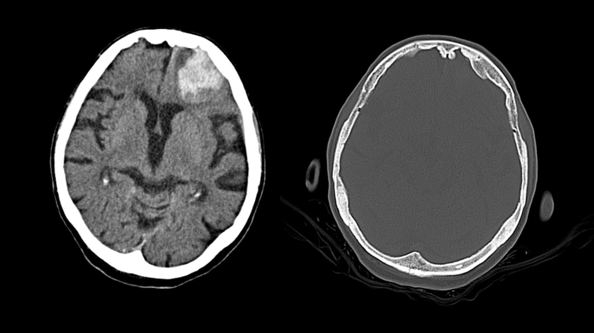

Coup-contrecoup injury

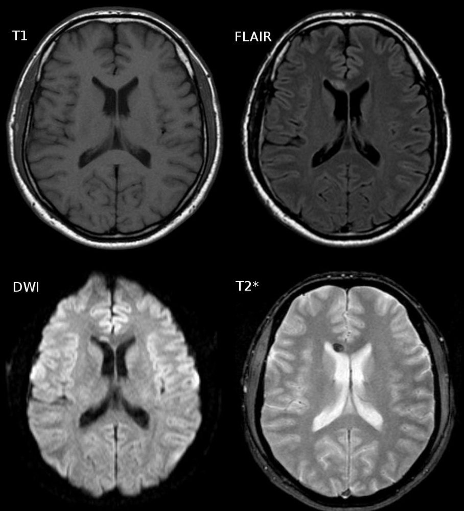

Diffuse axonal injury

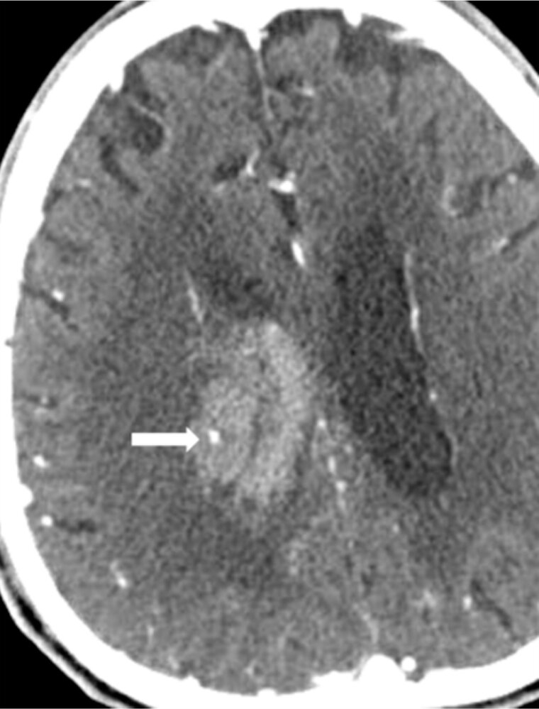

Spot sign in active intracerebral hemorrhage

### <u>Secondary brain injury</u> [[12]](https://coursology-qbank.com/amboss/article/qxYCxr)[[13]](https://coursology-qbank.com/amboss/article/JlbsBF)

* Definition: indirect <u>brain injury</u> resulting from physiological changes following <u>acute CNS insults</u> and/or their treatment

* Examples: disrupted <u>blood-brain barrier</u>, <u>hypoxic-ischemic encephalopathy</u> (see “Pathophysiology” in “<u>Secondary brain injury</u>” for details)

> [!TIP]
> <u>Secondary brain injury</u> is preventable. <u>Neuroprotective measures</u> to prevent or minimize <u>secondary brain injury</u> should be initiated as early as possible in all patients with acute neurological insults.

---

## Clinical features

Clinical features vary depending on the severity, location, and type of <u>TBI</u>. Patients require <u>neurological examination</u> and <u>assessment of sensorium and cognition</u>. For details see “Clinical features” in “<u>EDH</u>”, “<u>SDH</u>”, “<u>SAH</u>”, “<u>ICH</u>” and “<u>Mild TBI</u>”.

### General symptoms

* <u>Global</u> neurological symptoms

* <u>Loss of consciousness</u> or altered consciousness (e.g., confusion, <u>disorientation</u>), possibly with a <u>lucid interval</u>

* <u>Headache</u>

* <u>Amnesia</u>

* <u>Symptoms of increased intracranial pressure</u> (<u>ICP</u>) 

* Altered mood and behavior (e.g., aggressive behavior)

* <u>Dizziness</u>, <u>nausea</u>, <u>vomiting</u>

* <u>Cushing triad</u>

* <u>Cerebral herniation syndromes</u>

* <u>Focal neurologic deficits</u>: depending on the affected <u>brain</u> region (see “<u>Stroke symptoms by affected region</u>”)

* <u>Contralateral</u> <u>hemiparesis</u> or <u>hemiplegia</u>

* <u>Contralateral</u> sensory loss

* <u>Cranial nerve palsies</u> (e.g., <u>diplopia</u>, blurred <u>vision</u>, unequal <u>pupils</u>, <u>anosmia</u>)

* Slurred and/or <u>disorganized speech</u>

* Impaired coordination

* <u>Abnormal posturing</u>: characteristic posture of the limbs that typically signifies severe <u>brain injury</u> (most commonly involving the <u>brainstem</u>)  [[17]](https://coursology-qbank.com/amboss/article/pNbLX8)[[18]](https://coursology-qbank.com/amboss/article/JNbsX8)

| <u>Abnormal posturing</u> |  |  |
| --- | --- | --- |
|  | Decorticate posturing (<u>flexor posturing</u>) | Decerebrate posturing (<u>extensor posturing</u>) |
| Description |  * Bilateral <u>flexion</u> of upper extremities and extension of lower extremities   |  * Bilateral extension of upper and lower extremities   |
| Site of injury |  * Most likely in the <u>proximal</u> <u>brainstem</u> (<u>proximal</u> to the level of the <u>red nucleus</u>)   |  * Most likely in the <u>distal</u> <u>brainstem</u> or <u>pons</u> (i.e., at or below the level of the <u>red nucleus</u>)   |
| Overactive tract |  * <u>Rubrospinal tract</u> and <u>vestibulospinal tract</u>   |  * <u>Vestibulospinal tract</u>   |
| Prognosis |  * <u>Decorticate posturing</u> is associated with a better prognosis than <u>decerebrate posturing</u>   |  |

> [!NOTE]
> In deCORticate posture, the arms are flexed towards the CORe of the body.

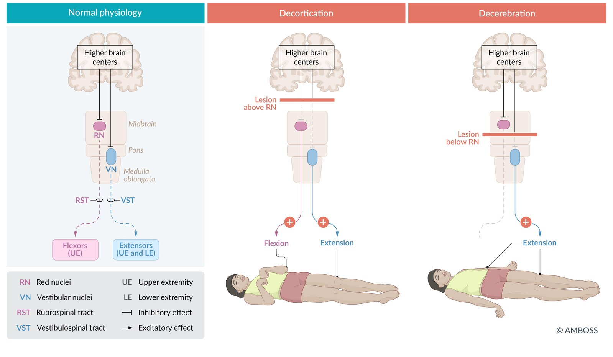

Decerebrate and decorticate posturing

### Symptoms of associated injuries

* General symptoms of <u>skull fractures</u> [[19]](https://coursology-qbank.com/amboss/article/9dYNHL)[[20]](https://coursology-qbank.com/amboss/article/qNbCX8)

* <u>Hematoma</u>; , local swelling, and <u>laceration</u> of the scalp

* <u>Liquorrhea</u>: leakage of <u>CSF</u> from the <u>subarachnoid space</u> through an external opening

* Due to a dural tear immediately or within the first few days after the trauma

* May show a <u>halo sign</u>: rapidly-expanding clear ring of fluid surrounding blood

* <u>Basilar skull fractures</u>

* <u>Anterior</u> <u>basilar skull fracture</u> 

* <u>CSF rhinorrhea</u>

* <u>Raccoon eyes</u>

* Palsies of <u>cranial nerves</u> I, V, VI, VII, and/or VIII

* <u>Posterior</u> <u>basilar skull fracture</u> 

* <u>CSF otorrhea</u>

* <u>Hemotympanum</u>

* <u>Battle sign</u> [[21]](https://coursology-qbank.com/amboss/article/0-0eDi)

* Palsies of <u>cranial nerves</u> VI, VII, and/or VIII palsies

* <u>Facial fractures</u>: <u>hematomas</u>, facial and/or nasal swelling, <u>epistaxis</u>, visible deformity

* <u>C-spine injuries</u>: See “<u>Clinical features of C-spine injuries</u>.”

> [!NOTE]
> <u>Skull fractures</u>, (worsening) neurological impairment, repeated <u>vomiting</u>, and <u>seizures</u> are indicative of more severe trauma or <u>intracranial hemorrhage</u>.

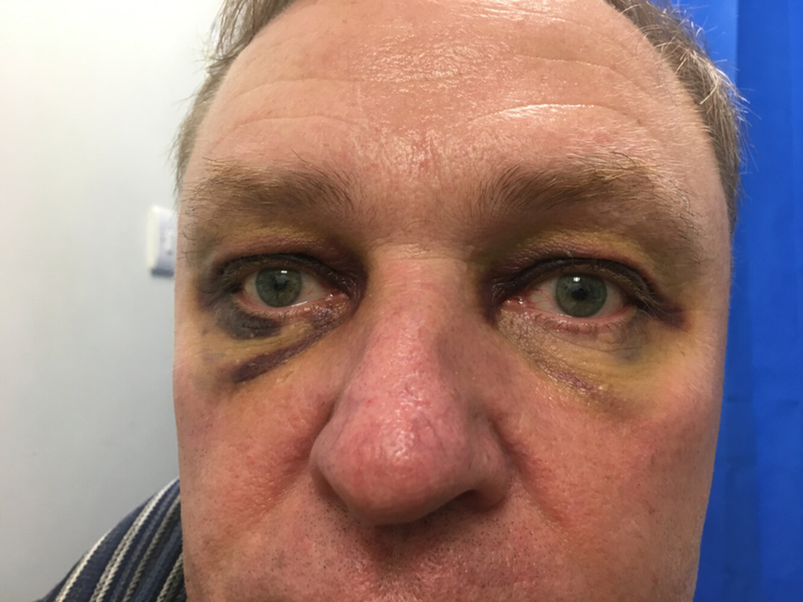

Bilateral periorbital ecchymosis

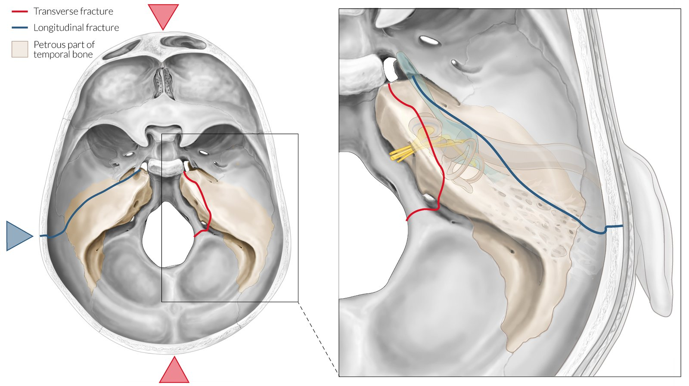

Longitudinal and transverse temporal bone fractures

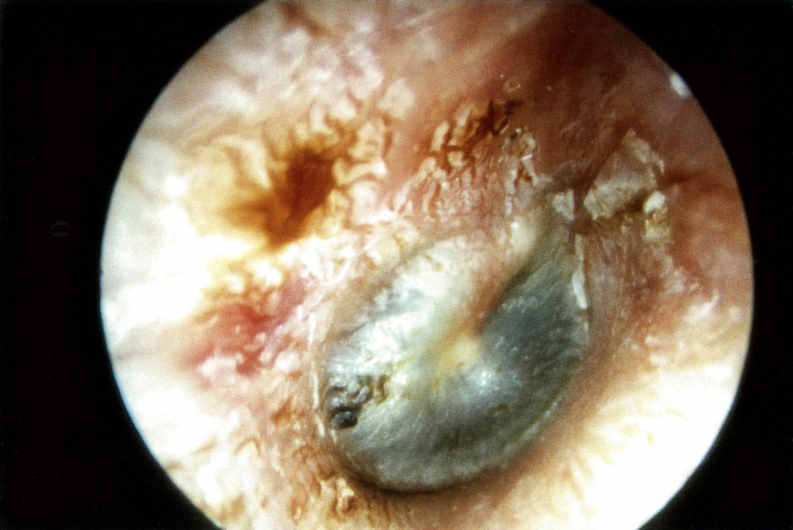

Hemotympanum

---

## Initial management

### Approach [[22]](https://coursology-qbank.com/amboss/article/60bjSH)[[23]](https://coursology-qbank.com/amboss/article/35YSPp)[[24]](https://coursology-qbank.com/amboss/article/ZyYZd7)

* Start <u>primary survey</u> (<u>ABCDE survey</u>) with simultaneous <u>neuroprotective measures</u>. 

* Additional <u>prehospital trauma care</u> (e.g., <u>spine</u> <u>immobilization</u>, <u>analgesics</u>)

* Maintain or achieve <u>normoxia</u>, <u>normocapnia</u>, blood pressure control, and <u>euglycemia</u>.

* Begin <u>initial management of C-spine injuries</u>, if indicated.

* Measure <u>GCS</u> and <u>pupillary</u> response.

* <u>Classify TBI</u> by severity based on <u>GCS</u>.

* Transfer to a <u>neurocritical care unit</u> if needed.

* Diagnostics and imaging (usually noncontrast CT) if indicated

* Treatment and further management based on severity scores and CT findings

> [!WARNING]
> Resuscitative measures to achieve <u>normoxia</u>, <u>normocapnia</u>, <u>normotension</u>, and <u>euglycemia</u> take precedence in the acute management of <u>TBI</u> and should not be delayed for diagnostic steps.

> [!TIP]
> <u>Neuroimaging</u> should not delay transfer to centers that can provide definitive neurosurgical care if required. [[24]](https://coursology-qbank.com/amboss/article/ZyYZd7)

> [!WARNING]
> <u>Hypotension</u> in <u>TBI</u> significantly worsens the prognosis and should be identified and treated. <u>Permissive hypotension</u> is harmful in <u>TBI</u>. [[23]](https://coursology-qbank.com/amboss/article/35YSPp)

### <u>Primary survey</u> [[24]](https://coursology-qbank.com/amboss/article/ZyYZd7)

The <u>primary survey</u> should follow the <u>ATLS algorithm</u> (ABCDE). The goal is to identify and treat any life-threatening conditions and avoid <u>secondary brain injury</u>.

|  |  Key aspects for primary survey in TBI [[22]](https://coursology-qbank.com/amboss/article/60bjSH)[[23]](https://coursology-qbank.com/amboss/article/35YSPp)[[24]](https://coursology-qbank.com/amboss/article/ZyYZd7)  |
| --- | --- |
| <u>Airway</u> |   * <u>C-spine immobilization</u>  * Consider <u>intubation</u> (<u>RSI</u>) in patients with <u>GCS</u> ≤ 8 (individual decision).  [[22]](https://coursology-qbank.com/amboss/article/60bjSH)[[25]](https://coursology-qbank.com/amboss/article/QLbux8)  * The most experienced team member should intubate <u>TBI</u> patients.  * Perform rapid-focused <u>neurological examination</u> prior to <u>intubation</u>, if possible, to obtain a baseline recording.  * Consider <u>intubation induction agents</u>: <u>Ketamine</u> DOSAGE is preferred if there are no <u>signs of ↑ ICP</u> (see “<u>Intubation of patients with increased ICP</u>” for details).  [[22]](https://coursology-qbank.com/amboss/article/60bjSH)[[25]](https://coursology-qbank.com/amboss/article/QLbux8)    |
| Breathing |   * Oxygenation or <u>mechanical ventilation</u> to maintain <u>normoxia</u> and <u>normocapnia</u> (<u>SpO2</u> > 92–94%, <u>PaO2</u> > 60 mm Hg, <u>PaCO2</u> 35–45 mm Hg)  * See “<u>Ventilation strategy for elevated ICP</u>” and the section on “Oxygenation and ventilation” in “<u>Secondary brain injury and neuroprotective measures</u>” for details.    |
| Circulation |   * Maintain <u>SBP</u> > 90 and < 180 mmHg (see “Control of blood pressure” in “<u>Secondary brain injury and neuroprotective measures</u>” for details).  [[26]](https://coursology-qbank.com/amboss/article/CZbqdH)  * In hypotensive patients, administer <u>IV fluid resuscitation</u> with <u>isotonic saline</u> DOSAGE  [[27]](https://coursology-qbank.com/amboss/article/tmbXh8)[[28]](https://coursology-qbank.com/amboss/article/IWbY5s)  * Obtain <u>eFAST</u> if a concealed extracranial hemorrhage is suspected to be the cause of <u>hypotension</u> (e.g., <u>hemothorax</u>, <u>hemoperitoneum</u>).  * Control obvious sources of bleeding (e.g., staple actively bleeding <u>scalp laceration</u>).  * Transfuse packed red cells if <u>Hb</u> ≤ 7 g/dL (restrictive threshold)  [[22]](https://coursology-qbank.com/amboss/article/60bjSH)[[29]](https://coursology-qbank.com/amboss/article/eYbxLH)[[30]](https://coursology-qbank.com/amboss/article/VYbGLH)[[31]](https://coursology-qbank.com/amboss/article/zZbrVH)[[32]](https://coursology-qbank.com/amboss/article/4vb3ZD)    |
| Disability |   * Rapid <u>neurological examination</u> including <u>pupillary exam</u> and investigation for <u>lateralizing signs</u>  * Assess for <u>signs of ↑ ICP</u>: Administer empiric <u>ICP management</u> if needed.  * Assess severity of <u>TBI</u> (see “<u>GCS</u>”)  * Assess for and treat (additional) reversible non-<u>TBI</u> causes of low <u>GCS</u>  * <u>Hypoglycemia</u> (target blood <u>glucose</u>: 80–180 mg/dL) [[24]](https://coursology-qbank.com/amboss/article/ZyYZd7)  * <u>Opioid toxicity</u>  * <u>Alcohol intoxication</u>    |
| Exposure |   * Assess for other life-threatening or limb-threatening injuries (e.g., <u>spinal cord injuries</u>, solid organ injuries, hollow viscous injuries, and injuries to extremities)  * Avoid <u>hypothermia</u> and cover the patient as early as possible.    |

> [!WARNING]
> Patients with moderate or <u>severe TBI</u> (<u>GCS</u> ≤ 12) require emergency <u>neuroimaging</u> with noncontrast head CT after stabilization even if potential additional causes for mental <u>obtundation</u> are present (e.g., <u>alcohol intoxication</u>).

Glasgow Coma Scale (GCS)

### <u>Secondary survey</u>

* Focused history

* <u>SAMPLE history</u>

* Mechanism/time of injury

* Presence/duration of <u>amnesia</u>

* Presence of <u>seizures</u>/<u>headache</u>

* Use of <u>anticoagulant</u> medication

* <u>Physical examination</u>: thorough head-to-toe examination and complete <u>neurological examination</u>

* Continuous monitoring

* <u>Vitals</u>, <u>SpO2</u>

* Serial <u>neurological examination</u>: <u>GCS</u>, <u>pupillary exam</u>, <u>lateralizing signs</u>

* Emergency consults

* Neurosurgery (if <u>GCS</u> ≤ 12 or deteriorating)

* Trauma <u>surgery</u> for additional major trauma

* Transfer: If <u>GCS</u> ≤ 12, transfer to a <u>trauma center</u> or <u>neurocritical care unit</u> if unavailable at current site

---

## Classification

### Severity classification using <u>Glasgow coma scale</u> (<u>GCS</u>)  [[33]](https://coursology-qbank.com/amboss/article/M4bMPF)[[34]](https://coursology-qbank.com/amboss/article/L4bwPF)[[35]](https://coursology-qbank.com/amboss/article/K4bU4F)

* Clinical applications of <u>GCS</u> in <u>TBI</u> [[12]](https://coursology-qbank.com/amboss/article/qxYCxr)

* Assessing the <u>level of consciousness</u> objectively

* Guiding <u>targeted therapies</u>  [[12]](https://coursology-qbank.com/amboss/article/qxYCxr)

* Estimating patient prognosis

* Monitoring therapy

* Evaluating <u>AMS or coma</u> of concurrent etiologies (e.g., <u>stroke</u>, intoxication)

* Scoring of <u>GCS</u>

* <u>Eye</u> opening (E): spontaneous (4); to verbal instruction (3); to <u>pain</u> (2); unresponsive (1)

* Verbal response (V): oriented (5); confused (4); inappropriate words (3); incomprehensible sounds (2); unresponsive (1)

* Motor response (M): follows instruction (6); localizes <u>pain</u> (5); withdraws from <u>pain</u> (4); <u>decorticate posturing</u> (3); <u>decerebrate posturing</u> (2); unresponsive (1)

* Interpretation of <u>GCS</u>

* <u>GCS</u> 3 (minimum score): deeply <u>comatose</u> or imminent <u>brain death</u>

* <u>GCS</u> 15 (maximum score): fully conscious

* <u>TBI</u> severity

* <u>Mild TBI</u> (<u>mTBI</u>): <u>GCS</u> 13–15; includes <u>concussion</u>; may or may not be associated with <u>neuroimaging</u> findings  [[24]](https://coursology-qbank.com/amboss/article/ZyYZd7)

* Moderate TBI: <u>GCS</u> 9–12; usually associated with structural <u>brain lesions</u> on <u>neuroimaging</u>

* Severe TBI: <u>GCS</u> ≤ 8; usually an indication for <u>intubation</u>

* Important considerations

* Record the score of each criterion individually (e.g., <u>GCS</u> 11, E(3) V(4) M(4)).

* The score is invalid if any parameter is nontestable.

* <u>Alcohol</u> and certain drugs (e.g., <u>analgesics</u>, <u>antidepressants</u>, <u>anesthetics</u>) may affect initial score.

* Significant <u>hypotension</u> (<u>SBP</u> < 90 mm Hg) alters <u>GCS</u>. [[24]](https://coursology-qbank.com/amboss/article/ZyYZd7)

> [!TIP]
> <u>GCS</u> is the standard for initial evaluation and classification of patients with traumatic <u>brain injury</u>.

> [!WARNING]
> Significant <u>hypotension</u> alters <u>GCS</u>. Reassess <u>GCS</u> after correction of <u>hypotension</u> [[24]](https://coursology-qbank.com/amboss/article/ZyYZd7)

Glasgow Coma Scale (GCS)

### Other classifications

* By mechanism of injury, e.g.:

* <u>Primary brain injury</u> vs. secondary <u>brain injury</u>

* Due to <u>closed head injury</u> or <u>open head injury</u>

* Associated with <u>blunt head injury</u>, <u>penetrating head injury</u>, or <u>blast injury</u>

* By type of injury (usually seen on <u>neuroimaging</u>): e.g., <u>EDH</u>, <u>SDH</u>, <u>traumatic SAH</u>, traumatic <u>ICH</u>, traumatic <u>IVH</u>, <u>DAI</u>, <u>cerebral contusion</u>

---

## Diagnosis

### General principles [[24]](https://coursology-qbank.com/amboss/article/ZyYZd7)

* Head CT without IV contrast is the first-line diagnostic modality.

* <u>Mild TBI</u>: imaging only required for patients fulfilling <u>criteria for neuroimaging in mTBI</u>

* Moderate/<u>severe TBI</u>: emergency <u>neuroimaging</u> after stabilization

* The goal of diagnostics is timely identification of lesions that require neurosurgical intervention.

* Imaging should not delay transfer to centers that can provide definitive neurosurgical care if required.

* Obtain imaging of other potential sites of injury, e.g., <u>diagnostics for C-spine injury</u>.

> [!TIP]
> Possible traumatic <u>brain injury</u> should always be considered in a patient with a decreased or altered consciousness.

> [!TIP]
> <u>Neuroprotective measures</u> take precedence over diagnostics.

### Imaging [[23]](https://coursology-qbank.com/amboss/article/35YSPp)[[24]](https://coursology-qbank.com/amboss/article/ZyYZd7)[[36]](https://coursology-qbank.com/amboss/article/7ab4NH)

#### Head CT without IV contrast

* Indications: preferred first-line imaging modality in patients with <u>TBI</u>  [[24]](https://coursology-qbank.com/amboss/article/ZyYZd7)[[37]](https://coursology-qbank.com/amboss/article/CNbqW8)

* Moderate or <u>severe TBI</u> (<u>GCS</u> ≤ 12)

* <u>Mild TBI</u> (<u>GCS</u> ≥ 13): only if any <u>criteria for neuroimaging in mTBI</u> are present

* <u>Open head injury</u>

* <u>Depressed skull fracture</u>

* Short-term follow-up of <u>TBI</u> in patients with rapid deterioration of neurological symptoms

* Supportive findings

* On <u>brain window</u>

* Usually normal in <u>mTBI</u>  [[38]](https://coursology-qbank.com/amboss/article/ryYfg7)

* <u>Intracranial hemorrhage</u> or <u>hematoma</u>: <u>hyperdense</u> lesions (see “<u>Differential diagnosis of intracranial hemorrhage</u>” for a comparison of CT findings)

* <u>Mass effect</u>

* Compression of cerebral <u>parenchyma</u> adjacent to <u>hematoma</u>

* Midline shift to the <u>contralateral</u> side of the <u>hematoma</u>

* <u>Brain herniation</u>: displacement of <u>brain</u> tissue from one compartment to another  [[36]](https://coursology-qbank.com/amboss/article/7ab4NH)

* <u>Diffuse axonal injury</u> (<u>DAI</u>):  can be normal in mild <u>DAI</u>; multiple punctate <u>hyperdensities</u> indicating small hemorrhages typically at the junction of gray and <u>white matter</u>, <u>brainstem</u>, <u>internal capsule</u>, and corpus callosum  [[23]](https://coursology-qbank.com/amboss/article/35YSPp)[[36]](https://coursology-qbank.com/amboss/article/7ab4NH)

* <u>Cerebral contusion</u>: heterogeneous lesion (mixed hemorrhagic, <u>necrotic</u>, and <u>edematous</u> tissue) surrounded by <u>cerebral edema</u> [[23]](https://coursology-qbank.com/amboss/article/35YSPp)

* <u>Cerebral edema</u>: compression of ventricles, loss of defined sulci and <u>gyri</u>, and <u>effacement of basal cisterns</u> [[36]](https://coursology-qbank.com/amboss/article/7ab4NH)

* On <u>bone window</u>

* Evidence of <u>skull fractures</u>: linear, depressed, or <u>basilar skull fractures</u>

* Pneumocephalus: air within the <u>cranium</u>; typically associated with an <u>open skull fracture</u>

* Scrollable CT imaging examples

* <u>EDH</u> and <u>SDH</u>

* <u>SDH</u>

* <u>Traumatic ICH</u>

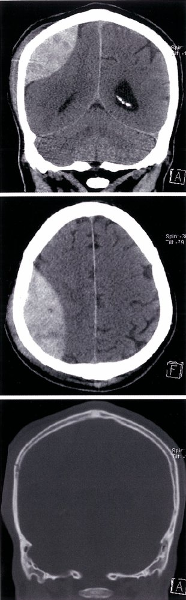

Cranial vault fracture with epidural hematoma

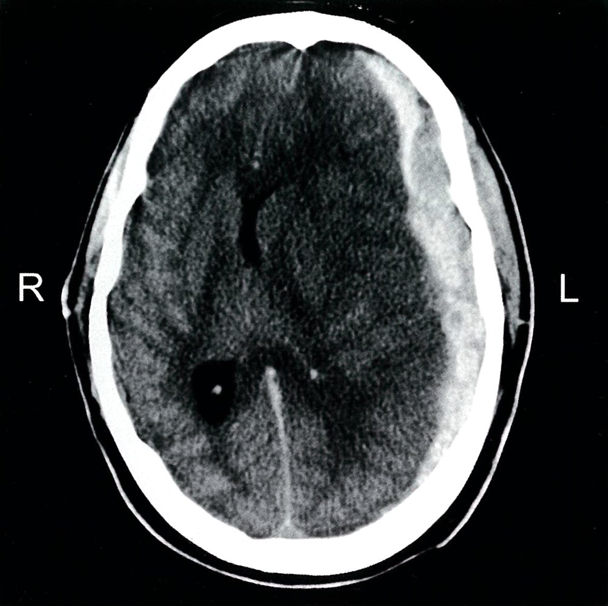

Subdural hematoma and cerebral edema

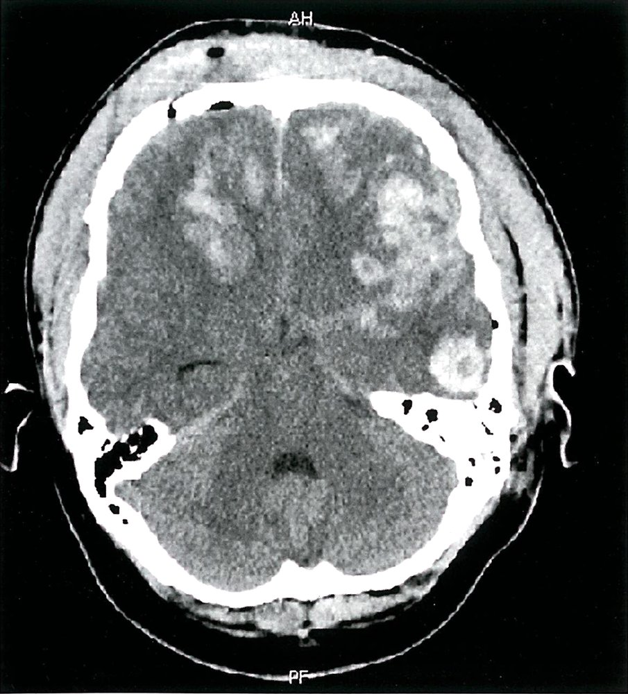

Traumatic intracerebral hemorrhage

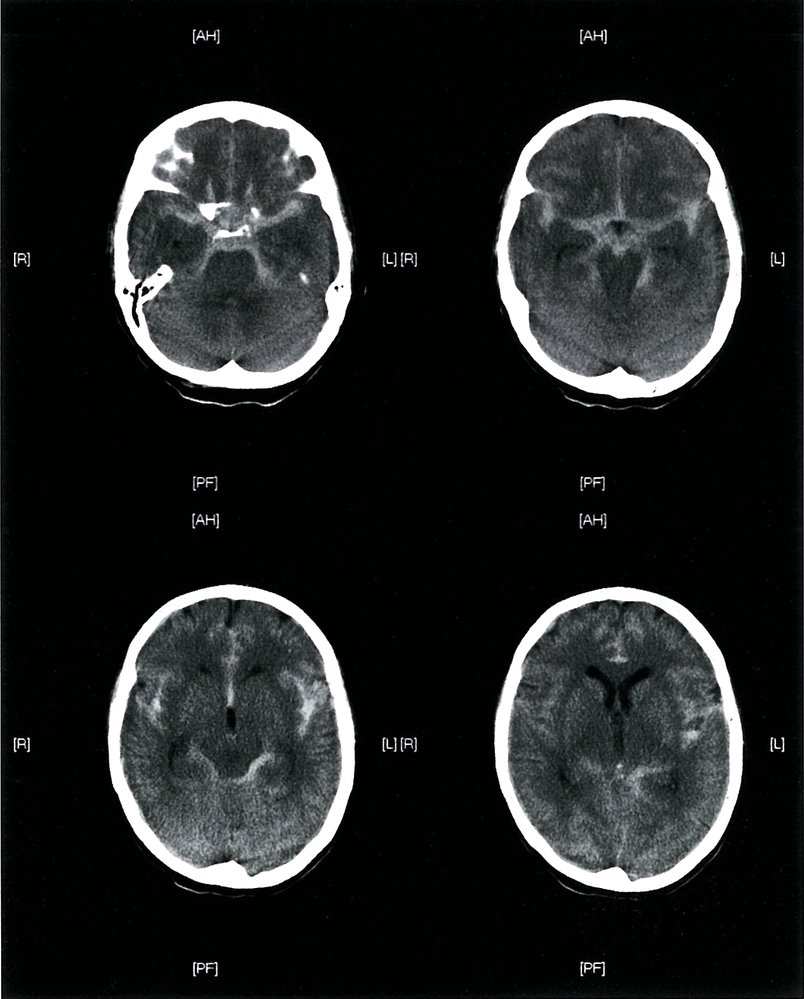

Subarachnoid hemorrhage

Coup-contrecoup injury

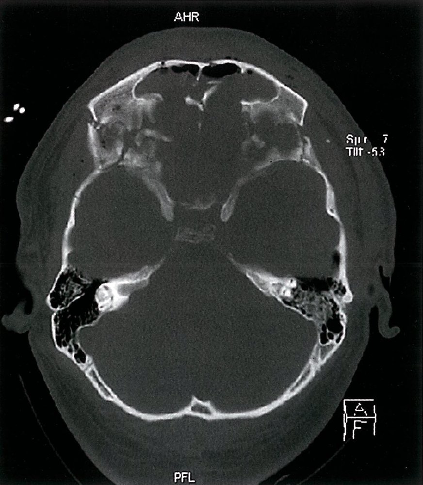

Anterior skull base fractures

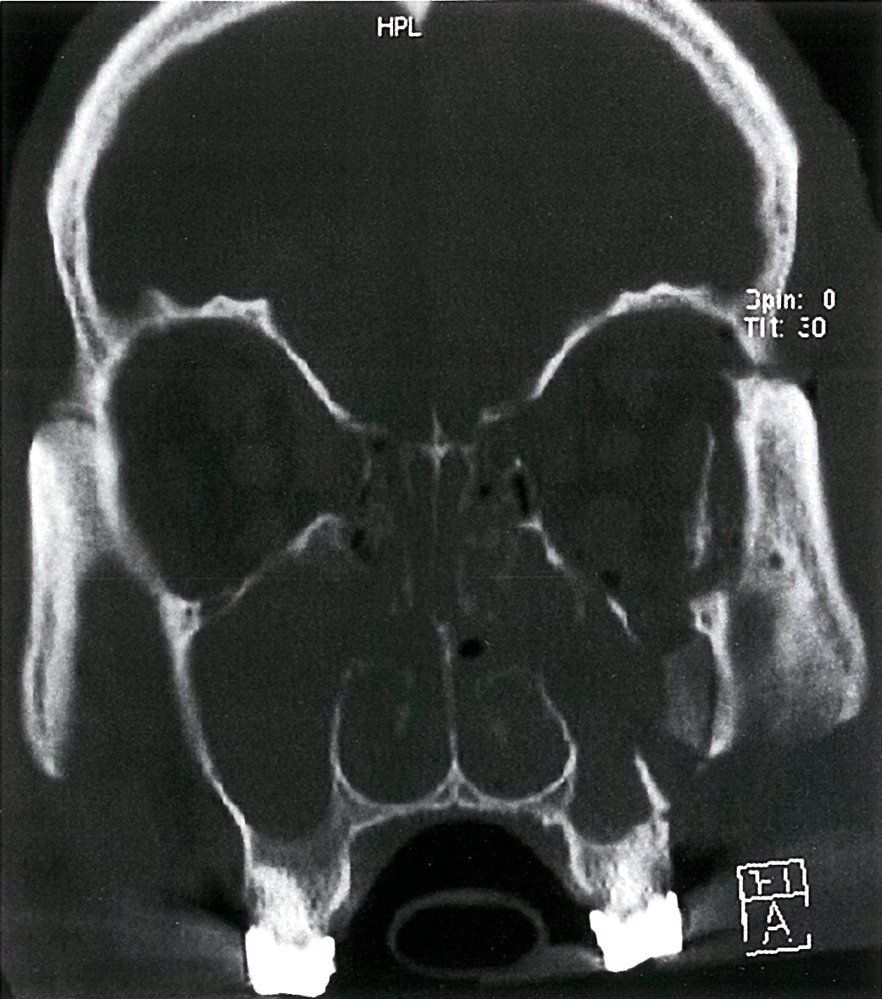

Facial and orbital fractures

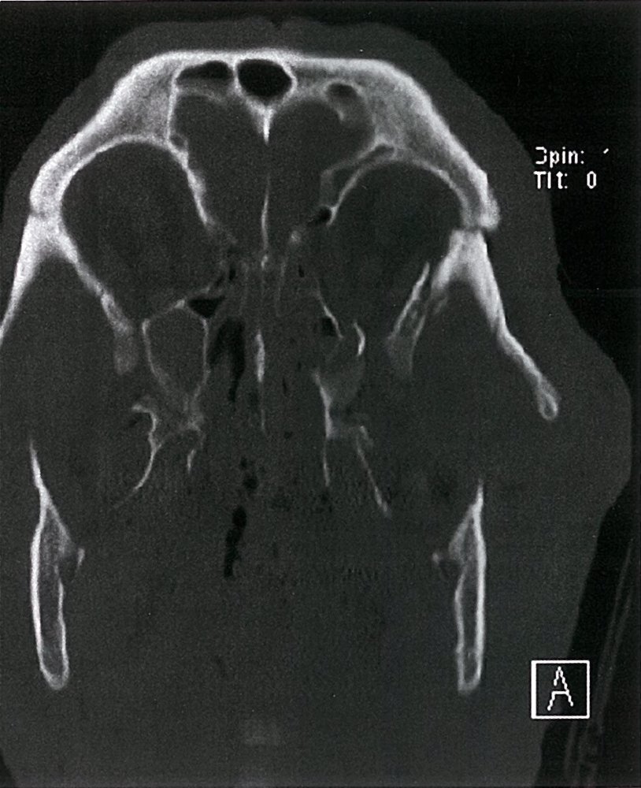

Facial and orbital fractures

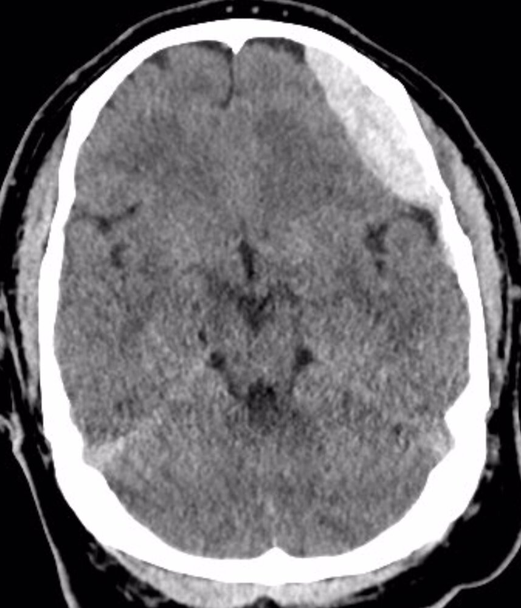

Epidural and subdural hematomas

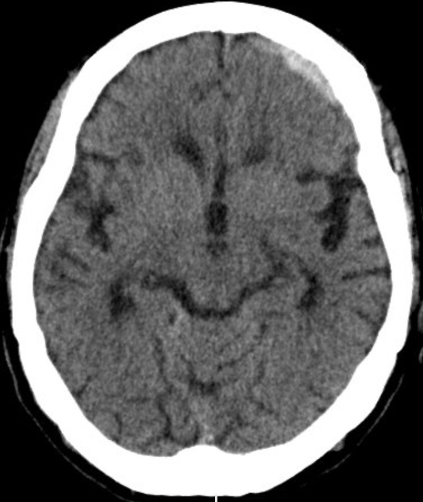

Subdural hematoma

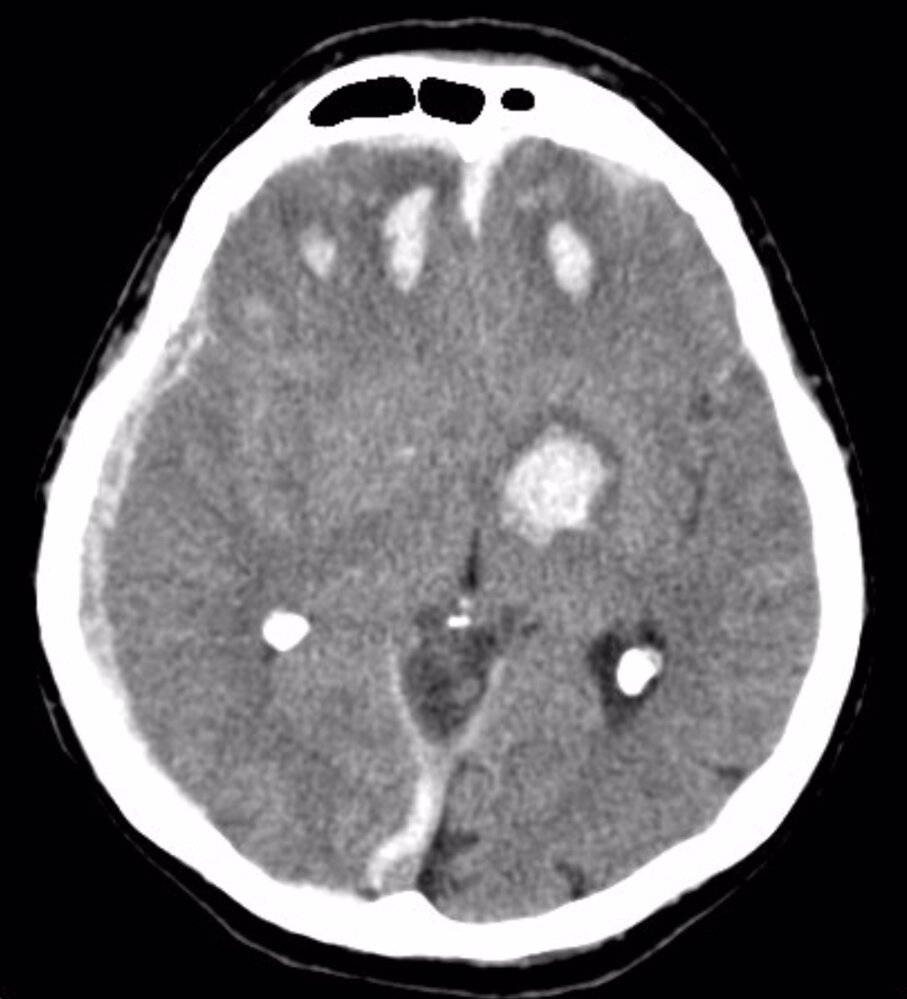

Post traumatic intracerebral hemorrhage

#### <u>MRI</u> head without IV contrast [[37]](https://coursology-qbank.com/amboss/article/CNbqW8)

* Indications

* Acute <u>TBI</u> with symptoms unexplained by CT (in hemodynamically stable patients)  [[24]](https://coursology-qbank.com/amboss/article/ZyYZd7)[[36]](https://coursology-qbank.com/amboss/article/7ab4NH)

* Short-term follow-up of acute <u>TBI</u> in patients with rapid deterioration of neurological symptoms (alternative to CT)

* Subacute or chronic <u>TBI</u> with new, persistent, or worsening of neurological or cognitive deficits (preferred modality) [[36]](https://coursology-qbank.com/amboss/article/7ab4NH)[[37]](https://coursology-qbank.com/amboss/article/CNbqW8)

* Supportive findings: Microhemorrhages, <u>DAI</u>, and <u>contusions</u> are better visualized on <u>MRI</u> than on CT.

Diffuse axonal injury

#### Additional imaging [[36]](https://coursology-qbank.com/amboss/article/7ab4NH)[[37]](https://coursology-qbank.com/amboss/article/CNbqW8)

Consider additional imaging based on the patient's history and clinical features or if initial imaging modality findings are inconsistent with neurological symptoms.

* CT <u>cervical spine</u>: obtain if <u>C-spine injury</u> is suspected (see “<u>Diagnostics for C-spine injury</u>” for details).  [[39]](https://coursology-qbank.com/amboss/article/Yjbn_t)

* CT maxillofacial and/or <u>temporal bone</u> without IV contrast: in suspected <u>CSF leak</u>

* CT or <u>MR angiography</u>: in suspected intracranial arterial injury  [[37]](https://coursology-qbank.com/amboss/article/CNbqW8)

* <u>CTA spot sign</u>

* Signs of <u>BCVI</u> and <u>penetrating injuries</u>  [[36]](https://coursology-qbank.com/amboss/article/7ab4NH)

* CT or <u>MR venography</u>: suspected <u>cerebral venous thrombosis</u>:  [[37]](https://coursology-qbank.com/amboss/article/CNbqW8)

### <u>Laboratory studies</u> [[23]](https://coursology-qbank.com/amboss/article/35YSPp)[[24]](https://coursology-qbank.com/amboss/article/ZyYZd7)

* In patients with altered consciousness

* Blood <u>glucose</u>

* <u>Blood alcohol level</u>

* <u>Urine toxicology screen</u>

* Serum <u>electrolyte</u> levels

* <u>ABG analysis</u>

* In patients with suspected coagulopathies : <u>coagulation panel</u>

* In patients with <u>moderate TBI</u>, <u>severe TBI</u>, and/or extensive blood loss from other injuries : blood <u>type and screen</u>

* In women of childbearing age: urine/serum <u>pregnancy test</u>

---

## Management

### Overview

* After the <u>initial management of TBI</u>, the severity of injury and <u>neuroimaging</u> findings determine further management.

* The goal is to prevent <u>secondary brain injury</u> and provide surgical treatment if necessary.

* Arrange for <u>definitive management of C-spine injuries</u>, if present.

* For surgical management of intracranial lesions see “Treatment” in “<u>EDH</u>”, “<u>SDH</u>”, “<u>SAH</u>”, “<u>ICH</u>”, and “<u>Elevated intracranial pressure and brain herniation</u>”.

|  Overview of <u>TBI management</u> [[23]](https://coursology-qbank.com/amboss/article/35YSPp)[[24]](https://coursology-qbank.com/amboss/article/ZyYZd7)  |  |  |
| --- | --- | --- |
| Severity of <u>TBI</u> | Treatment | <u>Supportive care</u> |
| Mild (<u>GCS</u> ≥ 13) |   * Check criteria for admission (e.g., <u>GCS</u> < 15 after two hours)  * Observation in the ED is often sufficient.  * See “<u>Mild TBI</u>” for details.    |  * Nonopioid <u>oral analgesics</u> (e.g., <u>acetaminophen</u>) and <u>antiemetics</u> if necessary (for as short a duration as possible)  [[23]](https://coursology-qbank.com/amboss/article/35YSPp)   |
| <u>Moderate TBI</u> (<u>GCS</u> 9–12) |   * Admission/transfer to <u>neurocritical care unit</u>  * <u>Neuroprotective measures</u> and <u>ICP management</u> to prevent <u>secondary brain injury</u>  * If < 3 hours have elapsed since the injury: Consider <u>tranexamic acid</u> (<u>TXA</u>). [[40]](https://coursology-qbank.com/amboss/article/N0b-TH)[[41]](https://coursology-qbank.com/amboss/article/1sb2FE)[[42]](https://coursology-qbank.com/amboss/article/WsbPFE)[[43]](https://coursology-qbank.com/amboss/article/VvXG_-)[[44]](https://coursology-qbank.com/amboss/article/evXx_-)  * Consult neurosurgery and initiate surgical treatment as needed  * Consider follow-up <u>neuroimaging</u> at 12–24 hours or before discharge  [[45]](https://coursology-qbank.com/amboss/article/HLbK_8)[[46]](https://coursology-qbank.com/amboss/article/sLbt_8)    |   * Intubated patients: See “<u>Adjunctive care of ventilated patients</u>”.  * <u>Parenteral analgesics</u> and <u>antiemetics</u>  * Monitoring: <u>vitals</u>, <u>GCS</u>, blood <u>glucose</u>, <u>electrolytes</u>, <u>pain</u>, sedation (e.g., <u>RASS</u>)  * Prevention of <u>secondary bleeding</u> or <u>hematoma</u> expansion (e.g., <u>anticoagulant reversal</u>)  * <u>DVT prophylaxis</u>  * Consider <u>empiric antibiotic therapy</u> (<u>CNS</u> infection prophylaxis)    |
| <u>Severe TBI</u> (<u>GCS</u> ≤ 8) |  * Similar to <u>moderate TBI</u> with the following exceptions:  * <u>TXA</u> is unlikely to benefit patients with <u>severe TBI</u>.  [[40]](https://coursology-qbank.com/amboss/article/N0b-TH)  * Follow-up <u>neuroimaging</u> 6 hours after initial <u>neuroimaging</u>. [[47]](https://coursology-qbank.com/amboss/article/8LbOz8)   |  * Additionally to the measures in <u>moderate TBI</u>: <u>seizure</u> prophylaxis for 7 days postinjury [[2]](https://coursology-qbank.com/amboss/article/sNbtc8)[[26]](https://coursology-qbank.com/amboss/article/CZbqdH)[[48]](https://coursology-qbank.com/amboss/article/4Yb36H)   |

---

## Moderate and severe TBI

### Surgical treatment [[23]](https://coursology-qbank.com/amboss/article/35YSPp)[[24]](https://coursology-qbank.com/amboss/article/ZyYZd7)

Consult neurosurgery and initiate treatment as needed based on the underlying condition (see “Treatment” in “<u>EDH</u>”, “<u>SDH</u>”, “<u>SAH</u>”, and “<u>ICH</u>” for details).

* <u>Skull fracture</u> <u>surgery</u> can be indicated for <u>depressed skull fracture</u> with one of the following: 

* <u>Open fracture</u> with dural penetration or significant <u>depression</u>

* Significant <u>cranial</u> <u>hematoma</u>

* <u>Frontal sinus</u> involvement

* Gross contamination/wound infection

* <u>Pneumocephalus</u>

* Major cosmetic deformity

* <u>Craniotomy</u> and evacuation of <u>hematomas</u>

* <u>EDH</u> and <u>acute SDH</u> meeting criteria for <u>surgery</u> should have evacuation done as soon as possible.

* See “<u>SDH</u>” and “<u>EDH</u>” for details on indications and methods.

* Surgical management of <u>↑ ICP</u> (See “<u>ICP management</u>” for details.)

* Extraventricular drain (<u>EVD</u>)

* <u>Decompressive craniectomy</u> [[26]](https://coursology-qbank.com/amboss/article/CZbqdH)

* Indicated in traumatic intraparenchymal hemorrhages and <u>posterior fossa</u> hemorrhages with:

* <u>Mass effect</u>

* Neurological deterioration attributable to the lesion

* High <u>ICP</u> refractory to medical therapy

* Approach (e.g., suboccipital, subtemporal, frontotemporoparietal) depends on lesion location.

### Additional treatment and monitoring

* <u>Antifibrinolytic therapy</u>: Consider <u>TXA</u>.

* <u>Moderate TBI</u>: Consider <u>TXA</u> (<u>off-label</u>) DOSAGE if < 3 hours have elapsed since the injury  [[40]](https://coursology-qbank.com/amboss/article/N0b-TH)[[41]](https://coursology-qbank.com/amboss/article/1sb2FE)[[42]](https://coursology-qbank.com/amboss/article/WsbPFE)[[43]](https://coursology-qbank.com/amboss/article/VvXG_-)[[44]](https://coursology-qbank.com/amboss/article/evXx_-)

* <u>Severe TBI</u>: benefit of <u>TXA</u> unlikely because of potentially extensive <u>intracranial hemorrhage</u> at presentation [[40]](https://coursology-qbank.com/amboss/article/N0b-TH)

* <u>Supportive care</u>:

* <u>ICP management</u>

* Intubated patients: See “<u>Adjunctive care of ventilated patients</u>”.

* <u>Pain management</u>: Treat <u>pain</u> and <u>agitation</u> with <u>analgesics</u> and sedatives.

* <u>Antiemetics</u> (in patients with significant <u>nausea</u>/<u>vomiting</u>)

* Monitoring

* Continuous or frequent monitoring of <u>vitals</u>.

* Frequent assessment of <u>GCS</u>

* Frequent monitoring of blood <u>glucose</u> and serum <u>electrolyte</u> levels as needed.

* Consider <u>invasive ICP monitoring</u> in patients with <u>risk factors</u> for <u>elevated ICP</u>, including:

* <u>GCS</u> ≤ 8 and signs of high <u>ICP</u> on <u>CT scan</u>

* Normal <u>CT scan</u> and ≥ 2 of the following:

* Age > 40 years

* Unilateral or bilateral motor posturing

* <u>SBP</u> < 90 mm Hg

* <u>Pain</u>: Use self-reported or behavior-based <u>pain</u> scales.

* Sedation: Use standardized scales to assess <u>agitation</u> and level of sedation (e.g., <u>RASS</u>).

* Follow-up <u>neuroimaging</u>

* <u>Moderate TBI</u>: consider after 12–24 hours or before discharge if any of the following are present:  [[45]](https://coursology-qbank.com/amboss/article/HLbK_8)[[46]](https://coursology-qbank.com/amboss/article/sLbt_8)

* Clinical deterioration

* Initial <u>neuroimaging</u> showed abnormalities

* <u>Elevated ICP</u>

* <u>Coagulopathy</u>

* <u>Hypotension</u>

* <u>Severe TBI</u>: usually obtained 6 hours after initial <u>neuroimaging</u> [[47]](https://coursology-qbank.com/amboss/article/8LbOz8)

* Disposition: admission/urgent transfer to definitive neurosurgical care or <u>neurocritical care unit</u>

> [!TIP]
> Continuing <u>neuroprotective measures</u> to avoid <u>secondary brain injury</u> is crucial for the <u>management of moderate and severe TBI</u>.

> [!TIP]
> <u>Pain</u> and <u>agitation</u> increase <u>SBP</u> and <u>ICP</u> and contribute to <u>secondary brain injury</u> and should be managed adequately (see <u>ICP management</u>). [[49]](https://coursology-qbank.com/amboss/article/DLb1-8)

### Prevention of complications in brain injuries

#### <u>Secondary bleeding</u> or <u>hematoma</u> expansion

* <u>Anticoagulant reversal</u> [[50]](https://coursology-qbank.com/amboss/article/SFYyhI)[[51]](https://coursology-qbank.com/amboss/article/h0bcfH)

* Indication: all patients with <u>intracranial hemorrhage</u> who are on <u>anticoagulant</u> medication

* Contraindication: concomitant <u>cerebral venous thrombosis</u>  [[50]](https://coursology-qbank.com/amboss/article/SFYyhI)

* Target <u>INR</u>: ≤ 1.4 [[24]](https://coursology-qbank.com/amboss/article/ZyYZd7)

* Treatment

* Stop further doses of <u>anticoagulants</u>.

* Administer <u>anticoagulant reversal</u>.

* Resumption of <u>anticoagulant</u> therapy should be individualized.  [[52]](https://coursology-qbank.com/amboss/article/lHbvqE)[[53]](https://coursology-qbank.com/amboss/article/NHb-qE)

* <u>Antiplatelet therapy</u>, <u>thrombocytopenia</u>, and <u>platelet dysfunction</u> [[2]](https://coursology-qbank.com/amboss/article/sNbtc8)[[23]](https://coursology-qbank.com/amboss/article/35YSPp)

* Stop further doses of <u>antiplatelet agents</u>.

* Patients planned for neurosurgery or invasive procedures: Consider <u>platelet transfusion</u> if <u>platelet count</u> is 80,000–100,000 /μL.  [[31]](https://coursology-qbank.com/amboss/article/zZbrVH)[[54]](https://coursology-qbank.com/amboss/article/rv0fYR)

* Resumption of <u>antiplatelet therapy</u> should be individualized.

* <u>DIC</u> monitoring: repeat <u>INR</u>, <u>platelets</u>, and <u>hemoglobin</u>

#### Additional prophylactic measures

* <u>DVT prophylaxis</u>  [[26]](https://coursology-qbank.com/amboss/article/CZbqdH)

* Mechanical prophylaxis: recommended in patients with an active <u>intracranial bleed</u>

* Pharmacological prophylaxis: consider <u>LMWH</u> or low-dose <u>unfractionated heparin</u> in stable <u>TBI</u> after individual risk-benefit evaluation

* <u>Antibiotic prophylaxis</u> [[26]](https://coursology-qbank.com/amboss/article/CZbqdH)[[51]](https://coursology-qbank.com/amboss/article/h0bcfH)

* Not routinely recommended

* Consider in select patients with <u>open head injuries</u>.

* See “<u>CNS infection prophylaxis for open head injury</u>” for details.

* <u>Seizure</u> prophylaxis and treatment

* Prophylaxis [[23]](https://coursology-qbank.com/amboss/article/35YSPp)[[26]](https://coursology-qbank.com/amboss/article/CZbqdH)

* Indicated in <u>severe TBI</u> for 7 days postinjury to prevent early post-traumatic <u>seizures</u>

* Preferably with <u>phenytoin</u> or <u>levetiracetam</u> [[2]](https://coursology-qbank.com/amboss/article/sNbtc8)[[26]](https://coursology-qbank.com/amboss/article/CZbqdH)[[48]](https://coursology-qbank.com/amboss/article/4Yb36H)

* See “<u>Seizure prophylaxis after TBI</u>” for dosages.

* <u>Treat acute seizures</u>.

* Maintenance of <u>vitals</u> and nutrition: See <u>neuroprotective measures</u>.

---

## Complications

* <u>Cerebral edema</u>

* <u>Post-concussion syndrome</u>

* <u>Coma</u>

* <u>Seizures</u> [[55]](https://coursology-qbank.com/amboss/article/cobaau)

* Early post-traumatic <u>seizure</u>: occurs within one week of inciting trauma

* Late post-traumatic <u>seizure</u>: occurs a week after the inciting trauma

* Permanent <u>focal neurological deficits</u>, including <u>persistent vegetative state</u>

* <u>Acute traumatic coagulopathy</u>

* Chronic <u>CSF rhinorrhea</u>

* Intracranial infection (e.g., <u>meningitis</u>, <u>encephalitis</u>, <u>brain abscess</u> secondary to <u>open head injury</u> or neurosurgery) [[56]](https://coursology-qbank.com/amboss/article/4Fb3Rv)

* <u>Surgical site infections</u> (e.g., <u>bone flap</u> <u>osteomyelitis</u>, shunt infections in patients who undergo neurosurgery) [[57]](https://coursology-qbank.com/amboss/article/PFbWRv)

* <u>Irreversible loss of brain function</u> (<u>brain death</u>)

We list the most important complications. The selection is not exhaustive.

---

## Paroxysmal sympathetic hyperactivity (PSH)

### Definition

* A complication of acute <u>brain injury</u> characterized by recurrent episodes of excessive <u>sympathetic</u> activity.

### Pathophysiology

* Loss of cortical inhibition of the <u>sympathetic</u> system subsequent to acute <u>brain injury</u> → exaggerated <u>sympathetic</u> response to stimulation

### Causes

* Traumatic <u>brain injury</u> (most common)

* <u>Anoxic</u> <u>brain injury</u>

* <u>Stroke</u>

* Patient repositioning or extraction of <u>endotracheal tube</u>

* <u>Brain tumors</u>

* Infections (e.g., <u>encephalitis</u>)

* <u>Hydrocephalus</u>

### Clinical features

* Usually occur 1 week after the injury

* Recurrent episodes of excessive <u>sympathetic</u> activity (e.g., <u>fever</u>, <u>tachycardia</u>, <u>tachypnea</u>, <u>hypertension</u>)

* Rapid onset; typically last up to 30 minutes then self-resolve

* Muscle spasms and, possibly, <u>dystonia</u> with posturing

### Diagnostics

* <u>Clinical diagnosis</u>

* <u>EEG</u> and imaging (head CT/<u>MRI</u>) to rule out other conditions

### Treatment [[58]](https://coursology-qbank.com/amboss/article/9jcNcc0)

* <u>Supportive care</u> (e.g., <u>antipyretics</u> for <u>fever</u>, adequate hydration, <u>analgesia</u>, remove or reduce stimuli that may trigger symptoms)

* Pharmacological

* Depends on patient symptoms

* Abortive and preventive agents

* <u>Opioids</u> (e.g., <u>morphine</u>, <u>fentanyl</u>)

* <u>Sympatholytics</u> (e.g., <u>clonidine</u>, <u>propranolol</u>)

* <u>Benzodiazepines</u> (e.g., <u>diazepam</u>, <u>lorazepam</u>)

* <u>Muscle relaxants</u> (e.g., <u>dantrolene</u>, <u>baclofen</u>)

References: [[59]](https://coursology-qbank.com/amboss/article/ZNcZ-c0)[[60]](https://coursology-qbank.com/amboss/article/0Nce-c0)

---

## Special patient groups

When evaluating children and <u>infants</u> with <u>TBI</u>, a number of special issues must be observed.

* Causes

* Falls (most common)

* The possibility of <u>physical child abuse</u> must always be considered.

* Clinical features: : esp. bulging <u>anterior fontanelle</u> (<u>↑ ICP</u>)

* Diagnosis: <u>cranial</u> <u>CT without contrast</u>

* Identify patients with significant <u>TBI</u> but avoid unnecessary radiographic testing

* CT recommended for signs of <u>skull fractures</u>, <u>↑ ICP</u>, major neurologic symptoms (e.g., impaired consciousness, <u>seizures</u>), suspected <u>child abuse</u>

* Consider CT: if less severe symptoms (e.g., changes in behavior, <u>self-limited</u> <u>vomiting</u>) are present.

* See also “<u>Criteria for neuroimaging in children with mTBI</u>.”

* Management

* Inpatient observation indications

* <u>Skull fracture</u> > 3 mm separation or depressed

* Evidence of traumatic <u>brain injury</u> on imaging (e.g.., <u>intracranial hemorrhage</u>)

* Signs of <u>↑ ICP</u> (e.g., <u>headache</u>, <u>altered mental status</u>)

* Suspected <u>physical child abuse</u>

* Caregivers who are unreliable or unable to return if neurological deficits develop within 24 hours after release.

* Release and at-home observation for 24 hours

* Patients without neurological deficits and non-depressed <u>linear skull fracture</u> < 3 mm separation

* Requires a caregiver who can reliably recognize new clinical neurological deficits and return the patient to the hospital if such manifestations arise

* See also “<u>C-spine injuries in children</u>.”

References:[[64]](https://coursology-qbank.com/amboss/article/X-09Di)[[65]](https://coursology-qbank.com/amboss/article/xdYEHL)

---

## Overview of common brain lesions

| Overview of common brain lesions |  |  |  |  |
| --- | --- | --- | --- | --- |
| Location of lesion |  |  | Clinical features |  |
|  Cortex    |  |  <u>Frontal lobe</u>    |   * <u>Contralateral</u> <u>weakness</u> or <u>paralysis</u> of the leg with relative sparing of the arm  * Disinhibition, impulsivity  * Impaired concentration, <u>disorientation</u>  * <u>Primitive reflexes</u>  * <u>Aphasia</u> (<u>akinetic mutism</u>)  * Lack of empathy    |  |
| <u>Frontal eye fields</u> |  * Gaze deviation toward the affected side and away from the side of <u>hemiplegia</u>   |  |  |  |
|  <u>Parietal lobe</u>    |   * <u>Contralateral</u> sensory loss  * <u>Disorientation</u>  * Dominant hemisphere  * <u>Agraphia</u>  * Finger <u>agnosia</u>  * Left-right <u>disorientation</u>  * <u>Acalculia</u>  * <u>Gerstmann syndrome</u>  * Nondominant hemisphere: <u>contralateral</u> <u>agnosia</u> (<u>hemispatial neglect</u>)    |  |  |  |
| <u>Occipital lobe</u> |  * <u>Contralateral</u> <u>homonymous hemianopsia</u> (with <u>macular sparing</u>)   |  |  |  |
| <u>Temporal lobe</u> |   * <u>Contralateral</u> superior quadrant <u>hemianopsia</u>  * <u>Aphasia</u>    |  |  |  |
|  <u>Watershed</u> border-zone    |  |  |   * <u>Proximal</u> upper and lower extremity <u>weakness</u> (<u>anterior</u> cerebral/middle cerebral cortical <u>border zone</u>)  * Visual dysfunction (<u>posterior</u> cerebral/middle cerebral cortical <u>border zone</u>)    |  |
| <u>Posterior</u> limb of the <u>internal capsule</u> |  |  |   * <u>Contralateral</u> <u>hemiparesis</u> of the face, arm, and leg (<u>circumduction gait</u>) and sensory impairment  * <u>Ipsilateral</u> <u>weakness</u> with impaired coordination (e.g., <u>ataxia</u>, gait instability)  * <u>Dysarthria</u> (relatively uncommon)    |  |
| <u>Thalamus</u> |  |  |  * <u>Contralateral</u> numbness and <u>paresthesia</u> of the face, arm, and leg   |  |
|  <u>Basal ganglia</u>    | <u>Putamen</u> |  |   * <u>Contralateral</u> <u>hemiplegia</u> and <u>paresthesia</u>  * <u>Hemiballismus</u>  * Gaze palsy and <u>ipsilateral</u> deviation of the eyes  * <u>Stupor</u> and <u>coma</u>    |  |
| <u>Substantia nigra</u> |  |   * <u>Parkinsonism</u>  * <u>Postural instability</u>  * Autonomic symptoms    |  |  |
| <u>Striatum</u> |  |   * <u>Chorea</u>  * <u>Athetosis</u>  * Cognitive decline and behavioral changes    |  |  |
| <u>Subthalamic nucleus</u> |  |  * <u>Hemiballismus</u>   |  |  |
|  <u>Hippocampus</u> (bilateral)     |  |  |  * <u>Anterograde amnesia</u>   |  |
|  <u>Mammillary bodies</u> (bilateral)   |  |  |   * <u>Memory</u> loss  * <u>Apathy</u>  * Disrupted emotional processing  * <u>Wernicke encephalopathy</u>  * <u>Korsakoff syndrome</u>    |  |
|  <u>Amygdala</u> (bilateral) |  |  |  * <u>Kluver Bucy syndrome</u>  * <u>Disinhibited behavior</u> (e.g., <u>hyperorality</u>, <u>hyperphagia</u>, hypersexuality)  * Cognitive dysfunction (e.g., <u>memory</u> loss, distractibility, <u>amnesia</u>, <u>aphasia</u>)   |  |
| <u>Medial longitudinal fasciculus</u> |  |  |  * <u>Internuclear ophthalmoplegia</u>   |  |
| <u>Paramedian pontine reticular formation</u> |  |  |   * <u>Horizontal gaze palsy</u>  * Gaze deviation away from the lesion and towards the side of <u>hemiplegia</u>    |  |
|  <u>Dorsal</u> <u>midbrain</u>    |  |  |  * <u>Parinaud syndrome</u>   |  |
| <u>Red nucleus</u> |  |  |   * <u>Decorticate posturing</u> (<u>flexor posturing</u>): bilateral <u>flexion</u> of upper extremities and extension of lower extremities  * <u>Decerebrate posturing</u> (<u>extensor posturing</u>): bilateral extension of upper and lower extremities    |  |
| <u>Reticular activating system</u> |  |  |   * Decreased <u>level of consciousness</u>  * <u>Coma</u>    |  |
| <u>Cerebellum</u> |  | General |   * <u>Gait ataxia</u>  * <u>Intention tremor</u>  * <u>Dysdiadochokinesia</u>  * <u>Dysarthria</u>  * Oculomotor dysfunction (including <u>nystagmus</u>)  * <u>Vertigo</u>    |  |
| <u>Cerebellar vermis</u> |  * <u>Truncal ataxia</u>   |  |  |  |
| <u>Cerebellar hemisphere</u> |   * <u>Limb ataxia</u>  * Uncoordinated movements of the upper and lower extremities  * <u>Dysmetria</u>    |  |  |  |
|  <u>Pons</u>    |  | <u>Lateral</u> <u>spinothalamic tract</u> |  * <u>Contralateral</u> loss of <u>nociception</u> and <u>temperature sensation</u>   |  |
| Middle and <u>inferior cerebellar peduncles</u> |  * <u>Ipsilateral</u> limb and <u>gait ataxia</u>   |  |  |  |
| Spinal <u>trigeminal nerve</u> <u>nucleus</u> |  * <u>Ipsilateral</u> loss of facial sensation to <u>pain</u> and temperature   |  |  |  |
| <u>Facial nerve</u> <u>nuclei</u> |   * <u>Ipsilateral</u> facial <u>muscle weakness</u>  * <u>Ipsilateral</u> decreased <u>lacrimation</u> and salivation  * <u>Ipsilateral</u> loss of <u>taste</u> sensation from <u>anterior</u> ⅔ of the <u>tongue</u>    |  |  |  |
| <u>Vestibulocochlear nerve</u> <u>nuclei</u> |  * <u>Ipsilateral</u> <u>vertigo</u>, <u>nystagmus</u>, and <u>hearing loss</u>   |  |  |  |
| <u>Sympathetic</u> fibers |  * <u>Ipsilateral</u> <u>Horner syndrome</u>   |  |  |  |
| <u>Pyramidal tracts</u> |  * <u>Contralateral</u> <u>hemiparesis</u>   |  |  |  |
| <u>Abducens nerve</u> |  * <u>Ipsilateral</u> <u>eye</u> <u>abduction</u> palsy   |  |  |  |
| <u>Facial nerve</u> |  * <u>Ipsilateral</u> facial <u>muscle weakness</u>   |  |  |  |
| <u>Ventral</u> <u>pons</u> |  * <u>Locked-in syndrome</u>  * <u>Quadriplegia</u>  * <u>Bulbar palsy</u> or <u>pseudobulbar palsy</u>  * <u>Horizontal gaze palsy</u>  * Normal consciousness, language comprehension, <u>cognition</u>, and ability to make decisions   |  |  |  |
|  <u>Medulla oblongata</u>    |  | <u>Nucleus</u> and fibers of the <u>hypoglossal nerve</u> |  * <u>Ipsilateral</u> <u>tongue</u> palsy (deviation of the tip to the <u>ipsilateral</u> side)   |  |
| <u>Corticospinal tract</u> |  * <u>Contralateral</u> <u>hemiparesis</u>   |  |  |  |
| <u>Medial lemniscus</u> |  * <u>Contralateral</u> decrease in <u>proprioception</u>   |  |  |  |
| <u>Nucleus ambiguus</u> (<u>CN IX</u>, X, XI) |  * <u>Ipsilateral</u> <u>bulbar palsy</u> (<u>dysphagia</u>, <u>dysphonia</u>, <u>hiccups</u>, decreased <u>gag reflex</u>)   |  |  |  |
| <u>Vestibular nuclei</u> |  * <u>Ipsilateral</u> <u>nystagmus</u> and <u>vertigo</u>   |  |  |  |
| <u>Lateral</u> <u>spinothalamic tract</u> |  * <u>Contralateral</u> decrease in <u>nociception</u> and temperature sensations in the trunk and limbs   |  |  |  |
| <u>Spinal trigeminal nucleus</u> |  * <u>Ipsilateral</u> decrease in <u>pain</u> and temperature sensations in the face   |  |  |  |
| <u>Inferior cerebellar peduncle</u> |  * <u>Ipsilateral</u> <u>limb ataxia</u> and <u>dysmetria</u>   |  |  |  |
| <u>Sympathetic</u> fibers |  * <u>Ipsilateral</u> <u>Horner syndrome</u>   |  |  |  |

> [!TIP]
> Discrete <u>brain lesions</u> are typically caused by nontraumatic events, especially hemorrhagic, embolic, and <u>neoplastic</u> processes.

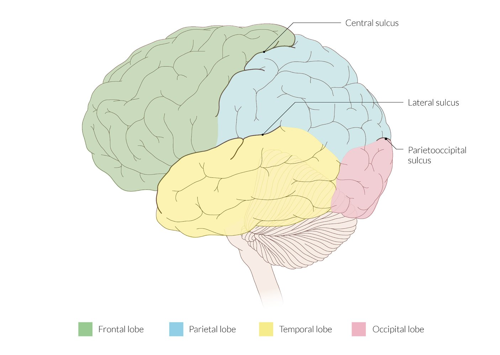

Lateral view of the cerebral lobes

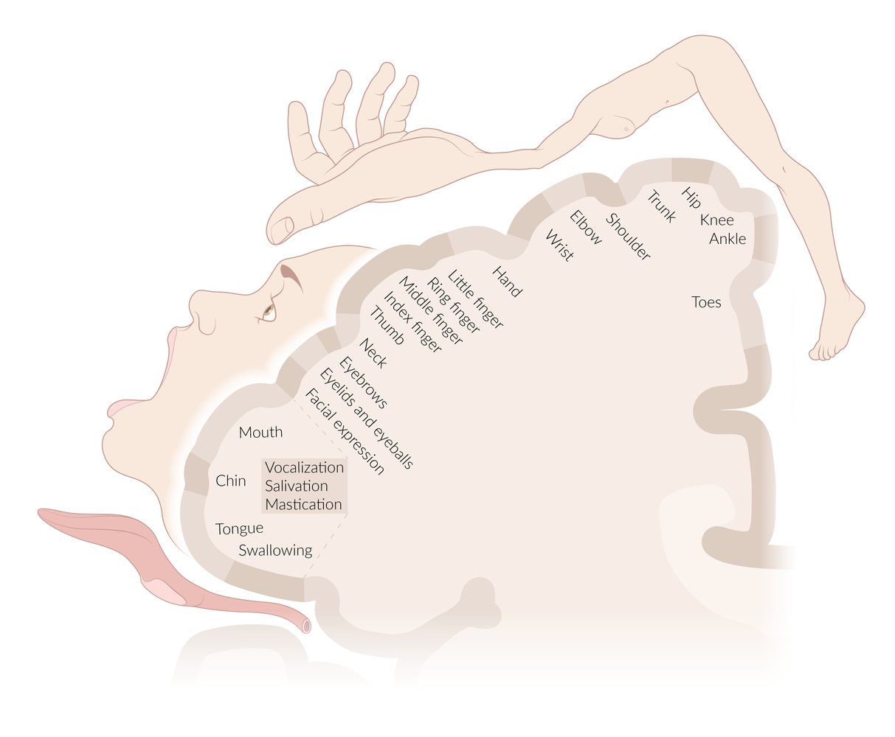

Motor homunculus

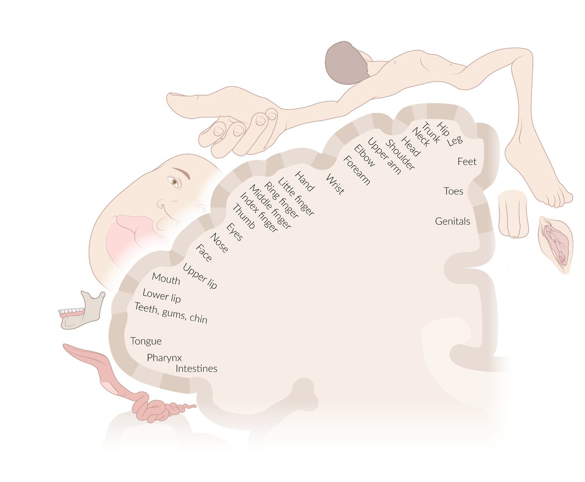

Sensory homunculus

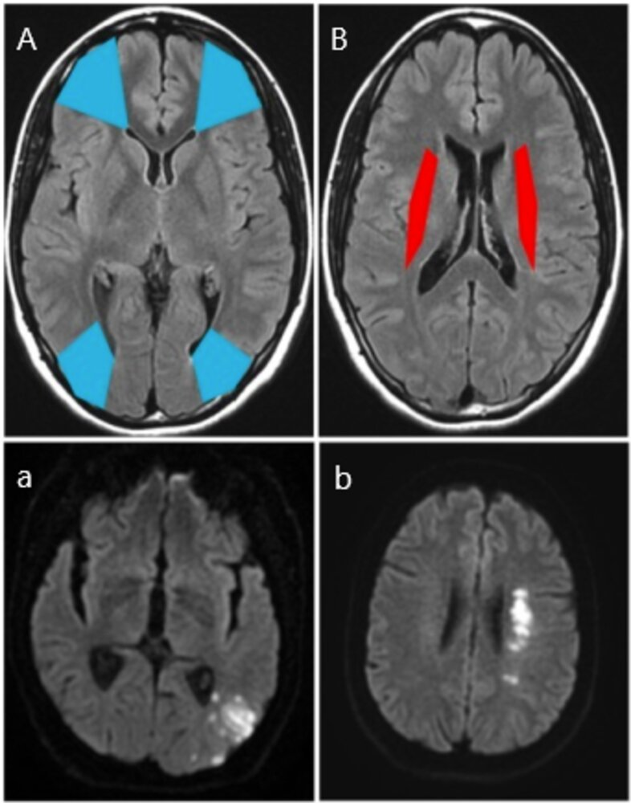

Cerebral watershed areas

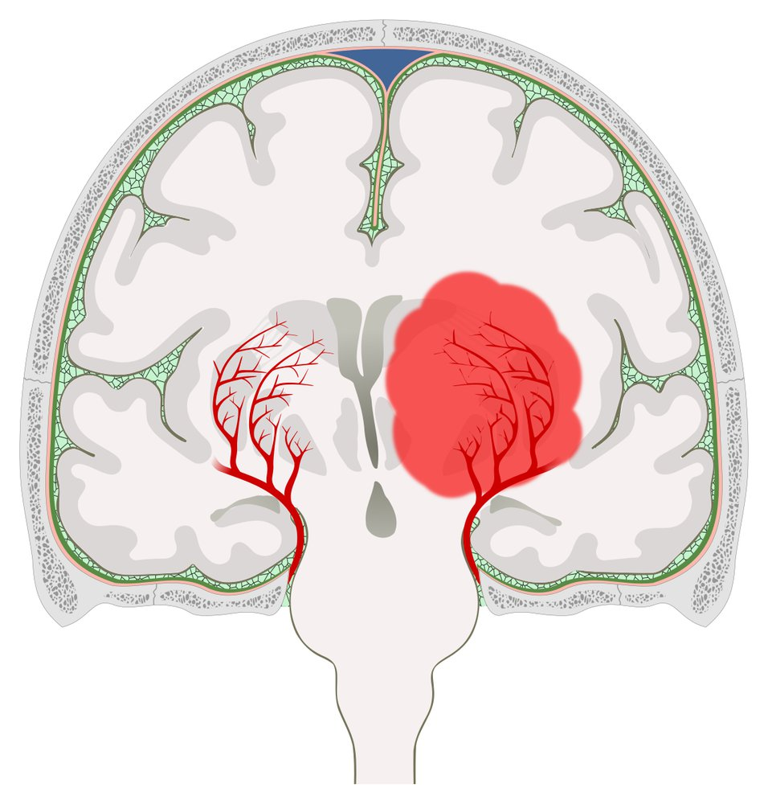

Basal ganglia hemorrhage

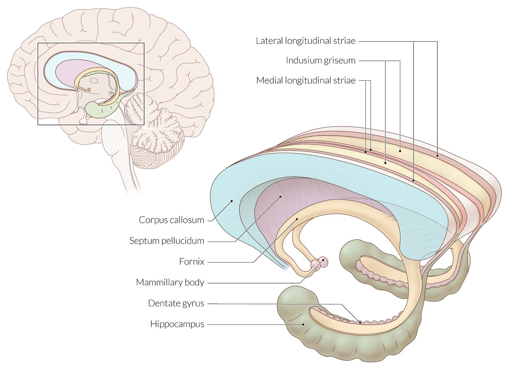

Hippocampus, corpus callosum, and fornix

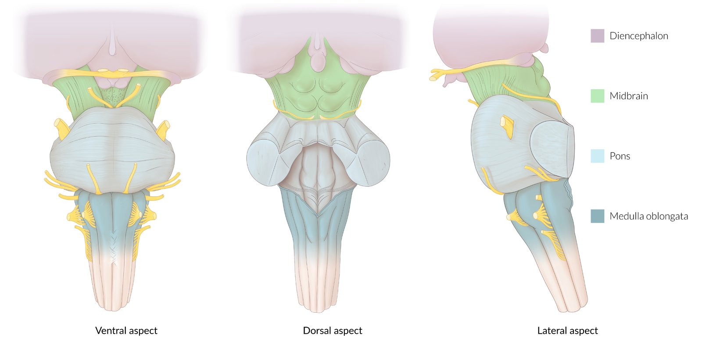

Brainstem and diencephalon

---

## Overview of intracranial hemorrhage

The following table focuses on traumatic causes of <u>intracranial hemorrhage</u>, which all have nontraumatic causes as well. See “<u>Overview of stroke</u>” for a comparison of nontraumatic cerebral <u>ischemia</u> and <u>intracranial hemorrhage</u>.

| Overview of intracranial hemorrhage |  |  |  |  |
| --- | --- | --- | --- | --- |
|  | <u>Epidural hematoma</u> | <u>Subdural hematoma</u> | <u>Subarachnoid hemorrhage</u> | <u>Intracerebral hemorrhage</u> |
| Etiology |   * Traumatic <u>EDH</u> (most common)  * Arterial bleed: rupture of <u>middle meningeal artery</u>  * Venous bleed (rare): injury to the <u>dural venous sinuses</u>  * Nontraumatic <u>EDH</u> (rare): infections, coagulopathies, dural vascular <u>malformation</u>, <u>metastases</u>    |   * Venous bleed: rupture of <u>bridging veins</u>  * <u>Acute SDH</u>: typically traumatic in origin  * <u>Chronic SDH</u>: can be traumatic or nontraumatic (e.g., <u>cerebral atrophy</u>)    |   * <u>Traumatic SAH</u>: most common cause  * Nontraumatic <u>SAH</u>:  * Ruptured <u>intracranial aneurysm</u>  * <u>Arteriovenous malformation</u> (rare) and other causes (see "<u>Subarachnoid hemorrhage</u>")    |   * <u>Traumatic ICH</u>  * Nontraumatic <u>ICH</u> due to rupture secondary to:  * <u>Hypertension</u>  * <u>Cerebral amyloid angiopathy</u>  * <u>AVM</u> (especially in children) and other causes (see "<u>Intracerebral hemorrhage</u>")    |
| Characteristic clinical features |   * <u>Loss of consciousness</u>  * Often followed by a <u>lucid interval</u>, before the onset of <u>focal neurological deficits</u>, signs of <u>↑ ICP</u>    |   * Signs of <u>elevated ICP</u> (e.g., <u>headache</u>)  * <u>Changes in mental status</u>  * <u>Lucid interval</u>  [[66]](https://coursology-qbank.com/amboss/article/-tbDTv)    |   * <u>Traumatic SAH</u>: symptoms largely depend on severity of <u>TBI</u> (e.g., <u>focal neurologic deficits</u>, <u>coma</u>)  * Nontraumatic <u>SAH</u>  * Sudden, severe <u>headache</u>  * <u>Loss of consciousness</u>    |   * <u>Headache</u>  * <u>Focal neurologic deficits</u>  * <u>Loss of consciousness</u>    |
| Typical findings on noncontrast CT head |    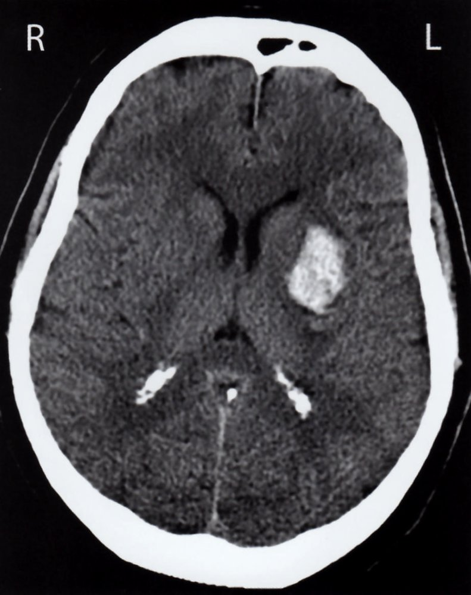  Epidural hematoma     * Biconvex, <u>hyperdense</u> lesion located between the <u>brain</u> and the <u>calvarium</u>  * Lesion can cross the midline  * Lesion is limited by <u>cranial suture lines</u>     |    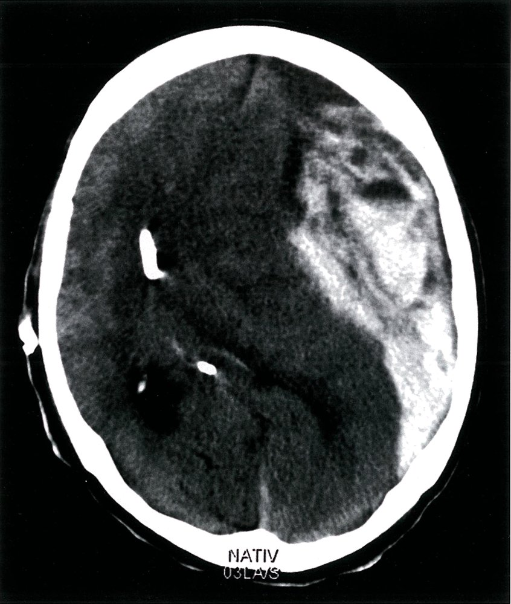  Subdural hematoma     * Crescent-shaped, <u>concave</u>, <u>hyperdense</u> <u>extraaxial lesion</u>  * Lesion does not cross the midline  * Lesion can cross <u>cranial suture lines</u>     |    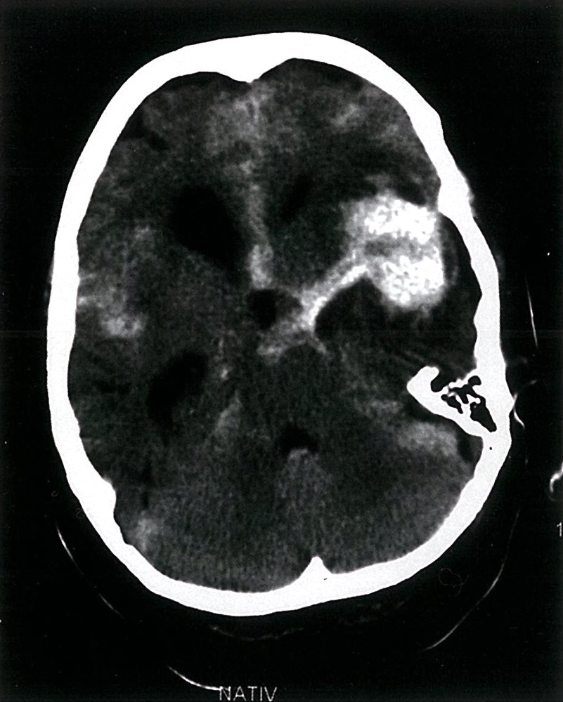  Ruptured middle cerebral artery aneurysm     * Traumatic: depends on the underlying trauma [[67]](https://coursology-qbank.com/amboss/article/9UcN2b0)  * Localized, <u>hyperdense</u> signals (e.g., within sulci)  * Findings associated with the underlying trauma (e.g., <u>skull fracture</u>, <u>contusion</u>)  * Nontraumatic: Extensive area of <u>hyperdense</u> signals around the <u>circle of Willis</u> (most common location)     |    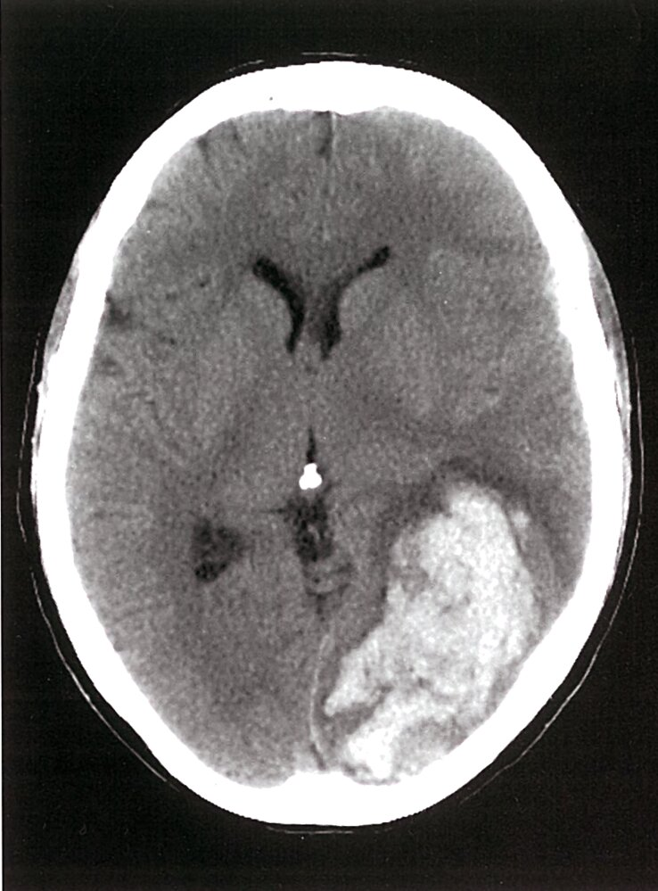  Intracerebral hematoma     * <u>Traumatic ICH</u>: usually multiple intraparenchymal <u>hematomas</u> or hemorrhagic <u>contusions</u> [[36]](https://coursology-qbank.com/amboss/article/7ab4NH)  * Nontraumatic <u>ICH</u>: solitary <u>hyperdense</u> lesion, surrounded by <u>hypodense</u> <u>edema</u>     |
| Management |  * <u>Neuroprotective measures</u> (↓ <u>ICP</u>, ↓ metabolic demand via ↓ temperature, etc.)   |  |  |  |
|  * Surgical intervention: urgent <u>craniotomy</u>, possibly initially <u>skull trephination</u>   * <u>Hematoma</u> evacuation  * Trauma repair   |  |   * Medical therapy to reduce <u>delayed cerebral ischemia</u>: often sufficient in patients with <u>mild TBI</u> and small, isolated <u>SAH</u>  [[68]](https://coursology-qbank.com/amboss/article/LPXw2y)  * Possibly surgical intervention (e.g., <u>hematoma</u> evacuation, endovascular repair for <u>aneurysmal</u> or <u>AVM</u>)    |  * Possible surgical intervention for acute <u>ICP management</u>, or <u>hematoma</u>/clot evacuation   * <u>Craniotomy</u> or minimally invasive <u>surgery</u>  * For <u>AVM</u> or <u>aneurysm</u>: endovascular repair)   |  |

---