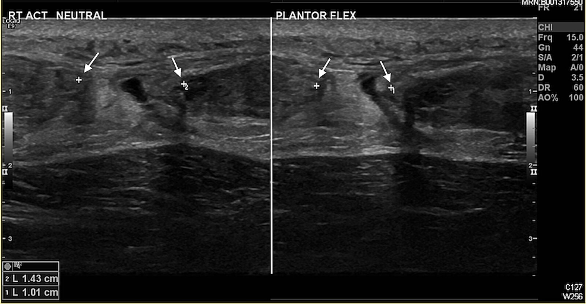

# Achilles tendon rupture

*Categories: Clinical knowledge > Surgery > Trauma and orthopedic surgery > Lower extremity > Achilles tendon rupture*

[Original Article Link](https://coursology-qbank.com/amboss/article/p30Ljf)

---

## Summary

The <u>Achilles tendon</u> attaches the converged <u>soleus</u> and <u>gastrocnemius</u> muscles to the <u>calcaneus</u>. <u>Achilles tendon</u> ruptures most often result from indirectly transmitted forces during physical activity and primarily affect men aged 30–50 years. Preexisting degenerative conditions and certain medications (e.g., <u>fluoroquinolones</u>) have been linked with an increased risk of <u>Achilles tendon</u> rupture. Symptoms include a sudden onset of sharp <u>pain</u> in the <u>tendon</u> at the back of the ankle, usually accompanied by a popping or snapping sound and/or sensation and a weakened ability or inability to <u>plantar flex</u>. Diagnosis is clinical and may be confirmed on <u>ultrasound</u> or <u>MRI</u>. Management options include conservative and surgical treatments. <u>Surgery</u> is associated with a lower risk of <u>Achilles tendon</u> re-rupture.

---

## Etiology

* Mechanism of injury [[2]](https://coursology-qbank.com/amboss/article/AN1Rdh0)[[3]](https://coursology-qbank.com/amboss/article/4Od3sJ0)

* Indirectly transmitted forces during physical activity (e.g., tennis, basketball)

* Rarely, direct trauma or spontaneous rupture due to chronic <u>Achilles tendinopathy</u> or degenerative changes

* <u>Risk factors</u> [[4]](https://coursology-qbank.com/amboss/article/uPdpgJ0)

* Preexisting degenerative conditions

* Poor <u>physical conditioning</u> [[5]](https://coursology-qbank.com/amboss/article/kOdmsJ0)

* Medications

* <u>Glucocorticoids</u>, e.g., local injections, systemic

* <u>Fluoroquinolones</u> [[6]](https://coursology-qbank.com/amboss/article/nIX7Wz)

* <u>Bisphosphonates</u>

* <u>Diabetes</u>

* <u>Achilles tendinopathy</u>

* <u>Hyperparathyroidism</u>

* <u>Renal failure</u>

---

## Clinical features

* Signs and symptoms [[2]](https://coursology-qbank.com/amboss/article/AN1Rdh0)

* Popping or snapping sound and/or sensation when the injury occurs

* Sudden, severe <u>pain</u> in the <u>posterior</u> aspect of ankle and foot

* Inability to bear weight

* Weakened ability or inability to <u>plantar flex</u> the affected ankle

* <u>Physical examination</u> [[2]](https://coursology-qbank.com/amboss/article/AN1Rdh0)[[5]](https://coursology-qbank.com/amboss/article/kOdmsJ0)

* Calf swelling (e.g., <u>hematoma</u>)

* Palpable interruption of the affected <u>Achilles tendon</u>

* Matles test: With the patient <u>prone</u> and the knees flexed to 90°, observe the ankles.

* Normal: both ankles at same angle

* Rupture: increased <u>dorsiflexion</u> of the affected ankle

* Thompson test: With the patient <u>prone</u> and feet off the end of the bed, squeeze the calf and observe the ankle. 

* Normal: passive <u>plantar flexion</u>

* Rupture: absent passive <u>plantar flexion</u>

> [!TIP]
> Normal <u>plantar flexion</u> does not rule out a suspected <u>Achilles tendon</u> tear. Always compare the symptomatic side with the uninjured side. [[2]](https://coursology-qbank.com/amboss/article/AN1Rdh0)

---

## Diagnosis

### Clinical evaluation [[7]](https://coursology-qbank.com/amboss/article/9PdNSJ0)

<u>Clinical diagnosis</u> of <u>Achilles tendon</u> rupture is based on ≥ 2 of the following examination findings:

* Abnormal <u>Thompson test</u>

* Abnormal <u>Matles test</u>

* Decreased <u>plantar flexion</u> strength

* Palpable <u>Achilles tendon</u> gap

> [!WARNING]
> More than 20% of acute <u>Achilles tendon</u> ruptures are missed and subsequently become chronic ruptures. [[8]](https://coursology-qbank.com/amboss/article/CPdqSJ0)

### Imaging [[2]](https://coursology-qbank.com/amboss/article/AN1Rdh0)[[9]](https://coursology-qbank.com/amboss/article/xPdESJ0)

Consider imaging to confirm the diagnosis and/or exclude other suspected pathologies (e.g., <u>fracture</u>).

* Initial testing: <u>x-ray</u>

* Mainly used to exclude suspected <u>fractures</u>

* Potential findings include:

* Opacification of the space <u>anterior</u> to the <u>Achilles tendon</u>

* Thickening or irregular contour of <u>Achilles tendon</u>

* Confirmatory studies: <u>ultrasound</u> and/or <u>MRI</u>

* Can distinguish partial- and full-thickness tears

* <u>Ultrasound</u> findings include <u>hypoechoic</u> gaps between torn <u>tendon</u> fibers and/or <u>hyperechoic</u> <u>hematoma</u>.

* <u>MRI</u> findings include heterogenous signal between torn <u>tendon</u> fibers and/or a fluid-filled gap in full-thickness rupture.

Achilles tendon rupture

---

## Treatment

<u>Achilles tendon</u> ruptures may be <u>managed conservatively</u> or surgically; there is no consensus on which treatment modality is optimal. Treatment decisions are based on patient factors (e.g., age, comorbidities) and made in consultation with orthopedics. [[2]](https://coursology-qbank.com/amboss/article/AN1Rdh0)[[7]](https://coursology-qbank.com/amboss/article/9PdNSJ0)

### Initial management [[2]](https://coursology-qbank.com/amboss/article/AN1Rdh0)

* Provide <u>oral analgesia</u>, e.g., <u>acetaminophen</u>, <u>NSAIDs</u>.

* Immobilize the affected foot in either of the following:

* <u>Walking boot</u> with maximal heel lift

* <u>Splint</u> with the foot in <u>plantar flexion</u> (e.g., in a <u>posterior ankle splint</u>)

* Establish <u>non-weight-bearing status</u>.

* Refer to orthopedics.

### <u>Conservative management</u> [[5]](https://coursology-qbank.com/amboss/article/kOdmsJ0)[[10]](https://coursology-qbank.com/amboss/article/9ldN_J0)[[11]](https://coursology-qbank.com/amboss/article/Cldq_J0)

* Initial <u>immobilization</u> in <u>walking boot</u> or cast for 3–4 weeks

* Serial <u>casting</u> with gradual reduction of <u>plantar flexion</u> for a further 4–8 weeks

### Surgical management [[7]](https://coursology-qbank.com/amboss/article/9PdNSJ0)

* Used with caution in patients with increased risk for surgical complications (e.g., <u>diabetes</u>, <u>obesity</u>, <u>peripheral vascular disease</u>, age ≥ 65 years)

* Operative techniques include open, limited open, and percutaneous <u>tendon</u> repair.

---