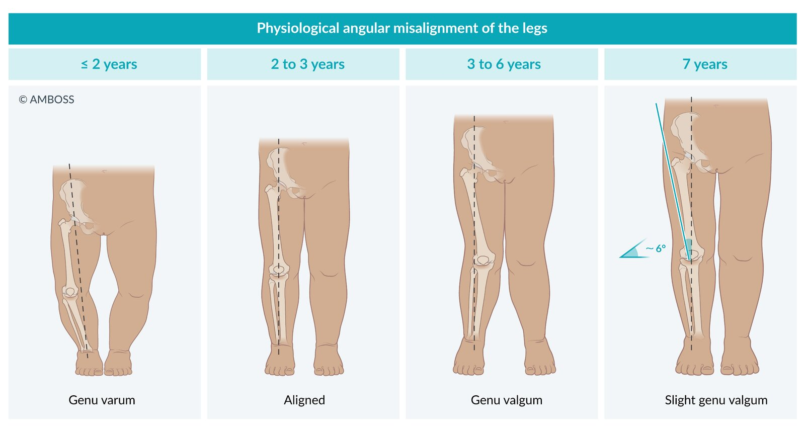
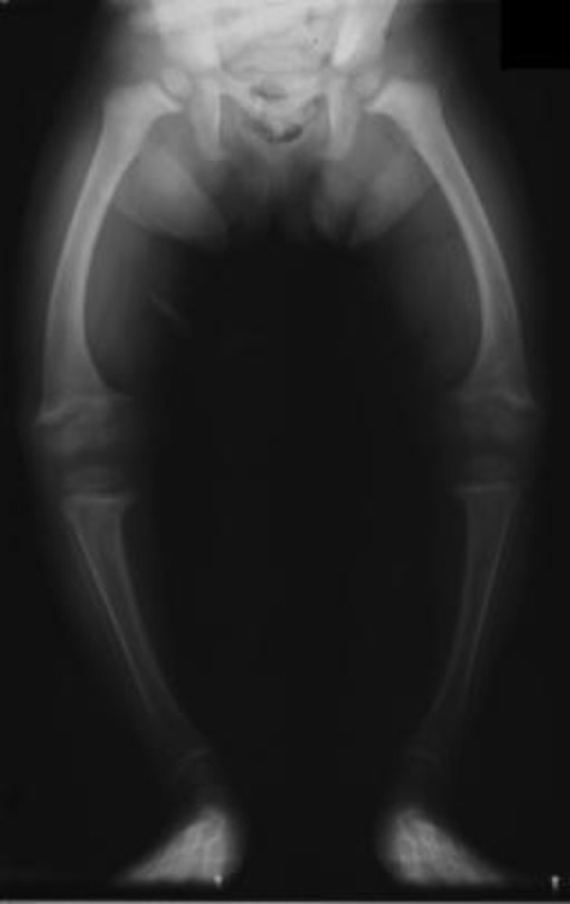
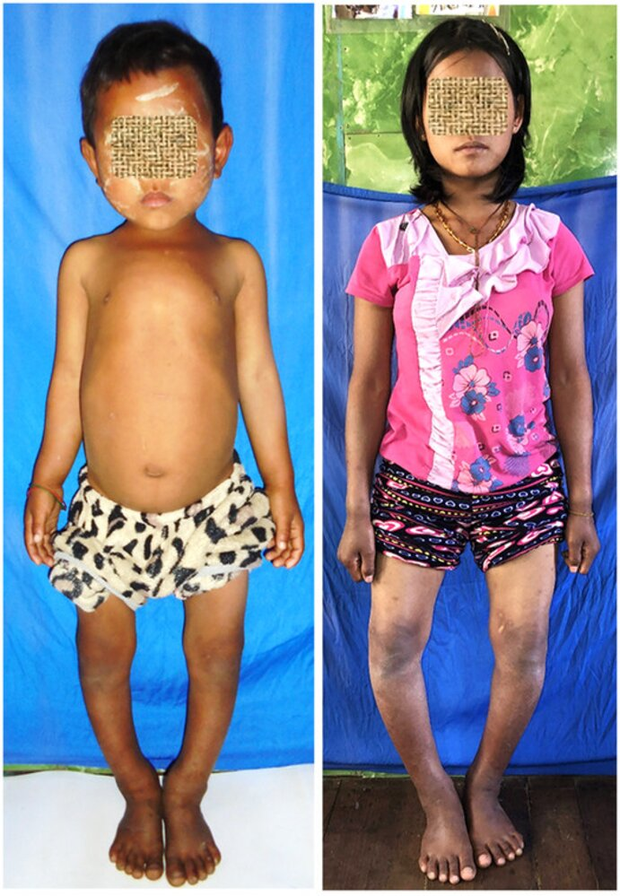

# Angular deformities of the lower extremities

*Categories: Clinical knowledge > Surgery > Trauma and orthopedic surgery > Lower extremity > Angular deformities of the lower extremities*

[Original Article Link](https://coursology-qbank.com/amboss/article/ns07vh)

---

## Summary

Angular deformities of the lower extremities occur when the legs are in a nonneutral alignment. Types include <u>genu valgum</u> (<u>knock-knees</u>) and <u>genu varum</u> (<u>bow legs</u>). Angular deformities are part of physiologic development, but pathologic deformities (e.g., due to trauma, metabolic disease, <u>skeletal dysplasias</u>, <u>neoplasms</u>) may also occur. Evaluation includes a history, <u>physical examination</u>, and manual <u>measurements of leg alignment</u>. Physiologic causes are <u>diagnosed clinically</u>. Further evaluation with imaging and/or <u>laboratory studies</u> is reserved for individuals with suspected <u>pathologic angular leg deformities</u>. Physiologic deformities are typically <u>self-limited</u> and managed with watching waiting. Management of pathologic deformities includes treatment of the underlying cause and <u>surgery</u> when indicated.

This article covers <u>genu valgum</u> and <u>genu varum</u>; <u>genu recurvatum</u> is covered separately.

---

## Overview

* Angular misalignment of the legs is seen in all children during physiologic development. ; [[1]](https://coursology-qbank.com/amboss/article/ocd0WK0)

* Most children are born with a varus alignment that persists through 2 years of age.

* Leg alignment then briefly becomes neutral before proceeding to valgus alignment from 3 to 6 years of age.

* From 7 or 8 years of age, alignment is neutral or mildly valgus (∼ 6 degrees).

* Suspect <u>pathologic causes of angular leg deformities</u> in patients with either of the following:

* Persistent deformity

* <u>Genu varum</u> ≥ 2 years of age [[2]](https://coursology-qbank.com/amboss/article/lbdvFo0)[[3]](https://coursology-qbank.com/amboss/article/I_dYps0)

* <u>Genu valgum</u> ≥ 8 years of age [[1]](https://coursology-qbank.com/amboss/article/ocd0WK0)[[2]](https://coursology-qbank.com/amboss/article/lbdvFo0)

* <u>Clinical features of pathologic angular leg deformities</u>

|  Overview of angular deformities of the lower extremities [[2]](https://coursology-qbank.com/amboss/article/lbdvFo0)  |  |  |
| --- | --- | --- |
|  |  Genu varum (<u>bow legs</u>)  |  Genu valgum (<u>knock-knees</u>) |
|  Physiologic age range    |  * <u>Birth</u> to 2 years of age   |  * 3–7 years of age [[1]](https://coursology-qbank.com/amboss/article/ocd0WK0)   |
|  Pathologic causes of angular leg deformities [[2]](https://coursology-qbank.com/amboss/article/lbdvFo0)[[4]](https://coursology-qbank.com/amboss/article/OC1IHQ0)  |   * Trauma  * <u>Skeletal dysplasias</u>  * <u>Malignant bone tumors</u>  * <u>Benign bone tumors</u>  * <u>Osteomyelitis</u>  * Metabolic disorders, e.g.:  * <u>Rickets</u>  * <u>Mucopolysaccharidosis</u> (<u>genu valgum</u> only) [[5]](https://coursology-qbank.com/amboss/article/IKaY3l)  * <u>Blount disease</u> (<u>genu varum</u> only)    |  |
| Clinical features |  * Varus (<u>medial</u>) misalignment of the knee   |  * Valgus (<u>lateral</u>) misalignment of the knee   |
|  Diagnostics    |   * <u>Physiologic genu varum</u> and <u>genu valgum</u> are <u>diagnosed clinically</u>.  * Perform diagnostic studies if there are features of <u>pathologic angular leg deformities</u>, e.g.:  * Unilateral deformity  * Gait abnormalities  * Progression or persistence of deformity beyond physiologic expectation [[4]](https://coursology-qbank.com/amboss/article/OC1IHQ0)[[6]](https://coursology-qbank.com/amboss/article/gXdFxo0)    |  |
| Management |   * Physiologic: close observation and reassurance  * Pathologic: treatment of the underlying cause; <u>surgery</u> if indicated    |  |

Lower limb alignment

Genu varum and genu valgum

Genu valgum

Rickets of the lower extremities

Tibial bowing in rickets

---

## Management

Management is based on the underlying cause.

### <u>Physiologic angular leg deformities</u> [[1]](https://coursology-qbank.com/amboss/article/ocd0WK0)[[2]](https://coursology-qbank.com/amboss/article/lbdvFo0)

* Provide reassurance that most physiologic deformities are <u>self-limited</u>.  [[4]](https://coursology-qbank.com/amboss/article/OC1IHQ0)

* Monitor at subsequent visits.  [[1]](https://coursology-qbank.com/amboss/article/ocd0WK0)[[15]](https://coursology-qbank.com/amboss/article/i3dJRp0)

* Refer patients with worsening or persistent deformities to orthopedics  [[2]](https://coursology-qbank.com/amboss/article/lbdvFo0)[[3]](https://coursology-qbank.com/amboss/article/I_dYps0)

### <u>Pathologic angular leg deformities</u> [[1]](https://coursology-qbank.com/amboss/article/ocd0WK0)[[2]](https://coursology-qbank.com/amboss/article/lbdvFo0)

* Treat underlying <u>pathologic causes of angular leg deformity</u>; consider specialist referral.

* Refer to orthopedics for surgical evaluation.

---