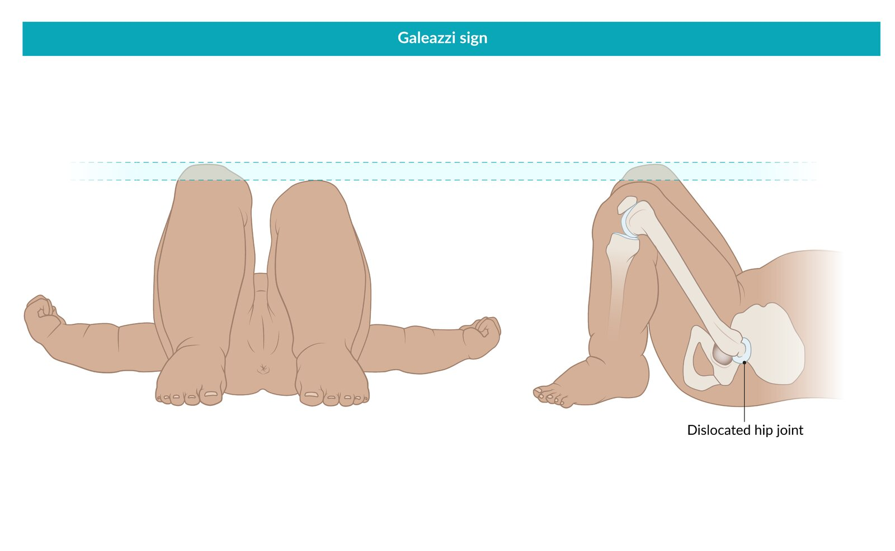
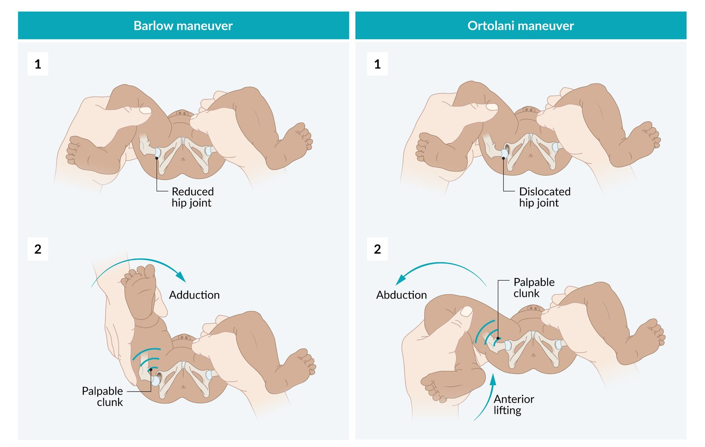

# Developmental dysplasia of the hip

*Categories: Clinical knowledge > Surgery > Trauma and orthopedic surgery > Lower extremity > Developmental dysplasia of the hip*

[Original Article Link](https://coursology-qbank.com/amboss/article/NQ0-wf)

---

## Summary

Developmental <u>dysplasia</u> of the hip (DDH) encompasses a range of developmental hip abnormalities: hip instability, subluxation or <u>dislocation</u> of the femoral head, and <u>acetabular</u> <u>dysplasia</u>. The etiology is not fully understood, but <u>breech presentation</u> and <u>family history</u> are the most important <u>risk factors</u>. <u>Infants</u> < 3 months of age are typically asymptomatic, and DDH is diagnosed with selective screening imaging for <u>infants</u> with <u>risk factors for DDH</u> and routine <u>infant hip examination</u> in all <u>infants</u>. Imaging should also be ordered for individuals with hip instability, limited or asymmetric <u>abduction</u> after 4 weeks of age, and <u>leg length discrepancy</u> on <u>physical examination</u>. Imaging modalities include hip <u>ultrasound</u> and hip <u>x-ray</u>. Children with <u>physical examination</u> and/or abnormal imaging should be referred to orthopedics for management. The goals of treatment are to reduce the femoral head into the <u>acetabulum</u> as early as possible to allow normal development of the <u>hip joint</u>. An <u>abduction</u> <u>brace</u> is used for <u>infants</u> < 6 months of age, while surgical repair is typically recommended for those > 6 months of age. DDH due to improper swaddling may be prevented by <u>healthy hip swaddling</u>.

---

## Epidemiology

* <u>Incidence</u>: most common congenital abnormality of skeletal development [[1]](https://coursology-qbank.com/amboss/article/C80qK3)

* Hip instability: 1 in 100 births

* <u>Dislocation</u>: 1 in 1000 births

* Sex: : <u>♀</u> > <u>♂</u> (4–5:1) [[2]](https://coursology-qbank.com/amboss/article/tUXXUx)

* Race/ethnicity [[1]](https://coursology-qbank.com/amboss/article/C80qK3)

* High <u>incidence</u> in Native American, Eastern European, and Sami populations

* Low <u>incidence</u> in Chinese and Black populations

Epidemiological data refers to the US, unless otherwise specified.

---

## Etiology

* The exact etiology of DDH remains unknown.

* Several <u>risk factors</u> have been identified: [[2]](https://coursology-qbank.com/amboss/article/tUXXUx)[[3]](https://coursology-qbank.com/amboss/article/Zr1ZfR0)[[4]](https://coursology-qbank.com/amboss/article/eYdxLo0)

* <u>Family history</u>

* <u>Breech presentation</u>

* History of tight swaddling of the lower extremities

* A history of prior hip instability that has resolved

> [!TIP]
> There is mixed evidence on inadequate intrauterine space for the fetus (e.g., <u>oligohydramnios</u>, first-born child, twins, large <u>birth</u> weight) and the associated risk for DDH. [[4]](https://coursology-qbank.com/amboss/article/eYdxLo0)[[5]](https://coursology-qbank.com/amboss/article/M7dMmr0)[[6]](https://coursology-qbank.com/amboss/article/A8dR670)

---

## Pathophysiology

Children with DDH have varying degrees of abnormal hip growth such as hip instability, hip subluxation, and/or <u>hip dislocation</u>, which result in: [[7]](https://coursology-qbank.com/amboss/article/dTXopx)

* <u>Hypertrophy</u> of <u>pulvinar</u> fat in the <u>acetabulum</u>, <u>transverse acetabular ligament</u>, and/or <u>ligamentum teres</u>

* <u>Acetabular</u> <u>dysplasia</u>

---

## Clinical features

### Signs and symptoms [[3]](https://coursology-qbank.com/amboss/article/Zr1ZfR0)[[6]](https://coursology-qbank.com/amboss/article/A8dR670)[[8]](https://coursology-qbank.com/amboss/article/5qdi_I0)

* Typically asymptomatic in <u>infants</u> < 3 months of age [[3]](https://coursology-qbank.com/amboss/article/Zr1ZfR0)[[4]](https://coursology-qbank.com/amboss/article/eYdxLo0)

* Difficulty opening the hips (e.g., when changing diapers), typically after 3 months of age

* Uneven leg length;  and, if ambulatory, a compensatory gait;  (e.g., limp, unilateral <u>toe walking</u>) [[3]](https://coursology-qbank.com/amboss/article/Zr1ZfR0)[[9]](https://coursology-qbank.com/amboss/article/Xqd9CI0)[[10]](https://coursology-qbank.com/amboss/article/cqdaxI0)

* Verbal children may indicate hip, knee, or <u>anterior</u> thigh <u>pain</u>.

> [!TIP]
> Previously undiagnosed DDH may first manifest with <u>clinical features of hip osteoarthritis</u> in adults. [[9]](https://coursology-qbank.com/amboss/article/Xqd9CI0)[[11]](https://coursology-qbank.com/amboss/article/1qd2xI0)

### <u>Physical examination</u> [[3]](https://coursology-qbank.com/amboss/article/Zr1ZfR0)[[6]](https://coursology-qbank.com/amboss/article/A8dR670)

* Asymmetrical gluteal folds, inguinal folds, and/or thigh folds (may be a normal finding)

* Hip instability:  frankly <u>dislocated</u> hip or positive <u>instability maneuvers for DDH</u>

* Limited or asymmetric hip <u>abduction</u>, possibly with <u>contractures</u>  [[3]](https://coursology-qbank.com/amboss/article/Zr1ZfR0)

* <u>Leg length discrepancy</u>, which can cause <u>functional scoliosis</u> [[12]](https://coursology-qbank.com/amboss/article/Bqdz0r0)

* Positive Galeazzi sign: unequal knee height when lying <u>supine</u> with hips and knees flexed

* Unequal leg lengths on measurement

* Signs of bilateral DDH, which can manifest with: [[10]](https://coursology-qbank.com/amboss/article/cqdaxI0)

* No asymmetrical <u>skin</u> folds, unequal leg lengths, and/or <u>Galeazzi sign</u> [[12]](https://coursology-qbank.com/amboss/article/Bqdz0r0)

* Abnormal <u>Klisic test</u> bilaterally [[13]](https://coursology-qbank.com/amboss/article/z8dr670)

* Increased lumbar <u>lordosis</u>

* <u>Waddling gait</u>

> [!TIP]
> In bilateral DDH, asymmetrical <u>skin</u> folds, <u>Galeazzi sign</u>, and/or uneven leg lengths may be absent. [[12]](https://coursology-qbank.com/amboss/article/Bqdz0r0)

> [!TIP]
> The left hip is more commonly affected by DDH than the right hip; <u>left occiput anterior</u> positioning in utero may limit fetal <u>abduction</u> of the left hip. [[4]](https://coursology-qbank.com/amboss/article/eYdxLo0)

Galeazzi sign

---

## Screening

* Modalities [[3]](https://coursology-qbank.com/amboss/article/Zr1ZfR0)[[6]](https://coursology-qbank.com/amboss/article/A8dR670)

* Infant hip examination

* Technique: visual inspection, <u>DDH instability maneuvers</u>, hip <u>range of motion</u>, and <u>Galeazzi test</u> to assess for <u>clinical features of DDH</u>

* Timing: at each <u>well-child visit</u> through 6–9 months of age

* Imaging: Obtain <u>imaging for DDH</u> for <u>infants</u> with <u>risk factors for DDH</u>.

* <u>Breech presentation</u>: Obtain a hip <u>ultrasound</u> at 6 weeks and a hip <u>x-ray</u> at 6 months. [[6]](https://coursology-qbank.com/amboss/article/A8dR670)

* Other <u>risk factors</u>: Obtain age-appropriate <u>imaging for DDH</u> once before 6 months of age (ideally at 4–6 weeks of age). [[3]](https://coursology-qbank.com/amboss/article/Zr1ZfR0)[[6]](https://coursology-qbank.com/amboss/article/A8dR670)[[14]](https://coursology-qbank.com/amboss/article/dqdoxI0)

* If abnormalities are detected: Proceed to “Diagnosis” and “Treatment.”

> [!TIP]
> While some countries perform universal hip <u>ultrasound</u> screening for DDH, US guidelines recommend universal <u>infant hip physical examination</u> and, in <u>infants</u> with <u>risk factors for DDH</u>, selective imaging. [[14]](https://coursology-qbank.com/amboss/article/dqdoxI0)

---

## Diagnosis

### Approach [[3]](https://coursology-qbank.com/amboss/article/Zr1ZfR0)[[6]](https://coursology-qbank.com/amboss/article/A8dR670)[[14]](https://coursology-qbank.com/amboss/article/dqdoxI0)

* Most cases of DDH are detected with screening (i.e., <u>infant hip examination</u> and/or risk-based imaging).

* Obtain diagnostic imaging at 4–6 weeks of age (or at presentation if older) for any feature highly suggestive of DDH: 

* Hip instability: frankly <u>dislocated</u> hip, positive <u>instability maneuvers for DDH</u> (even if resolved)

* Limited or asymmetric <u>abduction</u> after 4 weeks of age

* <u>Leg length discrepancy</u> (e.g., positive <u>Galeazzi sign</u>)

* Consider imaging for patients with equivocal findings and/or if the caregiver is concerned.

> [!TIP]
> Individuals with clinical DDH can be referred to orthopedics before imaging is performed. [[3]](https://coursology-qbank.com/amboss/article/Zr1ZfR0)[[6]](https://coursology-qbank.com/amboss/article/A8dR670)

### Instability maneuvers for DDH [[3]](https://coursology-qbank.com/amboss/article/Zr1ZfR0)[[6]](https://coursology-qbank.com/amboss/article/A8dR670)

The following provocative tests are recommended in <u>infants</u> ≤ 6 months of age; <u>sensitivity</u> decreases after 3 months of age. Positive findings indicate hip instability. [[3]](https://coursology-qbank.com/amboss/article/Zr1ZfR0)

* Ortolani test: the most important <u>physical examination</u> to detect DDH in <u>newborns</u> [[3]](https://coursology-qbank.com/amboss/article/Zr1ZfR0)

* Method: The hips and knees are flexed and <u>abducted</u> while applying <u>anterior</u> pressure to the back of the femoral trochanter.

* Positive finding: palpable <u>anterior</u> movement or clunk as a <u>dislocated</u> hip reduces into the hip socket

* Barlow test (controversial) ;  [[3]](https://coursology-qbank.com/amboss/article/Zr1ZfR0)

* Method: The hips and knees are gently flexed and <u>adducted</u>; do not apply <u>posterior</u> pressure.

* Positive finding: palpable <u>posterior</u> movement or clunk as a reduced hip subluxes or dislocates out of the hip socket

> [!NOTE]
> Remember to Open (Ortolani) the hips and bring them Back (Barlow) together.

> [!TIP]
> High-pitched hip clicks do not indicate hip instability and may result from normal ligamentous laxity in young <u>infants</u>. [[3]](https://coursology-qbank.com/amboss/article/Zr1ZfR0)

Galeazzi sign

Barlow and Ortolani maneuvers in developmental dysplasia of the hip (DDH)

### Imaging for DDH [[3]](https://coursology-qbank.com/amboss/article/Zr1ZfR0)[[4]](https://coursology-qbank.com/amboss/article/eYdxLo0)[[14]](https://coursology-qbank.com/amboss/article/dqdoxI0)

* Bilateral <u>ultrasound</u> hip (static and dynamic)

* Age: 4 weeks–6 months [[3]](https://coursology-qbank.com/amboss/article/Zr1ZfR0)[[4]](https://coursology-qbank.com/amboss/article/eYdxLo0)

* Findings

* Frank <u>dislocation</u>

* Alpha angle < 60°  [[4]](https://coursology-qbank.com/amboss/article/eYdxLo0)

* Roundness of the bony <u>acetabular</u> promontory

* Inducible subluxation or <u>dislocation</u>

* Bilateral hip <u>x-ray</u> (AP and/or frog-leg)

* Age: ≥ 4 months (after <u>cartilage</u> begins to ossify) [[3]](https://coursology-qbank.com/amboss/article/Zr1ZfR0)[[4]](https://coursology-qbank.com/amboss/article/eYdxLo0)

* Findings 

* Frank <u>dislocation</u>

* Abnormal <u>acetabular angle</u> (i.e., increased <u>acetabular index</u> for age)

* Reduced <u>acetabular</u> coverage of the femoral head (i.e., decreased <u>center-edge angle</u>)

* Early-onset <u>osteoarthritis</u> in adults  [[15]](https://coursology-qbank.com/amboss/article/UqdbBI0)

* Radiological DDH classifications are often reported and are used to grade severity.  [[16]](https://coursology-qbank.com/amboss/article/eqdxxI0)[[17]](https://coursology-qbank.com/amboss/article/_8d5670)

> [!TIP]
> Between 4 and 6 months of age, either a hip <u>ultrasound</u> or hip <u>x-ray</u> may be performed. [[4]](https://coursology-qbank.com/amboss/article/eYdxLo0)[[6]](https://coursology-qbank.com/amboss/article/A8dR670)[[14]](https://coursology-qbank.com/amboss/article/dqdoxI0)

---

## Treatment

### Approach [[3]](https://coursology-qbank.com/amboss/article/Zr1ZfR0)[[6]](https://coursology-qbank.com/amboss/article/A8dR670)

* Refer to orthopedics for any <u>feature highly suggestive of DDH</u> or if there are abnormal findings on imaging.

* For children < 4 weeks of age with isolated <u>Barlow sign</u>, consider re-examination in 4 weeks with referral if persistent.  [[3]](https://coursology-qbank.com/amboss/article/Zr1ZfR0)[[18]](https://coursology-qbank.com/amboss/article/mqdV_I0)

* Treatment is determined by a pediatric orthopedic specialist and is based on patient age and severity.

* Minor abnormalities on imaging  with normal <u>physical examination</u>: Observation may be considered.

* All other patients: Intervention is recommended.

### <u>Abduction</u> bracing [[3]](https://coursology-qbank.com/amboss/article/Zr1ZfR0)[[8]](https://coursology-qbank.com/amboss/article/5qdi_I0)[[18]](https://coursology-qbank.com/amboss/article/mqdV_I0)

* Indication: < 6 months of age

* Mechanism: positional reduction of the affected femoral head by keeping the hips in flexed <u>abduction</u> [[19]](https://coursology-qbank.com/amboss/article/3qdSyI0)

* Options: static rigid <u>splint</u>;  (e.g., von Rosen harness; ) or dynamic soft <u>splint</u> (e.g., Pavlik harness)   [[14]](https://coursology-qbank.com/amboss/article/dqdoxI0)

* Complications [[3]](https://coursology-qbank.com/amboss/article/Zr1ZfR0)[[14]](https://coursology-qbank.com/amboss/article/dqdoxI0)

* Hip disorders: <u>hip dislocation</u>, <u>Pavlik harness disease</u>, femoral epiphyseal <u>avascular necrosis</u>

* <u>Skin</u> irritation

* <u>Femoral nerve palsy</u>

> [!TIP]
> Double diapering is not an effective <u>treatment for DDH</u>. [[3]](https://coursology-qbank.com/amboss/article/Zr1ZfR0)

### Surgical repair [[8]](https://coursology-qbank.com/amboss/article/5qdi_I0)[[18]](https://coursology-qbank.com/amboss/article/mqdV_I0)

* Indications: > 6 months of age or unsuccessful <u>abduction</u> bracing

* Mechanism

* Surgical reduction or, in <u>arthroplasty</u>, replacement of the affected femoral head

* In children: subsequent <u>immobilization</u> in a <u>hip spica cast</u>

* Options

* <u>Infants</u> 6–11 months of age: <u>closed reduction</u>

* Children 12–18 months of age: <u>open reduction</u>

* Individuals > 18 months of age: <u>open reduction</u> ± <u>pelvic</u> and/or <u>femoral osteotomy</u>

* Older <u>adolescents</u> or adults: <u>total hip arthroplasty</u>

---

## Differential diagnoses

See “<u>Differential diagnosis of pediatric hip pain</u>.”

The differential diagnoses listed here are not exhaustive.

---

## Complications

* Residual <u>acetabular</u> <u>dysplasia</u>, subluxation, and/or redislocation despite treatment

* Early <u>osteoarthritis</u> in the <u>hip joint</u>

* <u>Leg length discrepancy</u> which may manifest with <u>back pain</u>, <u>functional scoliosis</u>, and/or <u>knee pain</u>

* <u>Genu valgum</u>

We list the most important complications. The selection is not exhaustive.

---

## Prognosis

* The outcomes of children with DDH who receive early treatment are generally good.  [[7]](https://coursology-qbank.com/amboss/article/dTXopx)

* The reappearance of a U shaped <u>acetabular</u> teardrop shadow (Köhler's shadow) after reduction is an indicator of good hip function.

* Factors associated with a poor prognosis [[20]](https://coursology-qbank.com/amboss/article/VTXGpx)

* Late initiation of treatment (especially after 6 months)

* Need for <u>open reduction</u>

* Failure of a first-line treatment

* Possibly, bilateral <u>hip dislocation</u>

---