# Foot deformities

*Categories: Clinical knowledge > Surgery > Trauma and orthopedic surgery > Lower extremity > Foot deformities*

[Original Article Link](https://coursology-qbank.com/amboss/article/qQ0CCf)

---

## Summary

Foot deformities are a heterogeneous group of congenital and acquired conditions involving structural abnormalities or muscular imbalances that affect the function of the foot. The deformities are classified according to clinical appearance. The most recognizable congenital foot deformity is the <u>clubfoot</u> deformity, which is characterized by <u>plantar flexion</u> of the ankle, <u>inversion of the foot</u>, and <u>adduction</u> of the forefoot. Manipulative treatment of congenital foot deformities, which requires manual repositioning and serial <u>casting</u>, should be initiated immediately after <u>birth</u>. The outcome depends primarily on whether the deformity responds well to manual repositioning (flexible deformities). Resistant deformities often require surgical correction.

See also “<u>Pes planus</u>.”

---

## Overview

|  Overview of foot deformities [[1]](https://coursology-qbank.com/amboss/article/i1YJgL)[[2]](https://coursology-qbank.com/amboss/article/Q1YugL)[[3]](https://coursology-qbank.com/amboss/article/j1Y_gL)[[4]](https://coursology-qbank.com/amboss/article/P1YWSL)  |  |  |  |
| --- | --- | --- | --- |
|  | Etiology | Characteristics | Therapy |
|  <u>Clubfoot</u>  |   * Congenital (common) or acquired (rare)  * Differential diagnosis: postural <u>clubfoot</u>    |   * Bilateral in 50% of cases  * Mechanism  * Dominant <u>posterior</u> musculature, especially <u>tibialis posterior</u>, weak peroneus muscles  * Shortened <u>Achilles tendon</u>  * Deformity: foot points downwards and inwards  * Hindfoot equinus  and varus  * Midfoot cavus  * Forefoot adductus  * Limited <u>dorsiflexion</u>  * Diagnostics  * <u>Clinical diagnosis</u> (prenatal detection via <u>ultrasound</u> possible)  * <u>X-ray</u> (can confirm <u>clinical diagnosis</u>): long axis of <u>talus</u> and <u>calcaneus</u> are parallel    |   * Manual repositioning and serial <u>casting</u>  [[5]](https://coursology-qbank.com/amboss/article/uGXpa-)  * If manual repositioning is unsuccessful: surgical release of <u>contractures</u> and correction of bone alignment    |
| <u>Equinus deformity</u> |   * Congenital  * Acquired    |   * <u>Toe walking</u>  * Unilateral equinus → <u>leg length discrepancy</u>  * bilateral equinus → impaired stability    |   * Attempt <u>manipulative therapy</u>  * Surgical correction    |
|  <u>Pes cavus</u> (high-arch) |  * Congenital or acquired   |   * High longitudinal arch  * Hindfoot varus    |   * <u>Physiotherapy</u>, <u>orthotics</u>  * If <u>conservative measures</u> are unsuccessful: surgical correction    |
| <u>Metatarsus adductus</u> |   * <u>Idiopathic</u> but associated with <u>hip dysplasia</u>  * Differential diagnosis of <u>in-toeing</u>: <u>internal tibial torsion</u>, <u>femoral antetorsion</u>    |   * <u>In-toeing</u>  * The deformity may be flexible or rigid  * <u>X-ray</u>: increased angle between the 1st and 2nd<u>metatarsal</u> bones  * Most common cause of <u>in-toeing</u> in children < 1 year of age    |   * Rarely requires treatment and resolves spontaneously in > 95% of cases within the first 18 months of life  * For severe cases (rigid deformity, passive correction impossible): <u>casting</u>    |
| Congenital <u>rigid flat foot</u> |  * Congenital   |   * <u>Convex</u> <u>plantar</u> surface  * <u>X-ray</u>: vertical position of the <u>talus</u>    |   * Manipulative treatment immediately after <u>birth</u>  * <u>Surgery</u> is usually required.    |
| <u>Acquired flat foot</u> |  * Acquired   |  * Flat or <u>convex</u> flat surface   |   * <u>Orthotics</u>  * <u>Surgery</u>    |
|  <u>Splay foot</u>  |  * Acquired   |   * Metatarsalgia: <u>pain</u> in the <u>metatarsal</u> <u>joints</u> II–IV  * <u>Morton neuroma</u>: shooting <u>pain</u> between the 3rd and 4th<u>metatarsal</u> head  * <u>Hallux valgus</u>  * <u>X-ray</u>: splaying of the <u>metatarsal bones</u>    |  * <u>Orthotics</u> that support the ball of the foot   |
| <u>Calcaneal spur</u> |   * <u>Idiopathic</u>  * <u>Risk factors</u>: abnormal strain, <u>obesity</u>, foot deformities    |   * Often an incidental radiographic finding in patients with <u>plantar fasciitis</u>, but also in asymptomatic patients  * May cause localized <u>pain</u>  * Inferior <u>calcaneal spur</u>: <u>plantar</u> <u>pain</u>  * <u>Posterior</u> <u>calcaneal spur</u> (<u>Haglund exostosis</u>): heel <u>pain</u>    |   * <u>NSAIDs</u>  * Surgical removal    |

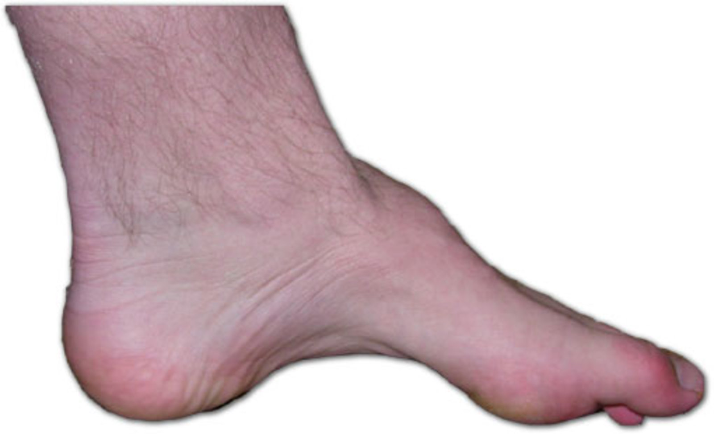

Pes cavus

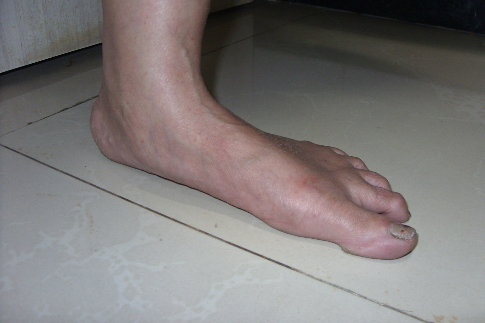

Pes planus

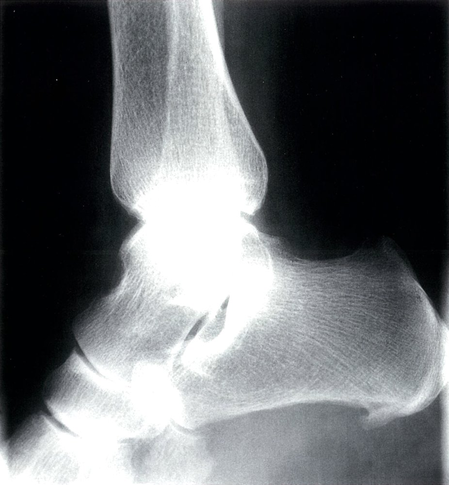

Plantar calcaneal spur

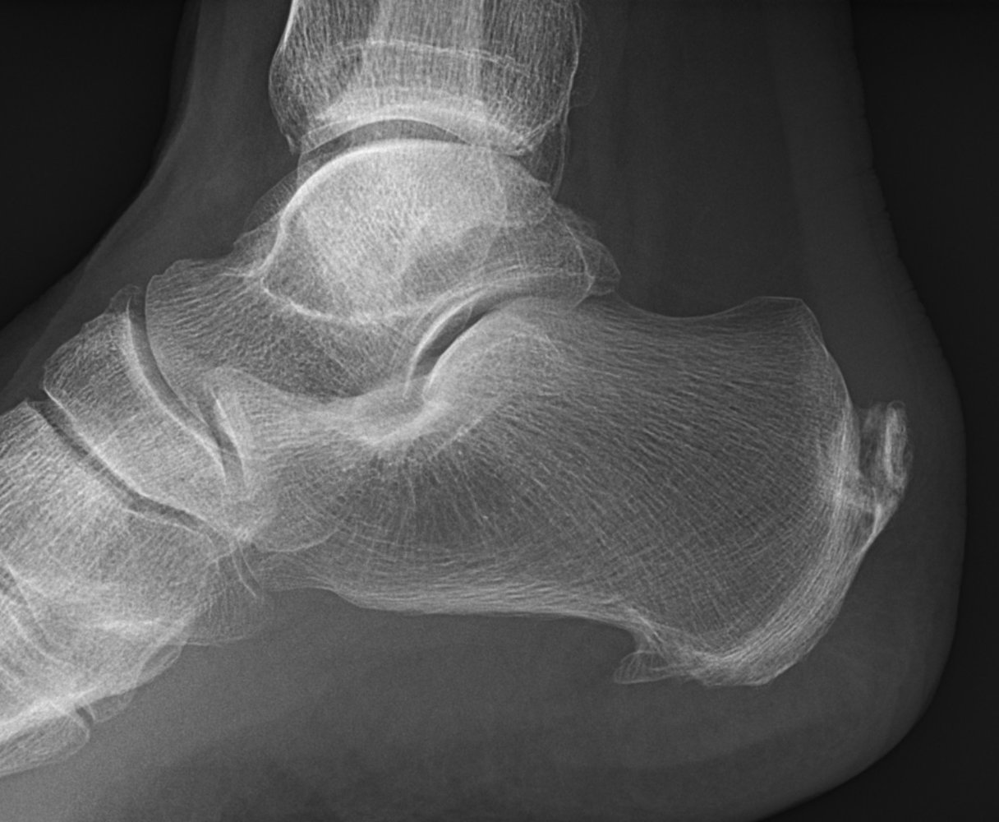

Achilles and plantar calcaneal spurs

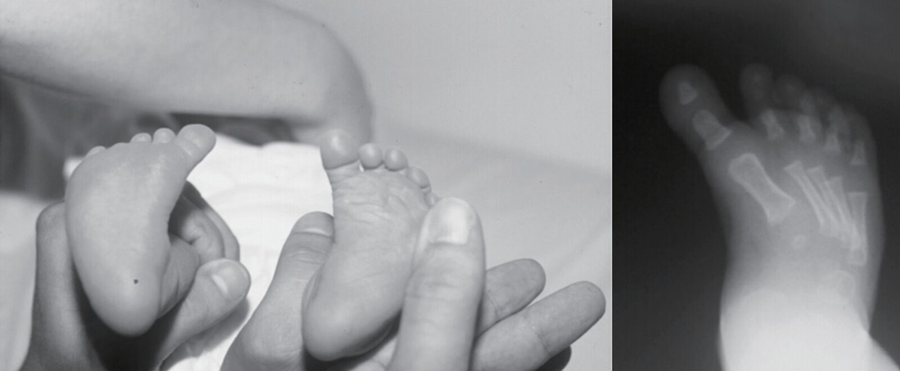

Metatarsus adductus

---

## Diagnosis and treatment of foot deformities

### Diagnostics

* Complete evaluation of feet, knees, hips, and <u>spine</u>

* Flexible vs. resistant foot deformities
* Evaluation of foot deformities, according to whether the deformity may be corrected with active (muscular contraction) or passive (manual correction by examining physician) manipulation.

* Resistant deformity: difficult or impossible to correct → indicates a structural abnormality

* Flexible deformity: may be easily corrected → indicates a muscular imbalance

* <u>X-ray</u>: evaluate skeletal deformities

### Basic principles of treatment

* Correctable foot deformities: foot <u>orthotics</u>;  and manipulative treatment with <u>casting and splinting</u> are usually successful

* Resistant foot deformities: surgical correction is usually required to <u>reposition</u> structures or relieve muscle <u>contractures</u>

> [!NOTE]
> Prompt treatment of congenital foot deformities is vital! <u>Surgery</u> may often be avoided if the manipulation is implemented correctly and consistently. If muscular imbalances are not corrected at an early age, they may result in structural deformities and often require <u>surgery</u>.

References:[[6]](https://coursology-qbank.com/amboss/article/41Y3SL)

---

## Clubfoot (talipes equinovarus)

* Definition: <u>Clubfoot</u> is a complex foot deformity that is comprised of five fixed deformities.

* Hindfoot

* Equinus foot position: short <u>Achilles tendon</u> fixes the foot in <u>plantar flexion</u>

* Varus position = <u>supination</u> of the <u>calcaneus</u>

* Forefoot

* Adductus: <u>medial</u> deviation of the toes (<u>adduction</u> of the forefoot)

* Supinatus: inversion of the forefoot

* Cavus (<u>high arch</u>): distinct arching of the foot

* <u>Epidemiology</u>

* One of the most common congenital anomalies (∼ 1/1000 births)

* Bilateral involvement in ∼ 50% of cases

* Etiology [[1]](https://coursology-qbank.com/amboss/article/i1YJgL)

* Congenital: most common form

* Acquired: rare (e.g., secondary to neurological conditions or trauma)

* Pathogenesis

* Dominant <u>medial</u> musculature; <u>posterior tibial muscle</u> is considered to be the muscle primarily responsible for the <u>clubfoot</u> (→ <u>plantar flexion</u> and <u>supination</u>, particularly of the hindfoot)

* <u>Medial</u> deviation of the talar neck

* Weak peroneus muscles

* Shortened <u>Achilles tendon</u>

* Diagnostics

* <u>Physical examination</u>: See “Diagnosis and treatment of foot deformities” above.

* <u>X-ray</u>: The long axes of the <u>calcaneus</u> and <u>talus</u> are parallel.

* Differential diagnosis: postural <u>clubfoot</u>

* Treatment

* Manipulative treatment: the Ponseti-method (manual correction with serial <u>casting</u> )

* Achilles <u>tenotomy</u>: the equinus foot position may be corrected surgically by lengthening the <u>Achilles tendon</u> with a Z-shaped suture

* Foot abduction brace (or <u>Ponseti brace</u>)

* A foot <u>brace</u> consisting of a connecting bar between two footplates, which are adjustable and onto which shoes are attached.

* Used to treat and prevent relapses in cases of <u>idiopathic</u> <u>clubfoot</u> deformity which have been completely corrected by manipulation, serial <u>casting</u>, and heel cord <u>tenotomy</u>.

* Complications: pathological strain with <u>ulceration</u> and early onset of arthrosis

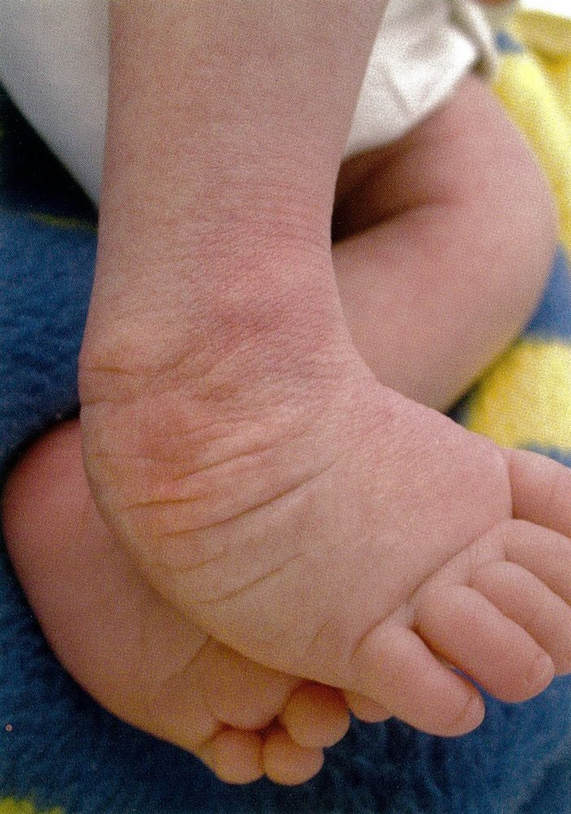

Congenital clubfoot in a newborn

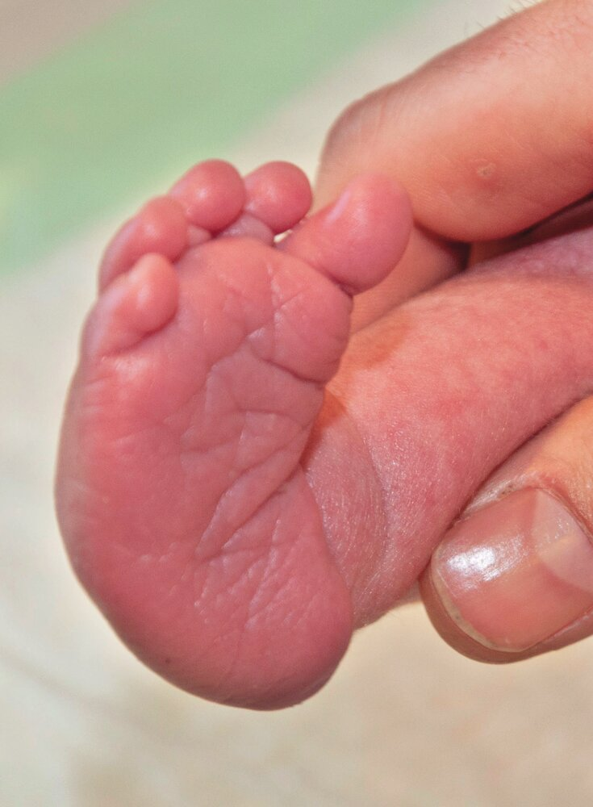

Plantar view of congenital clubfoot in a newborn

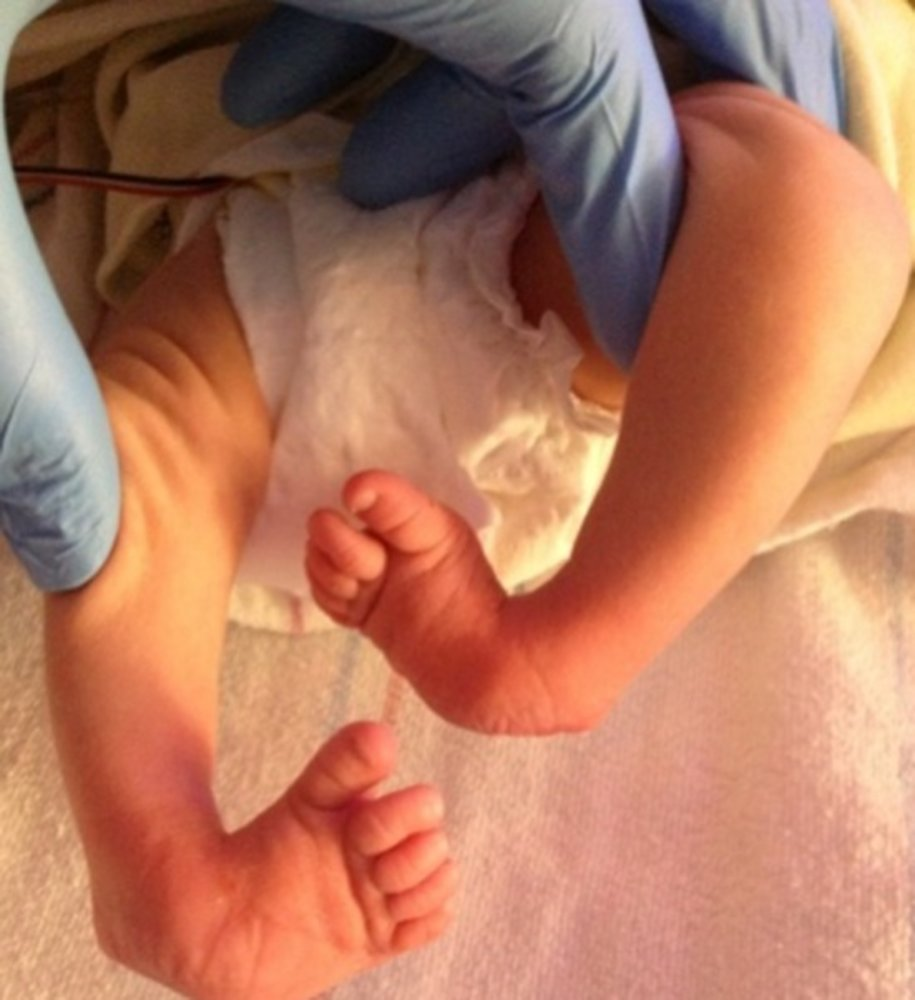

Clubfoot

---

## Splayfoot (pes planotransversus, pes transversoplanus)

* Definition: spreading apart of the <u>metatarsal bones</u> with subsequent lowering of the <u>metatarsal</u> heads

* <u>Epidemiology</u>: most common foot deformity

* Etiology: muscular and <u>connective tissue</u> <u>weakness</u> (worsened by unsupportive footwear)

* Clinical features

* <u>Metatarsalgia</u>: <u>pain</u> in the <u>metatarsal</u> bone <u>joints</u> II–IV → abnormal strain on the <u>metatarsal</u> heads II–IV → painful <u>callus</u> .

* <u>Hallux valgus</u> and digitus quintus varus: malalignment of the first and fifth ray

* Diagnostics

* <u>Physical examination</u>: See “Diagnosis and treatment of foot deformities” above.

* <u>X-ray</u>

* Spreading apart of the <u>metatarsal</u> heads

* <u>Erosion</u> of the second to fourth <u>metatarsal</u> heads

* Malalignment of the first and fifth ray

* Treatment

* <u>Orthotics</u> that support the ball of the foot and provide <u>plantar</u> support to the <u>metatarsal</u> heads

* Training of the <u>foot muscles</u>

* Complication: <u>Morton neuroma</u> [[7]](https://coursology-qbank.com/amboss/article/JjasYk)

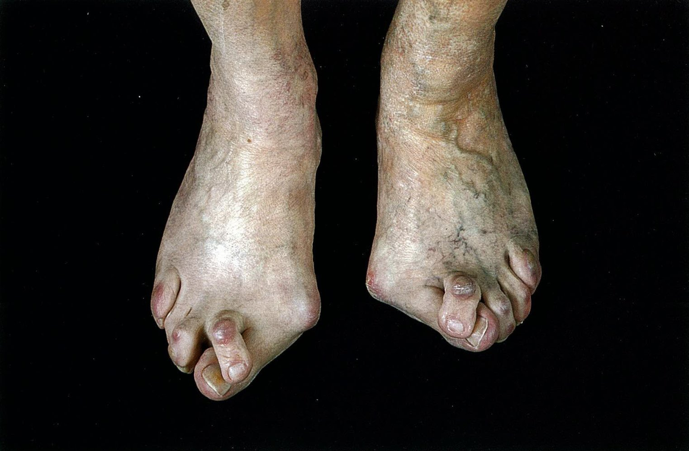

Bilateral hallux valgus with splayfoot

Innervation areas of the peripheral nerves (leg, dorsal view)

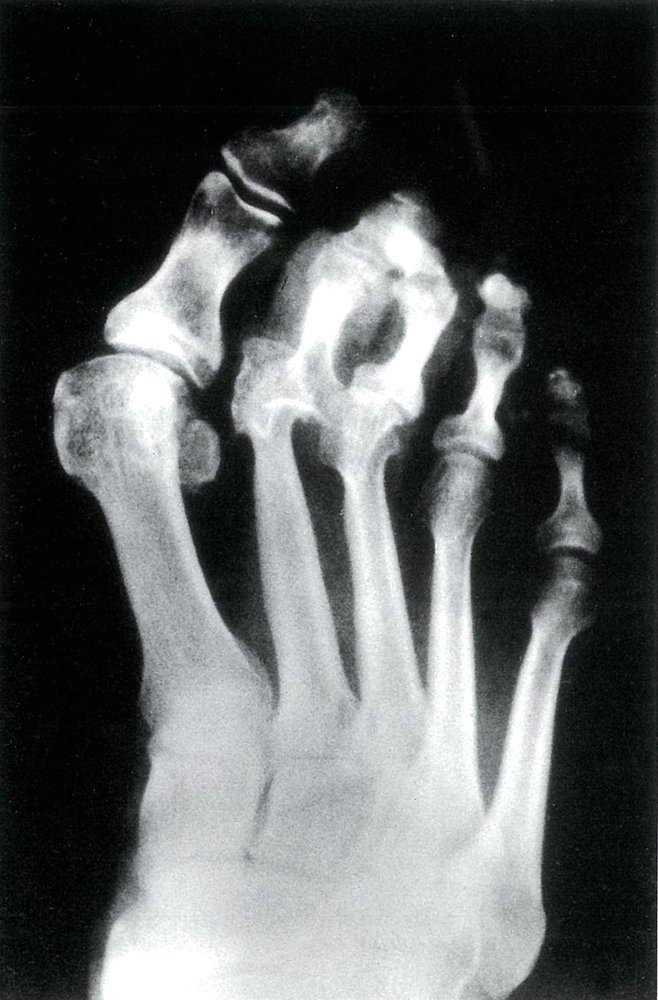

Diabetic neuropathic arthropathy

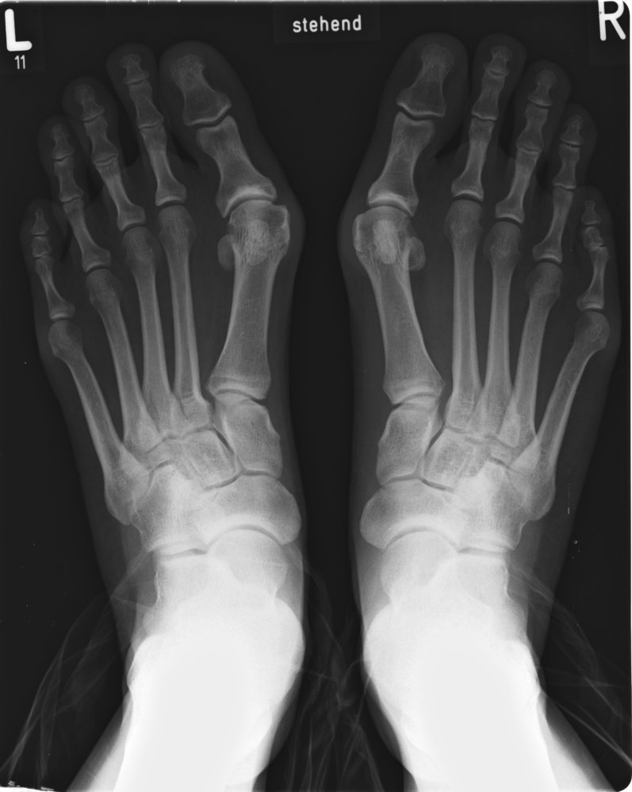

Bilateral hallux valgus

---

## Metatarsus adductus, curved foot (metatarsus varus)

* Definition: <u>adduction</u> of the forefoot

* Etiology: : unclear; presents immediately at <u>birth</u>

* Increased risk in cases of intrauterine malposition

* Association with <u>hip dysplasia</u>

* Pathogenesis: a muscular imbalance between the <u>adduction</u> muscles and fibularis muscles is suspected to be the underlying cause

* Clinical features 

* <u>In-toeing</u> of forefoot

* Usually painless

* Cases with high angles of <u>adduction</u> deformity (i.e., increased curvature of the forefoot, increased amount of <u>in-toeing</u>) may present with a <u>medial</u> <u>skin</u> crease over the forefoot

* Diagnostics

* <u>Physical examination</u>: See “<u>Flexible vs. rigid foot deformities</u>” above.

* Gentle palpation of the <u>lateral</u> aspect of the foot → active correction of the deformity → indicates a mild correctable foot deformity

* Differential diagnoses

* Other benign causes of <u>intoeing</u>

* Tibial torsion

* <u>Femoral anteversion</u>

* <u>Pathological causes of intoeing</u>

* Treatment

* Flexible curved feet do not usually require treatment.

* Rigid curved feet or flexible curved feet that do not <u>reposition</u> spontaneously require <u>conservative treatment</u>.

* Splintage and <u>casting</u> to correct the position of the foot

* <u>Orthotics</u> and inserts

* <u>Surgery</u> is required in cases that do not respond sufficiently to <u>conservative treatment</u>. 
* Reduction <u>osteotomy</u> of the <u>cuboid</u> bone (<u>lateral</u> ray is shortened) or wedge-insertion <u>osteotomy</u> of the <u>cuneiform bone</u> (<u>medial</u> ray is lengthened)

References:[[2]](https://coursology-qbank.com/amboss/article/Q1YugL)

Metatarsus adductus

---