# Knee ligament injuries

*Categories: Clinical knowledge > Surgery > Trauma and orthopedic surgery > Lower extremity > Knee ligament injuries*

[Original Article Link](https://coursology-qbank.com/amboss/article/pQ0LCf)

---

## Summary

Knee <u>ligament injuries</u> are often the result of rotational movement of <u>the knee joint</u> or direct trauma. Injuries to the <u>anterior cruciate ligament</u> (<u>ACL</u>), <u>posterior cruciate ligament</u> (<u>PCL</u>), <u>medial collateral ligament</u> (<u>MCL</u>), and <u>lateral collateral ligament</u> (<u>LCL</u>) result in <u>knee pain</u> and instability. Various maneuvers can be used to evaluate the stability of the <u>joint</u> and usually suffice to diagnose collateral <u>ligament</u> tears. An <u>MRI</u> is the best <u>confirmatory test</u> for cruciate <u>ligament</u> tears. Isolated <u>ligament injuries</u> are usually <u>treated conservatively</u>, while <u>surgery</u> is recommended for complex injuries, severe knee instability, and patients with physically demanding occupations.

<u>Tibiofemoral joint dislocation</u> is usually caused by high-energy trauma and is considered an orthopedic emergency. Immediate reduction is indicated to prevent neurovascular damage. Following reduction, a full <u>neurovascular assessment</u> must be performed in all patients, which includes a detailed <u>neurovascular exam</u>, measurement of the <u>ankle-brachial index</u>, and, if vascular injury is suspected, a <u>CT angiogram</u>.

---

## Anatomical overview

* The <u>ACL</u> and <u>PCL</u> connect the <u>femur</u> to the <u>tibia</u>.

* The <u>MCL</u> merges with the <u>joint capsule</u> of the knee.

* The <u>LCL</u> connects the <u>femur</u> and the <u>fibula</u>. It does not merge with the <u>joint capsule</u> of the knee.

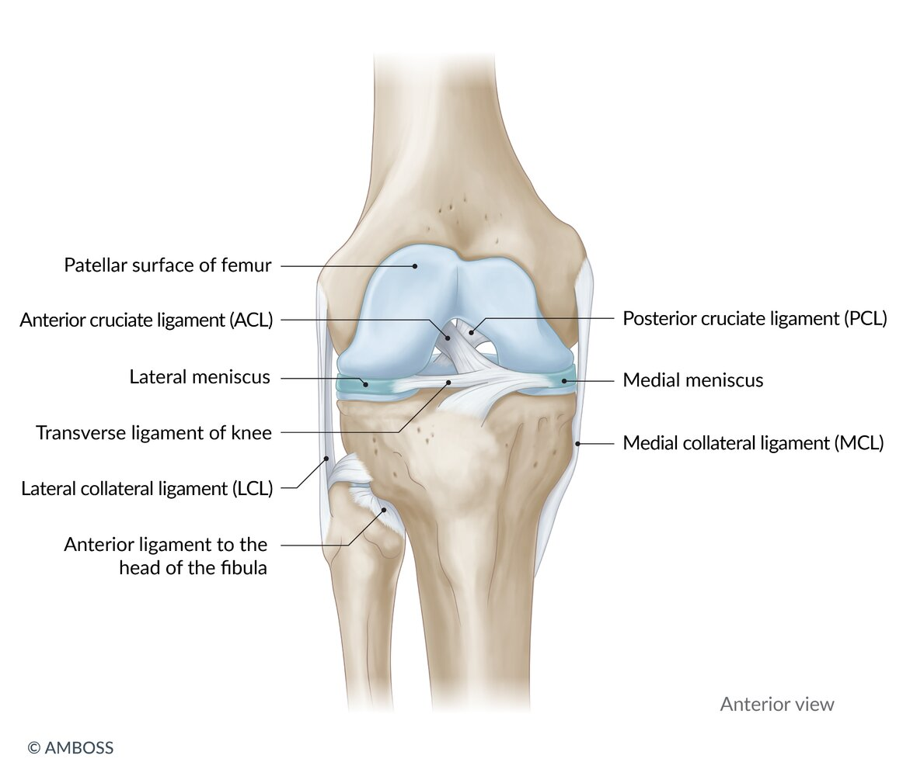

Ligaments and menisci of the knee

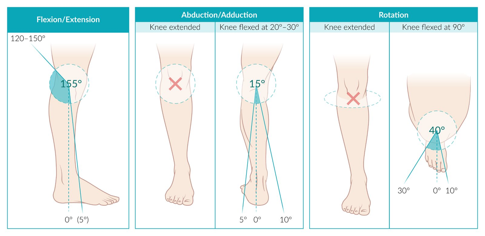

Physiological knee joint motion in three dimensions

---

## Cruciate ligament injuries

### Overview [[3]](https://coursology-qbank.com/amboss/article/AN1Rdh0)

Both <u>ACL injury</u> and <u>PCL injury</u> may present initially as <u>acute internal knee derangement</u>, reducing the yield of <u>physical examination</u> maneuvers. The diagnosis is typically confirmed via <u>MRI</u>, which can have variable findings depending on the mechanism and associated injuries.

| Comparison of <u>ACL</u> and <u>PCL injury</u> [[3]](https://coursology-qbank.com/amboss/article/AN1Rdh0) |  |  |
| --- | --- | --- |
|  | <u>ACL injury</u> | <u>PCL injury</u> |
| Relative frequency |  * More common   |  * Less common   |
| Classic mechanism |   * <u>Sports injuries</u> with a twisting mechanism  * Association with <u>meniscus tears</u> and/or <u>MCL injury</u>    |  * Direct <u>posterior</u> blow to a flexed knee   |
| Distinguishing clinical features |   * Popping sound  * <u>Knee pain</u>  * Decreased ability to bear weight    |  * Vague or absent <u>knee pain</u>   |
| Positive <u>physical examination</u> maneuvers |   * <u>Lachman test</u>  * <u>Anterior drawer test</u>  * <u>Pivot shift test</u>    |   * <u>Posterior drawer test</u>  * <u>Posterior sag sign</u>  * <u>Quadriceps active test</u>    |
| Definitive treatment |   * <u>Conservative treatment</u>: suitable for patients with mild instability, older age, or a sedentary lifestyle  * Surgical treatment: appropriate for competitive athletes, concomitant <u>meniscus</u> or collateral <u>ligament injury</u>, or chronic knee instability    |   * <u>Conservative treatment</u>: used for isolated injury; most common treatment pathway  * Surgical treatment: appropriate for multiligament injury, chronic knee instability, or competitive athletes    |

### Complications of cruciate ligament injuries [[6]](https://coursology-qbank.com/amboss/article/2dWT640)[[7]](https://coursology-qbank.com/amboss/article/AbWRwP0)

* Chronic knee instability

* <u>Meniscus</u> degeneration

* <u>Osteoarthritis</u>

* Functional limitation

* Postoperatively: graft failure, graft impingement

---

## Anterior cruciate ligament injury

### <u>Epidemiology</u>

* Most commonly injured knee <u>ligament</u> [[8]](https://coursology-qbank.com/amboss/article/klXmCy)[[9]](https://coursology-qbank.com/amboss/article/OlXICy)

* Higher <u>incidence</u> in female individuals

### Mechanism of injury [[3]](https://coursology-qbank.com/amboss/article/AN1Rdh0)

* Low-energy noncontact: <u>sports injuries</u> with a twisting mechanism, e.g., football, soccer, basketball, baseball, alpine skiing, and gymnastics  [[10]](https://coursology-qbank.com/amboss/article/7lX4yy)

* High-<u>velocity</u> contact injuries (less common): direct blows to the knee causing forced hyperextension or <u>valgus deformity</u> of the knee

### Clinical features [[3]](https://coursology-qbank.com/amboss/article/AN1Rdh0)

* History

* Popping sound: commonly heard shortly before the onset of symptoms

* Knee buckling: episodic giving out and loss of ability to bear weight

* Difficulty getting up and moving

* <u>Physical examination</u> findings 

* Knee swelling (e.g., due to <u>hemarthrosis</u>), <u>pain</u>, and instability  [[3]](https://coursology-qbank.com/amboss/article/AN1Rdh0)

* Positive Lachman test (most sensitive test)  

* With the <u>knee joint</u> at 20–30° <u>flexion</u>, the examiner stabilizes the <u>femur</u> and pulls the <u>tibia</u> anteriorly.

* Increased <u>tibial anterior</u> gliding (compared to the opposite knee) and a soft <u>endpoint</u> indicate an <u>ACL</u> tear.

* Positive anterior drawer test   

* With the <u>knee joint</u> at 90° <u>flexion</u>, the examiner fixes the foot on the table and pulls the <u>proximal</u> <u>tibia</u> forward.

* Increased <u>tibial anterior</u> gliding (compared to the opposite knee) and a soft <u>endpoint</u> indicate an <u>ACL</u> tear.

* Positive pivot shift test [[11]](https://coursology-qbank.com/amboss/article/FbWgvP0)

* With full extension of <u>the knee joint</u>, the examiner slowly flexes the knee while applying valgus <u>stress</u> with one hand and internally rotating the <u>tibia</u> with the other.

* If the <u>ACL</u> is torn, the anteriorly subluxed <u>lateral</u> tibial plateau jerks backward at 30° of knee <u>flexion</u>.

* Commonly associated injuries

* Most commonly, <u>lateral meniscus</u> damage (often together with acute <u>ACL</u> and <u>MCL injury</u>)

* Unhappy triad: simultaneous injury of the <u>ACL</u>, <u>MCL</u>, and <u>medial meniscus</u> (the <u>medial meniscus</u> is attached to the <u>MCL</u>) 

* Usually caused by valgus <u>stress</u> (<u>lateral</u> force) applied to the knee while the foot is fixed (e.g., during contact sports)

* Clinical features: <u>pain</u>, instability, tender <u>medial</u> <u>joint</u> line, poor knee extension

> [!WARNING]
> Consider deferring <u>physical examination</u> maneuvers in the acute setting as <u>pain</u> and swelling may limit their usefulness. [[2]](https://coursology-qbank.com/amboss/article/XC19qQ0)

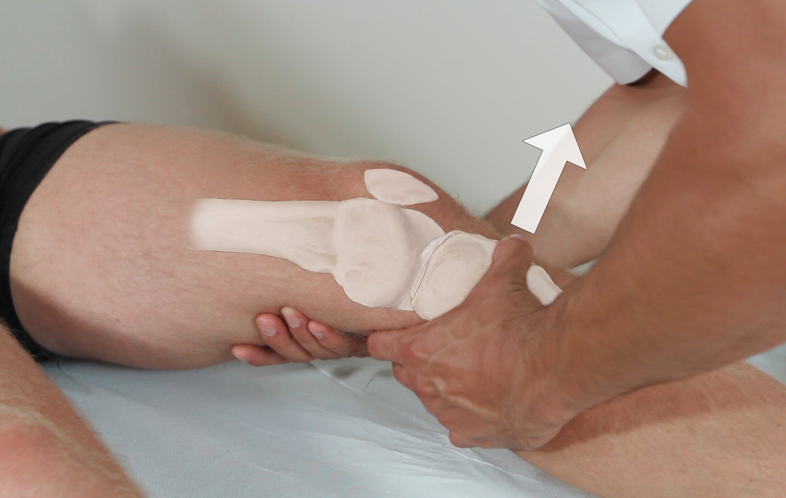

Lachman test

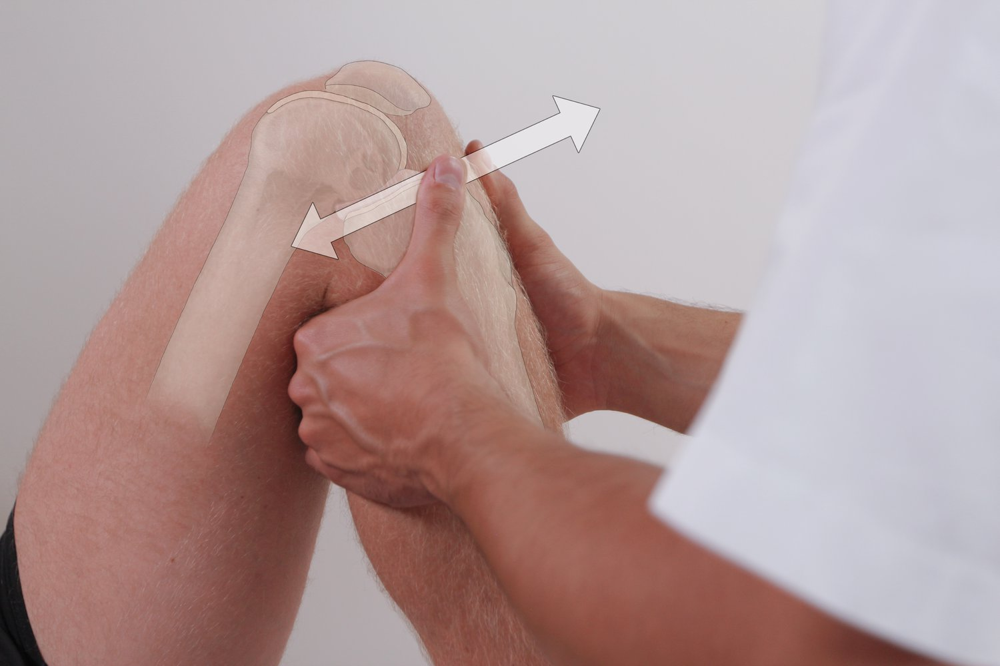

Drawer tests

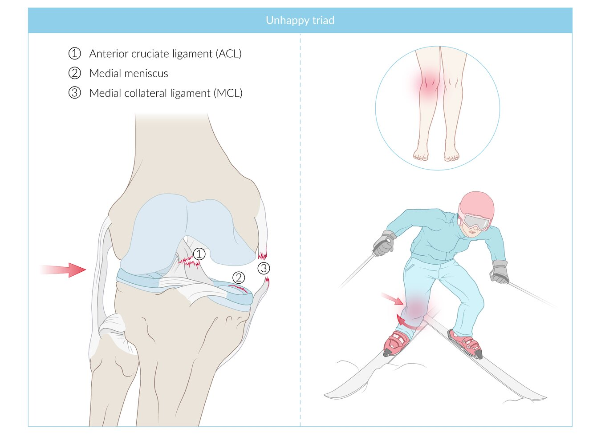

Unhappy triad

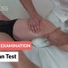

Lachman Test - Clinical Examination

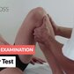

Drawer Test - Clinical Examination

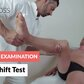

Pivot Shift Test - Clinical Examination

### Diagnostics [[3]](https://coursology-qbank.com/amboss/article/AN1Rdh0)[[9]](https://coursology-qbank.com/amboss/article/OlXICy)

If <u>MRI</u> is not readily available, a provisional <u>clinical diagnosis</u> of <u>ACL injury</u> can be made if <u>physical examination</u> maneuvers are feasible and reliable.

* <u>Full knee x-ray series</u>: to evaluate for associated <u>fractures</u> or avulsions

* <u>MRI</u>: <u>confirmatory test</u>  [[9]](https://coursology-qbank.com/amboss/article/OlXICy)

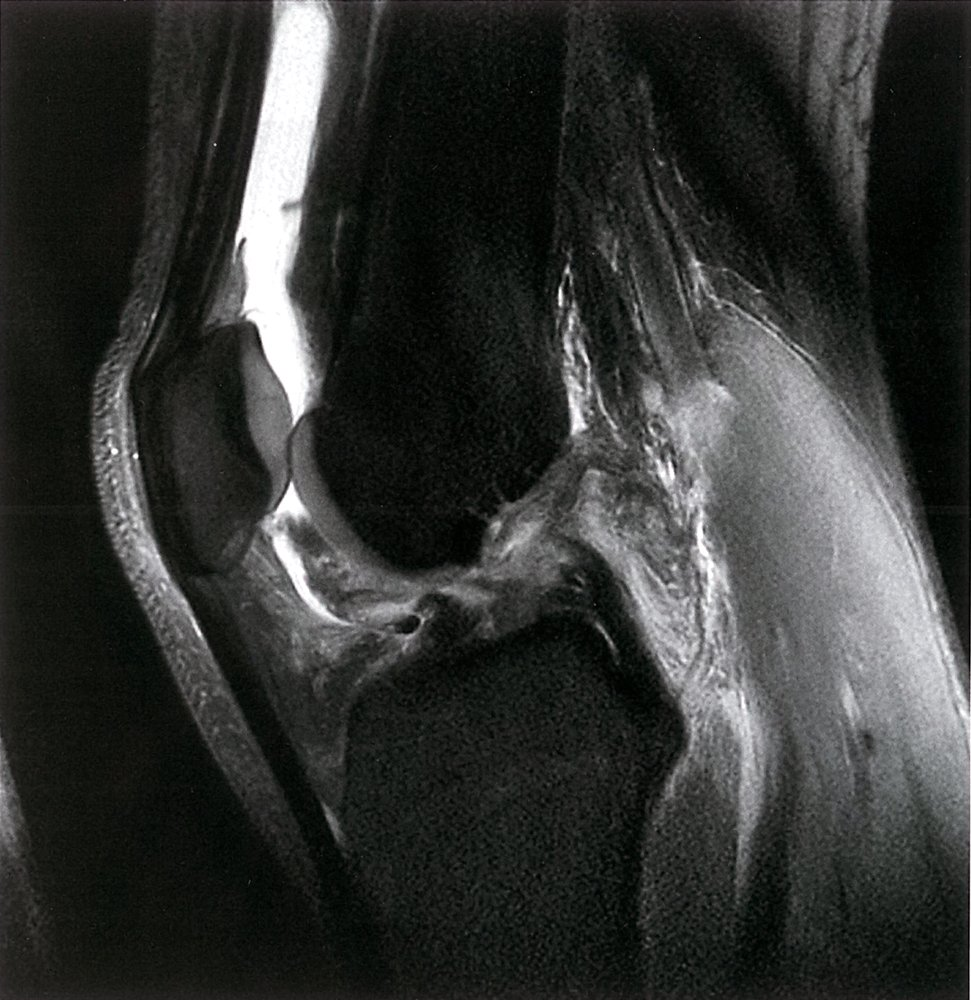

Anterior cruciate ligament injury

### Treatment [[3]](https://coursology-qbank.com/amboss/article/AN1Rdh0)[[6]](https://coursology-qbank.com/amboss/article/2dWT640)[[12]](https://coursology-qbank.com/amboss/article/jVW_840)

For immediate management following injury, see “<u>Acute internal knee derangement</u>.”

* <u>Conservative treatment</u>: suitable for patients with mild knee instability, older age, and a relatively sedentary lifestyle [[6]](https://coursology-qbank.com/amboss/article/2dWT640)[[12]](https://coursology-qbank.com/amboss/article/jVW_840)

* Early referral to <u>physiotherapy</u> to maintain <u>range of motion</u> and strengthen <u>quadriceps</u>

* Offer crutches for a limited time and only to patients with significant difficulty with ambulation.

* Avoid knee immobilizers.

* <u>Arthroscopic</u> <u>surgery</u>: typically pursued in competitive athletes and in patients with a relatively active lifestyle, concomitant <u>meniscus</u> or collateral <u>ligament injury</u>, or chronic knee instability [[6]](https://coursology-qbank.com/amboss/article/2dWT640)[[12]](https://coursology-qbank.com/amboss/article/jVW_840)

* <u>ACL</u> reconstruction using <u>allograft</u> tissue

* Postoperative care: <u>knee brace</u>, crutches, <u>physical therapy</u>  [[13]](https://coursology-qbank.com/amboss/article/4lX3Cy)

### Complications

See “<u>Complications of cruciate ligament injuries</u>.”

---

## Posterior cruciate ligament injury

### Mechanism of injury [[14]](https://coursology-qbank.com/amboss/article/EbW8vP0)

* Noncontact injury involving hyperflexion of the knee with a plantarflexed foot (seen in athletes)

* Direct <u>posterior</u> blow to a flexed knee: seen in <u>motor vehicle accidents</u> (<u>dashboard injury</u>) or athletic contact injury

* Rotational injury involving hyperextension of the knee (rare)

### Clinical features [[3]](https://coursology-qbank.com/amboss/article/AN1Rdh0)[[14]](https://coursology-qbank.com/amboss/article/EbW8vP0)

* History

* Acute injury: vague or absent <u>posterior</u> <u>knee pain</u>, swelling, decreased functional <u>range of motion</u>

* Chronic injury: <u>anterior</u> <u>knee pain</u> and instability  [[3]](https://coursology-qbank.com/amboss/article/AN1Rdh0)[[14]](https://coursology-qbank.com/amboss/article/EbW8vP0)

* <u>Physical examination</u> findings

* Positive posterior drawer test 

* With the patient lying <u>supine</u> and the knee at 90° <u>flexion</u>, the examiner fixes the foot on the table and pushes the <u>proximal</u> <u>tibia</u> backward.

* Increased tibial <u>posterior</u> gliding (compared to the opposite knee) and a soft <u>endpoint</u> indicate <u>PCL injury</u>.

* Positive posterior sag sign 

* The patient lies down with both hips and knees flexed and aligned together.

* In this position, the <u>tibia</u> on the side of the torn <u>PCL</u> will appear to fall backwards under the influence of gravity.

* Positive quadriceps active test [[14]](https://coursology-qbank.com/amboss/article/EbW8vP0)

* The patient is placed in <u>supine position</u> with the knee flexed at 90° with the foot flat on the bed.

* <u>Anterior</u> <u>translation</u> of the <u>tibia</u> with isometric <u>quadriceps</u> contraction indicates <u>PCL injury</u>.

> [!WARNING]
> Consider deferring <u>physical examination</u> maneuvers in the acute setting as <u>pain</u> and swelling may limit their usefulness. [[2]](https://coursology-qbank.com/amboss/article/XC19qQ0)

Drawer tests

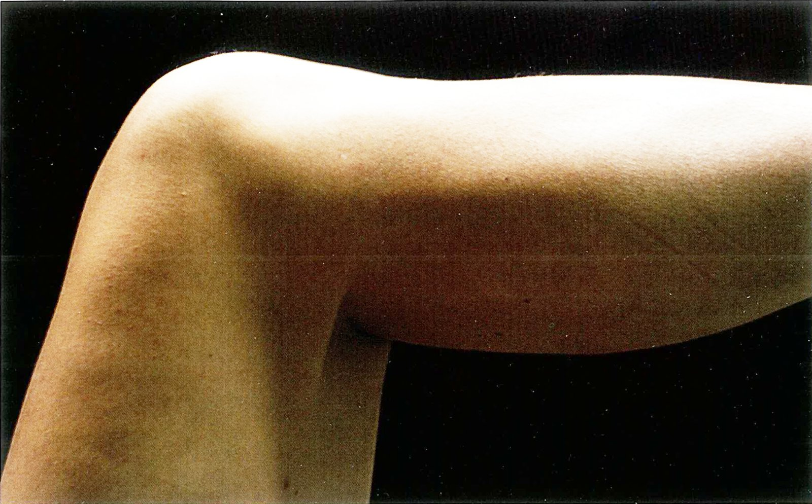

Posterior sag sign (knee joint)

Drawer Test - Clinical Examination

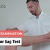

Posterior Sag Test - Clinical Examination

### Diagnostics [[3]](https://coursology-qbank.com/amboss/article/AN1Rdh0)[[14]](https://coursology-qbank.com/amboss/article/EbW8vP0)

If <u>MRI</u> is not readily available, a provisional <u>clinical diagnosis</u> of <u>PCL injury</u> can be made if <u>physical examination</u> maneuvers are feasible and reliable.

* Full knee <u>x-ray</u> series: to evaluate for <u>posterior sag</u> of the <u>tibia</u> and associated <u>fractures</u> or avulsions

* <u>MRI</u>: (<u>confirmatory test</u>)  [[14]](https://coursology-qbank.com/amboss/article/EbW8vP0)

Tibial avulsion fracture and patellar fracture with joint effusion (1/2)

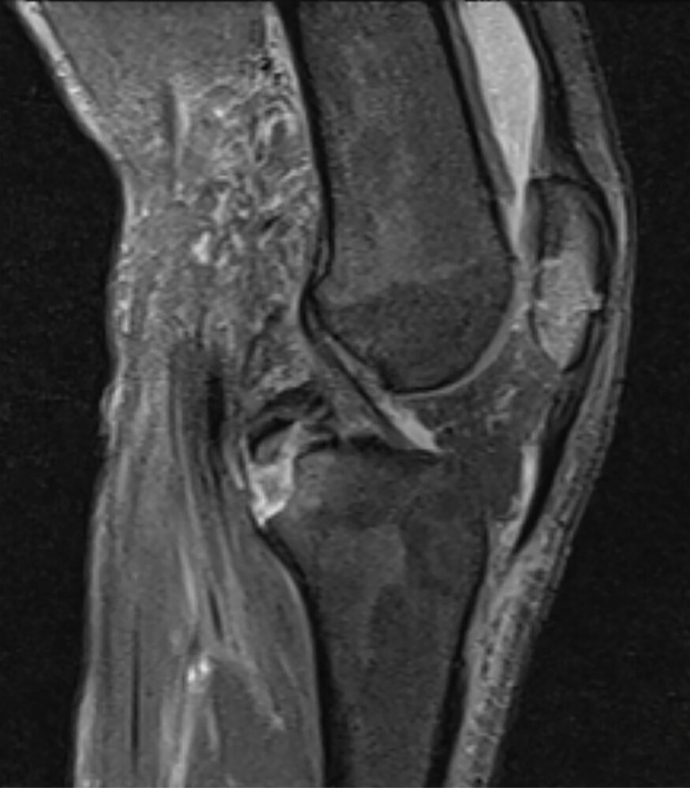

Tibial avulsion fracture and patellar fracture with joint effusion (2/2)

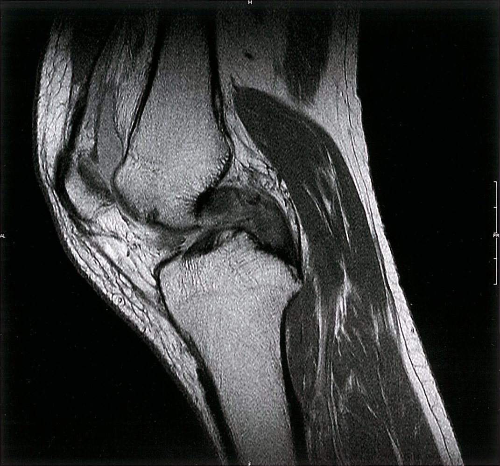

Posterior cruciate ligament tear

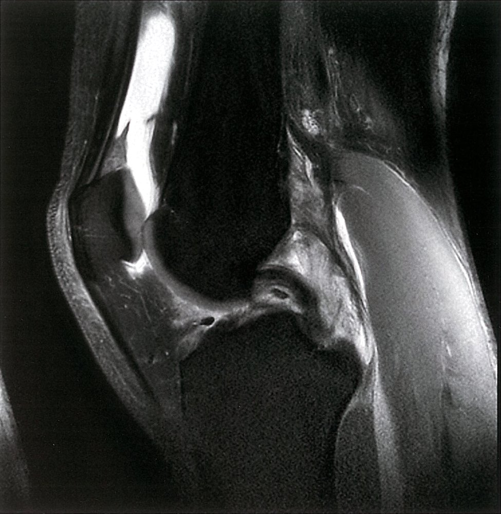

MRI image of suprapatellar joint effusion and intact posterior cruciate ligament of the knee

### Treatment [[3]](https://coursology-qbank.com/amboss/article/AN1Rdh0)[[14]](https://coursology-qbank.com/amboss/article/EbW8vP0)

For immediate treatment following injury, see “<u>Acute internal knee derangement</u>.”

* <u>Conservative therapy</u> for isolated injuries

* <u>Surgery</u> for multiligament injuries, chronic knee instability, and for highly competitive athletes

### Complications

See “<u>Complications of cruciate ligament injuries</u>.”

---

## Collateral ligament injury

### Overview

|  Overview of collateral <u>ligament injuries</u> [[3]](https://coursology-qbank.com/amboss/article/AN1Rdh0)    |  |  |
| --- | --- | --- |
|  | Medial collateral ligament injury | Lateral collateral ligament injury |
| Mechanism of injury |   * Contact injuries: valgus <u>stress</u> (direct <u>lateral</u> blow)  * Noncontact injuries: <u>external rotation</u>    |   * Contact injuries: varus <u>stress</u> (direct <u>medial</u> blow)  * Noncontact injuries: <u>external rotation</u> and hyperextension    |
| Associated injuries |  * Frequently associated with <u>medial meniscus</u> tear (e.g., <u>unhappy triad</u>)   |   * Common: <u>ACL</u> and/or <u>PCL</u> tears  * <u>Peroneal nerve injury</u>  * Isolated <u>LCL injury</u> is very rare.    |
| Distinguishing clinical features |  |  |
|   * <u>Medial</u> <u>joint</u> line tenderness  * Valgus stress test  * With the patient in <u>supine position</u> and the knee either in extension or at 20–30° <u>flexion</u>, the examiner gently <u>abducts</u> the <u>tibia</u> by pushing on the knee from the <u>lateral</u> side (valgus force).  * Widening of the <u>medial</u> <u>joint</u> space when the knee is slightly flexed indicates <u>MCL injury</u>.    |   * <u>Lateral</u> <u>joint</u> line tenderness  * Varus stress test  * With the patient in <u>supine position</u> and the knee either in extension or at 20–30° <u>flexion</u>, the examiner gently <u>adducts</u> the <u>tibia</u> by pushing on the knee from the <u>medial</u> side (varus force).  * Widening of the <u>lateral</u> <u>joint</u> space when the knee is slightly flexed indicates <u>LCL injury</u>.    |  |

> [!NOTE]
> <u>MCL injuries</u> are more common than <u>LCL injuries</u>.

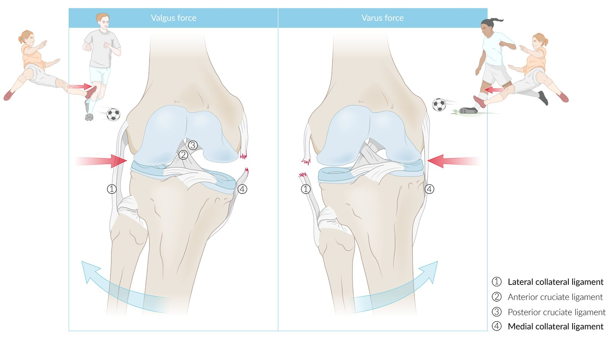

Collateral ligament injuries

### Clinical features [[3]](https://coursology-qbank.com/amboss/article/AN1Rdh0)

* Knee swelling with <u>ecchymosis</u>, <u>pain</u>, deformity, and instability

* Increased <u>joint</u> laxity on <u>varus stress test</u> or <u>valgus stress test</u>

* <u>Joint</u> line tenderness

* Possible signs of associated <u>cruciate ligament injury</u> and/or <u>meniscus injury</u>

### Classification

The degree of <u>joint</u> laxity is graded based on the estimated size of <u>lateral</u> <u>joint</u> space during the <u>valgus stress test</u> or <u>varus stress test</u>. [[15]](https://coursology-qbank.com/amboss/article/HlXKyy)

* Grade I: 3–5 mm (mild instability)

* Grade II: 6–10 mm (moderate instability)

* Grade III: > 10 mm (severe instability; other knee <u>ligaments</u> may be injured)

### Diagnostics [[3]](https://coursology-qbank.com/amboss/article/AN1Rdh0)

* An isolated collateral <u>ligament</u> tear is a <u>clinical diagnosis</u>.

* <u>X-rays</u> and <u>MRI</u> may be used for confirmation and to rule out associated injuries.

### Treatment [[3]](https://coursology-qbank.com/amboss/article/AN1Rdh0)

For immediate management, see “<u>Acute internal knee derangement</u>.”

* <u>Conservative treatment</u> (functional <u>brace</u> and <u>physical therapy</u>) for isolated tears

* <u>Surgery</u> if associated injuries are present

---

## Tibiofemoral joint dislocation

### Mechanism of injury [[3]](https://coursology-qbank.com/amboss/article/AN1Rdh0)

Usually caused by high-energy trauma (e.g., <u>dashboard injury</u>, fall from a height)

* <u>Anterior</u> <u>dislocation</u> (<u>tibia</u> is <u>anterior</u> to the <u>femur</u>): caused by hyperextension of <u>the knee joint</u>

* <u>Posterior</u> <u>dislocation</u> (<u>tibia</u> is <u>posterior</u> to the <u>femur</u>): caused by direct <u>anterior</u> impact to the <u>proximal</u> <u>tibia</u>

* <u>Medial</u>/<u>lateral</u> <u>dislocation</u> (<u>tibia</u> is <u>medial</u> or <u>lateral</u> to the <u>femur</u>): caused by varus or valgus force

* Rotary <u>dislocation</u> (anterolateral, posterolateral, anteromedial, or posteromedial tibial displacement): caused by twisting force

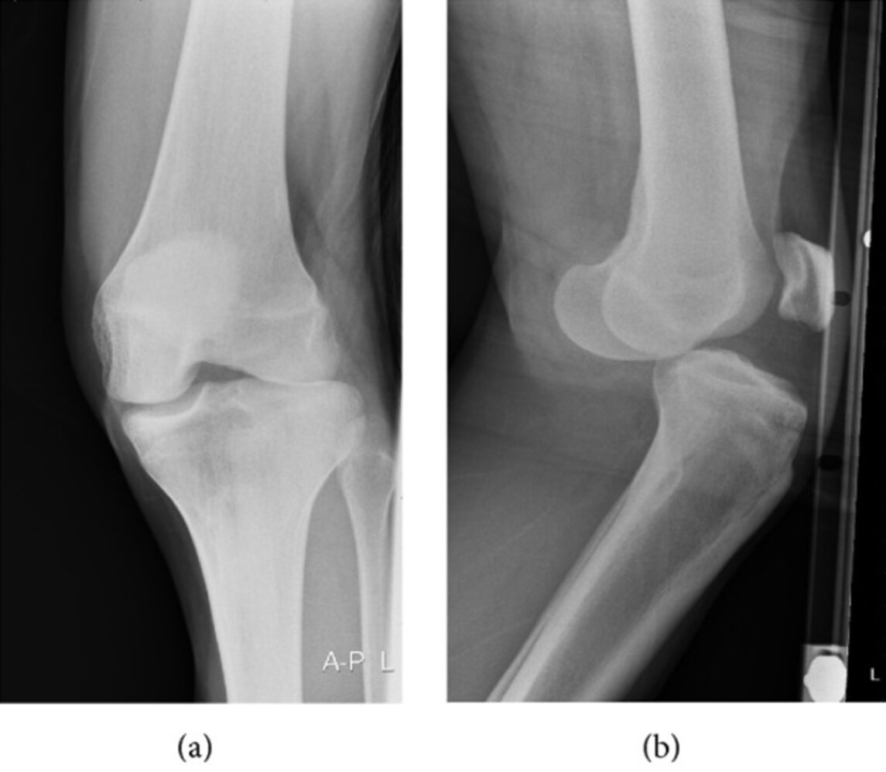

Rotatory anterolateral knee dislocation

Posterior knee dislocation

### Clinical features [[3]](https://coursology-qbank.com/amboss/article/AN1Rdh0)

* Musculoskeletal findings

* Abnormal position of <u>the knee joint</u> (see “Mechanism of injury”)

* Swelling of the knee

* <u>Ecchymosis</u>

* <u>Dimple sign</u> (<u>pathognomonic</u> for posterolateral <u>dislocation</u>): indentation of the <u>skin</u> at the <u>medial</u> femoral condyle  [[16]](https://coursology-qbank.com/amboss/article/UXWbxP0)

* <u>Neurovascular exam</u> findings

* Signs of <u>popliteal artery</u> injury: weak or absent <u>dorsalis pedis</u> and <u>posterior tibial artery</u> pulses, <u>6 Ps of acute limb ischemia</u>

* Signs of <u>peroneal nerve injury</u> and/or <u>tibial nerve injury</u>

> [!WARNING]
> Maintain a high level of suspicion for vascular injury, as <u>popliteal artery</u> injury may be present despite palpable pulses. [[3]](https://coursology-qbank.com/amboss/article/AN1Rdh0)

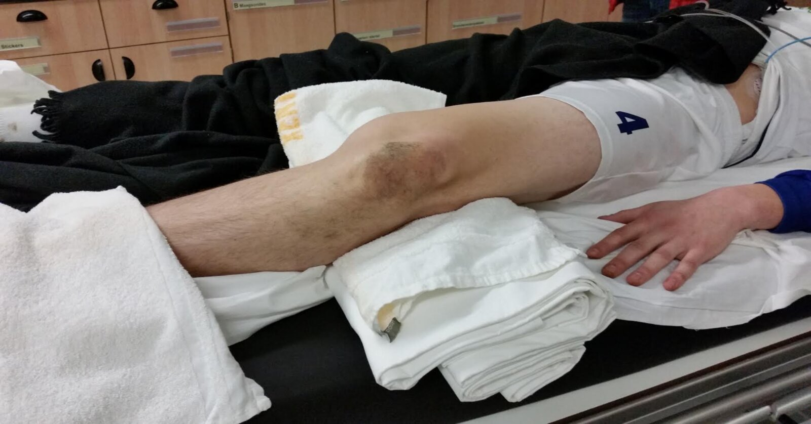

Knee dislocation

### Management [[3]](https://coursology-qbank.com/amboss/article/AN1Rdh0)

See also “<u>Acute internal knee derangement</u>” for the approach to an undifferentiated knee injury.

* Immediate <u>dislocation</u> reduction: Do not delay reduction to obtain imaging unless an alternate diagnosis is suspected.

* Isolated <u>anterior</u> or <u>posterior</u> <u>dislocation</u>: <u>closed reduction</u> under <u>procedural sedation</u>

* Posterolateral <u>dislocation</u>; : urgent orthopedic consult for <u>open reduction</u> (in most cases)

* <u>Neurovascular exam</u>: : Document popliteal and <u>distal</u> pulses and <u>distal</u> lower extremity sensory and motor functions before and after reduction.

* Abnormalities detected: urgent vascular <u>surgery</u> consult

* No abnormalities detected: Proceed with further diagnostic evaluation.

* Further evaluation

* Measure the <u>ankle-brachial index</u> (<u>ABI</u>).

* <u>ABI</u> < 0.9: Obtain <u>CT angiogram</u> of the lower extremity [[17]](https://coursology-qbank.com/amboss/article/hUWc1k0).

* <u>ABI</u> ≥ 0.9: Monitor with serial <u>neurovascular exams</u> every 2–3 hours.

* Obtain <u>x-ray</u> of <u>the knee joint</u> and the lower leg to evaluate for associated injury.

* Disposition

* Place patient in a <u>posterior</u> <u>splint</u> in 15–20° <u>flexion</u> and admit for 24–48 hours observation.

* Obtain vascular <u>surgery</u> consult if there are any clinical or imaging signs of <u>neurovascular injury</u>.

* Follow-up with orthopedics for surgical repair of <u>ligamentous injury</u>

> [!TIP]
> <u>Knee dislocation</u> is an orthopedic emergency requiring immediate reduction to prevent limb-threatening <u>neurovascular injury</u>. [[3]](https://coursology-qbank.com/amboss/article/AN1Rdh0)

> [!WARNING]
> <u>Knee dislocations</u> frequently reduce spontaneously before presentation to the emergency department. Neurovascular evaluation is mandatory in all patients with a relevant lower extremity injury mechanism (see “Mechanism of injury”). [[3]](https://coursology-qbank.com/amboss/article/AN1Rdh0)

### Complications [[18]](https://coursology-qbank.com/amboss/article/pVWLv40)

* Injury of <u>ACL</u>, <u>MCL</u>, <u>LCL</u>, <u>PCL</u>, or <u>PLC</u>

* <u>Popliteal artery</u> injury

* Common peroneal or <u>tibial nerve injury</u>

* Periarticular <u>fractures</u>

* <u>Compartment syndrome</u>

* <u>Deep vein thrombosis</u>

---