# Meniscus tear

*Categories: Clinical knowledge > Surgery > Trauma and orthopedic surgery > Lower extremity > Meniscus tear*

[Original Article Link](https://coursology-qbank.com/amboss/article/oQ00Cf)

---

## Summary

A <u>meniscus</u> tear can be caused by trauma or degenerative changes in <u>the knee joint</u>. <u>Traumatic meniscus tears</u> are usually associated with physical activity and typically result from rotation coupled with axial loading of <u>the knee joint</u>. Degenerative tears are typically caused by overuse or chronic <u>stress</u>-induced <u>joint</u> deterioration. The affected <u>meniscus</u> may be <u>medial</u> or <u>lateral</u>, with the <u>medial</u> frequently torn because of its relative immobility. Clinical features include <u>pain</u> and limited <u>range of movement</u> of the affected knee. Key features are slow onset <u>joint effusion</u> and a characteristic popping or clicking sensation during <u>joint</u> maneuvers. <u>MRI</u> is used to confirm the diagnosis. <u>Arthroscopy</u> enables simultaneous surgical intervention, especially in patients with persistent symptoms, inner zone tears, and functional limitations. <u>Conservative management</u> (including use of a <u>knee brace</u>, rest, leg elevation, and <u>analgesia</u>) is typically appropriate for simple tears and patients with preexisting degenerative changes.

---

## Etiology

* Traumatic meniscus tear

* Caused by an acute injury, most often due to axial loading and rotation with a fixed foot

* Typically affects young, active individuals

* Degenerative meniscus tear

* Caused by overuse or chronic <u>stress</u>-induced <u>joint</u> deterioration, e.g., continuous work in a squatting position

* Typically affects older individuals

* Often associated with degenerative <u>joint</u> disorders (e.g., <u>osteoarthritis</u>) [[1]](https://coursology-qbank.com/amboss/article/22dTS60)

---

## Classification

A <u>meniscus</u> tear may be <u>medial</u> or <u>lateral</u>. The <u>medial meniscus</u> is more commonly injured than the <u>lateral meniscus</u>.

* Location of the tear

* White zone: inner third, avascular area

* Red-white zone: middle third, poorly vascularized area

* Red zone: outer/peripheral third, vascularized area

* Type of tear

* Longitudinal tear (vertical tear): perpendicular to the tibial plateau

* Radial tear: perpendicular to the tibial plateau and the longer axis of the <u>meniscus</u>

* Horizontal tear: parallel to the tibial plateau

* Displaced tears

* Bucket handle tear: displaced and extensive longitudinal tear that splits the <u>meniscus</u> into two parts that remain connected at the <u>anterior</u> and <u>posterior</u> ends

* Parrot beak tear: displaced radial tear

* <u>Flap</u>/oblique tear: displaced longitudinal or horizontal tear

* Simple or complex meniscus tear (a combination of horizontal, longitudinal, and radial <u>meniscus</u> tears)

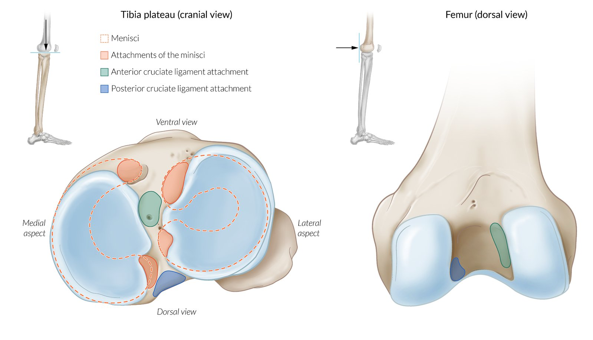

Attachments of menisci and cruciate ligaments of the knee

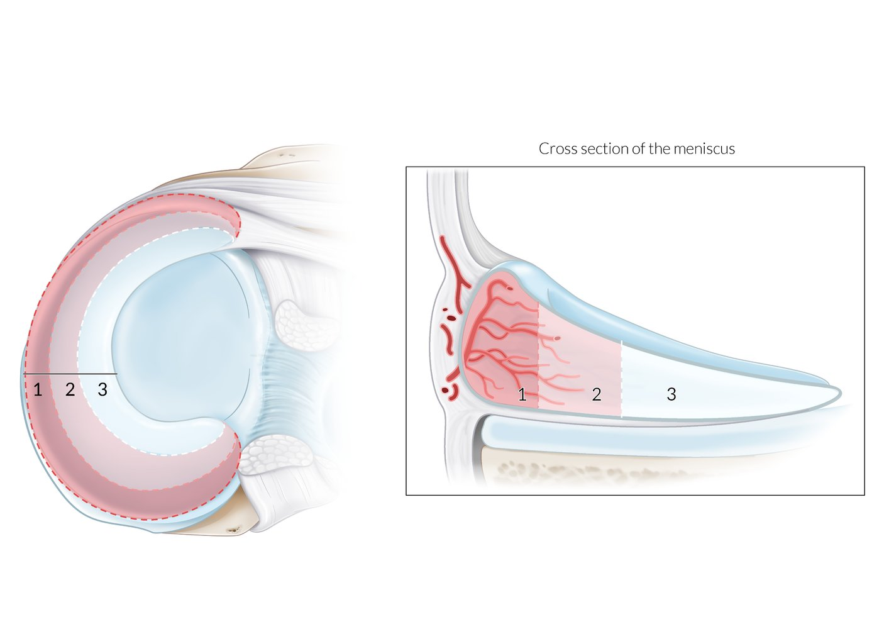

Arterial supply zones of the meniscus (knee)

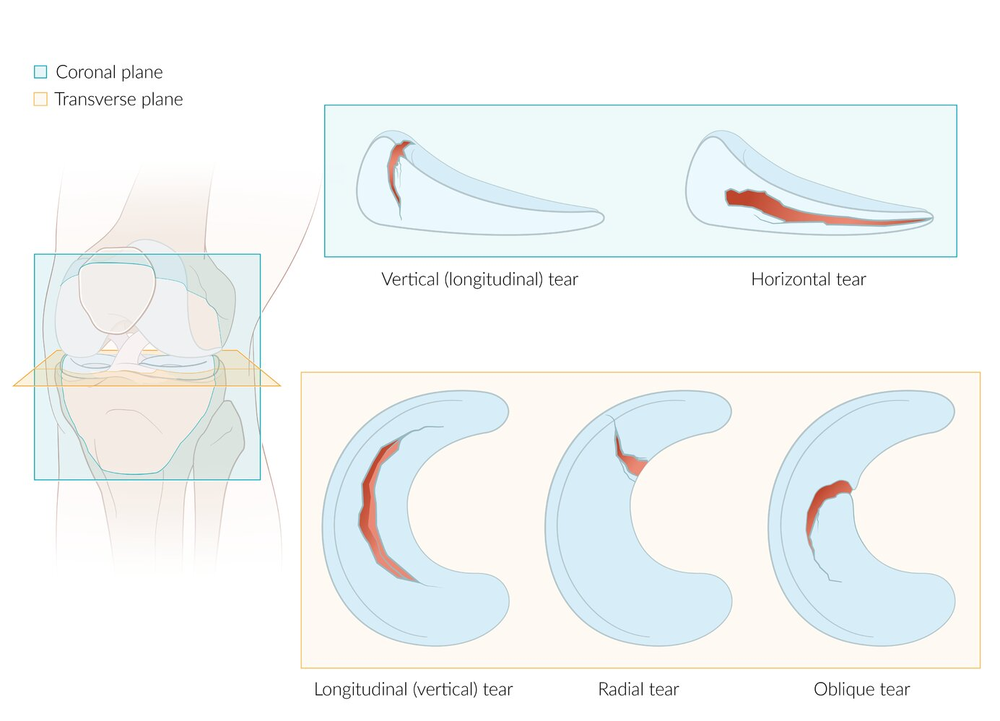

Meniscus tear - classification according to tear morphology

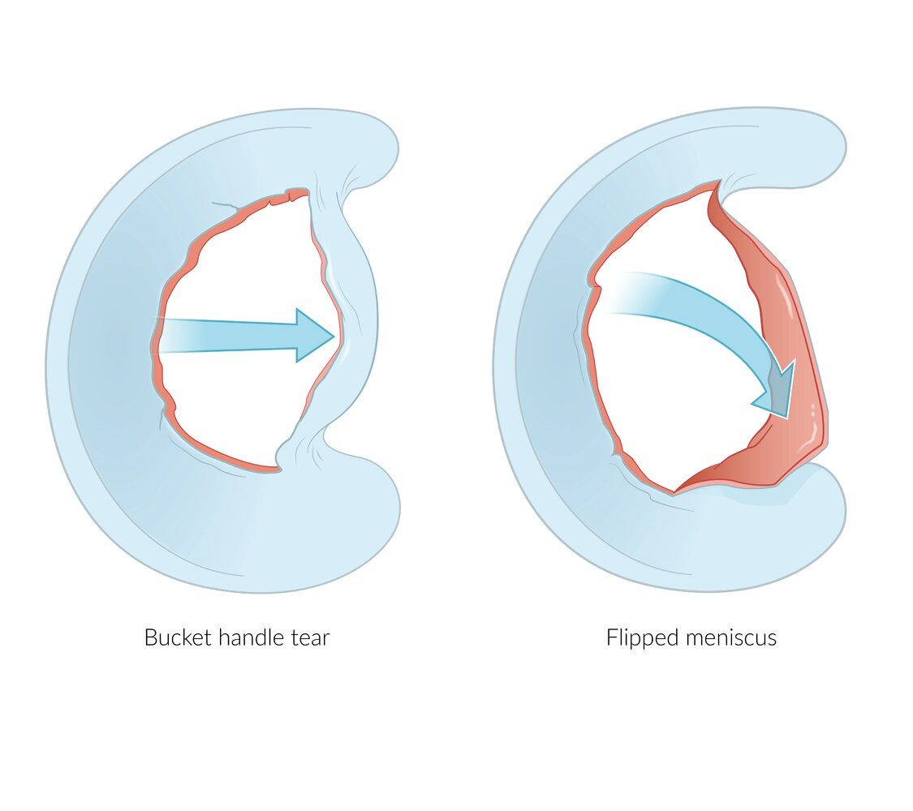

Bucket handle tear and flipped meniscus

---

## Clinical features

* <u>Knee pain</u>: exacerbated by weight‑bearing or physical activity

* <u>Joint</u> line tenderness (<u>medial</u> or <u>lateral</u>)

* Restricted knee extension with possible knee instability

* Locked knee: springy resistance to active and passive knee extension, typically caused by a torn <u>meniscus</u> obstructing knee movement

* A clicking sound and/or a popping and locking sensation may be present on movement.

* Intermittent <u>joint effusions</u>

* Tears in the <u>medial</u>, white zone → serous effusion

* Tears in the red zone near the base of the <u>meniscus</u> → bloody effusion (<u>hemarthrosis</u>)

* Patellar tap test: a maneuver used to assess <u>knee joint</u> effusion 

* Procedure

* Patient lies in a <u>supine position</u> with the knee in full extension

* The examiner applies pressure to the thigh toward the <u>proximal</u> part of the knee  and to the lower leg, directly below the patella

* While maintaining this position, the examiner gently presses down on the patella.

* Findings

* Positive test: A floating or swimming patella that can be pressed down toward the <u>femur</u>, resulting in a palpable tap, suggests a knee effusion.

* Negative test: if no effusion is present, then the patella is located directly on the <u>femur</u> and cannot be displaced

| Provocative tests for meniscus injury |  |  |
| --- | --- | --- |
|  | Test procedure | Findings |
|  McMurray test [[2]](https://coursology-qbank.com/amboss/article/jPb_eF)[[3]](https://coursology-qbank.com/amboss/article/V2dGg60)  |   * The patient lies in a <u>supine position</u>.  * The examiner holds the patient's knee in one hand and palpates the <u>joint</u> spaces while holding their ankle in the other.  * The examiner brings the patient's knee to maximal <u>flexion</u>.  * For a <u>medial meniscus</u> tear, the examiner performs <u>external rotation</u> of the <u>tibia</u> while extending the knee.  * For a <u>lateral meniscus</u> tear, the examiner performs <u>internal rotation</u> of the <u>tibia</u> while extending the knee.    |   * <u>Pain</u> on palpation  * Palpable or audible pop/click with maneuvers    |
| Steinman test |   * The patient lies <u>supine</u> and flexes their hip and knee.  * The examiner fixes the bent knee with one hand.  * The examiner grasps the foot with their other hand and rotates the tibial head internally and externally.    |   * <u>Pain</u> during <u>external rotation</u> is a sign of <u>medial meniscus</u> injury.  * <u>Pain</u> during <u>internal rotation</u> is a sign of <u>lateral meniscus</u> injury.    |
| Apley grind test |   * Similar to the <u>Steinman test</u> but performed in a <u>prone position</u>  * The patient lies <u>prone</u> and flexes their knee to 90°.  * The examiner holds the thigh in place with one hand (or knee as seen in the video).  * The examiner grasps the foot with their other hand and pulls/pushes on the foot while internally and externally rotating the <u>tibia</u>.    |   * <u>Pain</u> during <u>external rotation</u> is a sign of <u>medial meniscus</u> injury.  * <u>Pain</u> during <u>internal rotation</u> is a sign of <u>lateral meniscus</u> injury.  * <u>Pain</u> on pulling the foot is a sign of injury to the capsule and <u>ligaments</u> of <u>the knee joint</u>.  * <u>Pain</u> on pushing down the foot is a sign of <u>meniscus</u> injury.    |
| Thessaly test |   * With the examiner's help, the patient stands flat-footed on the affected leg at 20° of knee <u>flexion</u>.  * The patient then rotates their knee externally and internally.    |   * <u>Medial</u> or <u>lateral</u> <u>joint</u> line <u>pain</u> with rotation  * Clicking noise  * Patient may feel that their knee is locking or catching.    |
|  Payr test   |   * The patient sits cross-legged.  * The examiner applies pressure from above on both knees simultaneously.    |  * <u>Knee pain</u> is a sign of <u>posterior horn</u> lesion of the <u>medial meniscus</u>.   |
| Bohler sign |   * The patient lies <u>supine</u> and slightly flexes their knee and hip.  * The examiner lifts the leg with one hand while maintaining the knee in an attitude of <u>flexion</u>.  * With the other hand, the examiner grasps the lower leg and applies <u>adducting</u> (varus) and <u>abducting</u> (valgus) forces on <u>the knee joint</u>.    |   * <u>Pain</u> during <u>adduction</u> (varus <u>stress</u>) is a sign of <u>medial meniscus</u> injury.  * <u>Pain</u> during <u>abduction</u> (valgus <u>stress</u>) is a sign of <u>lateral meniscus</u> injury.    |

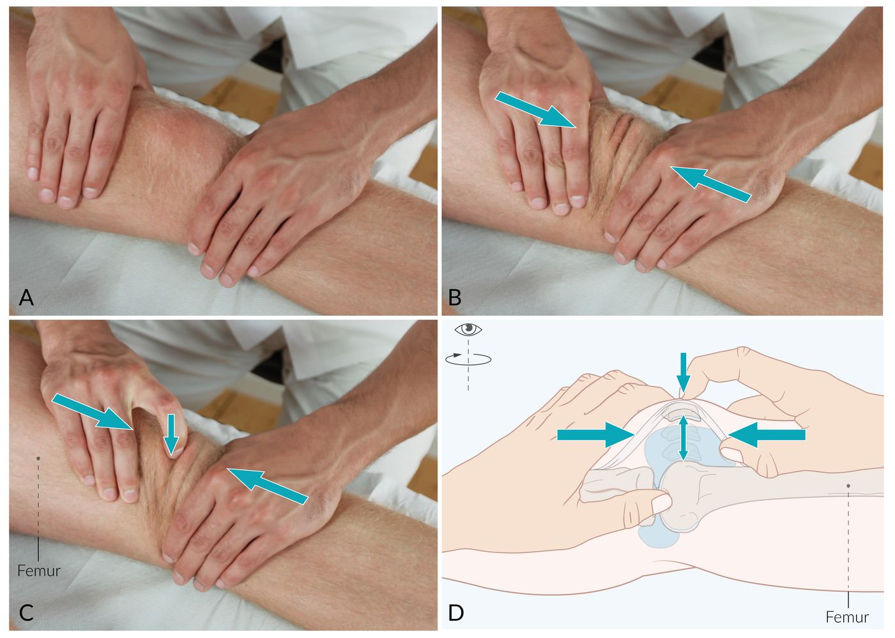

Patellar tap test

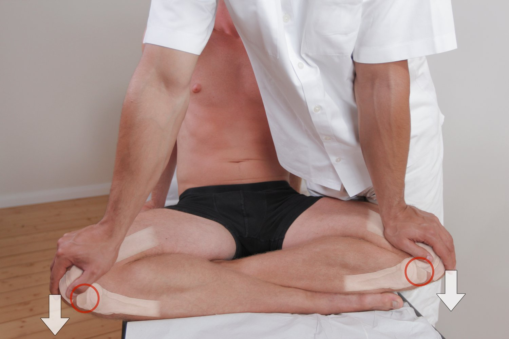

Payr test

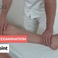

Knee Joint - Range of Motion - Clinical Examination

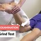

Apley Grind Test - Clinical Examination

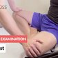

Payr Test - Clinical Examination

---

## Diagnosis

### Clinical evaluation [[3]](https://coursology-qbank.com/amboss/article/V2dGg60)

* Patients with acute injury, <u>pain</u>, and/or swelling: Follow the approach to <u>acute internal knee derangement</u>.

* Patients without significant swelling or uncontrolled <u>pain</u>

* Perform an <u>orthopedic examination of the knee</u> to identify <u>clinical features of meniscus injury</u>.  [[3]](https://coursology-qbank.com/amboss/article/V2dGg60)

* Include <u>provocative tests for meniscus injury</u>, e.g., the <u>McMurray test</u>.  [[3]](https://coursology-qbank.com/amboss/article/V2dGg60)

> [!TIP]
> A <u>clinical diagnosis</u> of <u>meniscus</u> tear can be made if multiple provocative tests are positive, knee <u>joint effusion</u> is present, and a <u>full knee x-ray series</u> is normal. [[3]](https://coursology-qbank.com/amboss/article/V2dGg60)

### Imaging [[4]](https://coursology-qbank.com/amboss/article/UC1brQ0)

* <u>Full knee x-ray series</u>: initial imaging to exclude <u>fractures</u>  [[4]](https://coursology-qbank.com/amboss/article/UC1brQ0)

* <u>MRI</u>: imaging modality of choice to identify the location and extent of <u>meniscus</u> tears and any concomitant <u>knee ligament injuries</u>

* Indications [[5]](https://coursology-qbank.com/amboss/article/U2dbS60)[[6]](https://coursology-qbank.com/amboss/article/e2dxg60)

* Athletic adults < 40 years of age with posttraumatic <u>locked knee</u> and suspected <u>meniscus</u> tear

* Persistent symptoms after 4–6 weeks of <u>conservative management</u>

* Planning for <u>arthroscopic</u> intervention

* Consider for uncertain diagnosis after clinical evaluation.  [[6]](https://coursology-qbank.com/amboss/article/e2dxg60)

* Findings [[7]](https://coursology-qbank.com/amboss/article/O2dI360)[[8]](https://coursology-qbank.com/amboss/article/l2dv360)

* <u>Hyperintense</u> line in <u>meniscus</u> with possible distorted meniscal morphology

* <u>Bucket handle tear</u>: signs include the double <u>posterior cruciate ligament</u> sign

* <u>Ultrasound</u>

* Formal musculoskeletal (<u>MSK</u>) <u>ultrasound</u> by an experienced practitioner has an <u>accuracy</u> similar to that of <u>MRI</u>. [[9]](https://coursology-qbank.com/amboss/article/P2dW360)

* <u>MSK point-of-care ultrasound</u> can help identify <u>joint effusion</u>.

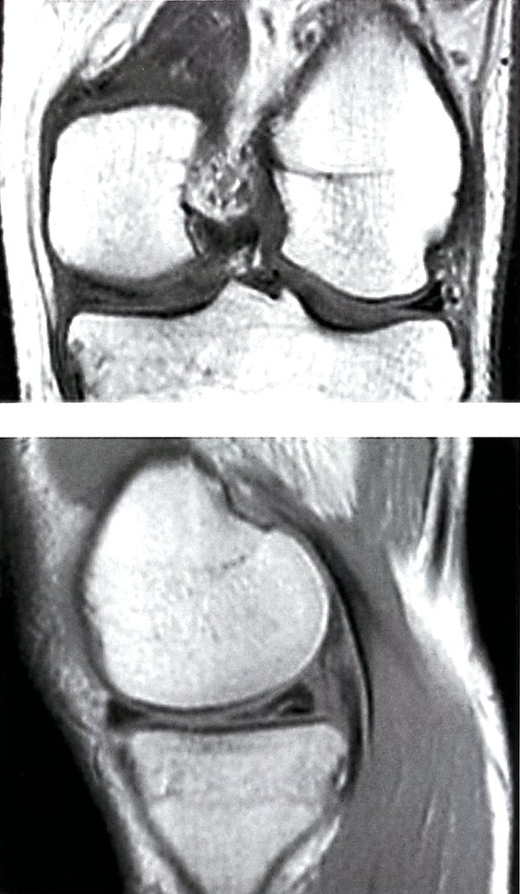

Horizontal tear of the medial meniscus

### <u>Arthroscopy</u>

* A dual diagnostic and therapeutic procedure; diagnostic <u>reference standard</u> [[7]](https://coursology-qbank.com/amboss/article/O2dI360)

* Can be used as an alternative diagnostic test in patients with <u>MRI contraindications</u>

* Generally only performed in conjunction with <u>arthroscopic</u> treatment [[10]](https://coursology-qbank.com/amboss/article/42d3360)

---

## Differential diagnoses

|  | <u>Meniscus</u> tear | <u>Knee ligament injuries</u> |
| --- | --- | --- |
| History |  * Axial loading and rotation action with a fixed foot or degenerative changes   |   * Valgus <u>stress</u> with/without <u>external rotation</u> of a flexed <u>knee joint</u> (<u>ACL</u>)  * Valgus <u>stress</u> with/without <u>external rotation</u> (<u>medial collateral ligament</u>)  * Varus <u>stress</u> with/without <u>internal rotation</u> (<u>lateral collateral ligament</u>)    |
| Clinical features |   * Delayed and slow onset <u>joint effusions</u>  * Palpable pop, clicking, or locking with maneuvers    |   * Rapid onset knee effusion  * Absent popping sensation    |

The differential diagnoses listed here are not exhaustive.

---

## Treatment

For initial management of acute traumatic knee swelling, see “<u>Acute internal knee derangement</u>.”

### <u>Conservative management</u> [[11]](https://coursology-qbank.com/amboss/article/N2d-360)

* Indications

* Initial management for all patients with suspected <u>meniscus</u> injury

* <u>Degenerative meniscus tears</u>

* Simple <u>traumatic meniscus tears</u>

* Components

* Rest, ice, and elevation of the affected limb

* <u>Analgesia</u> (<u>NSAIDs</u>)

* <u>Knee brace</u>

* Activity modification

* <u>Physical therapy</u> (e.g., strengthening the <u>quadriceps</u>)

> [!TIP]
> Manage simple <u>traumatic meniscus tears</u> and <u>degenerative meniscus tears</u> conservatively for at least 4–6 weeks before considering treatment escalation. [[11]](https://coursology-qbank.com/amboss/article/N2d-360)

### Surgical treatment [[1]](https://coursology-qbank.com/amboss/article/22dTS60)[[11]](https://coursology-qbank.com/amboss/article/N2d-360)

The decision to operate is made by an orthopedic <u>surgeon</u> and based on patient factors and available resources.

* Relative indications  [[1]](https://coursology-qbank.com/amboss/article/22dTS60)[[11]](https://coursology-qbank.com/amboss/article/N2d-360)

* <u>Traumatic meniscus tear</u> (especially with injury onset < 6 weeks) [[11]](https://coursology-qbank.com/amboss/article/N2d-360)[[12]](https://coursology-qbank.com/amboss/article/k2dm360)

* Tear involving the vascular red zone

* <u>Complex meniscus tear</u> > 1 cm

* Patients < 40 years of age

* Athletic adults

* Concomitant <u>ACL injury</u>

* <u>Locked knee</u>

* Severe persistent functional impairment

* Contraindication: <u>degenerative meniscus tear</u> [[1]](https://coursology-qbank.com/amboss/article/22dTS60)

* Procedures: <u>Arthroscopy</u> is performed more commonly than open <u>surgery</u>.

* <u>Meniscus</u> repair: usually preferred  [[11]](https://coursology-qbank.com/amboss/article/N2d-360)[[13]](https://coursology-qbank.com/amboss/article/52diR60)

* Partial meniscectomy: only in select cases  [[11]](https://coursology-qbank.com/amboss/article/N2d-360)

* <u>Meniscus</u> reconstruction with or without <u>allograft</u>: rare

* Postoperative care: <u>physical therapy</u>, <u>rehabilitation</u>, and gradual return to activity

---

## Complications

* <u>Osteoarthritis of the knee</u>

* <u>Baker cyst</u>

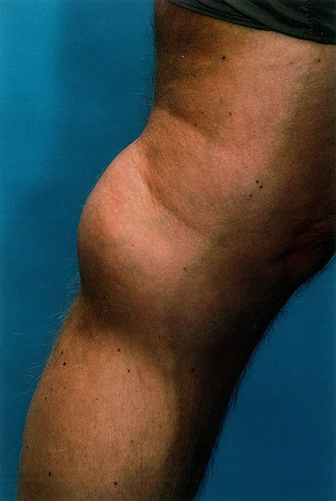

Popliteal (Baker) cyst

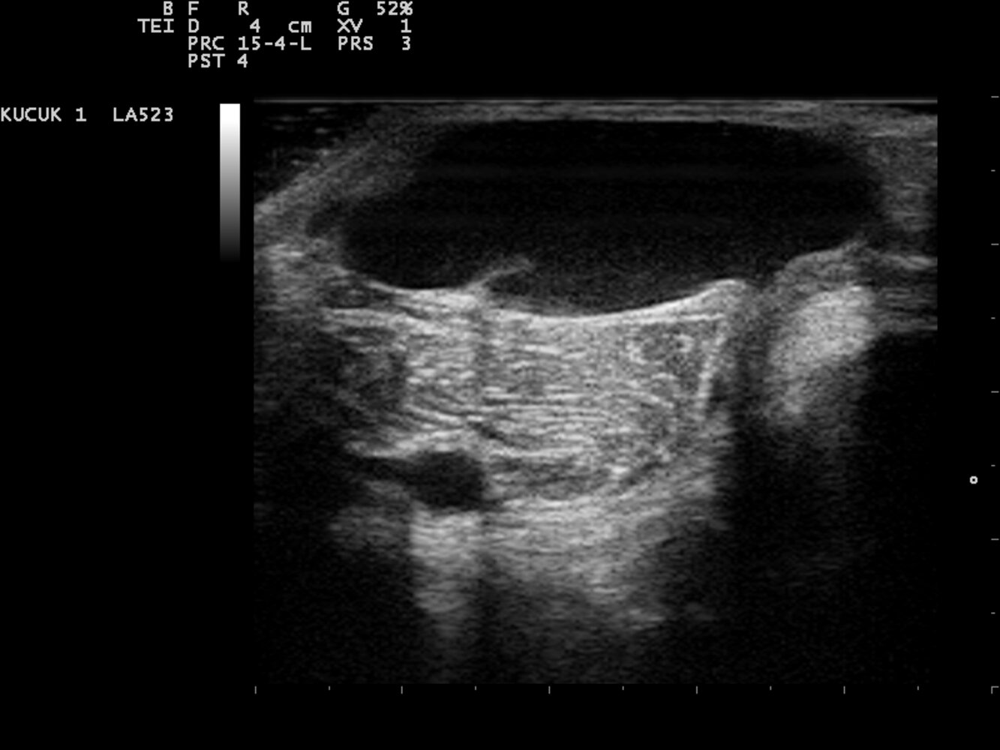

Ultrasound of popliteal (Baker) cyst

We list the most important complications. The selection is not exhaustive.

---