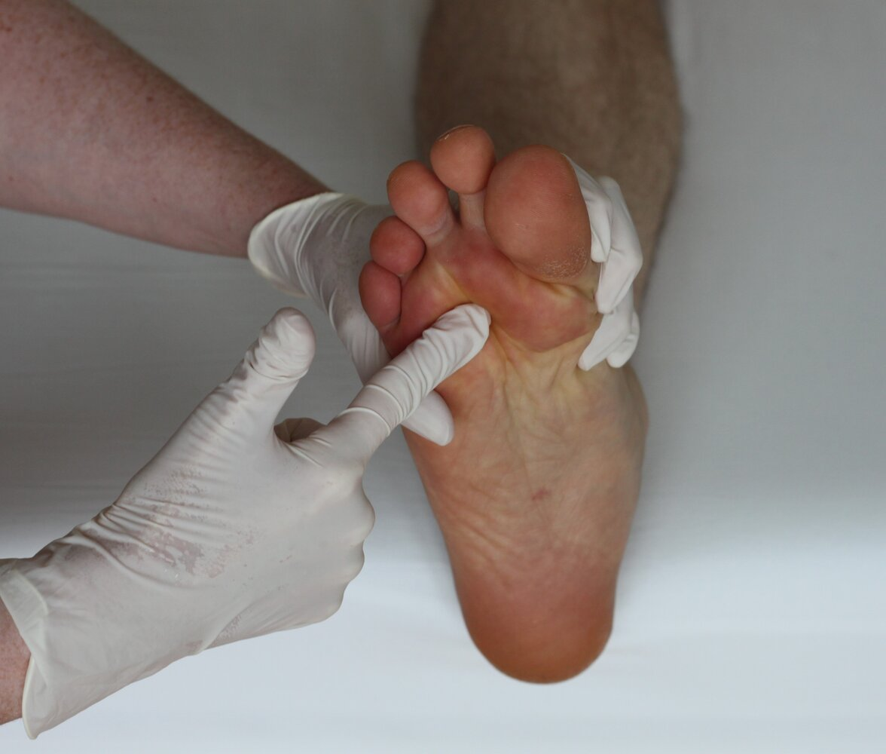
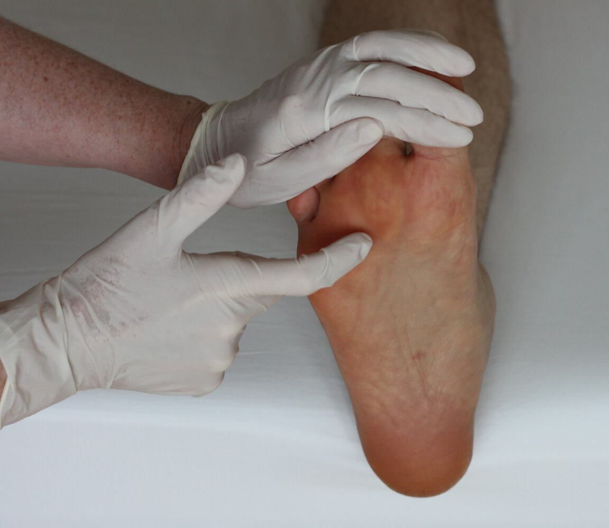

# Morton neuroma

*Categories: Clinical knowledge > Surgery > Trauma and orthopedic surgery > Lower extremity > Morton neuroma*

[Original Article Link](https://coursology-qbank.com/amboss/article/II0YVh)

---

## Summary

Morton <u>neuroma</u> (also known as an interdigital or intermetatarsal <u>neuroma</u>) is a benign forefoot <u>tumor</u> formed by thickening of the epineural and perineural tissue surrounding a <u>plantar</u> digital nerve. The etiology is unknown, but Morton <u>neuroma</u> is thought to be caused by chronic pressure on the affected <u>plantar</u> <u>metatarsal</u> structures. Manifestations include burning <u>pain</u> and numbness between the <u>metatarsal</u> heads of the foot that radiates to the adjacent toes. The third interdigital space is most commonly affected. Positive <u>Mulder sign</u> and <u>Tinel sign</u> support the <u>clinical diagnosis</u> of Morton <u>neuroma</u>. Imaging such as standing foot <u>radiography</u>, <u>ultrasound</u>, and <u>MRI</u> can be ordered if there is diagnostic uncertainty or to rule out alternative causes of chronic foot <u>pain</u>. <u>Conservative treatment</u> consists of avoiding activities that cause symptoms and modifying footwear by adding padding and/or using custom <u>orthotics</u>. Specialists may perform a <u>corticosteroid</u> injection or surgical excision of the nerve to help patients with persistent <u>pain</u>.

---

## Epidemiology

* Sex: <u>♀</u> > <u>♂</u> [[3]](https://coursology-qbank.com/amboss/article/hWdcOK0)

* Age of onset: 45–54 years

* The third interdigital space and nerve are involved in 87% of affected individuals. [[2]](https://coursology-qbank.com/amboss/article/cWda4K0)

> [!TIP]
> Morton <u>neuroma</u> is the second most common <u>compressive neuropathy</u> after <u>carpal tunnel syndrome</u>. [[2]](https://coursology-qbank.com/amboss/article/cWda4K0)[[3]](https://coursology-qbank.com/amboss/article/hWdcOK0)

Epidemiological data refers to the US, unless otherwise specified.

---

## Etiology

The etiology of Morton <u>neuroma</u> is unknown, but it is thought to be caused by chronic pressure on the affected <u>plantar</u> digital nerve. [[2]](https://coursology-qbank.com/amboss/article/cWda4K0)[[3]](https://coursology-qbank.com/amboss/article/hWdcOK0)[[4]](https://coursology-qbank.com/amboss/article/iddJpK0)

---

## Clinical features

* Burning <u>pain</u> and numbness on <u>plantar</u> surface [[2]](https://coursology-qbank.com/amboss/article/cWda4K0)

* Between the involved <u>metatarsal</u> heads of the foot

* Radiates to the two adjacent toes

* Patients may describe feeling a marble or pebble during <u>weight-bearing</u> activities. [[5]](https://coursology-qbank.com/amboss/article/RWdlOK0)

* <u>Pain</u> improves with rest and worsens with: [[2]](https://coursology-qbank.com/amboss/article/cWda4K0)

* Constrictive footwear

* <u>Weight-bearing</u> activities (e.g., walking, running) [[5]](https://coursology-qbank.com/amboss/article/RWdlOK0)

* Stretching the toes

> [!TIP]
> Symptoms most commonly occur in the third interdigital space. [[2]](https://coursology-qbank.com/amboss/article/cWda4K0)[[3]](https://coursology-qbank.com/amboss/article/hWdcOK0)

---

## Diagnosis

Morton <u>neuroma</u> is a <u>clinical diagnosis</u> based on history and provocation testing. If there is clinical uncertainty, order imaging to confirm the diagnosis or exclude alternative causes of chronic foot <u>pain</u>. [[2]](https://coursology-qbank.com/amboss/article/cWda4K0)

### Provocation testing [[2]](https://coursology-qbank.com/amboss/article/cWda4K0)

Provocation tests include:

* Mulder sign

* The forefoot is held firmly with one hand compressing the <u>metatarsal</u> heads in the <u>medial</u>-<u>lateral</u> direction.

* Pressure is applied to the sole between the affected <u>metatarsal</u> heads.

* Morton <u>neuroma</u> is confirmed with either of the following:

* Reproducible <u>pain</u>

* Palpable click or snapping sensation (<u>Mulder click</u>)

* <u>Tinel sign</u>

* The toes are extended with one hand while percussing the <u>plantar</u> surface of the affected intermetatarsal space with the other hand

* The test is positive if <u>pain</u> or a tingling sensation is produced.

Mulder sign in Morton neuroma

Tinel sign in Morton neuroma

### Imaging [[2]](https://coursology-qbank.com/amboss/article/cWda4K0)[[6]](https://coursology-qbank.com/amboss/article/Q61uk30)

* Standing <u>plain radiography</u> of the foot: to evaluate for alternative causes of chronic foot <u>pain</u>

* <u>MRI</u> of the foot without IV contrast or US: to confirm the diagnosis or to plan treatment  [[5]](https://coursology-qbank.com/amboss/article/RWdlOK0)

> [!TIP]
> Imaging is not routinely required to diagnose intermetatarsal <u>neuroma</u>. [[2]](https://coursology-qbank.com/amboss/article/cWda4K0)

---