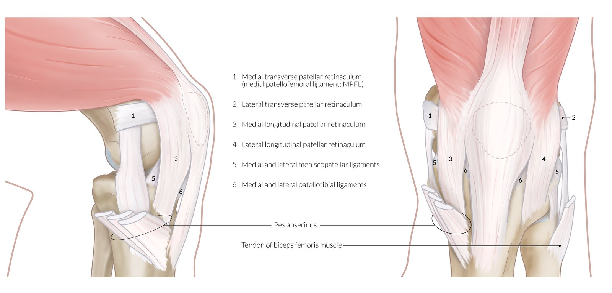
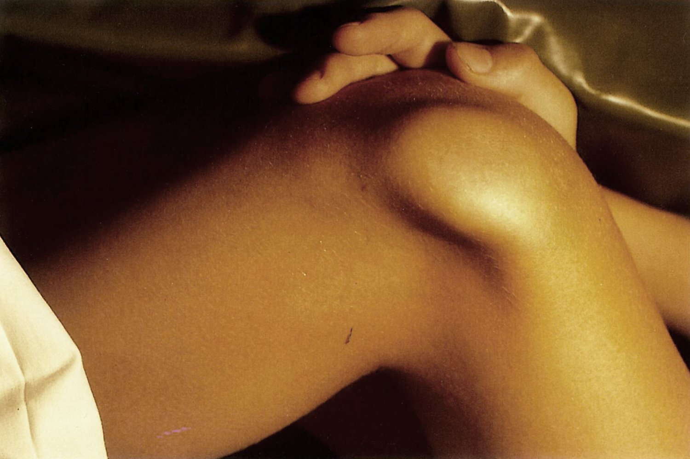
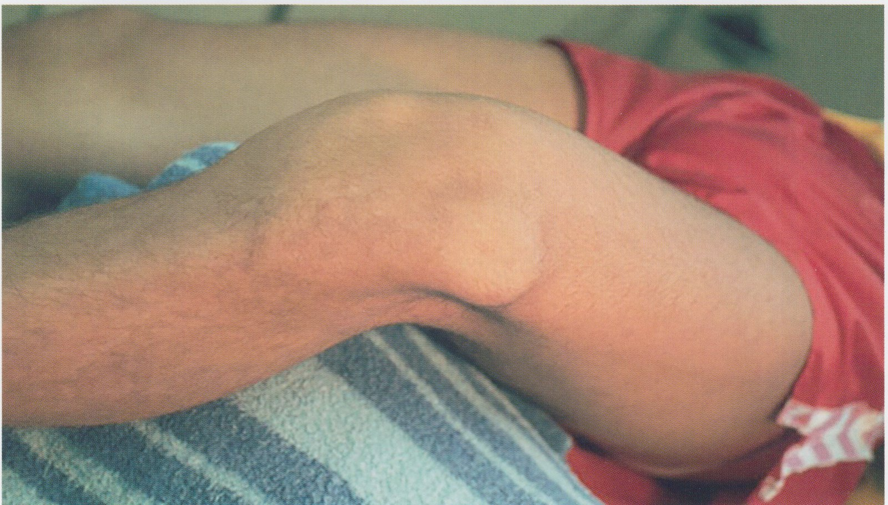
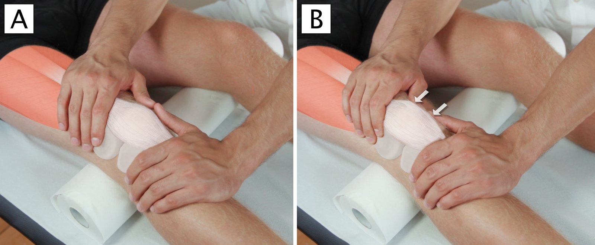
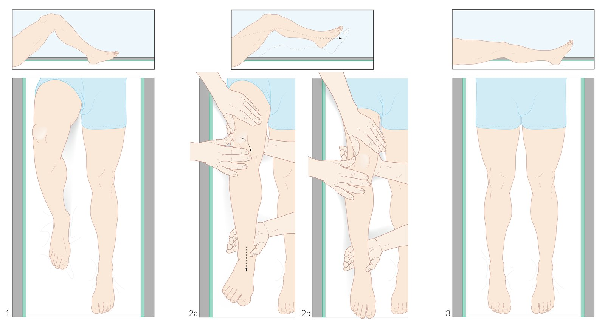
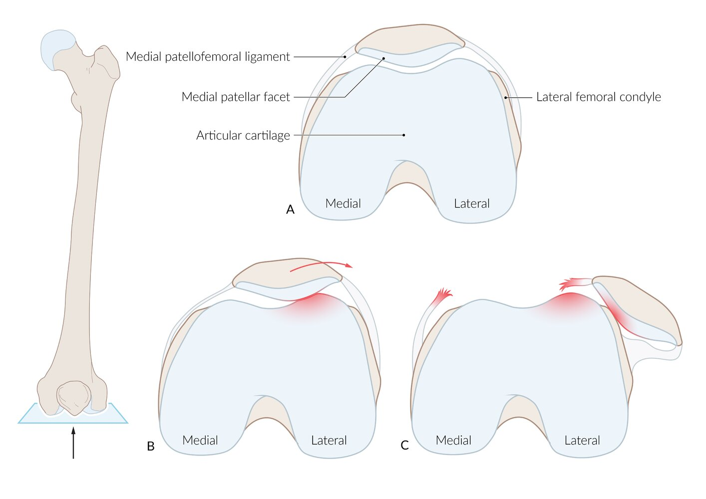

# Patellar dislocation

*Categories: Clinical knowledge > Surgery > Trauma and orthopedic surgery > Lower extremity > Patellar dislocation*

[Original Article Link](https://coursology-qbank.com/amboss/article/KQ0UCf)

---

## Summary

The patella is the largest <u>sesamoid bone</u> in the human body. It is located within the <u>quadriceps femoris</u> <u>tendon</u> and acts as a fulcrum to increase the force exerted on the <u>tibia</u>. In patellar <u>dislocation</u>, the patella slips out of the <u>femoral trochlear groove</u>, usually laterally. Patellar <u>dislocation</u> usually occurs following torsion of a semiflexed knee; less frequently, <u>dislocation</u> is the result of direct trauma to the patella. Recurrent <u>dislocation</u> may be associated with underlying biomechanical abnormalities such as <u>medial</u> patellofemoral <u>ligament injury</u>. In some patients, the condition is congenital. Patellar <u>dislocation</u> is primarily a <u>clinical diagnosis</u>, but <u>x-rays</u> should be obtained in all patients to rule out concomitant <u>osteochondral fractures</u>. <u>Joint aspiration</u> and/or further imaging (e.g., <u>MRI</u> or <u>CT scan</u>) may be indicated based on <u>physical examination</u> and/or <u>x-ray</u> findings. Many first episodes of patellar <u>dislocation</u> can be <u>managed conservatively</u>, but surgical treatment is often indicated for concurrent <u>fractures</u> or major <u>soft tissue</u> lesions, failure of <u>conservative management</u>, or recurrent <u>dislocations</u>.

---

## Epidemiology

* Sex: <u>♀</u> > <u>♂</u>

* The first episode of patellar <u>dislocation</u> typically happens before the age of 20 years.

* Up to 45% of patients will have recurrent patellar <u>dislocations</u> after the first episode.

Epidemiological data refers to the US, unless otherwise specified.

---

## Etiology

### Traumatic patellar <u>dislocations</u> [[4]](https://coursology-qbank.com/amboss/article/k91mnQ0)

* Non-contact (most common): usually due to a twisting injury when the knee is simultaneously in <u>flexion</u> and under valgus strain

* Direct contact: usually due to a direct sideward impact on the patella (e.g., during contact sports or a car accident)

### <u>Risk factors</u> for recurrent <u>dislocations</u> [[4]](https://coursology-qbank.com/amboss/article/k91mnQ0)

* Anatomical risk factors for patellar dislocation

* Patellofemoral <u>dysplasia</u> (trochlear <u>dysplasia</u> and patellar <u>dysplasia</u>)  [[4]](https://coursology-qbank.com/amboss/article/k91mnQ0)[[5]](https://coursology-qbank.com/amboss/article/nD17UQ0)

* A large <u>Q angle</u>; e.g., as seen in patients with <u>genu valgum</u> (“<u>knock-knee</u>” deformity) [[5]](https://coursology-qbank.com/amboss/article/nD17UQ0)

* Injury to the <u>medial</u> patellofemoral <u>ligament</u>

* <u>Weakness</u> of the <u>vastus medialis</u>

* Patella alta (high-riding patella)

* <u>Ligament</u> or <u>joint hypermobility</u>: e.g., due to <u>connective tissue</u> conditions (<u>Ehlers-Danlos syndrome</u>, <u>Marfan syndrome</u>)

* Lower extremity malalignment

* <u>Patellar subluxation</u>

* Younger age

* Skeletal immaturity

* Sports-related injury

* <u>Family history</u> of patellar <u>dislocation</u>

* History of <u>contralateral</u> patellar <u>dislocation</u>

> [!TIP]
> Over 90% of patellar <u>dislocations</u> result from a twisting injury when the knee is simultaneously in <u>flexion</u> and under valgus strain, often during an activity such as sports or dance, rather than from direct traumatic contact. [[4]](https://coursology-qbank.com/amboss/article/k91mnQ0)[[6]](https://coursology-qbank.com/amboss/article/8D1OTQ0)

Ligaments and retinacula of the patella

---

## Clinical features

* Severe <u>pain</u>

* Knee <u>joint effusion</u>  [[7]](https://coursology-qbank.com/amboss/article/XC19qQ0)[[8]](https://coursology-qbank.com/amboss/article/1VW2t40)

* Restricted <u>range of motion</u> and instability in the knee [[5]](https://coursology-qbank.com/amboss/article/nD17UQ0)

* Feeling of knee moving or giving way after injury [[5]](https://coursology-qbank.com/amboss/article/nD17UQ0)

* <u>Dislocation</u> of the patella, which is almost always <u>lateral</u>   [[4]](https://coursology-qbank.com/amboss/article/k91mnQ0)

* Ongoing feeling of instability

* Positive <u>lateral</u> patellar apprehension test: indicates <u>lateral</u> <u>patellar instability</u>   [[9]](https://coursology-qbank.com/amboss/article/TSW6_k0)[[10]](https://coursology-qbank.com/amboss/article/VC1GIQ0)

* Relax the knee in 30 degrees of <u>flexion</u>.

* Apply <u>lateral</u> force to the <u>medial</u> patella.

* Positive test: the maneuver produces discomfort or apprehension (either expressed by the patient or evidenced by contraction of the <u>quadriceps</u>)

* <u>Anatomical risk factors for patellar dislocation</u>

Lateral patellar dislocation

Lateral patellar dislocation

The patellar apprehension test

---

## Treatment

There are currently no consensus guidelines for the management of patellar <u>dislocation</u>. The decision to proceed with conservative versus surgical management may vary based on patient and provider preferences. [[2]](https://coursology-qbank.com/amboss/article/4913nQ0)[[4]](https://coursology-qbank.com/amboss/article/k91mnQ0)

### <u>Conservative management</u> [[1]](https://coursology-qbank.com/amboss/article/KD1U2Q0)[[2]](https://coursology-qbank.com/amboss/article/4913nQ0)[[4]](https://coursology-qbank.com/amboss/article/k91mnQ0)

The patella often relocates spontaneously, making manual reduction unnecessary. [[1]](https://coursology-qbank.com/amboss/article/KD1U2Q0)

#### Indications

* Initial <u>dislocation</u> without associated <u>osteochondral fractures</u> or significant <u>soft tissue</u> injuries

* Recurrent <u>dislocation</u> if patient prefers nonsurgical treatment [[2]](https://coursology-qbank.com/amboss/article/4913nQ0)

#### Methods

* Manual reduction of the patella   [[5]](https://coursology-qbank.com/amboss/article/nD17UQ0)

* Provide adequate <u>pain management</u>; consider <u>procedural sedation</u>.

* Fully extend the knee.

* Push the patella medially to guide it back into the femoral trochlea.

* <u>Pain management</u>

* <u>Immobilization</u> for up to 6 weeks with <u>weight-bearing as tolerated</u>.  [[4]](https://coursology-qbank.com/amboss/article/k91mnQ0)[[6]](https://coursology-qbank.com/amboss/article/8D1OTQ0)

* <u>Physical therapy</u> to improve knee <u>range of motion</u> and strengthen the <u>quadriceps</u>

### <u>Surgery</u> [[1]](https://coursology-qbank.com/amboss/article/KD1U2Q0)[[2]](https://coursology-qbank.com/amboss/article/4913nQ0)[[4]](https://coursology-qbank.com/amboss/article/k91mnQ0)

* Indications [[4]](https://coursology-qbank.com/amboss/article/k91mnQ0)

* Associated <u>osteochondral fractures</u>

* Significant injury to <u>medial</u> stabilizing structures of the knee

* Failure of <u>conservative management</u>

* Recurrent <u>dislocations</u>

* Methods

* <u>Arthroscopy</u>: in some patients, may be used to repair intra-articular loose bodies and some <u>osteochondral fractures</u> [[1]](https://coursology-qbank.com/amboss/article/KD1U2Q0)

* <u>Surgery</u> to stabilize the patella and correct <u>anatomical risk factors for patellar dislocation</u>, e.g.:

* Repair or reconstruction of the <u>medial</u> patellofemoral <u>ligament</u>

* <u>Tibial tubercle</u> transfer  [[2]](https://coursology-qbank.com/amboss/article/4913nQ0)

* Trochleoplasty (in patients with trochlear <u>dysplasia</u>)  [[13]](https://coursology-qbank.com/amboss/article/lC1vHQ0)

Reduction of patellar dislocation

---

## Complications

* Additional injuries associated with acute patellar <u>dislocation</u>

* Tear in the <u>medial</u> patellar retinaculum

* A small <u>avulsion fracture</u> of the <u>lateral</u> femoral condyle or patella

* Recurrent patellar <u>dislocation</u> → <u>osteoarthritis</u>

Patellar dislocation

We list the most important complications. The selection is not exhaustive.

---