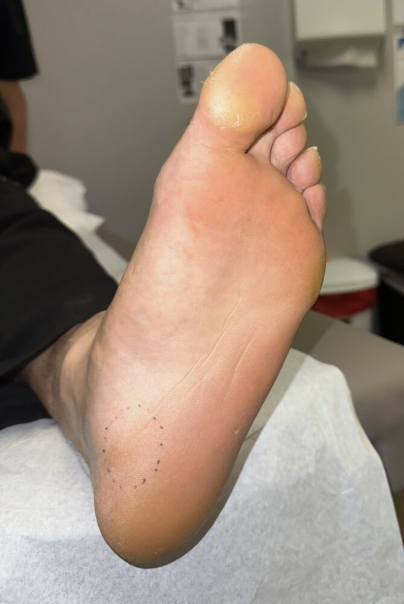
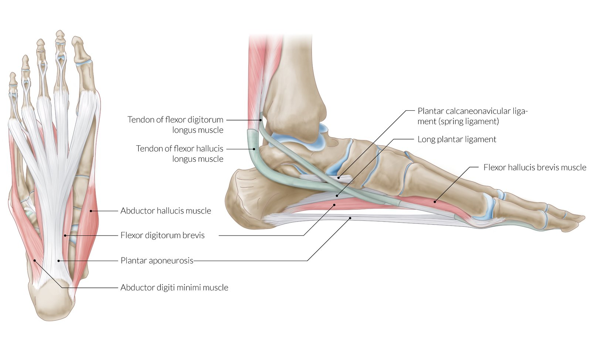
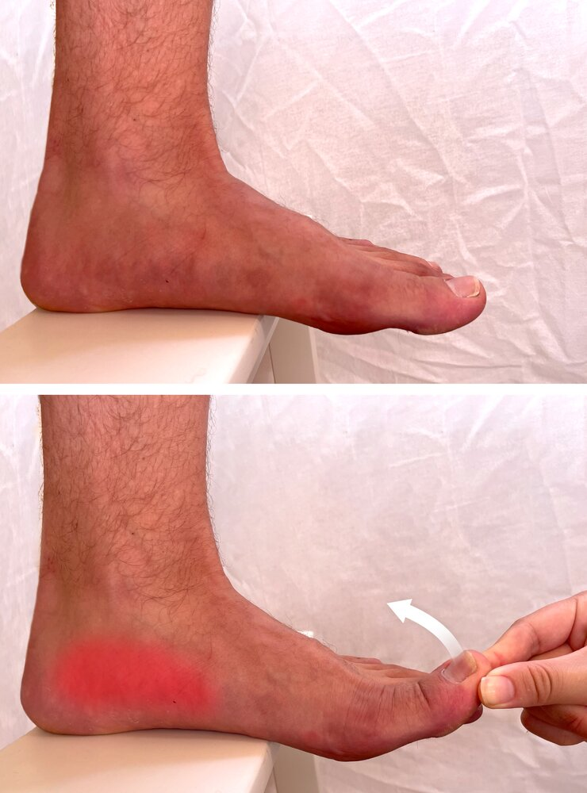

# Plantar fasciitis

*Categories: Clinical knowledge > Surgery > Trauma and orthopedic surgery > Lower extremity > Plantar fasciitis*

[Original Article Link](https://coursology-qbank.com/amboss/article/KG0UZ3)

---

## Summary

<u>Plantar</u> <u>fasciitis</u> is a common condition that affects the deep <u>plantar fascia</u>, resulting in foot and heel <u>pain</u>. Although it is traditionally thought to be an inflammatory-driven process, histological analysis in affected patients typically shows degenerative changes. Peak <u>incidence</u> is between 40–60 years of age, but an earlier onset is possible, especially in people engaged in repetitive activities such as running and dancing. Other <u>risk factors</u> include <u>foot deformities</u>, prolonged <u>weight bearing</u>, elevated <u>BMI</u>, and limited ankle <u>dorsiflexion</u>. <u>Plantar</u> <u>fasciitis</u> is characterized by foot and/or heel <u>pain</u> that is typically worse first thing in the morning, then improves throughout the day before returning in the evening. <u>Pain</u> is usually unilateral but may be bilateral in up to a third of cases. On examination, there is tenderness to palpation at the medioplantar surface. Diagnosis is usually clinical, but imaging may be helpful in patients with atypical, severe, or persistent symptoms, or to exclude differential diagnoses (e.g., <u>calcaneal stress fracture</u>). Treatment is usually conservative and includes NSAIDS and activity modification. <u>Surgery</u> may be considered for patients with refractory <u>pain</u>.

---

## Etiology

Not well studied but is thought to be an overuse condition resulting in degenerative changes  [[1]](https://coursology-qbank.com/amboss/article/so1tW30)

### <u>Risk factors</u> [[1]](https://coursology-qbank.com/amboss/article/so1tW30)

* <u>Modifiable risk factors</u>

* Repetitive, high-impact activities

* High <u>BMI</u> (> 27 kg/m2)

* Prolonged <u>weight-bearing</u>

* Sedentary lifestyle

* Intrinsic foot and/or calf muscle tightness

* Structural <u>risk factors</u>

* Limited ankle <u>dorsiflexion</u>

* <u>Foot deformities</u>

* <u>Pes planus</u>

* <u>Pes cavus</u>

* <u>Leg length discrepancy</u>

---

## Clinical features

* Stabbing, nonradiating <u>pain</u> that affects the heel and sole of the foot (medioplantar surface) [[1]](https://coursology-qbank.com/amboss/article/so1tW30)

* Worse first thing in the morning or after inactivity

* Improves throughout the day

* Worsens again towards the end of the day because of prolonged <u>weight-bearing activity</u>

* Usually gradual onset

* May be unilateral or bilateral  [[2]](https://coursology-qbank.com/amboss/article/to1Xd30)

* On examination, there is tenderness at the <u>calcaneal</u> insertion of the <u>plantar</u> <u>aponeurosis</u>.   [[1]](https://coursology-qbank.com/amboss/article/so1tW30)

> [!TIP]
> Commonly, <u>pain</u> starts after a recent increase in activity. [[1]](https://coursology-qbank.com/amboss/article/so1tW30)

Area of tenderness on palpation in plantar fasciitis

Plantar aponeurosis and the medial longitudinal arch of the foot

---

## Diagnosis

### General principles [[1]](https://coursology-qbank.com/amboss/article/so1tW30)[[3]](https://coursology-qbank.com/amboss/article/zJ1r930)

* Diagnosis is usually clinical.

* Provocative tests such as the <u>windlass test</u> may be helpful in the diagnosis.

* Consider imaging in diagnostic uncertainty or refractory <u>pain</u>.

> [!WARNING]
> <u>Fever</u>, <u>polyarthralgia</u>, inability to bear weight, <u>paresthesia</u>, and/or numbness suggest <u>differential diagnoses of plantar fasciitis</u> and usually require further evaluation with <u>laboratory studies</u> and/or imaging. [[1]](https://coursology-qbank.com/amboss/article/so1tW30)

### Provocative tests

* Performing the windlass test can aid in the diagnosis of <u>plantar</u> <u>fasciitis</u>.  [[4]](https://coursology-qbank.com/amboss/article/jF1_3i0)

* The patient is asked to stand on a step stool with the toes overhanging the edge.

* The great toe is then passively <u>dorsiflexed</u>.

* The result is positive if <u>pain</u> is reproduced over the <u>calcaneal</u> insertion of the <u>plantar</u> <u>aponeurosis</u>.

* High <u>specificity</u> (100%) but low <u>sensitivity</u> (32%) for <u>plantar</u> <u>fasciitis</u>. [[1]](https://coursology-qbank.com/amboss/article/so1tW30)

Windlass test for plantar fasciitis

### Imaging [[3]](https://coursology-qbank.com/amboss/article/zJ1r930)[[5]](https://coursology-qbank.com/amboss/article/Q61uk30)

* Indications

* To rule out <u>differential diagnoses of plantar fasciitis</u>

* Worsening or atypical symptoms

* Persistent symptoms after 3–6 months of <u>conservative management</u> [[1]](https://coursology-qbank.com/amboss/article/so1tW30)

* Modalities

* First-line: <u>x-ray</u> foot (<u>weight-bearing</u>)  [[5]](https://coursology-qbank.com/amboss/article/Q61uk30)

* Further studies: <u>ultrasound</u>, <u>MRI</u>

* Findings are usually nonspecific; e.g:

* <u>Bone spurs</u>

* <u>Plantar fascia</u> thickening

* <u>Edema</u> at the insertion of the <u>calcaneus</u>

> [!TIP]
> <u>X-ray</u> is the preferred imaging modality for the initial evaluation of patients with chronic foot <u>pain</u>. If symptoms persist and etiology is unclear, obtain an <u>ultrasound</u> or <u>MRI</u>. [[5]](https://coursology-qbank.com/amboss/article/Q61uk30)

Plantar calcaneal spur

Achilles and plantar calcaneal spurs

---

## Treatment

Initial management, which should be offered to all patients, improves symptoms in ∼ 80% of patients by 12 months. [[1]](https://coursology-qbank.com/amboss/article/so1tW30)

### Initial management  [[1]](https://coursology-qbank.com/amboss/article/so1tW30)[[3]](https://coursology-qbank.com/amboss/article/zJ1r930)

* Reduction of biomechanical <u>stress</u>

* Rest and activity modification

* Avoidance of nonsupportive shoes  [[3]](https://coursology-qbank.com/amboss/article/zJ1r930)

* Consideration of external support (e.g., foot taping, <u>orthotic insoles</u>)  [[1]](https://coursology-qbank.com/amboss/article/so1tW30)[[3]](https://coursology-qbank.com/amboss/article/zJ1r930)

* Patients with high <u>BMI</u>: <u>obesity management</u> [[3]](https://coursology-qbank.com/amboss/article/zJ1r930)

* Stretching and strengthening exercises specific for the <u>plantar fascia</u>   [[3]](https://coursology-qbank.com/amboss/article/zJ1r930)

* <u>Pain management</u>, which may include:

* NSAIDS

* <u>Corticosteroid</u> injections   [[1]](https://coursology-qbank.com/amboss/article/so1tW30)[[3]](https://coursology-qbank.com/amboss/article/zJ1r930)

* Botulin toxin injections [[1]](https://coursology-qbank.com/amboss/article/so1tW30)[[7]](https://coursology-qbank.com/amboss/article/OF1IRi0)

### Refractory <u>plantar</u> <u>fasciitis</u> [[1]](https://coursology-qbank.com/amboss/article/so1tW30)[[3]](https://coursology-qbank.com/amboss/article/zJ1r930)

<u>Plantar</u> <u>fasciitis</u> may become subacute (lasting 6–12 weeks) or chronic (lasting > 12 weeks) despite initial management; <u>extracorporeal shockwave therapy</u> or <u>surgery</u> may be required. [[3]](https://coursology-qbank.com/amboss/article/zJ1r930)

#### <u>Extracorporeal shockwave therapy</u>

* Indications: refractory subacute or chronic <u>plantar</u> <u>fasciitis</u> [[1]](https://coursology-qbank.com/amboss/article/so1tW30)[[3]](https://coursology-qbank.com/amboss/article/zJ1r930)

* Techniques [[3]](https://coursology-qbank.com/amboss/article/zJ1r930)

* 3–5 sessions of low-energy treatment (anesthesia not required)

* 1 session of high-energy treatment (sedation required)

#### <u>Surgery</u> [[3]](https://coursology-qbank.com/amboss/article/zJ1r930)

* Indications: appropriate if no clinical improvement after 6–12 months of nonsurgical management

* Techniques

* <u>Plantar</u> <u>fasciotomy</u> (open or endoscopic)

* If <u>equinus deformity</u> is also present: <u>gastrocnemius</u> release

> [!TIP]
> Treatment should be individualized to the patient's symptoms, lifestyle, and activity levels. [[1]](https://coursology-qbank.com/amboss/article/so1tW30)[[3]](https://coursology-qbank.com/amboss/article/zJ1r930)

> [!WARNING]
> There is no evidence for or against <u>acupuncture</u> or injection of <u>autologous</u> <u>blood products</u> (whole blood or <u>platelet</u>-rich plasma) in the treatment of <u>plantar</u> <u>fasciitis</u>; routine use is not currently recommended. [[1]](https://coursology-qbank.com/amboss/article/so1tW30)[[3]](https://coursology-qbank.com/amboss/article/zJ1r930)

---