# Primary malignant bone tumors

*Categories: Clinical knowledge > Surgery > Trauma and orthopedic surgery > Neoplasia > Primary malignant bone tumors*

[Original Article Link](https://coursology-qbank.com/amboss/article/HQ0Kxf)

---

## Summary

Primary malignant bone tumors are rare <u>malignant tumors</u> that arise from native <u>bone tissue</u>, such as <u>osteoblasts</u>, <u>chondrocytes</u>, and <u>mesenchymal stem cells</u>. <u>Osteosarcoma</u> and <u>Ewing sarcoma</u> are the most common types in children and <u>adolescents</u>, while <u>chondrosarcoma</u> is most common in adults. Initial manifestations typically include localized <u>pain</u> and swelling, which may become apparent after an injury to the site. Primary malignant bone tumors may <u>metastasize</u> hematogenously to the <u>lungs</u> and skeletal system; regional spread and <u>skip lesions</u> may also occur. <u>X-ray</u> is the preferred initial diagnostic test. Characteristic radiographic features include a focal lytic and/or <u>sclerotic</u> lesion, typically with an <u>aggressive periosteal reaction</u>. If a primary malignant bone <u>tumor</u> is suspected, prompt specialist referral (e.g., to orthopedic oncology) is recommended for diagnostic confirmation on <u>biopsy</u>, staging, and further management. When feasible, complete surgical excision of the primary <u>tumor</u> is preferred. <u>Ewing sarcoma</u>, unlike other primary malignant bone tumors, is also responsive to <u>definitive radiotherapy</u>. <u>Combination chemotherapy</u> and <u>adjuvant radiation therapy</u> are often indicated for the management of <u>osteosarcoma</u> and <u>Ewing sarcoma</u> but are generally less effective in the management of <u>chondrosarcoma</u>. Long-term surveillance for early detection of recurrence is recommended.

---

## Overview

### Types of primary malignant bone tumors

| Overview of primary malignant bone tumors |  |  |  |
| --- | --- | --- | --- |
| ‎ |  <u>Osteosarcoma</u> [[1]](https://coursology-qbank.com/amboss/article/LBdwYs0)  |  <u>Ewing sarcoma</u> [[1]](https://coursology-qbank.com/amboss/article/LBdwYs0)  |  <u>Chondrosarcoma</u> [[2]](https://coursology-qbank.com/amboss/article/AAdRms0)[[3]](https://coursology-qbank.com/amboss/article/yAddms0)  |
| Age group |   * <u>Primary osteosarcoma</u>: children and <u>adolescents</u>  * <u>Secondary osteosarcoma</u>: individuals aged ≥ 65 years    |  * Children and <u>adolescents</u>   |  * Adults aged > 50 years   |
|  Typical location of primary <u>tumor</u>   |  * <u>Metaphysis</u> of <u>long bones</u>   |   * <u>Diaphysis</u> of <u>long bones</u>  * <u>Pelvis</u>    |   * <u>Pelvis</u>  * <u>Intramedullary</u> cavity of <u>long bones</u>    |
| Characteristic <u>x-ray</u> findings |   * <u>Osteolytic</u> and <u>osteosclerotic</u> lesions  * <u>Aggressive periosteal reaction</u>, typically:   * <u>Sunburst appearance</u>  * <u>Codman triangles</u>    |   * Lytic bone lesions with extensive bone destruction (moth-eaten appearance)  * <u>Aggressive periosteal reaction</u>, typically:  * Lamellated (<u>onion skin appearance</u>)  * <u>Codman triangles</u> [[4]](https://coursology-qbank.com/amboss/article/JbVsuG0)    |   * <u>Osteolytic</u> and <u>osteosclerotic</u> lesions  * High-grade tumors: bone destruction (moth-eaten appearance)  * <u>Endosteal scalloping</u>  * Intralesional calcifications    |
| Treatment of localized disease |   * <u>Surgery</u>  * Selected patients: <u>combination chemotherapy</u> and/or <u>adjuvant radiotherapy</u>    |   * <u>Combination chemotherapy</u>  * <u>Surgery</u> OR <u>definitive radiotherapy</u>    |  * <u>Surgery</u>   |
| Five-year survival rate |  * ∼ 60% (localized disease) [[5]](https://coursology-qbank.com/amboss/article/qbVCuG0)   |  * ∼ 70% (localized disease) [[4]](https://coursology-qbank.com/amboss/article/JbVsuG0)   |  * ∼ 90% (low grade disease) [[2]](https://coursology-qbank.com/amboss/article/AAdRms0)   |

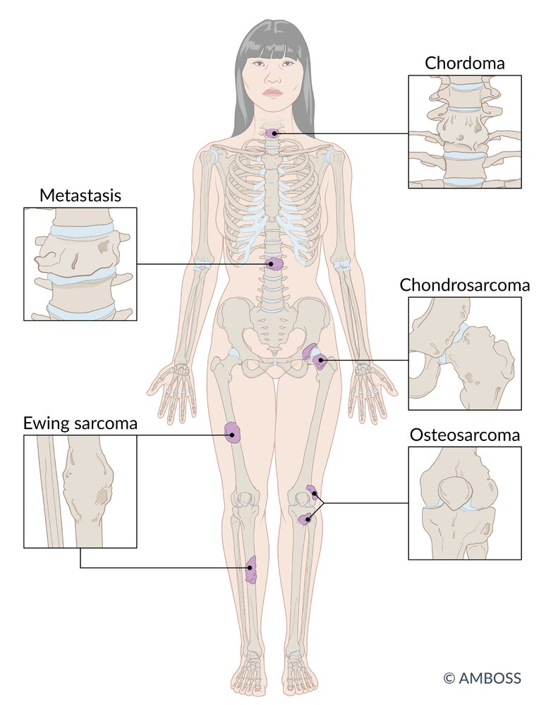

Typical locations of malignant bone tumors

Permeative bone lesion

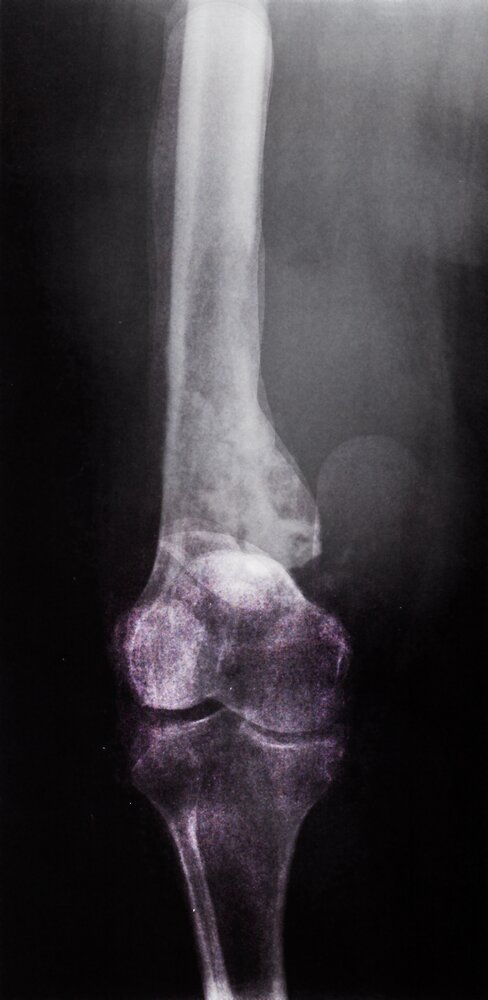

Osteosarcoma

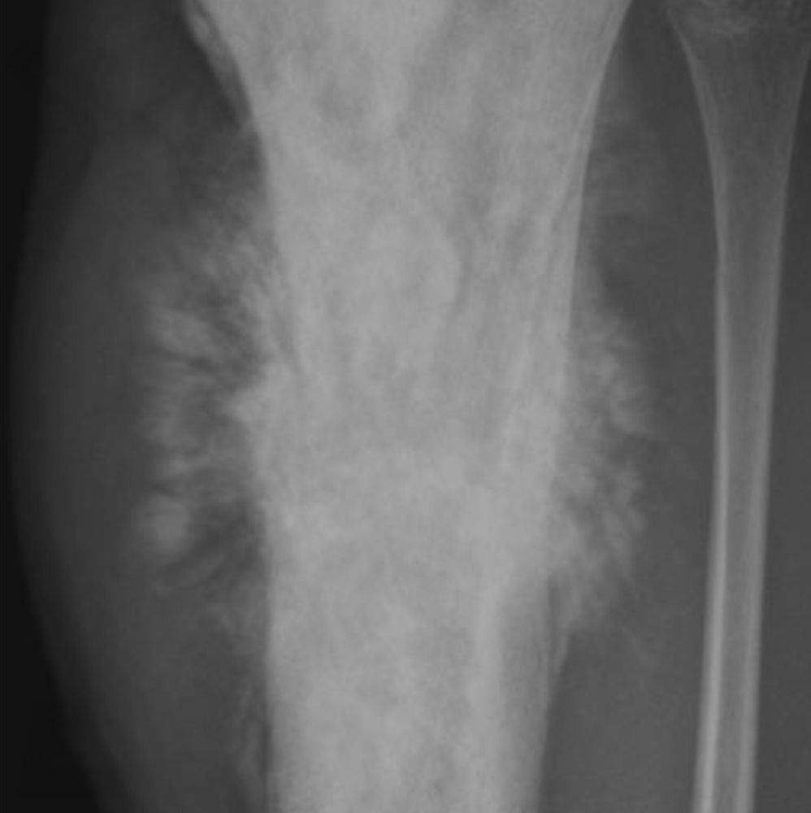

Aggressive bone tumor

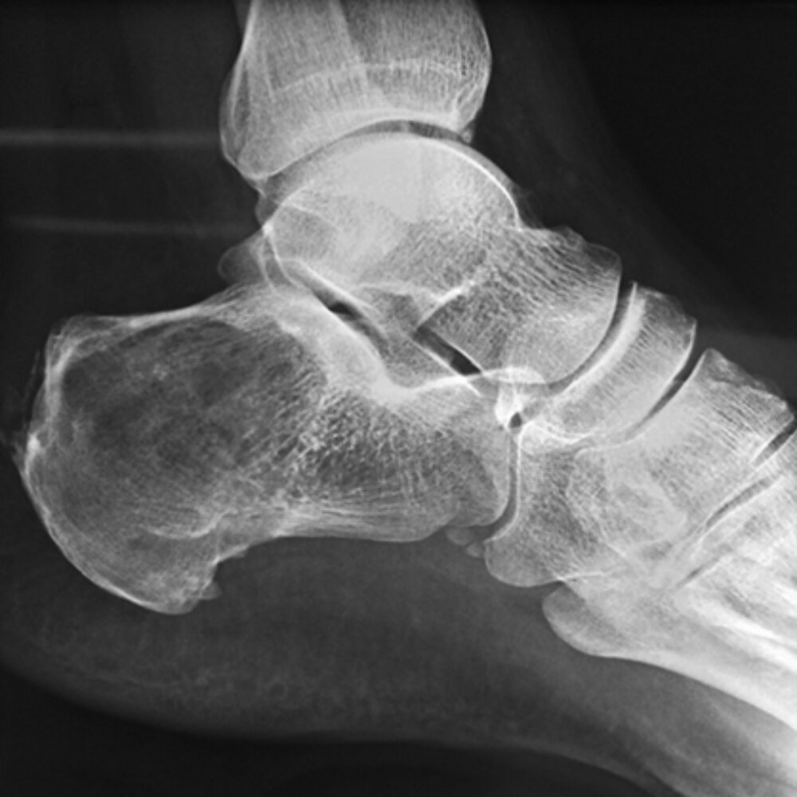

Lytic calcaneal lesion with calcifications

### Clinical features [[1]](https://coursology-qbank.com/amboss/article/LBdwYs0)[[6]](https://coursology-qbank.com/amboss/article/8AdOls0)

* Localized <u>pain</u>

* Intermittent at first; progresses to <u>pain</u> at rest [[7]](https://coursology-qbank.com/amboss/article/X_d95s0)

* May worsen at night

* May manifest after minor trauma

* Localized swelling, sometimes associated with tenderness and <u>erythema</u>

* <u>B symptoms</u> may be present, especially in patients with <u>Ewing sarcoma</u>.

* Decreased <u>range of motion</u> if the <u>tumor</u> is near a <u>joint</u>

* Altered gait (e.g., limp) [[8]](https://coursology-qbank.com/amboss/article/bWdHPK0)

* <u>Pathological fractures</u> may be the presenting symptom.

> [!WARNING]
> Primary bone tumors often present insidiously with intermittent symptoms. Maintain a low threshold to evaluate persistent or recurrent bone <u>pain</u> or swelling. [[1]](https://coursology-qbank.com/amboss/article/LBdwYs0)

### Diagnostic approach to suspected primary malignant bone tumors [[1]](https://coursology-qbank.com/amboss/article/LBdwYs0)[[6]](https://coursology-qbank.com/amboss/article/8AdOls0)[[9]](https://coursology-qbank.com/amboss/article/1_d2Ms0)

* Obtain a comprehensive <u>medical history</u> and perform a thorough <u>physical examination</u>.

* Consider common <u>differential diagnoses of bone pain</u>.

* Obtain an <u>x-ray</u> of the area of interest (initial test of choice).

* Symptomatic bone lesion identified on <u>x-ray</u>:

* Patients aged < 40 years: Refer to specialist (e.g., orthopedic oncology) for further evaluation, including:  [[1]](https://coursology-qbank.com/amboss/article/LBdwYs0)

* Additional imaging (e.g., <u>MRI</u> ± CT of primary site; CT chest, <u>FDG-PET/CT</u>, and/or <u>bone scan</u> to evaluate for <u>metastases</u>)

* Staging (prior to obtaining a <u>biopsy</u>)

* Confirmation of diagnosis with <u>incisional biopsy</u> or <u>core needle biopsy</u>  [[1]](https://coursology-qbank.com/amboss/article/LBdwYs0)

* Patients aged ≥ 40 years: Perform <u>diagnostic evaluation for bone metastases</u> as indicated.

* Normal or equivocal findings on <u>x-ray</u> but high clinical suspicion for primary malignant bone <u>tumor</u>: 

* Obtain an <u>MRI</u> without or without and with IV contrast of the area of interest.  [[9]](https://coursology-qbank.com/amboss/article/1_d2Ms0)

* Consider referral to specialist (e.g., orthopedic oncology).

* Consider supportive <u>laboratory studies</u> (e.g., <u>CMP</u> with <u>calcium</u>, <u>ALP</u>, <u>LDH</u>, <u>CBC</u>, <u>ESR</u>, <u>CRP</u>). [[7]](https://coursology-qbank.com/amboss/article/X_d95s0)

* Refer for <u>genetic counseling</u> and testing in selected patients (e.g., patients with <u>hereditary cancer syndromes</u>, <u>family history</u> of bone <u>sarcoma</u>).

> [!WARNING]
> Staging of a suspected primary malignant bone <u>tumor</u> should be performed by a specialist before <u>biopsy</u>. [[1]](https://coursology-qbank.com/amboss/article/LBdwYs0)

> [!TIP]
> In individuals aged < 40 years, the likelihood of a bone lesion being a primary malignant bone <u>tumor</u> is high. [[1]](https://coursology-qbank.com/amboss/article/LBdwYs0)

### Differential diagnosis of bone pain [[1]](https://coursology-qbank.com/amboss/article/LBdwYs0)[[7]](https://coursology-qbank.com/amboss/article/X_d95s0)

* <u>Growing pains</u>

* Musculoskeletal injury (e.g., <u>stress fractures</u>)

* <u>Osteomyelitis</u>

* <u>Avascular necrosis</u>

* <u>Acute gout</u>

* <u>Benign bone tumors</u>, e.g.:

* <u>Osteochondroma</u>

* <u>Giant cell tumor of the bone</u>

* <u>Aneurysmal bone cysts</u>

* <u>Chondroblastoma</u>

* <u>Langerhans cell histiocytosis</u>

* <u>Bone metastasis</u>

* <u>Multiple myeloma</u>

* <u>Paget disease of bone</u>

* <u>Hyperparathyroidism</u>

### Management [[1]](https://coursology-qbank.com/amboss/article/LBdwYs0)[[6]](https://coursology-qbank.com/amboss/article/8AdOls0)

* When feasible, complete surgical excision of the primary <u>tumor</u> is preferred.  [[1]](https://coursology-qbank.com/amboss/article/LBdwYs0)

* <u>Ewing sarcoma</u> is also responsive to <u>definitive radiotherapy</u>.

* Additional treatment (e.g., <u>neoadjuvant</u> and <u>adjuvant chemotherapy</u>, <u>radiation therapy</u>) varies based on specific cancer type; see respective sections for details.

* Refer patients planning for <u>chemotherapy</u> for <u>fertility</u> consultation.

* In successfully treated patients, long-term surveillance is necessary to monitor for recurrence and post-treatment complications.

* See "<u>Principles of cancer care</u>" for general management strategies for patients with cancer.

---

## Osteosarcoma

### <u>Epidemiology</u>

* Most common primary bone <u>malignancy</u> in children and <u>adolescents</u> [[1]](https://coursology-qbank.com/amboss/article/LBdwYs0)

* Peak <u>incidence</u> [[1]](https://coursology-qbank.com/amboss/article/LBdwYs0)

* <u>Primary osteosarcoma</u>: 10–14 years of age

* <u>Secondary osteosarcoma</u>: individuals aged > 65 years

* Sex: <u>♂</u> > <u>♀</u> [[6]](https://coursology-qbank.com/amboss/article/8AdOls0)

### Etiology [[1]](https://coursology-qbank.com/amboss/article/LBdwYs0)[[6]](https://coursology-qbank.com/amboss/article/8AdOls0)[[10]](https://coursology-qbank.com/amboss/article/4bV3FG0)

<u>Osteosarcoma</u> is a malignant, <u>osteoid</u>-forming bone <u>tumor</u> arising from <u>mesenchymal stem cells</u> (<u>osteoblasts</u>).

* Primary osteosarcoma arises spontaneously in previously healthy bones.

* <u>Idiopathic</u>

* Increased <u>incidence</u> in individuals with <u>genetic cancer syndromes</u>, e.g.: 

* <u>Hereditary retinoblastoma</u>

* <u>Li-Fraumeni syndrome</u>

* Secondary osteosarcoma arises in previously abnormal or diseased bone, e.g.: 

* <u>Paget disease of bone</u>

* <u>Radiation injury</u>

* <u>Bone infarction</u>

### Sites of involvement [[1]](https://coursology-qbank.com/amboss/article/LBdwYs0)[[6]](https://coursology-qbank.com/amboss/article/8AdOls0)

* Primary <u>tumor</u>: <u>metaphyses</u> of <u>long bones</u> (particularly <u>distal</u> <u>femur</u>, <u>proximal</u> <u>tibia</u>, and <u>proximal</u> <u>humerus</u>)

* <u>Metastases</u> 

* Hematogenous spread: <u>lungs</u> (most common), skeletal system

* Regional spread: along the involved bone, forming <u>skip lesions</u>

> [!TIP]
> <u>Primary osteosarcoma</u> typically arises from the metaphyseal region (near the <u>growth plate</u>) during periods of rapid skeletal growth. [[1]](https://coursology-qbank.com/amboss/article/LBdwYs0)[[6]](https://coursology-qbank.com/amboss/article/8AdOls0)

### Diagnostics [[1]](https://coursology-qbank.com/amboss/article/LBdwYs0)

See “<u>Diagnostic approach to suspected primary malignant bone tumors</u>.”

* <u>X-ray</u> findings [[11]](https://coursology-qbank.com/amboss/article/uAdpls0)

* <u>Osteolytic</u> and <u>osteosclerotic</u> lesions in the metaphyseal region

* <u>Aggressive periosteal reactions</u>: <u>sunburst appearance</u>, <u>Codman triangles</u>, <u>hair-on-end appearance</u>

* Laboratory findings: : ↑ <u>ALP</u>, ↑ <u>LDH</u>, ↑ <u>ESR</u> ,↑ <u>CRP</u> [[12]](https://coursology-qbank.com/amboss/article/OXVIyG0)

* <u>Histology</u> findings  [[13]](https://coursology-qbank.com/amboss/article/miVVH80)

* <u>Pleomorphic</u>, malignant <u>osteoblasts</u> that produce <u>osteoid</u>

* <u>Osteosarcomas</u> always feature <u>woven bone</u> matrix (in contrast to <u>chondrosarcomas</u> and <u>fibrosarcomas</u>).

Osteosarcoma

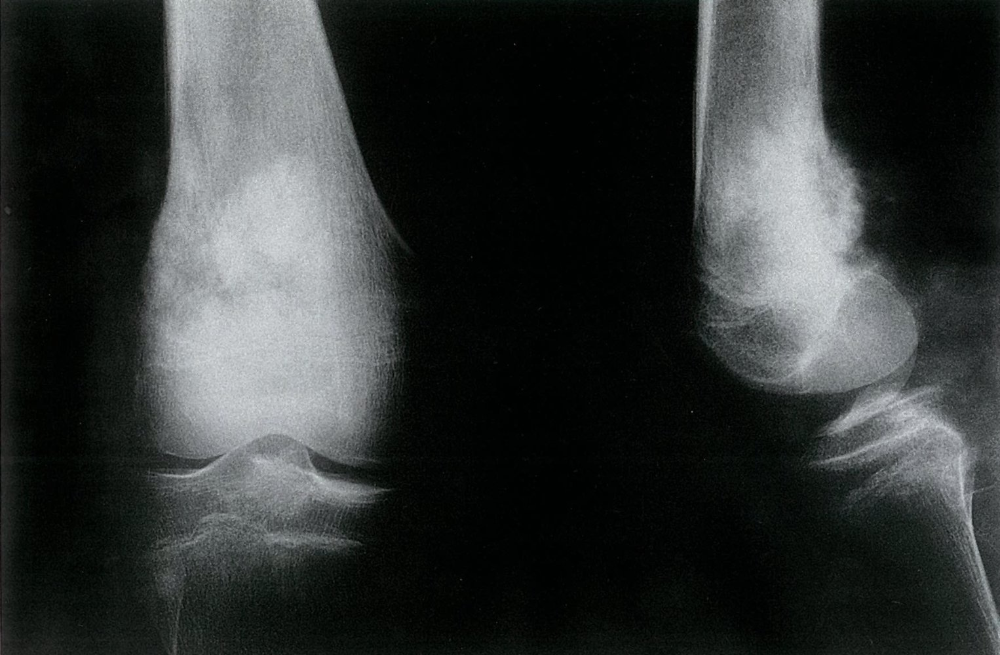

Osteosarcoma of the distal femur

Aggressive bone tumor

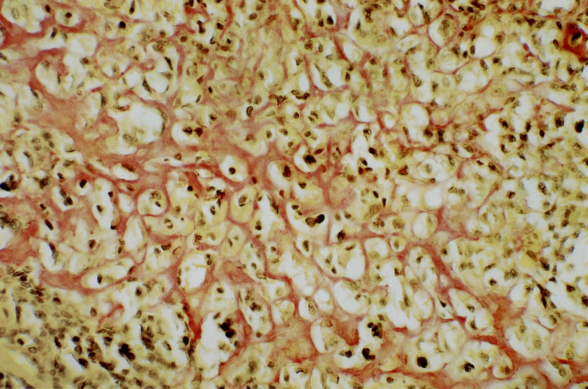

Osteosarcoma

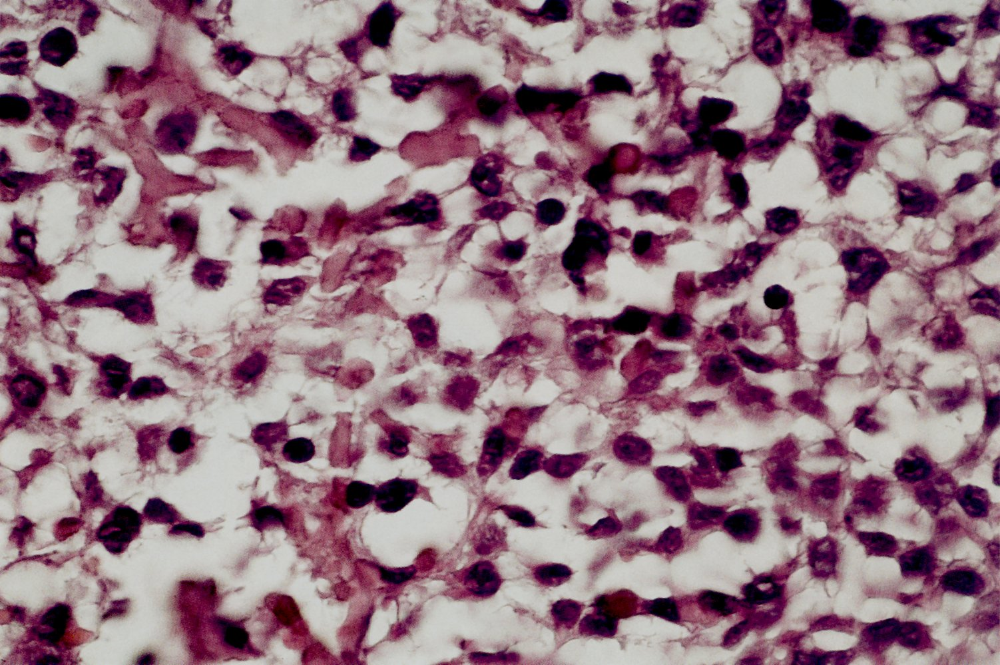

Osteosarcoma

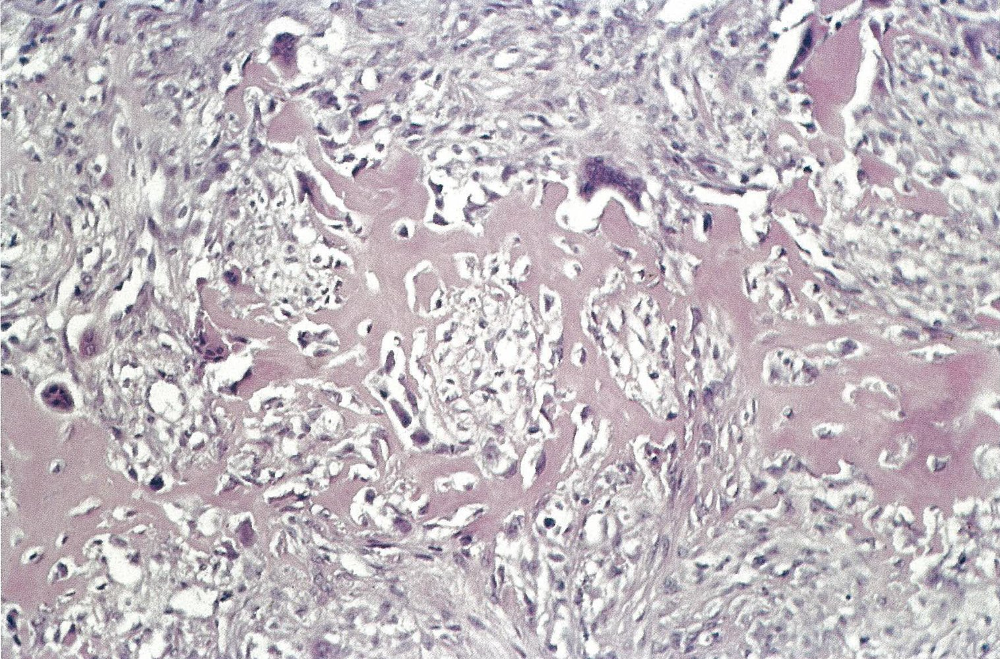

Osteosarcoma

> [!NOTE]
> Remember to wear your SOCK (Sunburst, Osteosarcoma, Codman, Knee region).

### Treatment [[1]](https://coursology-qbank.com/amboss/article/LBdwYs0)

* Localized disease

* All patients with resectable disease: <u>surgery</u> (wide excision or <u>amputation</u>)

* High-grade disease

* <u>Neoadjuvant</u> and/or adjuvant <u>chemotherapy</u>  [[1]](https://coursology-qbank.com/amboss/article/LBdwYs0)

* <u>Adjuvant radiotherapy</u> may be considered.  [[1]](https://coursology-qbank.com/amboss/article/LBdwYs0)

* <u>Metastatic</u> disease: Treatment options are <u>chemotherapy</u>, <u>surgery</u> (<u>metastasectomy</u> and excision of the primary <u>tumor</u>), and/or <u>radiotherapy</u>.

* Surveillance: Long-term follow-up with the treating oncologist is recommended.  [[1]](https://coursology-qbank.com/amboss/article/LBdwYs0)

### Prognosis

* Aggressive course [[1]](https://coursology-qbank.com/amboss/article/LBdwYs0)

* <u>Primary osteosarcoma</u> 5-year survival rate of ∼ 60% for localized disease [[5]](https://coursology-qbank.com/amboss/article/qbVCuG0)

* <u>Secondary osteosarcoma</u>: poor prognosis (less responsive to treatment) [[6]](https://coursology-qbank.com/amboss/article/8AdOls0)

---

## Ewing sarcoma

### <u>Epidemiology</u> [[6]](https://coursology-qbank.com/amboss/article/8AdOls0)[[14]](https://coursology-qbank.com/amboss/article/xAdENs0)

* Second most common primary bone <u>tumor</u> in children and <u>adolescents</u>, after <u>osteosarcoma</u>

* Age: peak <u>incidence</u> between 10 and 20 years [[14]](https://coursology-qbank.com/amboss/article/xAdENs0)

* Sex: <u>♂</u> > <u>♀</u>

* Ethnicity: most common in White individuals

### Etiology [[1]](https://coursology-qbank.com/amboss/article/LBdwYs0)

<u>Ewing sarcoma</u> is a highly malignant bone <u>tumor</u> of unclear lineage.

* May arise from <u>neuroectodermal</u> cells or <u>mesenchymal stem cells</u> [[6]](https://coursology-qbank.com/amboss/article/8AdOls0)[[15]](https://coursology-qbank.com/amboss/article/OQXIwB)

* Associated with <u>chromosomal</u> fusion and translocation of the EWSR1 <u>gene</u> (<u>chromosome</u> 22) with other <u>genes</u>, most commonly FLI1 (<u>chromosome</u> 11)

### Sites of involvement [[1]](https://coursology-qbank.com/amboss/article/LBdwYs0)[[4]](https://coursology-qbank.com/amboss/article/JbVsuG0)[[6]](https://coursology-qbank.com/amboss/article/8AdOls0)

* Primary <u>tumor</u>

* Most commonly affects <u>diaphyses</u> of <u>long bones</u> (particularly <u>femur</u>, <u>tibia</u>, <u>fibula</u>, and <u>humerus</u>), the <u>pelvis</u>, and bones of the <u>chest wall</u>

* May occur in other bones and may arise from extraosseous tissue

* <u>Metastases</u>: most commonly to <u>lungs</u>, skeletal system, and <u>bone marrow</u>

### Diagnostics [[4]](https://coursology-qbank.com/amboss/article/JbVsuG0)[[6]](https://coursology-qbank.com/amboss/article/8AdOls0)

See “<u>Diagnostic approach to suspected primary malignant bone tumors</u>.”

* <u>X-ray</u> findings  

* Lytic bone lesions with extensive bone destruction  (moth-eaten appearance) [[7]](https://coursology-qbank.com/amboss/article/X_d95s0)

* <u>Aggressive periosteal reaction</u>, typically lamellated (<u>onion skin appearance</u>) or <u>Codman triangles</u>

* Laboratory findings: ↑ <u>LDH</u>, <u>leukocytosis</u>, ↑ <u>ESR</u> [[1]](https://coursology-qbank.com/amboss/article/LBdwYs0)[[16]](https://coursology-qbank.com/amboss/article/liVv780)

* <u>Histology</u> findings: <u>anaplastic</u> <u>small blue round cell tumor</u>; <u>tumor</u> cells resemble <u>lymphocytes</u> and differential diagnoses include <u>lymphoma</u>

* Genetic and/or molecular studies (on the <u>biopsy</u> sample): to distinguish <u>Ewing sarcoma</u> from other <u>small blue round cell tumors</u> 

* <u>Chromosomal translocation</u> t(11;22); (q24;q12), which leads to expression of fusion protein EWS-FLI1, is present in ∼ 85% of patients with <u>Ewing sarcoma</u>. [[1]](https://coursology-qbank.com/amboss/article/LBdwYs0)

* <u>Ewing sarcoma</u> cancer cells strongly express CD99, a cell surface gycoprotein.

> [!WARNING]
> Features of <u>Ewing sarcoma</u> (localized <u>pain</u>, swelling, and <u>erythema</u>; <u>B symptoms</u>; <u>leukocytosis</u>) can mimic those of <u>osteomyelitis</u>. [[17]](https://coursology-qbank.com/amboss/article/Y_dn5s0)

> [!NOTE]
> “Ew, did you feed on 22 onions?”: Ewing sarcoma, diaphysis, femur region, <u>chromosome</u> 22, onion <u>skin</u> appearance.

Permeative bone lesion

Ewing sarcoma

### Treatment [[1]](https://coursology-qbank.com/amboss/article/LBdwYs0)

* Localized disease

* Initial treatment in all patients: <u>neoadjuvant</u> <u>chemotherapy</u>  [[1]](https://coursology-qbank.com/amboss/article/LBdwYs0)

* Stable or improved disease after initial treatment: either of the following to achieve local control  [[1]](https://coursology-qbank.com/amboss/article/LBdwYs0)

* <u>Surgery</u> (wide excision or <u>amputation</u>), with <u>adjuvant chemotherapy</u> and with or without <u>adjuvant radiotherapy</u>  [[1]](https://coursology-qbank.com/amboss/article/LBdwYs0)

* <u>Definitive radiotherapy</u> with <u>adjuvant chemotherapy</u>

* Progressive disease after initial treatment: Palliative approaches may be required.

* <u>Metastatic</u> disease: Treatment options include <u>surgery</u> or <u>definitive radiotherapy</u> with <u>adjuvant chemotherapy</u>, or palliative approaches.

* Surveillance: Long-term follow-up with the treating oncologist is recommended.  [[1]](https://coursology-qbank.com/amboss/article/LBdwYs0)

> [!TIP]
> Unlike most primary malignant bone tumors, <u>Ewing sarcoma</u> is radiosensitive. <u>Definitive radiotherapy</u> is a treatment option when surgical excision is not feasible. [[1]](https://coursology-qbank.com/amboss/article/LBdwYs0)

### Prognosis [[1]](https://coursology-qbank.com/amboss/article/LBdwYs0)[[4]](https://coursology-qbank.com/amboss/article/JbVsuG0)

* Extremely aggressive; early <u>metastases</u>

* Usually responsive to <u>chemotherapy</u>

* 5-year survival rate of ∼ 70% for localized disease[[4]](https://coursology-qbank.com/amboss/article/JbVsuG0)

---

## Chondrosarcoma

### <u>Epidemiology</u>

* Most common primary malignant bone <u>tumor</u> in adults [[1]](https://coursology-qbank.com/amboss/article/LBdwYs0)

* Age: usually > 50 years [[1]](https://coursology-qbank.com/amboss/article/LBdwYs0)

* Sex: <u>♂</u> > <u>♀</u> [[2]](https://coursology-qbank.com/amboss/article/AAdRms0)[[6]](https://coursology-qbank.com/amboss/article/8AdOls0)

### Etiology [[2]](https://coursology-qbank.com/amboss/article/AAdRms0)[[3]](https://coursology-qbank.com/amboss/article/yAddms0)

<u>Chondrosarcoma</u> is a malignant bone <u>tumor</u> arising from <u>chondrocytes</u>. [[6]](https://coursology-qbank.com/amboss/article/8AdOls0)

* Primary <u>chondrosarcoma</u>

* Arises in previously healthy bone

* Unknown etiology

* Secondary <u>chondrosarcoma</u>: malignant transformation of a benign <u>cartilage</u> <u>tumor</u> (e.g., <u>osteochondroma</u>, <u>enchondroma</u>)

### Sites of involvement [[2]](https://coursology-qbank.com/amboss/article/AAdRms0)

* Primary <u>tumor</u>: most commonly arises in the <u>intramedullary</u> cavity of <u>long bones</u> (particularly the <u>proximal</u> and <u>distal</u> <u>femur</u> and <u>distal</u> <u>tibia</u>) and <u>pelvis</u>

* <u>Metastases</u>

* Less likely in low-grade disease; in high-grade disease, most commonly to <u>lung</u> and bone

* <u>Skip lesions</u> may be caused by regional spread.

### Diagnostics [[2]](https://coursology-qbank.com/amboss/article/AAdRms0)[[3]](https://coursology-qbank.com/amboss/article/yAddms0)

See “<u>Diagnostic approach to suspected primary malignant bone tumors</u>.”

* <u>X-ray</u> findings [[18]](https://coursology-qbank.com/amboss/article/IQXYxB)

* Mixed <u>osteolytic</u> and <u>osteosclerotic</u> lesions

* Intralesional calcifications;  characteristic of <u>cartilaginous</u> tumors (<u>rings-and-arcs calcifications</u>)  [[2]](https://coursology-qbank.com/amboss/article/AAdRms0)

* <u>Endosteal scalloping</u>

* High-grade tumors: <u>cortical bone</u> destruction (moth-eaten appearance) and cortical breach with infiltration of <u>soft tissue</u>

* <u>Histopathology</u> findings [[19]](https://coursology-qbank.com/amboss/article/5iViH80)

* Malignant <u>chondrocytes</u>

* Lobulated appearance (<u>hyaline cartilage</u> <u>nodules</u> with peripheral calcification )

Mixed density tumor left hemipelvis

Lytic calcaneal lesion with calcifications

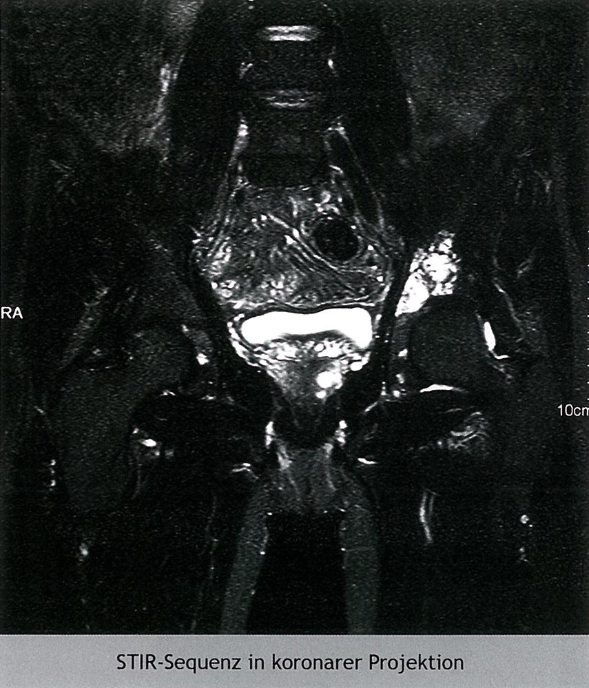

Grade I chondrosarcoma of the left acetabulum

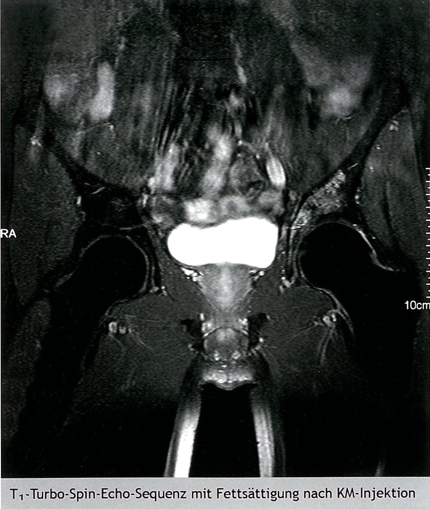

Chondrosarcoma of the left acetabulum (grade 1)

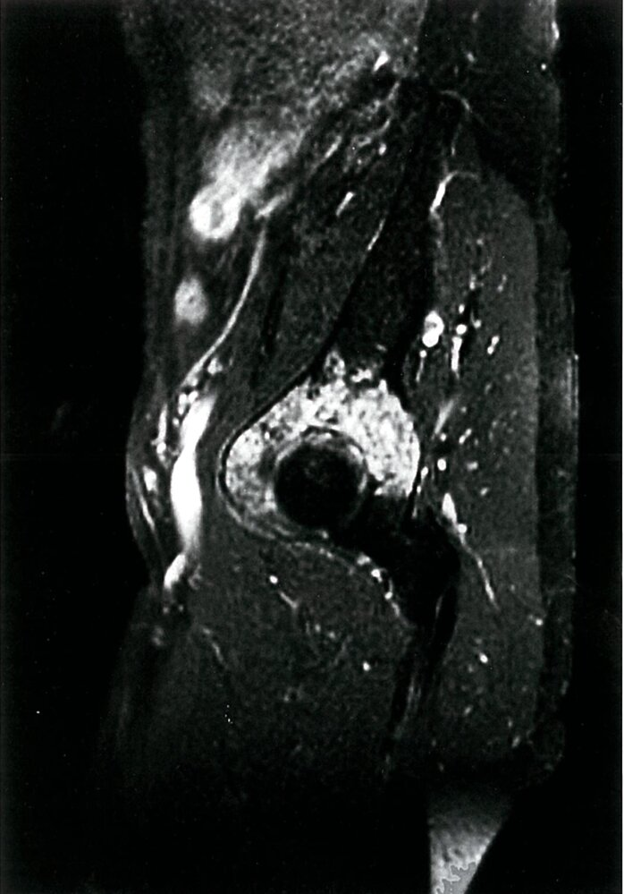

Enhancing acetabular mass

Chondrosarcoma

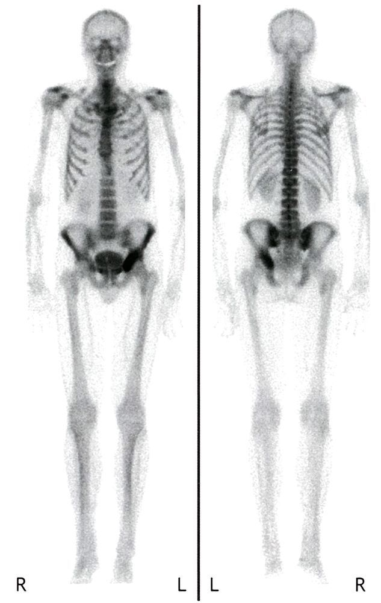

Pelvic tumor with increased uptake on bone scan

### Treatment [[3]](https://coursology-qbank.com/amboss/article/yAddms0)

* Definitive treatment: <u>surgery</u> (complete resection)

* Radiation and <u>chemotherapy</u>

* Usually ineffective

* Can be considered as <u>adjuvant therapy</u> for high-grade <u>chondrosarcomas</u> and <u>metastatic</u> disease

* <u>Radiotherapy</u> may be used when complete surgical resection is not feasible (e.g., <u>spine</u> <u>chondrosarcoma</u>).

* Long-term surveillance with the treating physician is recommended.

### Prognosis

* 5-year survival rates [[2]](https://coursology-qbank.com/amboss/article/AAdRms0)

* Low-grade disease: 90%

* High-grade and/or <u>metastatic</u> disease: ∼ 30%

* Late recurrences are possible. [[1]](https://coursology-qbank.com/amboss/article/LBdwYs0)

---