# Ankylosing spondylitis

*Categories: Clinical knowledge > Surgery > Trauma and orthopedic surgery > Spine > Ankylosing spondylitis*

[Original Article Link](https://coursology-qbank.com/amboss/article/ZT0Z62)

---

## Summary

Ankylosing <u>spondylitis</u> (<u>AS</u>) is a <u>seronegative spondyloarthropathy</u> and a chronic inflammatory disease of the <u>axial skeleton</u> that leads to partial or complete fusion and rigidity of the <u>spine</u>. It is a part of a spectrum of <u>inflammatory spondyloarthropathies</u> known as <u>axial spondyloarthritis</u> and can also be referred to as radiographic <u>axial spondyloarthritis</u>. Males are disproportionately affected and > 90% of patients are positive for <u>HLA-B27</u>, which is a predisposing factor for the disease. <u>Pain</u> and stiffness in the lower back and neck, caused by inflammation of the <u>vertebral column</u> and the <u>sacroiliac joints</u>, are characteristic early features of <u>AS</u>. <u>Pain</u> typically improves with activity and is particularly prominent at night. Other articular findings include restricted <u>spine</u> mobility and tenderness of the <u>sacroiliac joints</u> on provocation tests, such as the <u>FABER test</u>. The most common extraarticular manifestation is acute, unilateral <u>anterior uveitis</u>. <u>Kyphosis</u> and fusion of the <u>costovertebral joints</u> can cause <u>restrictive lung disease</u>. Diagnosis is primarily based on typical clinical features, elevated <u>inflammatory markers</u>, <u>HLA-B27</u> positivity, and evidence of inflammatory changes and <u>ankylosis</u> of the sacroiliac (<u>sacroiliitis</u>) and/or <u>intervertebral joints</u> (<u>bamboo spine</u>) on imaging. Typical features may be absent on imaging in early <u>AS</u>, but the presence of several classical clinical and laboratory features is sufficient to confirm the diagnosis and initiate treatment. There is no curative treatment for <u>AS</u>, but regular <u>physiotherapy</u> can slow disease progression. <u>Pharmacotherapy for AS</u> includes <u>NSAIDs</u> and/or <u>TNF-α inhibitors</u> (e.g., <u>infliximab</u>, <u>adalimumab</u>, <u>etanercept</u>). In severe cases, <u>surgery</u> (e.g., <u>arthroplasty</u>) may be considered to improve the patient's quality of life. Patients with <u>AS</u> are at an increased risk of <u>osteoporosis</u> and <u>pathological fractures</u> (<u>chalk stick fractures</u>). <u>Axial spondyloarthritis</u> also includes <u>nonradiographic axial spondyloarthritis</u>, a condition that causes similar symptoms to <u>AS</u> but without inflammatory changes on plain radiographs. Management of <u>nonradiographic axial spondyloarthritis</u> is the same as for <u>AS</u>.

Ankylosing spondylitis fact sheet

---

## Epidemiology

* Sex: : <u>♂</u> > <u>♀</u> (3:1)

* Age: : 15–40 years

* Lifetime <u>prevalence</u>: ∼ 0.5%

Epidemiological data refers to the US, unless otherwise specified.

---

## Etiology

* Genetic predisposition: 90–95% of patients are <u>HLA-B27</u> positive.

---

## Pathophysiology

* Initiation of <u>innate immune response</u> [[3]](https://coursology-qbank.com/amboss/article/SW1ykf0)

* Release of <u>cytokines</u> (<u>TGF-beta</u> and <u>TNF-α</u>) and <u>interleukins</u> (<u>IL-17</u> and IL-23)

* Infiltration of paravertebral and sacroiliac <u>entheses</u> with <u>macrophages</u>, <u>CD4 T cells</u>, and <u>CD8 T cells</u>

* Chronic <u>enthesitis</u> leads to: 
1. * <u>Erosion</u> of the iliac part of the <u>sacroiliac joints</u>
2. * Vertical formation of <u>syndesmophytes</u> along the spinal <u>ligament</u> or around the <u>annulus fibrosus</u> of the <u>intervertebral discs</u> (see “<u>Syndesmophytes vs. osteophytes</u>”)
3. * Fusion of <u>syndesmophytes</u> → <u>ankylosis</u> of <u>intervertebral discs</u> and <u>vertebral bodies</u> (see “<u>Dagger sign</u>” and “<u>Bamboo spine</u>”)

Degenerative and inflammatory lesions of the spine

---

## Clinical features

### Articular manifestations

* Features of <u>inflammatory back pain</u> (most common presenting symptom) [[4]](https://coursology-qbank.com/amboss/article/_zX5v00)[[5]](https://coursology-qbank.com/amboss/article/xSbEbt)

* Age at onset < 45 years

* Insidious onset of dull <u>pain</u> that progresses slowly

* Morning stiffness > 30 minutes that improves with activity

* <u>Pain</u> is independent of positioning

* <u>Pain</u> persists with rest and is also present at night.

* Alternating gluteal <u>pain</u>

* Tenderness over the <u>sacroiliac joints</u> (SIJ)

* Reduced spinal mobility

* Extraspinal <u>joint</u> <u>pain</u>

* Inflammatory <u>enthesitis</u>

* <u>Dactylitis</u>

* <u>Arthritis</u> outside the <u>spine</u> (hip, shoulder, <u>knee joint</u>)

Dactylitis

### Extraarticular manifestations

* Acute, unilateral <u>anterior uveitis</u> (most common extraarticular manifestation; ∼ 25% of patients)

* <u>Constitutional symptoms</u> such as fatigue , <u>weakness</u>, <u>fever</u>, and weight loss

* <u>Restrictive pulmonary disease</u>

* Due to decreased mobility of the <u>thoracic spine</u> and <u>costovertebral joints</u>

* Secondary to apical <u>pulmonary fibrosis</u> or more widespread <u>interstitial lung disease</u> [[6]](https://coursology-qbank.com/amboss/article/kFXmR-)

* Gastrointestinal symptoms: due to associated chronic <u>IBD</u> (∼ 5–10% of patients)

* <u>Prostatitis</u>

* Aortic root inflammation and subsequent <u>aortic valve insufficiency</u>, <u>atrioventricular blocks</u>  [[7]](https://coursology-qbank.com/amboss/article/aXcQ9a0)[[8]](https://coursology-qbank.com/amboss/article/YXcn9a0)

* <u>IgA nephropathy</u> (rare)

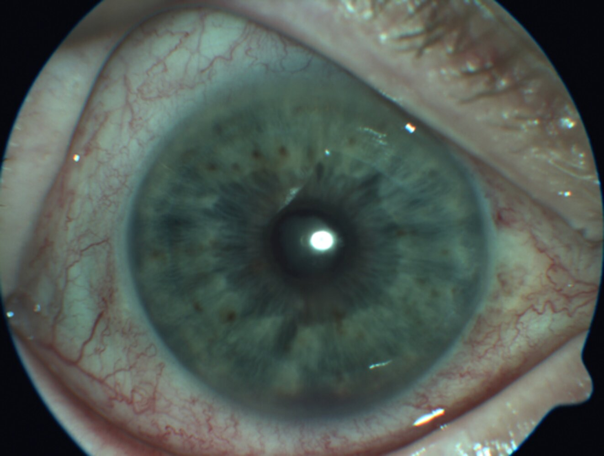

Anterior uveitis

### Positive SIJ pain provocation tests

Tenderness over the <u>sacroiliac joints</u> can be elicited on <u>pain</u> provocation tests, such as:

#### FABER test [[9]](https://coursology-qbank.com/amboss/article/AMaRrO)

<u>Pain</u> in the <u>ipsilateral</u> SIJ on <u>Flexion</u>, ABduction, and External Rotation (FABER) indicates a positive test.

* Assessed with the patient in the <u>supine position</u>

* The leg to be tested is placed in a figure-4 position, with the patient's ankle placed on the <u>contralateral</u> knee.

* Apply pressure on the patient's flexed knee.

* <u>Pain</u> will be felt in the <u>ipsilateral</u> SIJ if inflammation is present.

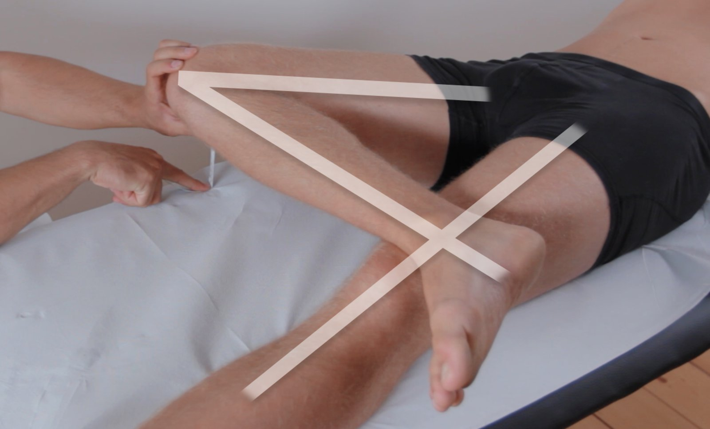

FABER (Patrick) test

#### Mennell sign [[10]](https://coursology-qbank.com/amboss/article/wzXhE00)

Tenderness to percussion and <u>pain</u> on displacement (distraction) of the SIJ indicates <u>sacroiliitis</u> or degeneration. The SIJ can be distracted using the following maneuvers.

* <u>Prone position</u>: Lift the leg passively (i.e., extend the hip) with one hand while applying pressure on the <u>ipsilateral</u> SIJ with the other hand.

* <u>Lateral</u> position

* Ask the patient to flex their lower hip and knee to ∼ 90°.

* Lift the upper leg and extend the upper hip with one hand while fixing the <u>pelvis</u> with the other hand.

* <u>Supine position</u>: Apply posteriorly directed pressure to the <u>anterior superior iliac spines</u>.

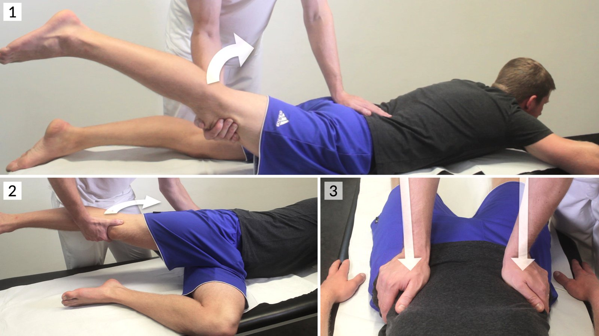

Sacroiliac joint pain provocation tests (Mennell test)

### Reduced spinal mobility [[11]](https://coursology-qbank.com/amboss/article/3ScSzb0)

Spinal mobility is typically significantly decreased in advanced or <u>severe AS</u>.

#### Schober test

A bedside examination to assess lumbar forward <u>flexion</u>

* With the patient standing, the examiner marks two points on the patient's back: one at L5 and one 10 cm above.   [[12]](https://coursology-qbank.com/amboss/article/kScm-b0)

* The patient is asked to touch their toes without bending their knees.

* An increase of < 4 cm between the two points suggests impaired <u>spine</u> <u>flexion</u>.

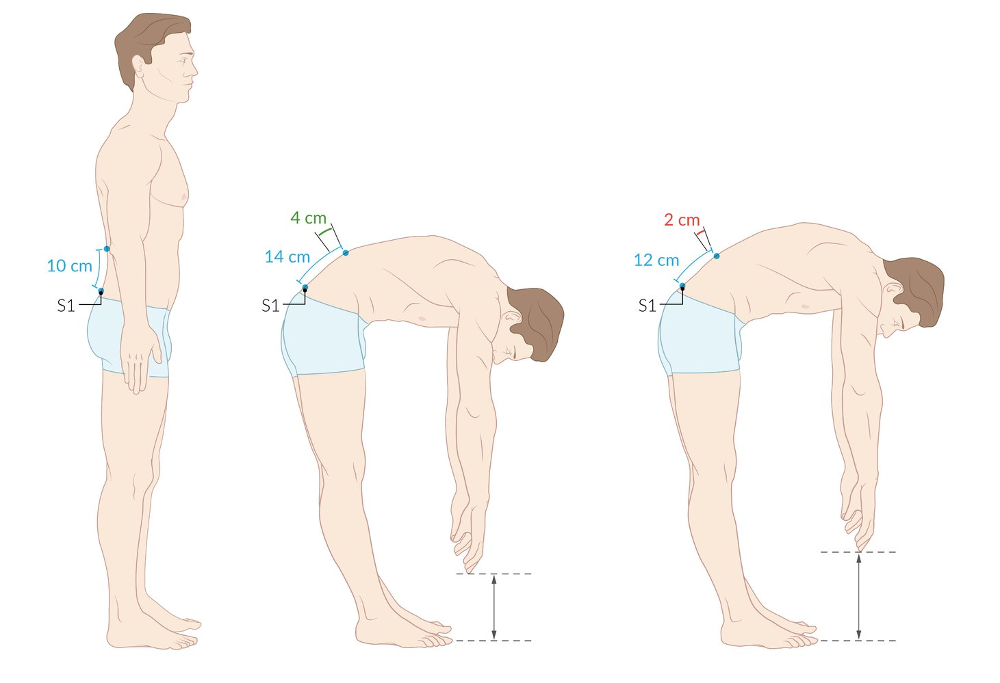

Schober test

#### <u>Lateral</u> lumbar <u>flexion</u> test

A bedside examination to assess lumbar <u>lateral</u> <u>flexion</u>

* The patient is asked to stand with their back against the wall with hands by the side and flex as far as possible to one side without bending their knees.

* The distance between the tip of the patient's middle finger and the floor is measured on the <u>ipsilateral</u> side.

* A larger fingertip-to-floor distance indicates limited spinal mobility.

#### Chest expansion on deep breathing

A bedside examination to assess <u>thoracic spine</u> mobility  [[12]](https://coursology-qbank.com/amboss/article/kScm-b0)

* Measure the chest circumference after maximal expiration and again after maximal inspiration.

* A smaller difference in measurements (< 2.5 cm) indicates limited <u>thoracic spine</u> and costovertebral <u>joint</u> mobility.  [[4]](https://coursology-qbank.com/amboss/article/_zX5v00)[[12]](https://coursology-qbank.com/amboss/article/kScm-b0)

* Reduced chest expansion can also be due to concomitant pulmonary disease, <u>chest wall</u> deformities, or poor respiratory effort.

### <u>Kyphosis</u> [[11]](https://coursology-qbank.com/amboss/article/3ScSzb0)[[13]](https://coursology-qbank.com/amboss/article/RSclzb0)[[14]](https://coursology-qbank.com/amboss/article/iScJzb0)

<u>Kyphosis</u> due to loss of <u>anterior</u> <u>vertebral</u> height and wedging of the <u>thoracic vertebrae</u> is present in up to 50% of patients, especially those with advanced <u>AS</u>. The extent of the deformity may be subtle and is assessed using the occiput-to-wall distance.

* Ask the patient to stand against a wall with their heels, buttocks, and shoulders pressed against the wall.

* Measure the distance between the occiput and the wall.

* In a healthy individual, the occiput should be touching the wall; the inability to do so is considered abnormal.

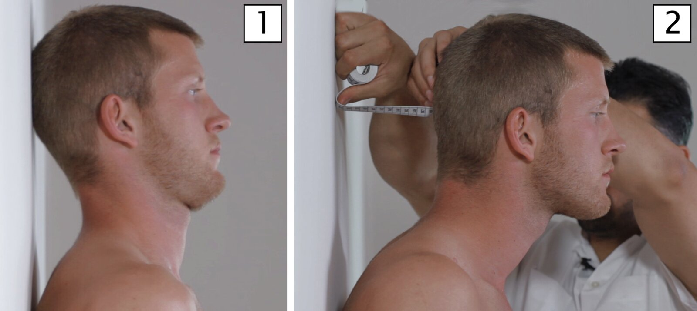

Measurement of occiput-to-wall distance

---

## Diagnosis

### Approach [[5]](https://coursology-qbank.com/amboss/article/xSbEbt)[[15]](https://coursology-qbank.com/amboss/article/ahbQct)

* Suspect <u>AS</u> in patients < 45 years of age who present with features of <u>inflammatory back pain</u> lasting > 3 months.

* Initial test in all individuals with suspected <u>AS</u>: <u>x-ray</u> of the <u>sacroiliac joints</u> 

* <u>X-ray</u> findings consistent with <u>AS</u> in a patient with typical features of <u>AS</u>: diagnosis confirmed

* <u>X-ray</u> findings equivocal: Obtain <u>CRP</u> (or <u>ESR</u>) and <u>HLA-B27</u>.

* <u>HLA-B27</u> positive

* High likelihood of <u>AS</u> (compelling clinical picture): diagnosis confirmed; no further imaging required

* Only a few classical clinical features of <u>AS</u>: <u>MRI</u> of the <u>sacroiliac joints</u>

* <u>HLA-B27</u> negative

* Some (2–3) classical clinical features of <u>AS</u> present: <u>MRI</u> of the <u>sacroiliac joints</u>

* ≤ 1 classical clinical feature: Consider <u>differential diagnoses of AS</u>.

* Consider imaging of the <u>spine</u> in patients with <u>pain</u> in the cervical, thoracic, or <u>lumbar spine</u>.

* Further workup for associated conditions may be appropriate depending on extraarticular manifestations.

### Diagnostic criteria [[4]](https://coursology-qbank.com/amboss/article/_zX5v00)

There are several <u>diagnostic criteria for AS</u> (e.g., New York criteria, Rome criteria). The Assessment of Spondyloarthritis International Society (ASAS) classification criteria for axial spondyloarthritis, which is based on a combination of clinical features and imaging or laboratory findings, is detailed here.

* <u>Lower back pain</u> for > 3 months in patients < 45 years of age and one of the following:

* <u>Sacroiliitis</u> confirmed on <u>x-ray</u> or <u>MRI</u> and ≥ 1 typical clinical or laboratory finding

* A positive <u>HLA-B27</u> test and ≥ 2 typical clinical or laboratory findings

* Clinical and laboratory findings used in the <u>diagnostic criteria for AS</u> include:

* Articular manifestations: <u>inflammatory back pain</u>, <u>dactylitis</u>, <u>arthritis</u>

* Extraarticular manifestations: <u>enthesitis</u> (may present with heel <u>pain</u>), <u>uveitis</u>, <u>IBD</u>, <u>psoriasis</u>

* <u>Patient history</u>

* Positive <u>family history</u> for <u>axial spondyloarthritis</u>

* Symptoms relieved within 24–48 hours of full-dose <u>NSAIDs</u>

* Laboratory findings: positive for <u>HLA-B27</u>; ↑ <u>CRP</u> and/or <u>ESR</u>

### Laboratory findings

* <u>CRP</u> and <u>ESR</u> are typically elevated.

* <u>HLA-B27</u>: Positive in 90–95% of patients with <u>axial spondyloarthritis</u>  [[16]](https://coursology-qbank.com/amboss/article/-zXDv00)[[17]](https://coursology-qbank.com/amboss/article/BhbzTt)

* <u>Autoantibodies</u> (e.g., <u>rheumatoid factor</u>, <u>antinuclear antibodies</u>) are negative

* <u>CBC</u>: may show <u>anemia</u>  [[18]](https://coursology-qbank.com/amboss/article/zzXrv00)

> [!WARNING]
> Interpret a positive <u>HLA-B27</u> test in conjunction with clinical features as only ∼ 1% of individuals who are positive for <u>HLA-B27</u> have <u>AS</u>.

### Imaging [[15]](https://coursology-qbank.com/amboss/article/ahbQct)

#### <u>X-ray</u>

##### <u>Sacroiliac joints</u> (PA view)  [[4]](https://coursology-qbank.com/amboss/article/_zX5v00)

* Indication: best initial test to confirm the diagnosis of <u>AS</u> and evaluate disease severity

* Characteristic findings (usually symmetrical) 

* Signs of sacroiliitis: <u>erosion</u> and <u>sclerosis</u> (increased <u>radiodensity</u>) of the <u>sacroiliac joints</u>

* Ankylosis: fusion of the articular surfaces

##### <u>Spine</u> (AP and <u>lateral</u> views)

* Indications

* <u>Pain</u> in the cervical, thoracic, or <u>lumbar spine</u>

* Suspicion of <u>AS</u> remains after a negative <u>radiograph</u> and <u>MRI</u> of <u>sacroiliac joints</u>

* Characteristic findings

* Loss of lumbar <u>lordosis</u>: abnormal straightening of the <u>spine</u>

* <u>Ankylosis</u> of costosternal and <u>costovertebral joints</u>

* Dagger sign 

* A radiodense line running through the center of <u>vertebral bodies</u> on AP view

* Caused by <u>ossification</u> of <u>vertebral</u> <u>ligaments</u>

* Bamboo spine: seen in later stages and is caused by the following 

* <u>Ossification</u> of outer fibers of the <u>annulus fibrosus</u> resulting in <u>ankylosis</u> (fusion) of <u>intervertebral joints</u>

* <u>Syndesmophytes</u> between adjacent <u>vertebral bodies</u> (see “<u>Syndesmophytes vs. osteophytes</u>”)

* Shiny corners sign: reactive <u>sclerosis</u> of the superior and inferior margins of <u>vertebrae</u>

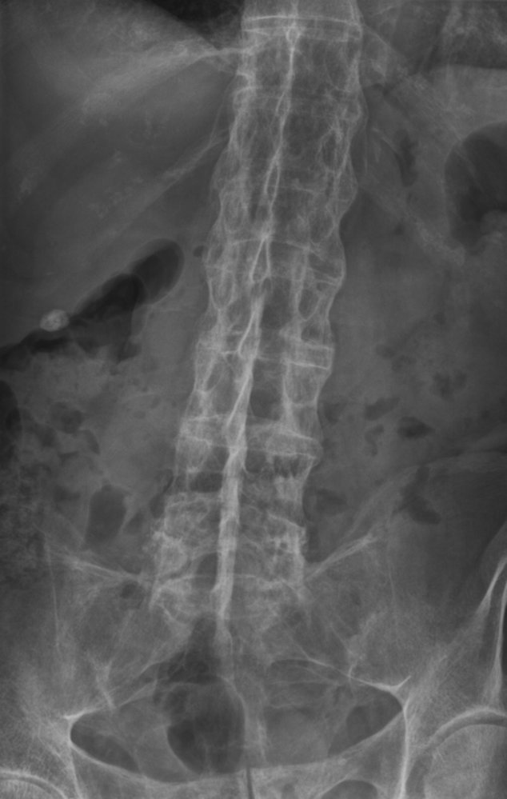

Bamboo spine and dagger sign in ankylosing spondylitis

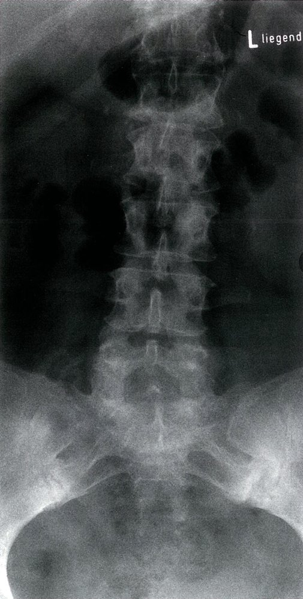

Sacroiliitis

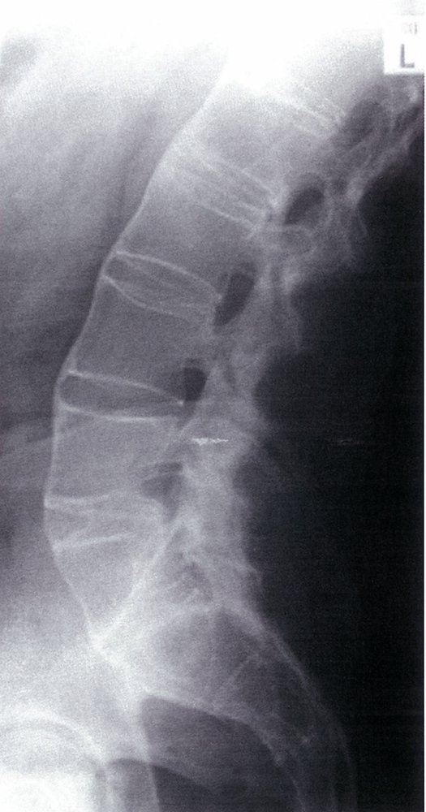

Lumbar ankylosing spondylitis

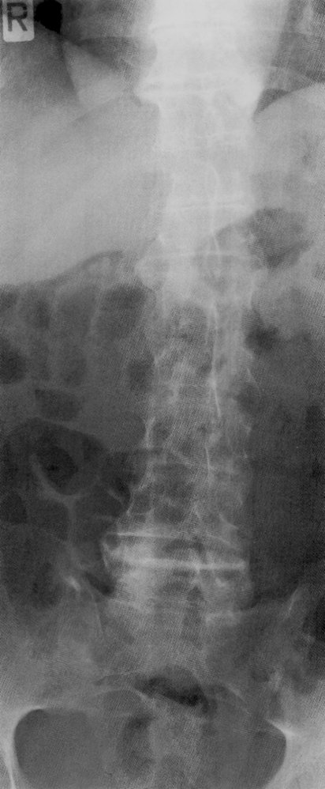

Syndesmophytes in ankylosing spondylitis  (1/2)

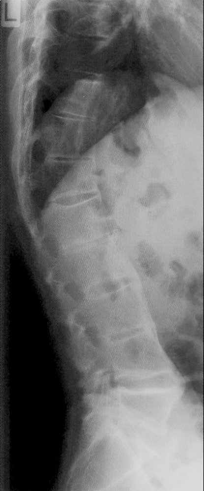

Syndesmophytes in ankylosing spondylitis (2/2)

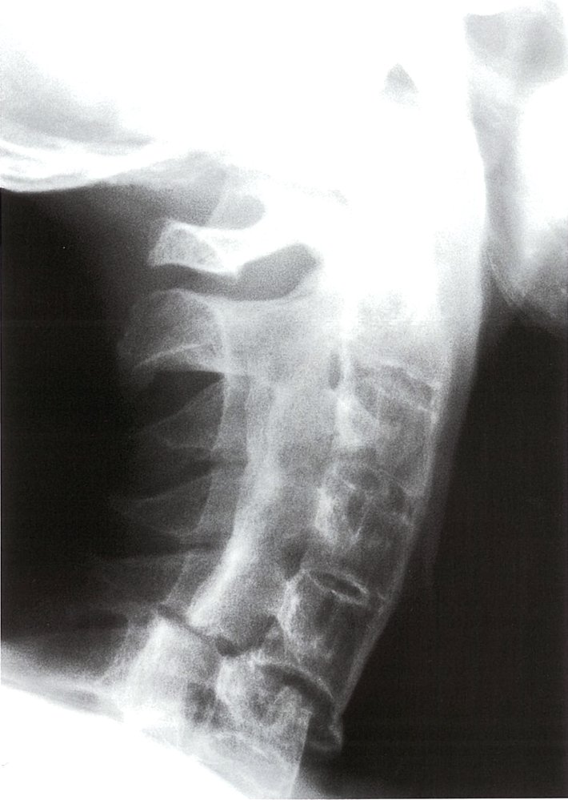

Cervical chalk stick fracture in ankylosing spondylitis

> [!WARNING]
> Early stages of <u>AS</u> may be unidentifiable on <u>x-ray</u> (low <u>sensitivity</u> for early-stage). Hence, a patient with several classical clinical and laboratory findings fulfills the <u>diagnostic criteria for AS</u> even if <u>x-ray</u> findings are inconclusive. [[5]](https://coursology-qbank.com/amboss/article/xSbEbt)[[15]](https://coursology-qbank.com/amboss/article/ahbQct)

#### <u>MRI</u>

<u>MRI</u> is the most sensitive method for early detection of inflammatory changes of <u>AS</u>. However, <u>MRI</u> is not routinely required to confirm a diagnosis of <u>AS</u> as specialized <u>MRI</u> techniques and radiology expertise is required to accurately identify <u>AS</u> findings. [[19]](https://coursology-qbank.com/amboss/article/5SciZX0)

##### <u>Sacroiliac joints</u> with <u>gadolinium</u> contrast

* Indication: negative or equivocal radiographs of <u>sacroiliac joints</u> in a patient with some classical features of <u>AS</u> [[5]](https://coursology-qbank.com/amboss/article/xSbEbt)

* Characteristic findings

* Active inflammatory lesions: <u>erosion</u> of the <u>sacroiliac joints</u> and <u>bone marrow</u> <u>edema</u> (high signal intensity)  [[5]](https://coursology-qbank.com/amboss/article/xSbEbt)

* Reparative changes: secondary bone formation (low signal intensity)

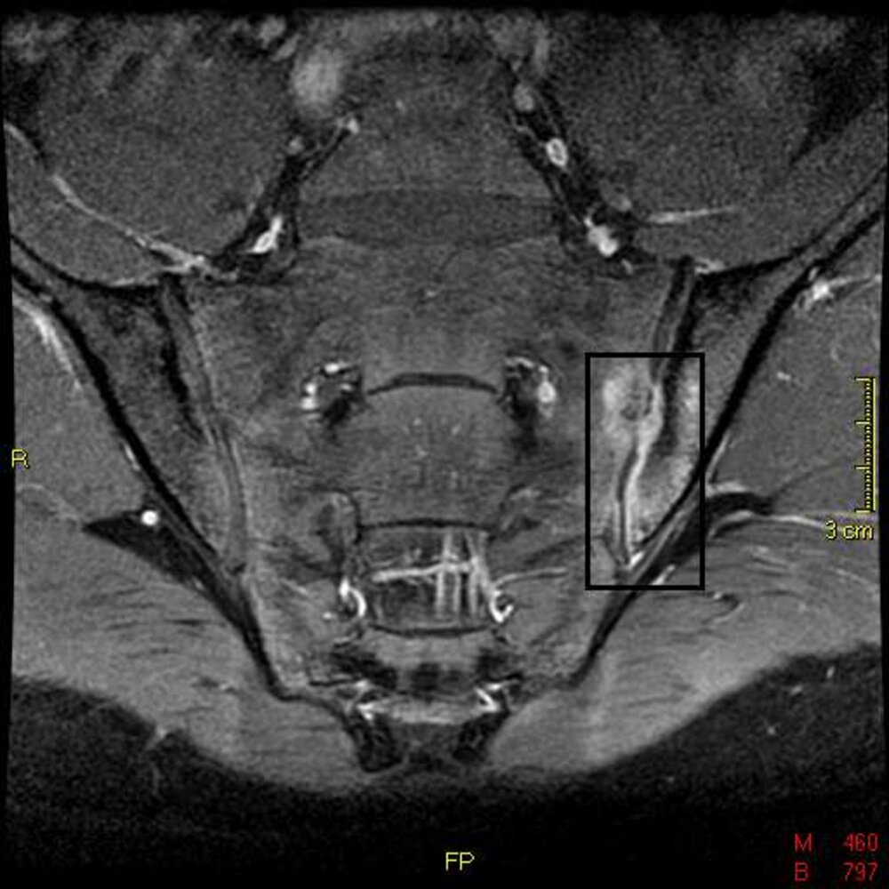

Sacroiliitis

##### <u>Spine</u> without contrast

* Indications: suspected <u>AS</u> in a patient with any of the following

* Inconclusive or negative <u>radiograph</u> and <u>MRI</u> of <u>sacroiliac joints</u>

* Negative radiographs of the <u>spine</u>

* Characteristic findings [[20]](https://coursology-qbank.com/amboss/article/ChbqTt)

* Romanus lesions: inflammatory lesions (high signal intensity) seen <u>anterior</u> or <u>posterior</u> <u>vertebral</u> corners

* Reparative changes: secondary bone formation, e.g., on the periphery of or within intervertebral disks

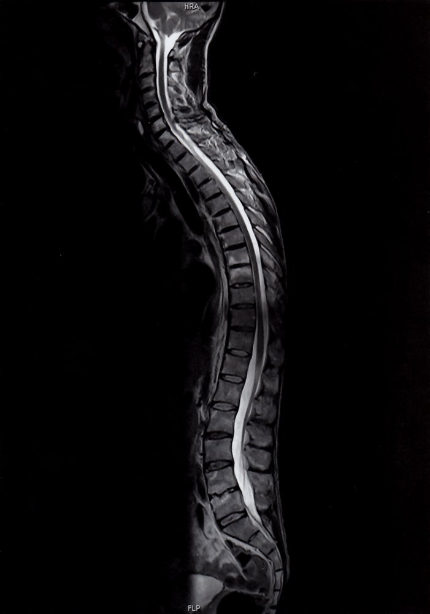

Ankylosing spondylitis

#### CT <u>sacroiliac joints</u> and/or <u>spine</u>

* Indications

* To evaluate for early changes in individuals with an inconclusive <u>radiograph</u> and <u>contraindications for MRI</u>

* Trauma (even minor) in patients with <u>ankylosis</u> to exclude a <u>spinal fracture</u>

* Findings: bone <u>erosions</u>, reparative changes

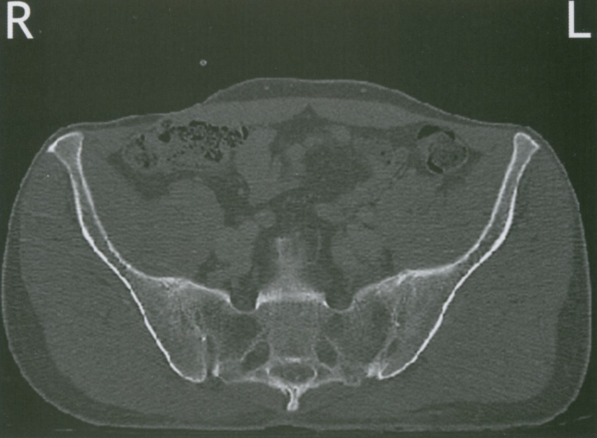

Bilateral sacroiliitis in ankylosing spondylitis

### Further evaluation for extraarticular disease

| Symptom-based workup for extraarticular manifestations |  |  |
| --- | --- | --- |
| Extraarticular complication | Characteristic clinical features | Recommended diagnostic studies and characteristic findings |
| <u>Restrictive lung disease</u> |   * <u>Dyspnea</u>  * Limited chest expansion  * Fine <u>crackles</u> on <u>auscultation</u>    |   * <u>Pulmonary function testing</u>: restrictive disease pattern  * <u>HRCT</u>  [[6]](https://coursology-qbank.com/amboss/article/kFXmR-)  * <u>Ankylosis</u> of costosternal and <u>costovertebral joints</u>  * Apical (upper lobe) <u>fibrosis</u>  * <u>Interstitial lung disease</u>    |
| <u>Anterior uveitis</u> |   * <u>Painful red eye</u>  * <u>Photophobia</u>  * Loss of <u>visual acuity</u>    |  * See “<u>Anterior uveitis</u>” in “<u>Diseases of the uvea</u>.”   |
| <u>Inflammatory bowel disease</u> |   * <u>Diarrhea</u> (may be bloody)  * Abdominal <u>pain</u>  * Weight loss    |  * See “Diagnostics” in “<u>Crohn disease</u>” and “<u>Ulcerative colitis</u>.”   |
|  Aortic root and valve disease  [[6]](https://coursology-qbank.com/amboss/article/kFXmR-)  |   * <u>Symptoms of heart failure</u>  * <u>Murmur</u> detected on <u>auscultation</u>    |   * <u>TTE</u>: aortic valvular disease, aortic root thickening, and dilatation  * For further information, see “Diagnostics” in “<u>Aortic regurgitation</u>” and “<u>Mitral regurgitation</u>.”    |
|  <u>Atrioventricular blocks</u>  [[6]](https://coursology-qbank.com/amboss/article/kFXmR-)  |   * Unexplained <u>palpitations</u> or <u>syncope</u>  * <u>Symptoms of heart failure</u>    |   * <u>ECG</u>: <u>first degree AV block</u>, <u>incomplete bundle branch block</u>, <u>complete bundle branch block</u>  * See “<u>Atrioventricular blocks</u>" for details.    |
| <u>IgA nephropathy</u> |  * Episodic (typically following GI or respiratory infection)  * <u>Hematuria</u>  * Flank <u>pain</u>  * Features of <u>nephritic syndrome</u>   |  * See “Diagnostics” in “<u>IgA nephropathy</u>.”   |

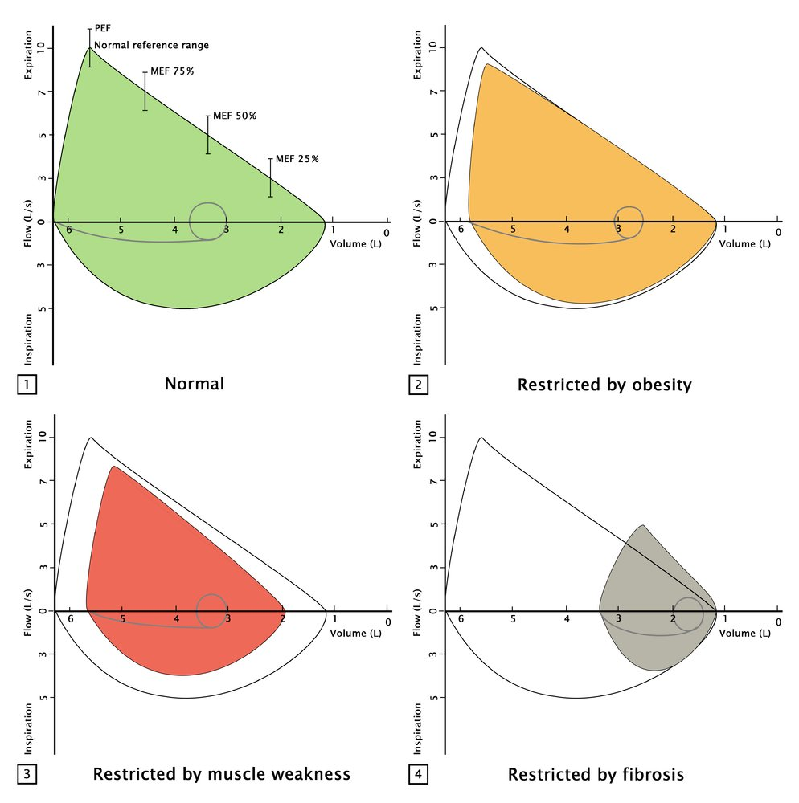

Flow-volume loop in restrictive lung disease

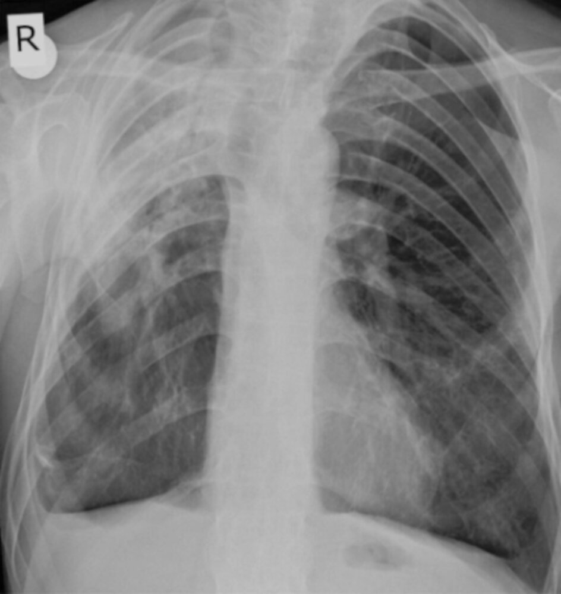

Upper lobe pulmonary fibrosis

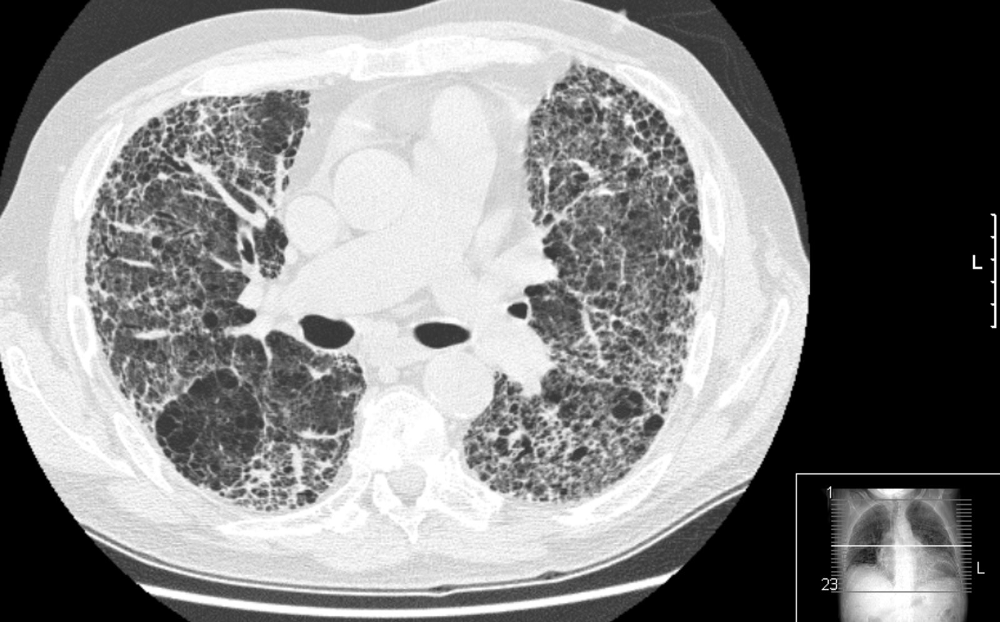

Pulmonary fibrosis

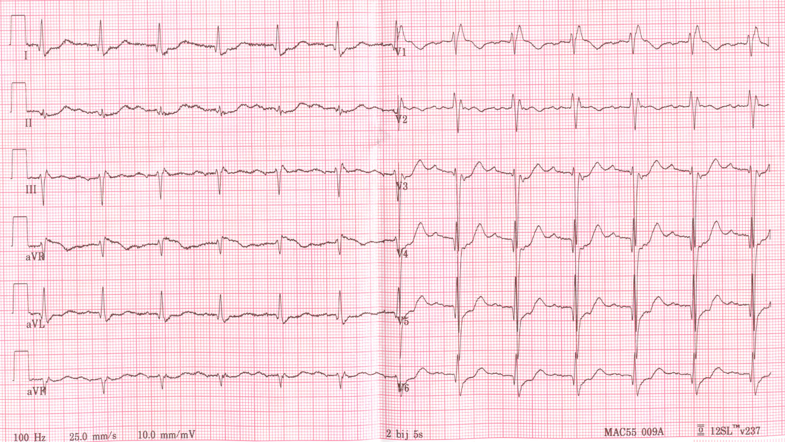

First-degree AV block with RBBB

---

## Differential diagnoses

* Other <u>inflammatory spondyloarthritides</u> (e.g., <u>reactive arthritis</u>, <u>psoriasis</u> <u>arthritis</u>, <u>arthritis</u> associated with <u>inflammatory bowel disease</u>)

* Mechanical <u>low back pain</u>

* <u>Fibromyalgia</u>

* Disk prolapse

* <u>Vertebral osteomyelitis</u>

* <u>Osteophytes</u> of the <u>spine</u> [[21]](https://coursology-qbank.com/amboss/article/qMaCpO)[[22]](https://coursology-qbank.com/amboss/article/GnaBuO)

* See also “<u>Nonurgent spinal causes of acute back pain</u>.”

* Diffuse idiopathic skeletal hyperostosis (<u>DISH</u>; also called <u>Forestier's disease</u> or <u>hyperostotic spondylosis</u>): degenerative disease of the <u>vertebral column</u> (especially the thoracic and <u>lumbar spine</u>), which is characterized by calcification and <u>ossification</u> of spinal <u>ligaments</u> and <u>entheses</u>

* Not related to <u>HLA-B27</u> [[23]](https://coursology-qbank.com/amboss/article/tnaXEO)

* May be asymptomatic or present with limited spinal mobility

* <u>Back pain</u> may be absent or mild

* Mostly affects men and is more common in patients with <u>diabetes</u>

* <u>X-ray</u> of the <u>spine</u> : <u>osteophytes</u> may be present (see table below); no evidence of <u>sacroiliitis</u>

* Treatment is primarily symptomatic

| Syndesmophytes vs. osteophytes |  |  |
| --- | --- | --- |
|  | Syndesmophytes | <u>Osteophytes</u> |
| Definition |  * <u>Ossification</u> or calcification of the <u>annulus fibrosus</u>  or a spinal <u>ligament</u>   |  * Lipping of <u>vertebral bodies</u>   |
| Radiographic features |   * Symmetrical, vertical growth, directly from <u>vertebral body</u> to <u>vertebral body</u>  * Full manifestation: "<u>bamboo spine</u>”    |  * Horizontal growth   |
| Etiology |  * Inflammatory <u>spine</u> disease (e.g., <u>AS</u>)   |  * Degenerative <u>spine</u> disease (e.g., <u>diffuse idiopathic skeletal hyperostosis</u>)   |

> [!NOTE]
> <u>Syndesmophytes</u> grow vertically, as opposed to <u>osteophytes</u>, which grow horizontally!

Degenerative and inflammatory lesions of the spine

The differential diagnoses listed here are not exhaustive.

---

## Treatment

### Approach [[2]](https://coursology-qbank.com/amboss/article/8SbOYt)[[5]](https://coursology-qbank.com/amboss/article/xSbEbt)

* Early referral to rheumatology is recommended in all patients with suspected or confirmed <u>AS</u>.

* Ensure all patients receive supportive therapy.

* Assess symptom severity.

* Severe ongoing symptoms: Manage as active disease.

* Asymptomatic patient or manageable symptoms for > 6 months: Manage as stable disease.

* New, <u>acute pain</u> (could indicate a <u>pathological fracture</u>): See “<u>Management of acute pain</u>.”

* Manage extraarticular complications and associated diseases accordingly.

* The management of <u>Nr-axSpA</u> is similar to <u>AS</u>.

### Supportive therapy

All patients with <u>AS</u>, regardless of the disease stage, should receive appropriate supportive therapy to improve their mobility and prevent complications.

* Provide regular <u>physical therapy</u> to maintain <u>range of motion</u> and posture [[5]](https://coursology-qbank.com/amboss/article/xSbEbt)

* Refer patients for:

* Fall evaluation and counseling

* Group or individual patient education on self-management

* Encourage <u>smoking cessation</u>.  [[24]](https://coursology-qbank.com/amboss/article/hZccYa0)[[25]](https://coursology-qbank.com/amboss/article/3ZcSYa0)

* Screen and treat patients for <u>osteoporosis</u>.  [[26]](https://coursology-qbank.com/amboss/article/TZc6aa0)

* Advise patients with severe <u>osteoporosis</u> or <u>spinal fusion</u> to avoid <u>spinal manipulation</u>.

> [!TIP]
> <u>Physical therapy</u> is vital in the management of patients with <u>AS</u>.

### Management of active disease

#### Pharmacological therapy

* First-line pharmacotherapy in most patients: <u>NSAIDs</u>

* Second-line : <u>TNF-α inhibitors</u> (e.g., <u>etanercept</u>, <u>adalimumab</u>).

* Alternative therapies (e.g., <u>DMARDs</u> such as <u>sulfasalazine</u>, intraarticular <u>glucocorticoids</u>): Consider in patients with significant peripheral disease or insufficient response to first-line therapies.

|  Pharmacological therapy in ankylosing spondylitis [[2]](https://coursology-qbank.com/amboss/article/8SbOYt)  |  |  |  |
| --- | --- | --- | --- |
| Medication class | Indications | Dosage and administration | Cautions |
|  <u>NSAIDs</u> |  * First-line treatment for patients without concurrent <u>IBD</u> or renal impairment  [[27]](https://coursology-qbank.com/amboss/article/l5Xv4A)   |   * Should be taken continuously (i.e., not on-demand)  * See “<u>Oral analgesics</u>” for agents and dosages.    |   * May cause renal impairment; monitor renal function.  * May worsen symptoms in undiagnosed <u>IBD</u>  * Consider gastric protection in patients with <u>risk factors for peptic ulcer disease</u>.    |
|  <u>TNF-α inhibitors</u>   |   * First-line treatment in patients with concurrent <u>IBD</u> or recurrent <u>anterior uveitis</u>  * Second-line in patients with insufficient response to two different <u>NSAIDs</u>    |   * Concurrent <u>IBD</u> or recurrent <u>uveitis</u>  * <u>Infliximab</u> DOSAGE  * <u>Adalimumab</u> DOSAGE  * No concurrent conditions: <u>etanercept</u> DOSAGE    |   * Increased risk for infection  * Reactivation of <u>latent tuberculosis</u> or <u>hepatitis B infection</u>; screen for both conditions prior to starting treatment. [[5]](https://coursology-qbank.com/amboss/article/xSbEbt)    |
| Antiinterleukin-17 antibodies |   * Contraindications to <u>TNF-α inhibitors</u>  * Insufficient response to <u>TNF-α inhibitors</u>    |   * <u>Secukinumab</u> DOSAGE  * <u>Ixekizumab</u> DOSAGE    |   * Increased risk for infection, particularly <u>upper respiratory tract infections</u>  * Risk of reactivation of <u>latent tuberculosis</u>; screen prior to starting treatment.  * Can worsen <u>IBD</u>; monitor regularly.    |
|  Local parenteral <u>glucocorticoids</u>   |  * Persistent symptoms despite <u>NSAID</u> treatment and any of the following:  * Isolated active <u>sacroiliitis</u>  * Stable axial disease and active <u>enthesitis</u>  * Stable axial disease and active peripheral <u>arthritis</u>   |  * Options include:  * <u>Betamethasone</u> DOSAGE  * <u>Triamcinolone</u> DOSAGE   |   * Risk of infection (localized or <u>joint</u>)  * Can cause elevated blood <u>glucose</u> and blood pressure    |
| <u>Sulfonamides</u> |   * Severe peripheral <u>arthritis</u>  * <u>TNF-α inhibitors</u> not available    |  * <u>Sulfasalazine</u> DOSAGE   |  * Risk of hepatic and renal toxicity, <u>bone marrow suppression</u>, and development of fibrosing alveolitis; monitor regularly.   |
| <u>Antimetabolites</u> |  * <u>Methotrexate</u> DOSAGE   |   * <u>Teratogenic</u> with risk of <u>fetal demise</u>; avoid in <u>pregnancy</u> and use with caution in women of childbearing age.  * Risk of hepatic and renal toxicity, <u>bone marrow suppression</u>, and development of <u>methotrexate</u>-induced <u>pneumonitis</u>; monitor regularly.    |  |

#### Advanced therapeutic options [[2]](https://coursology-qbank.com/amboss/article/8SbOYt)

* <u>Tofacitinib</u> (a targeted <u>DMARD</u>): Consider in patients who do not respond to <u>NSAIDs</u>, <u>TNF-α inhibitors</u>, or <u>antiinterleukin-17 antibodies</u>.

* <u>Surgery</u>

* Only indicated in patients with severe functional impairment to improve their quality of life.

* Options include:

* <u>Hip arthroplasty</u> for severe hip <u>arthritis</u>

* Spinal <u>osteotomy</u> in patients with severe <u>kyphosis</u> causing significant <u>pain</u>, physical disability, or psychological <u>distress</u>  [[28]](https://coursology-qbank.com/amboss/article/XZc9Za0)

> [!WARNING]
> Spinal <u>osteotomy</u> is a high-risk procedure with unclear benefits; for most patients, the risks outweigh the potential benefits!

### Management of stable disease [[2]](https://coursology-qbank.com/amboss/article/8SbOYt)

Patients with <u>AS</u> may have stable disease at diagnosis or following management of active disease.

* <u>NSAIDs</u> as needed for <u>pain</u> relief (see “<u>Oral analgesics</u>” for agents and dosages)

* <u>Biological agents</u> may need to be continued indefinitely if there is adequate symptom control.

### Monitoring treatment response [[2]](https://coursology-qbank.com/amboss/article/8SbOYt)

* Treatment <u>efficacy</u> should be assessed by a physician.

* Treatment response can be assessed based on the impact of symptoms on quality of life and the trend of <u>inflammatory markers</u> and imaging findings.

* In patients with stable <u>AS</u>, regular follow-up imaging is not recommended.

### <u>Management of acute pain</u> [[25]](https://coursology-qbank.com/amboss/article/3ZcSYa0)[[29]](https://coursology-qbank.com/amboss/article/bZcHZa0)

<u>Spinal fractures</u> can occur following minor trauma, e.g., a fall from standing, or even spontaneously.

* Initiate <u>spinal precautions</u>; however, avoid <u>cervical collars</u> and maintain the patient's preinjury spinal alignment.

* Perform a full <u>neurovascular examination</u>.

* Order imaging to assess for <u>fractures</u>; consider CT or <u>MRI</u> as the initial modality.

* If a <u>fracture</u> is confirmed, consult a spinal <u>surgeon</u> urgently; stabilization via <u>spinal fusion</u> is typically required.

> [!WARNING]
> Immobilizing the patient using standard techniques can cause <u>iatrogenic</u> <u>spinal cord injury</u>!

---

## Complications

* Complete fusion of the <u>spine</u> → severely limited mobility

* Increased risk of <u>osteoporosis</u>;   → <u>pathological fractures</u> and possibly <u>spinal cord injury</u>

* Chalk stick fractures: transverse <u>fractures</u> through the fused spinal column caused by reduced flexibility due to a fused <u>spine</u> and <u>osteoporosis</u>

* Restricted chest expansion and <u>spine</u> mobility → breathing difficulties

* <u>Lungs</u>: <u>fibrosis</u> of upper lobes (apical <u>fibrosis</u>) [[6]](https://coursology-qbank.com/amboss/article/kFXmR-)

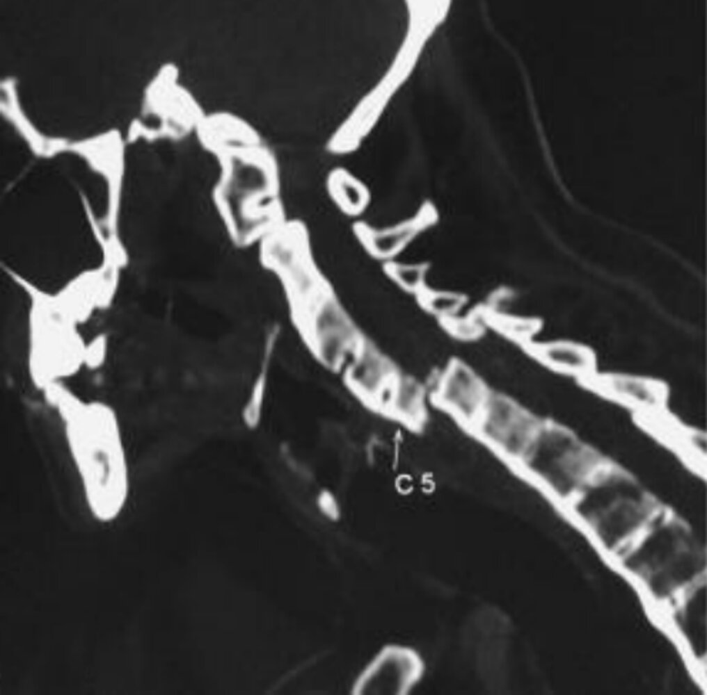

Cervical chalk stick fracture in ankylosing spondylitis

Cervical chalk stick fracture in ankylosing spondylitis

We list the most important complications. The selection is not exhaustive.

---