# Degenerative disk disease

*Categories: Clinical knowledge > Surgery > Trauma and orthopedic surgery > Spine > Degenerative disk disease*

[Original Article Link](https://coursology-qbank.com/amboss/article/ji0_rf)

---

## Summary

Degenerative disk disease refers to a group of conditions in which disk material is displaced into the <u>spinal canal</u>. The condition can be asymptomatic or manifest as <u>radiculopathy</u> (due to compression of a <u>spinal nerve</u> root) or <u>myelopathy</u> (due to <u>compression of the spinal cord</u>). The site of nerve or cord compression can often be determined based on the patient's neurological deficits. <u>Radiculopathy</u> manifests with <u>radicular pain</u>, motor <u>weakness</u>, and loss of <u>deep tendon reflexes</u> in the <u>dermatome</u> and <u>myotome</u> territory of the compressed <u>nerve root</u>. <u>Myelopathy</u> is a <u>medical emergency</u> that typically manifests with motor <u>weakness</u>, sensory abnormalities (e.g., <u>saddle anesthesia</u>), and bowel and/or <u>bladder</u> disturbances. <u>MRI</u> findings consistent with <u>physical exam</u> findings confirm the diagnosis. <u>Conservative management</u> with <u>analgesics</u> and <u>physiotherapy</u> may be sufficient for isolated acute <u>radiculopathy</u> without severe <u>paresis</u>. Urgent surgical decompression is required for patients with <u>spinal cord compression</u>, <u>conus medullaris syndrome</u>, or <u>cauda equina syndrome</u> to prevent permanent neurological damage.

---

## Definitions

* Disk protrusion: protrusion of the <u>vertebral</u> disk <u>nucleus pulposus</u> through the <u>annulus fibrosus</u>

* Disk herniation:  (disk extrusion or disk prolapse): complete extrusion of the <u>nucleus pulposus</u> through a tear in the <u>annulus fibrosus</u>

* Disk sequestration: extrusion of the <u>nucleus pulposus</u> and separation of a fragment of the disk

* Spondylosis: a broad term used to describe degenerative changes of the <u>spine</u> that may result in irritation and/or damage of the adjacent <u>nerve roots</u> or spinal cord

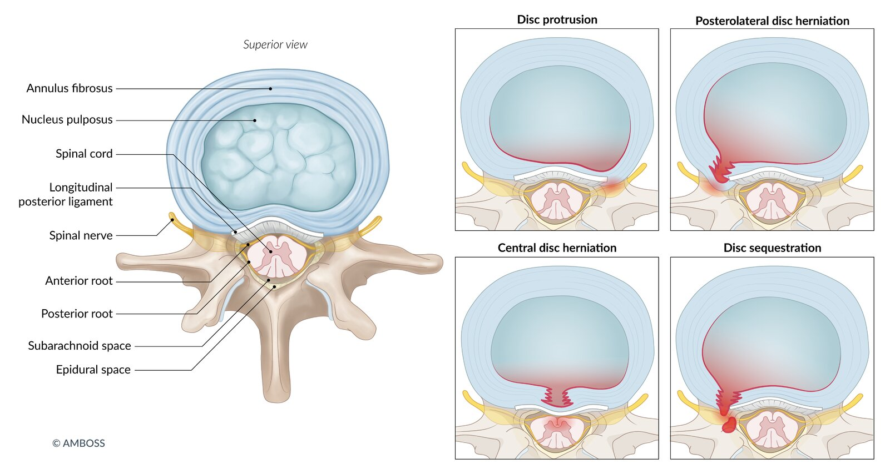

Common intervertebral disc pathologies

Thoracic spine and costovertebral anatomy

Costovertebral joints and ligaments

---

## Epidemiology

* Age: most common at 30–50 years

* Sex: <u>♂</u> > <u>♀</u> [[1]](https://coursology-qbank.com/amboss/article/K6XUN_)

* Approx. 80% of all Americans suffer from significant <u>back pain</u> at some point in their lives. [[2]](https://coursology-qbank.com/amboss/article/66XjN_)

* <u>Disk herniation</u> is the <u>cause of back pain</u> in roughly 5% of cases.

* Cervical and thoracic <u>disk herniations</u>: rare

* Lumbosacral <u>disk herniation</u>

* L5–<u>S1</u> (most common site)

* L4–L5 (second most common site)

Epidemiological data refers to the US, unless otherwise specified.

---

## Pathophysiology

* The intervertebral disk consists of a dense outer ring (<u>annulus fibrosus</u>) and a gelatinous core (<u>nucleus pulposus</u>).

* These structures work together as a <u>shock</u> absorber by distributing high axial pressure evenly onto the cover plates and base units of the <u>vertebral bodies</u>.

* High pressure on the <u>vertebral</u> disks leads to fluid loss, and as a result, body height decreases physiologically by 1–2 cm during the day.

* Compression, tension, shear, and <u>torque</u> stresses on the spinal disk → degenerative changes (e.g., <u>dehydration</u>, annular tear) → <u>disk protrusion</u> or <u>herniation</u> through the <u>annulus fibrosus</u> into the <u>central canal</u> → adjacent <u>nerve root</u> impingement → sensorimotoric deficits in affected <u>nerve root</u>

* Posterolateral <u>disk herniation</u>/protrusion (common) → compression of the transversing <u>nerve root</u> → compressive <u>radiculopathy</u> [[3]](https://coursology-qbank.com/amboss/article/SQcyvX0)

* Central <u>disk herniation</u>/protrusion (less common) → <u>compression of the spinal cord</u> (above L1–L2) or <u>cauda equina</u> (below L2) → <u>compressive myelopathy</u> [[3]](https://coursology-qbank.com/amboss/article/SQcyvX0)

> [!NOTE]
> Intervertebral disks usually protrude/herniate posterolaterally, as the <u>posterior longitudinal ligament</u> is thinner than the <u>anterior longitudinal ligament</u>.

Common intervertebral disc pathologies

---

## Clinical features

Degenerative disk disease may be asymptomatic and detected incidentally (e.g., on imaging performed for an unrelated condition). Examination findings vary depending on the location and severity of <u>nerve root</u> compression. [[4]](https://coursology-qbank.com/amboss/article/dIcobd0)[[5]](https://coursology-qbank.com/amboss/article/VIcGbd0)

* Acute onset of severe neck or <u>back pain</u>

* Radicular pain: <u>pain</u> that radiates to the legs (sciatic <u>pain</u>) or arms  [[3]](https://coursology-qbank.com/amboss/article/SQcyvX0)

* The <u>pain</u> is either stabbing in nature or resembles an <u>electric shock</u>.

* <u>Pain</u> increases with pressure (e.g., from <u>coughing</u> or sneezing).

* <u>Pain</u> decreases with minor changes in position (e.g., taking a short walk).

* Features of <u>radiculopathy</u>: <u>lower motor neuron signs</u> of the affected <u>nerve root</u> (typically unilateral) [[6]](https://coursology-qbank.com/amboss/article/1Ic2bd0)[[7]](https://coursology-qbank.com/amboss/article/eIcxbd0)

* <u>Paresthesia</u> of the affected <u>dermatome</u>

* <u>Muscle weakness</u> and <u>atrophy</u> of the related <u>myotome</u>

* Absent or diminished <u>deep tendon reflexes</u>

* See “<u>Compressive radiculopathy</u>” for details.

* Features of <u>compressive myelopathy</u> (typically bilateral) or <u>cauda equina syndrome</u> [[6]](https://coursology-qbank.com/amboss/article/1Ic2bd0)

* <u>Paresthesia</u> below the level of compression

* Motor deficits

* At the level of compression: <u>lower motor neuron signs</u>

* Below the level of compression

* <u>Upper motor neuron signs</u> in <u>spinal cord compression</u> and <u>conus medullaris syndrome</u>

* <u>Lower motor neuron signs</u> in <u>cauda equina syndrome</u>

* May be associated with gait disturbances, <u>bladder</u> dysfunction, and/or bowel dysfunction

* See “<u>Compressive spinal emergencies</u>” for details.

> [!TIP]
> As <u>dermatomal</u> territories often overlap (except in <u>autonomous sensory zones</u>) and muscles are often supplied by several myotomes, sensory and motor deficits may be absent or minimal if a single spinal root is compressed.

> [!NOTE]
> The affected <u>nerve root</u> is typically the one below the level of <u>disk herniation</u> (i.e., C4–C5 <u>disk herniation</u> leads to <u>C5 radiculopathy</u>; L4–L5 <u>disk herniation</u> leads to <u>L5 radiculopathy</u>).

Dermatome map

---

## Compressive radiculopathy

### Cervical radiculopathy [[8]](https://coursology-qbank.com/amboss/article/URcbmX0)

#### Etiology

* <u>Disk herniation</u>

* <u>Spondylosis</u>

#### Symptoms

* <u>Neck pain</u> commonly associated with <u>radiculopathy</u>

* Can manifest with difficulty with fine motor skills

* Can be accompanied by <u>headache</u> and/or shoulder <u>pain</u>

#### Examination findings

May be normal or demonstrate specific motor or sensory deficits depending on the <u>nerve root</u> affected

|  Overview of cervical radiculopathies [[9]](https://coursology-qbank.com/amboss/article/kIYm1q) |  |  |  |  |
| --- | --- | --- | --- | --- |
| <u>Radiculopathy</u> | Causative disk |  Sensory deficits  | Motor deficits | Reduction of reflexes |
| C3/4 radiculopathy |  * C2–C4   |  * Shoulder and neck area   |  * <u>Scapular winging</u>   |  * None   |
| C5 radiculopathy |  * C4–C5   |  * <u>Anterior</u> shoulder   |  * <u>Biceps</u> and deltoid   |  * <u>Biceps reflex</u>   |
| C6 radiculopathy |  * C5–C6   |  * From the upper <u>lateral</u> <u>elbow</u> over the radial forearm up to the thumb and radial side of index finger   |  * <u>Biceps</u> and wrist extensors   |   * <u>Biceps reflex</u>  * <u>Brachioradialis reflex</u>    |
| C7 radiculopathy |  * C6–C7   |   * <u>Palmar</u>: fingers II–IV (II ulnar half, III entirely, IV radial half)  * <u>Dorsal</u>: <u>medial</u> forearm up to fingers II–IV    |  * <u>Triceps</u>, wrist flexors, and finger extensors   |  * <u>Triceps reflex</u>   |
| C8 radiculopathy |  * C7–T1   |  * Fingers IV (ulnar half) and V, <u>hypothenar eminence</u>, and ulnar aspect of the <u>distal</u> forearm   |  * Finger flexors   |  * None   |

#### Provocation maneuvers for cervical radiculopathy

* <u>Hoffmann reflex</u>: A positive result suggests <u>cervical myelopathy</u>. [[10]](https://coursology-qbank.com/amboss/article/C70qLh)

* Neck compression test (<u>Spurling maneuver</u>): screens for <u>cervical radiculopathy</u> [[11]](https://coursology-qbank.com/amboss/article/PQcWwX0)

* Tilt and rotate the neck toward the affected side while applying downward pressure (axial loading) to the head.

* The test is positive if it produces <u>pain</u> and/or <u>paresthesia</u> that radiates to the motor or sensory area of the affected <u>nerve root</u>.

* Abduction relief sign: A clinical sign of <u>cervical radiculopathy</u> in which <u>abduction</u> of the <u>ipsilateral</u> arm, such as placing it on the head, improves the symptom. [[12]](https://coursology-qbank.com/amboss/article/bjdH_p0)

### Lumbosacral radiculopathy [[3]](https://coursology-qbank.com/amboss/article/SQcyvX0)

#### Symptoms

* <u>Low back pain</u> (<u>lumbago</u>) commonly associated with <u>radiculopathy</u>

* <u>Pain</u> characteristically worsens with lumbar <u>flexion</u> (e.g., on sitting).

> [!TIP]
> Worsening of <u>low back pain</u> with lumbar <u>flexion</u> (e.g., on sitting) is suggestive of lumbar <u>disk herniation</u>, while improvement of <u>pain</u> with lumbar <u>flexion</u> is suggestive of <u>lumbar spinal stenosis</u>. [[3]](https://coursology-qbank.com/amboss/article/SQcyvX0)

#### Examination findings

May be normal or show specific motor or sensory deficits, depending on the affected <u>nerve root</u>

|  Overview of lumbosacral radiculopathies [[9]](https://coursology-qbank.com/amboss/article/kIYm1q) |  |  |  |  |
| --- | --- | --- | --- | --- |
| <u>Radiculopathy</u> | Causative disk |  Sensory deficits  | Motor deficits | Reduction of reflexes |
| L3 radiculopathy |  * L2–L3   |  * Anterolateral area of the thigh   |   * Hip <u>flexion</u>  * Knee extension  * Hip <u>adduction</u>    |   * <u>Adductor reflex</u>  * <u>Patellar reflex</u>    |
| L4 radiculopathy |  * L3–L4   |  * Anterolateral thigh, area over the patella, <u>medial</u> aspect of the leg, <u>medial malleolus</u>   |   * Knee extension  * Hip <u>adduction</u>    |  * <u>Patellar reflex</u>   |
| L5 radiculopathy |  * L4–L5   |  * <u>Lateral</u> aspect of the thigh and knee, anterolateral aspect of the leg, dorsum of the foot, and the big toe   |   * <u>Tibialis anterior</u> muscle (foot <u>dorsiflexion</u>): difficulty heel walking (<u>foot drop</u>)  * <u>Extensor hallucis longus</u> muscle (first toe <u>dorsiflexion</u>)    |  * <u>Posterior tibial reflex</u> (<u>medial</u> hamstring)   |
| S1 radiculopathy |  * L5–<u>S1</u>   |  * Dorsolateral aspect of thigh and leg, and the <u>lateral</u> aspect of the foot   |  * <u>Peroneus longus</u> and brevis muscle (<u>foot eversion</u>) and <u>gastrocnemius</u> muscle (foot <u>plantarflexion</u>): difficulty <u>toe walking</u>   |   * <u>Achilles reflex</u>  * <u>Lateral hamstring reflex</u>    |
| S2 radiculopathy, S3 radiculopathy, S4 radiculopathy |  * <u>S1</u>–<u>S4</u>   |  * <u>Posterior</u> aspect of the thigh and leg (<u>S2</u>), <u>perineum</u> (<u>S3</u>–<u>S4</u>), perianal (<u>S4</u>)   |  * None   |   * <u>Bulbocavernosus reflex</u>  * <u>Perineal reflex</u>    |

> [!WARNING]
> <u>Back pain</u> associated with bowel or <u>bladder</u> dysfunction is concerning for <u>spinal cord compression</u>, <u>cauda equina syndrome</u>, and <u>conus medullaris syndrome</u>.

> [!TIP]
> Herniated lumbosacral disks commonly cause <u>radiculopathy</u> below the level of the <u>herniated disk</u> (e.g., L4–L5 <u>disk herniation</u> results in <u>L5 radiculopathy</u>). However, a far <u>lateral</u> <u>disk herniation</u> can cause <u>radiculopathy</u> above the level of the disk (e.g., L4–L5 far <u>lateral</u> <u>disk herniation</u> resulting in <u>L4 radiculopathy</u>). [[13]](https://coursology-qbank.com/amboss/article/uz0pui)

#### Provocative maneuvers for lumbosacral radiculopathy

Leg raising maneuvers are used to screen for <u>lumbosacral radiculopathy</u>

* Straight leg raise test (<u>Lasegue sign</u>): A <u>straight leg raise</u> leads to increased <u>pain</u> in the <u>ipsilateral</u> leg with radiation to the motor or sensory area of the affected <u>nerve root</u>.

* Bragard sign: A <u>straight leg raise</u> leads to increased <u>pain</u> in the <u>ipsilateral</u> leg; lowering the leg to just below the level where <u>pain</u> is produced and pulling the foot to <u>dorsiflexion</u> reproduces the <u>pain</u>.

* Crossed straight leg raise test: A straight raise of the leg that is <u>contralateral</u> to the suspected lesion leads to <u>pain</u> radiating to the motor and sensory area of the affected <u>nerve root</u> in the leg <u>ipsilateral</u> to the lesion.

* Reverse straight leg raise test: A reverse <u>straight leg raise</u> leads to <u>pain</u> in the <u>ipsilateral</u> leg radiating to the motor and sensory area of the affected <u>nerve root</u>.

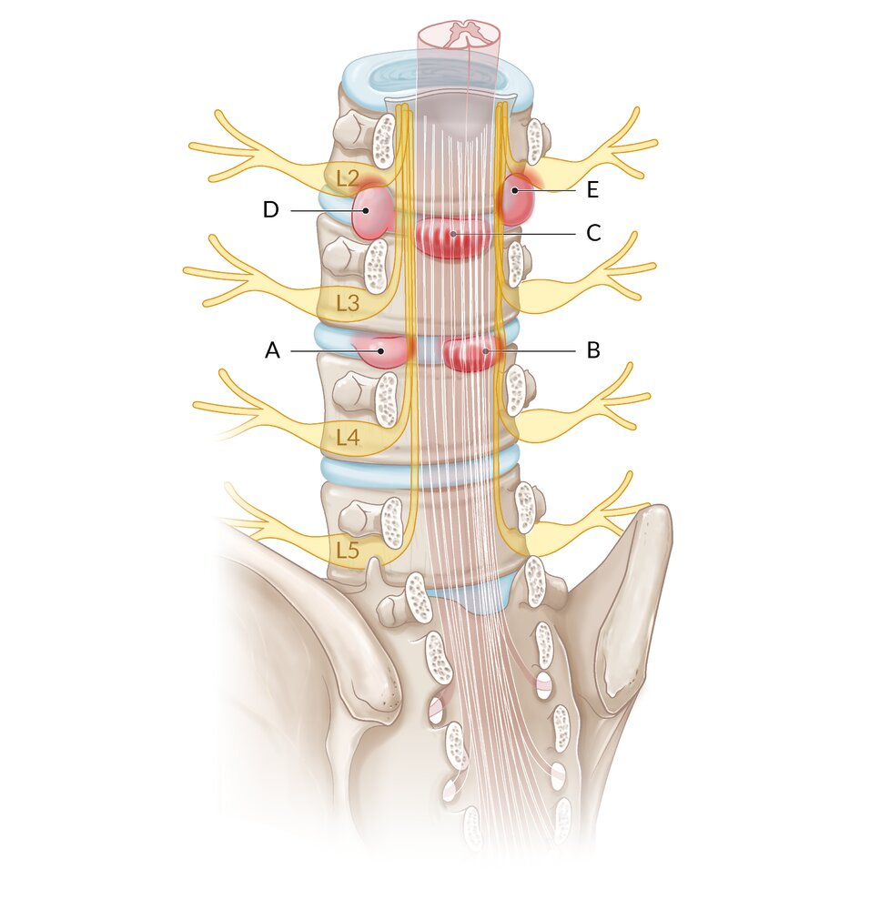

Intervertebral disk herniation and nerve root compression

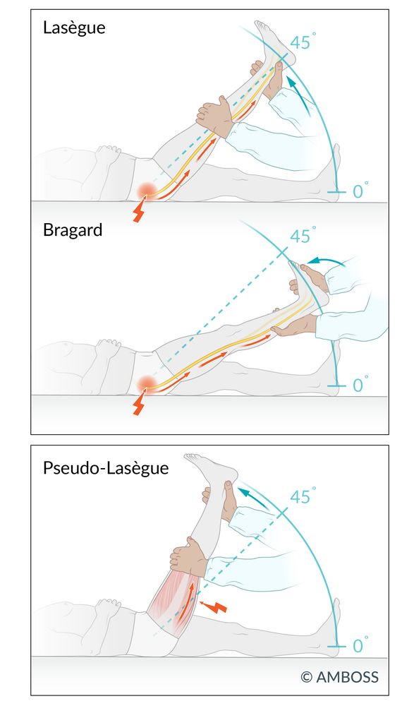

Straight leg raise tests

---

## Diagnosis

Degenerative disk disease is diagnosed on the basis of characteristic clinical features in conjunction with abnormal imaging.

### Approach [[14]](https://coursology-qbank.com/amboss/article/Trc6gd0)[[15]](https://coursology-qbank.com/amboss/article/Edc87Y0)[[16]](https://coursology-qbank.com/amboss/article/RIclcd0)

See also “<u>Management of acute back pain</u>” and “<u>Compressive spinal emergencies</u>.”

* Perform clinical evaluation focusing on <u>red flags for acute back pain</u>.

* Determine the need for imaging (see also “<u>Approach to imaging in acute back pain</u>”).

* <u>Red flags for acute back pain</u>: <u>MRI</u> <u>spine</u> without IV contrast is preferred.  [[15]](https://coursology-qbank.com/amboss/article/Edc87Y0)

* No <u>red flags for acute back pain</u>: Urgent imaging is typically not required.  [[15]](https://coursology-qbank.com/amboss/article/Edc87Y0)[[16]](https://coursology-qbank.com/amboss/article/RIclcd0)

* Consider additional studies (e.g., <u>bladder</u> scan) based on clinical suspicion.

### <u>MRI</u> <u>spine</u> without IV contrast [[8]](https://coursology-qbank.com/amboss/article/URcbmX0)[[14]](https://coursology-qbank.com/amboss/article/Trc6gd0)[[17]](https://coursology-qbank.com/amboss/article/GjcBbc0)

* Indications: preferred initial imaging modality for suspected <u>radiculopathy</u>, <u>myelopathy</u>, or <u>cauda equina syndrome</u> [[14]](https://coursology-qbank.com/amboss/article/Trc6gd0)[[15]](https://coursology-qbank.com/amboss/article/Edc87Y0)[[16]](https://coursology-qbank.com/amboss/article/RIclcd0)

* Supportive findings

* Disk degeneration: sclerosed, <u>dehydrated</u> disk that appears <u>hypointense</u> on <u>T2-weighted</u> images

* Disk prolapse/<u>herniation</u>: <u>herniation</u> of disk tissue with surrounding <u>edema</u>

* Evidence of impingement/compression of a <u>spinal nerve</u> or the spinal cord may be visible, e.g.:

* Focal narrowing of the <u>spinal canal</u>

* Compression of the thecal sac

* <u>Edema</u> of the spinal cord (appears <u>hyperintense</u> on <u>T2-weighted</u> images)

> [!WARNING]
> A diagnosis of degenerative disk disease should not be made based on imaging alone; up to 30% of asymptomatic individuals have abnormal disk appearances on <u>MRI</u>. [[17]](https://coursology-qbank.com/amboss/article/GjcBbc0)

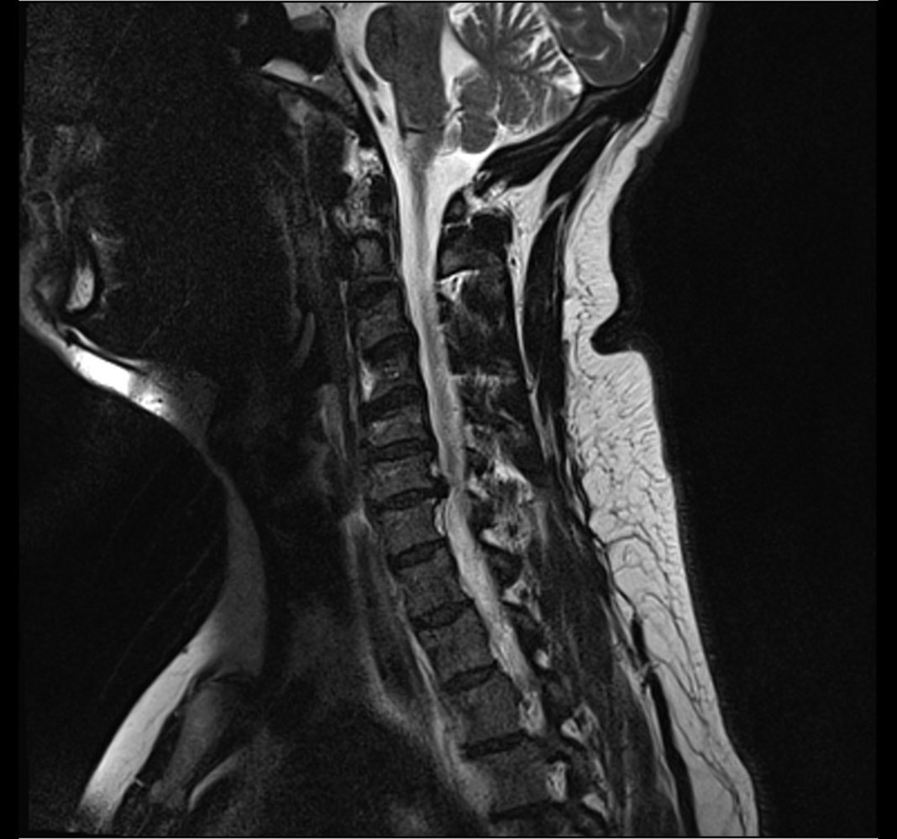

Cervical disk herniation

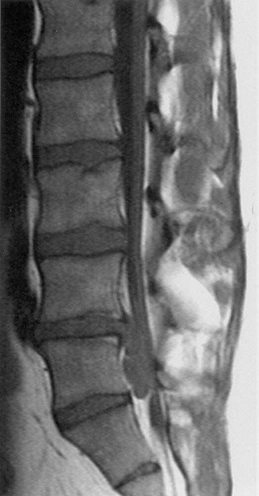

Spinal disk herniation with migration (1/3)

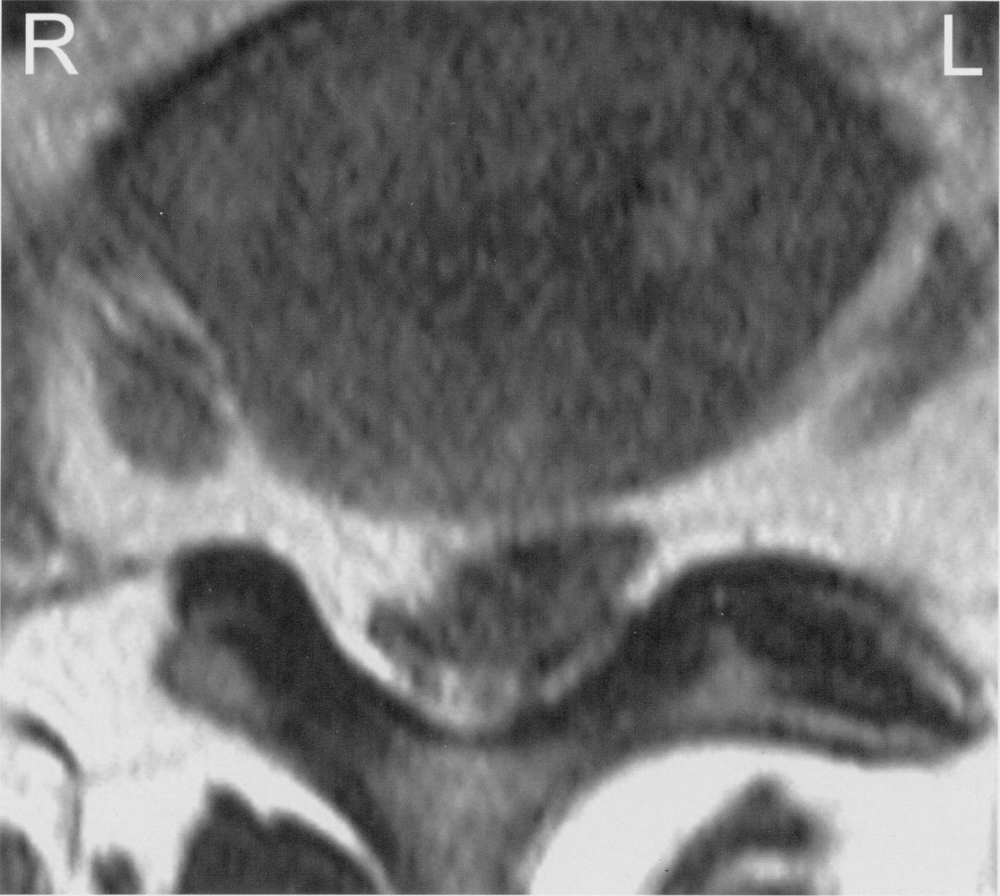

Spinal disk herniation with migration (2/3)

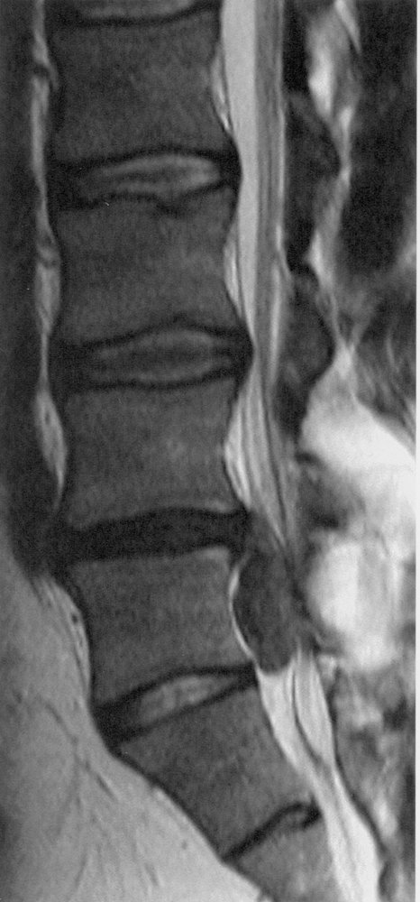

Spinal disk herniation with migration (3/3)

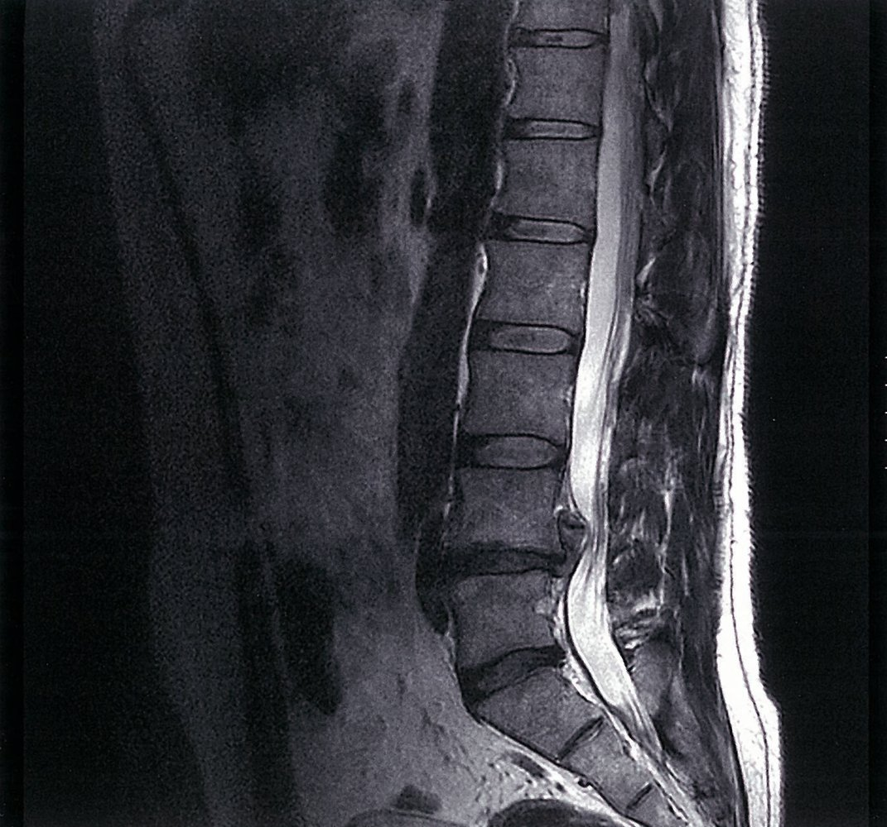

Degenerative disk disease with disk extrusion

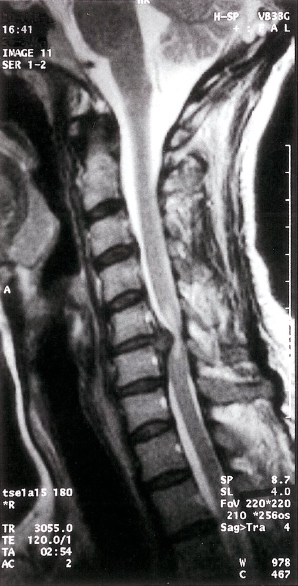

Cervical disk herniation

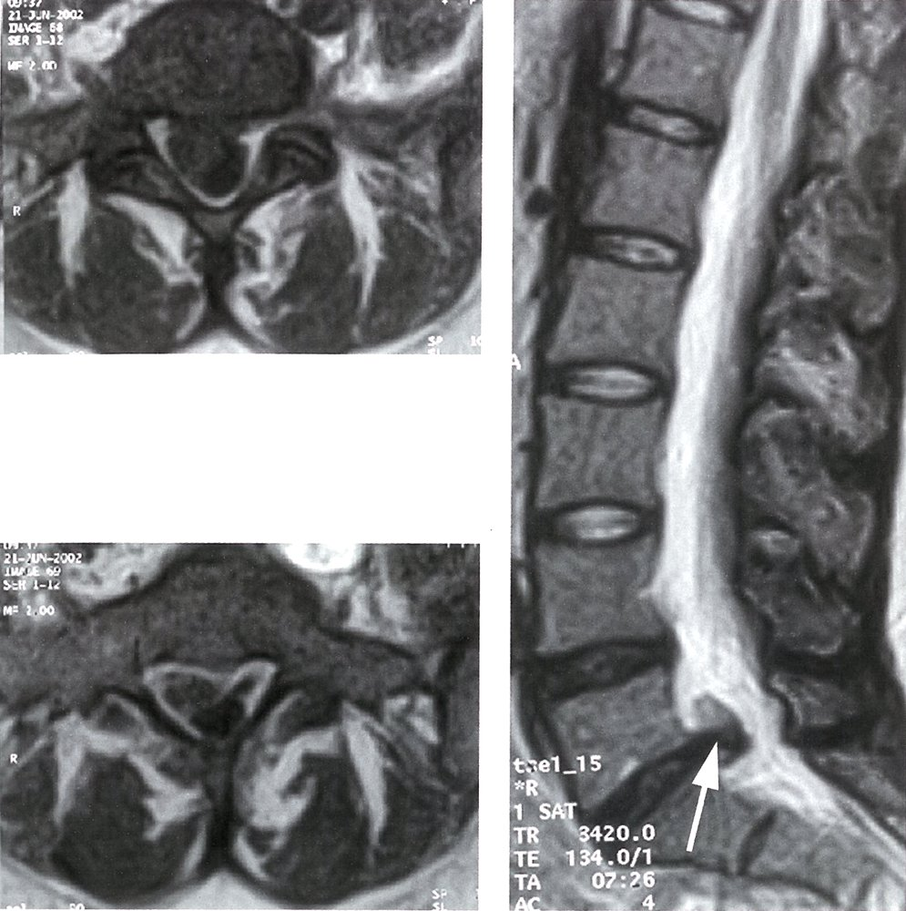

Lumbar disc herniation

### Other imaging modalities

#### <u>CT myelogram</u> [[14]](https://coursology-qbank.com/amboss/article/Trc6gd0)[[15]](https://coursology-qbank.com/amboss/article/Edc87Y0)[[16]](https://coursology-qbank.com/amboss/article/RIclcd0)

* Indications

* <u>MRI</u> unavailable

* <u>MRI contraindications</u>

* Surgical planning (better analysis of bone structure)

* Supportive findings

* Similar to <u>MRI</u>

* May rule out occult <u>spondylolysis</u> or tumors

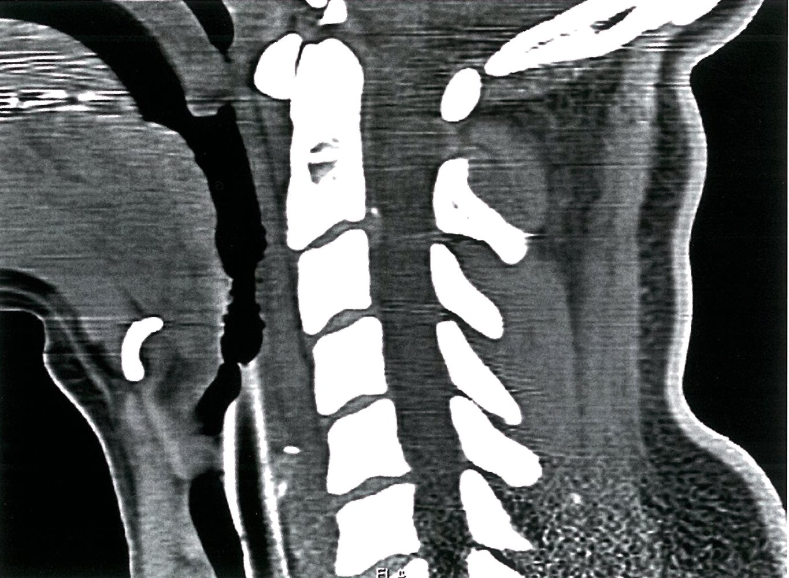

Disk herniation of C2/3

#### <u>X-ray</u> <u>spine</u> [[15]](https://coursology-qbank.com/amboss/article/Edc87Y0)[[16]](https://coursology-qbank.com/amboss/article/RIclcd0)

* Indications 

* Consider for individuals with new or increasing nontraumatic cervical <u>pain</u> who do not have <u>red flag features</u>.

* <u>Flexion</u>-extension views are useful for identifying <u>spondylolisthesis</u> and <u>spinal instability</u>. [[15]](https://coursology-qbank.com/amboss/article/Edc87Y0)

* Supportive findings (on AP and <u>lateral</u> views): disk space narrowing, <u>vertebral body</u> <u>osteophytes</u>, endplate and facet <u>sclerosis</u>

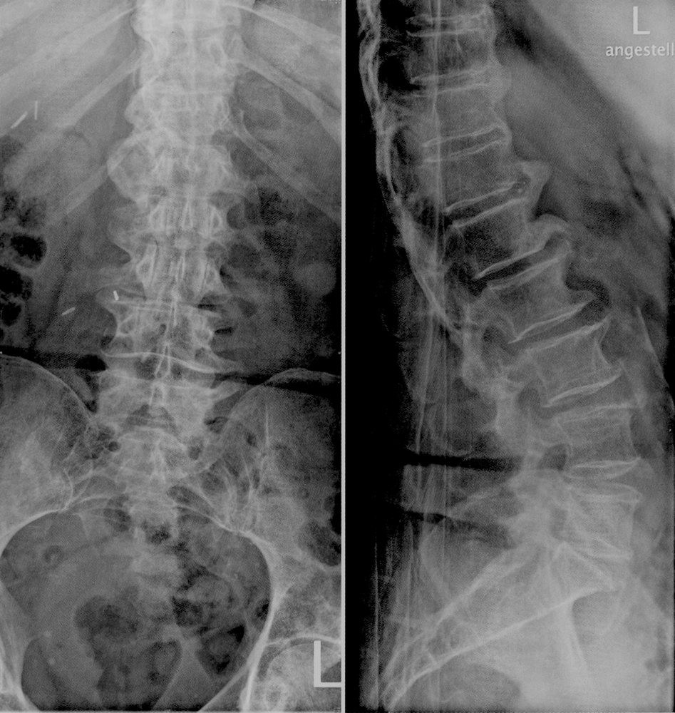

Lumbar spondylosis

### Additional investigations

* <u>Bladder</u> scan: Evaluate for <u>urinary retention</u> in patients with <u>myelopathy</u> or <u>cauda equina syndrome</u>.

* <u>Laboratory studies</u>

* Not required to diagnose degenerative disk disease

* Consider evaluation for alternative etiologies of <u>radicular pain</u>, <u>radiculopathy</u>, or <u>myelopathy</u>.

* Advanced studies: In patients with persistent <u>radiculopathy</u> and inconclusive imaging findings, consider <u>electrodiagnostic testing</u>  to distinguish <u>radiculopathy</u> from a <u>peripheral neuropathy</u>. [[18]](https://coursology-qbank.com/amboss/article/orc0Rd0)[[19]](https://coursology-qbank.com/amboss/article/KrcURd0)

---

## Differential diagnoses

See “<u>Differential diagnoses of back pain</u>” for details on the distinguishing characteristics and management of the underlying etiology.

* Musculoskeletal: <u>muscle strain</u>;  , <u>spinal stenosis</u>; , <u>spinal disk herniation</u>; , <u>degenerative spondylolisthesis</u>, <u>vertebral fractures</u>

* Neurological: <u>spinal cord compression</u>, <u>cauda equina syndrome</u>, <u>conus medullaris syndrome</u>, <u>spinal epidural hematoma</u>

* <u>Malignancy</u>: <u>bone metastases</u> (extradural <u>metastatic</u> lesions)

* Infections: <u>diskitis</u>, <u>spinal epidural abscess</u>, <u>vertebral osteomyelitis</u>

* Inflammatory: <u>ankylosing spondylitis</u>, <u>reactive arthritis</u>, <u>psoriatic arthritis</u>, autoimmune <u>myelopathy</u> (e.g., <u>multiple sclerosis</u>, <u>neuromyelitis optica</u>), <u>transverse myelitis</u>

* <u>Referred pain</u>: <u>acute pancreatitis</u>, ureteric stone, <u>abdominal aortic aneurysm</u>, <u>aortic dissection</u>

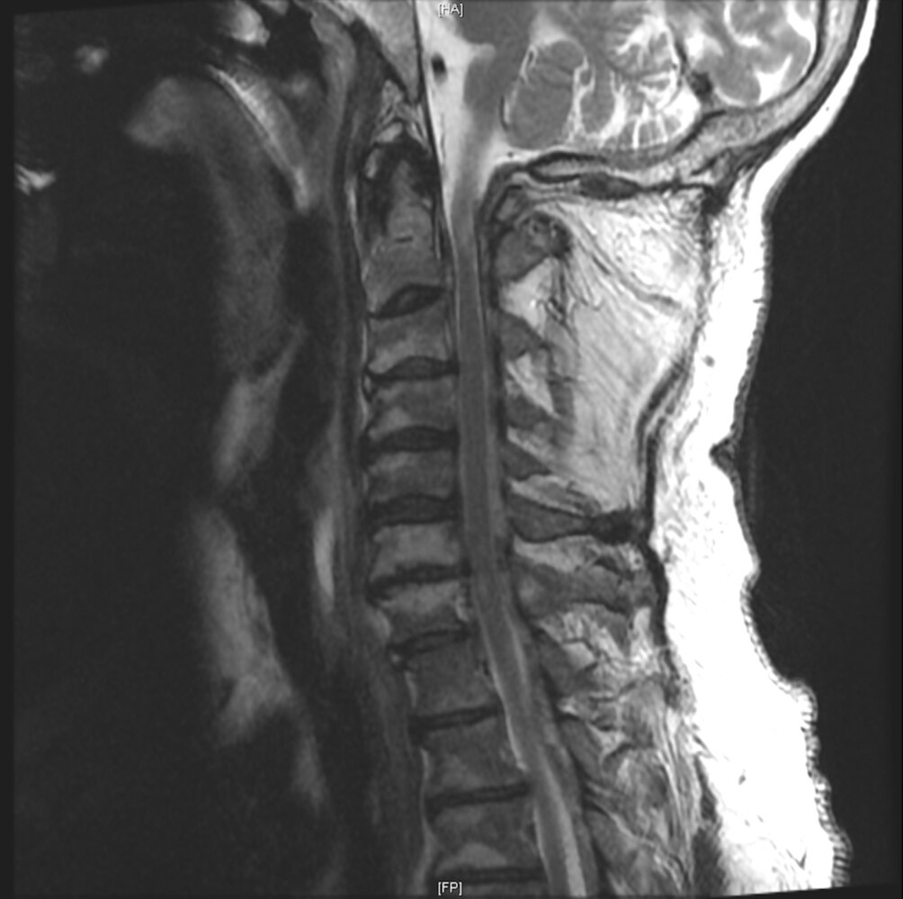

Spinal epidural hematoma

Degenerative and inflammatory lesions of the spine

The differential diagnoses listed here are not exhaustive.

---

## Treatment

### Approach

* Identify and treat <u>compressive spinal emergencies</u> immediately, if present.

* For isolated <u>radiculopathy</u> or <u>pain</u> due to DDD without any <u>red flags for acute back pain</u>:

* Initiate <u>conservative management</u>.

* Urgent imaging is typically not required; consider imaging if symptoms do not improve within 6 weeks. [[15]](https://coursology-qbank.com/amboss/article/Edc87Y0)[[16]](https://coursology-qbank.com/amboss/article/RIclcd0)

* Consider referral to neurosurgery to assess whether <u>surgery</u> is required for persistent symptoms.

* Educate the patient on symptoms of <u>compressive spinal emergencies</u> and the need to seek immediate medical help if symptoms develop.

> [!WARNING]
> Urgently obtain an <u>MRI</u> and consult neurosurgery to evaluate any of the following <u>red flags for acute back pain</u> associated with DDD: new or progressive neurological deficits, especially motor <u>weakness</u>, <u>saddle anesthesia</u>, and/or bowel, <u>bladder</u>, or <u>sexual dysfunction</u>; intractable or progressive <u>pain</u>; recent spinal <u>surgery</u>.

### <u>Conservative management</u> [[8]](https://coursology-qbank.com/amboss/article/URcbmX0)[[18]](https://coursology-qbank.com/amboss/article/orc0Rd0)[[19]](https://coursology-qbank.com/amboss/article/KrcURd0)

* Treatment is similar to that for <u>nonspecific back pain</u> and <u>neck pain</u>.

* <u>Physiotherapy</u> with exercises to strengthen the back and neck

* Continuation of daily activities (minimize bed rest)  [[20]](https://coursology-qbank.com/amboss/article/s21tQT0)[[21]](https://coursology-qbank.com/amboss/article/G21BQT0)

* <u>Analgesics</u> (e.g., <u>NSAIDs</u>)  [[22]](https://coursology-qbank.com/amboss/article/5U1idT0)

* Consider a short course of oral <u>glucocorticoids</u> for <u>pain</u> related to <u>radiculopathy</u>.  [[18]](https://coursology-qbank.com/amboss/article/orc0Rd0)[[19]](https://coursology-qbank.com/amboss/article/KrcURd0)

* Advise patients that symptom improvement is typically gradual (several weeks).

* For patients with severe <u>pain</u>, consider periradicular therapy: image-guided injection of <u>local anesthetic</u> (e.g., <u>ropivacaine</u>) and <u>glucocorticoids</u> at the <u>intervertebral foramen</u> to reduce inflammation and <u>edema</u> at the affected <u>nerve root</u>  [[8]](https://coursology-qbank.com/amboss/article/URcbmX0)[[23]](https://coursology-qbank.com/amboss/article/9McNI10)

> [!TIP]
> About 90% of lumbar <u>disk herniations</u> with acute <u>radiculopathy</u> start to improve within 6 weeks and resolve by 12 weeks with <u>conservative management</u>. [[24]](https://coursology-qbank.com/amboss/article/gQcFvX0)

### <u>Surgery</u> [[8]](https://coursology-qbank.com/amboss/article/URcbmX0)[[19]](https://coursology-qbank.com/amboss/article/KrcURd0)

* Indications

* Urgent: significant or progressive neurological deficits, bowel or <u>bladder incontinence</u>, <u>compressive spinal emergencies</u>

* Elective: persistent or progressive <u>radiculopathy</u> despite <u>conservative management</u>

* Procedure: diskectomy [[8]](https://coursology-qbank.com/amboss/article/URcbmX0)[[19]](https://coursology-qbank.com/amboss/article/KrcURd0)

* Surgical removal of the herniated portion of the intervertebral disk

* Can be performed via an open approach, via minimally invasive <u>surgery</u> (microdiskectomy), or under <u>fluoroscopic</u> guidance (percutaneous <u>diskectomy</u>)

* Complications

* Damage of large prevertebral <u>blood vessels</u> (rare)

* Failed back <u>surgery</u> syndrome: Persistent <u>back pain</u>, <u>radicular pain</u>, or <u>paresthesias</u> occurs in ∼ 20–40% of patients after disk <u>surgery</u> due to scarring, <u>vertebral instability</u>, or arachnoid adhesions to <u>nerve roots</u>. [[25]](https://coursology-qbank.com/amboss/article/wjchcc0)

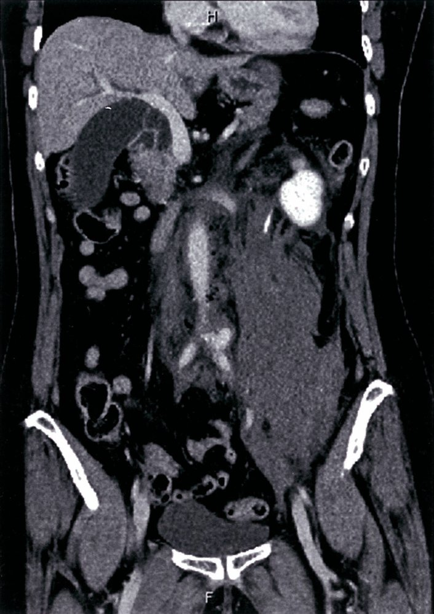

Retroperitoneal hemorrhage from the left common iliac artery

---