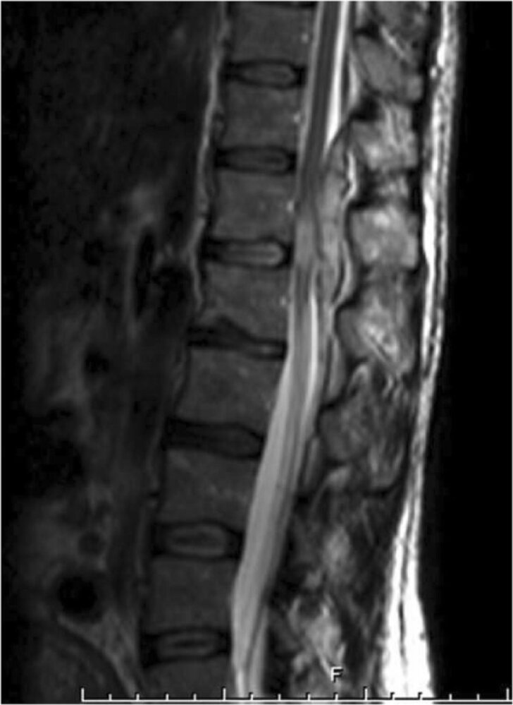
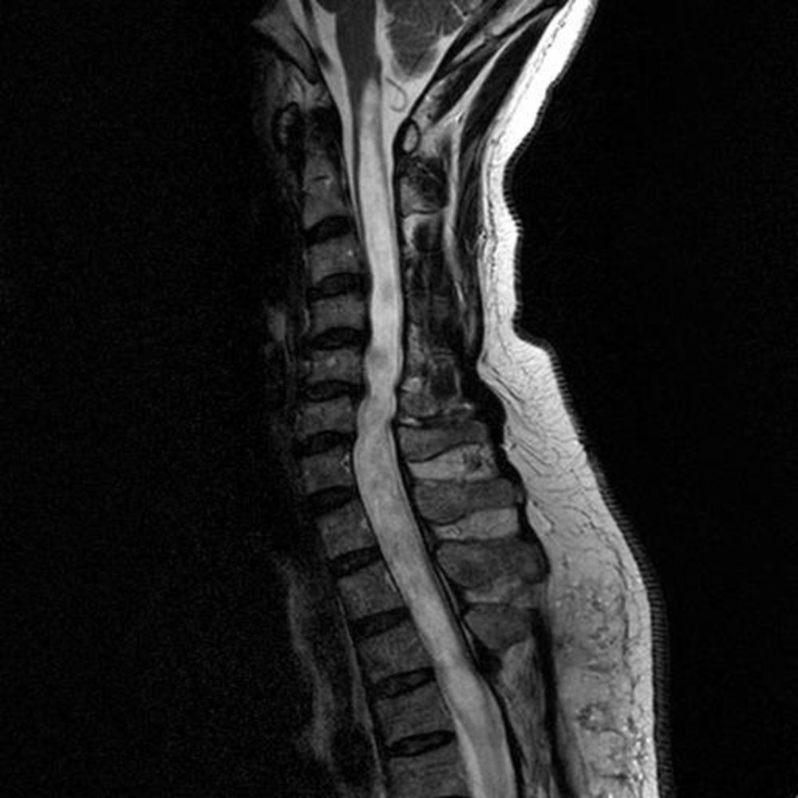
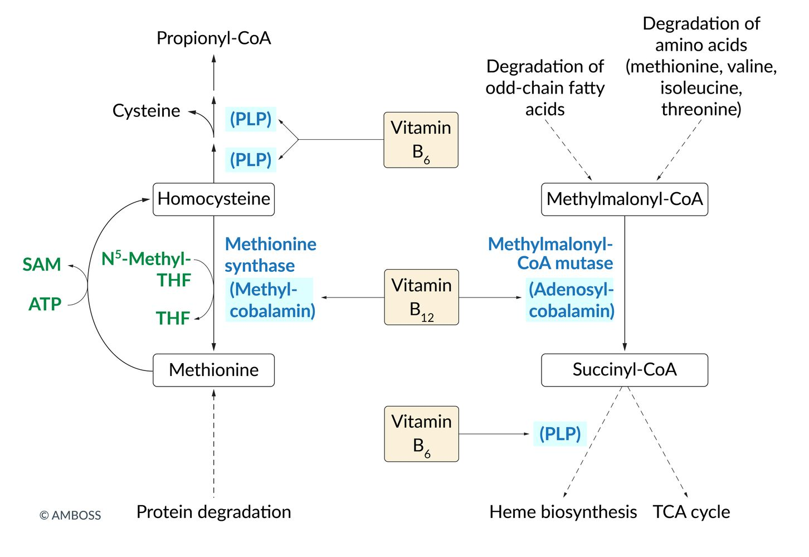

# Spinal cord injuries

*Categories: Clinical knowledge > Surgery > Trauma and orthopedic surgery > Spine > Spinal cord injuries*

[Original Article Link](https://coursology-qbank.com/amboss/article/Wi0Pqf)

---

## Summary

Spinal cord injuries (SCIs) result from trauma (e.g., <u>motor vehicle crashes</u> and falls) or nontraumatic causes (i.e., <u>ischemic</u>, compressive, or inflammatory). SCIs initially manifest with an acute phase of <u>spinal shock</u>, characterized by flaccid areflexic <u>paralysis</u>, anesthesia, and <u>autonomic dysfunction</u> that occurs below the level of the injury. <u>Spinal shock</u> typically resolves within 48 hours, leading to a chronic phase of incomplete or <u>complete SCI</u>, depending on whether the spinal cord has been partially or completely transected. Symptoms of <u>complete SCI</u> typically occur 6–8 weeks after resolution of <u>spinal shock</u> and include bilateral absence of sensory and <u>motor function</u>, muscle hypertonia with <u>spastic paralysis</u>, and <u>hyperreflexia</u> below the level of the lesion. Diagnosis requires serial <u>neurological examinations</u> and imaging (e.g., CT and <u>MRI</u> <u>spine</u>). Acute management includes spinal stabilization, respiratory and <u>hemodynamic support</u>, <u>urinary catheterization</u>, and <u>analgesia</u>; operative management typically involves surgical decompression and stabilization. SCIs can lead to several complications in the acute and chronic phases, including <u>autonomic dysreflexia</u>, which can cause life-threatening episodes of cardiovascular instability.

This article focuses on the complete transection of the spinal cord. For more information on incomplete SCIs, see “<u>Incomplete spinal cord syndromes</u>.”

---

## Overview

* <u>Complete spinal cord injury</u>

* SCI caused by a lesion affecting all <u>spinal tracts</u> at a given spinal level (e.g., complete transection)

* Results in total bilateral loss of communication between the nerve fibers above and below the level of the lesion

* Characterized by a complete absence of motor, sensory, bowel, and <u>bladder</u> function below the level of injury

* <u>Incomplete spinal cord injury</u>

* SCI caused by a lesion affecting select parts of the ascending or descending <u>spinal tracts</u> at a given spinal level

* Characterized by <u>dissociated sensory loss</u> with preservation of some sensorimotor functions below the level of injury

* For more information, see ''<u>Incomplete spinal cord syndromes</u>.''

* <u>Spinal shock</u>: acute transient loss or <u>depression</u> of all sensorimotor functions and reflexes below the level of an SCI

> [!WARNING]
> Do not confuse <u>spinal shock</u> with <u>neurogenic shock</u>.

> [!WARNING]
> SCI can occur with or without <u>vertebral fractures</u> or <u>dislocations</u>. Even when these coincide, the neurological level of injury does not always correspond to the skeletal level. [[1]](https://coursology-qbank.com/amboss/article/LWdwNK0)

---

## Etiology

### Traumatic [[2]](https://coursology-qbank.com/amboss/article/hrWcS50)

* <u>Motor vehicle crashes</u>

* Falls (e.g., especially in older adults)

* Severe <u>sports injuries</u> (e.g., diving, skiing)

* <u>Stab wounds</u> and <u>gunshot wounds</u>

* <u>Iatrogenic</u> injuries (e.g., following spinal <u>surgery</u>, due to <u>antiplatelet agents</u>) [[3]](https://coursology-qbank.com/amboss/article/3rWSS50)

### Nontraumatic [[4]](https://coursology-qbank.com/amboss/article/crWaT50)

* <u>Ischemic</u> (e.g., <u>atherosclerosis</u>, <u>aortic dissection</u>, due to clamping during <u>surgery</u>, <u>emboli</u>)

* Inflammatory (e.g., <u>multiple sclerosis</u>, <u>transverse myelitis</u>)

* Compressive (e.g., spinal tumors, spinal <u>abscesses</u>, <u>hematomas</u>)

---

## Clinical features

The features of SCI depend on the level and severity of injury and the amount of affected spinal tissue. Most individuals with traumatic SCI have associated <u>brain</u> and systemic injuries (e.g., <u>hemothorax</u>, extremity <u>fractures</u>).

### Acute phase (spinal shock)

* Progression: immediately after an SCI, typically resolves within 48 hours  [[5]](https://coursology-qbank.com/amboss/article/CIWqU50)

* Clinical features [[6]](https://coursology-qbank.com/amboss/article/WrWPT50)

* Flaccid, areflexic <u>paralysis</u>

* <u>Paraplegia</u> or <u>tetraplegia</u> (if the cervical cord is involved)

* Areflexia: absence of the proprioceptive and <u>polysynaptic reflexes</u> (e.g., <u>abdominal reflex</u>)

* Bilateral <u>diaphragm paralysis</u>: impaired breathing

* Anesthesia: below the level of the lesion

* <u>Autonomic dysfunction</u>

* <u>Neurogenic shock</u>: <u>hypotension</u> and <u>bradycardia</u>

* Loss of <u>bladder</u> control: <u>urine retention</u>, <u>bladder</u> distention, and dribbling incontinence

* Loss of bowel control: <u>paralytic ileus</u>, <u>fecal incontinence</u>

* Absent <u>bulbocavernosus reflex</u>: <u>fecal incontinence</u>

* <u>Priapism</u>

> [!TIP]
> Absence of <u>sacral sparing</u> in the acute phase typically indicates a high degree of <u>autonomic dysfunction</u>.

> [!TIP]
> Neurological deficits due to SCI should be evaluated after the resolution of <u>spinal shock</u>.

> [!WARNING]
> A <u>complete SCI</u> above C4 can be life-threatening because of the risk of <u>diaphragmatic paralysis</u>.

### Chronic phase

As <u>spinal shock</u> resolves, reflexes and spinal cord function gradually return.

* In mild injuries that spare some of the <u>spinal nerve</u> pathways, the return of any neurological function after resolution of <u>spinal shock</u> indicates an <u>incomplete SCI</u>. For more information on this type of SCI, see ''<u>Incomplete spinal cord syndromes</u>.''

* In the case of <u>complete spinal cord transection</u>, the persistence of total neurological impairment after resolution of <u>spinal shock</u> indicates a <u>complete SCI</u> with a poor prognosis.

#### Complete spinal cord injury

* Progression: Symptoms typically occur 6–8 weeks after <u>spinal shock</u> has resolved.

* Clinical features

* Below the level of lesion

* Bilateral absence of sensory and <u>motor function</u> (including sacral segments <u>S4</u>–S5)

* Muscle hypertonia with <u>spastic paralysis</u>

* <u>Hyperreflexia</u>

* Inexhaustible <u>clonus</u> (e.g., ankle <u>clonus</u>)

* Bilateral <u>diaphragm paralysis</u>: impaired breathing, <u>coughing</u>, and sneezing

* Absent <u>anal reflex</u>

* Pathological reflexes (e.g., positive <u>Babinski reflex</u>)

* <u>Autonomic dysfunction</u>

* <u>Spastic bladder</u>: <u>detrusor sphincter dyssynergia</u>

* <u>Neurogenic bowel</u>: <u>constipation</u>/bowel impaction, <u>fecal incontinence</u>, <u>diarrhea</u>

* <u>Erectile dysfunction</u>

> [!NOTE]
> Features of <u>complete SCI</u> classically occur 6–8 weeks after resolution of <u>spinal shock</u> and include <u>spastic paralysis</u>, <u>hyperreflexia</u>, and the presence of pathological reflexes (e.g., <u>plantar reflex</u>) below the level of injury.

---

## Diagnosis

### Approach [[1]](https://coursology-qbank.com/amboss/article/LWdwNK0)[[5]](https://coursology-qbank.com/amboss/article/CIWqU50)[[7]](https://coursology-qbank.com/amboss/article/o1Y03L)

* Perform a detailed <u>neurological examination</u> to determine the neurological level of injury.  [[1]](https://coursology-qbank.com/amboss/article/LWdwNK0)

* Identify the <u>sensory level</u>.

* Perform <u>segmental motor testing</u> for key paired myotomes (i.e., C5–T1 and L2–<u>S1</u>).

* Grade <u>deep tendon reflexes</u>.

* Check tone and sensation on <u>digital rectal examination</u>.

* Document SCI severity, e.g., using the <u>ASIA scale</u>.

* Obtain <u>imaging for SCI</u> to evaluate suspected injuries and facilitate preoperative planning.

* Obtain other <u>diagnostics for trauma</u> as needed, e.g., <u>TBI diagnostics</u>.

Dermatome map

Deep tendon reflexes

### Imaging for SCI [[5]](https://coursology-qbank.com/amboss/article/CIWqU50)[[7]](https://coursology-qbank.com/amboss/article/o1Y03L)[[8]](https://coursology-qbank.com/amboss/article/4xW39n0)

* <u>X-rays</u>: not recommended for screening or evaluation of SCI because of low <u>sensitivity</u>

* CT <u>spine</u> without IV contrast: test of choice to assess for <u>vertebral fractures</u> and <u>dislocations</u> 

* Usually obtained as the initial study

* Less sensitive than <u>MRI</u> for <u>soft tissue</u> injuries

* <u>MRI</u> <u>spine</u>: test of choice to evaluate for SCI  [[9]](https://coursology-qbank.com/amboss/article/bxYHEr)

* Indications: concern for SCI based on clinical or CT findings

* More sensitive than CT for spinal cord, <u>nerve root</u>, disc, and ligamentous lesions

* <u>CTA</u> or <u>MRA</u>: indicated if there is suspicion for vascular injury (e.g., due to <u>penetrating trauma</u> or <u>BCVI</u>)

> [!TIP]
> In patients with <u>blunt trauma</u>, use the <u>NEXUS criteria</u>, Canadian <u>C-spine</u> rule, and/or <u>indications for imaging the thoracic and/or lumbar spine</u> to determine if imaging is indicated. [[5]](https://coursology-qbank.com/amboss/article/CIWqU50)[[8]](https://coursology-qbank.com/amboss/article/4xW39n0)[[10]](https://coursology-qbank.com/amboss/article/CVWq940)

Myelopathy following a C4 fracture

Spinal epidural hematoma

Spinal epidural hematoma

Spinal epidural hematoma

Myelopathy after a vertebral body fracture

---

## Differential diagnoses

See “<u>Weakness and paralysis</u>.”

### Overview of spinal cord lesions

|  Spinal cord lesions   |  |  |  |
| --- | --- | --- | --- |
|  | Pathophysiology | Affected <u>spinal tracts</u> | Clinical features |
|  <u>Syringomyelia</u>   |   * Obstructed <u>central canal</u> of spinal cord → impaired <u>CSF flow</u> → dilated fluid-filled <u>central canal</u> of spinal cord (<u>syrinx</u>)  * Lesions typically between C2–T9, level rarely descends or ascends    |  * <u>Anterior</u> white commissure of <u>spinothalamic tract</u>   |   * Capelike distribution (neck, shoulders, arms)  * <u>Dissociated sensory loss</u>  * <u>Dysesthesia</u>  * <u>Muscle weakness</u>, <u>atrophy</u>, <u>fasciculations</u>, and areflexia  * <u>Horner syndrome</u> (late stages)    |
| <u>Spinal muscular atrophy</u> |  * Congenital motor <u>neuron</u> disease: <u>autosomal recessive</u> SMN1 mutation → defective <u>snRNP</u> assembly   |  * <u>Lower motor neurons</u> (<u>anterior horns</u> of the spinal cord)   |   * Symmetrical <u>muscle weakness</u> and <u>hypotonia</u> (<u>flaccid paralysis</u>)  * <u>Hyporeflexia</u>  * <u>Tongue</u> <u>fasciculations</u>    |
|  <u>Amyotrophic lateral sclerosis</u>   |  * <u>Gene</u> mutation (e.g., defect in <u>superoxide</u> dismutase 1) → different mechanisms of cell damage (e.g., protein aggregation, <u>mitochondrial</u> dysfunction) → upper and <u>lower motor neuron</u> degeneration   |   * <u>Upper motor neuron</u> (precentral <u>gyrus</u>, <u>prefrontal cortex</u>, <u>corticobulbar tract</u>, and <u>corticospinal tract</u>)  * <u>Lower motor neuron</u> (<u>anterior horns</u> of the spinal cord and <u>brainstem</u>)    |   * <u>UMN damage</u>  * Bilateral, asymmetrical <u>spastic</u> <u>muscle weakness</u> and <u>clonus</u>  * <u>Hyperreflexia</u>  * <u>LMN damage</u>  * Bilateral, asymmetrical flaccid <u>muscle weakness</u>, <u>atrophy</u>, and <u>fasciculations</u>  * <u>Hyporeflexia</u>  * Bulbar symptoms (e.g., <u>dysarthria</u>, <u>dysphagia</u>)    |
| <u>Multiple sclerosis</u> |  * Autoimmune inflammation (via activation of autoreactive <u>T cells</u>), <u>demyelination</u>, and axonal degeneration   |   * <u>White matter</u> of spinal cord (most commonly affecting the cervical region)  * <u>Pyramidal tract</u>  * <u>Dorsal columns</u>  * Can also involve other structures (e.g., <u>cerebrum</u>, <u>cranial nerves</u>, <u>cerebellum</u>)    |   * Asymmetrical lesions  * <u>UMN damage</u>: <u>muscle weakness</u>, <u>spasticity</u>, <u>hyperreflexia</u>, positive <u>Babinski sign</u>  * Loss of vibration and fine-touch sensation (numbness, <u>paresthesias</u>)  * Other  * <u>Optic neuritis</u>, <u>internuclear ophthalmoplegia</u>  * <u>Charcot neurological triad</u> (<u>scanning speech</u>, <u>nystagmus</u>, <u>intention tremors</u>)  * <u>Autonomic dysfunction</u> (e.g., <u>bladder incontinence</u>)  * <u>Cranial nerve palsies</u> (e.g., <u>facial nerve palsy</u>)    |
| <u>Poliomyelitis</u> |  * <u>Poliovirus</u> enters the bloodstream → invasion and inflammation of the <u>brain</u> and spinal cord   |  * <u>Gray matter</u> of the spinal cord (especially the <u>anterior horns</u>)   |   * Ascending, asymmetrical <u>flaccid paralysis</u>: most commonly affecting lower limbs (<u>proximal</u> > <u>distal</u> muscles)  * Muscle <u>atrophy</u>, <u>hypotonia</u>, <u>fasciculations</u>  * <u>Hyporeflexia</u>    |
| <u>Tabes dorsalis</u> |  * Late sequelae of infection with <u>Treponema pallidum</u> → <u>demyelination</u> of the spinal cord   |   * <u>Dorsal columns</u>  * <u>Dorsal root ganglia</u>    |   * Impaired <u>proprioception</u>: progressive sensory broad-based <u>ataxia</u> (<u>positive Romberg</u> test)  * Absent <u>deep tendon reflexes</u>  * Loss of sensation (mainly in the lower extremities), <u>dysesthesias</u>  * Sharp, shooting <u>pain</u> in the legs and abdomen  * <u>Charcot joint</u>  * <u>Argyll Robertson pupil</u>    |
|  <u>Vitamin B12 deficiency</u>   |   * Dysfunctional <u>methionine synthase</u> → ↓ <u>methionine</u> → neuropathy  * Dysfunctional <u>methylmalonyl CoA mutase</u> → ↑ methylmalonyl <u>CoA</u> and its precursor <u>propionyl CoA</u> → <u>propionyl CoA</u> replaces <u>acetyl CoA</u> in neuronal membranes → <u>demyelination</u>    |   * <u>Dorsal columns</u>  * <u>Lateral corticospinal tracts</u>  * <u>Spinocerebellar tracts</u>    |   * Symmetrical  * <u>Peripheral neuropathy</u> (especially in the lower extremities)  * <u>Paresthesia</u>  * Loss of vibratory and tactile sensation  * <u>UMN damage</u>: <u>spastic paresis</u>, <u>hyperreflexia</u>  * Impaired <u>proprioception</u>  * Spinal <u>ataxia</u>  * <u>Autonomic dysfunction</u> (e.g., incontinence)    |

Spinal cord lesions

Syringomyelia with lesion at C5-T2

Syringomyelia

Clinical features and pathophysiology of amyotrophic lateral sclerosis

Vitamin B12 deficiency fact sheet

Metabolic functions of vitamins B6 and B12

The differential diagnoses listed here are not exhaustive.

---

## Treatment

The following reviews the management of a confirmed SCI. For <u>vertebral column</u> trauma, see “<u>Initial management of vertebral injuries</u>.”

### Initial management [[5]](https://coursology-qbank.com/amboss/article/CIWqU50)[[11]](https://coursology-qbank.com/amboss/article/91dNQK0)[[12]](https://coursology-qbank.com/amboss/article/YvXnA-)[[13]](https://coursology-qbank.com/amboss/article/avXQA-)

Urgently consult a critical care or trauma specialist and <u>spine</u> <u>surgeon</u> (e.g., neurosurgery or orthopedics) as the management of acute SCI is complex.

* Begin resuscitation as needed using the <u>ABCDE approach</u>.

* <u>Respiratory support for SCI</u>

* <u>BP management for SCI</u>

* If an <u>unstable spinal injury</u> is suspected, apply <u>spinal motion restrictions</u> until definitive treatment can be performed.

* <u>Insert a urinary catheter</u> early.  [[5]](https://coursology-qbank.com/amboss/article/CIWqU50)[[7]](https://coursology-qbank.com/amboss/article/o1Y03L)

* Provide <u>acute pain management</u>. [[5]](https://coursology-qbank.com/amboss/article/CIWqU50)

* Admit to a <u>neurocritical care unit</u> or <u>ICU</u>.

* Expedite <u>surgical management of SCI</u>, if indicated.

* Consider only with expert consultation: 24-hour infusion of high-dose <u>methylprednisolone</u> within 8 hours of injury (controversial).  [[5]](https://coursology-qbank.com/amboss/article/CIWqU50)[[9]](https://coursology-qbank.com/amboss/article/bxYHEr)[[14]](https://coursology-qbank.com/amboss/article/5VdiEK0)

> [!WARNING]
> Patients with SCI may experience recurrent transient life-threatening cardiovascular and respiratory instability during the first 7–10 days after injury. [[15]](https://coursology-qbank.com/amboss/article/UVdbFK0)

Log roll maneuver with spinal motion restrictions

#### Respiratory support for SCI [[7]](https://coursology-qbank.com/amboss/article/o1Y03L)[[15]](https://coursology-qbank.com/amboss/article/UVdbFK0)[[16]](https://coursology-qbank.com/amboss/article/TDW6dn0)

* All patients: Monitor for <u>impending respiratory failure</u>.

* Initial <u>management of respiratory failure</u>

* <u>Airway management</u>

* For patients with <u>spinal immobilization</u>, ensure <u>manual in-line cervical stabilization</u>.

* For hypotensive patients, see “<u>Intubation of hemodynamically unstable patients</u>.”

* For patients with concomitant <u>TBI</u> and <u>↑ ICP</u>, see “<u>Intubation of patients with high ICP</u>.”

* <u>Mechanical ventilation</u>: See “<u>Ventilation strategy for neuromuscular weakness</u>.”

* Ongoing management

* Closely <u>monitor mechanical ventilation</u>.

* Consider early <u>tracheostomy</u> and <u>diaphragmatic pacing</u> in patients with a high SCI. [[5]](https://coursology-qbank.com/amboss/article/CIWqU50)

> [!WARNING]
> <u>Manage respiratory failure</u> early, especially in patients with cervical and upper thoracic SCIs as they have a high risk of acute and delayed respiratory complications. [[7]](https://coursology-qbank.com/amboss/article/o1Y03L)[[15]](https://coursology-qbank.com/amboss/article/UVdbFK0)[[16]](https://coursology-qbank.com/amboss/article/TDW6dn0)

#### Blood pressure management for SCI [[17]](https://coursology-qbank.com/amboss/article/D1d1QK0)

* Avoid <u>hypotension</u> (<u>sBP</u> < 90 mm Hg): Promptly treat <u>hemorrhagic shock</u> and/or <u>neurogenic shock</u>.  [[5]](https://coursology-qbank.com/amboss/article/CIWqU50)[[17]](https://coursology-qbank.com/amboss/article/D1d1QK0)

* Monitor <u>hemodynamic parameters</u>.

* Consider maintaining a <u>MAP</u> of 75–90 mm Hg for 3–7 days after injury.  [[5]](https://coursology-qbank.com/amboss/article/CIWqU50)[[12]](https://coursology-qbank.com/amboss/article/YvXnA-)[[17]](https://coursology-qbank.com/amboss/article/D1d1QK0)

* Begin immediate treatment for acute BP elevations: See “<u>Autonomic dysreflexia</u>.” [[18]](https://coursology-qbank.com/amboss/article/C1dqQK0)

> [!WARNING]
> Exclude <u>hemorrhagic shock</u> and/or <u>obstructive shock</u> in patients who have persistent <u>hypotension</u> after traumatic SCI. [[19]](https://coursology-qbank.com/amboss/article/AN1Rdh0)

### Surgical management of SCI [[5]](https://coursology-qbank.com/amboss/article/CIWqU50)[[11]](https://coursology-qbank.com/amboss/article/91dNQK0)

* Procedure: surgical spinal cord decompression and <u>spine</u> stabilization

* Timing: ideally performed within 24 hours of injury (if the patient is hemodynamically stable) [[11]](https://coursology-qbank.com/amboss/article/91dNQK0)

* Indications [[20]](https://coursology-qbank.com/amboss/article/SWdykK0)

* <u>Spinal cord compression</u> with progressive neurological deficit following <u>blunt trauma</u>

* <u>Spinal cord compression</u> by bone fragments or foreign bodies due to <u>penetrating trauma</u>

* <u>Anterior cord syndrome</u>

* <u>Unstable spinal injury</u>

> [!TIP]
> Early <u>closed reduction</u> may be considered for cervical <u>fracture-dislocations</u>. [[21]](https://coursology-qbank.com/amboss/article/iZdJYo0)

### <u>Supportive care</u> [[5]](https://coursology-qbank.com/amboss/article/CIWqU50)

#### Neurological symptom management

* Serial <u>neurological examinations</u>: to assess for neurological deterioration or improvement. [[7]](https://coursology-qbank.com/amboss/article/o1Y03L)

* <u>Neurogenic bladder</u>: to prevent permanent <u>bladder injury</u>  [[5]](https://coursology-qbank.com/amboss/article/CIWqU50)

* Early: Use an <u>indwelling urine catheter</u> to guide <u>fluid therapy</u> and measure urine output.

* Late (after hemodynamic stabilization): Switch to <u>intermittent catheterization</u>.

* <u>Neurogenic bowel</u>: Ensure regular bowel movements with complete emptying of the rectal vault.  [[5]](https://coursology-qbank.com/amboss/article/CIWqU50)

* Scheduled <u>laxatives</u>, <u>stool softeners</u>, and/or enemas

* Digital rectal stimulation

* <u>Colostomy</u> or <u>ileostomy</u> in severe cases

#### Other <u>supportive care in the ICU</u>

* <u>VTE prophylaxis</u>: Initiate within 72 hours (in consultation with neurosurgery). [[5]](https://coursology-qbank.com/amboss/article/CIWqU50)[[9]](https://coursology-qbank.com/amboss/article/bxYHEr)

* <u>Physical therapy</u>: Initiate as soon as the patient is hemodynamically stable. [[22]](https://coursology-qbank.com/amboss/article/y1ddjK0)

* <u>Prevention of decubitus ulcers</u>

* <u>Specialized nutrition support</u>

* <u>Pain management in critically ill patients</u>

---

## Complications

### Acute phase [[25]](https://coursology-qbank.com/amboss/article/QrWuS50)

* <u>Neurogenic shock</u>

* Hemodynamic <u>shock</u>

* <u>Sinus bradycardia</u>

### Chronic phase [[25]](https://coursology-qbank.com/amboss/article/QrWuS50)

* <u>Autonomic dysreflexia</u>

* <u>Neurogenic bladder</u>

* Bowel dysfunction

* <u>Spasticity</u>

* <u>Coronary artery disease</u>

* <u>Deep vein thrombosis</u>

* <u>Orthostatic hypotension</u>

* <u>Pneumonia</u>

* <u>Major depressive disorder</u> (<u>MDD</u>)

* <u>Central neuropathic pain</u>

We list the most important complications. The selection is not exhaustive.

---

## Autonomic dysreflexia

> [!WARNING]
> <u>Autonomic dysreflexia</u> is a <u>medical emergency</u>. Remain vigilant for acute blood pressure elevations in patients with SCI above T6. [[18]](https://coursology-qbank.com/amboss/article/C1dqQK0)

### Definition

* A cardiovascular complication of SCI characterized by an imbalanced autonomic reflex response

* Causes sudden onset excessively <u>high blood pressure</u>, <u>headache</u>, and <u>diaphoresis</u>

### Etiology

* <u>Autonomic dysreflexia</u> develops in individuals with SCIs above the level of T6 in response to stimuli affecting the body below the level of injury. [[26]](https://coursology-qbank.com/amboss/article/68YjnI)

* Precipitating stimuli

* <u>Visceral</u>

* <u>Bladder</u> (e.g., distended <u>bladder</u>, <u>UTI</u>)

* Intestinal (e.g., <u>constipation</u>, <u>bowel obstruction</u>)

* Genital (e.g., <u>childbirth</u>, sexual intercourse)

* Cutaneous;  (e.g., <u>pressure ulcer</u>, <u>skin infection</u>, traumatic injury)

* Other: e.g., <u>vasopressors</u>, <u>pain</u>, scrotal compression, contact with hard or sharp objects [[18]](https://coursology-qbank.com/amboss/article/C1dqQK0)[[27]](https://coursology-qbank.com/amboss/article/x1dEQK0)

> [!TIP]
> Individuals with SCIs at T6 or above are at the highest risk for <u>autonomic dysreflexia</u>.

> [!TIP]
> Individuals with <u>autonomic dysreflexia</u> are predisposed to episodes of life-threatening <u>autonomic dysfunction</u>.

### Pathophysiology [[26]](https://coursology-qbank.com/amboss/article/68YjnI)

* Development of predisposition: damage to descending spinal cord fibers → loss of modulating signaling from the <u>brain</u> → uninhibited <u>spinal cord reflexes</u> → excessive <u>sympathetic</u> reflex response to stimuli below the level of the lesion → life-threatening overactivation of the <u>sympathetic</u> and <u>parasympathetic</u> <u>autonomic nervous systems</u>

* Development of a <u>hypertensive emergency</u>

* Precipitating stimulus below the level of the spinal cord lesion → uninhibited <u>sympathetic</u> activation → diffuse <u>vasoconstriction</u> and <u>tachycardia</u> → <u>hypertension</u>

* Compensatory <u>parasympathetic</u> activation (by <u>carotid sinus</u> <u>baroreceptor</u>) → <u>vasodilation</u> in the area above the level of the lesion  → <u>bradycardia</u>, <u>heart block</u>, and <u>hypertensive emergency</u>

### Clinical features [[5]](https://coursology-qbank.com/amboss/article/CIWqU50)[[18]](https://coursology-qbank.com/amboss/article/C1dqQK0)[[27]](https://coursology-qbank.com/amboss/article/x1dEQK0)[[28]](https://coursology-qbank.com/amboss/article/RrWlS50)

* Sudden elevation of blood pressure above baseline 

* Adults: > 20 mm Hg elevation

* Children: > 15 mm Hg elevation

* Rhythm abnormalities, e.g., <u>bradycardia</u>, <u>tachycardia</u>, <u>SV</u> block, <u>arrhythmias</u>

* <u>Headache</u>

* Nasal congestion

* <u>Piloerection</u>, flushing, and <u>diaphoresis</u> above the level of injury

* <u>Vasoconstriction</u> below the level of injury

* Other: <u>anxiety</u>, blurred <u>vision</u>, <u>nausea</u>

> [!WARNING]
> Low baseline blood pressure is common in patients with SCI and can mask acute blood pressure elevations. [[18]](https://coursology-qbank.com/amboss/article/C1dqQK0)

### Management [[18]](https://coursology-qbank.com/amboss/article/C1dqQK0)[[27]](https://coursology-qbank.com/amboss/article/x1dEQK0)

* Acute treatment typically involves:

* Management of reversible triggers

* BP-lowering medication as needed

* Trigger avoidance is the cornerstone of prevention.

* Consult a specialist for a comprehensive prevention plan.

#### Trigger management

See “Etiology” for potential triggers.

* <u>Urinary retention</u>

* Acute: <u>Insert a urinary catheter</u> or address indwelling catheter obstruction.

* <u>Treat urinary retention</u> long-term (e.g., with <u>intermittent bladder catheterization</u>).

* <u>Prevent catheter-associated UTIs</u>.

* <u>Constipation</u>

* Acute <u>fecal impaction</u>: Perform <u>manual disimpaction</u>.

* Optimize <u>treatment of constipation</u> (e.g., scheduled <u>stool softeners</u>).

* <u>Skin</u>, extremities, and external organs

* Include log-roll and <u>pelvic examination</u> in clinical evaluation.

* Protect the <u>skin</u>: <u>prevention of decubitus ulcers</u>, <u>treatment of decubitus ulcers</u>.

> [!TIP]
> Identify and address <u>urinary retention</u> and <u>fecal impaction</u>, as they are the most common triggers of <u>autonomic dysreflexia</u>. [[18]](https://coursology-qbank.com/amboss/article/C1dqQK0)

#### Blood pressure management

* Position the patient upright, lower the legs, and loosen clothing and constrictive devices. .

* Monitor BP at 2–5-minute intervals until <u>autonomic dysreflexia</u> resolves.

* If systolic blood pressure remains ≥ 150 mm Hg: Start a short-acting antihypertensive.

* <u>Nitroglycerin</u> ointment (<u>off-label</u>) DOSAGE: preferred [[18]](https://coursology-qbank.com/amboss/article/C1dqQK0)[[27]](https://coursology-qbank.com/amboss/article/x1dEQK0)

* <u>Nifedipine</u> immediate release (<u>off-label</u>) DOSAGE [[18]](https://coursology-qbank.com/amboss/article/C1dqQK0)[[27]](https://coursology-qbank.com/amboss/article/x1dEQK0)

* <u>Hydralazine</u> (<u>off-label</u>) DOSAGE [[18]](https://coursology-qbank.com/amboss/article/C1dqQK0)[[27]](https://coursology-qbank.com/amboss/article/x1dEQK0)

* <u>Clonidine</u> immediate release (<u>off-label</u>) DOSAGE [[18]](https://coursology-qbank.com/amboss/article/C1dqQK0)[[27]](https://coursology-qbank.com/amboss/article/x1dEQK0)

* <u>Captopril</u> immediate release (<u>off-label</u>) DOSAGE [[18]](https://coursology-qbank.com/amboss/article/C1dqQK0)[[27]](https://coursology-qbank.com/amboss/article/x1dEQK0)

* Monitor for <u>hypotension</u> and recurrent <u>autonomic dysreflexia</u> for at least 2 hours.

* Consider <u>home blood pressure monitoring</u>.

> [!WARNING]
> To avoid worsening <u>hypertension</u>, use <u>lidocaine</u> jelly and consider short-acting <u>antihypertensives</u> before any rectal or urethral manipulation in patients with systolic blood pressure ≥ 150 mm Hg. [[18]](https://coursology-qbank.com/amboss/article/C1dqQK0)

#### Disposition

* Persistent or recurrent blood pressure elevations: Admit to the hospital.

* <u>Autonomic dysreflexia</u> resolved: Discharge with <u>return precautions</u> and a <u>home blood pressure monitoring</u> device

### Complications [[5]](https://coursology-qbank.com/amboss/article/CIWqU50)[[28]](https://coursology-qbank.com/amboss/article/RrWlS50)

* <u>Myocardial</u> <u>ischemia</u>

* <u>Cardiac arrest</u>

* <u>Intracerebral hemorrhage</u>

* <u>Seizures</u>

> [!WARNING]
> <u>Myocardial</u> <u>ischemia</u> may be asymptomatic. Consider an <u>ECG</u> and <u>troponin</u> levels in patients with severe or difficult to control <u>autonomic dysreflexia</u>. [[27]](https://coursology-qbank.com/amboss/article/x1dEQK0)

---