# Trauma and orthopedic surgery

*Categories: Clinical knowledge > Surgery > Trauma and orthopedic surgery > Trauma and orthopedic surgery*

[Original Article Link](https://coursology-qbank.com/amboss/article/vl0AAT)

---

## Summary

<u>Fractures</u> are common complications of trauma and often require surgical treatment. Orthopedic <u>surgery</u> aims to restore or preserve as much limb function as possible. <u>Fracture care</u> comprises the repositioning of the broken pieces of bone (reduction) and their <u>immobilization</u> and stabilization (fixation) in proper union until they have healed. <u>Surgical fracture management</u> permits more precise measures, a greater degree of stability, and better anatomical reduction than <u>conservative fracture management</u>, resulting in quicker <u>immobilization</u>. These advantages should always be weighed against the possible complications of <u>surgery</u> (e.g., wound infections, blood clot formation, blood loss, and <u>compartment syndrome</u>). <u>Conservative treatment</u> (e.g., <u>closed reduction internal fixation</u>) is indicated for most <u>fractures in children</u> because pediatric bones have greater remodeling capacity than adult bones. <u>Osteosynthetic procedures</u> are chosen on the basis of <u>fracture</u> type, <u>fracture</u> location, and the patient's general condition. If there is advanced <u>joint</u> damage, <u>arthroplasty</u> may be necessary to restore function. Follow-up treatment may involve orthopedic <u>rehabilitation</u>. In patients with bone misalignment (e.g., <u>hip dysplasia</u>), <u>osteotomy</u> may be necessary. <u>Amputation</u> may be indicated if the injured structure or its function cannot be restored and/or if there is a risk of complications (e.g., <u>gangrene</u>).

---

## Osteosynthetic procedures

* Definition: Osteosynthesis is the fixation (stabilization and <u>immobilization</u>) of bone <u>fractures</u> using mechanical devices (e.g., screws, plates, <u>nails</u>, and wires) placed inside the body (<u>internal fixation</u>) or outside (<u>external fixation</u>).

* Indications

* Displaced intraarticular <u>fractures</u> < 2 mm

* <u>Unstable fractures</u> at risk of further damage (e.g., from a <u>fracture reduction</u>)

* Multifragmentary <u>fractures</u>

* Conservative reduction

* Contraindications

* Systemic infection

* Local infection

* <u>Osteomyelitis</u>

* Complications

* Wound infection

* Neurological and vascular injury (e.g., bleeding, <u>hematoma</u>, <u>seroma</u>)

* <u>Avascular necrosis</u>

* Posttraumatic <u>osteoarthritis</u>

* <u>Nonunion</u>

* Secondary <u>dislocation</u>

* <u>Compartment syndrome</u>

* For further information, see “Complications” in “<u>General principles of fractures</u>.”

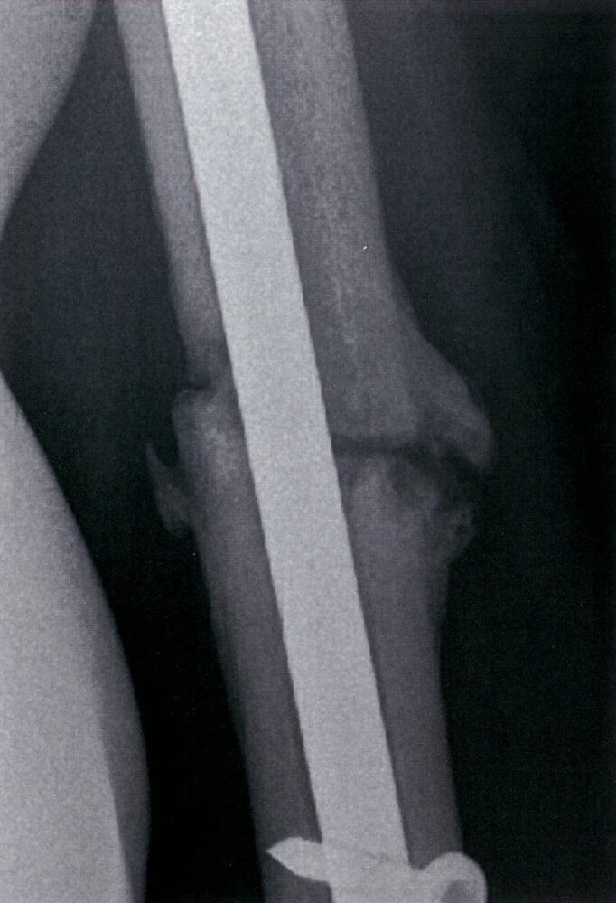

Hypertrophic nonunion of humeral fracture (2/2)

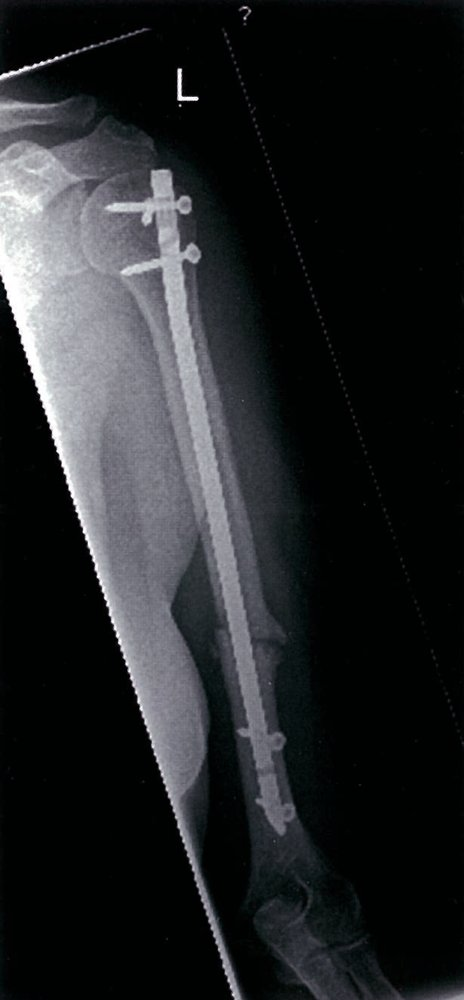

Hypertrophic nonunion of humeral fracture (1/2)

---

## Internal fixation

<u>Internal fixation</u> is a surgical method to fixate <u>fractures</u> and/or <u>dislocations</u> using rods, <u>nails</u>, plates, and/or screws placed inside the body.

### Closed reduction internal fixation

* Definition: a procedure to repair a <u>fracture</u> and/or <u>dislocation</u> with physical manipulation (e.g., via <u>traction</u>) followed by percutaneous fixation with mechanical devices (e.g., <u>Kirschner wires</u>)

* Indications

* <u>Stable fractures</u>

* Preferred treatment for <u>pediatric fractures</u>

### Open reduction internal fixation

* Definition: a surgical procedure to repair a <u>fracture</u> and/or <u>dislocation</u> through operative (open) repositioning (reduction), followed by fixation with rods, <u>nails</u>, plates, and/or screws.

* Indications

* Failed <u>closed reduction</u>

* <u>Multiple trauma</u>

* <u>Open fractures</u>

* <u>Fractures</u> with vascular injuries

* <u>Nonunion</u>

Internal fixation of a vertebral fracture

#### Lag screw fixation

* Definition: the fixation of a <u>fracture</u> using lag screws either on their own or in combination with other devices (e.g., plates)

* Indications: : most types of <u>fractures</u> (e.g., articular <u>fractures</u>, <u>slipped capital femoral epiphysis</u>)

* Principles: fixation and compression of the <u>fracture</u> gap

* Types of hardware involved

* Cortical screws: fixation of the <u>fracture</u> gap

* Cancellous screws: compression and fixation of the <u>fracture</u> gap

Cancellous lag screw osteosynthesis of femoral neck fracture

#### Plate fixation

* Definition: a surgical procedure in which stainless steel or titanium plates are used in combination with screws for the fixation of a <u>fracture</u>

* Indications: <u>comminuted fractures</u> (e.g., unstable articular <u>fractures</u>, <u>osteoporotic</u> <u>fractures</u>)

* Principles: neutralization and stabilization of the malposition for quicker postoperative functional <u>rehabilitation</u>

* Types of hardware involved

* Buttress (antiglide) plates: compensate for shear forces

* Compression plates: compress the <u>fracture</u> gap

* Neutralization plates: neutralize bending, torsional, and shear forces

* <u>Tension-band</u> plates: convert tensile forces into compression forces

* Bridge plates: connect the intact bone ends of <u>comminuted fractures</u> or bony defects, bypassing the intermediate <u>fracture</u> zone

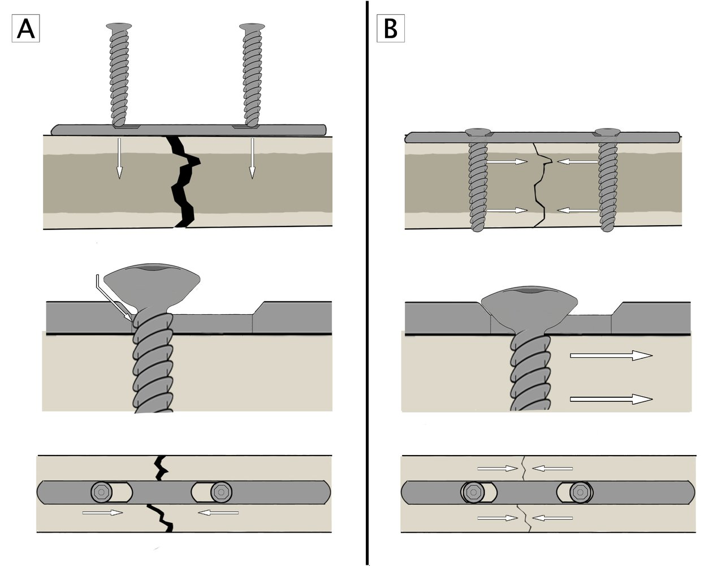

Plate fixation (dynamic compression plate)

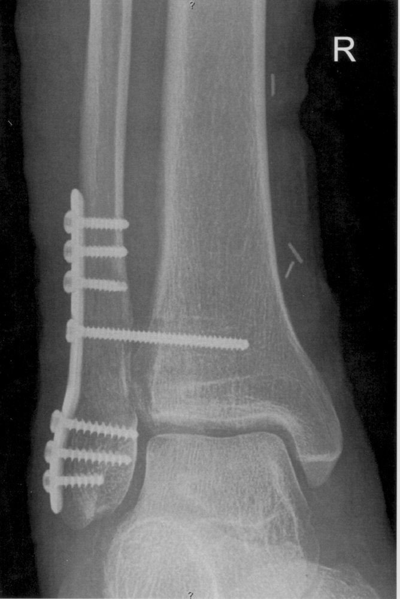

Open reduction-internal fixation of Weber B ankle fracture (1/2)

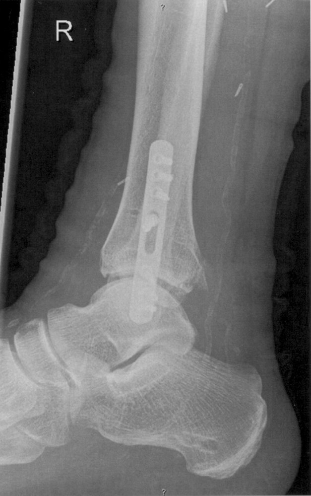

Open reduction-internal fixation of Weber B ankle fracture  (2/2)

#### Dynamic hip screw fixation  [[1]](https://coursology-qbank.com/amboss/article/ZjcZ_X0)

* Definition: a surgical procedure for the fixation of certain types of <u>hip fracture</u> using an orthopedic implant consisting of a sliding lag screw, a stabilizing side plate with a barrel, and cortical screws

* Indications: <u>fractures</u> in the trochanter region

* Principle: When the patient places weight on the affected leg, the sliding lag screw moves through the barrel and enables <u>fracture</u> compression.

* Types of hardware involved

* Sliding lag screw: compression of the <u>fracture</u> gap

* Side plate: stabilization and fixation of the <u>fracture</u> gap

* Cortical screws: fixation of the side plate to the bone

Dynamic hip screw

#### Intramedullary nail fixation

* Definition: a surgical procedure in which a metal rod is inserted into the <u>medullary cavity</u> of a bone to internally fix a <u>fracture</u>

* Indication

* Diaphyseal <u>fractures</u> of the <u>long bones</u> (e.g., tibial shaft, <u>distal</u> <u>femur</u>, <u>humerus</u> shaft)

* Metaphyseal <u>fractures</u>

* Principle

* Stabilization of the bone

* Preservation of bone length

* Limitation of rotation

Intramedullary nail fixation of femoral shaft fracture

Humeral shaft fracture after intramedullary nail fixation

#### Kirschner wire fixation

* Definition: a surgical procedure that uses a wire for the fixation of bone fragments

* Indications

* <u>Fractures</u> of small bones

* Fragment repositioning in multifragmentary <u>fractures</u>

* Epiphyseal and/or metaphyseal <u>fractures</u>

* Provisional fixation

* Support of <u>fractures</u> that have been fixed with screws and/or plates

* Principle: fixation of the <u>fracture</u> without compression

Kirschner wire (K-wire) fixation of distal radius fracture

#### Tension-band wiring

* Definition: a surgical procedure using <u>Kirschner wires</u> and a <u>tension band</u> to internally fixate and compress <u>fractures</u>

* Indications

* Greater tuberosity <u>fractures</u>

* <u>Olecranon fractures</u>

* Greater <u>trochanter fractures</u>

* Patella <u>fractures</u>

* <u>Lateral malleolus</u> <u>fractures</u>

* Principle: intrafragmentary compression of a bending <u>fracture</u>

* Application of two <u>Kirschner wires</u> placed parallel to one another and perpendicular to the <u>fracture</u> line.

* Application of a <u>tension band</u> in a figure-eight loop around <u>Kirschner wires</u>

---

## External fixation

* Definition: a surgical method for the fixation of a <u>fracture</u> using metal devices (e.g., pins, screws, plates) that are secured outside of the <u>skin</u> [[2]](https://coursology-qbank.com/amboss/article/-QcDAX0)

* Indications

* Temporary fixation

* <u>Open fractures</u> with <u>soft tissue</u> loss

* <u>Fractures</u> with significant bone loss

* Comminuted <u>long bone</u> <u>fractures</u>

* <u>Unstable fractures</u> (e.g., extremity <u>fractures</u>, <u>pelvic fractures</u>)

* Principle: fixation and compression of the <u>fracture</u> gap through an externally fixed mechanical device (fixator) rooted in the bone with the screws fixed proximally and distally from the <u>fracture</u>

External fixation of a comminuted fracture of the tibia

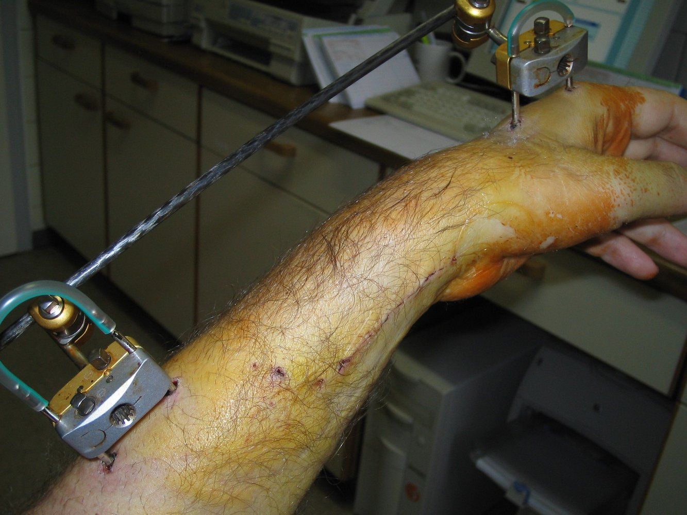

External fixation of comminuted distal radius fracture

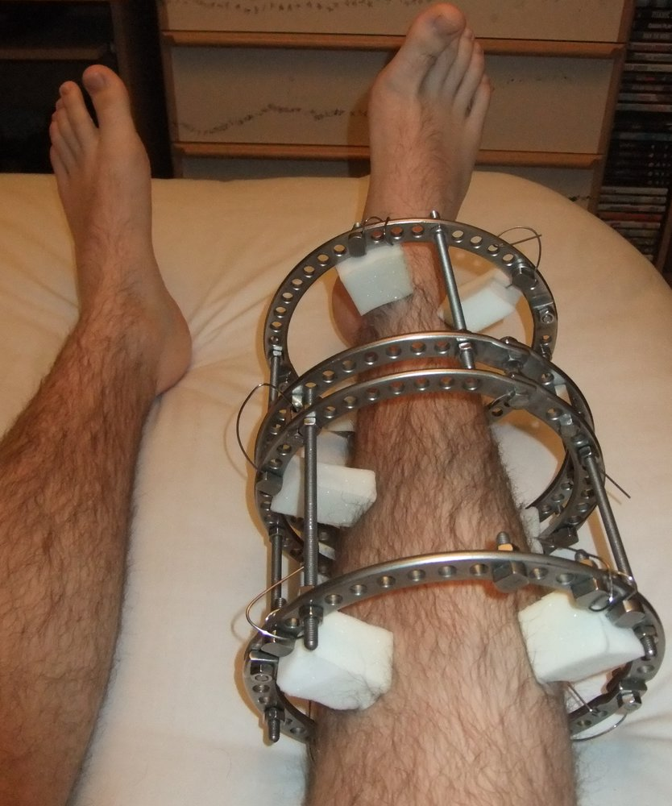

Ring external fixation device (Ilizarov apparatus)

---

## Arthroplasty

### General

* Definition: a surgical procedure to replace and/or remodel a damaged musculoskeletal <u>joint</u> in order to restore <u>joint</u> function

* Indication: : severe <u>joint</u> damage (e.g., trauma, <u>osteoarthritis</u>) most commonly of the knee, hip, and shoulder

* Complications

* <u>Prosthetic joint infection</u>: See “Subtypes and variants” in “<u>Septic arthritis</u>.”

* Prosthetic loosening: the loosening of an <u>endoprosthesis</u>, which can result in diminished or lost <u>joint</u> function [[3]](https://coursology-qbank.com/amboss/article/bjcH_X0)

* Clinical features include:

* Aseptic <u>prosthetic loosening</u> (gradual process): local <u>pain</u>, decreased function

* <u>Septic</u> <u>prosthetic loosening</u> (rapid and acute process): local <u>pain</u>, swelling, redness, <u>pus</u>, loss of function, and possible consequent systemic symptoms (e.g., <u>fever</u>, <u>malaise</u>, fatigue)

* Treatment: prosthetic replacement

* For general complications see “Complications” in “<u>Osteosynthetic procedures</u>” above.

#### Total arthroplasty  [[4]](https://coursology-qbank.com/amboss/article/Yjcn_X0)

<u>Total arthroplasty</u> is a surgical procedure in which a damaged musculoskeletal <u>joint</u> is entirely removed and replaced with an <u>endoprosthesis</u>.

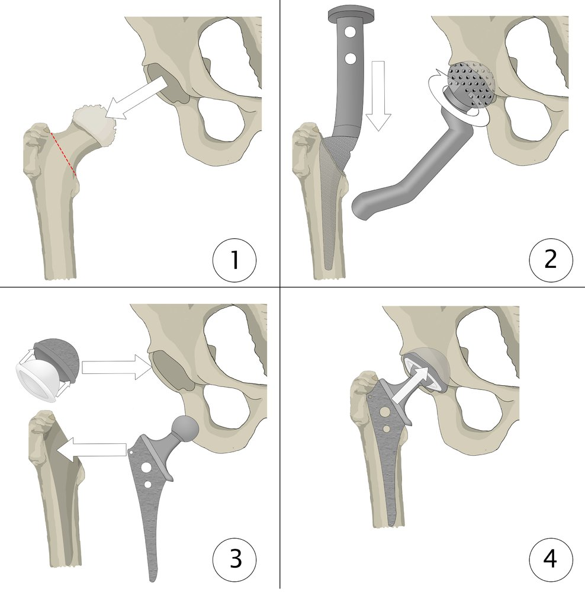

Total hip replacement

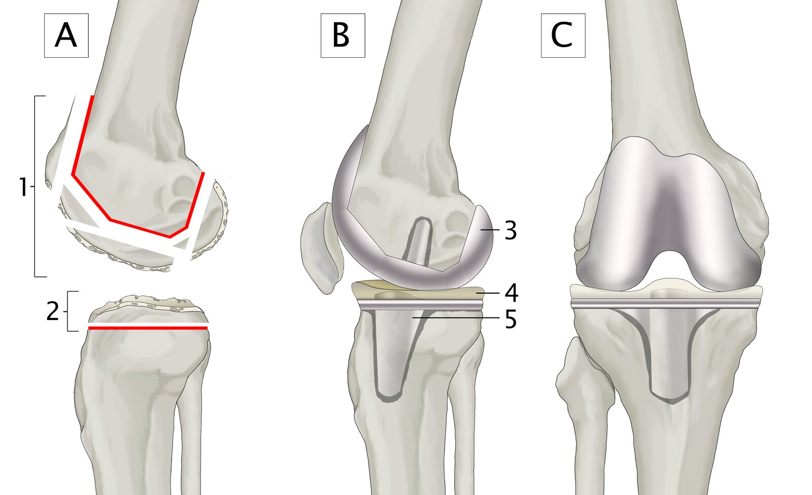

Total knee replacement

#### Hemiarthroplasty  [[4]](https://coursology-qbank.com/amboss/article/Yjcn_X0)

<u>Hemiarthroplasty</u> is a surgical procedure in which the damaged portion of a musculoskeletal <u>joint</u> is removed and replaced with an <u>endoprosthesis</u> (e.g., <u>hip hemiarthroplasty</u>).

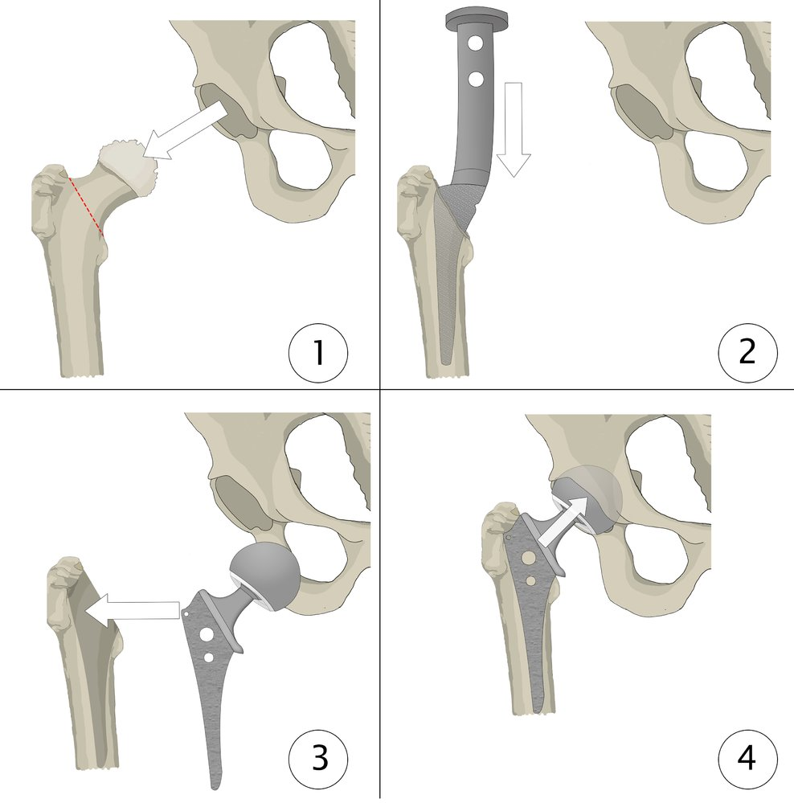

Hip hemiarthroplasty (bipolar prosthesis)

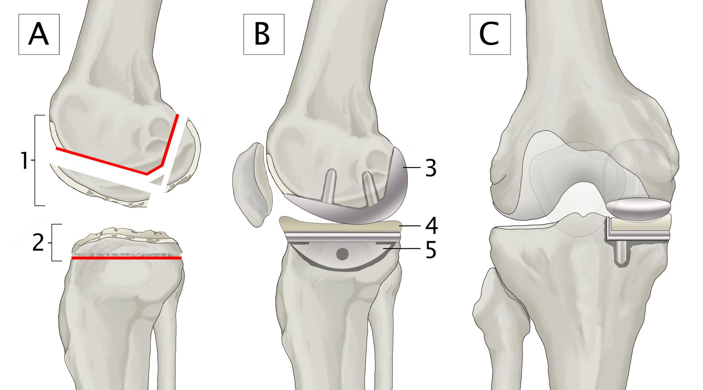

Unicompartmental knee arthroplasty (medial compartment)

### Resection arthroplasty

* Definition: a surgical procedure in which a damaged <u>joint</u> is partially or completed removed to preserve as much function as possible

* Indications

* Unsuccessful <u>arthroplasty</u>

* Destruction of the <u>joint</u> (e.g., due to trauma, inflammation)

### Complications after osteosynthesis/arthroplasty [[5]](https://coursology-qbank.com/amboss/article/QM1uoh0)[[6]](https://coursology-qbank.com/amboss/article/BQ1zyg0)

* Early <u>postoperative complications</u>

* Infection

* Injury to surrounding structures (<u>tendons</u>, nerves, vessels)

* <u>Venous thromboembolism</u>

* Hemorrhage

* <u>Compartment syndrome</u>

* Late <u>postoperative complications</u>

* Posttraumatic <u>osteoarthritis</u>

* Malalignment/dysfunction

* <u>Nonunion</u>

* Material <u>fracture</u>, <u>periprosthetic fracture</u>

* Loosening of prostheses

* Persistent <u>pain</u>

* <u>Joint</u> stiffness

---

## Osteotomy

### Corrective osteotomy

* Definition: a surgical procedure to correct bone misalignment by transecting the bone and realigning and fixing it in a normal position

* Indications: posttraumatic malunions, congenital or acquired valgus and <u>varus deformities</u> with the risk of <u>osteoarthritis</u> (e.g., severe <u>hallux valgus</u> or <u>genu varum</u>)

### Hip osteotomy

* Definition: a surgical procedure to improve <u>hip joint</u> coverage that involves cutting the <u>femur</u> and/or <u>pelvis</u> and repositioning the <u>acetabulum</u> and/or <u>femur</u>

* Indications: <u>hip dysplasia</u>, <u>Legg-Calvé-Perthes disease</u>

* Types

* Children aged 2–10 years: Salter osteotomy (complete transection and repositioning of the iliac bone for better coverage of the femoral head)

* Children aged < 10 years: triple <u>innominate</u> <u>osteotomy</u> (repositioning the <u>acetabulum</u> by cutting through the <u>ilium</u>, <u>ischium</u>, and <u>pubis</u> without disrupting the triradiate <u>cartilage</u>)

* Adults: periacetabular <u>osteotomy</u> (repositioning the <u>acetabulum</u> by cutting through the <u>ilium</u>, <u>ischium</u>, and <u>pubis</u>)

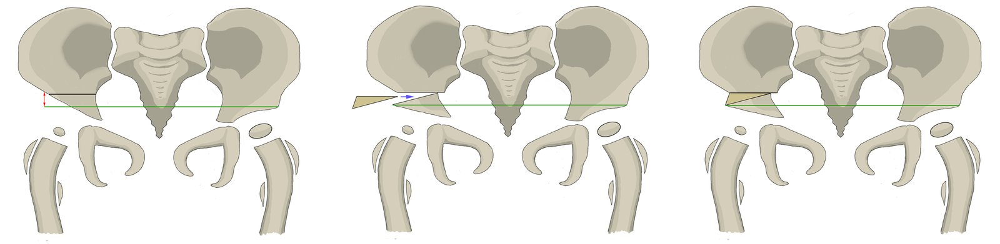

Salter osteotomy

---