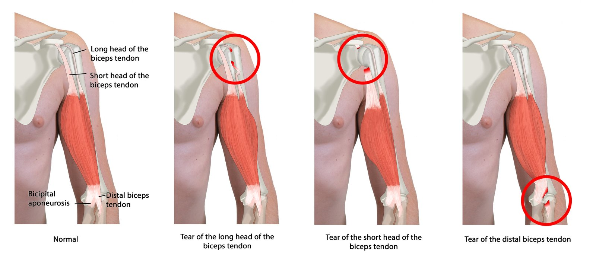
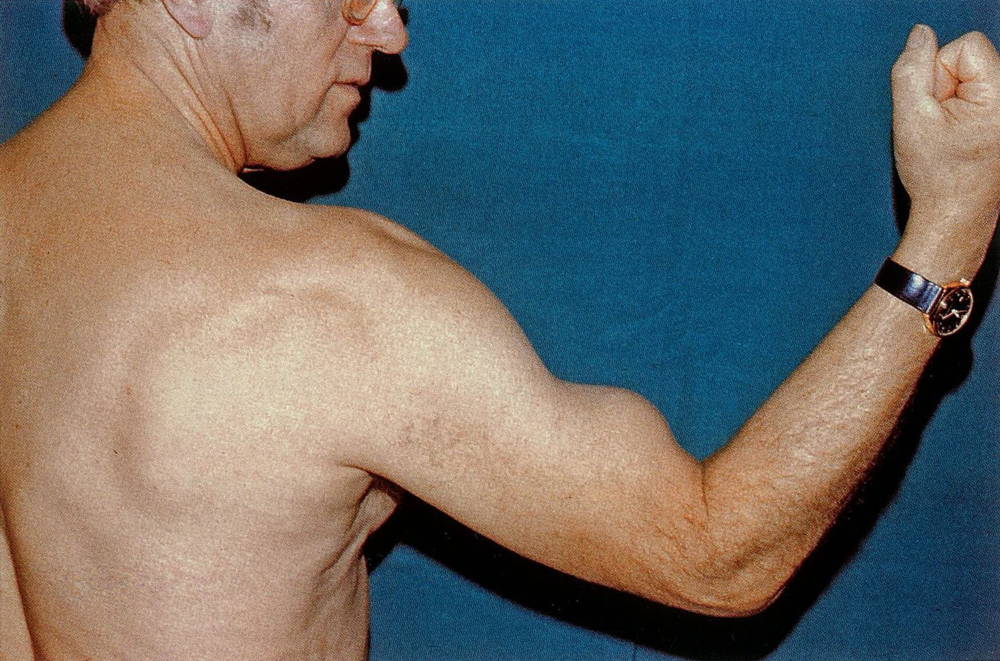
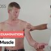

# Biceps tendinopathy and biceps tendon rupture

*Categories: Clinical knowledge > Surgery > Trauma and orthopedic surgery > Upper extremity > Biceps tendinopathy and biceps tendon rupture*

[Original Article Link](https://coursology-qbank.com/amboss/article/gQ0Fvf)

---

## Summary

<u>Biceps tendinopathy</u> and <u>biceps</u> <u>tendon</u> rupture encompass a spectrum of disorders most commonly affecting the <u>proximal</u> <u>long head of the biceps tendon</u> (LHBT) at its origin on the glenoid. <u>Biceps tendinopathy</u> ranges from acute overuse injuries to degenerative changes. Early identification and effective treatment of <u>biceps tendinopathy</u> can prevent progression to <u>proximal</u> <u>biceps</u> rupture.

<u>Biceps</u> <u>tendon</u> rupture is the complete or partial severing of the <u>tendon</u> from the bone. Rupture is typically a result of chronic degenerative changes and may be precipitated by minor trauma. <u>Proximal</u> <u>biceps</u> <u>tendon</u> rupture is painful and usually does not cause significant loss of function. By contrast, a tear involving the <u>distal</u> insertion of the <u>biceps</u> is most often the result of trauma due to overloading, is acutely painful, and results in <u>weakness</u> in the <u>elbow joint</u>. Diagnosis of <u>biceps</u> <u>tendon</u> rupture is often clinical and may be supported by <u>ultrasound</u> and/or <u>MRI</u>. Tendinopathy or rupture involving the LHBT may be <u>managed conservatively</u> with rest and <u>analgesics</u>, with surgical management reserved for patients with refractory <u>pain</u> and/or higher physical demands. <u>Distal</u> <u>biceps</u> rupture requires surgical repair to restore functionality.

---

## Definitions

Biceps tendinopathy and <u>biceps</u> <u>tendon</u> rupture represent a spectrum of conditions sharing overlapping etiologies, manifestations, and management strategies.

* <u>Biceps tendinopathy</u>: <u>tendinitis</u>;  (inflammation) or <u>tendinosis</u>;  (degenerative process) of the <u>biceps</u> <u>tendon</u>, caused by chronic <u>stress</u> or repetitive microtrauma and most commonly affecting the LHBT at its origin from the glenoid [[1]](https://coursology-qbank.com/amboss/article/MhYMeK)[[2]](https://coursology-qbank.com/amboss/article/AN1Rdh0)

* <u>Proximal</u> <u>tendon</u> rupture: : a partial or complete tear of the LHBT, typically resulting from minor trauma in a <u>tendon</u> weakened by tendinopathy or acute trauma in a healthy <u>tendon</u> [[3]](https://coursology-qbank.com/amboss/article/xLdE-q0)

* <u>Distal</u> <u>tendon</u> rupture: : a partial or complete tear of the <u>biceps</u> <u>tendon</u> at its insertion on the <u>radial tuberosity</u>, usually caused by acute trauma involving eccentric loading (e.g., heavy lifting, <u>sports injuries</u>, or falls) [[4]](https://coursology-qbank.com/amboss/article/ELd8zq0)

---

## Etiology

Etiology is often multifactorial, and patients may have multiple <u>risk factors</u>.

* Tendinopathy

* Repetitive <u>overhead</u> motions [[2]](https://coursology-qbank.com/amboss/article/AN1Rdh0)

* Postural or biomechanical issues that contribute to excessive <u>stress</u> on <u>tendon</u> [[3]](https://coursology-qbank.com/amboss/article/xLdE-q0)

* <u>Statins</u> [[5]](https://coursology-qbank.com/amboss/article/WodPaI0)

* Rupture [[2]](https://coursology-qbank.com/amboss/article/AN1Rdh0)[[3]](https://coursology-qbank.com/amboss/article/xLdE-q0)[[4]](https://coursology-qbank.com/amboss/article/ELd8zq0)

* Acute, high-impact trauma in healthy <u>tendons</u> (e.g., heavy lifting, <u>fall on outstretched hand</u>)

* Minor trauma in bicep <u>tendon</u> weakened by tendinopathy

* Medications: <u>fluoroquinolones</u>, <u>corticosteroids</u> [[2]](https://coursology-qbank.com/amboss/article/AN1Rdh0)

* Tobacco use

* Shared <u>risk factors</u> [[1]](https://coursology-qbank.com/amboss/article/MhYMeK)

* Microtrauma caused by repetitive <u>overhead</u> movement (e.g., sports, manual <u>labor</u>)  [[2]](https://coursology-qbank.com/amboss/article/AN1Rdh0)

* Age-related degeneration [[1]](https://coursology-qbank.com/amboss/article/MhYMeK)

* Pre-existing shoulder pathology;  (e.g., <u>subacromial impingement</u>, <u>rotator cuff disease</u>, <u>rheumatoid arthritis</u>). [[1]](https://coursology-qbank.com/amboss/article/MhYMeK)[[6]](https://coursology-qbank.com/amboss/article/9LdN-q0)

* Acute injury [[4]](https://coursology-qbank.com/amboss/article/ELd8zq0)

* Poor <u>conditioning</u> [[1]](https://coursology-qbank.com/amboss/article/MhYMeK)

---

## Pathophysiology

### Tendinopathy

* Gradual development due to chronic <u>stress</u> or repeated microtrauma [[2]](https://coursology-qbank.com/amboss/article/AN1Rdh0)

* Overuse → microtears in <u>collagen fibers</u> → <u>tendon</u> thickening → <u>tendinosis</u> [[7]](https://coursology-qbank.com/amboss/article/jqd_yI0)

* Altered biomechanics of the LHBT increase susceptibility to injury. [[4]](https://coursology-qbank.com/amboss/article/ELd8zq0)

### <u>Tendon</u> rupture [[3]](https://coursology-qbank.com/amboss/article/xLdE-q0)[[4]](https://coursology-qbank.com/amboss/article/ELd8zq0)

* Typically caused by trauma

* Degenerated or weakened <u>tendon</u> → partial or complete tear with minor trauma (e.g., forced <u>flexion</u> or <u>supination</u>)

* Acute trauma causes mechanical failure in a healthy <u>tendon</u> if force exceeds tensile strength.

---

## Classification

<u>Biceps</u> <u>tendon</u> rupture can be classified by location and/or by extent.

* By location

* <u>Proximal</u> <u>biceps</u> <u>tendon</u> rupture

* At the origin of the LHBT (most common)

* At the origin of the short head of the <u>biceps</u> (very rare)

* <u>Distal</u> <u>biceps</u> <u>tendon</u> rupture: at the insertion of the <u>biceps</u> <u>tendon</u> (rare)

* By extent

* Partial rupture

* Complete rupture

Types of biceps tendon rupture

---

## Clinical features

Common symptoms include <u>pain</u> and tenderness in the shoulder or <u>elbow</u> during activity or <u>weight-bearing</u>. [[6]](https://coursology-qbank.com/amboss/article/9LdN-q0)

### <u>Biceps tendinopathy</u> [[6]](https://coursology-qbank.com/amboss/article/9LdN-q0)

* Point tenderness at the <u>bicipital groove</u> when the arm is 10° <u>internally rotated</u>

* Gradual onset of <u>anterior</u> shoulder <u>pain</u> that worsens with lifting or <u>overhead</u> reaching

### <u>Biceps</u> <u>tendon</u> rupture

#### <u>Proximal</u> <u>biceps</u> <u>tendon</u> rupture [[2]](https://coursology-qbank.com/amboss/article/AN1Rdh0)[[4]](https://coursology-qbank.com/amboss/article/ELd8zq0)

* Popping sound [[2]](https://coursology-qbank.com/amboss/article/AN1Rdh0)

* Tenderness in the <u>intertubercular sulcus</u>

* No significant loss of function  [[2]](https://coursology-qbank.com/amboss/article/AN1Rdh0)

* Popeye sign: <u>distal</u> displacement of the <u>biceps</u> belly upon contraction   [[4]](https://coursology-qbank.com/amboss/article/ELd8zq0)

Popeye sign

#### <u>Distal</u> <u>biceps</u> <u>tendon</u> rupture [[4]](https://coursology-qbank.com/amboss/article/ELd8zq0)[[6]](https://coursology-qbank.com/amboss/article/9LdN-q0)

* Acute, stabbing <u>pain</u> [[4]](https://coursology-qbank.com/amboss/article/ELd8zq0)

* Popping sound  [[4]](https://coursology-qbank.com/amboss/article/ELd8zq0)

* <u>Hematoma</u> in the <u>medial</u> region of the <u>cubital fossa</u> [[6]](https://coursology-qbank.com/amboss/article/9LdN-q0)

* Limitation of <u>flexion</u> and partial or complete limitation of <u>supination</u> at the <u>elbow joint</u> [[6]](https://coursology-qbank.com/amboss/article/9LdN-q0)

* Swelling in the upper arm region created by the recoiled, shortened <u>biceps</u> muscle [[6]](https://coursology-qbank.com/amboss/article/9LdN-q0)

* <u>Proximal</u> displacement of the <u>biceps</u> belly upon contraction

---

## Diagnosis

### General principles [[4]](https://coursology-qbank.com/amboss/article/ELd8zq0)[[6]](https://coursology-qbank.com/amboss/article/9LdN-q0)[[8]](https://coursology-qbank.com/amboss/article/rlWfyl0)

* Diagnosis is primarily clinical.

* Imaging may support the diagnosis and determine the extent and location of the rupture.

* Acute injury (e.g., traumatic rupture)

* Obtain initial <u>x-ray</u> shoulder and/or <u>elbow</u> to evaluate for osseous injury.

* Consider <u>ultrasound</u> for confirmation of <u>tendon</u> rupture, subluxation, or <u>dislocation</u>.

* Chronic injury or unclear diagnosis: Consult a specialist to guide further workup (e.g., <u>MRI</u>).

### <u>Clinical examination</u>

* <u>Proximal</u> <u>biceps tendinopathy</u> [[3]](https://coursology-qbank.com/amboss/article/xLdE-q0)[[6]](https://coursology-qbank.com/amboss/article/9LdN-q0)

* <u>Pain</u> with palpation over the <u>bicipital groove</u> [[3]](https://coursology-qbank.com/amboss/article/xLdE-q0)[[6]](https://coursology-qbank.com/amboss/article/9LdN-q0)

* <u>Weakness</u> and/or <u>pain</u> on provocation tests, e.g., <u>Yergason test</u>, <u>Speed test</u> (see “<u>Examination of the LHBT</u>”)  [[6]](https://coursology-qbank.com/amboss/article/9LdN-q0)

* <u>Proximal</u> <u>biceps</u> <u>tendon</u> rupture: <u>Ludington sign</u> [[2]](https://coursology-qbank.com/amboss/article/AN1Rdh0)

* The patient places both arms behind the head and contracts the <u>biceps</u> muscles.

* In the affected arm, the muscle belly of the <u>biceps</u> moves distally.

* <u>Distal</u> <u>biceps</u> <u>tendon</u> rupture

* Hook test [[4]](https://coursology-qbank.com/amboss/article/ELd8zq0)

* The patient actively flexes the <u>elbow</u> at 90° and fully <u>supinates</u> the forearm.

* The clinician places their index finger under the <u>lateral</u> edge of the <u>biceps</u> <u>tendon</u> in the <u>cubital fossa</u>.

* The clinician attempts to “hook” the <u>tendon</u> (pull it upward) with the index finger.

* In an intact or partially torn <u>biceps</u> <u>tendon</u>, the clinician feels resistance; a ruptured <u>tendon</u> allows unrestricted movement.

* Biceps squeeze test: The clinician squeezes the <u>biceps</u> with the <u>elbow</u> flexed at 60–80° and the forearm <u>pronated</u>; lack of forearm <u>supination</u> indicates <u>distal</u> <u>biceps</u> <u>tendon</u> rupture. [[9]](https://coursology-qbank.com/amboss/article/yLddZI0)

Inspection and Palpation of the Biceps Muscle - Clinical Examination

### Imaging

#### <u>X-ray</u> [[4]](https://coursology-qbank.com/amboss/article/ELd8zq0)[[6]](https://coursology-qbank.com/amboss/article/9LdN-q0)

* Indication: acute upper extremity injury

* Limitation: suboptimal <u>soft tissue</u> evaluation

* Views [[2]](https://coursology-qbank.com/amboss/article/AN1Rdh0)

* Shoulder: anteroposterior, trans-scapular <u>lateral</u> (<u>Y view</u>), axillary <u>lateral</u>

* <u>Elbow</u>: anteroposterior, <u>lateral</u>; oblique view as needed

* Findings

* Often normal   [[3]](https://coursology-qbank.com/amboss/article/xLdE-q0)[[4]](https://coursology-qbank.com/amboss/article/ELd8zq0)[[6]](https://coursology-qbank.com/amboss/article/9LdN-q0)

* <u>Distal</u> <u>biceps</u> <u>tendon</u> rupture: Avulsion of the <u>radial tuberosity</u> may be visible. [[4]](https://coursology-qbank.com/amboss/article/ELd8zq0)

#### <u>Ultrasound</u> [[4]](https://coursology-qbank.com/amboss/article/ELd8zq0)[[6]](https://coursology-qbank.com/amboss/article/9LdN-q0)[[8]](https://coursology-qbank.com/amboss/article/rlWfyl0)

* Indication: suspected <u>biceps</u> <u>tendon</u> pathology

* Limitation: lower <u>sensitivity</u> for partial ruptures or tendinopathy

* Findings

* Tendinopathy

* <u>Tenosynovitis</u>

* Partial and/or complete rupture

* <u>Tendon</u> subluxation and <u>dislocation</u>

#### <u>MRI</u> [[4]](https://coursology-qbank.com/amboss/article/ELd8zq0)[[6]](https://coursology-qbank.com/amboss/article/9LdN-q0)[[8]](https://coursology-qbank.com/amboss/article/rlWfyl0)

* Indications: inconclusive inital imaging findings, chronic injury, and/or unclear diagnosis

* Limitation: increased cost and time requirement

* Findings:

* Tendinopathy

* Ruptures

* May distinguish between complete and partial ruptures

* Rupture location and amount of <u>retraction</u>

* Comorbid shoulder pathologies (e.g., <u>rotator cuff tears</u>, <u>SLAP lesions</u>)

> [!TIP]
> <u>MR arthrography</u> has better <u>accuracy</u> than standard <u>MRI</u> in diagnosing pathologies of the LHBT. [[4]](https://coursology-qbank.com/amboss/article/ELd8zq0)[[6]](https://coursology-qbank.com/amboss/article/9LdN-q0)

---

## Treatment

### Approach

Treatment is based on the nature and location of injury.

* <u>Biceps tendinopathy</u> [[3]](https://coursology-qbank.com/amboss/article/xLdE-q0)[[6]](https://coursology-qbank.com/amboss/article/9LdN-q0)[[8]](https://coursology-qbank.com/amboss/article/rlWfyl0)

* Often improves with <u>conservative management</u>

* Refractory <u>pain</u>: Consider <u>steroid</u> injections and/or surgical referral.

* <u>Proximal</u> <u>biceps</u> <u>tendon</u> rupture [[3]](https://coursology-qbank.com/amboss/article/xLdE-q0)[[4]](https://coursology-qbank.com/amboss/article/ELd8zq0)[[6]](https://coursology-qbank.com/amboss/article/9LdN-q0)

* Initiate <u>conservative management</u>.

* Refer the patient to orthopedics or sports medicine for further evaluation and potential surgical management.

* <u>Distal</u> <u>biceps</u> <u>tendon</u> rupture [[4]](https://coursology-qbank.com/amboss/article/ELd8zq0)[[6]](https://coursology-qbank.com/amboss/article/9LdN-q0)

* Refer the patient to orthopedics for surgical management.

* Consider nonsurgical management for sedentary patients who can tolerate loss of function or those with significant comorbidities.

### <u>Conservative management</u> [[3]](https://coursology-qbank.com/amboss/article/xLdE-q0)[[4]](https://coursology-qbank.com/amboss/article/ELd8zq0)[[6]](https://coursology-qbank.com/amboss/article/9LdN-q0)

* <u>Analgesia</u> (<u>NSAIDs</u>, ice packs)

* <u>Immobilization</u> with <u>arm sling</u>

* Activity modification and <u>physical therapy</u>

### Surgical management

* <u>Proximal</u> <u>biceps</u> pathology

* <u>Biceps</u> <u>tenotomy</u>: release of the <u>long head of the biceps tendon</u> from the <u>glenoid labrum</u>  [[3]](https://coursology-qbank.com/amboss/article/xLdE-q0)

* <u>Biceps</u> <u>tenodesis</u>: reattachment of the long head of <u>biceps</u> <u>tendon</u> to either <u>soft tissue</u> or the <u>proximal</u> <u>humerus</u> to prevent <u>retraction</u> [[4]](https://coursology-qbank.com/amboss/article/ELd8zq0)

* <u>Distal</u> <u>biceps</u> rupture: anatomic repair [[4]](https://coursology-qbank.com/amboss/article/ELd8zq0)

> [!WARNING]
> Arrange orthopedic follow-up for surgical repair as soon as possible after <u>distal</u> <u>biceps</u> <u>tendon</u> rupture; delays can lead to <u>fibrosis</u> and muscle shortening, which hinder reattachment. [[4]](https://coursology-qbank.com/amboss/article/ELd8zq0)[[6]](https://coursology-qbank.com/amboss/article/9LdN-q0)

---