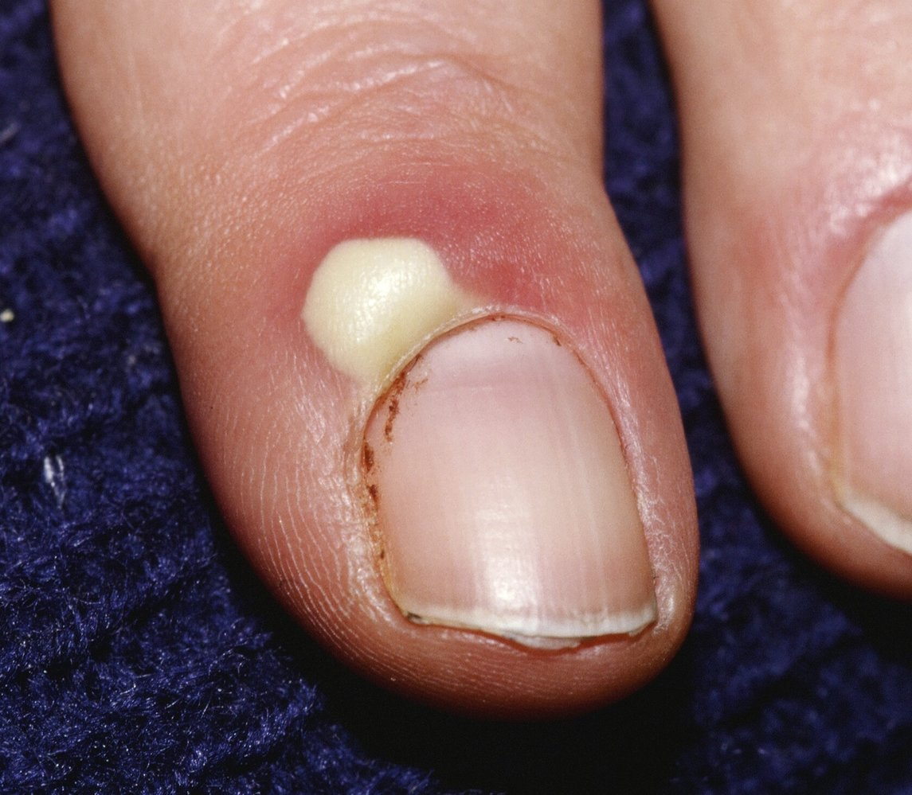
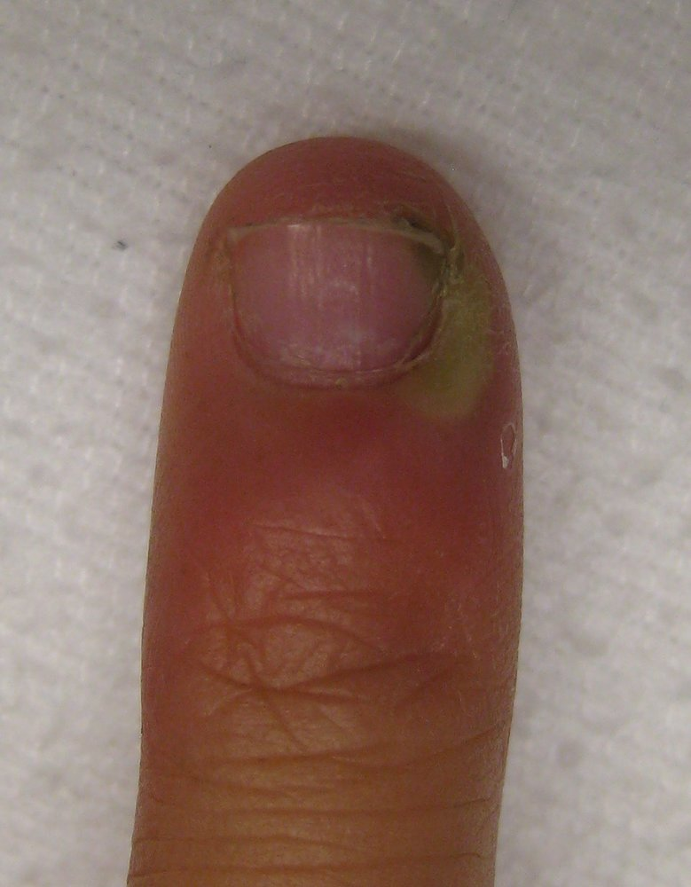
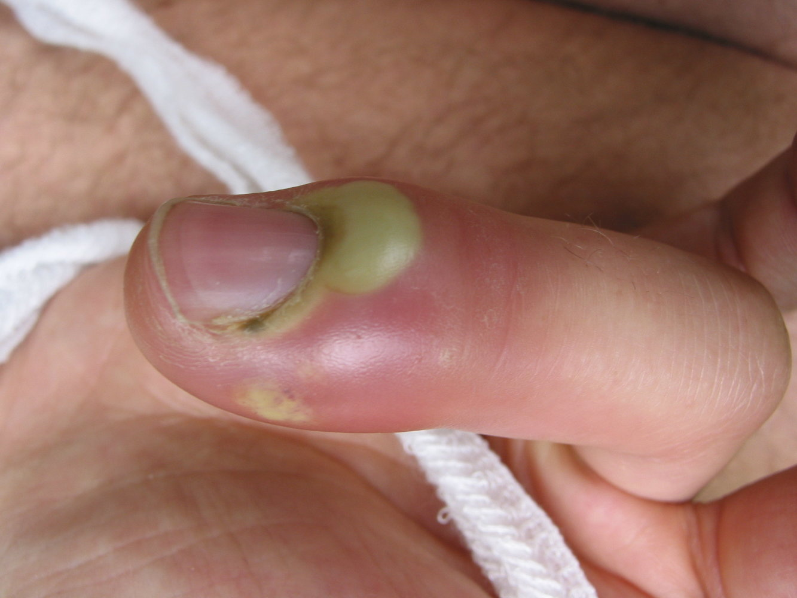
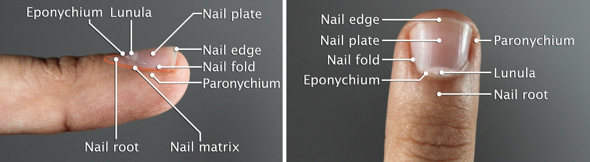
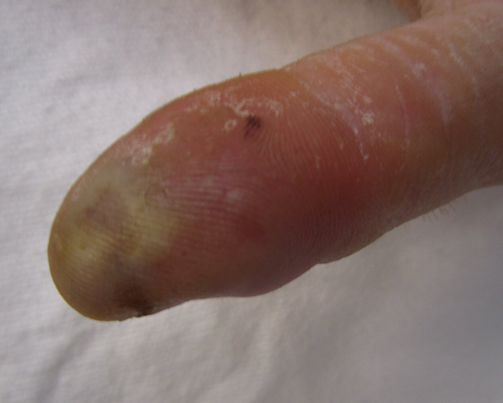
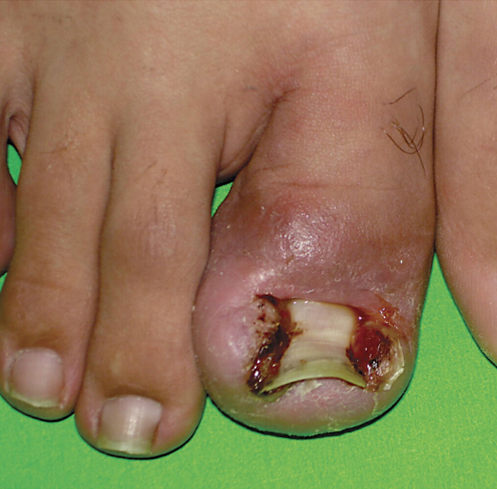

# Finger and toe infections

*Categories: Clinical knowledge > Surgery > Trauma and orthopedic surgery > Upper extremity > Finger and toe infections*

[Original Article Link](https://coursology-qbank.com/amboss/article/rh0f2f)

---

## Summary

Digital infections (i.e., finger infections and toe infections) are common and have a variety of causes. <u>Paronychia</u> is acute or <u>chronic inflammation</u> of the <u>nail</u> folds. In the early stages of disease, <u>acute paronychia</u> is typically treated with topical <u>antibiotics</u>; if an <u>abscess</u> forms, <u>incision and drainage</u> is required. <u>Chronic paronychia</u> is treated with <u>topical steroids</u> and patients are advised to avoid <u>skin</u> irritants. Felons, which are subcutaneous infections of the finger pulp, are <u>managed conservatively</u> with oral <u>antibiotics</u> in the early stages; in the later stages, characterized by <u>abscess</u> formation, <u>incision and drainage</u> is required. <u>Blistering distal dactylitis</u> is a localized <u>superficial</u> bacterial infection of the fingers and is treated with <u>incision and drainage</u> and <u>antibiotics</u>. An <u>ingrown toenail</u> is the abnormal growth of the <u>nail plate</u> into the <u>lateral</u> <u>periungual</u> <u>skin</u> of the <u>nail fold</u>. Placement of cushioning material under the ingrown <u>nail plate</u> may help in the early stages but partial <u>nail</u> avulsion or complete <u>nail</u> excision may become necessary.

See “<u>Tenosynovitis</u>” for infection of the <u>tendon sheath</u> and “<u>Human bites</u>” for <u>clenched-fist bite injury</u>, and “<u>Herpetic whitlow</u>” for infection of the <u>distal</u> finger.

---

## Paronychia

### Acute paronychia [[1]](https://coursology-qbank.com/amboss/article/3wYSir)[[2]](https://coursology-qbank.com/amboss/article/KqcUzW0)[[3]](https://coursology-qbank.com/amboss/article/2JWTtm0)

* Definition: inflammation of the <u>proximal</u> and/or <u>lateral</u> <u>nail</u> folds of the fingers or toes for < 6 weeks

* <u>Epidemiology</u> [[2]](https://coursology-qbank.com/amboss/article/KqcUzW0)

* Most common hand infection in the US

* <u>♀</u> > <u>♂</u> (3:1)

* Etiology: : most commonly caused by a bacterial infection (e.g., with <u>Staphylococcus aureus</u>)

* Pathophysiology: trauma to the <u>nail</u> folds (e.g., due to manual work, <u>nail</u> biting, a manicure) → disruption of the barrier between the <u>nail plate</u> and the <u>nail fold</u> → increased susceptibility to bacterial infection

* Clinical features

* Usually involves only one digit

* <u>Signs of acute inflammation</u> (e.g., redness, warmth)

* <u>Skin abscess</u> may be present

* Absence of <u>nail</u> changes

* Diagnostics [[2]](https://coursology-qbank.com/amboss/article/KqcUzW0)

* <u>Clinical diagnosis</u>

* If an <u>abscess</u> is suspected: <u>soft tissue</u> <u>ultrasound</u>, <u>digital pressure test</u>

* Treatment [[3]](https://coursology-qbank.com/amboss/article/2JWTtm0)[[4]](https://coursology-qbank.com/amboss/article/AN1Rdh0)[[5]](https://coursology-qbank.com/amboss/article/-qcDad0)[[6]](https://coursology-qbank.com/amboss/article/hEWcvM0)

* Mild <u>erythema</u> without <u>abscess</u>

* Warm water soaks for 15 minutes 2–4 times per day  [[4]](https://coursology-qbank.com/amboss/article/AN1Rdh0)

* Topical <u>antibiotics</u>, e.g., <u>mupirocin</u> (<u>off-label</u>) DOSAGE for 7–10 days [[4]](https://coursology-qbank.com/amboss/article/AN1Rdh0)[[7]](https://coursology-qbank.com/amboss/article/_IW5250)

* Consider adding <u>topical steroids</u> for symptom relief. [[8]](https://coursology-qbank.com/amboss/article/frWkg50)

* <u>Abscess</u> present

* Perform <u>acute paronychia incision and drainage</u>.

* Post-procedure

* <u>Antibiotics</u> are only required in patients with <u>cellulitis</u>, severe illness, and/or <u>immunocompromise</u>. [[5]](https://coursology-qbank.com/amboss/article/-qcDad0)[[9]](https://coursology-qbank.com/amboss/article/2rWTg50)

* Perform warm water soaks for 2–3 days.

* Overt <u>cellulitis</u> or persistent lesion

* Initiate oral <u>antibiotics</u>, e.g., <u>cephalexin</u> DOSAGE or <u>TMP/SMX</u> (<u>off-label</u>). DOSAGE  [[2]](https://coursology-qbank.com/amboss/article/KqcUzW0)[[5]](https://coursology-qbank.com/amboss/article/-qcDad0)[[10]](https://coursology-qbank.com/amboss/article/Om0Ifg)

* If oral pathogens are suspected, options include <u>amoxicillin/clavulanate</u> DOSAGE and <u>clindamycin</u>. DOSAGE  [[2]](https://coursology-qbank.com/amboss/article/KqcUzW0)[[5]](https://coursology-qbank.com/amboss/article/-qcDad0)[[10]](https://coursology-qbank.com/amboss/article/Om0Ifg)

* See “<u>Antibiotic therapy for soft tissue infections</u>” for severity grading and further options.

* <u>Tetanus-prone wounds</u>: Administer <u>tetanus prophylaxis</u>.

* Complications

* <u>Felon</u>

* <u>Osteomyelitis</u>

* <u>Chronic paronychia</u>

Paronychia

Paronychia

Paronychia

#### Acute paronychia incision and drainage [[1]](https://coursology-qbank.com/amboss/article/3wYSir)

1. * Obtain <u>informed consent</u>.
2. * Soak the digit to soften the <u>eponychium</u>.
3. * Perform a <u>digital block</u> as required; see “Procedure” in “<u>Peripheral nerve block</u>.”
4. * Using a sharp instrument (e.g., No. 11 blade scalpel, needle tip), lift the <u>eponychium</u> away from the <u>nail</u> matrix.
5. * Keep the instrument parallel to the <u>nail</u> and continue to lift the <u>eponychium</u> around the border of the <u>paronychia</u> until all of the <u>pus</u> has been released.
6. * Apply <u>antibiotic</u> ointment and an absorbent dressing.

Anatomical structure of the nail

### Chronic paronychia [[2]](https://coursology-qbank.com/amboss/article/KqcUzW0)

* Definition: inflammation of the <u>proximal</u> and/or <u>lateral</u> <u>nail</u> folds of the fingers or toes for > 6 weeks

* <u>Epidemiology</u>: common in occupations with repeated exposure to moisture and/or <u>skin</u> irritants (e.g., bartenders, dish cleaners) [[11]](https://coursology-qbank.com/amboss/article/CZaqdQ)

* Etiology

* Most commonly caused by chronic exposure to <u>skin</u> irritants (e.g., household chemicals)

* Rarely caused by infections

* Pathophysiology: : disruption of the barrier between the <u>nail plate</u> and the <u>nail fold</u> (e.g., due to trauma, <u>skin</u> irritants) → persistent exposure of the <u>nail fold</u> to <u>skin</u> irritants → <u>eczematous</u> inflammatory reaction

* Clinical features

* Usually involves more than one digit

* <u>Dystrophic</u> <u>nails</u> (e.g., thickened, discolored)

* <u>Retraction</u> of the <u>proximal</u> <u>nail fold</u> and loss of the cuticle

* <u>Signs of acute inflammation</u> (e.g., redness, warmth)

* <u>Abscess</u> (rare)

* Diagnostics: <u>clinical diagnosis</u> based on symptoms and exposure history [[2]](https://coursology-qbank.com/amboss/article/KqcUzW0)

* Treatment [[2]](https://coursology-qbank.com/amboss/article/KqcUzW0)[[4]](https://coursology-qbank.com/amboss/article/AN1Rdh0)[[12]](https://coursology-qbank.com/amboss/article/irWJS50)

* Avoid <u>skin</u> irritants and keep the area dry.

* Apply a topical antiinflammatory agent, e.g.:

* <u>Triamcinolone</u> DOSAGE [[4]](https://coursology-qbank.com/amboss/article/AN1Rdh0)

* <u>Tacrolimus</u> (<u>off-label</u>) DOSAGE [[12]](https://coursology-qbank.com/amboss/article/irWJS50)

* Refer patients with refractory <u>chronic paronychias</u> to hand <u>surgery</u>.

* Complications

* <u>Nail</u> <u>dystrophy</u>

* <u>Nail</u> loss

* <u>Acute paronychia</u>

> [!WARNING]
> <u>Chronic paronychia</u> affecting a single digit should raise concern for <u>malignancy</u> (e.g., <u>squamous cell carcinoma</u>). [[2]](https://coursology-qbank.com/amboss/article/KqcUzW0)

---

## Felon

* Definition: subcutaneous infection of the <u>distal</u> digital pulp

* Etiology

* Trauma with secondary infection

* Progression of untreated <u>paronychia</u>

* Most common <u>pathogen</u>: <u>Staphylococcus aureus</u>

* Pathophysiology: fingertip puncture wound → bacterial <u>inoculation</u> → closed-space infection of the digital pulp → <u>ischemic necrosis</u>

* Clinical features 

* Commonly affects the thumb or index finger

* <u>Signs of acute inflammation</u> (e.g., warmth, redness)

* Tense swelling confined to the digital pulp

* Progressive, severe throbbing <u>pain</u> exacerbated by the <u>dependent position</u>

* <u>Fluctuance</u> and spontaneous drainage

* Diagnostics [[4]](https://coursology-qbank.com/amboss/article/AN1Rdh0)[[5]](https://coursology-qbank.com/amboss/article/-qcDad0)[[13]](https://coursology-qbank.com/amboss/article/YvWnAM0)

* <u>Clinical diagnosis</u>

* <u>Soft tissue</u> <u>ultrasound</u> if an <u>abscess</u> is suspected

* Consider <u>x-rays</u> to evaluate for <u>retained foreign bodies</u>.  [[1]](https://coursology-qbank.com/amboss/article/3wYSir)

* <u>Bacterial culture</u> of drained fluid or <u>pus</u> if <u>felon incision and drainage</u> is performed [[1]](https://coursology-qbank.com/amboss/article/3wYSir)

* Treatment [[1]](https://coursology-qbank.com/amboss/article/3wYSir)[[5]](https://coursology-qbank.com/amboss/article/-qcDad0)[[10]](https://coursology-qbank.com/amboss/article/Om0Ifg)[[13]](https://coursology-qbank.com/amboss/article/YvWnAM0)

* All patients

* Initiate oral <u>antibiotics</u> with <u>S. aureus</u> coverage, choosing <u>β-lactamase</u>-resistant or <u>MRSA</u>-targeted agents as needed.  [[13]](https://coursology-qbank.com/amboss/article/YvWnAM0)

* E.g., <u>cephalexin</u> DOSAGE, <u>amoxicillin/clavulanate</u> DOSAGE, or <u>TMP/SMX</u> (<u>off-label</u>) DOSAGE [[5]](https://coursology-qbank.com/amboss/article/-qcDad0)[[10]](https://coursology-qbank.com/amboss/article/Om0Ifg)

* See “<u>Antibiotic therapy for soft tissue infections</u>” for severity grading and further options.

* Ensure follow-up with hand <u>surgery</u> for reassessment.

* <u>Tetanus-prone wounds</u>: Administer <u>tetanus prophylaxis</u>.

* <u>Abscess</u> present

* <u>Felon incision and drainage</u>

* Follow-up with culture results within 2–3 days.

* <u>Abscess</u> absent: <u>conservative management</u> with warm water soaks and digital elevation

* Complications

* <u>Soft tissue</u> <u>necrosis</u>

* <u>Septic arthritis</u>

* <u>Osteomyelitis</u>

* <u>Flexor tenosynovitis</u>

Felon (pulp space infection)

### Felon incision and drainage [[1]](https://coursology-qbank.com/amboss/article/3wYSir)

Due to the risk of complications such as destabilizing the fingertip, loss of function, or <u>amputation</u>, consider early hand <u>surgery</u> consult for difficult cases.

1. * Obtain <u>informed consent</u>.
2. * Perform a <u>digital block</u> as required; see “Procedure” in “<u>Peripheral nerve block</u>.”
3. * Apply a finger <u>tourniquet</u>.
4. * Identify the area of maximal <u>fluctuance</u> (must be at least 3 mm <u>distal</u> to the <u>DIP</u>).
5. * Make a longitudinal <u>incision</u> parallel to the <u>nail plate</u>.
6. * Avoid extension of the <u>incision</u> to the <u>distal</u> interphalangeal crease.
7. * <u>Bluntly dissect</u> with a <u>hemostat</u> to break up <u>loculations</u>.
8. * Irrigate the wound.
9. * Pack the wound with gauze.
10. * Place an absorbent dressing over the wound and <u>splint</u> the finger.

---

## Herpetic whitlow

* Definition: <u>herpes simplex virus (HSV) infection</u> of the <u>distal</u> <u>phalanx</u>

* Clinical features

* <u>Pain</u> and <u>paresthesia</u> in the finger before the development of <u>vesicles</u>

* Formation of nonpurulent <u>vesicles</u> over the pulp of the finger

* For further information, see “<u>Herpetic whitlow</u>” in “<u>Herpes simplex virus infections</u>.”

---

## Ingrown toenail

* Definition: abnormal growth of the <u>nail plate</u> into the <u>lateral</u> <u>periungual</u> <u>skin</u>, resulting in an inflammatory <u>foreign body reaction</u> with the risk of subsequent infection

* <u>Epidemiology</u>

* <u>Prevalence</u>: 2.5–5% of the US population [[16]](https://coursology-qbank.com/amboss/article/kJcm8W0)

* More common in <u>adolescents</u> and young adults

* Sex: <u>♂</u> > <u>♀</u> (2:1)

* Etiology

* Extrinsic <u>risk factors</u>: improper <u>nail</u> <u>trimming</u> (most common), tight-fitting shoes, repetitive trauma, <u>hyperhidrosis</u>, and certain medications (e.g., <u>EGFR inhibitors</u>)

* Intrinsic <u>risk factors</u>: abnormal <u>nail</u> shape and other anatomical abnormalities

* Secondary infection is most frequently caused by <u>Staphylococcus aureus</u>

* Pathogenesis: excessive <u>nail</u> <u>trimming</u> → formation of a <u>spicule</u> that pierces the <u>lateral</u> <u>nail</u> sulcus → inflammatory <u>foreign body reaction</u> → <u>granulation tissue</u> and disruption of the cutaneous barrier → infection

* Clinical features: the <u>hallux</u> toenails are most commonly affected  

* Inflammatory signs with difficulty walking

* <u>Hypertrophic</u> <u>granulation tissue</u>

* <u>Abscess</u> formation and <u>purulent</u> drainage in case of secondary infection

* Diagnostics: <u>clinical diagnosis</u>

* Treatment and prevention

* Preventive measures: adequate <u>trimming</u> of the <u>nails</u>, proper footwear, and good foot hygiene

* <u>Conservative measures</u>

* For lesions with mild inflammatory signs

* Placement of different materials (cotton, gutter) under the ingrown <u>nail plate</u> to reduce the contact between the <u>nail plate</u> and the <u>nail fold</u>

* Surgical measures

* For recurrent, infected, or ingrown <u>nails</u> with severe inflammation or in failure of <u>conservative measures</u>

* Partial <u>nail</u> avulsion or complete <u>nail</u> excision

* <u>Antibiotics</u> are not recommended unless <u>cellulitis</u> occurs.

Ingrown toenail

---