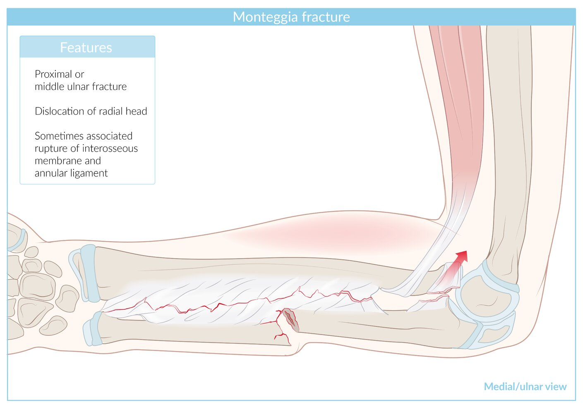
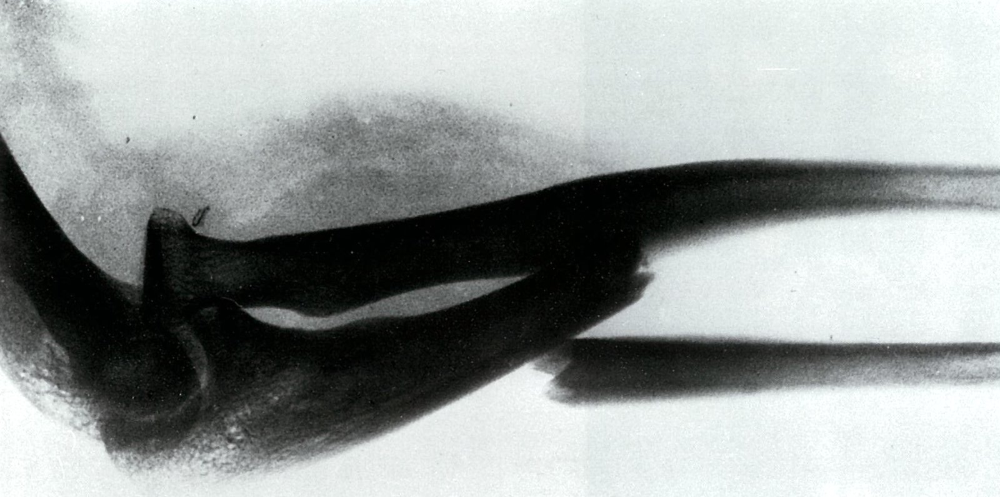
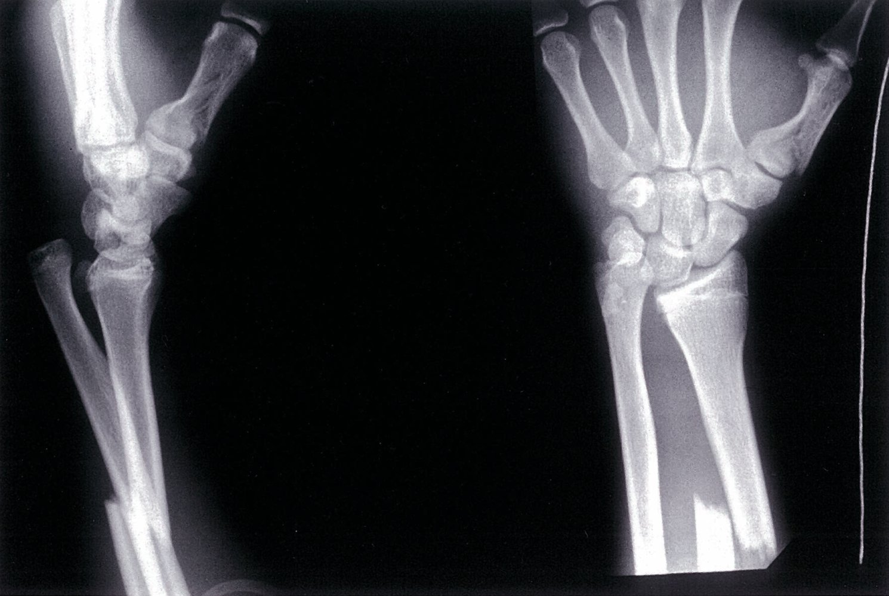
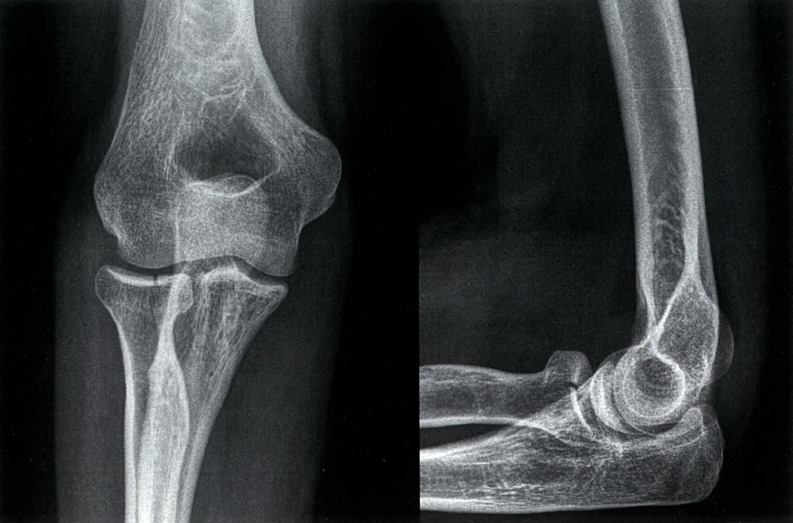

# Forearm fractures

*Categories: Clinical knowledge > Surgery > Trauma and orthopedic surgery > Upper extremity > Forearm fractures*

[Original Article Link](https://coursology-qbank.com/amboss/article/TF06h3)

---

## Summary

<u>Fractures</u> of the radius and/or <u>ulna</u> occur frequently. Important forearm <u>fracture</u> patterns include <u>complete forearm fractures</u>, <u>Galeazzi fractures</u>, and <u>Monteggia fractures</u>. <u>Fractures</u> of the forearm bones at the <u>elbow</u> level include <u>radial head fractures</u> and <u>olecranon fractures</u>, while those at the wrist level include <u>distal radius fractures</u>. The mechanism of injury can be low-energy, such as a <u>fall on an outstretched hand</u> (<u>FOOSH</u>), or high-energy, such as a <u>motor vehicle collision</u> (<u>MVC</u>). Clinical presentation is typically characterized by <u>pain</u> near the <u>fracture</u> site, gross deformity, and swelling. <u>X-ray</u> is the main diagnostic modality. Evaluation includes imaging of the forearm; wrist and <u>elbow</u> imaging are added for moderate to severe injuries. Management varies depending on the age group and <u>fracture</u> characteristics, and includes a thorough <u>neurovascular assessment</u>, acute <u>immobilization</u>, <u>pain management</u>, and referral to orthopedics for definitive <u>open reduction and internal fixation</u> (<u>ORIF</u>) or <u>closed reduction</u> and <u>casting</u>.

For more details on <u>fractures involving the distal radius</u>, see “<u>Distal radius fractures</u>.”

---

## Overview

### Relevant anatomy

#### Important musculoskeletal structures

* Radius: composed of the <u>radial head</u>, radial shaft, and <u>distal</u> radius (including <u>radial styloid</u>)

* <u>Ulna</u>: composed of the <u>olecranon process</u>, <u>coronoid process</u>, ulnar shaft, and <u>distal</u> <u>ulna</u> (including <u>ulnar styloid</u>)

* <u>Connective tissue</u>: <u>interosseous membrane of the forearm</u>, <u>annular ligament of the radius</u>

* <u>Joints</u>: <u>elbow joints</u> (i.e., <u>radiohumeral joint</u> and <u>humeroulnar joint</u>), <u>proximal radioulnar joint</u> , <u>wrist joints</u> (i.e., <u>radiocarpal joints</u>), and <u>distal radioulnar joint</u> (<u>DRUJ</u>)

#### Important neurovascular structures

* Nerves: the <u>radial nerve</u> , <u>ulnar nerve</u> , and <u>median nerve</u> (including its branch <u>anterior interosseous nerve</u>)

* <u>Arteries</u>: the <u>brachial artery</u> and its branches, the <u>radial artery</u> and <u>ulnar artery</u>

### <u>Overview of forearm fractures</u>

* Although the term forearm <u>fracture</u> most often focuses on midshaft <u>fractures</u> of the radius and/or <u>ulna</u>, the <u>proximal</u> and <u>distal</u> portions of these bones which make up the wrist and <u>elbow joints</u> can also be involved.

* See “<u>Overview of radius and ulna fractures</u>” for the various <u>fracture</u> patterns that can affect these bones.

* For further detail on <u>distal radius fracture</u> patterns, See “<u>Types of distal radius fractures</u>.”

* For other bones that can be fractured in the wrist, see “<u>Causes of wrist fractures</u>.”

* For other bones that can be fractured in the <u>elbow</u>, see “<u>Distal humerus fractures</u>.”

| Overview of radius and ulna fractures |  |  |  |  |
| --- | --- | --- | --- | --- |
|  |  | Affected structures | Mechanism of injury | Management |
|  Fractures with elbow involvement |  <u>Monteggia fracture</u>    |   * <u>Fracture</u> of the <u>proximal</u> or middle <u>ulna</u>  * <u>Dislocation</u> of the <u>radial head</u>    |   * Fall onto an outstretched and <u>pronated</u> forearm and extended wrist  * Direct high-energy trauma to the forearm    |  * See “<u>Monteggia fracture</u>.”   |
|  Isolated <u>radial head fracture</u>   |  * <u>Fracture</u> of the <u>radial head</u>   |   * <u>Fall onto outstretched hand</u> (<u>FOOSH</u>)  * <u>Stress fracture</u>    |  * See “<u>Radial head fracture</u>.”   |  |
| <u>Olecranon fracture</u> |  * <u>Fracture</u> of the <u>olecranon process</u>   |   * <u>FOOSH</u>  * Direct trauma to the <u>elbow</u>    |  * See “<u>Olecranon fracture</u>.”   |  |
| <u>Fractures</u> of the mid-forearm |  <u>Complete forearm fracture</u> (<u>Combined radial and ulnar shaft fracture</u>) |   * <u>Radial shaft fracture</u>  * Ulnar shaft <u>fracture</u>    |   * <u>FOOSH</u>  * Direct high-energy trauma to the forearm    |  * See “<u>Complete forearm fractures</u>.”   |
|  Isolated radial shaft fracture [[2]](https://coursology-qbank.com/amboss/article/zr1rPR0)  |   * <u>Radial shaft fracture</u>  * <u>Pediatrics</u>: <u>greenstick fractures</u> common    |   * <u>FOOSH</u>  * Direct trauma    |   * Initial <u>immobilization</u> with <u>long-arm AP splint</u> or <u>sugar tong splint</u>  * Definitive management depends on the <u>fracture</u> location and degree of displacement.    |  |
|  isolated ulnar shaft fracture (<u>Parry fracture</u>; <u>nightstick fracture</u>)   [[2]](https://coursology-qbank.com/amboss/article/zr1rPR0)[[3]](https://coursology-qbank.com/amboss/article/AN1Rdh0)  |   * Ulnar shaft <u>fracture</u>  * <u>Pediatrics</u>: <u>greenstick fractures</u> common    |   * Direct trauma (high or low-energy)  * Typically a defensive injury    |   * Immobilize with a <u>posterior long-arm splint</u>  * Refer to orthopedics within 7 days.  * <u>ORIF</u> may be required (e.g., for displaced or <u>unstable fractures</u>).    |  |
| <u>Fractures</u> with wrist involvement |  <u>Galeazzi fracture</u>    |   * <u>Radial shaft fracture</u>  * Subluxation or <u>dislocation</u> of the <u>DRUJ</u>    |  * Fall onto an outstretched and <u>pronated</u> forearm and extended wrist   |  * See “<u>Galeazzi fracture</u>.”   |
|  <u>Colles fracture</u>    |  * Radial and <u>dorsal</u> displacement of the <u>distal</u> fragment of the radius   |  * <u>FOOSH</u> on extended wrist   |  * See “<u>Distal radius fractures</u>.”   |  |
|  <u>Smith fracture</u>    |  * Radial and <u>volar</u> displacement of the <u>distal</u> fragment of the radius   |  * <u>Flexion</u> <u>fracture</u>: fall onto a <u>palmar</u>-flexed wrist   |  |  |
|  <u>Barton fracture</u>   |  * Radial avulsion and <u>dorsal</u> displacement of the radiocarpal segment of the radius   |  * Extension <u>fracture</u>: <u>FOOSH</u>   |  |  |
|  <u>Reverse Barton fracture</u>    |  * Avulsion and <u>volar</u> displacement of the radiocarpal segment   |  * <u>Flexion</u> <u>fracture</u>: fall onto a <u>palmar</u>-flexed wrist   |  |  |
|  <u>Hutchinson fracture</u>   |  * Avulsion of the <u>radial styloid</u>   |  * Extension <u>fracture</u>: <u>FOOSH</u>   |  |  |
|  <u>Die-punch fracture</u>    |  * Intra-articular <u>fracture</u> of the lunate fossa of the <u>distal</u> radius   |  * Axial loading force applied against the <u>distal</u> radius   |  |  |
|  Ulnar styloid fracture [[4]](https://coursology-qbank.com/amboss/article/GdWBr40)  |  * Avulsion or <u>fracture</u> of the <u>ulnar styloid</u>   |   * <u>FOOSH</u>  * Often associated with <u>distal radius fractures</u> or other ulnar <u>fractures</u>    |   * Nondisplaced <u>fractures</u>: <u>Long-arm AP splint</u> for 6 weeks  * Associated <u>DRUJ instability</u>: operative repair may be required  * Displaced > 2mm: <u>ORIF</u> (e.g., with <u>K-wire</u> fixation)    |  |
| <u>Fractures</u> with <u>elbow</u> and wrist involvement |  Essex-Lopresti injury [[3]](https://coursology-qbank.com/amboss/article/AN1Rdh0)  |   * <u>Radial head fracture</u>  * PLUS disruption of the interosseous membrane of the forearm  * PLUS <u>dislocation</u> of the <u>DRUJ</u>    |  * <u>FOOSH</u>   |  * Refer to orthopedics within 7–10 days for surgical management.   |

Monteggia fracture

Galeazzi fracture

Colles fracture (distal radius fracture)

Smith fracture

Barton fracture

Reverse Barton fracture

Chauffeur fracture (Hutchinson fracture)

Die-punch fracture

Scaphoid fracture

---

## Monteggia fracture

* Definition: <u>proximal</u> (or middle) ulnar <u>fracture</u> with concomitant <u>dislocation</u> of the <u>radial head</u>

* Etiology

* Fall on outstretched and <u>pronated</u> forearm (low-energy trauma)

* Direct blow to the forearm, high-energy trauma (e.g., <u>MVC</u>)

* Clinical features [[2]](https://coursology-qbank.com/amboss/article/zr1rPR0)[[5]](https://coursology-qbank.com/amboss/article/2A1TQj0)

* <u>Pain</u>, <u>crepitus</u>, and limited <u>range of motion</u> at the <u>elbow</u>

* <u>Radial head</u> palpable in <u>antecubital fossa</u>

* Shortened forearm

* <u>Posterior interosseous nerve</u> injury can occur. 

* <u>Paresthesias</u> to the <u>dorsal</u> aspects of the thumb, second, and third fingers

* Loss of thumb extension

* Diagnostics: <u>x-ray</u> [[2]](https://coursology-qbank.com/amboss/article/zr1rPR0)

* Shows a <u>fracture</u> of the <u>proximal</u> (or middle) <u>ulna</u> with <u>dislocation</u> of the <u>radial head</u> (<u>dislocation</u> can be <u>anterior</u>, <u>posterior</u>, or <u>lateral</u>)

* <u>Lateral</u> view: The <u>radiocapitellar line</u> does not intersect the middle of the <u>capitellum</u>, suggesting <u>elbow dislocation</u>.

* Treatment Begin <u>general management of forearm fractures</u>. [[2]](https://coursology-qbank.com/amboss/article/zr1rPR0)

* Children with uncomplicated <u>fractures</u>: <u>Closed reduction</u> by an orthopedic <u>surgeon</u> is often successful.

* Adults and patients with complicated <u>fractures</u>

* Initial: Immobilize in a <u>posterior long arm splint</u>.

* Definitive: <u>ORIF</u> (e.g., plating, <u>K-wire</u> fixation) required for most injuries

* Disposition: Consult orthopedics urgently.

> [!WARNING]
> Adults with displaced <u>Monteggia fractures</u> require urgent <u>ORIF</u>. [[3]](https://coursology-qbank.com/amboss/article/AN1Rdh0)

> [!TIP]
> In patients with ulnar <u>fractures</u>, evaluate the <u>radiocapitellar line</u> to check for disruption of the <u>proximal radioulnar joint</u>. [[2]](https://coursology-qbank.com/amboss/article/zr1rPR0)

Monteggia fracture-dislocation

Monteggia fracture

---

## Galeazzi fracture

* Definition: <u>radial shaft fracture</u> with disruption of the <u>distal radioulnar joint</u>

* <u>Epidemiology</u>: more common in children

* Etiology: fall on outstretched and <u>pronated</u> forearm, <u>MVC</u> [[2]](https://coursology-qbank.com/amboss/article/zr1rPR0)[[3]](https://coursology-qbank.com/amboss/article/AN1Rdh0)

* Clinical features [[2]](https://coursology-qbank.com/amboss/article/zr1rPR0)[[3]](https://coursology-qbank.com/amboss/article/AN1Rdh0)[[6]](https://coursology-qbank.com/amboss/article/C_1qqj0)

* <u>Pain</u> and deformity at the <u>distal</u> radius

* Limited <u>range of motion</u> at the wrist

* Palpable displacement of the <u>ulnar head</u>

* Neurologic injury is rare.

* Diagnostics: <u>x-ray</u> [[3]](https://coursology-qbank.com/amboss/article/AN1Rdh0)[[7]](https://coursology-qbank.com/amboss/article/Zz1Zrj0)

* Shows a <u>fracture</u> at the mid to <u>distal</u> radial shaft, with subluxation or <u>dislocation</u> of the <u>distal radioulnar joint</u> (<u>DRUJ</u>)

* A tear in the interosseous membrane can only be seen indirectly on <u>x-ray</u>.

* Signs of <u>DRUJ instability</u> (e.g., widening of the space between the <u>distal</u> radius and <u>ulna</u>)

* Treatment: Begin <u>general management of forearm fractures</u>. [[2]](https://coursology-qbank.com/amboss/article/zr1rPR0)[[3]](https://coursology-qbank.com/amboss/article/AN1Rdh0)

* Children with uncomplicated <u>fractures</u>: <u>Closed reduction</u> by an orthopedic <u>surgeon</u> followed by <u>casting</u>

* All adult patients and all patients with complicated <u>fractures</u> 

* Initial: Immobilize in a <u>posterior long arm splint</u>.

* Definitive: <u>ORIF</u> (e.g., plating, <u>K-wire</u> fixation) required for most injuries

* Disposition: Consult orthopedics urgently.

> [!TIP]
> Almost all <u>Galeazzi fractures</u> require <u>open reduction</u> and repair of the <u>distal radioulnar joint</u>. [[3]](https://coursology-qbank.com/amboss/article/AN1Rdh0)

Galeazzi fracture and fracture of the first metacarpal bone

Galeazzi fracture

---

## Radial head fracture

* Definition: <u>fracture</u> of the <u>radial head</u>

* <u>Epidemiology</u>: more common in adults than <u>radial head subluxation</u> or <u>dislocation</u> [[8]](https://coursology-qbank.com/amboss/article/35YSPp)

* Etiology

* <u>FOOSH</u> with the <u>elbow</u> partially flexed and <u>pronated</u> [[9]](https://coursology-qbank.com/amboss/article/iO1JHS0)

* <u>Stress fracture</u> (e.g., in throwing sports)

* Clinical evaluation [[9]](https://coursology-qbank.com/amboss/article/iO1JHS0)

* Perform a <u>neurovascular exam</u>.  [[10]](https://coursology-qbank.com/amboss/article/-n1DDh0)

* <u>Radial head</u> region is tender to touch.

* <u>Pronation</u> and <u>supination</u> of the forearm are painful.

* Effusion or <u>hemarthrosis</u> of the <u>elbow joint</u> may be present.

* Diagnostics: <u>x-ray</u> <u>elbow</u> (AP, <u>lateral</u> and oblique)   [[3]](https://coursology-qbank.com/amboss/article/AN1Rdh0)[[9]](https://coursology-qbank.com/amboss/article/iO1JHS0)[[10]](https://coursology-qbank.com/amboss/article/-n1DDh0)

* <u>Fracture</u> through the <u>radial head</u> is not always visible.

* Evidence of effusion (<u>sail sign</u> and/or <u>posterior fat pad sign</u>) may be the only finding.

* <u>Comminuted fractures</u>: Consider imaging the wrist, as these <u>fractures</u> may be associated with additional injuries.  [[10]](https://coursology-qbank.com/amboss/article/-n1DDh0)

* Treatment: Begin <u>general management of forearm fractures</u>.

* <u>Fractures</u> with > 60 degrees of angulation often require <u>open reduction</u> and orthopedic consult. [[3]](https://coursology-qbank.com/amboss/article/AN1Rdh0)

* Nondisplaced <u>fractures</u>: <u>conservative treatment</u>

* Immobilize in a sling or <u>posterior long arm splint</u> for 24–72 hours.  [[3]](https://coursology-qbank.com/amboss/article/AN1Rdh0)[[11]](https://coursology-qbank.com/amboss/article/0L1ewh0)

* Start early <u>ROM</u> exercises. [[9]](https://coursology-qbank.com/amboss/article/iO1JHS0)[[12]](https://coursology-qbank.com/amboss/article/jO1_HS0)

* <u>Complex fractures</u>: typically surgical treatment  [[9]](https://coursology-qbank.com/amboss/article/iO1JHS0)

* <u>Pain management</u>

* Consider <u>hemarthrosis</u> <u>aspiration</u> only as an adjunct to splinting in select patients.  [[3]](https://coursology-qbank.com/amboss/article/AN1Rdh0)[[13]](https://coursology-qbank.com/amboss/article/ZL1Zwh0)

* Avoid intraarticular <u>local anesthetic</u> infiltration.  [[3]](https://coursology-qbank.com/amboss/article/AN1Rdh0)

* Disposition: typically outpatient management with short-term orthopedic follow-up [[3]](https://coursology-qbank.com/amboss/article/AN1Rdh0)

* Complication: <u>cubitus valgus</u>

> [!WARNING]
> Treat a positive <u>elbow fat pad sign</u> with corresponding bony tenderness as an <u>occult fracture</u>. [[3]](https://coursology-qbank.com/amboss/article/AN1Rdh0)

Radial head fracture

---