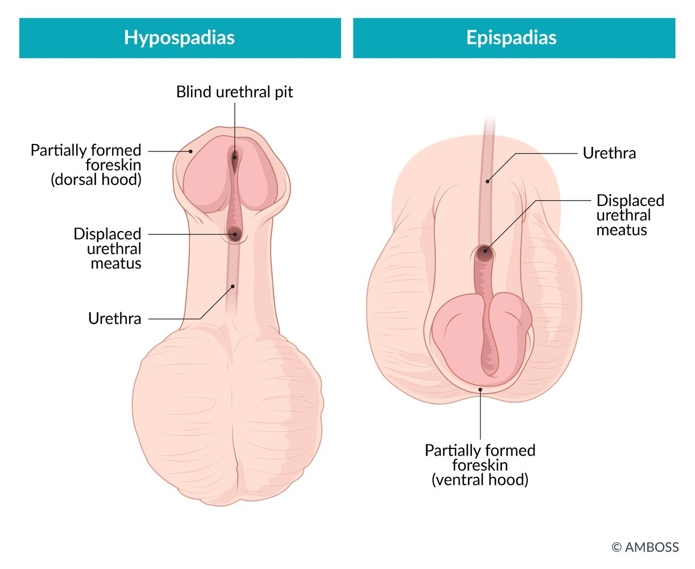
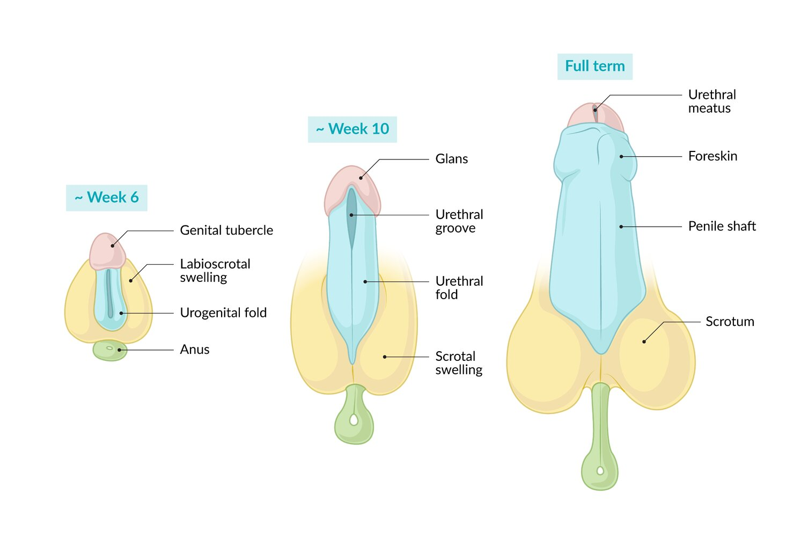
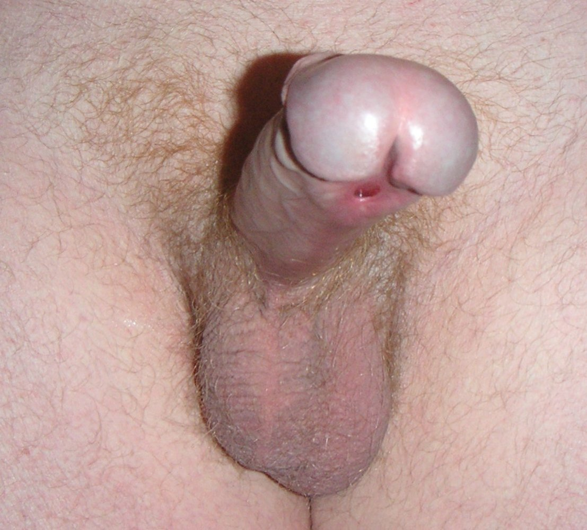
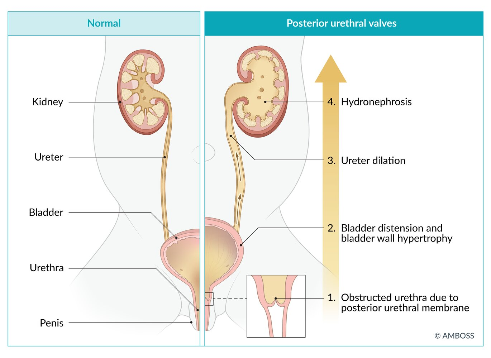

# Abnormalities of the male urethra and webbed penis

*Categories: Clinical knowledge > Surgery > Urologic surgery > Abnormalities of the male urethra and webbed penis*

[Original Article Link](https://coursology-qbank.com/amboss/article/Mi0MHf)

---

## Summary

Abnormalities of the <u>male urethra</u> are common and the need for treatment depends on the condition and the symptoms. <u>Epispadias</u> and <u>hypospadias</u> may result in difficulty urinating and infections, and surgical repair is indicated for restoring functionality and reconstruction of external genitalia. <u>Posterior urethral valves</u> are the most common cause of <u>urinary obstruction</u> in <u>newborn</u> boys and can be associated with <u>hydronephrosis</u>, <u>renal failure</u>, and <u>pulmonary hypoplasia</u>. Early identification by <u>prenatal ultrasound</u> with diagnosis by <u>voiding cystourethrogram</u> allows for <u>cystoscopic valve ablation</u> and relief of the obstruction. However, despite treatment, many patients will develop <u>chronic kidney disease</u>.

---

## Epispadias

* Definition

* Embryonic <u>malformation</u> due to malpositioning of the <u>genital tubercle</u> that causes incomplete urethral tubularization on the <u>dorsal</u> <u>penis</u> when associated with <u>bladder exstrophy</u>, although in an attenuated form

* May also be due to chronic pressure, e.g., as a result of a transurethral indwelling catheter eroding the <u>urethra</u>.

* <u>Epidemiology</u>: <u>incidence</u> is about 2.4 per 100,000 <u>live births</u> (isolated <u>epispadias</u>) [[1]](https://coursology-qbank.com/amboss/article/2LXTCA)

* Clinical features [[2]](https://coursology-qbank.com/amboss/article/7na4uO)

* Cleavage and exposure of the <u>urethra</u>

* On the <u>dorsal</u> <u>penis</u> and associated with penile curvature

* Between labia and <u>clitoris</u> or up to <u>bladder</u>

* <u>Urinary incontinence</u>, <u>vesicoureteral reflux</u>

* Diagnostics: <u>clinical diagnosis</u>

* Treatment

* In young patients: operative closure with urethroplasty and reconstruction of genitalia if indicated

* In patients with long-term indwelling catheters: insertion of a suprapubic indwelling catheter (reconstructive treatment is usually not necessary)

* Complications

* <u>Erectile dysfunction</u> and <u>infertility</u> in males

* <u>UTI</u>

Hypospadias vs. epispadias

Development of male external genitalia

---

## Hypospadias

* Definition: common congenital <u>malformation</u> with incorrect positioning of the <u>external urethral meatus</u>;   due to failure of urethral folds and <u>foreskin</u> to fuse on <u>ventral</u> <u>penis</u>

* <u>Epidemiology</u>: <u>incidence</u> is 1 per 250 <u>live births</u> [[3]](https://coursology-qbank.com/amboss/article/fLXkCA)

* Etiology: Genetic (e.g., <u>differences of sex development</u>), endocrine (e.g., <u>5-alpha reductase deficiency</u>), and environmental factors have been implicated.

* Clinical features

* Abnormal <u>foreskin</u>;  (<u>dorsal</u> hood), <u>ventral</u> penile curvature; , and two meatal openings

* <u>Proximal</u> <u>hypospadias</u> are associated with bifid scrotum and penoscrotal transposition

* Associated with <u>inguinal hernias</u>, <u>cryptorchidism</u>, and chordee (a congenital abnormality characterized by an abnormal <u>ventral</u> curvature of the <u>penis</u>)

* Diagnostics: <u>clinical diagnosis</u>

* Treatment

* Mild cases  do not necessarily require <u>surgery</u>

* Significant displacement or symptomatic <u>micturition</u> warrants surgical repair

* Reconstruction of <u>urethra</u>, <u>penis</u>, and <u>scrotum</u> at 6–12 months of age: urethroplasty  and orthoplasty

* Severe cases require two-stage repair with correction of penile curvature first followed by urethroplasty at least 6 months later

* Complications (following repair)

* Urethral <u>fistula</u>

* Meatal stenosis: narrowing of <u>ventral</u> meatus causes thin urinary stream and straining with <u>urination</u>

* Most commonly caused by <u>circumcision</u>

* Treatment consists of <u>surgery</u>: meatotomy (the meatus of the <u>urethra</u> is ventrally <u>incised</u>)

* Urethral diverticulum: distinct outpouching of the urethral <u>mucosa</u> that most frequently leads to dribbling, <u>dysuria</u>, and <u>dyspareunia</u>.

* <u>UTIs</u>

> [!WARNING]
> <u>Circumcision</u> is contraindicated in boys with <u>hypospadias</u> that includes the <u>foreskin</u>. In these cases, the <u>foreskin</u> may be needed for a <u>skin flap</u> when performing urethroplasty.

Hypospadias

Hypospadias vs. epispadias

Development of male external genitalia

---

## Posterior urethral valves

* Definition: congenital <u>malformation</u> in males where membranous folds of the urogenital membrane obstruct the membranous and <u>prostatic urethra</u> (<u>posterior urethra</u>)

* <u>Epidemiology</u>: <u>incidence</u> is about 1 per 4,000 <u>live births</u> [[4]](https://coursology-qbank.com/amboss/article/hLXcxA)

* Clinical features [[2]](https://coursology-qbank.com/amboss/article/7na4uO)

* Most common cause of <u>urinary tract obstruction</u> in <u>newborn</u> males

* <u>Respiratory distress</u> secondary to <u>pulmonary hypoplasia</u> in cases with severe obstruction (see “<u>Potter sequence</u>”)

* Abdominal distention due to <u>bladder</u> distention

* Late manifestations:

* Difficulty voiding, poor urinary stream

* <u>UTIs</u> → <u>urosepsis</u>

* Diurnal <u>enuresis</u>

* <u>Failure to thrive</u>

* Diagnostics

* <u>Voiding cystourethrogram</u> (diagnostic study of choice) demonstrates

* Dilation/elongation of the <u>posterior urethra</u> during voiding

* Signs of <u>vesicoureteral reflux</u> (if present)

* <u>Prenatal ultrasound</u> of the upper <u>urinary tract</u> may demonstrate:

* Distended and/or thick-walled <u>bladder</u>

* Bilateral hydroureters

* Bilateral <u>hydronephrosis</u>

* Marked <u>vesicoureteral reflux</u> with <u>megaureter</u>

* <u>Oligohydramnios</u> and features of <u>Potter sequence</u> (in severe <u>urinary outflow obstruction</u>)

* Treatment

* Temporary insertion of urinary catheter  and correction of <u>electrolyte</u> imbalance

* First-line: primary valve ablation

* An endoscopic procedure that involves the transurethral <u>incision</u> of <u>posterior urethral valves</u> in the membranous part of the <u>urethra</u>

* Performed during <u>cystoscopy</u>

* Second-line: vesicostomy

* A surgical procedure in which a connection is formed between the <u>bladder</u> and the outside of the lower abdominal wall to allow for the drainage of urine (or if <u>ablation</u> is not possible)

* Also indicated in patients with functional <u>bladder outlet obstruction</u> (e.g., <u>neurogenic bladder</u>)

* Close follow-up due to high risk of <u>chronic kidney disease</u>

* <u>Renal transplantation</u> may become necessary during the course of disease.

* Fetal <u>vesicoamniotic shunting</u> is associated with procedure-related risks without evidence of long-term benefits for renal function

* Complications: most common cause of <u>chronic renal insufficiency</u> or <u>renal failure</u> in boys

Posterior urethral valves

---