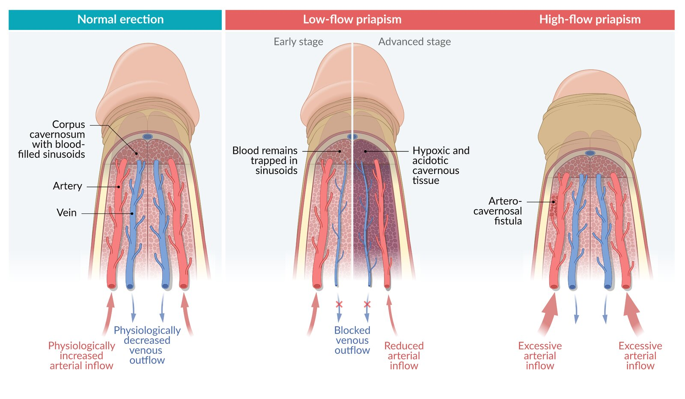

# Priapism

*Categories: Clinical knowledge > Surgery > Urologic surgery > Priapism*

[Original Article Link](https://coursology-qbank.com/amboss/article/xi0EFf)

---

## Summary

Priapism is a sustained <u>erection</u> that lasts for more than four hours and continues hours beyond or is unrelated to sexual stimulation. It is classified into <u>ischemic (low-flow) priapism</u> and <u>nonischemic (high-flow) priapism</u>. <u>Ischemic priapism</u> is caused by inadequate venous outflow from the <u>corpus cavernosum</u> and results in painful penile <u>ischemia</u>. In adults, <u>ischemic priapism</u> is often <u>idiopathic</u> or an adverse effect of treatments for <u>erectile dysfunction</u>, while <u>sickle cell disease</u> is the most common cause in children. <u>Nonischemic priapism</u> is less common and is caused by increased arterial inflow to the <u>corpus cavernosum</u>, usually due to <u>fistula</u> formation following perineal trauma. <u>Nonischemic priapism</u> is not associated with penile <u>ischemia</u> and is painless. Diagnosis is performed with <u>corporal blood gas analysis</u> to <u>distinguish between ischemic and nonischemic priapism</u>. Blood flow assessment with <u>Doppler ultrasound</u> is used when results of <u>corporal blood gas analysis</u> are indeterminate. <u>Ischemic priapism</u> is a urological emergency requiring immediate <u>therapeutic corporal aspiration</u> and <u>intracavernosal alpha-adrenergic injection</u>. <u>Surgery</u> is indicated if priapism does not subside. Delay in treatment of <u>ischemic priapism</u> is associated with high rates of permanent <u>erectile dysfunction</u>. <u>Nonischemic priapism</u> often self-resolves; initial management is observation.

---

## Definitions

* Priapism: a penile <u>erection</u> lasting > 4 hours that continues hours beyond or is unrelated to sexual stimulation [[3]](https://coursology-qbank.com/amboss/article/JMdspq0)

* Prolonged <u>erection</u>: an <u>erection</u> that lasts longer than desired but has a duration ≤ 4 hours [[3]](https://coursology-qbank.com/amboss/article/JMdspq0)

---

## Ischemic (low-flow) priapism

> [!WARNING]
> <u>Ischemic priapism</u> is a urological emergency that needs treatment as soon as possible. Tissue damage can occur as early as 6 hours from onset. [[1]](https://coursology-qbank.com/amboss/article/zLdrZI0)[[3]](https://coursology-qbank.com/amboss/article/JMdspq0)[[3]](https://coursology-qbank.com/amboss/article/JMdspq0)

### <u>Epidemiology</u>

* Accounts for 95% of all priapism episodes [[1]](https://coursology-qbank.com/amboss/article/zLdrZI0)[[3]](https://coursology-qbank.com/amboss/article/JMdspq0)

* Two peak ages related to the most common cause in each age group (See “Etiology.”) [[5]](https://coursology-qbank.com/amboss/article/oXX0_9)

* Adults: 20–50 years

* Children 5–10 years

### Etiology [[1]](https://coursology-qbank.com/amboss/article/zLdrZI0)[[2]](https://coursology-qbank.com/amboss/article/SKdyfI0)[[6]](https://coursology-qbank.com/amboss/article/AN1Rdh0)

* <u>Idiopathic</u> (most common in adults)

* <u>Treatment of erectile dysfunction</u> (common cause in adults)

* <u>Intracavernous injection therapy</u> (e.g., with <u>alprostadil</u>)

* <u>Phosphodiesterase type 5 inhibitors</u> (e.g., <u>sildenafil</u>)

* Other medications and substances

* <u>Antidepressants</u> (e.g., <u>trazodone</u>)

* <u>Alpha blockers</u> (e.g., <u>prazosin</u>)

* <u>Antipsychotics</u>

* <u>Recreational drugs</u>: <u>alcohol</u>, <u>cocaine</u>, <u>cannabis</u>

* Hematological conditions

* <u>Sickle cell disease</u>;  (most common cause in children): Sickled <u>erythrocytes</u> obstruct venous drainage from the <u>corpus cavernosum</u>.

* <u>Leukemia</u>: <u>leukostasis syndrome</u>

* <u>Thalassemia</u>

* <u>Autonomic dysfunction</u>: due to <u>autonomic neuropathy</u> or spinal cord dysfunction

* <u>Pelvic</u> tumors: e.g., <u>bladder cancer</u>, <u>prostate cancer</u>

> [!TIP]
> <u>Treatment of erectile dysfunction</u> is a common cause of <u>ischemic priapism</u> in adults, while <u>sickle cell disease</u> is the most common cause in children. [[2]](https://coursology-qbank.com/amboss/article/SKdyfI0)

### Pathophysiology  [[1]](https://coursology-qbank.com/amboss/article/zLdrZI0)[[7]](https://coursology-qbank.com/amboss/article/L6dwlI0)

* Inadequate venous outflow from the <u>corpus cavernosum</u> as a result of:

* <u>Thrombosis</u> and/or compression of the penile, <u>prostatic</u>, and/or <u>pelvic</u> <u>veins</u>

* Prolonged tumescence

* Decreased venous outflow → increased intracavernosal pressure → decreased arterial inflow → penile <u>ischemia</u>

Low-flow vs. high-flow priapism

> [!WARNING]
> Prolonged penile <u>ischemia</u> can lead to cavernous body <u>fibrosis</u> with irreversible <u>erectile dysfunction</u>. [[1]](https://coursology-qbank.com/amboss/article/zLdrZI0)[[7]](https://coursology-qbank.com/amboss/article/L6dwlI0)

### Clinical features [[1]](https://coursology-qbank.com/amboss/article/zLdrZI0)[[8]](https://coursology-qbank.com/amboss/article/pGcLZV0)

* Early presentation: painful <u>erection</u>

* Fully erect, rigid, and tender <u>corpus cavernosum</u>

* Flaccid or partially engorged glans and <u>corpus spongiosum</u>

* Late presentation: color change (e.g., <u>erythema</u>), <u>gangrene</u>

* Recurrent ischemic (stuttering) priapism: generally rare [[9]](https://coursology-qbank.com/amboss/article/5HdiIr0)

* Repeated painful erections interspersed with periods of <u>detumescence</u>

* Most common in individuals with <u>sickle cell disease</u>

> [!WARNING]
> Signs of <u>pelvic</u> or perineal trauma suggest <u>nonischemic priapism</u> rather than <u>ischemic priapism</u>. [[3]](https://coursology-qbank.com/amboss/article/JMdspq0)

### Diagnosis of ischemic priapism [[3]](https://coursology-qbank.com/amboss/article/JMdspq0)

* <u>Clinical diagnosis</u>: can be made if classic clinical features and defining criteria for priapism are present alongside a highly suggestive history

* Confirmatory diagnostic findings

* <u>Corporal blood gas analysis</u> (room air): pO2< 30 mm Hg; <u>pCO2</u>> 60 mm Hg; <u>pH</u> < 7.25 [[3]](https://coursology-qbank.com/amboss/article/JMdspq0)

* Penile and perineal Doppler: low blood flow

* See “<u>Diagnosis of priapism</u>” for approach and additional tests.

### Management [[1]](https://coursology-qbank.com/amboss/article/zLdrZI0)[[2]](https://coursology-qbank.com/amboss/article/SKdyfI0)[[3]](https://coursology-qbank.com/amboss/article/JMdspq0)

#### Approach

* Follow <u>management approach for suspected priapism</u>, including urgent urology consult.

* Once the <u>diagnosis of ischemic priapism</u> is established, immediately proceed to nonsurgical management.

* If <u>detumescence</u> is achieved, consider discharge with close follow-up.

* If <u>detumescence</u> is not achieved, proceed to <u>surgery</u>.

* Manage the underlying cause (see “Etiology”).

* Discontinue trigger medications.

* Patients with <u>sickle cell disease</u> [[1]](https://coursology-qbank.com/amboss/article/zLdrZI0)[[4]](https://coursology-qbank.com/amboss/article/qMdCpq0)

* Consult <u>hematology</u>.

* Begin <u>acute management for sickle cell disease complications</u> (e.g., <u>O2 therapy</u>, hydration).

* Do not delay treatment of <u>ischemic priapism</u> to perform <u>exchange transfusion</u>.

> [!TIP]
> For <u>stuttering priapism</u>, the management of each acute episode is similar to the management of acute <u>ischemic priapism</u>. [[2]](https://coursology-qbank.com/amboss/article/SKdyfI0)[[4]](https://coursology-qbank.com/amboss/article/qMdCpq0)

#### Nonsurgical management of ischemic priapism [[2]](https://coursology-qbank.com/amboss/article/SKdyfI0)[[3]](https://coursology-qbank.com/amboss/article/JMdspq0)[[6]](https://coursology-qbank.com/amboss/article/AN1Rdh0)[[10]](https://coursology-qbank.com/amboss/article/3wYSir)

<u>Therapeutic corporal aspiration</u>, corporal <u>irrigation</u>, and <u>intracavernosal alpha-adrenergic injection</u> are often used in combination to treat acute <u>ischemic priapism</u>. Specific recommendations vary by region. Follow local protocols and consult a urologist.

* <u>Regional anesthesia</u>: <u>penile block</u>

* Needle insertion into the <u>corpus cavernosum</u> [[11]](https://coursology-qbank.com/amboss/article/pIdLdr0)

* Prepubescent children: 23-gauge to 21-gauge butterfly needle

* <u>Adolescents</u> and adults: 19-gauge butterfly needle

* Technique

* Insertion site: base of the penile shaft at 3 or 9 o’clock in the <u>lithotomy position</u>

* Insert the butterfly needle as <u>lateral</u> to the <u>skin</u> as possible.

* Observe for <u>blood flashback</u> (may be discolored due to <u>deoxygenated hemoglobin</u>).

* Secure to the <u>skin</u> as needed once properly placed.

* Corporal <u>aspiration</u>

* Diagnostic corporal aspiration

* Goal: Obtain blood for <u>corporal blood gas analysis</u>, if indicated.

* Technique: <u>Aspirate</u> 0.5–3 mL of cavernosal blood into a heparinized syringe.

* Therapeutic corporal aspiration

* Goals: remove trapped, deoxygenated blood from <u>corpus cavernosum</u>, relieve <u>pain</u>, restore normal blood flow

* Technique: <u>Aspirate</u> cavernosal blood in 5 mL increments until bright red blood is consistently observed. [[6]](https://coursology-qbank.com/amboss/article/AN1Rdh0)

* Corporal <u>irrigation</u> (optional): may be performed following therapeutic corporeal <u>aspiration</u>  [[2]](https://coursology-qbank.com/amboss/article/SKdyfI0)

* Goals: clear coagulated or stagnant blood and encourage normal blood flow [[11]](https://coursology-qbank.com/amboss/article/pIdLdr0)

* Technique: Flush (i.e., inject and remove) the <u>corpus cavernosum</u> with 10–20 mL of 0.9% <u>normal saline</u>. [[10]](https://coursology-qbank.com/amboss/article/3wYSir)

* Intracavernosal alpha-adrenergic injection

* Goals: reduce arterial inflow, encourage <u>detumescence</u> and venous outflow

* Technique

* Inject <u>alpha-adrenergic</u> agent, e.g., <u>phenylephrine</u> (<u>off-label</u>) DOSAGE

* Monitor blood pressure and <u>heart rate</u> during injection.

> [!TIP]
> <u>Ischemic priapism</u> of < 24 hours' duration is typically managed with repeated <u>rounds</u> of <u>aspiration</u> (± <u>irrigation</u>) and <u>intracavernosal phenylephrine</u> over at least 1 hour before surgical intervention is considered. [[11]](https://coursology-qbank.com/amboss/article/pIdLdr0)[[12]](https://coursology-qbank.com/amboss/article/07de4r0)

#### Surgical management [[2]](https://coursology-qbank.com/amboss/article/SKdyfI0)[[3]](https://coursology-qbank.com/amboss/article/JMdspq0)[[6]](https://coursology-qbank.com/amboss/article/AN1Rdh0)

* Indication: persistent priapism despite nonsurgical intervention  [[2]](https://coursology-qbank.com/amboss/article/SKdyfI0)[[3]](https://coursology-qbank.com/amboss/article/JMdspq0)

* Procedures

* Corpoglandular shunting: initial procedure in most patients   [[3]](https://coursology-qbank.com/amboss/article/JMdspq0)

* <u>Penile prosthesis</u> implantation: considered if shunting fails or for priapism lasting more than 24–48 hours

### Prognosis [[3]](https://coursology-qbank.com/amboss/article/JMdspq0)[[13]](https://coursology-qbank.com/amboss/article/l6dvOI0)

* Prognosis depends primarily on the duration of priapism before effective treatment.

* <u>Ischemic priapism</u> lasting > 24 hours: high likelihood of permanent <u>erectile dysfunction</u>

---