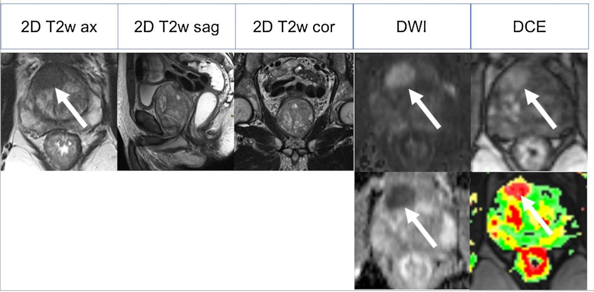
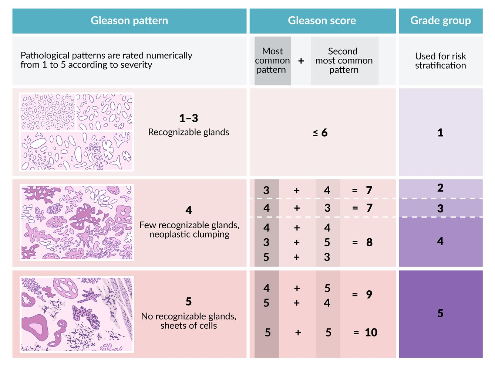
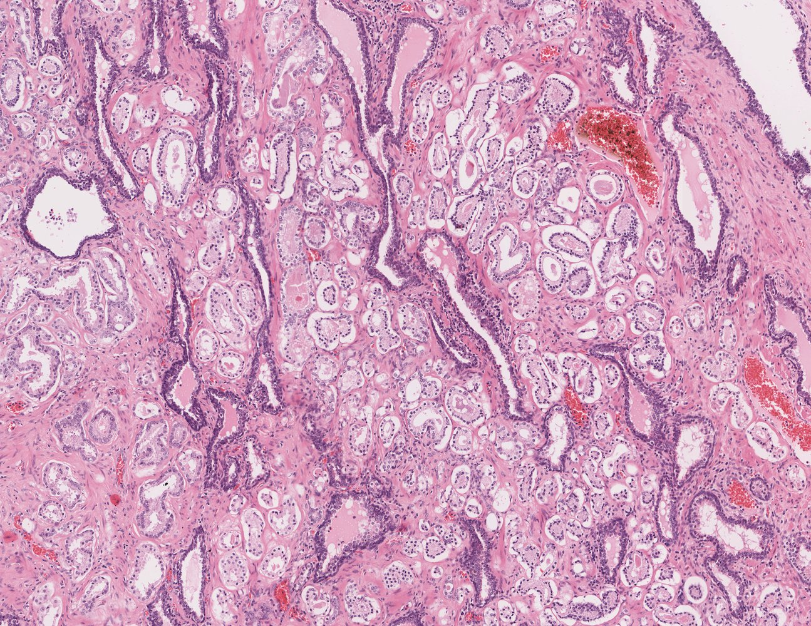
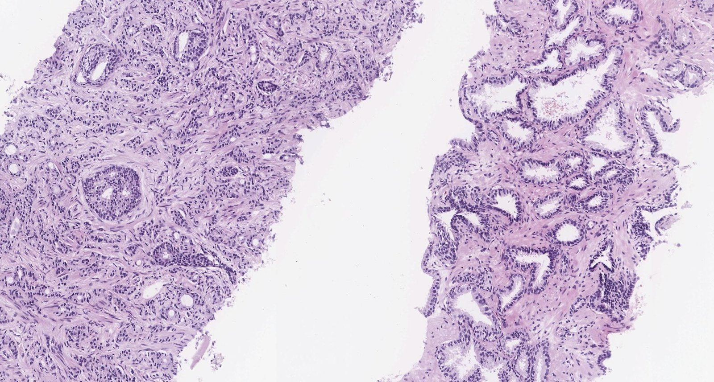

# Prostate cancer

*Categories: Clinical knowledge > Surgery > Urologic surgery > Prostate cancer*

[Original Article Link](https://coursology-qbank.com/amboss/article/Ji0ssf)

---

## Summary

<u>Prostate</u> cancer is one of the most common cancers that affect men, especially those > 50 years of age. Typically, <u>prostate</u> cancer has an indolent course and is usually discovered while still localized in the <u>prostate</u>. This allows many patients to undergo monitoring for progression rather than active treatment, preventing unnecessary treatment-related adverse effects. <u>Prostate</u> cancer is typically diagnosed and monitored using <u>prostate-specific antigen</u> (<u>PSA</u>) testing, <u>multiparametric MRI</u> (<u>mpMRI</u>), and guided <u>biopsy</u>. Once the decision to treat has been made, therapeutic options include <u>radical prostatectomy</u>, <u>radiation therapy</u>, <u>androgen deprivation therapy</u> (<u>ADT</u>), and <u>chemotherapy</u>. Since all treatment options may adversely affect the patient's quality of life, <u>shared decision-making</u> with the patient is strongly encouraged in all current guidelines. Symptomatic management may be preferable in patients with significant comorbidities or limited <u>life expectancy</u>, as further treatment is unlikely to be life-prolonging.

---

## Epidemiology

* <u>Incidence</u>: most common cancer in men in the US, following <u>skin</u> cancer (i.e., <u>melanoma</u> and nonmelanoma combined)   [[1]](https://coursology-qbank.com/amboss/article/hYacKQ)

* Mortality: in 2020, second leading cause of cancer deaths in men in the US (after <u>lung cancer</u>)

Incidence of cancers in the US (2025 estimates)

Cancer mortality in the US (2025 estimates)

Epidemiological data refers to the US, unless otherwise specified.

---

## Risk factors

* Advanced age (> 50 years)  [[1]](https://coursology-qbank.com/amboss/article/hYacKQ)[[2]](https://coursology-qbank.com/amboss/article/CTXqGx)

* <u>Family history</u>

* African-American descent

* Genetic disposition (e.g., <u>BRCA2</u>, <u>Lynch syndrome</u>)

* Dietary factors: high intake of saturated fat, well-done meats, and <u>calcium</u>

> [!TIP]
> Advanced age is the main <u>risk factor</u> for <u>prostate</u> cancer. <u>Sexual activity</u> and <u>benign prostatic hyperplasia</u> (<u>BPH</u>) are not associated with <u>prostate</u> cancer.

References: [[3]](https://coursology-qbank.com/amboss/article/U30b3f)[[4]](https://coursology-qbank.com/amboss/article/xTXEGx)

---

## Clinical features

### Symptoms

* Typically asymptomatic

* Early <u>prostate</u> cancers are typically detected during <u>screening tests</u>.

* Some <u>prostate</u> cancers are found incidentally (incidental prostate cancer).

* Patients may present with features of <u>complicated lower urinary tract symptoms</u> (<u>LUTS</u>), including: [[5]](https://coursology-qbank.com/amboss/article/qfXCMx)

* <u>Urinary retention</u>

* <u>Hematuria</u>

* Incontinence

* Flank <u>pain</u> (due to <u>hydronephrosis</u>)

* Advanced <u>prostate</u> cancer can manifest with:

* <u>Constitutional symptoms</u>: fatigue, loss of appetite, <u>clinically significant unintentional weight loss</u>

* Features of <u>metastatic</u> disease; examples include:

* Bone <u>pain</u> (due to <u>bone metastasis</u>, especially in the lumbosacral <u>spine</u>)

* Neurological deficits (e.g., due to <u>vertebral fracture</u> causing <u>spinal cord compression</u>)

* <u>Lymphedema</u> (caused by obstructing <u>metastases</u> in the <u>lymph nodes</u>)

### <u>Digital rectal examination</u> (<u>DRE</u>) [[6]](https://coursology-qbank.com/amboss/article/o0c0Sa0)[[7]](https://coursology-qbank.com/amboss/article/j1c_gY0)[[8]](https://coursology-qbank.com/amboss/article/pLcLA10)

A <u>DRE</u> should be performed in individuals with elevated serum <u>PSA</u> levels;  and as part of the comprehensive evaluation of male <u>LUTS</u>. <u>DRE</u> has a low <u>positive predictive value</u> for detecting <u>prostate</u> cancer and should not be performed as the sole screening modality.

* May be normal;   in early disease or if the cancer is located in areas of the gland that are not palpable on <u>DRE</u>  [[9]](https://coursology-qbank.com/amboss/article/LTXwrx)

* Features suggestive of <u>prostate</u> cancer include:

* Localized indurated <u>nodules</u> on an otherwise smooth surface

* Prostatomegaly, lobar asymmetry, obliteration of the sulcus

* Hard nontender <u>nodules</u>

> [!TIP]
> Most <u>prostate</u> cancers are located in the peripheral zone (<u>posterior</u> lobe) of the <u>prostate</u>. In contrast, <u>BPH</u> occurs in the transitional zone of the <u>prostate</u>.

> [!WARNING]
> Even patients with advanced <u>prostate</u> cancer may have a normal <u>DRE</u>; if clinical suspicion is high, continue <u>diagnostic evaluation for prostate cancer</u>!

Urinary bladder (male)

---

## Diagnosis

### Approach

The following content is related to diagnosing <u>prostate</u> cancer in symptomatic patients or those with a positive <u>screening test</u>. <u>Screening for prostate cancer</u> in asymptomatic individuals is detailed separately.

* Suspect <u>prostate</u> cancer in patients with elevated <u>PSA</u> levels detected on routine screening and/or abnormal findings on <u>DRE</u>.

* Consider adjunctive <u>PSA</u> testing (e.g., <u>free PSA:total PSA ratio</u>, <u>PSA density</u>, urinary <u>prostate cancer antigen 3</u> levels) before performing a <u>biopsy</u>.

* Confirm the diagnosis on image-guided <u>prostate biopsy</u>.

* <u>Stage prostate cancer</u> to determine the appropriate management and prognosis.

### Prostate-specific antigen (<u>PSA</u>) levels

<u>PSA</u> is a <u>serine</u> <u>protease</u> produced only in the <u>prostate gland</u> and, therefore, is an organ-specific marker. It is not cancer-specific however, as levels may also be elevated in benign conditions. [[10]](https://coursology-qbank.com/amboss/article/P1cWSY0)

* Indications

* Suspected <u>prostate</u> cancer

* Monitoring for recurrence following treatment of <u>prostate</u> cancer

* <u>Screening for prostate cancer</u> (controversial).

* Interpretation [[11]](https://coursology-qbank.com/amboss/article/Facgma0)[[12]](https://coursology-qbank.com/amboss/article/BUcz2b0)

* Total <u>PSA</u> levels 

* <u>PSA</u> < 2.5 ng/mL: <u>Prostate</u> cancer is unlikely.

* <u>PSA</u> 2.5–4 ng/mL: <u>Prostate</u> cancer is possible in symptomatic patients.  [[13]](https://coursology-qbank.com/amboss/article/xUcE2b0)

* > 4 ng/mL: <u>Prostate</u> cancer is likely. [[12]](https://coursology-qbank.com/amboss/article/BUcz2b0)

* <u>PSA</u> 4–10 ng/mL (moderately elevated <u>PSA</u>): ∼ 25% chance of <u>prostate</u> cancer

* <u>PSA</u> > 10 ng/mL: > 50% chance of <u>prostate</u> cancer

* Free <u>PSA</u> (unbound) : Free <u>PSA</u> levels are lower in <u>prostate</u> cancer than in normal <u>prostate</u> tissue or benign disease.

* Other causes of elevated total <u>PSA</u>: <u>BPH</u>, <u>UTI</u>, <u>prostatitis</u>, <u>prostatic</u> trauma or manipulation (including <u>DRE</u>)  [[14]](https://coursology-qbank.com/amboss/article/41c3SY0)

> [!WARNING]
> A <u>PSA</u> level ≤ 4 ng/mL does not exclude <u>prostate</u> cancer!

> [!WARNING]
> <u>5-alpha reductase inhibitors</u> (<u>5-ARIs</u>) can suppress <u>PSA</u> production, resulting in spuriously low <u>PSA</u> levels. This should be taken into consideration in patients on long-term <u>5-ARIs</u> (e.g., for <u>BPH</u>). [[15]](https://coursology-qbank.com/amboss/article/hLccx10)[[16]](https://coursology-qbank.com/amboss/article/rAXfO00)

> [!TIP]
> Inflammation, manipulation of the <u>prostate</u>, and other malignant and benign <u>prostate</u> diseases may lead to a <u>false-positive</u> <u>PSA</u> result!

### <u>Urinalysis</u> [[17]](https://coursology-qbank.com/amboss/article/Nec-_Y0)[[18]](https://coursology-qbank.com/amboss/article/D9a1p5)

* Should be performed as part of the initial workup of <u>LUTS</u> and to rule out differential causes of elevated <u>PSA</u>

* <u>Urinalysis</u> is typically normal in patients with <u>prostate</u> cancer.

* <u>Pyuria</u> and/or <u>bacteriuria</u> in a patient with <u>LUTS</u> indicate a <u>UTI</u> or <u>prostatitis</u>.

### Initial imaging

* <u>mpMRI</u> of the <u>prostate</u> [[19]](https://coursology-qbank.com/amboss/article/fockYW0)[[20]](https://coursology-qbank.com/amboss/article/2ocTYW0)

* Becoming the preferred imaging modality for suspected <u>prostate</u> cancer  [[19]](https://coursology-qbank.com/amboss/article/fockYW0)[[21]](https://coursology-qbank.com/amboss/article/k0cmTa0)

* Additional indications include:

* Guidance of <u>prostate biopsy</u>

* Clinical suspicion of <u>prostate</u> cancer despite negative <u>transrectal ultrasound</u> (<u>TRUS</u>) or <u>TRUS</u>-guided <u>biopsy</u>

* Initial staging of confirmed <u>prostate</u> cancer

* <u>Active surveillance</u> and follow-up

* <u>Transrectal ultrasound</u> of the <u>prostate</u>: predominantly used to guide <u>prostate biopsy</u> if there is clinical suspicion of <u>prostate</u> cancer   [[22]](https://coursology-qbank.com/amboss/article/VocGaW0)[[23]](https://coursology-qbank.com/amboss/article/yUcdfb0)

Multiparametric MRI of prostate cancer

### Prostate biopsy

* Indication: : clinical suspicion of <u>prostate</u> cancer after <u>shared decision-making</u> with a patient whose <u>life expectancy</u> is ≥ 10 years  [[8]](https://coursology-qbank.com/amboss/article/pLcLA10)[[24]](https://coursology-qbank.com/amboss/article/qLcCA10)

* Important considerations: Consider the following to minimize unnecessary <u>biopsies</u>.  [[8]](https://coursology-qbank.com/amboss/article/pLcLA10)

* Adjunctive <u>PSA</u> tests

* Free PSA:total PSA ratio of < 10–20% suggests a high <u>probability</u> of <u>prostate</u> cancer.  [[25]](https://coursology-qbank.com/amboss/article/tacXma0)

* PSA density [[26]](https://coursology-qbank.com/amboss/article/5Ycipa0)

* Calculated by dividing total <u>PSA</u> by <u>prostate</u> volume (as determined on imaging)

* A low <u>PSA density</u> (< 0.08 ng/mL/cc) suggests that clinically significant cancer is unlikely.

* <u>mpMRI</u> of the <u>prostate</u> (if not already performed)

* Presence of <u>risk factors for prostate cancer</u>

* Prostate cancer antigen 3 gene (<u>PCA3</u>) levels in urine [[27]](https://coursology-qbank.com/amboss/article/8acOma0)

* The <u>PCA3</u> <u>gene</u> is expressed more frequently in cancerous tissue than in normal <u>prostate</u> tissue.

* Increased <u>PCA3</u> expression in a urine sample taken after <u>DRE</u>  suggests a high <u>probability</u> of <u>prostate</u> cancer.  [[7]](https://coursology-qbank.com/amboss/article/j1c_gY0)

* Technique

* Prophylactic <u>antibiotics</u> to prevent <u>prostatitis</u>: recommended for transrectal <u>biopsy</u>; consider before transperineal <u>biopsy</u>

* Anesthesia: <u>local anesthesia</u>, <u>nerve blocks</u>, <u>procedural sedation</u>, or <u>general anesthesia</u>

* Under image guidance (<u>TRUS</u>-guided or <u>MRI</u>-guided), several <u>biopsy</u> cores are obtained from the <u>prostate</u> via the transperineal or transrectal approach. [[28]](https://coursology-qbank.com/amboss/article/gUcFcb0)[[29]](https://coursology-qbank.com/amboss/article/SUcycb0)

* Findings: <u>adenocarcinoma</u> ;  [[30]](https://coursology-qbank.com/amboss/article/DfX1ox)[[31]](https://coursology-qbank.com/amboss/article/dYcoLa0)

* Gleason grade (<u>Gleason pattern</u>): depending on the degree of differentiation of <u>tumor</u> cells and stromal invasion, tumors are graded from 1 (well-differentiated) to 5 (poorly differentiated)

* Gleason score (ranges from 2 to 10): the sum of the two most prevalent Gleason grades  [[32]](https://coursology-qbank.com/amboss/article/o2c0ib0)

* <u>Grade groups</u>: prognostic categories based on the <u>Gleason score</u> that are used to guide management [[31]](https://coursology-qbank.com/amboss/article/dYcoLa0)

Gleason grading system

Adenocarcinoma of the prostate (resection specimen)

Prostate cancer

> [!TIP]
> <u>Gleason score</u> and <u>grade groups</u> are used to grade the <u>metastatic</u> potential of <u>prostate</u> <u>adenocarcinoma</u> based on gland-forming differentiation.

### Evaluation of <u>tumor</u> extent [[21]](https://coursology-qbank.com/amboss/article/k0cmTa0)[[22]](https://coursology-qbank.com/amboss/article/VocGaW0)[[33]](https://coursology-qbank.com/amboss/article/g2cFSb0)

* <u>mpMRI</u>  provides information on local <u>tumor</u> extent (e.g., <u>tumor</u> size and volume).

* Additional imaging to assess for local <u>tumor</u> extent and <u>metastasis</u> to guide management: [[21]](https://coursology-qbank.com/amboss/article/k0cmTa0)

* Recommended in patients with intermediate or high-risk prostate cancer (i.e., patients with > 10 ng/mL  and an unfavorable <u>grade group</u>

* Not routinely recommended for patients with low or very low-risk prostate cancer (i.e., patients with <u>PSA</u> < 10 ng/mL, a favorable <u>grade group</u>, and low <u>tumor</u> burden in <u>biopsy</u> cores)

* <u>Cross-sectional imaging</u> (CT, <u>MRI</u>, or <u>PET-CT</u> scan) is recommended to identify: ;  [[34]](https://coursology-qbank.com/amboss/article/d2cogb0)[[35]](https://coursology-qbank.com/amboss/article/V2cGgb0)

* The spread of cancer beyond the <u>prostatic</u> capsule

* <u>Pelvic</u> and <u>distal</u> <u>lymph node</u> involvement

* Hepatic and osseous <u>metastasis</u>

* Assessment of <u>bone metastases</u>

* Serum <u>alkaline phosphatase</u> may be elevated in <u>bone metastases</u>.

* <u>Bone scintigraphy</u> (<u>technetium-99m</u>) is the standard study for detecting <u>bone metastases</u>. [[22]](https://coursology-qbank.com/amboss/article/VocGaW0)

* <u>PET scan</u> is more sensitive than <u>bone scintigraphy</u> and may become the new standard.  [[22]](https://coursology-qbank.com/amboss/article/VocGaW0)[[36]](https://coursology-qbank.com/amboss/article/Dac15a0)

* <u>X-rays</u> (e.g., spinal <u>x-ray</u>) may be appropriate to evaluate undifferentiated bone <u>pain</u> or if <u>pathological fractures</u> are suspected.

> [!TIP]
> <u>mpMRI</u> is the preferred method for detecting local <u>tumor</u> extent (including recurrent <u>prostate</u> cancer) and <u>PET-CT</u> is preferred to evaluate for <u>metastatic</u> disease. [[34]](https://coursology-qbank.com/amboss/article/d2cogb0)[[35]](https://coursology-qbank.com/amboss/article/V2cGgb0)

> [!NOTE]
> <u>Skeletal metastases</u> are the most common nonnodal sites of <u>metastasis</u> in <u>prostate</u> cancer. <u>Vertebral</u> <u>metastases</u> commonly occur due to the spread of malignant cells through the Batson <u>vertebral</u> venous system. <u>Skeletal metastases</u> are predominantly <u>osteoblastic</u> but <u>osteolytic metastases</u> can also occur.

---

## Management

### Approach [[21]](https://coursology-qbank.com/amboss/article/k0cmTa0)[[33]](https://coursology-qbank.com/amboss/article/g2cFSb0)

Management options for <u>prostate</u> cancer depend on the <u>cancer stage</u>, presence of high-risk features, and the patient's <u>life expectancy</u>. The impact of potential adverse effects of treatment on quality of life should be discussed with the patient prior to treatment initiation.

* Estimate the patient's <u>life expectancy</u>. 

* Limited <u>life expectancy</u> (≤ 5 years): Consider <u>watchful waiting</u> (asymptomatic patients) or palliative <u>ADT</u> (symptomatic patients). [[21]](https://coursology-qbank.com/amboss/article/k0cmTa0)

* <u>Life expectancy</u> > 5 years: Manage according to <u>cancer stage</u>.

* <u>Stage prostate cancer</u> to determine if it is localized, locally advanced, or <u>metastatic</u>.

* <u>Localized prostate cancer</u>: <u>Stratify</u> risk based on the histological <u>grade group</u> and pretreatment <u>PSA</u> levels.

* <u>Low or very low-risk prostate cancer</u>: Consider <u>active surveillance</u>.

* <u>Intermediate or high-risk prostate cancer</u>: <u>radical prostatectomy</u> OR <u>radiotherapy</u> in combination with <u>ADT</u>

* <u>Locally advanced prostate cancer</u>: <u>ADT</u> PLUS <u>androgen synthesis inhibitor</u> PLUS <u>radiation therapy</u>

* <u>Metastatic prostate cancer</u>

* Management is similar to that of <u>locally advanced prostate cancer</u>.

* <u>Antiandrogens</u> or <u>chemotherapy</u> can be considered instead of <u>androgen synthesis inhibitors</u>.

* Anticipate and manage treatment-related complications (e.g., <u>osteoporosis</u>, <u>pathological fractures</u>, <u>erectile dysfunction</u>).

* Schedule follow-ups to assess response to therapy.

### <u>Watchful waiting</u> [[21]](https://coursology-qbank.com/amboss/article/k0cmTa0)

* Indications: recommended approach if all of the following apply

* Limited <u>life expectancy</u> (≤ 5 years)

* Slow-growing <u>tumor</u> (i.e., low-risk or intermediate-risk localized tumors)

* Asymptomatic or minimal symptoms

* Method

* Regular monitoring with scheduled <u>DRE</u> and serum <u>PSA</u> levels (less intensive follow-up than <u>active surveillance</u>).

* Initiate definitive management according to <u>cancer stage</u> only when symptoms occur.

### <u>Active surveillance</u> [[21]](https://coursology-qbank.com/amboss/article/k0cmTa0)[[40]](https://coursology-qbank.com/amboss/article/GUcBeb0)

* Indications [[21]](https://coursology-qbank.com/amboss/article/k0cmTa0)

* Very low-risk and low-risk localized <u>prostate</u> cancers in patients with a <u>life expectancy</u> > 5 years

* May be considered in favorable <u>intermediate-risk localized prostate cancer</u>

* Method

* Regular monitoring with scheduled <u>DRE</u>, <u>PSA</u>, <u>prostate biopsies</u>, and <u>mpMRI</u>

* Initiate definitive management according to <u>cancer stage</u> if disease progression is demonstrated.

### <u>Androgen</u> deprivation  [[33]](https://coursology-qbank.com/amboss/article/g2cFSb0)[[41]](https://coursology-qbank.com/amboss/article/BH0zsh)

#### Androgen deprivation therapy (<u>ADT</u>)

* Definition: therapy designed to decrease <u>testosterone</u> production by the <u>testes</u>

* Indications

* Locally advanced and <u>metastatic prostate cancer</u>: primary treatment modality

* <u>High-risk localized prostate cancer</u>: alternative to <u>radical prostatectomy</u>

* Options

* Medical castration: decreases <u>pituitary</u> stimulation of <u>androgen</u> production by the <u>testes</u>

* <u>Gonadotropin-releasing hormone (GnRH) agonists</u> (e.g., <u>leuprolide</u>)

* <u>Gonadotropin</u>-releasing <u>antagonist</u> (e.g., <u>degarelix</u>)

* <u>GnRH receptor antagonist</u> (e.g., <u>relugolix</u>)

* Surgical castration: bilateral <u>orchiectomy</u>

* Adverse effects

* Increased risk of <u>osteoporosis</u> and <u>fractures</u>

* <u>Sexual dysfunction</u>: loss of libido, <u>erectile dysfunction</u>

* Change in body image: <u>gynecomastia</u>, weight gain, decreased penile and testicular size

* Change in body composition: increased body fat, decreased muscle mass

* Increased cardiovascular and metabolic risk

* <u>Anemia</u>

#### <u>Androgen synthesis inhibitors</u> and <u>androgen receptor antagonists</u> [[42]](https://coursology-qbank.com/amboss/article/w0chRa0)

* Indication: adjunct to <u>ADT</u> in locally advanced and <u>metastatic prostate cancer</u>

* Androgen synthesis inhibitors

* Mechanism of action: inhibition of CYP17 <u>gene</u> products (including <u>17α-hydroxylase</u> and <u>17,20-lyase</u>) → inhibits <u>androgen synthesis</u> in the <u>adrenal glands</u>, <u>testis</u>, and <u>tumor</u> tissue

* Commonly used agent: abiraterone

* Specific adverse effects:

* Increased production of <u>mineralocorticoids</u>: <u>hypertension</u>, <u>hypokalemia</u>, <u>cardiac arrhythmias</u>

* Inhibition of <u>glucocorticoid</u> production: <u>adrenal insufficiency</u>

* Important consideration

* <u>Glucocorticoids</u> should be coadministered to avoid <u>adrenal insufficiency</u>.

* <u>Glucocorticoids</u> further increase bone fragility associated with <u>androgen</u> deprivation and <u>aging</u>.

* Androgen receptor antagonists (<u>antiandrogen therapy</u>)

* Mechanism of action: displaces <u>androgens</u> from <u>androgen</u> <u>receptors</u>

* Commonly used agents: apalutamide and enzalutamide (second-generation <u>antiandrogens</u>)  [[43]](https://coursology-qbank.com/amboss/article/O0cITa0)

> [!TIP]
> Initiate prophylaxis against treatment-induced <u>osteoporosis</u> and <u>fractures</u> in all patients on <u>androgen</u> deprivation and/or <u>glucocorticoids</u>.

> [!TIP]
> First-generation <u>antiandrogens</u> (<u>flutamide</u> and <u>bicalutamide</u>) are used only for the short-term management of a <u>testosterone flare</u>. [[43]](https://coursology-qbank.com/amboss/article/O0cITa0)

### <u>Radiation therapy</u> [[21]](https://coursology-qbank.com/amboss/article/k0cmTa0)[[44]](https://coursology-qbank.com/amboss/article/l0cvTa0)

* Indications

* <u>Localized prostate cancer</u>: primary treatment option

* <u>Metastatic prostate cancer</u>, <u>high-risk localized prostate cancer</u>, local recurrence following <u>prostatectomy</u>: as an adjunct to <u>androgen</u> deprivation

* After <u>prostatectomy</u>: <u>adjuvant therapy</u> if adverse features are detected

* Options:  <u>brachytherapy</u>;   and/or <u>external beam radiation therapy</u> (<u>EBRT</u>)

* Complications

* <u>Radiation proctitis</u>, enteritis (e.g., <u>diarrhea</u>),

* <u>Cystitis</u>, <u>urethritis</u>, and <u>urinary incontinence</u>

* <u>Erectile dysfunction</u>   [[45]](https://coursology-qbank.com/amboss/article/40c3Ta0)

* Increased risk of <u>rectal cancer</u>  [[46]](https://coursology-qbank.com/amboss/article/fYckoa0)

### Radical prostatectomy [[21]](https://coursology-qbank.com/amboss/article/k0cmTa0)

* Indications

* <u>Localized prostate cancer</u> in patients who are not candidates for <u>active surveillance</u>

* Following unsuccessful <u>primary radiation therapy</u> (salvage prostatectomy)  [[47]](https://coursology-qbank.com/amboss/article/8AaOlM)

* Technique

* Removal of the entire <u>prostate gland</u>, including the <u>prostatic</u> capsule, the <u>seminal vesicles</u>, and the <u>vas deferens</u>  [[21]](https://coursology-qbank.com/amboss/article/k0cmTa0)

* <u>Pelvic</u> <u>lymph node dissection</u> may be performed during <u>prostatectomy</u>.

* Important consideration: <u>PSA</u> levels should drop to undetectable levels after a successful <u>prostatectomy</u>.

* Complications: <u>erectile dysfunction</u>;  , <u>urinary incontinence</u>;  , <u>infertility</u> [[45]](https://coursology-qbank.com/amboss/article/40c3Ta0)

> [!TIP]
> <u>Radical prostatectomy</u> involves the removal of the <u>vas deferens</u>, resulting in <u>infertility</u>.

### <u>Chemotherapy</u> [[33]](https://coursology-qbank.com/amboss/article/g2cFSb0)

* Indication: Consider as an adjunct to <u>ADT</u> in patients with <u>metastatic prostate cancer</u>.

* Commonly used agent: <u>docetaxel</u> (a cytotoxic agent)

### Management of bone health [[48]](https://coursology-qbank.com/amboss/article/yocdeW0)[[49]](https://coursology-qbank.com/amboss/article/AocReW0)[[50]](https://coursology-qbank.com/amboss/article/YKcnUW0)

<u>Prostate</u> cancer patients are at an increased risk of skeletal features due to <u>osteoporosis</u> (treatment-induced and age-related) and <u>bone metastases</u>. [[33]](https://coursology-qbank.com/amboss/article/g2cFSb0)

#### Prophylaxis against treatment-induced <u>osteoporosis</u> and <u>fractures</u>

* Indications: patients on <u>ADT</u>, <u>antiandrogens</u>, and/or <u>glucocorticoids</u>

* Method

* <u>Optimize bone health</u> (see “<u>Treatment of osteoporosis</u>” for details).

* Assess <u>fracture</u> risk

* Assess <u>bone mineral density</u> (e.g., <u>DEXA scan</u>)

* Assess of 10-year <u>fracture</u> risk (e.g., using tools such as <u>FRAX®</u>)

* Consider <u>osteoclast</u> inhibitors (e.g., <u>bisphosphonates</u>, <u>denosumab</u>) in patients at high risk of a skeletal-related event.

* See “<u>Pharmacotherapy for osteoporosis</u>” for details and dosages.

#### Management of skeletal events [[51]](https://coursology-qbank.com/amboss/article/i0cJfa0)

* <u>Pain</u> due to <u>skeletal metastases</u>: Consider <u>EBRT</u>.

* Acute skeletal <u>pain</u>: urgent <u>x-rays</u> to assess for <u>pathological fractures</u>

* New neurological symptoms: urgent <u>MRI</u> <u>spine</u> to identify <u>spinal cord compression</u> (see “<u>Acute back pain</u>” for details)

> [!WARNING]
> Patients with known <u>vertebral</u> <u>metastatic</u> disease and new neurological symptoms must have an urgent <u>MRI</u> to rule out <u>spinal cord compression</u>.

---

## Follow-up

* Monitor serum total <u>PSA</u> levels. [[52]](https://coursology-qbank.com/amboss/article/DYc1ra0)

* Every 6 months for the first 5 years, then annually for patients who have had definitive local therapy

* Every 3–6 months for patients on <u>ADT</u>

* Consider assessing PSA velocity (<u>PSA doubling time</u>); a significant rise or short doubling time suggests a recurrence. [[11]](https://coursology-qbank.com/amboss/article/Facgma0)

* Arrange further studies for patients with abnormal <u>PSA</u> values.

* After <u>radical prostatectomy</u>: Any measurable <u>PSA</u> value should prompt evaluation for recurrence.

* After <u>radiation therapy</u>: Any rise in <u>PSA</u> from <u>nadir</u> should prompt evaluation for recurrence.  [[52]](https://coursology-qbank.com/amboss/article/DYc1ra0)

* Annual <u>DRE</u>: to monitor for <u>prostate</u> cancer recurrence and <u>rectal cancer</u>  [[46]](https://coursology-qbank.com/amboss/article/fYckoa0)

---

## Differential diagnoses

* <u>Benign prostatic hyperplasia</u>

* <u>Prostatitis</u>

* Other tumors of the <u>prostate</u>

The differential diagnoses listed here are not exhaustive.

---