# Urinary tract obstruction

*Categories: Clinical knowledge > Surgery > Urologic surgery > Urinary tract obstruction*

[Original Article Link](https://coursology-qbank.com/amboss/article/Ni0-7f)

---

## Summary

<u>Urinary tract</u> obstruction (UTO) is a mechanical or functional blockage that inhibits the outflow of urine. Any part of the <u>urinary tract</u> can be affected by UTO. The <u>etiology of UTO</u> may be congenital, <u>neoplastic</u>, or inflammatory; additional etiologies include certain neurological conditions and stones. A UTO may be partial or complete and unilateral or bilateral. The <u>clinical features of UTO</u> depend on the etiology, location, degree, and duration of obstruction. Patients with <u>chronic UTO</u> are often asymptomatic until they develop complications (e.g., <u>urinary tract infections</u>, <u>renal failure</u>). The initial evaluation of UTO includes <u>ultrasound</u> and <u>laboratory studies</u> (<u>CBC</u>, <u>BMP</u>, <u>urinalysis</u>). In some cases, further <u>urinary tract</u> imaging may be carried out to provide additional diagnostic information. Treatment depends on the site and degree of obstruction and the presence of infection. Complete UTO is a <u>medical emergency</u> and must be treated promptly with <u>bladder catheterization</u>, <u>ureteral stenting</u>, or <u>percutaneous nephrostomy</u>.

---

## Etiology

### Upper urinary tract obstruction (supravesicular <u>urinary tract</u> obstruction) [[1]](https://coursology-qbank.com/amboss/article/kIYm1q)[[2]](https://coursology-qbank.com/amboss/article/ln1vth0)

#### Renal obstruction

* <u>Nephrolithiasis</u>

* <u>Carcinoma of the renal pelvis</u>

* <u>Ureteropelvic junction obstruction</u>

* <u>Renal papillary necrosis</u>

#### Ureteral obstruction

* Intraluminal 

* <u>Nephrolithiasis</u>

* Blood clots

* Intramural: The pathology lies within the ureteric wall.

* Ureteral stricture: a narrowing of the lumen of the <u>ureter</u>

* Primary or <u>metastatic</u> malignant strictures [[3]](https://coursology-qbank.com/amboss/article/eL1x9h0)

* Benign strictures from <u>iatrogenic</u> intraluminal trauma (e.g., caused by surgical instrumentation) or infection

* <u>Ureteral carcinoma</u>

* Accidental surgical ligation [[4]](https://coursology-qbank.com/amboss/article/-50D5g)

* Extraluminal: extrinsic compression of the <u>ureter</u> by adjacent organs or structures

* <u>Pregnancy</u>

* <u>Neoplasia</u>: e.g., cervical, ovarian, <u>colonic</u>

* <u>Aortic aneurysm</u>

* <u>Iliac artery aneurysm</u>

* Tubo-ovarian masses: <u>endometriosis</u>, prolapse, <u>hematomas</u>

* Gastrointestinal masses: <u>Crohn disease</u>, <u>diverticulitis</u>

* <u>Retroperitoneal fibrosis</u> (<u>Ormond disease</u>)

* <u>Iatrogenic</u>: injury to the <u>ureter</u> during <u>surgery</u> (e.g., gynecological procedures)

* <u>Ectopic ureter</u>

* <u>Ureterocele</u>

### Lower urinary tract obstruction (<u>bladder outlet obstruction</u>) [[1]](https://coursology-qbank.com/amboss/article/kIYm1q)[[2]](https://coursology-qbank.com/amboss/article/ln1vth0)

#### Bladder obstruction

* <u>Bladder carcinoma</u>

* <u>Neurogenic bladder</u>  [[5]](https://coursology-qbank.com/amboss/article/yN0ddg)[[6]](https://coursology-qbank.com/amboss/article/qA0Cki)[[7]](https://coursology-qbank.com/amboss/article/IA0YOi)

* Urinary bladder tamponade: acute <u>bladder outlet obstruction</u> due to a blood clot at the internal urethral orifice [[8]](https://coursology-qbank.com/amboss/article/sA0tOi)[[9]](https://coursology-qbank.com/amboss/article/JcasWj)

* Caused by bleeding cancer, <u>bladder trauma</u>, <u>surgery</u> (e.g., <u>TURP</u>), <u>hemorrhagic cystitis</u>, or <u>anticoagulant</u>-induced bleeding

* Patients may complain of preceding <u>hematuria</u> followed by <u>acute urinary retention</u>.

* <u>Bladder calculi</u>

* <u>Bladder neck dysfunction</u>

#### Urethral obstruction

* <u>Prostatic</u> enlargement (e.g., due to <u>benign prostatic hyperplasia</u> or <u>prostate cancer</u>)

* <u>Posterior urethral valves</u> (congenital)

* <u>Urethral stricture</u>

* <u>Urethral carcinoma</u>

* <u>Meatal stenosis</u>

* Kinked or plugged indwelling catheter

> [!TIP]
> The most common <u>etiology of UTO</u> is dependent on age: congenital anomalies (e.g., <u>posterior urethral valves</u>) in children, <u>nephrolithiasis</u> in young adults, and <u>prostatic</u> enlargement (<u>BPH</u> and <u>prostate cancer</u>) in older adults. [[1]](https://coursology-qbank.com/amboss/article/kIYm1q)

Urinary bladder (male)

Urinary bladder (female)

---

## Clinical features

### Overview

* Clinical features depend on the etiology, location, degree, and duration of obstruction.

* Features range from <u>oliguria</u> or <u>anuria</u> to incidentally diagnosed asymptomatic <u>hydronephrosis</u>.

| Clinical features of urinary tract obstruction |  |  |
| --- | --- | --- |
|  | Upper (supravesical) UTO | Lower (infravesical) UTO |
| Acute UTO |   * Renal/<u>ureteric colic</u> (<u>ipsilateral</u>, severe, colicky flank <u>pain</u> that might occur only during <u>urination</u>)  [[4]](https://coursology-qbank.com/amboss/article/-50D5g)[[10]](https://coursology-qbank.com/amboss/article/_N05dg)  * <u>Hematuria</u>  * <u>Nausea and vomiting</u>  * <u>Oliguria</u> or <u>anuria</u> (rare)  * Clinical signs of inflammation (i.e., <u>fever</u> and chills → suspicious for <u>urosepsis</u>)    |   * <u>Urinary retention</u>  * Suprapubic <u>pain</u> and mild distention of the lower quadrants  * Palpable <u>bladder</u>    |
| Chronic UTO |   * Often asymptomatic  * <u>Hypertension</u>  * Bilateral UTO/UTO in a solitary <u>kidney</u> (see <u>chronic kidney disease</u>) → progressive <u>renal failure</u>: features of <u>uremia</u>    |   * <u>Bladder outlet obstruction</u>: <u>lower urinary tract symptoms</u> (<u>LUTS</u>; see “Clinical features” in <u>benign prostatic syndrome</u>)  * Undetected/untreated cases → progressive <u>renal failure</u>: (features of <u>uremia</u>)    |

> [!TIP]
> Urinary obstruction may be partial or complete and unilateral or bilateral (in the case of <u>upper UTO</u>).

> [!TIP]
> Patients with a UTO may be asymptomatic. It may be an incidental finding on <u>ultrasound</u> or become apparent through a rise in <u>creatinine</u> levels seen on routine blood work.

### Hydronephrosis [[11]](https://coursology-qbank.com/amboss/article/WN1PZh0)

* Overview

* Dilation of the <u>renal pelvis</u> and calyces

* Occurs <u>proximal</u> to the site of the underlying pathology

* Hydroureter: dilation of the <u>ureter</u> due to a <u>distal</u> obstruction

* Classification: grade I–IV based on severity

* Etiology

* <u>Urinary tract</u> obstruction, e.g., due to <u>retroperitoneal fibrosis</u> or <u>bladder obstruction</u>

* <u>Vesicoureteral reflux</u>

* Typical findings

* May be asymptomatic if isolated

* Symptoms depend on the etiology and associated conditions, e.g.:

* Flank and <u>back pain</u> and/or abdominal <u>pain</u>

* <u>Oliguria</u>

* <u>Fever</u> and features of a <u>UTI</u>, if present (<u>pyonephrosis</u>)

* Diagnosis

* <u>Ultrasound</u>: <u>anechoic</u> dilation of the <u>renal pelvis</u> and calyces with distention of the healthy <u>parenchyma</u>  [[12]](https://coursology-qbank.com/amboss/article/ik1JnS0)

* <u>Creatinine</u>: elevation indicates <u>renal failure</u> (in bilateral obstruction, or unilateral obstruction in patients with a solitary <u>kidney</u>)

* Prognosis

* <u>Kidney</u> damage may be reversible if urinary flow is restored quickly.

* Chronic <u>hydronephrosis</u> or acute <u>hydronephrosis</u> that is not resolved expediently;  → ↑ intratubular pressure and compression of surrounding blood vessels → ↓ renal <u>perfusion</u> → <u>ischemic</u> tubular <u>atrophy</u>, thinning of the <u>renal cortex</u> and medulla, and irreversible loss of renal function

> [!TIP]
> Always consider gynecologic malignancies (e.g., cervical, uterine, ovarian) in nonpregnant women with new-onset <u>hydronephrosis</u>.

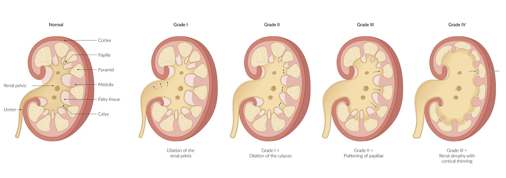

Classification of hydronephrosis

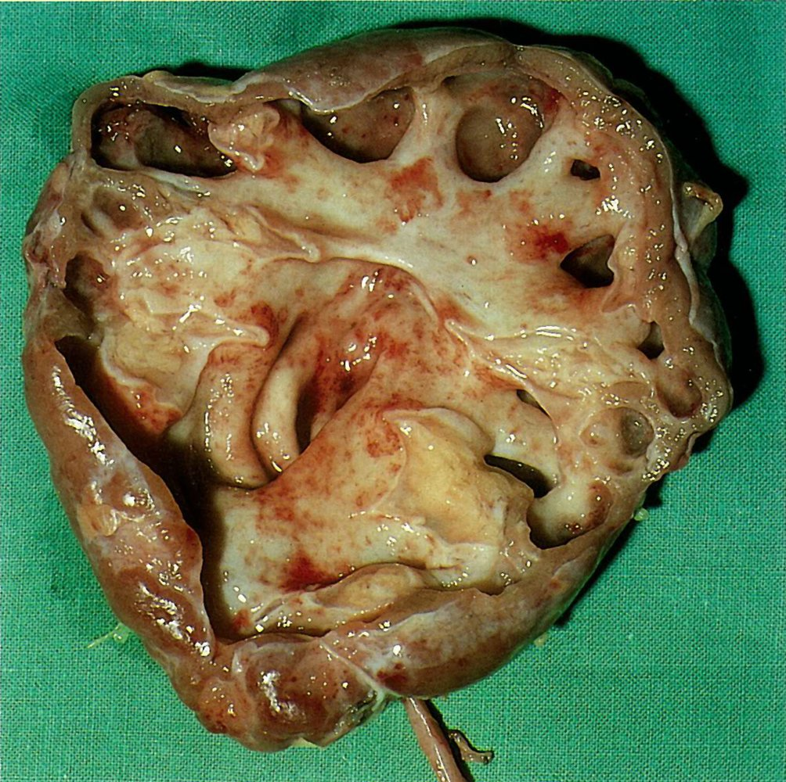

Hydronephrosis grade III-IV in a young patient

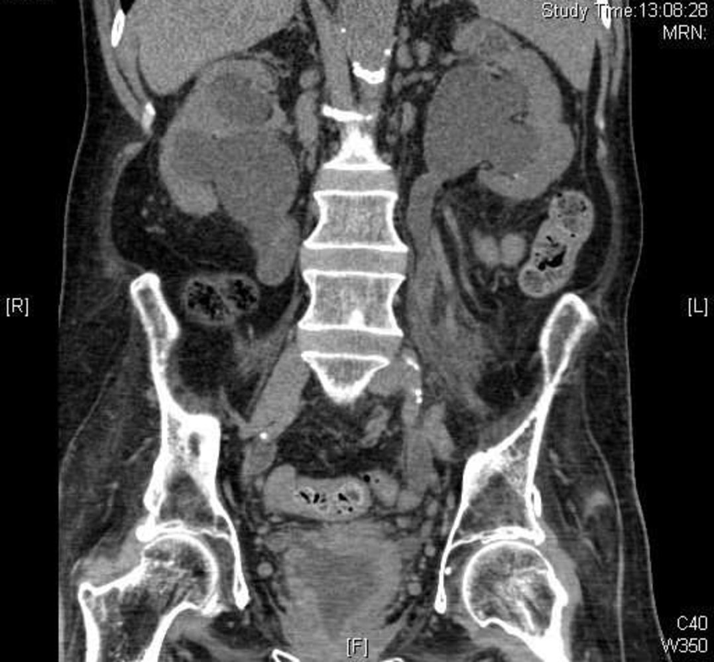

Chronic ureteral obstruction

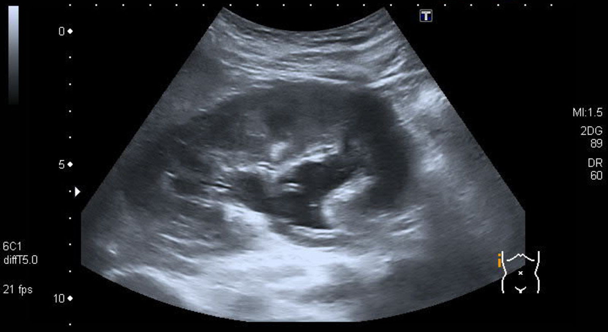

Hydronephrosis (grade 3)

---

## Subtypes and variants

### Urethral stricture

* Definition: narrowing of the <u>urethra</u> with possible restriction of urinary flow

* Etiology 

* Traumatic or <u>iatrogenic</u> (instrumentation/catheterization)

* Post-infectious (e.g., <u>urethritis</u>)

* Congenital

* <u>Idiopathic</u>

* Clinical features [[13]](https://coursology-qbank.com/amboss/article/vlYAA6)

* May be asymptomatic until manifesting with <u>acute urinary retention</u>

* Symptoms of <u>bladder outlet obstruction</u>

* Feeling of incomplete <u>bladder</u> emptying

* Weak stream

* Straining to urinate

* Genitourinary <u>pain</u>

* <u>Urinary tract infections</u>

* Ejaculatory dysfunction

* Diagnostics

* <u>Uroflowmetry</u>: plateau-shaped uroflow curve

* <u>Retrograde urethrography</u>/<u>voiding cystourethrography</u>: visualizes <u>urethral strictures</u>

* <u>Cystourethroscopy</u>: to measure the extent of stenosis

* Treatment

* <u>Internal urethrotomy</u>: endoscopic transurethral approach; <u>incision</u> at 12 o'clock position to release strictures/<u>scar</u> tissue

* Urethroplasty: open reconstruction with excision of the <u>fibrotic</u> <u>urethra</u> and reanastomosis ; indicated if urethrotomy fails

* Permanent urethral <u>stents</u>: placed endoscopically; indicated in patients with short-length strictures

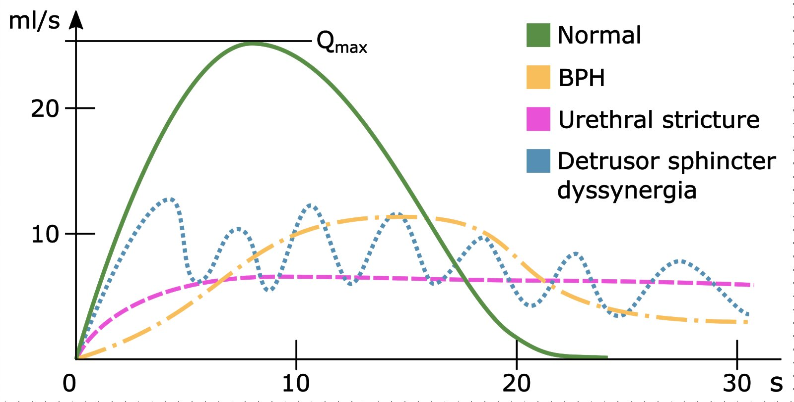

Uroflowmetry

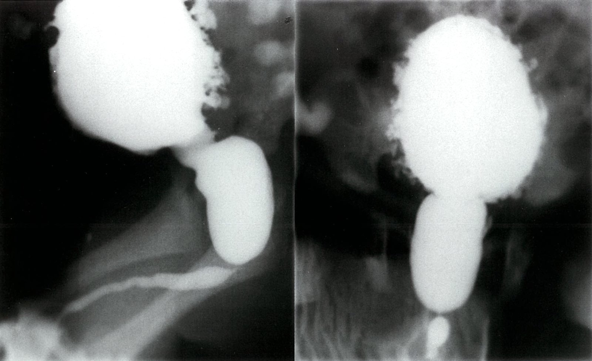

Voiding cystourethrogram in a newborn with proximal congenital urethral stricture

### Ureteropelvic junction obstruction [[14]](https://coursology-qbank.com/amboss/article/pdXLIC)[[15]](https://coursology-qbank.com/amboss/article/JdXsIC)

* Definition: : <u>ureteral stenosis</u> at the junction of the <u>renal pelvis</u> and the <u>ureter</u>

* Etiology 

* Congenital

* Intrinsic: <u>malformation</u> of the <u>smooth muscle</u> of a ureteral segment and consecutive impairment of <u>peristalsis</u> (functional stenosis)

* Extrinsic: aberrant renal pole <u>artery</u> causing <u>proximal</u> <u>ureteral obstruction</u>

* Acquired: factors causing <u>ureteral obstruction</u> (see “Etiology” above)

* Clinical features

* <u>Newborns</u> and <u>infants</u> 

* Palpable upper abdominal mass

* <u>Failure to thrive</u>

* Recurrent <u>pyelonephritis</u>

* Children and adults

* Flank <u>pain</u> or upper abdominal <u>pain</u> that may be triggered or worsened during states of increased diuresis (e.g., after <u>caffeine</u> or <u>alcohol</u> consumption).

* <u>Nausea</u>/<u>vomiting</u>

* Recurrent <u>pyelonephritis</u>

* <u>Hematuria</u>

* Diagnostics

* <u>Ultrasound</u>: <u>hydronephrosis</u>

* <u>IV urography</u>: excludes <u>vesicoureteral reflux</u> and assesses ureteral patency

* <u>Functional renal scintigraphy</u>

* Treatment

* Observation: asymptomatic, mild cases

* <u>Surgery</u>

* Symptomatic patients or those with > 40% loss of renal function

* Anderson-Hynes pyeloplasty: open or <u>laparoscopic</u> resection of the obstructed segment and <u>anastomosis</u> of the <u>ureter</u> to the remaining <u>renal pelvis</u>

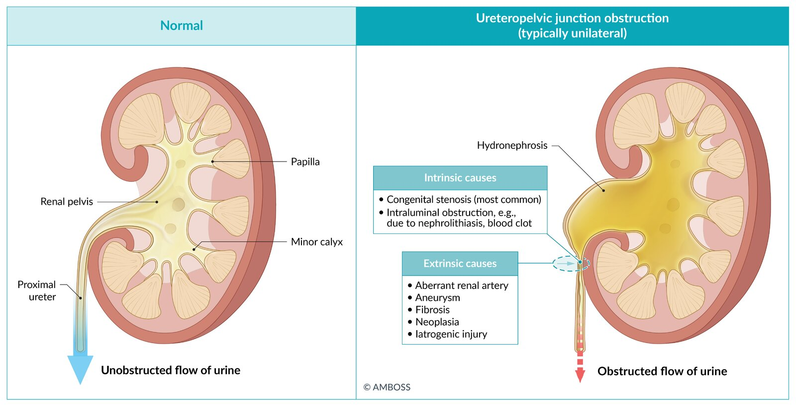

Obstruction of the ureteropelvic junction (UPJ)

---

## Diagnosis

### Approach

* Perform an initial assessment.

* History and <u>physical examination</u>: to identify <u>clinical features of UTO</u> and clues to the <u>cause of UTO</u>

* Bedside <u>postvoid residual</u>: <u>bladder ultrasound</u>, <u>bladder scanner</u>, or <u>bladder catheterization</u> to rule out <u>lower UTO</u>

* <u>Laboratory studies</u>: <u>urinalysis</u>, <u>BMP</u>, and <u>CBC</u>

* Imaging: renal and <u>urinary tract</u> <u>ultrasound</u>

* Consider further studies based on the suspected underlying <u>cause of UTO</u>.

* Consult urology early.

* See also “<u>Diagnosis of urinary retention</u>” and “Diagnostics” in “<u>Hydronephrosis</u>.”

> [!WARNING]
> Do not delay relieving pressure on the <u>urinary tract</u> during the diagnostic workup. Perform <u>bladder catheterization</u> or consult urology for upper <u>urinary tract</u> interventions as indicated. [[11]](https://coursology-qbank.com/amboss/article/WN1PZh0)

> [!TIP]
> Consider screening patients with unexplained <u>AKI</u> for <u>upper UTO</u> using renal and <u>urinary tract</u> <u>ultrasound</u>.

### <u>Laboratory studies</u> [[1]](https://coursology-qbank.com/amboss/article/kIYm1q)[[16]](https://coursology-qbank.com/amboss/article/I70YMh)

* <u>Urinalysis</u>

* <u>Bacteriuria</u>, <u>pyuria</u>: may indicate <u>UTI</u>

* <u>Hematuria</u>: may indicate <u>UTI</u>, <u>malignancy</u>, or <u>nephrolithiasis</u>

* <u>BMP</u>

* ↑ <u>BUN</u>; , ↑ <u>creatinine</u> levels

* <u>Hyperkalemia</u>, <u>acidosis</u>: may indicate <u>renal insufficiency</u>

* <u>CBC</u>

* <u>Leukocytosis</u>: may indicate <u>UTI</u>

* <u>Anemia</u>: acute (e.g., in blood loss) or chronic (e.g., in <u>malignancy</u>, <u>CKD</u>) [[17]](https://coursology-qbank.com/amboss/article/qdXCIC)

> [!TIP]
> Consider further studies (e.g., urine and <u>blood cultures</u> for suspected <u>UTI</u>) based on initial findings.

### Imaging [[1]](https://coursology-qbank.com/amboss/article/kIYm1q)[[18]](https://coursology-qbank.com/amboss/article/azcQrU0)

#### Routine studies

Typical findings include <u>hydronephrosis</u>, <u>hydroureter</u>, and perinephric fluid.

* Renal and <u>urinary tract</u> <u>ultrasound</u>     

* Best initial test for most patients with undifferentiated UTO

* Modality of choice for pregnant individuals and children

* CT abdomen and <u>pelvis</u> 

* Preferred for suspected <u>nephrolithiasis</u>: Stones are usually opaque; density depends on their composition.

* Also indicated if <u>ultrasound</u> is inconclusive

* <u>Kidney, ureter, and bladder x-ray</u>

* Not commonly used

* May detect <u>hydronephrosis</u> or <u>urolithiasis</u>

* <u>MRI</u>: may be used if there are <u>contraindications to CT</u> or for surgical planning

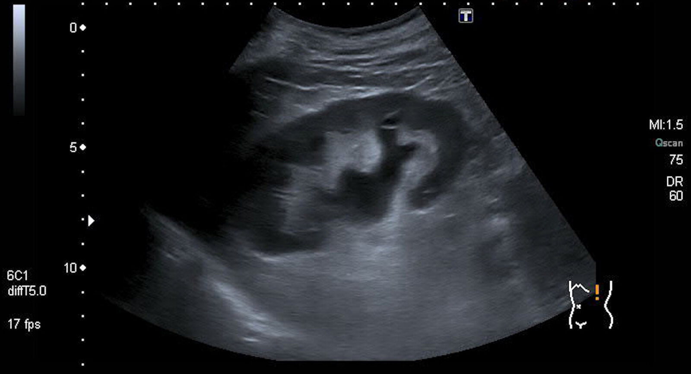

Hydronephrosis

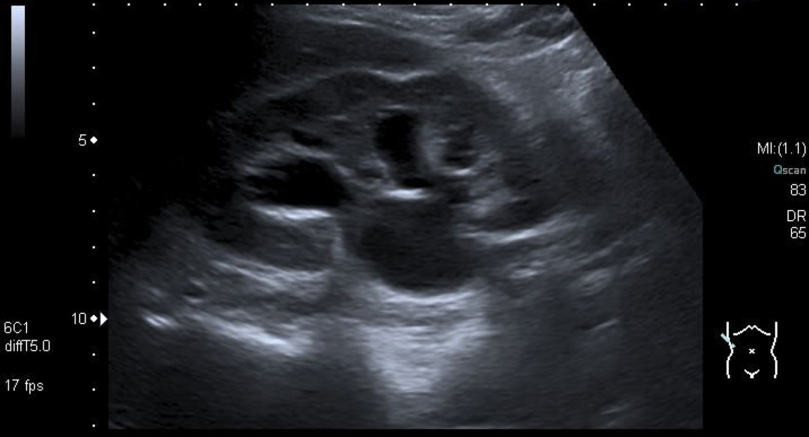

Grade III urinary tract obstruction

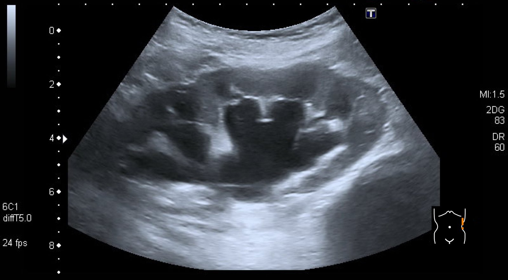

Hydronephrosis

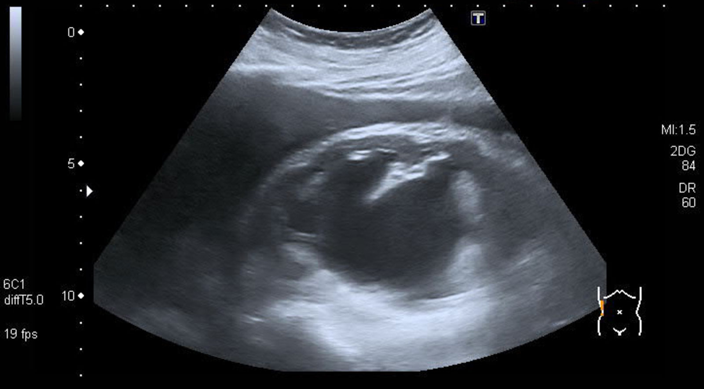

Urinary tract obstruction, grade IV

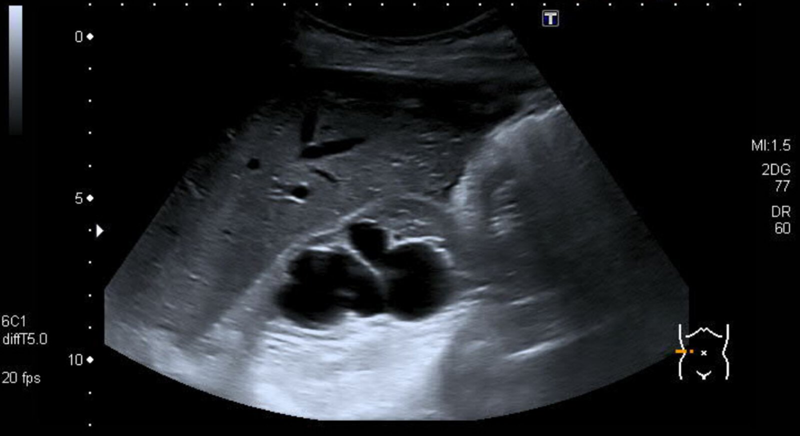

Hydronephrosis (grade 4)

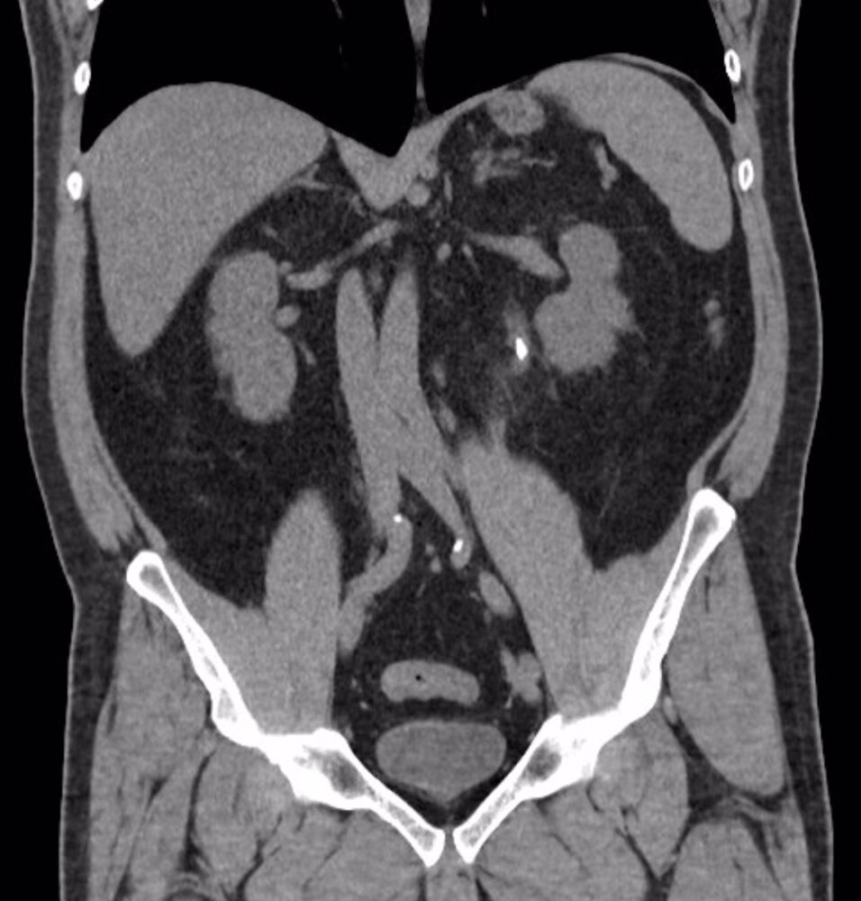

Ureterolithiasis

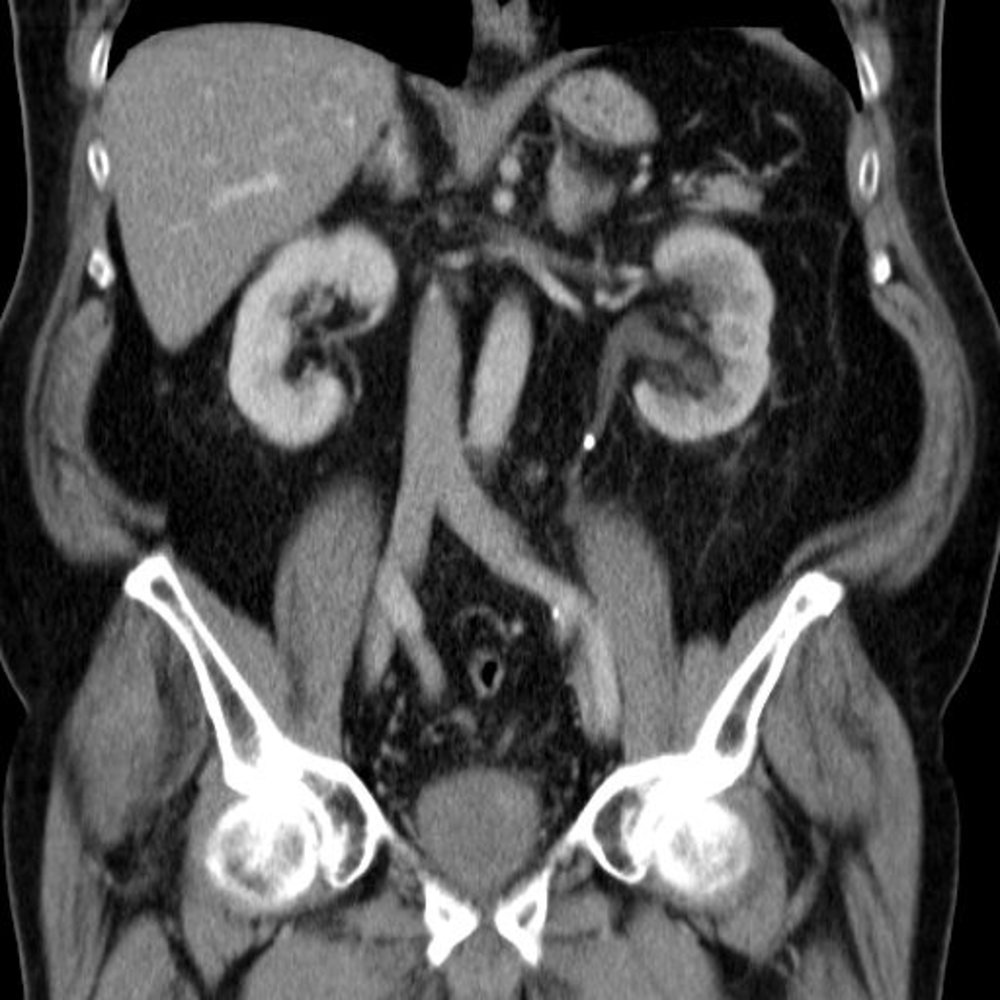

Ureterolithiasis with obstructive uropathy

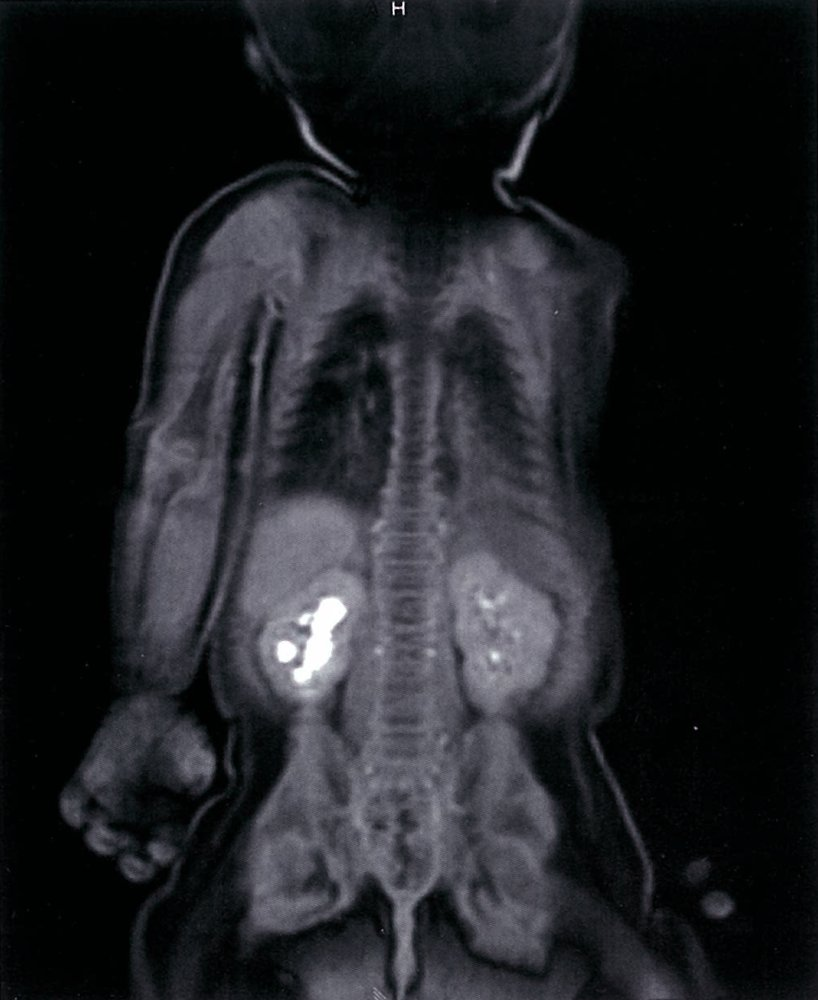

Hydronephrosis of the right kidney

#### Specialized studies

Consider the following studies under specialist guidance for further evaluation of specific suspected causes or if initial testing is inconclusive. See “<u>Imaging techniques in urology</u>” for details.

* <u>Intravenous pyelography</u> (IVP): to determine the degree of <u>hydronephrosis</u> and localize the obstruction

* <u>Retrograde pyelography</u>: to confirm a diagnosis of <u>ureteropelvic junction obstruction</u>

* <u>Renal scintigraphy</u>: to evaluate <u>kidney function</u> and predict recovery following relief of the UTO

* <u>Cystoscopy</u>: <u>gold-standard</u> diagnostic study for <u>bladder cancer</u>

* <u>Voiding cystourethrography</u>: to evaluate for <u>vesicoureteral reflux</u>

* <u>Urodynamic studies</u>: to evaluate for <u>neurogenic bladder</u>

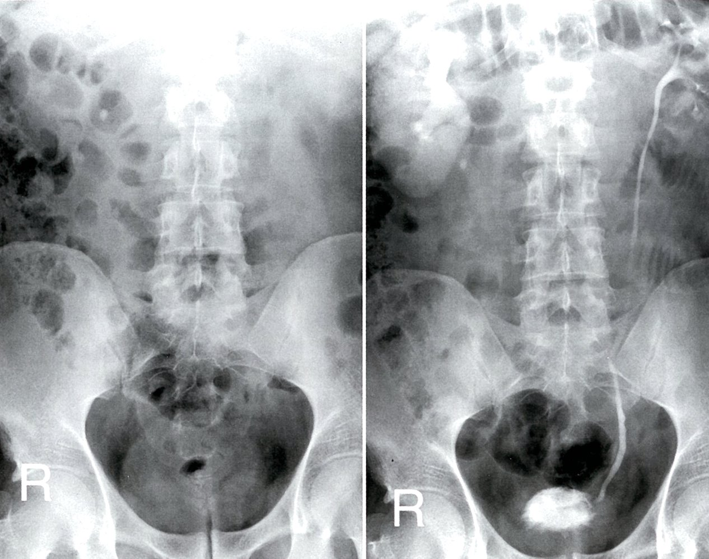

Obstructing ureteral calculus

---

## Treatment

UTO accompanied by <u>acute kidney injury</u>, <u>signs of sepsis</u>, refractory <u>pain</u>, <u>dehydration</u> (due to <u>nausea and vomiting</u>), or <u>anuria</u> (suggesting complete UTO) is a <u>medical emergency</u>. Prompt drainage of the <u>urinary tract</u> is indicated to prevent severe complications.

### Management of upper UTO [[11]](https://coursology-qbank.com/amboss/article/WN1PZh0)[[18]](https://coursology-qbank.com/amboss/article/azcQrU0)[[19]](https://coursology-qbank.com/amboss/article/Tw16RQ0)

* Consult urology for definitive management.

* <u>Ureteral stenting</u>: to drain fluid from the <u>renal pelvis</u> into the <u>bladder</u>

* <u>Percutaneous nephrostomy</u>: if a <u>ureteral stent</u> cannot be placed or patients have complete UTO and concomitant infection  [[20]](https://coursology-qbank.com/amboss/article/aM0QMg)

* Provide <u>supportive care for urinary tract obstruction</u>.

> [!TIP]
> Nephroureterectomy may be performed if the involved <u>kidney</u> is nonfunctional. [[21]](https://coursology-qbank.com/amboss/article/qAcCkU0)

### Management of lower UTO [[22]](https://coursology-qbank.com/amboss/article/oO10tS0)[[23]](https://coursology-qbank.com/amboss/article/AN1Rdh0)

* Initiate <u>treatment of urinary retention</u> (<u>bladder catheterization</u>).

* Provide <u>supportive care for urinary tract obstruction</u>.

* Monitor for <u>postobstructive diuresis</u>.

### Supportive care for urinary tract obstruction

* <u>Analgesics</u> [[24]](https://coursology-qbank.com/amboss/article/cY1aL20)[[25]](https://coursology-qbank.com/amboss/article/mVXVEC)

* <u>NSAIDs</u>, e.g., <u>ketorolac</u> DOSAGE

* <u>Opioids</u>, e.g., <u>morphine</u> DOSAGE

* Consider <u>antibiotic prophylaxis</u>, e.g., prior to invasive procedures. [[18]](https://coursology-qbank.com/amboss/article/azcQrU0)

### Treatment of the underlying cause

See “<u>Etiology of urinary tract obstruction</u>” and the respective articles (e.g., <u>benign prostatic hyperplasia</u>) for details. See “<u>Treatment of urinary retention</u>” for the management of functional obstruction.

* <u>Nephrolithiasis</u>: : Management includes <u>conservative therapy</u>;  and/or procedures to enhance stone expulsion or removal; , e.g., <u>shock wave lithotripsy</u>; , <u>ureteroscopy</u> (See “<u>Treatment of nephrolithiasis</u>” for details).

* <u>Urinary bladder tamponade</u>

* Insert a <u>three-way Foley catheter</u>.

* Perform <u>continuous bladder irrigation</u> to dissolve blood clots.

* Consult urology for definitive management.

* <u>Ureteral stricture</u>: Stricture length is predictive of outcome after treatment.

* Transluminal balloon dilation with or without <u>stent</u> placement: for short, nonischemic strictures

* <u>Endoureterotomy</u>

* After unsuccessful <u>balloon dilation</u>

* For all types of strictures except short, nonischemic strictures

* <u>Laparoscopic</u> or open <u>surgery</u>: if <u>balloon dilation</u> and <u>endoureterotomy</u> are unsuccessful

* <u>Urothelial carcinoma</u>: See “Treatment” in “<u>Urinary tract cancer</u>.”

* <u>Meatal stenosis</u>: dilatation or meatoplasty

* <u>Pregnancy</u>

* Asymptomatic with no infection: <u>expectant management</u>; most UTOs will resolve spontaneously after delivery

* Presence of infection: See “<u>UTI in pregnancy</u>.”

### Disposition [[23]](https://coursology-qbank.com/amboss/article/AN1Rdh0)

* Consider admission for patients with neurological deficits, refractory <u>pain</u>, <u>upper UTO</u>, or <u>complications of UTO</u> (e.g., <u>urosepsis</u>, <u>AKI</u>).

* Stable patients with <u>lower UTO</u>: After <u>bladder</u> decompression, consider discharge with an indwelling catheter for outpatient urology follow-up.

---

## Complications

* <u>Pyelonephritis</u> and <u>perinephric abscess</u>

* Obstructive nephropathy: renal impairment caused by UTO

* <u>Nephrolithiasis</u>

* <u>Bladder</u> trabeculation and <u>pseudodiverticula</u> formation

* <u>Acute kidney injury</u>

> [!WARNING]
> UTO increases the risk of <u>urolithiasis</u> and <u>UTIs</u> progressing to <u>urosepsis</u>.

We list the most important complications. The selection is not exhaustive.

---