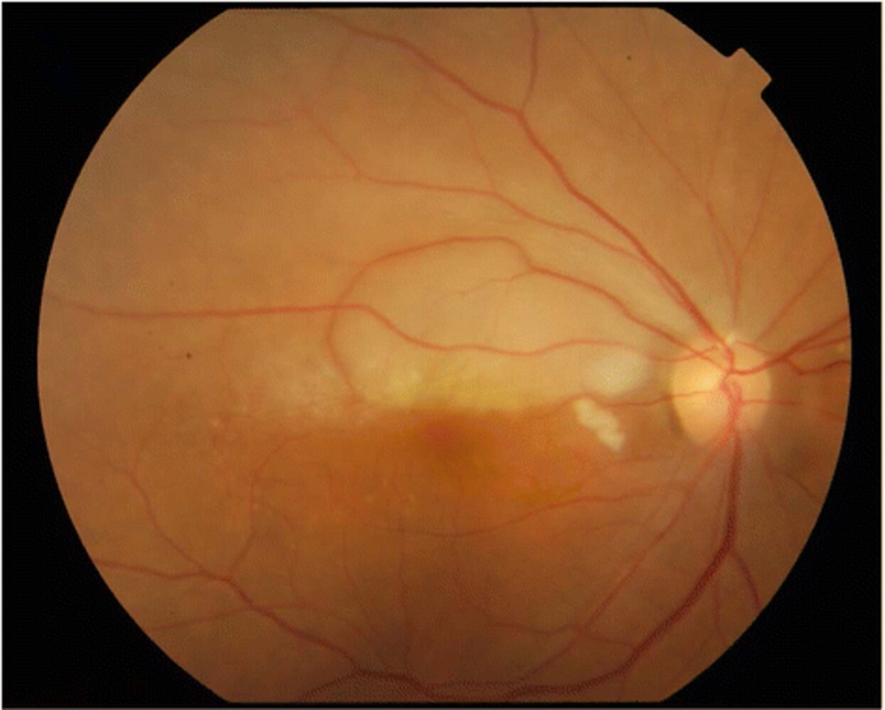
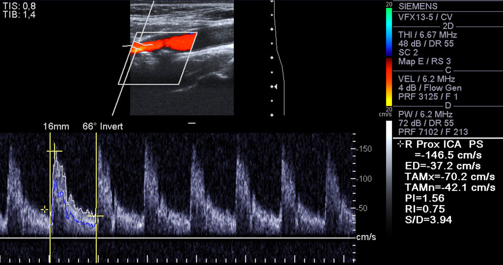
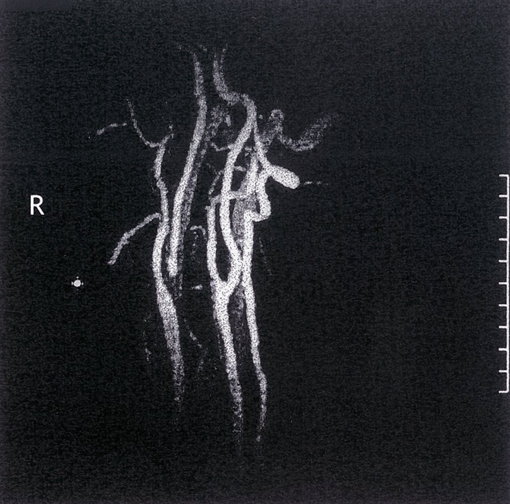
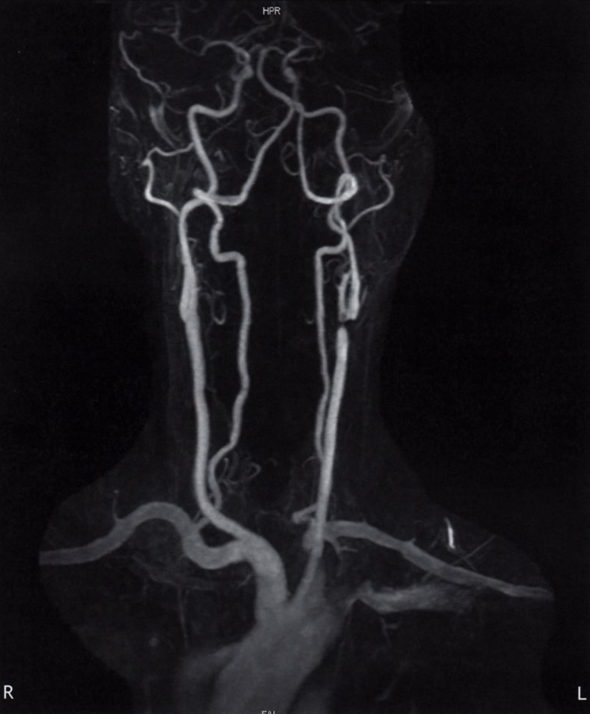
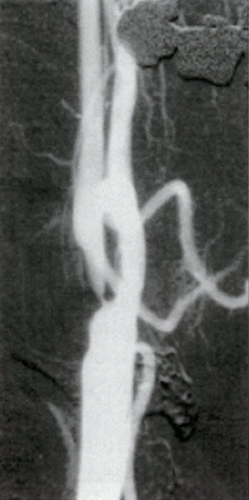
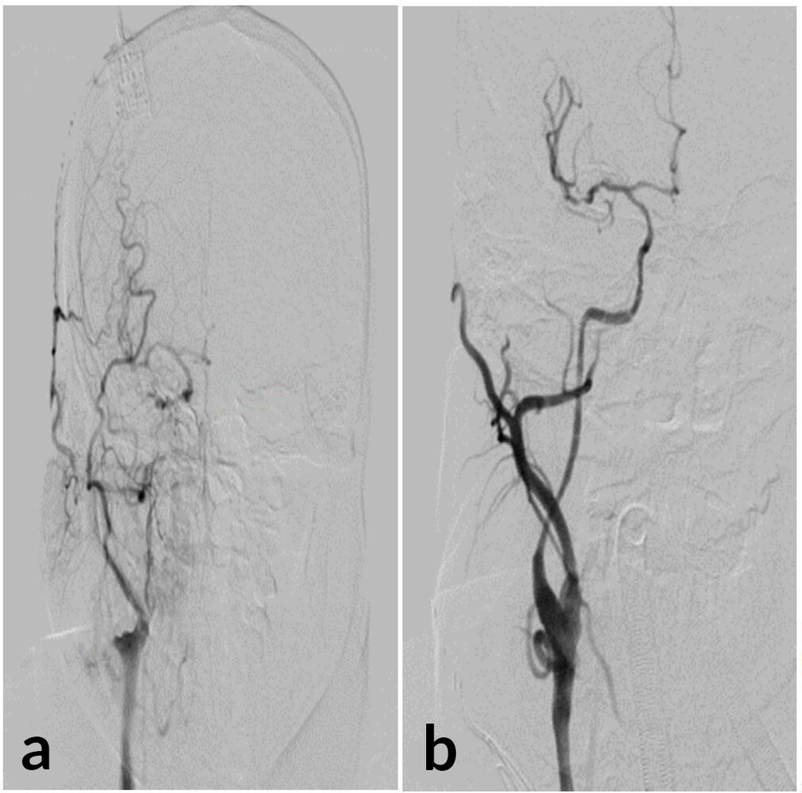
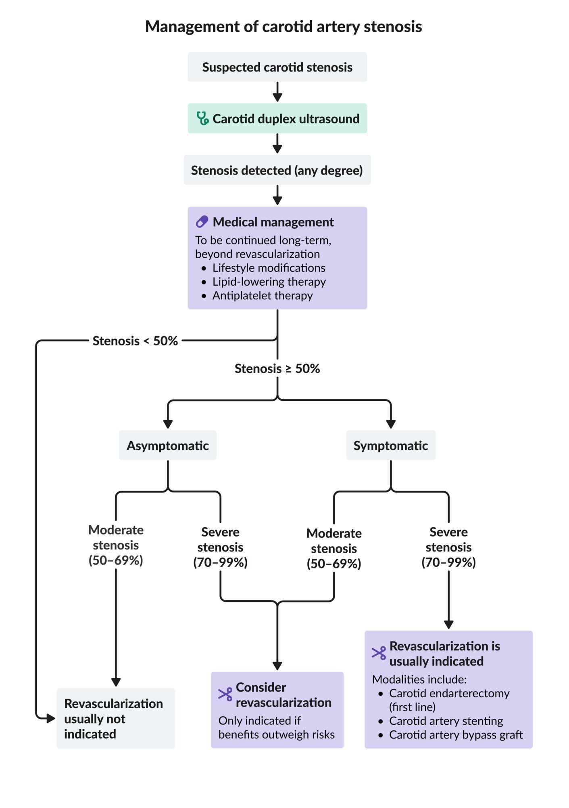

# Carotid artery stenosis

*Categories: Clinical knowledge > Surgery > Vascular surgery > Carotid artery stenosis*

[Original Article Link](https://coursology-qbank.com/amboss/article/ko0mXS)

---

## Summary

Carotid <u>artery</u> stenosis (<u>CAS</u>) is an atherosclerotic, degenerative disease of the <u>common carotid artery</u> and <u>internal carotid artery</u>. <u>Risk factors</u> include advanced age, tobacco use, <u>arterial hypertension</u>, and <u>diabetes mellitus</u>. Depending on the extent of stenosis, <u>ischemia</u> in the carotid <u>perfusion</u> territory can result in <u>amaurosis fugax</u>, <u>transient ischemic attack</u> (<u>TIA</u>), or <u>stroke</u>. <u>Carotid duplex</u> <u>ultrasonography</u> is the initial test of choice for evaluating the carotid <u>artery</u> and measuring the degree of stenosis. Management depends on the degree of stenosis and patient factors (e.g., life-expectancy, comorbidities). Lifestyle modifications, antiplatelet and <u>statin</u> therapy, and <u>risk factor</u> modifications (e.g., with <u>antihypertensive therapy</u>) are recommended for all patients and should be continued indefinitely. <u>Carotid revascularization</u> is recommended for <u>severe carotid stenosis</u> and may be considered for <u>moderate carotid stenosis</u> if the periprocedural risks are acceptable. <u>Screening for asymptomatic carotid stenosis</u> is controversial.

---

## Etiology

* <u>Atherosclerosis</u>

* <u>Risk factors for cardiovascular disease</u>

* Advanced age

* Tobacco use

* <u>Arterial hypertension</u>

* <u>Diabetes mellitus</u>

---

## Clinical features

* Many patients are asymptomatic.

* Symptomatic patients may present with

* <u>Transient ischemic attacks</u>

* Symptoms of <u>ischemia</u> of the <u>common carotid artery</u> territory, such as:

* <u>Ipsilateral</u> <u>amaurosis fugax</u>

* <u>Contralateral</u> <u>weakness</u>, <u>contralateral</u> sensory deficits (<u>ischemic stroke</u>)

* Examination findings

* Carotid bruit: a pathologic sound heard on <u>auscultation</u> over the carotid <u>artery</u> that is caused by <u>turbulent blood flow</u>  [[1]](https://coursology-qbank.com/amboss/article/C4cqlc0)

* <u>Hollenhorst plaque</u> on <u>fundoscopy</u>  [[2]](https://coursology-qbank.com/amboss/article/1sX2Fz)

Hollenhorst plaque causing branch retinal artery occlusion (BRAO)

> [!NOTE]
> Carotid <u>artery</u> stenosis does not typically cause <u>vertigo</u>, <u>lightheadedness</u>, or <u>syncope</u>.

---

## Diagnosis

### General principles  [[3]](https://coursology-qbank.com/amboss/article/wXchZY0)[[4]](https://coursology-qbank.com/amboss/article/w0YhRn)[[5]](https://coursology-qbank.com/amboss/article/06Xej_)

* Evaluate for and manage acute neurological symptoms.

* <u>Ischemic stroke</u> (<u>anterior</u> circulation <u>stroke</u>): See “<u>Acute management checklist for ischemic stroke</u>.”

* <u>TIA</u>: See “<u>Acute management checklist for TIA</u>.”

* Perform carotid <u>artery</u> imaging in all patients with <u>symptomatic carotid stenosis</u>.

* Clinically significant carotid stenosis: narrowing of the carotid <u>artery</u> ≥ 50%

* Moderate carotid stenosis: narrowing of the carotid <u>artery</u> by 50%–69%

* Severe carotid stenosis: narrowing of the carotid <u>artery</u> 70%–99%

* <u>Screening for asymptomatic carotid stenosis</u> is controversial and is detailed in the “Prevention” section below.

> [!TIP]
> Noncontrast CT head or <u>MRI</u> <u>brain</u> is indicated for all patients with <u>ischemic stroke</u> or <u>TIA</u>.

> [!TIP]
> Carotid <u>artery</u> stenosis typically occurs within 2 cm of the <u>common carotid artery</u> bifurcation. [[6]](https://coursology-qbank.com/amboss/article/3NcSa10)

### Carotid duplex ultrasound (<u>CDUS</u>)

<u>CDUS</u> permits direct visualization of the vessel wall and flow measurement at the site of the stenosis by <u>color Doppler ultrasound</u>.

* Indications: first-line imaging modality for suspected <u>symptomatic carotid stenosis</u>  [[7]](https://coursology-qbank.com/amboss/article/mt0VV3)[[8]](https://coursology-qbank.com/amboss/article/FqbgZE)

* Findings [[4]](https://coursology-qbank.com/amboss/article/w0YhRn)[[6]](https://coursology-qbank.com/amboss/article/3NcSa10)[[9]](https://coursology-qbank.com/amboss/article/3OcSHc0)

* Focally increased <u>velocity</u> of blood flow (high-grade stenosis) or absence of blood flow (total occlusion)  [[10]](https://coursology-qbank.com/amboss/article/2-bT9w)

* Increased peak systolic <u>velocity</u>

* Increased thickness of the <u>intima</u>-media

Internal carotid stenosis

### <u>Magnetic resonance angiography</u> (<u>MRA</u>) or <u>CT angiography</u> (<u>CTA</u>)

* Indications [[4]](https://coursology-qbank.com/amboss/article/w0YhRn)

* <u>Confirmatory test</u> if <u>CDUS</u> findings are suggestive of carotid stenosis

* Simultaneous evaluation of head and neck vessels in patients with <u>ischemic stroke</u> [[11]](https://coursology-qbank.com/amboss/article/RwbliD)

* Findings [[8]](https://coursology-qbank.com/amboss/article/FqbgZE)

* Luminal narrowing at the site of the stenosis

* Carotid <u>plaques</u> and calcification

* Additional considerations

* The advantages of <u>MRA</u> include the lack of <u>ionizing radiation</u> and iodinated IV contrast.

* <u>MRA</u> has a tendency to overestimate the degree of stenosis. [[4]](https://coursology-qbank.com/amboss/article/w0YhRn)

* <u>CTA</u> is suitable for patients with <u>contraindications for MRI</u> (e.g., implanted devices, <u>claustrophobia</u>). [[8]](https://coursology-qbank.com/amboss/article/FqbgZE)

Right internal carotid artery stenosis

Carotid stenosis

External carotid artery stenosis

Carotid artery stenosis

### <u>Digital subtraction angiography</u> (<u>DSA</u>)

<u>DSA</u> is commonly considered the <u>gold standard</u> for evaluating <u>CAS</u>. [[5]](https://coursology-qbank.com/amboss/article/06Xej_)[[8]](https://coursology-qbank.com/amboss/article/FqbgZE)[[12]](https://coursology-qbank.com/amboss/article/hNcca10)

* Indications [[4]](https://coursology-qbank.com/amboss/article/w0YhRn)

* Consider if <u>CDUS</u> is inconclusive in patients who cannot undergo <u>CTA</u> or <u>MRA</u>.

* Preprocedural planning (i.e., before <u>carotid endarterectomy</u> or <u>carotid artery stenting</u>)

* Findings: Similar to <u>CTA</u> or <u>MRA</u>

* Important consideration: <u>DSA</u> is an invasive procedure with a higher risk of mortality and <u>stroke</u> than imaging modalities with comparable diagnostic <u>accuracy</u> (e.g., <u>CTA</u>).

Internal carotid artery stenosis before and after intervention

---

## Treatment

### General principles  [[3]](https://coursology-qbank.com/amboss/article/wXchZY0)[[4]](https://coursology-qbank.com/amboss/article/w0YhRn)[[13]](https://coursology-qbank.com/amboss/article/VQcGEX0)

* All patients: Initiate <u>long-term management of ASCVD</u>.

* <u>Symptomatic carotid stenosis</u>: <u>Revascularization</u> is typically indicated.

* <u>Asymptomatic carotid stenosis</u>: Consider <u>revascularization</u> for patients with <u>severe carotid stenosis</u>.  [[10]](https://coursology-qbank.com/amboss/article/2-bT9w)

* Bilateral carotid stenosis is uncommon; management is similar to that of unilateral carotid stenosis. [[14]](https://coursology-qbank.com/amboss/article/FqcgZd0)

* Consult specialists as needed.

Management of carotid artery stenosis

### Medical management of carotid artery stenosis[[3]](https://coursology-qbank.com/amboss/article/wXchZY0)[[15]](https://coursology-qbank.com/amboss/article/vqcAZd0)

Carotid stenosis is a type of <u>ASCVD</u> and measures to prevent further progression of <u>atherosclerosis</u> should be initiated in all patients and continued indefinitely (i.e., even after <u>carotid revascularization</u>).

* <u>Lifestyle modifications for ASCVD prevention</u>, e.g., <u>smoking cessation</u>, <u>heart</u>-healthy diet

* Lipid-lowering therapy: long-term <u>high-intensity statin therapy</u> [[16]](https://coursology-qbank.com/amboss/article/4qc3AW0)

* Long-term <u>antiplatelet therapy</u>

* <u>Asymptomatic carotid stenosis</u>: single-agent <u>antiplatelet therapy</u> with <u>aspirin</u> DOSAGE [[3]](https://coursology-qbank.com/amboss/article/wXchZY0)

* <u>Symptomatic carotid stenosis</u>

* Medical management alone  or after <u>carotid endarterectomy</u>: single-agent <u>antiplatelet therapy</u> (e.g., <u>aspirin</u> DOSAGE OR <u>clopidogrel</u> DOSAGE) [[4]](https://coursology-qbank.com/amboss/article/w0YhRn)

* After <u>carotid artery stenting</u>: short course of <u>dual antiplatelet therapy</u> (e.g., <u>clopidogrel</u> DOSAGE PLUS <u>aspirin</u> DOSAGE for 1 month), followed by long-term single-agent <u>antiplatelet therapy</u> with <u>aspirin</u> DOSAGE [[4]](https://coursology-qbank.com/amboss/article/w0YhRn)

* Manage <u>modifiable risk factors for ASCVD</u> (e.g., <u>management of diabetes mellitus</u>, <u>management of hypertension</u>).

* See “<u>Management of ASCVD</u>” and “<u>Reducing subsequent stroke risk</u>” for further details.

### Carotid revascularization

#### Overview [[3]](https://coursology-qbank.com/amboss/article/wXchZY0)[[15]](https://coursology-qbank.com/amboss/article/vqcAZd0)[[17]](https://coursology-qbank.com/amboss/article/UQcbvX0)

* Timing: ideally performed within 14 days of symptom onset

* Periprocedural optimization: e.g., <u>beta blockers</u> to control blood pressure, initiate <u>statin</u> therapy, withhold <u>clopidogrel</u> as needed  [[4]](https://coursology-qbank.com/amboss/article/w0YhRn)[[16]](https://coursology-qbank.com/amboss/article/4qc3AW0)

* Indications  : Periprocedural risk and patient life-expectancy, comorbidities, and preferences must also be considered. [[3]](https://coursology-qbank.com/amboss/article/wXchZY0)[[10]](https://coursology-qbank.com/amboss/article/2-bT9w)[[18]](https://coursology-qbank.com/amboss/article/g5cFj10)

* <u>Symptomatic carotid stenosis</u> [[17]](https://coursology-qbank.com/amboss/article/UQcbvX0)

* <u>Severe carotid stenosis</u>: <u>Revascularization</u> is indicated if <u>life expectancy</u> is ≥ 2 years and if the operator's risk of procedural <u>morbidity</u> and mortality is < 6%. [[15]](https://coursology-qbank.com/amboss/article/vqcAZd0)

* <u>Moderate carotid stenosis</u>: The benefit of <u>revascularization</u> depends on patient-specific factors

* Asymptomatic patients with <u>severe carotid stenosis</u>: Consider <u>revascularization</u> if the operator's risk of procedural <u>morbidity</u> and mortality risk is low (< 3%). [[4]](https://coursology-qbank.com/amboss/article/w0YhRn)[[17]](https://coursology-qbank.com/amboss/article/UQcbvX0)

* Contraindications  [[3]](https://coursology-qbank.com/amboss/article/wXchZY0)[[18]](https://coursology-qbank.com/amboss/article/g5cFj10)

* Carotid stenosis < 50%

* Chronic complete carotid occlusion

* Severely disabling <u>stroke</u>

#### Modalities [[4]](https://coursology-qbank.com/amboss/article/w0YhRn)[[13]](https://coursology-qbank.com/amboss/article/VQcGEX0)[[17]](https://coursology-qbank.com/amboss/article/UQcbvX0)

<u>Carotid endarterectomy</u> (<u>CEA</u>) is usually considered the first-line treatment for carotid stenosis. If the patient is not a good candidate for <u>surgery</u> or the lesion characteristics preclude surgical treatment, <u>carotid artery stenting</u> may be preferred.

* Carotid endarterectomy: a surgical procedure in which the inner lining of a carotid <u>artery</u> is removed, along with any associated atherosclerotic deposits

* Advantages: lower periprocedural <u>stroke</u> rate than <u>carotid artery stenting</u>, especially in patients > 70 years of age [[5]](https://coursology-qbank.com/amboss/article/06Xej_)[[15]](https://coursology-qbank.com/amboss/article/vqcAZd0)

* Disadvantages

* Higher risk of periprocedural <u>myocardial infarction</u> than <u>stenting</u>

* Potential complications include <u>cranial nerve</u> palsy.

* Potentially difficult in patients with prior neck <u>irradiation</u> and/or <u>surgery</u>

* Carotid artery stenting: <u>angioplasty</u> and <u>stenting</u> of the carotid <u>artery</u> (via a transfemoral or transcarotid approach)

* Advantages: an alternative to <u>surgery</u> in patients with poor surgical access or increased risk of perioperative complications  [[5]](https://coursology-qbank.com/amboss/article/06Xej_)

* Disadvantages: higher risk of periprocedural <u>stroke</u> than <u>CEA</u>

* Carotid <u>artery</u> bypass grafting: Uncommonly required; may be considered for recurrent or bilateral <u>severe carotid stenosis</u>. [[14]](https://coursology-qbank.com/amboss/article/FqcgZd0)[[19]](https://coursology-qbank.com/amboss/article/8qcOZd0)

---

## Prevention

Recommendations for the <u>screening for asymptomatic carotid stenosis</u> vary. As of 2021, the <u>US Preventive Services Task Force</u> (<u>USPSTF</u>) recommends against screening for asymptomatic individuals, including those with <u>cardiovascular risk factors</u> and <u>carotid bruits</u>. However, other guidelines suggest <u>screening for carotid stenosis</u> in asymptomatic individuals with a <u>carotid bruit</u> and/or <u>risk factors for cardiovascular disease</u> who are potential candidates for carotid intervention.

* Indications: Consider <u>screening for asymptomatic carotid stenosis</u> in individuals with any of the following [[1]](https://coursology-qbank.com/amboss/article/C4cqlc0)[[4]](https://coursology-qbank.com/amboss/article/w0YhRn)[[18]](https://coursology-qbank.com/amboss/article/g5cFj10)

* <u>Carotid bruit</u> (controversial)

* Known <u>atherosclerotic cardiovascular disease</u>

* Known <u>peripheral vascular disease</u>

* Individuals ≥ 65 years of age with multiple <u>risk factors for cardiovascular disease</u>

* Prior to a <u>CABG</u>

* Screening modalities: noninvasive imaging is preferred (e.g., <u>CDUS</u>, <u>CTA</u>, <u>MRA</u>) [[8]](https://coursology-qbank.com/amboss/article/FqbgZE)

* Management: See “Treatment” section for details if significant (≥ 50%) <u>asymptomatic carotid stenosis</u> is detected on screening.

---