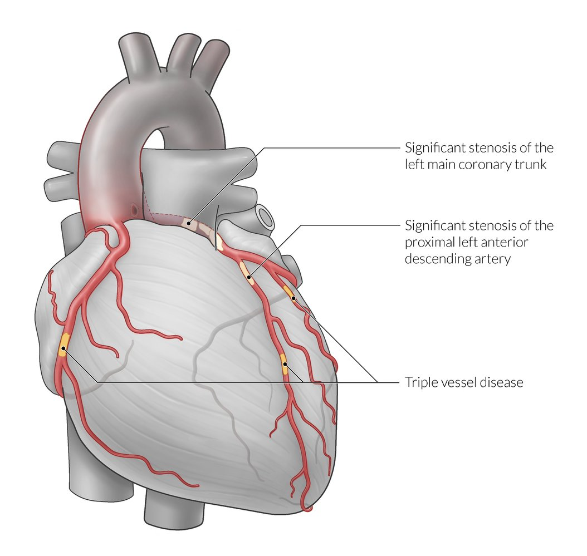
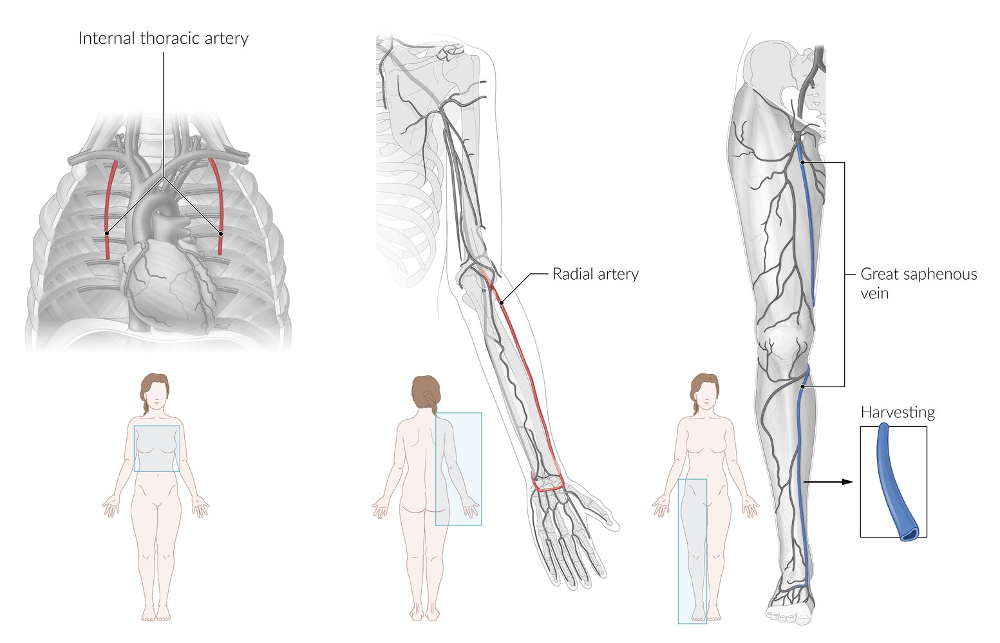
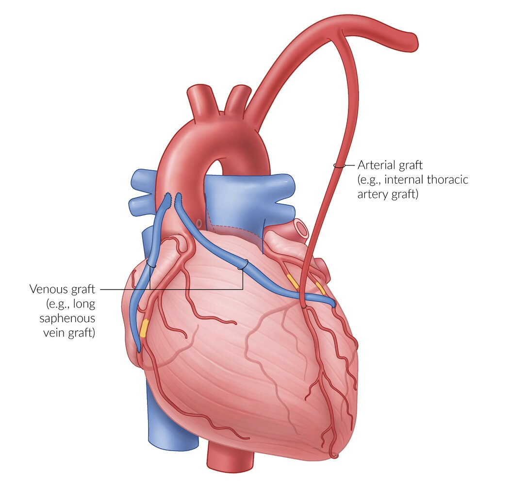
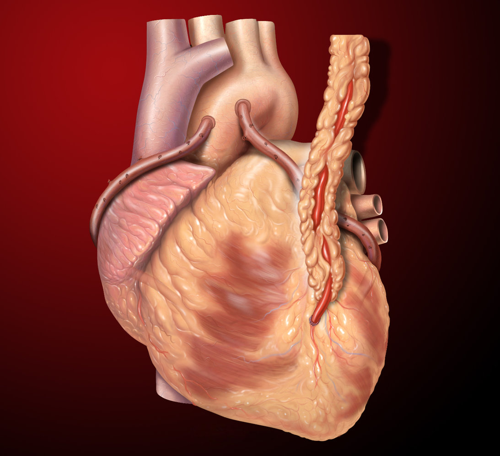
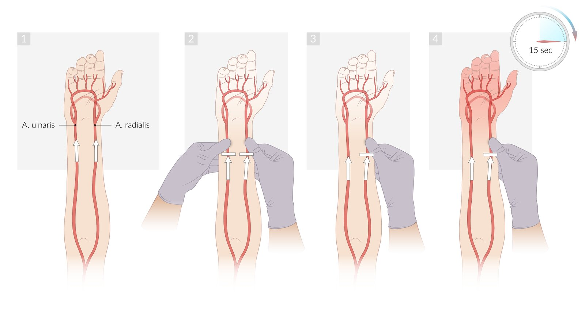

# Coronary artery bypass grafting

*Categories: Clinical knowledge > Surgery > Vascular surgery > Coronary artery bypass grafting*

[Original Article Link](https://coursology-qbank.com/amboss/article/6l0jBT)

---

## Summary

<u>Coronary artery</u> bypass grafting (or CABG) is a <u>cardiac revascularization</u> technique used to treat patients with significant, symptomatic stenosis of the <u>coronary artery</u> (or its branches). The stenosed segment is bypassed using an arterial (e.g., <u>internal thoracic artery</u>) or venous (e.g., <u>great saphenous vein</u>) <u>autograft</u>, re-establishing blood flow to the <u>ischemic</u> areas of the <u>myocardium</u>. This may be performed either with the help of a <u>heart</u>-<u>lung</u> bypass machine (traditional CABG, performed via a <u>thoracotomy</u>), or on a beating <u>heart</u> (off-pump CABG, and minimally invasive direct CABG). In addition to general surgical risks, the main complications associated with bypass grafting are bypass occlusion and <u>postpericardiotomy syndrome</u>. The procedure provides more effective symptom relief than medical management and is superior to <u>PCI</u> in multivessel coronary disease.

---

## Indications

Indication for CABG is established after careful consideration of the clinical features, <u>coronary catheterization</u> findings, cardiac function, and the patient's general condition.

* High-grade left main stem <u>coronary artery stenosis</u>

* Significant stenosis (> 70%) of the <u>proximal</u> <u>left anterior descending artery</u>, with 2-vessel or 3-vessel disease

* Symptomatic 2-vessel or 3-vessel disease

* Disabling <u>angina</u> despite maximal medical therapy

* Poor <u>left ventricular</u> function with <u>myocardium</u> that can return to function on <u>revascularization</u>

* Postinfarct <u>angina</u>

* Indications for emergency CABG

* Non-ST segment elevation <u>myocardial infarction</u> with ongoing <u>ischemia</u> that is unresponsive to medical therapy/<u>PCI</u>

* <u>STEMI</u> with inadequate response to all nonsurgical therapy

* Significant ongoing <u>ischemia</u>, traumatic complications, or threatened occlusion in <u>STEMI</u>, after a failed <u>PCI</u> or previous CABG

Main indications for coronary artery bypass grafting

---

## Technique/steps

* <u>Perioperative management of antiplatelet therapy in patients undergoing CABG</u> [[2]](https://coursology-qbank.com/amboss/article/qGdCZ70)[[3]](https://coursology-qbank.com/amboss/article/mycVfU0)

* Management should be individualized in consultation with cardiology and cardiothoracic <u>surgery</u>.

* <u>Aspirin</u>: Continue if already taking; do not initiate preoperatively.

* Urgent CABG: Hold <u>P2Y12 inhibitors</u> for ≥ 24 hours before <u>surgery</u> if feasible.

* Elective CABG
 • <u>Clopidogrel</u>: Hold for 5 days before <u>surgery</u>.
 • <u>Ticagrelor</u>: Hold for 3–5 days before <u>surgery</u>.
 • <u>Prasugrel</u>: Hold for 7 days before <u>surgery</u>.
 • Short-acting <u>glycoprotein IIb/IIIa inhibitors</u> (<u>eptifibatide</u>, <u>tirofiban</u>): Hold 4 hours before <u>surgery</u>.

* Postoperative: Resume <u>P2Y12 inhibitors</u> 24–72 hours after <u>surgery</u> based on bleeding risk.

* Overview of steps
* <u>Thoracotomy</u> via a midline <u>sternotomy</u> → <u>cardiopulmonary bypass</u>;  (<u>heart</u>-<u>lung</u> machine) → cardioplegic arrest of the <u>heart</u> → <u>anastomosis</u> of the bypass vessels <u>distal</u> to the <u>coronary artery stenosis</u> using <u>autologous</u> vessels

* Types of grafts

* Arterial graft 

* <u>Internal thoracic artery</u> (<u>internal mammary artery</u>)

* Good accessibility, close proximity to the <u>heart</u>

* Left thoracic <u>artery</u> is suitable for bridging stenoses in the <u>left anterior descending artery</u> due to their close spatial proximity.

* <u>Radial artery</u>: Perform <u>modified Allen test</u> before CABG.

* Venous graft (aortocoronary saphenous vein bypass, or ACVB)

* <u>Great saphenous vein</u> (first choice in <u>vein</u> bypass grafts because of good surgical access to the long, <u>superficial</u> leg <u>vein</u> with suitable vessel cross-section)

* <u>Small saphenous vein</u>

* Types of CABG

* Traditional CABG

* Off-pump <u>coronary artery</u> bypass (OPCAB) <u>surgery</u>

* Minimally invasive direct, or totally endoscopic CABG

* Alternate procedure: <u>percutaneous coronary intervention</u> (<u>PCI</u>)

* Advantages: decreased periprocedural <u>morbidity</u>, decreased cost, decreased hospital stay

* Disadvantages: higher rate of patients requiring reintervention

* CABG is proven to be a superior long-term form of <u>revascularization</u> in high-risk multivessel disease (diabetics or low LV function), certain cases of severe two-vessel <u>CAD</u>, and in all patients with three-vessel <u>CAD</u>.

* <u>PCI</u> is preferred in cases with symptomatic low-risk obstruction (single vessel, mild double vessel obstruction).

> [!NOTE]
> Postoperative long-term treatment with <u>antiplatelet drugs</u> (e.g., 100 mg <u>aspirin</u> 1-0-0) is required to reduce the risk of subsequent <u>myocardial</u> <u>ischemia</u>.

Vessels commonly used in coronary artery bypass grafting (CABG)

Arterial and venous grafts used in coronary artery bypass grafting

Coronary artery bypass grafts

Modified Allen test

Modified Allen Test - Clinical Examination

---

## Complications

### Cardiac complications

* <u>Myocardial</u> dysfunction

* Postpericardiotomy syndrome: autoimmune <u>febrile</u> <u>pericarditis</u> or <u>pleuritis</u> that may occur 1–6 weeks following cardiac <u>surgery</u>

* Features

* <u>Fever</u>, <u>malaise</u>

* <u>Chest pain</u>, with or without associated <u>dyspnea</u>

* <u>Tachycardia</u>

* <u>Pericardial friction rub</u>

* Treatment

* Anti-inflammatory drugs: nonsteroidal anti-inflammatory drugs (<u>NSAIDs</u>) or <u>prednisone</u>

* <u>Pericardial</u> drainage

* <u>Surgery</u>: formation of a <u>pericardial window</u> through <u>thoracotomy</u> or by means of a balloon catheter

* Postoperative <u>cardiac tamponade</u> with <u>cardiogenic shock</u>

* Bypass occlusion

* <u>Arrhythmias</u>

### <u>Mediastinal</u> complications

* <u>Postoperative acute mediastinitis</u>

* <u>Mediastinal</u> hemorrhage 

* Features: excessive blood (> 100–200 mL per hour) in <u>chest tube</u> drainage; decreased <u>cardiac output</u>, <u>hemoglobin</u>, blood pressure, or urine output; chest <u>x-ray</u> shows <u>mediastinal widening</u>

* Treatment: raising the <u>airway</u> pressure for artificial ventilation; surgical exploration of the <u>mediastinum</u>

### Other

* Complications resulting from <u>sternotomy</u> (e.g., wound infection, <u>sternal dehiscence</u>, sternal <u>osteomyelitis</u>)

* Postoperative <u>renal failure</u>

* Neurologic deficits and <u>coma</u>

References:[[4]](https://coursology-qbank.com/amboss/article/X5a9iO)

We list the most important complications. The selection is not exhaustive.

---