# Neurovasculature of the lower limbs

*Categories: Clinical knowledge > Surgery > Vascular surgery > Neurovasculature of the lower limbs*

[Original Article Link](https://coursology-qbank.com/amboss/article/MJ0MuS)

---

## Summary

The <u>arteries</u> of the lower limb arise from the <u>external iliac artery</u>, a branch of the common iliac <u>branch of the abdominal aorta</u>. Behind the <u>inguinal ligament</u>, the <u>external iliac artery</u> continues as the <u>femoral artery</u>, which is the main <u>artery</u> of the thigh. The <u>femoral artery</u> continues as the <u>popliteal artery</u>, which divides into the <u>anterior</u> tibial, <u>posterior</u> tibial, and <u>fibular arteries</u>, which supply the leg and foot. The venous system of the lower limbs consists of a <u>superficial</u> and a <u>deep venous system</u>. The <u>long saphenous vein</u> and the <u>short saphenous vein</u> comprise the <u>superficial venous system</u>, which drains into the <u>deep venous system</u> via <u>perforator veins</u>. The <u>deep veins</u> accompany the <u>arteries</u> of the lower limbs and drain into the <u>external iliac veins</u>, which drain into the <u>inferior vena cava</u>. The lower limbs are innervated by the nerves of the <u>lumbosacral plexus</u>, which is composed of the <u>lumbar plexus</u> (T12–L4) and the <u>sacral plexus</u> (L4–<u>S4</u>). The major motor nerves of the thigh are the <u>femoral nerve</u>, the <u>obturator nerve</u>, and the <u>sciatic nerve</u>. The <u>tibial nerve</u> and the <u>common peroneal nerve</u> are the major motor nerves of the leg. The lower limb receives cutaneous innervation from pure sensory nerves (e.g., <u>saphenous nerve</u>, <u>sural nerve</u>) as well as from mixed sensorimotor nerves (e.g., <u>femoral nerve</u>, <u>tibial nerve</u>, <u>deep peroneal nerve</u>).

---

## Arteries

### Overview [[1]](https://coursology-qbank.com/amboss/article/ES08Yf)

The lower limb is supplied by the <u>femoral artery</u>, which receives blood from the <u>abdominal aorta</u> via the <u>external iliac artery</u>.

|  Overview of <u>arteries</u>   |  |  |  |  |
| --- | --- | --- | --- | --- |
| <u>Artery</u> | Origin | Course | Branches and supply | Anatomical relations |
| Femoral artery |  * Continuation of the <u>external iliac artery</u>   |   * Begins at the midinguinal point <u>posterior</u> to the <u>inguinal ligament</u>  * Descends along the <u>anterior</u> aspect of the thigh, within the <u>femoral triangle</u>  * Gives off the <u>profunda femoris</u> and continues as the <u>superficial femoral artery</u>  * Passes anteromedially to enter the <u>adductor canal</u>  * Continues as the <u>popliteal artery</u> by passing through the <u>adductor hiatus</u> into the <u>popliteal fossa</u>    |   * <u>Profunda femoris</u>: muscles of the thigh (see below for further information)  * Descending genicular <u>artery</u>: <u>knee joint</u> (genicular <u>anastomosis</u>)  * External pudendal <u>arteries</u> (<u>superficial</u> and deep): <u>perineum</u> and <u>scrotum</u> or <u>labia majora</u>  * <u>Superficial epigastric artery</u>: <u>skin</u> over the lower abdomen  * <u>Superficial</u> circumflex <u>iliac artery</u>: <u>skin</u> over the <u>anterior superior iliac spine</u>    |  * The <u>femoral artery</u> lies at the base of the <u>femoral triangle</u>, between the <u>femoral nerve</u> and the <u>femoral vein</u>.   |
|  Profunda femoris artery (<u>deep femoral artery</u>; deep <u>artery</u> of the thigh) |  * Main branch of the <u>femoral artery</u>   |   * Arises from the posterolateral aspect of the <u>femoral artery</u> ∼ 4 cm below the <u>inguinal ligament</u>  * Descends in the <u>medial compartment of the thigh</u>  * Terminates by <u>anastomosing</u> with branches of the <u>popliteal artery</u>    |   * <u>Medial</u> and <u>lateral circumflex femoral arteries</u>: femoral head and neck  * Numerous muscular branches: all muscular compartments of the thigh    |  * The <u>adductor longus</u> lies between the <u>profunda femoris</u> and the <u>femoral artery</u>.   |
|  Popliteal artery    |  * Continuation of the <u>femoral artery</u>   |   * Begins at the <u>adductor hiatus</u>  * Descends almost vertically within the <u>popliteal fossa</u>  * Terminates at the inferior border of the <u>popliteus</u> by dividing into its terminal branches    |   * Genicular branches: <u>knee joint</u> and <u>popliteal fossa</u>  * Terminal branches  * <u>Anterior tibial artery</u> (see below)  * Tibioperoneal trunk: divides into the <u>posterior</u> tibial and the <u>peroneal artery</u> (see below)    |  * The <u>tibial nerve</u>, <u>common peroneal nerve</u>, and the <u>popliteal vein</u> lie <u>superficial</u> to the <u>popliteal artery</u> within the <u>popliteal fossa</u>.   |
| Anterior tibial artery |  * A terminal branch of the <u>popliteal artery</u>   |   * Begins at the inferior border of the <u>popliteus muscle</u> within the <u>popliteal fossa</u>  * Enters the <u>anterior compartment of the leg</u> through a gap in the upper part of the interosseous membrane  * Lies anteriorly on the interosseous membrane throughout its course  * Lies anteriorly between the two malleoli at the <u>ankle joint</u>  * Continues as the <u>dorsalis pedis artery</u> beyond the <u>ankle joint</u> (see below)    |   * Muscular branches: muscles of the <u>anterior</u> compartment of the leg  * <u>Anterior</u> and <u>posterior</u> tibial recurrent <u>arteries</u>: <u>anastomosis</u> around <u>the knee joint</u>  * <u>Medial</u> and <u>lateral malleolar</u> branches: <u>medial</u> and <u>lateral malleolar</u> network    |  * The <u>deep fibular nerve</u> crosses the <u>anterior tibial artery</u> from <u>lateral</u> to <u>medial</u> along its course in the leg.   |
| Posterior tibial artery |  * A terminal branch of the tibioperoneal trunk of the <u>popliteal artery</u>   |   * Begins at the inferior border of the <u>popliteus muscle</u> within the <u>popliteal fossa</u>  * Enters the <u>posterior compartment of the leg</u> by passing deep to the <u>soleus muscle</u>  * Passes under the <u>flexor retinaculum</u> of the <u>ankle joint</u>, below the <u>medial malleolus</u>  * Terminates just beyond the <u>medial malleolus</u> by dividing into the <u>medial</u> and <u>lateral</u> <u>plantar</u> <u>arteries</u>    |   * A circumflex branch to <u>the knee joint</u>  * Muscular branches: muscles of the <u>posterior</u> compartment of the leg  * <u>Medial</u> and <u>lateral</u> <u>plantar</u> <u>arteries</u>: <u>plantar</u> aspect of the foot (sole)  * <u>Medial malleolar</u> and <u>calcaneal</u> branches    |  * The <u>tibial nerve</u> courses behind the <u>posterior tibial artery</u> from <u>medial</u> to <u>lateral</u> in the lower half of the leg.   |
|  Fibular artery (<u>peroneal artery</u>) |  * A terminal branch of the tibioperoneal trunk of the <u>popliteal artery</u>   |   * Begins at the inferior border of the <u>popliteus muscle</u> within the <u>popliteal fossa</u>  * Courses along the <u>medial</u> border of the <u>fibula</u>  * Terminates at the inferior tibiofibular <u>joint</u> by dividing into <u>lateral</u> <u>calcaneal</u> branches    |   * Muscular branches: muscles of the <u>lateral</u> compartment of the leg and the deep flexor group of the <u>posterior compartment of the leg</u>  * <u>Posterior</u> <u>lateral malleolar</u> branch: contributes to the <u>lateral malleolar</u> vascular network  * <u>Calcaneal</u> branch: <u>lateral</u> aspect of the <u>calcaneus</u> and <u>calcaneal tendon</u>  * Perforating branches: <u>anterior compartment of the leg</u>, tarsus, and posterolateral <u>skin</u> of the leg  * <u>Nutrient</u> <u>artery</u> of the <u>fibula</u>: enters through the <u>medial</u> crest of the <u>fibula</u>    |   * Courses within the <u>flexor hallucis longus</u> muscle  * Covered by the <u>soleus muscle</u>    |
|  Dorsalis pedis artery   |  * A continuation of the <u>anterior tibial artery</u>   |   * Begins at the <u>ankle joint</u>, in the <u>anterior</u> aspect of the 1st intermetatarsal space  * Penetrates the 1st <u>dorsal</u> <u>interosseous muscle</u> to enter the sole of the foot  * Terminates by <u>anastomosing</u> with the <u>lateral</u> <u>plantar</u> <u>artery</u> to form the <u>plantar</u> arch    |   * 1st <u>dorsal</u> <u>metatarsal</u> <u>artery</u>: great toe and <u>medial</u> half of the 2nd toe  * Tarsal <u>arteries</u>: <u>muscles of the foot</u> and the <u>medial malleolus</u>  * Arcuate <u>artery</u>: <u>lateral</u> 4 toes and the <u>dorsal</u> aspect of the foot    |  * Lies <u>lateral</u> to the <u>tendon</u> of the <u>extensor hallucis longus</u> at the <u>ankle joint</u> (anteriorly)   |

> [!NOTE]
> NAVEL: Nerve, Artery, Vein, Empty space (<u>femoral canal</u>), and Lymphatics (order of the contents of the <u>femoral triangle</u>, from <u>lateral</u> to <u>medial</u>)

> [!NOTE]
> The sites where the peripheral pulses are best palpated:
> <u>Femoral artery</u>: <u>midinguinal point</u>
> <u>Popliteal artery</u>: within the <u>popliteal fossa</u>
> <u>Posterior tibial artery</u>: between the <u>Achilles tendon</u> and the <u>posterior</u> border of the <u>medial malleolus</u>
> <u>Dorsalis pedis artery</u>: against the <u>navicular bone</u>, just <u>lateral</u> to the <u>extensor hallucis longus</u> <u>tendon</u>

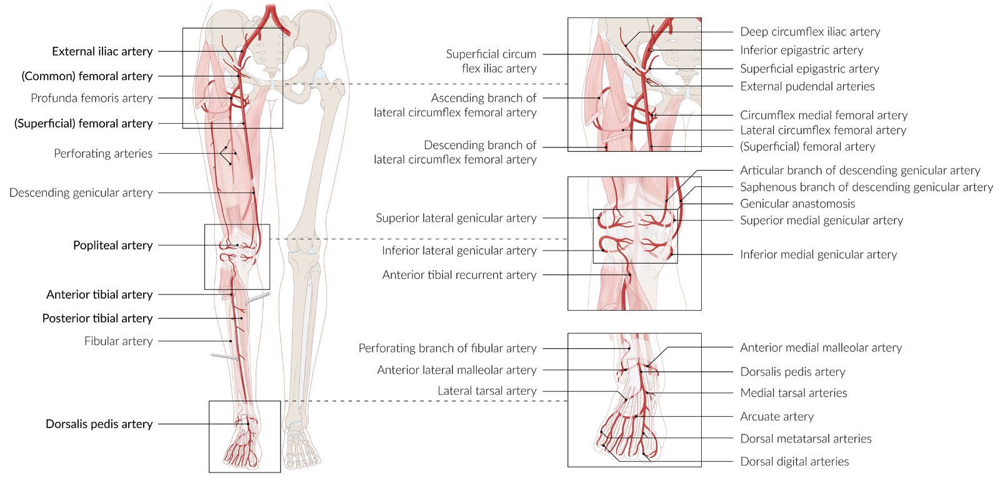

Arteries of the lower extremity

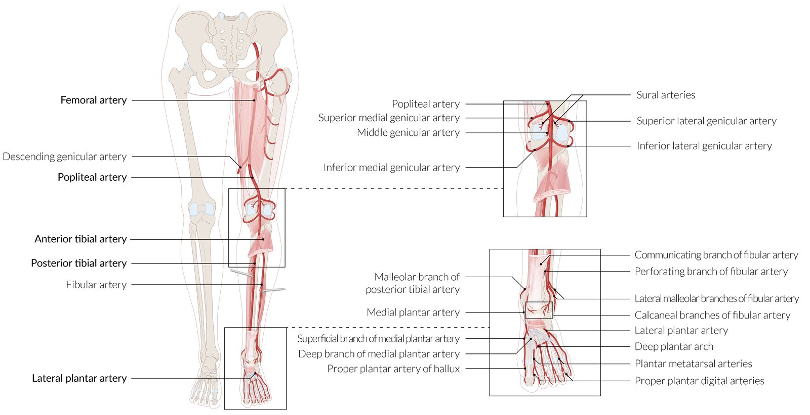

Arteries of the lower extremity

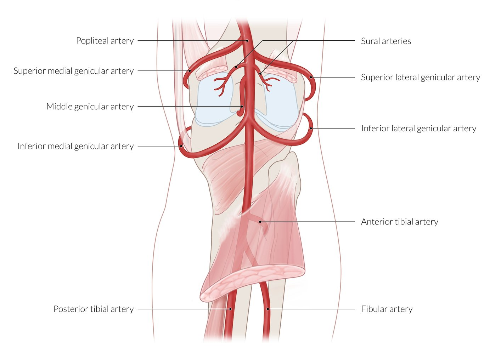

Popliteal artery

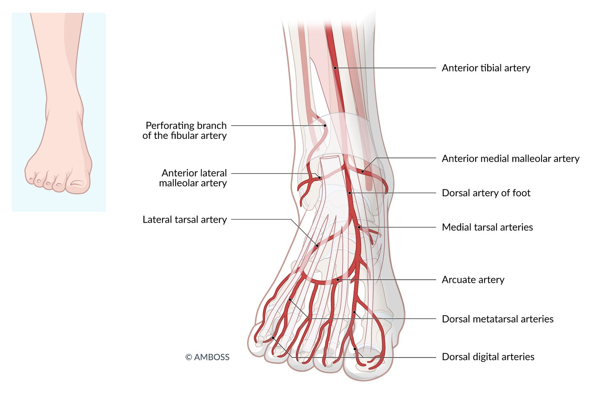

Dorsal arteries of the foot

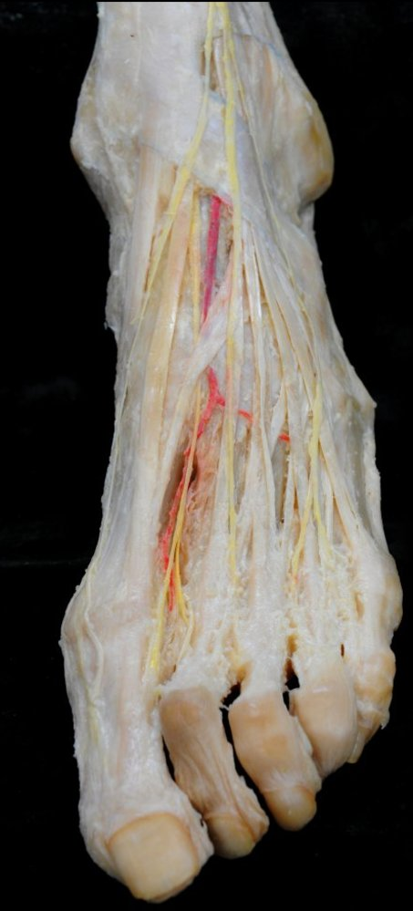

Anatomical structures of the dorsum foot

---

## Veins

### Overview [[1]](https://coursology-qbank.com/amboss/article/ES08Yf)

* The lower limbs have <u>superficial</u> and deep venous systems, both of which drain into the <u>inferior vena cava</u>.

* The <u>superficial veins</u> lie within the subcutaneous tissues and drain into the <u>deep venous system</u>.

* The <u>deep veins</u> lie deep to the deep <u>fascia</u> and drain into the <u>inferior vena cava</u> via the iliac <u>veins</u>.

* Perforator veins are short horizontal or oblique <u>veins</u> that connect the <u>superficial veins</u> to the <u>deep veins</u> by piercing through the deep <u>fascia</u>.

* Venous valves ensure the unidirectional flow of blood from the <u>superficial</u> to the <u>deep venous system</u> towards the <u>heart</u>.

### <u>Veins</u> of the lower limbs

#### Major <u>veins</u> of the lower limbs

|  Overview of <u>veins</u> of the lower limbs   |  |  |  |  |  |
| --- | --- | --- | --- | --- | --- |
| <u>Veins</u> | <u>Superficial veins</u> |  | <u>Deep veins</u> |  |  |
| Great saphenous vein (<u>long saphenous vein</u>) | Short saphenous vein (<u>small saphenous vein</u>) | Popliteal vein | Femoral vein | External iliac vein |  |
| Origin |  * Continuation of the <u>medial</u> marginal <u>vein</u> of the foot (<u>medial</u> end of the <u>dorsal</u> venous arch)   |  * Continuation of the <u>lateral</u> marginal <u>vein</u> of the foot (<u>lateral</u> end of the <u>dorsal</u> venous arch)   |  * Formed by the union of <u>anterior</u> tibial, <u>posterior</u> tibial, and <u>fibular veins</u> at the inferior border of the <u>popliteus</u>   |  * Continuation of the <u>popliteal vein</u> at the <u>adductor hiatus</u>   |  * Continuation of the <u>femoral vein</u> <u>posterior</u> to the <u>inguinal ligament</u>   |
| Course |   * At the ankle: passes in front of the <u>medial malleolus</u>  * In the leg: ascends along the <u>medial</u> aspect of the shin  * At the knee: runs behind the <u>medial</u> condyles of the <u>femur</u> and <u>tibia</u>  * Thigh: <u>medial</u> aspect of the thigh    |   * At the ankle: passes behind the <u>lateral malleolus</u>  * In the leg: ascends in the midline of the calf towards the <u>popliteal fossa</u>    |  * Exits the <u>popliteal fossa</u> superiorly and ascends through the <u>adductor hiatus</u>   |   * Begins at the <u>adductor hiatus</u> and accompanies the <u>femoral artery</u> throughout its course  * Continues as the <u>external iliac vein</u> as it passes <u>posterior</u> to the <u>inguinal ligament</u>    |   * Begins at the inferior margin of the <u>inguinal ligament</u>  * Continues anteriorly towards the <u>sacrum</u>, where it joins with the <u>internal iliac vein</u>    |
| Termination |  * Saphenofemoral junction (<u>SFJ</u>)    * The site at which the <u>long saphenous vein</u> passes through the <u>saphenous opening</u> in the deep <u>fascia</u> of the thigh to meet the <u>femoral vein</u>  * The position is fairly constant at 4 cm inferolateral to the <u>pubic tubercle</u>.   |  * Saphenopopliteal junction (SPJ)  * The site at which the <u>short saphenous vein</u> drains into the <u>popliteal vein</u>  * Unlike the <u>SFJ</u>, the location of the SPJ is variable, lying within, <u>proximal</u>, or <u>distal</u> to the <u>popliteal fossa</u>.   |  * At the <u>adductor hiatus</u>, continues as the <u>femoral vein</u>   |  * <u>Posterior</u> to the <u>inguinal ligament</u>, continues as the <u>external iliac vein</u>   |  * At the <u>sacroiliac joint</u>, forms the <u>common iliac vein</u>   |
| Main tributaries |   * <u>Short saphenous vein</u>  * <u>Superficial</u> external pudendal <u>vein</u>  * <u>Superficial epigastric veins</u>  * <u>Superficial</u> circumflex iliac <u>vein</u>  * <u>Lateral</u> femoral cutaneous <u>vein</u>    |   * <u>Dorsal</u> <u>vein</u> of the 5th toe  * <u>Dorsal</u> venous arch    |  * <u>Short saphenous vein</u>   |   * <u>Long saphenous vein</u>  * <u>Deep vein</u> of the thigh  * <u>Medial</u> and <u>lateral</u> circumflex <u>femoral veins</u>    |   * Inferior epigastric vein  * Deep circumflex iliac <u>vein</u>  * Pubic <u>vein</u>    |
| Drains |  * The anteromedial aspect of the sole, leg, and thigh   |  * The <u>posterior</u> and lower leg   |  * The lower leg   |  * The lower leg   |  * The leg, pubic area, and <u>anterior abdominal wall</u>   |
| Important relations |  * The <u>saphenous nerve</u> accompanies the <u>long saphenous vein</u> below the knee.   |  * The <u>sural nerve</u> accompanies the <u>short saphenous vein</u> through most of its course.   |  * The <u>popliteal artery</u> and popliteal nerve travel with the <u>popliteal vein</u>.   |  * Runs within the <u>femoral triangle</u>   |   * The <u>internal iliac artery</u> is found laterally.  * Crossed by the <u>ureter</u> and <u>vas deferens</u> in males  * Crossed by the <u>ovarian artery</u> and <u>round ligament</u> in females    |

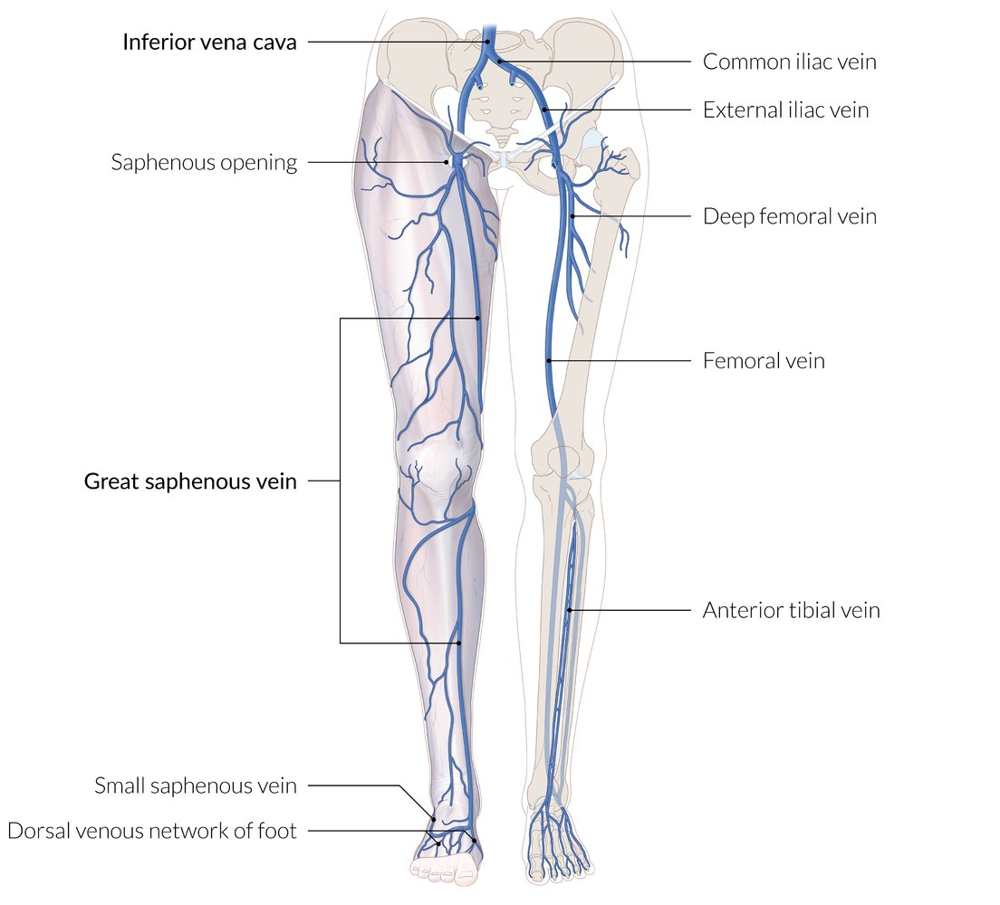

Veins of the leg (ventral aspect)

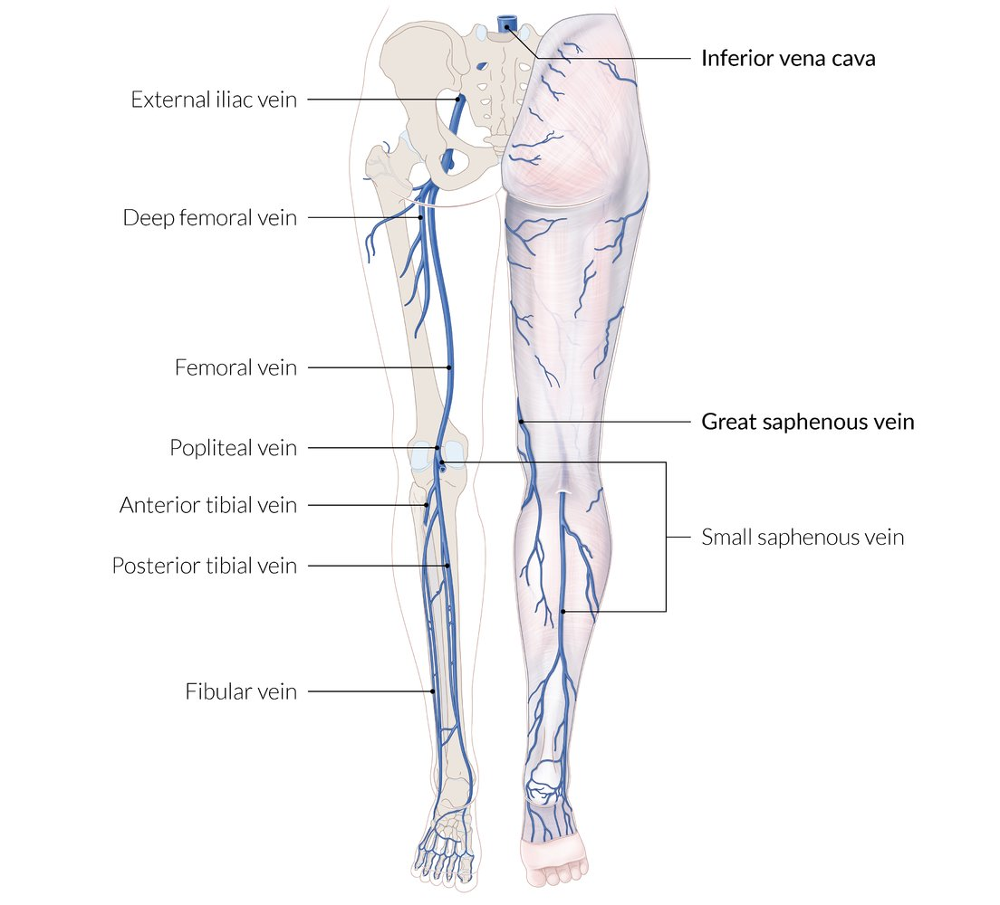

Veins of the leg (dorsal aspect)

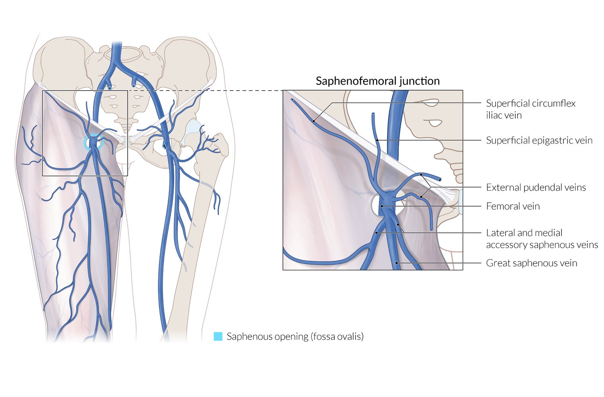

Saphenofemoral junction

#### <u>Veins of the leg</u>

* <u>Superficial veins</u>: long and <u>short saphenous veins</u> (see the table “Overview of <u>veins</u> of the lower limbs” above)

* <u>Deep veins</u>

* Anterior tibial vein

* Arises from <u>venae comitantes</u> of the <u>dorsalis pedis artery</u>

* Accompanies the <u>anterior tibial artery</u>

* Drains the <u>anterior</u> aspect of the leg and foot

* Posterior tibial vein

* Arises from the <u>medial</u> and <u>lateral</u> <u>plantar</u> <u>veins</u>

* Accompanies the <u>posterior tibial artery</u>

* Drains the <u>posterior</u> aspect of the leg and foot

* Fibular veins (<u>peroneal veins</u>)

* Arise from the <u>medial</u> and <u>lateral</u> <u>plantar</u> <u>veins</u>

* Accompany the <u>fibular artery</u>

* Drain the <u>lateral</u> aspect of the leg

#### <u>Veins of the foot</u>

* <u>Superficial veins</u>

* Dorsal venous arch of the foot

* Lies on the <u>dorsal</u> aspect of the heads of the <u>lateral</u> four <u>metatarsal bones</u>

* Tributaries: <u>Dorsal</u> digital <u>veins</u> unite to form <u>dorsal</u> <u>metatarsal</u> <u>veins</u> that drain into the <u>dorsal</u> venous arch.

* Termination: continues as the <u>medial</u> and <u>lateral</u> marginal <u>veins</u>

* Marginal <u>veins</u>

* <u>Medial</u> marginal <u>vein</u> continues as the <u>long saphenous vein</u>

* <u>Lateral</u> marginal <u>vein</u> continues as the <u>short saphenous vein</u>

* <u>Deep veins</u>

* Plantar venous arch of the foot

* Lies on the <u>plantar</u> aspect of the <u>lateral</u> four <u>metatarsal bones</u>

* Tributaries: <u>Plantar</u> digital <u>veins</u> unite to form <u>metatarsal</u> <u>veins</u> that drain into the deep <u>plantar</u> venous arch.

* Termination: continues as the <u>medial</u> and <u>lateral</u> <u>plantar</u> <u>veins</u>

* <u>Medial</u> and <u>lateral</u> <u>plantar</u> <u>veins</u>: drain into the <u>posterior tibial vein</u>

---

## Nerves

### Overview

* The lower limb is innervated by branches of the <u>lumbosacral plexus</u>.

* Lumbosacral plexus: a network of nerves composed of two distinct plexuses

* The <u>lumbar plexus</u>: formed by the <u>subcostal nerve</u> (T12) and first four lumbar nerves (L1–L4)

* The <u>sacral plexus</u>: formed by the last two lumbar nerves (L4–L5) and the first four sacral nerves (<u>S1</u>–<u>S4</u>)

* Lumbosacral trunk

* Formed by the fusion of lumbar nerves L4 and L5

* Contributes to the <u>sacral plexus</u>

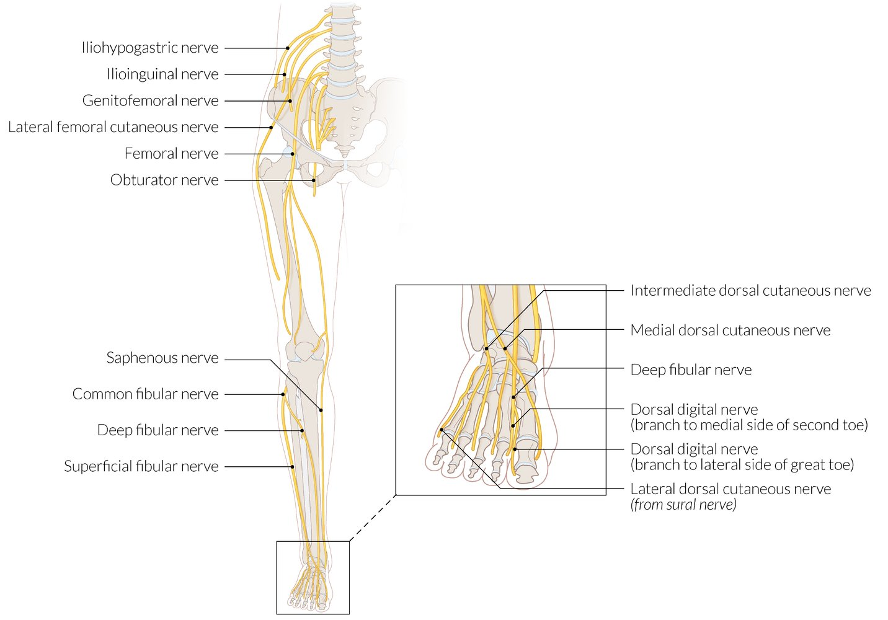

Innervation of the lower extremity (ventral view)

### Lumbar plexus

* Definition: a neural network formed by the subcostal and first four lumbar nerves

* <u>Nerve roots</u>: <u>anterior</u> (<u>ventral</u>) divisions of T12–L4

* Anatomical location: : <u>anterior</u> to the <u>transverse processes</u> of the <u>lumbar vertebrae</u>, within the <u>psoas major muscle</u> [[2]](https://coursology-qbank.com/amboss/article/0pYeLJ)

* Supply

* Motor innervation

* Lower abdominal muscles: <u>external oblique</u>, <u>internal oblique</u>, and <u>transversus abdominis</u>

* <u>Pelvic</u> muscles: <u>Iliacus</u>, <u>pectineus</u>, cremaster

* Muscles of the <u>anterior</u> and <u>medial</u> compartments of the thigh

* Sensory innervation

* Lower abdomen

* <u>Lateral</u> <u>gluteal region</u>

* External genitalia

* Thigh

* <u>Medial</u> aspect of the leg (via the <u>saphenous nerve</u>)

|  Nerves of the <u>lumbar plexus</u>   |  |  |  |  |  |
| --- | --- | --- | --- | --- | --- |
| Nerve | <u>Nerve root</u> | Important characteristics | Course | Motor innervation | Sensory innervation |
| Iliohypogastric nerve |  * T12–L1   |  * Mixed sensorimotor nerve   |   * Emerges from the <u>lateral</u> border of the <u>psoas major</u>  * Courses <u>dorsal</u> to the <u>psoas major</u> and <u>quadratus lumborum muscles</u>, <u>posterior</u> to the <u>kidney</u>  * Pierces the <u>transversus abdominis</u> and <u>internal oblique muscles</u>  * Courses parallel to the <u>inguinal ligament</u> from <u>lateral</u> to <u>medial</u>  * Terminates by piercing through the <u>external oblique muscle</u> ∼ 3 cm <u>proximal</u> to the <u>superficial inguinal ring</u>    |   * <u>Transversus abdominis muscle</u>  * <u>Internal oblique muscle</u>  * <u>Conjoint tendon</u>    |   * Suprapubic region  * <u>Lateral</u> aspect of <u>the gluteal region</u>    |
| Ilioinguinal nerve |  * T12–L1   |  * Mixed sensorimotor nerve   |   * Emerges from the <u>lateral</u> aspect of the <u>psoas major muscle</u>  * Courses <u>dorsal</u> to the <u>psoas major</u> and <u>quadratus lumborum muscles</u>  * Pierces the <u>transversus abdominis</u> and the <u>internal oblique muscles</u>  * Terminates by emerging from the <u>superficial inguinal ring</u>    |   * <u>Transversus abdominis muscle</u>  * <u>Internal oblique muscle</u>    |   * <u>Proximal</u> <u>medial</u> aspect of the thigh  * <u>Mons pubis</u> (women) or root of <u>penis</u> (men)    |
| Genitofemoral nerve |  * L1–L2   |  * Sensorimotor nerve   |   * Pierces the <u>psoas major</u> and courses over its <u>dorsal</u> surface  * Divides into two branches just above the <u>inguinal ligament</u>:  * Genital branch: traverses the <u>inguinal canal</u> and emerges from the <u>superficial inguinal ring</u>  * Femoral branch: courses beneath the <u>inguinal ligament</u> to enter the <u>femoral triangle</u>, <u>lateral</u> to the <u>femoral artery</u>    |  * Genital branch: <u>cremaster muscle</u>   |   * Genital branch: <u>labia majora</u> (in women) or <u>scrotum</u> (in men)  * Femoral branch: anteromedial thigh    |
|  Lateral cutaneous nerve of thigh (lateral femoral cutaneous nerve) [[3]](https://coursology-qbank.com/amboss/article/QPYue6) |  * L2–L3   |  * Pure sensory nerve   |   * Courses <u>dorsal</u> to the <u>psoas major</u> and iliac muscles toward the <u>anterior superior iliac spine</u>  * Passes deep to the <u>inguinal ligament</u> to enter the thigh  * Courses through the muscular space    |  * None   |  * <u>Skin</u> over the anterolateral aspect of thigh (up to the knee)   |
| Femoral nerve |  * L2–L4 (<u>dorsal</u> branches)   |   * Sensorimotor nerve  * Largest branch of the <u>lumbar plexus</u>    |   * Courses along the <u>lateral</u> border of the <u>psoas major</u> and passes underneath the <u>fascia</u> of the iliac crest  * Passes deep to the <u>inguinal ligament</u> to enter the thigh  * Lies within the <u>femoral triangle</u>, <u>lateral</u> to the <u>femoral artery</u>    |   * Muscles of the <u>anterior</u> compartment of the thigh  * <u>Iliacus</u>  * <u>Pectineus</u>    |   * Intermediate cutaneous nerve of thigh: <u>skin</u> over the <u>anterior</u> aspect of the thigh  * <u>Medial</u> cutaneous nerve of thigh (<u>medial</u> femoral cutaneous nerve): <u>skin</u> over the lower 2/3rds of the <u>medial</u> aspect of the thigh  * Articular branch: <u>knee joint</u>  * <u>Saphenous nerve</u>: <u>medial</u> aspect of the knee, leg, and foot (see below)    |
| Saphenous nerve |  * L2–L4   |   * Pure sensory nerve  * Largest cutaneous branch of the <u>femoral nerve</u>  * Accompanied by the <u>long saphenous vein</u> in the leg    |   * Passes through the <u>adductor canal</u>  * Becomes <u>superficial</u> by piercing the deep <u>fascia</u> behind the <u>medial</u> border of the patella  * Courses in the anteromedial aspect of the leg    |  * None   |  * <u>Skin</u> over the <u>medial</u> aspect of the knee, leg, and foot   |
| Obturator nerve |  * L2–L4 (<u>ventral</u> branches)   |  * Sensorimotor nerve   |   * Courses within the <u>psoas major muscle</u> and then <u>posterior</u> to the iliac vessels  * Traverses the <u>obturator canal</u> to enter the thigh  * Terminates by dividing into an <u>anterior</u> and <u>posterior</u> branch    |  * Muscles of the <u>medial compartment of the thigh</u>   |   * <u>Skin</u> over the upper 1/3rd of the <u>medial</u> aspect of the thigh  * Articular branch: hip and <u>knee joints</u>    |

> [!NOTE]
> Incidentally, I Got Laid On Friday: Iliohypogastric, Ilioinguinal, Genitofemoral, Lateral femoral cutaneous, Obturator, Femoral (nerves of the <u>lumbar plexus</u>)

Innervation of the lower extremity (ventral view)

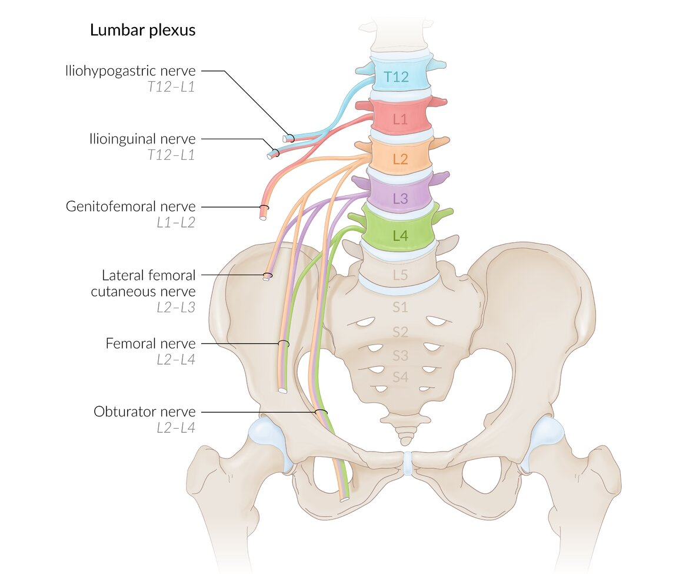

Lumbar plexus

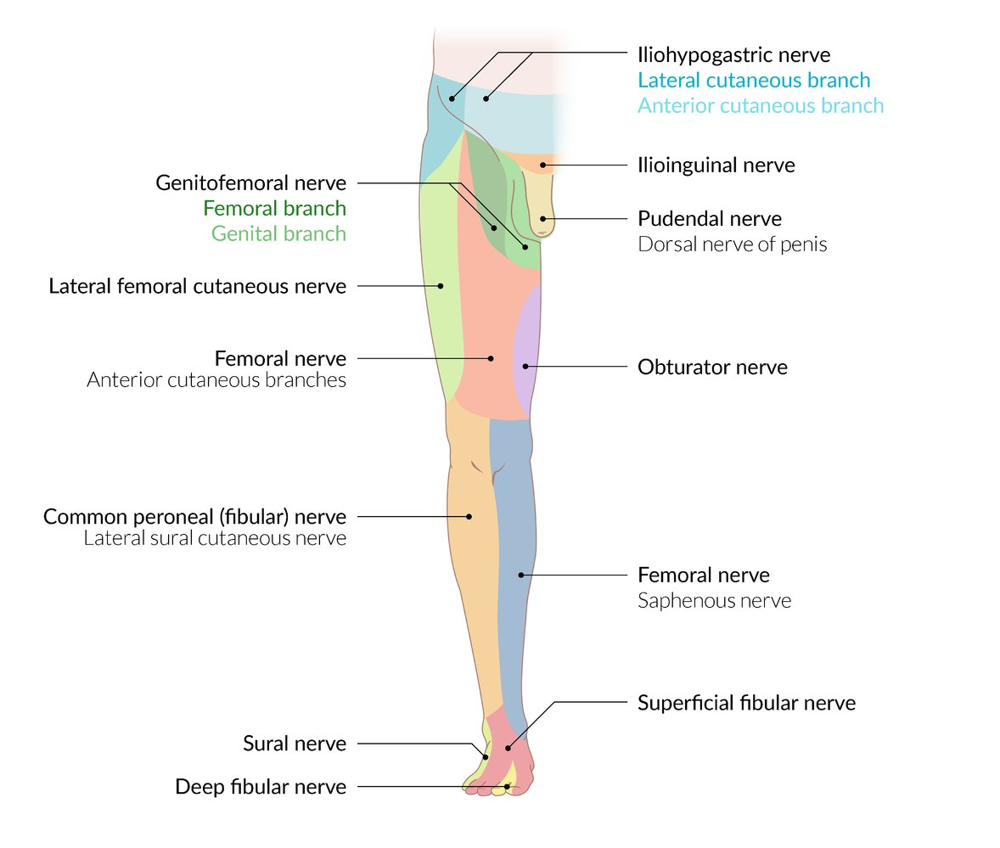

Innervation areas of the peripheral nerves (leg, ventral view)

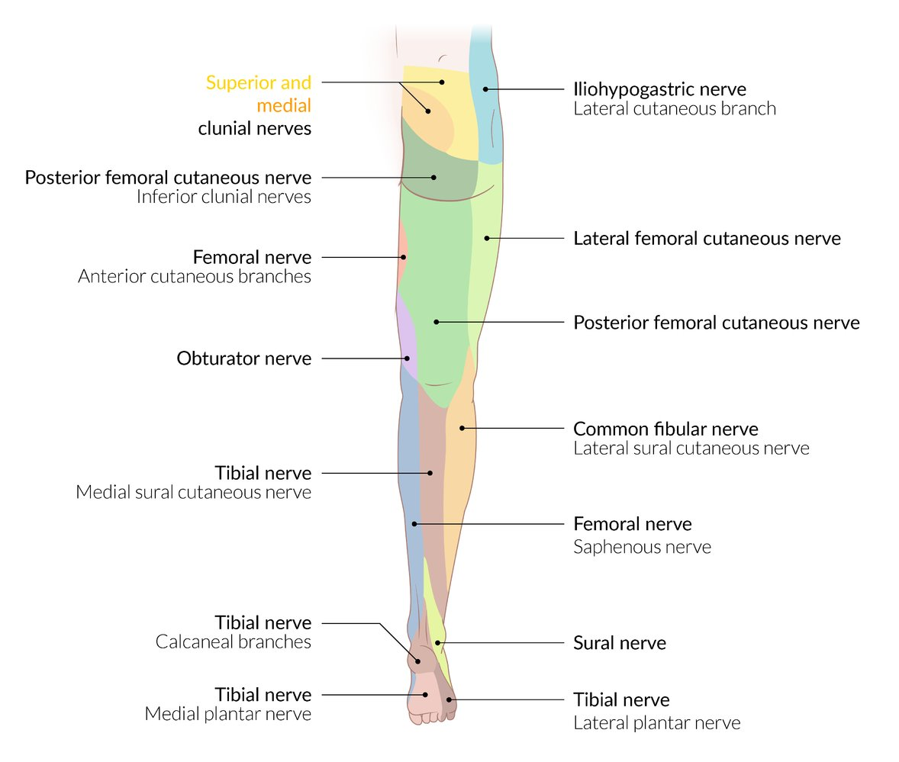

Innervation areas of the peripheral nerves (leg, dorsal view)

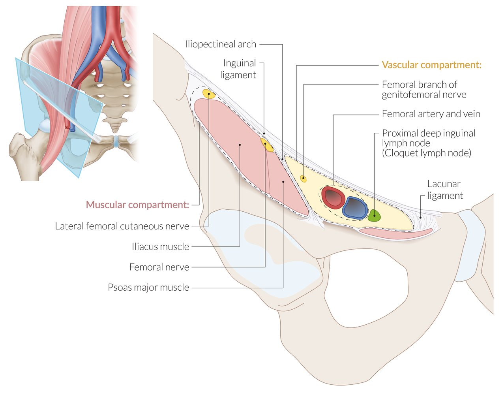

Contents and borders of the muscular lacuna and vascular lacuna

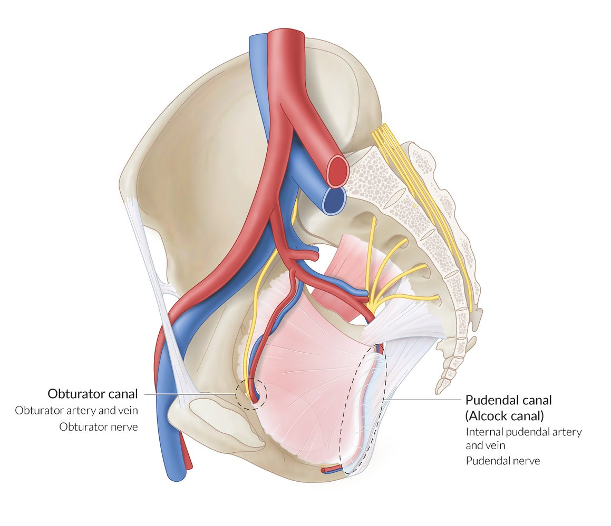

Obturator canal and pudendal canal

### Sacral plexus

* Definition: a neural network formed by the last two lumbar nerves and the first four sacral nerves

* <u>Nerve roots</u>: <u>anterior</u> (<u>ventral</u>) divisions of L4–<u>S4</u>

* Anatomical location: lies within the <u>pelvis</u>, on the surface of the <u>piriformis</u>, <u>posterior</u> to the iliac vessels and the <u>ureter</u>

* Supply: lower limbs and <u>pelvis</u>

| <u>Sacral plexus</u> branches |  |  |  |  |  |
| --- | --- | --- | --- | --- | --- |
| Nerve | <u>Nerve roots</u> | Important characteristics | Course | Motor innervation | Sensory innervation |
| Superior gluteal nerve |  * L4–<u>S1</u>   |  * Motor nerve   |   * Exits the <u>pelvis</u> through the <u>greater sciatic foramen</u> above the <u>piriformis</u>  * Passes through the <u>suprapiriform foramen</u> with the <u>superior gluteal artery</u> and <u>vein</u>  * Divides into a superior and inferior branch    |   * <u>Gluteus medius muscle</u>  * <u>Gluteus minimus muscle</u>  * <u>Tensor fasciae latae muscle</u>  * Articular branch: <u>hip joint</u>    |  * None   |
| Inferior gluteal nerve |  * L5–<u>S2</u>   |  * Motor nerve   |   * Exits the <u>pelvis</u> through the <u>greater sciatic foramen</u> below the <u>piriformis</u>  * Courses <u>caudally</u> with the <u>inferior gluteal artery</u>  * Courses deep to the <u>fascia</u> lata up to the <u>popliteal fossa</u>    |  * <u>Gluteus maximus muscle</u>   |  * None   |
|  Posterior cutaneous nerve of thigh (<u>posterior femoral cutaneous nerve</u>) |  * <u>S2</u>–<u>S3</u>   |  * Sensory nerve   |   * Courses through the <u>infrapiriform foramen</u>  * Courses <u>caudally</u> with the <u>inferior gluteal artery</u>  * Courses deep to the <u>fascia</u> lata up to the <u>popliteal fossa</u>    |  * None   |   * Inferior part of <u>the gluteal region</u>  * <u>Posterior</u> aspect of the <u>scrotum</u> (men) or <u>labia majora</u> (women)  * <u>Posterior</u> aspect of the thigh and upper calf    |
| Sciatic nerve |  * L4–<u>S3</u>   |   * Sensorimotor nerve  * Thickest nerve of the body    |   * Courses through the <u>infrapiriform foramen</u>  * Courses towards the <u>popliteal fossa</u>, covered by the ischiocrural muscles (giving off muscular branches along its course)  * Divides into the <u>tibial nerve</u> and common fibular nerves that supply the leg and foot    |   * Muscles of the <u>posterior compartment of the thigh</u> (<u>hamstrings</u>)  * Hamstring portion of the <u>adductor magnus muscle</u>  * Muscles of the <u>posterior compartment of the leg</u> (via the <u>tibial nerve</u>)    |   * In the thigh: none  * In the leg: See <u>tibial nerve</u> and <u>common peroneal nerve</u> below.    |
|  Pudendal nerve |  * <u>S2</u>–<u>S4</u>   |  * Mixed sensorimotor nerve   |   * Passes through the <u>infrapiriform foramen</u>  * Courses around the <u>ischial spine</u>  * Passes through the <u>lesser sciatic foramen</u>  * Arrives at the <u>ischioanal fossa</u>  * Enters the <u>pudendal canal</u> and divides into its terminal branches here: the perineal, inferior rectal, and <u>dorsal</u> penile/clitoral nerves    |   * External <u>urethral sphincter</u>  * External anal sphincter  * <u>Levator ani muscles</u>  * <u>Bulbospongiosus muscle</u>  * <u>Ischiocavernosus muscle</u>    |   * Inferior rectal nerves  * <u>Skin</u> of the perianal region  * Lower third of the <u>anal canal</u>  * Perineal nerves  * <u>Skin</u> of the <u>perineum</u>  * <u>Dorsal</u> <u>scrotum</u> (men) or <u>labia majora</u> (women)  * <u>Dorsal</u> penile (men)/clitoral (women) nerve  * Dorsum of the <u>penis</u>/<u>clitoris</u> <u>skin</u>  * Responsible for penile <u>reflex erection</u>    |
| Nerve to <u>piriformis</u> |  * <u>S1</u>–<u>S2</u>   |  * Motor nerve   |   * Does not exit the <u>pelvis</u>  * Terminates by piercing the <u>piriformis</u> and supplying it    |  * <u>Piriformis</u>   |  * None   |
| Nerve to <u>obturator internus</u> |  * L5–<u>S2</u>   |  * Motor nerve   |  * Exits the <u>pelvis</u> through the <u>greater sciatic foramen</u> below the <u>piriformis</u>   |   * <u>Internal obturator muscle</u>  * <u>Superior gemellus muscle</u>    |  * None   |
| Nerve to <u>quadratus femoris</u> |  * L4–<u>S1</u>   |  * Motor nerve   |  * Exits the <u>pelvis</u> through the <u>greater sciatic foramen</u> below the <u>piriformis</u>   |   * <u>Quadratus femoris</u>  * <u>Inferior gemellus muscle</u>  * Articular branch: <u>hip joint</u>    |  * None   |

> [!NOTE]
> SIPPS: Superior gluteal nerve,  Inferior gluteal nerve, Posterior cutaneous nerve of thigh, Pudendal nerve, Sciatic nerve (nerves of the <u>sacral plexus</u>)

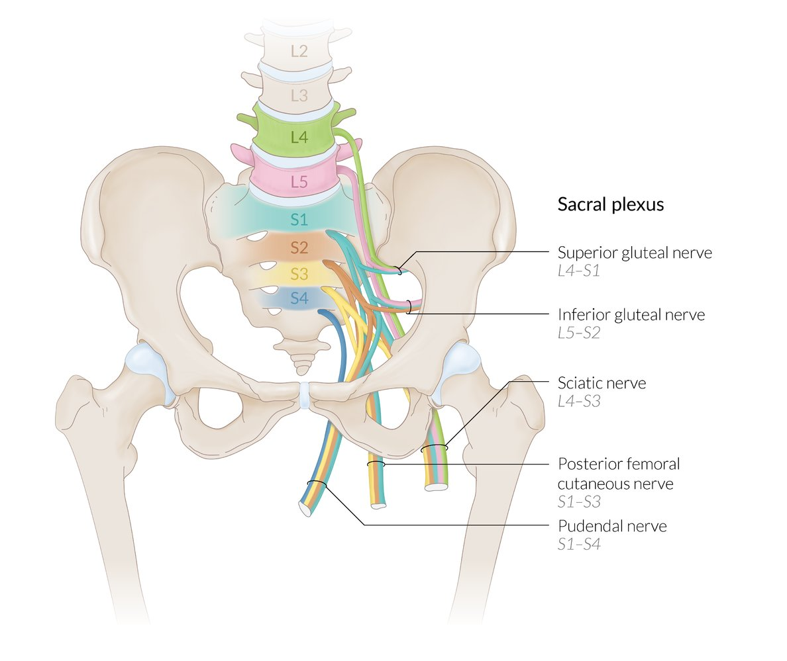

Sacral plexus

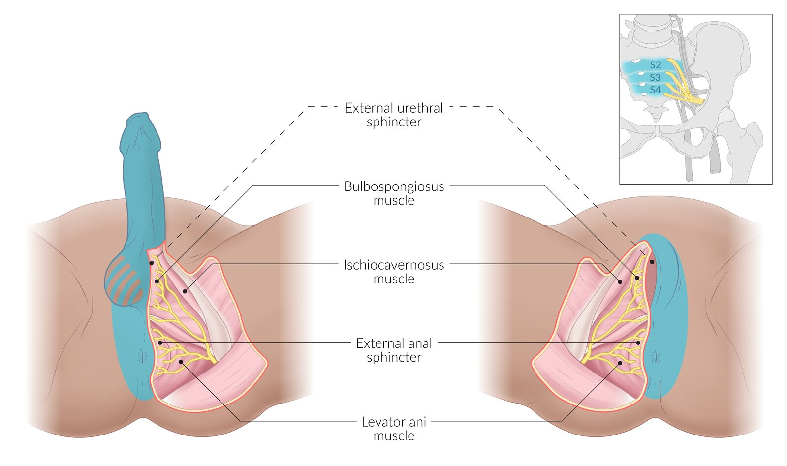

Pudendal nerve

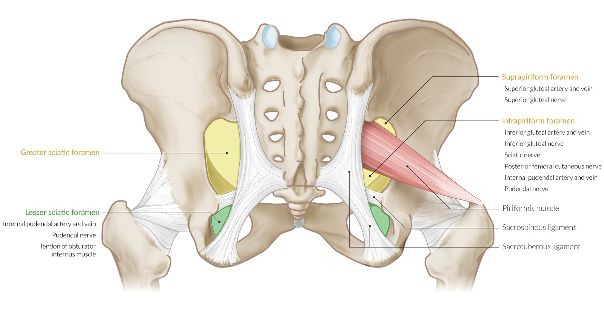

Anatomy of the pelvis

#### <u>Branches of the sciatic nerve</u>

* The <u>sciatic nerve</u> terminates at the apex of the <u>popliteal fossa</u> by dividing into the <u>tibial nerve</u> and the <u>common peroneal nerve</u>.

* A cutaneous branch from both the tibial and <u>common peroneal nerve</u> unites to form the <u>sural nerve</u>.

| Sciatic nerve branches |  |  |  |  |
| --- | --- | --- | --- | --- |
| Nerve | <u>Nerve roots</u> | Important characteristics | Motor innervation | Sensory innervation |
| Tibial nerve |  * L4–<u>S3</u> (<u>ventral</u> divisions)   |   * Sensorimotor nerve  * A terminal branch of the <u>sciatic nerve</u>  * Arises at the apex of the <u>popliteal fossa</u>    |  * <u>Posterior</u> compartment of the leg   |   * <u>Medial</u> <u>calcaneal</u> branch: <u>skin</u> over the heel  * <u>Medial</u> <u>plantar</u> nerve: <u>medial</u> half of the sole (excluding the heel) and the <u>plantar</u> aspect of the <u>medial</u> 3.5 toes  * <u>Lateral plantar nerve</u>: <u>lateral</u> half of the sole (excluding the heel) and the <u>plantar</u> aspect of the <u>lateral</u> 1.5 toes    |
| Common peroneal nerve (<u>common fibular nerve</u>) |  * L4–<u>S2</u> (<u>dorsal</u> divisions)   |  * Sensorimotor nerve   |   * A terminal branch of the <u>sciatic nerve</u>  * Arises at the apex of the <u>popliteal fossa</u>  * Deep peroneal nerve (L4–L5)  * A terminal branch of the <u>common peroneal nerve</u>  * Arises at the neck of the <u>fibula</u>  * Supplies the <u>anterior compartment of the leg</u>  * Superficial peroneal nerve (L4–L5)  * A terminal branch of the <u>common peroneal nerve</u>  * Arises at the neck of the <u>fibula</u>  * Supplies the <u>lateral</u> compartment of the leg    |   * <u>Lateral</u> sural cutaneous nerve (<u>lateral</u> cutaneous nerve of calf): <u>skin</u> over the <u>lateral</u> aspect of the leg  * Sural communicating nerve: joins the tibial part of the <u>sural nerve</u>  * <u>Deep peroneal nerve</u>: 1st web space of the foot (i.e., the <u>sandal gap</u>)  * <u>Superficial peroneal nerve</u>: <u>distal</u> part of the <u>anterior</u> aspect of the leg and the dorsum of the foot (except the 1st web space)    |
| Sural nerve |  * L4–<u>S4</u>   |   * Sensory nerve  * Formed by the union of sural (cutaneous) branches from the tibial and common peroneal nerves  * Accompanied by the <u>short saphenous vein</u>    |  * None   |  * <u>Skin</u> over the posterolateral aspect of the <u>distal</u> 1/3rd of the leg and the <u>lateral</u> border of the foot   |

> [!NOTE]
> TIPPED: <u>tibial nerve injury</u> versus <u>peroneal nerve injury</u>
> <u>TIP</u>: Tibial nerve Inverts and Plantarflexes the foot; injury leads to an inability to walk on the <u>TIP</u>toes
> <u>PED</u>: Peroneal nerve Everts and Dorsiflexes the foot; injury leads to <u>foot drop</u>

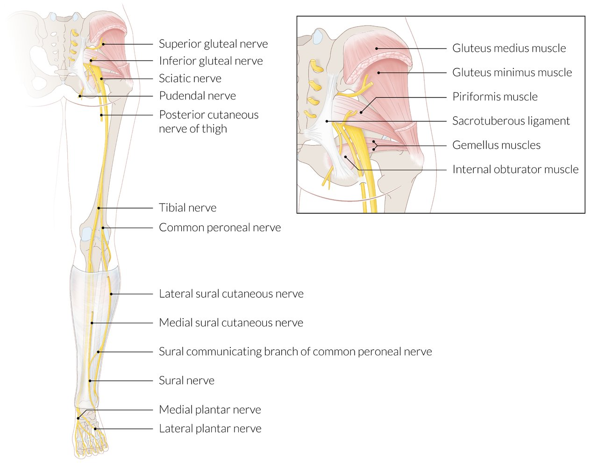

Innervation of the lower extremity (dorsal view)

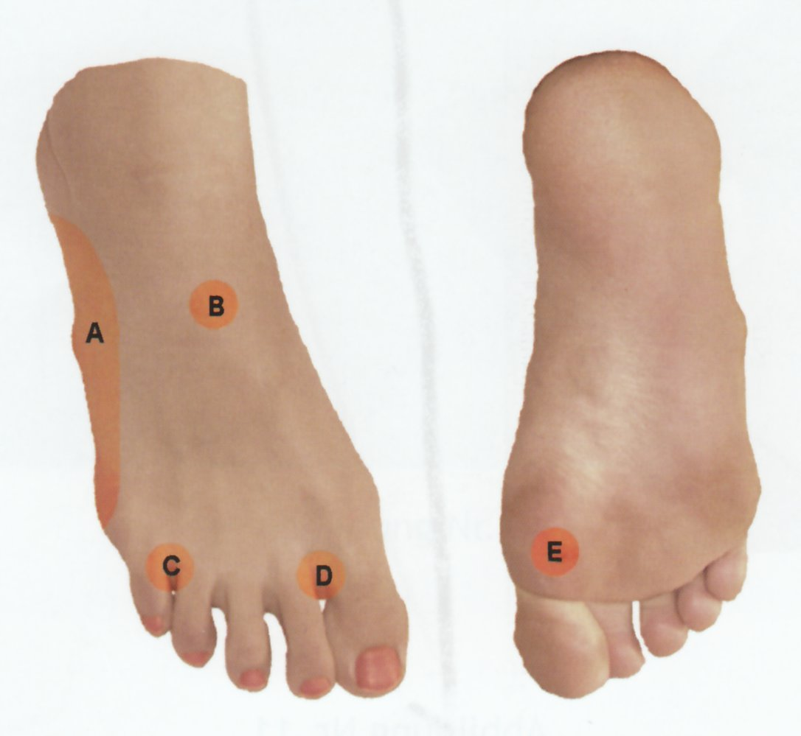

Sensory innervation of the foot

---

## Clinical significance

* <u>Pudendal nerve block</u>

* <u>Pudendal nerve injury</u>

* <u>Thrombophlebitis</u>

* <u>Deep vein thrombosis</u>

* <u>Femoropopliteal disease</u>

* <u>Osteonecrosis of the femoral head</u>

* <u>Popliteal artery aneurysm</u>

* <u>Popliteal cyst</u> (<u>Baker cyst</u>)

* <u>Peripheral artery disease</u>

* <u>Sciatica</u>

* <u>Sciatic nerve injury</u>

* <u>Varicose veins</u>

* <u>Superior gluteal nerve injury</u> (positive <u>Trendelenburg sign</u>)

* <u>Inferior gluteal nerve injury</u>

* <u>Common peroneal nerve injury</u> (e.g., fibular neck <u>fracture</u>, compression from <u>splint</u>)

* <u>Tarsal tunnel syndrome</u>

* <u>Tibial nerve injury</u>

* <u>Sural nerve lesion</u>

* <u>Meralgia paresthetica</u>

* <u>Femoral nerve injury</u>

* <u>Obturator nerve injury</u>

* <u>Saphenous nerve</u> entrapment

* <u>Saphenous nerve</u> block

---