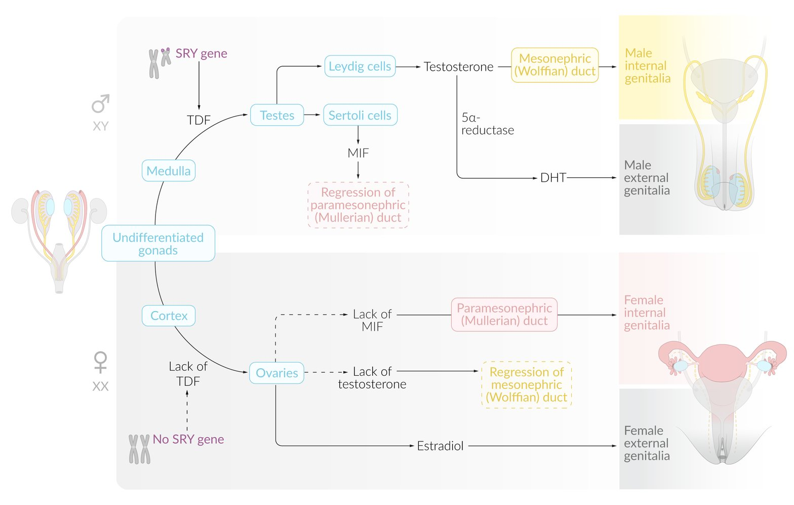
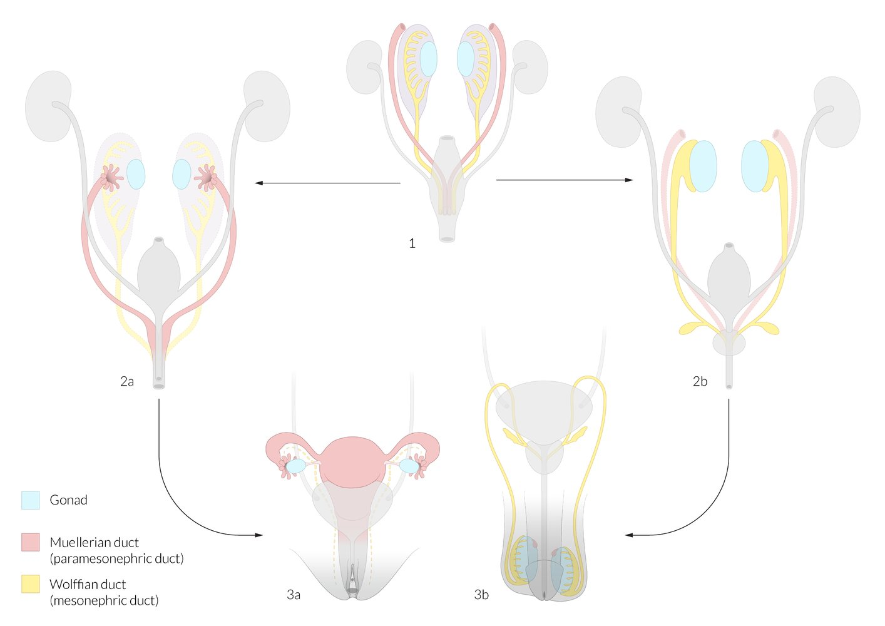
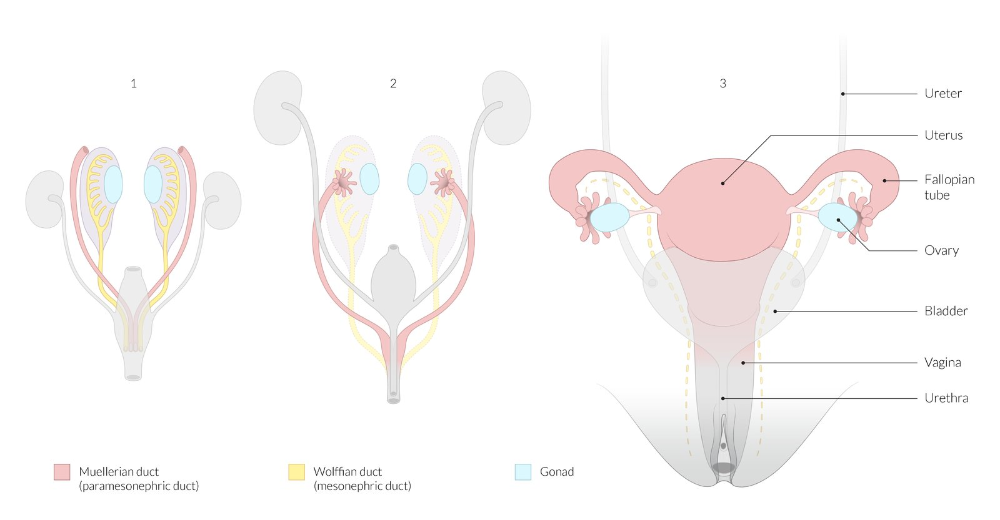
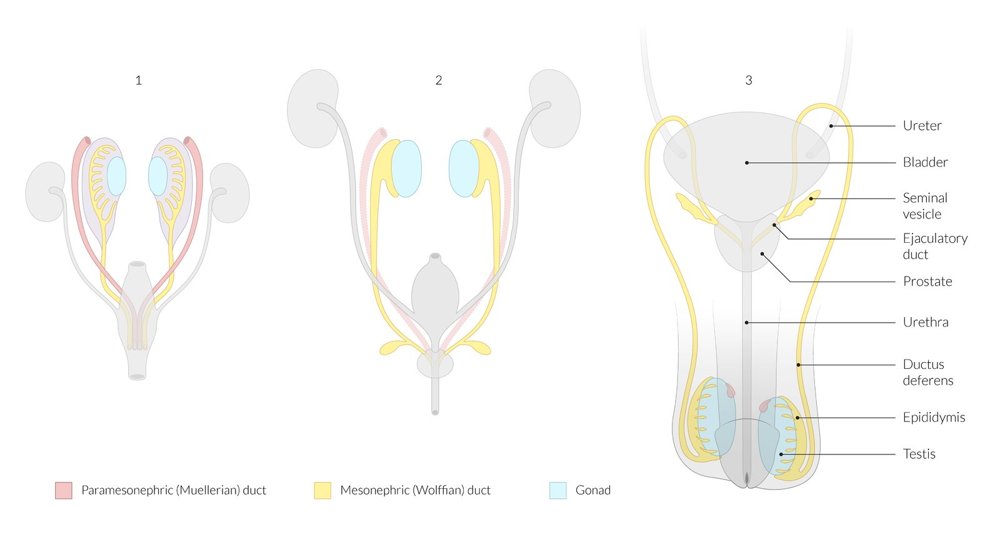
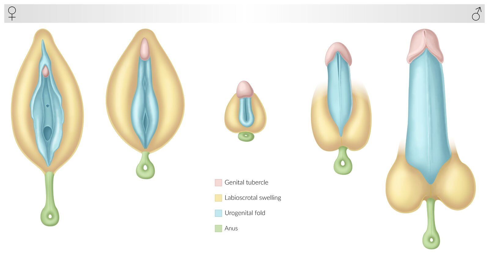
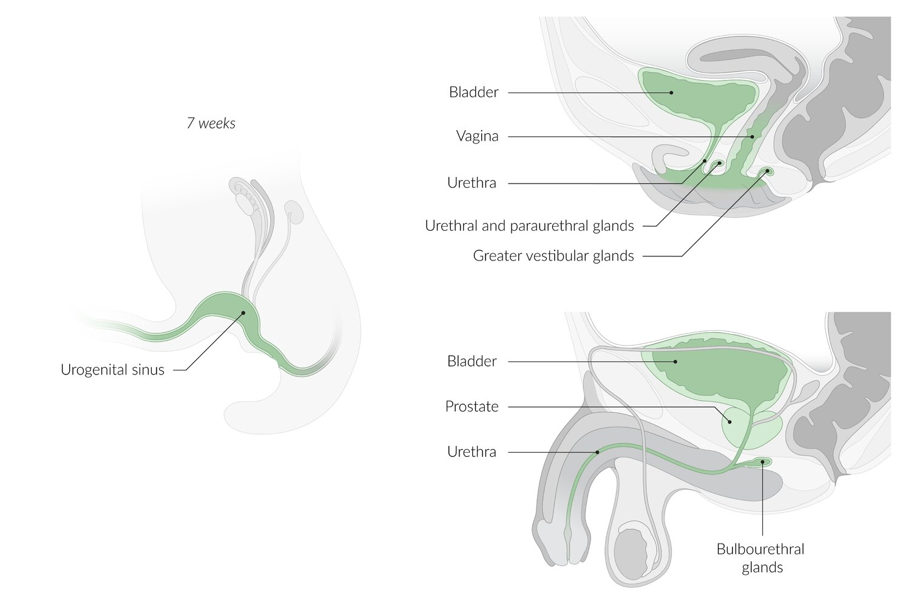

# Development of the reproductive system

*Categories: Clinical knowledge > Urology > Basics of urology > Development of the reproductive system*

[Original Article Link](https://coursology-qbank.com/amboss/article/yK0dQS)

---

## Summary

The development of the reproductive system begins with the formation of undifferentiated <u>gonads</u> and the paired mesonephric and <u>paramesonephric ducts</u>. Further <u>differentiation of the gonads</u> is dependent on the presence or absence of the <u>SRY</u> <u>gene</u> on the Y <u>chromosome</u>, which stimulates differentiation of the <u>testes</u> in male individuals. <u>Testosterone</u> (produced by <u>Leydig cells</u>) drives the differentiation of the <u>mesonephric ducts</u> into male internal sex organs and <u>dihydrotestosterone</u> drives the differentiation of male external genitalia. <u>Mullerian inhibitory factor</u> (<u>MIF</u>), produced by <u>Sertoli cells</u>, suppresses the differentiation of the <u>paramesonephric ducts</u>. In female individuals, the absence of <u>MIF</u> allows differentiation of the <u>paramesonephric ducts</u> into the female internal organs, and <u>estrogen</u> drives the differentiation of female external genitalia. The absence of <u>testosterone</u> prevents the differentiation of the <u>mesonephric ducts</u> in female individuals. The <u>descent of the gonads</u>, which is much more prominent in male individuals, is facilitated by the <u>gubernaculum</u>, which promotes the descent of the <u>testes</u> from their initial <u>retroperitoneal</u> location into the <u>scrotum</u>.

---

## Gonadal sex differentiation

* Description: development of the undifferentiated <u>gonads</u> into <u>testes</u> or <u>ovaries</u>

* Timeline

* Up to week 6: The male and female <u>gonads</u> are indistinguishable.

* After week 6: development of <u>testes</u> or <u>ovaries</u>

* Mechanism

* The Y <u>chromosome</u> contains the SRY <u>gene</u>.

* The <u>SRY</u> <u>gene</u> encodes testis-determining factor (<u>TDF</u>): <u>transcription factor</u> necessary for <u>testes</u> development.

* <u>TDF</u> stimulates the <u>proliferation</u> and differentiation of the primitive sex cords into <u>testes</u>.

* <u>Autosomal</u> SOX9 <u>gene</u>: <u>transcription</u> regulator also involved in <u>testes</u> differentiation that is upregulated by <u>SRY</u> <u>gene</u>

* Absence of Y <u>chromosome</u> and presence of WNT4 gene;   → ovarian development (default)

* Clinical significance

* <u>Swyer syndrome</u>

* <u>Turner syndrome</u>

* <u>SOX9 mutation</u>

References: [[3]](https://coursology-qbank.com/amboss/article/LNYwbp)

---

## Ductal sex differentiation

* Description: development of the embryonic ducts into the internal sex organs

* Timeline: starts in weeks 7–8

* Mechanism

* Both male and female embryos have <u>mesonephric ducts</u> and <u>paramesonephric ducts</u>.

* Differentiation relies on the Mullerian inhibitory factor (<u>MIF</u>) and <u>testosterone</u>.

* Male individuals

* Mullerian inhibitory factor (<u>Sertoli cells</u>) → degeneration of <u>paramesonephric ducts</u> into appendix testis

* <u>Testosterone</u> (<u>Leydig cells</u>) → differentiation of <u>mesonephric duct</u> into male internal genitalia (e.g., <u>seminal vesicles</u>, <u>epididymis</u>, <u>ejaculatory duct</u>, <u>ductus deferens</u>), except for the <u>prostate</u>

* Female individuals

* Default <u>phenotype</u>

* Absence of <u>MIF</u> → differentiation of <u>paramesonephric ducts</u> into female internal genitalia (e.g., <u>fallopian tubes</u>, <u>uterus</u>, <u>proximal</u> <u>vagina</u>)

* Absence of <u>testosterone</u> → degeneration of <u>mesonephric ducts</u> into the Gartner ducts

| Overview of ductal sex differentiation |  |  |  |
| --- | --- | --- | --- |
| Embryonic structure | General description |  Male individuals (starting the 7th week) |  Female individuals (starting the 8th week) |
| Paramesonephric ducts (<u>Mullerian ducts</u>) |   * Develop from <u>mesoderm</u> until the end of the 8th week  * Precursors to female internal sex organs  * Differentiation is driven by <u>estrogens</u> and suppressed by <u>MIF</u>.    |  * Degenerate into <u>appendix testis</u>   |   * <u>Fallopian tubes</u>  * <u>Uterus</u>  * <u>Proximal</u> <u>vagina</u>    |
| Mesonephric ducts (<u>Wolffian ducts</u>) |   * Develop from <u>mesoderm</u> until the 6th week  * Precursors to male internal sex organs (except <u>prostate</u>)  * Differentiation is driven by <u>testosterone</u>.  * Function as a part of the primitive <u>kidney</u> during the <u>1st trimester</u> (see “<u>Kidney embryology</u>”)    |   * <u>Seminal vesicles</u>  * <u>Ejaculatory duct</u>  * <u>Epididymis</u> (also paradidymis)  * <u>Ductus deferens</u>    |  * Degenerate into vestigial remnants (<u>appendix</u> vesiculosa and <u>Gartner duct</u>)   |

* Clinical significance

* See “<u>Differences (disorders) of sex development</u>”.

* <u>Ovotesticular disorder of sexual development</u> (both ovarian and testicular tissue are present)

* <u>Persistent Mullerian duct syndrome</u>

* <u>SOX-9 mutation</u>

* <u>Mullerian agenesis</u>

* See “<u>Anomalies of paramesonephric duct fusion</u>” and “<u>Anomalies of the female genital tract</u>”.

* Incomplete fusion: <u>bicornuate uterus</u>

* No fusion: <u>uterus didelphys</u>

* Single <u>paramesonephric duct</u>: <u>unicornuate uterus</u>

* No <u>paramesonephric ducts</u> development: <u>Mullerian agenesis</u> (or <u>Mayer-Rokitansky-Küster-Hauser syndrome</u>)

* Vaginal agenesis or <u>hypoplasia</u> with or without uterine <u>agenesis</u>

* Normal external genitalia

* Normal functioning <u>ovaries</u>. Outflow obstruction causes <u>primary amenorrhea</u>.

> [!NOTE]
> The “default” sex in <u>sexual development</u> is female.

> [!NOTE]
> In the <u>testes</u>, Leydig cells Lead to male differentiation, and Sertoli cells Suppress female differentiation.

> [!NOTE]
> “SEED” stands for the derivatives of the <u>mesonephric duct</u> in male individuals: Seminal <u>vesicles</u>, Epididymis, Ejaculatory duct, Ductus deferens.

Sexual differentiation

Genital embryology (first stage)

Genital embryology overview

Genital embryology (female)

Genital embryology (male)

References: [[2]](https://coursology-qbank.com/amboss/article/V5YGQp)[[3]](https://coursology-qbank.com/amboss/article/LNYwbp)[[4]](https://coursology-qbank.com/amboss/article/OkYIL6)

---

## External genitalia and urogenital differentiation

* Description: development of the embryonic ducts into the external genitalia

* Timeline: starts in week 9

* Mechanism: primarily driven by the presence or absence of <u>estradiol</u> and <u>dihydrotestosterone</u>

* Male: <u>testosterone</u> → <u>dihydrotestosterone</u> (via <u>5α-reductase</u>) → differentiation of embryonic structures into male external genitalia, bulbourethral glands, and <u>prostate gland</u>

* Female: <u>estradiol</u> and absence of <u>DHT</u> → differentiation of embryonic structures into female external genitalia

| Overview of external genitalia and <u>urogenital differentiation</u> |  |  |  |
| --- | --- | --- | --- |
| Embryonic structure | Notable characteristics | Male individuals | Female individuals |
| Genital tubercle |  * First forms primordial phallus   |   * <u>Glans penis</u>  * <u>Corpus cavernosum</u>  * <u>Corpus spongiosum</u>    |   * Glans <u>clitoris</u>  * Vestibular bulbs    |
| Urogenital sinus |   * Develops from cloaca during the 4–6th weeks  * Precursor to <u>bladder</u> and <u>urethra</u> (both sexes)    |   * Bulbourethral glands (Cowper)  * <u>Prostate gland</u>  * <u>Bladder</u>  * <u>Urethra</u>    |   * <u>Greater vestibular glands</u> (Bartholin)  * Urethral and <u>paraurethral glands</u> (Skene)  * <u>Distal</u> <u>vagina</u>  * Vestibule  * <u>Bladder</u>  * <u>Urethra</u>    |
| Urogenital folds |  * N/A   |   * <u>Ventral</u> penile shaft  * <u>Penile urethra</u>    |  * <u>Labia minora</u>   |
| Labioscrotal swelling |  * N/A   |  * <u>Scrotum</u>   |  * <u>Labia majora</u>   |

* Clinical significance

* <u>Androgen insensitivity syndrome</u>

* <u>5α-reductase deficiency</u>

* <u>Aromatase deficiency</u>

* <u>Congenital adrenal hyperplasia</u>

* <u>Hypospadias</u>/<u>epispadias</u>

* <u>17β-hydroxysteroid dehydrogenase</u> III deficiency

Genital embryology (external genital homologs)

Differentiation of the urogenital sinus

References: [[2]](https://coursology-qbank.com/amboss/article/V5YGQp)[[3]](https://coursology-qbank.com/amboss/article/LNYwbp)[[5]](https://coursology-qbank.com/amboss/article/k5Ym4p)

---

## Descent of gonads

* Description

* Migration of the <u>testes</u> <u>caudally</u> from their initial <u>retroperitoneal</u> location through the inguinal ring into the <u>scrotum</u>

* Migration of the <u>ovaries</u> <u>caudally</u> to the <u>pelvic</u> rim

* Timeline: complete by week 33 [[3]](https://coursology-qbank.com/amboss/article/LNYwbp)

* Mechanism
* Descent of the <u>testes</u>
1. * The <u>gubernaculum</u> induces intra-abdominal migration.
2. * Increased <u>intra-abdominal pressure</u> supports the passage of <u>testes</u> through the <u>inguinal canal</u>.
3. * With the regression of the <u>gubernaculum</u>, the migration of the <u>testes</u> to the <u>scrotum</u> is complete.

| Overview of gonadal descent |  |  |  |  |
| --- | --- | --- | --- | --- |
| Embryonic structure |  General description [[6]](https://coursology-qbank.com/amboss/article/e5YxQp) | Male remnant | Female remnant | Clinical significance |
| Gubernaculum |   * Fibrous tissue that aids in the <u>descent of the gonads</u>  * Develops around week 7 and exists in male individuals until descent of the <u>testes</u> into the <u>scrotum</u> is complete (typically ∼ 33 weeks)    |  * Anchors <u>testes</u> within the <u>scrotum</u> (“scrotal <u>ligament</u>”)   |  <u>Ovarian ligament</u>  * <u>Round ligament of the uterus</u>    |   * If defective in male individuals, associated with:  * <u>Cryptorchidism</u>  * <u>Testicular torsion</u>  * If dysfunctional in female individuals: abdominal translocation of the <u>ovaries</u>    |
| Processus vaginalis |  * Evagination of the <u>peritoneum</u> that accompanies the <u>testis</u> into the <u>scrotum</u> before closing   |  * <u>Tunica vaginalis</u>   |  * Obliterated   |   * In male individuals  * Failure to close (patent processus vaginalis; more common on right) associated with:  * <u>Hydrocele</u>  * <u>Indirect inguinal hernia</u>  * Scrotal hematocele  * If dysfunctional: associated with <u>testicular torsion</u>  * In female individuals, if patent: canal of Nuck    |

Genital embryology overview

Genital embryology (female)

Genital embryology (male)

References: [[3]](https://coursology-qbank.com/amboss/article/LNYwbp)

---