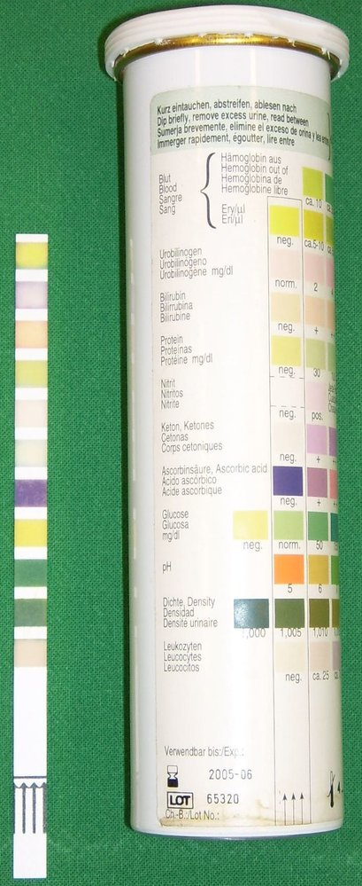
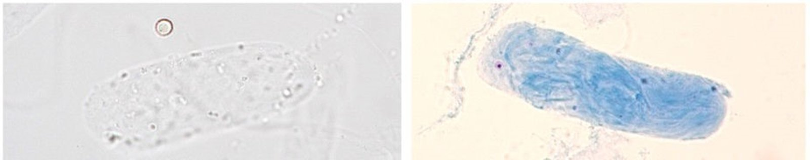
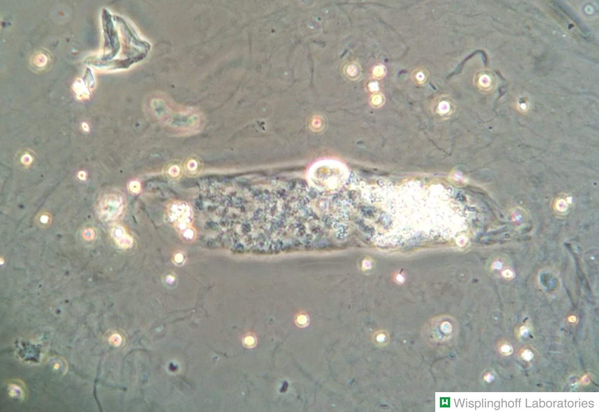
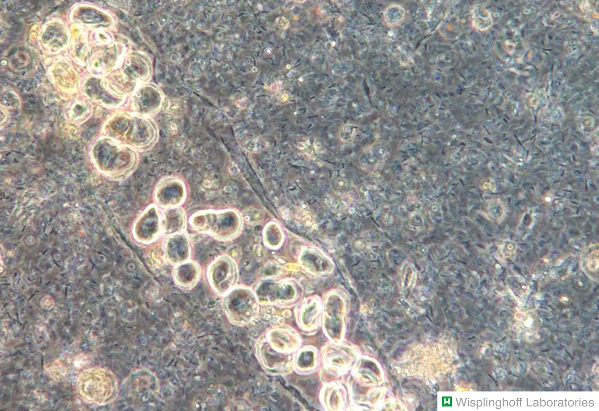
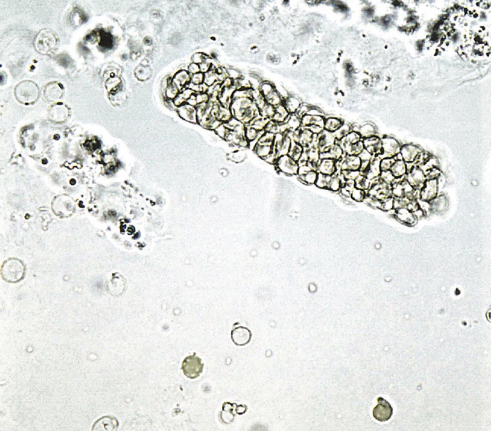
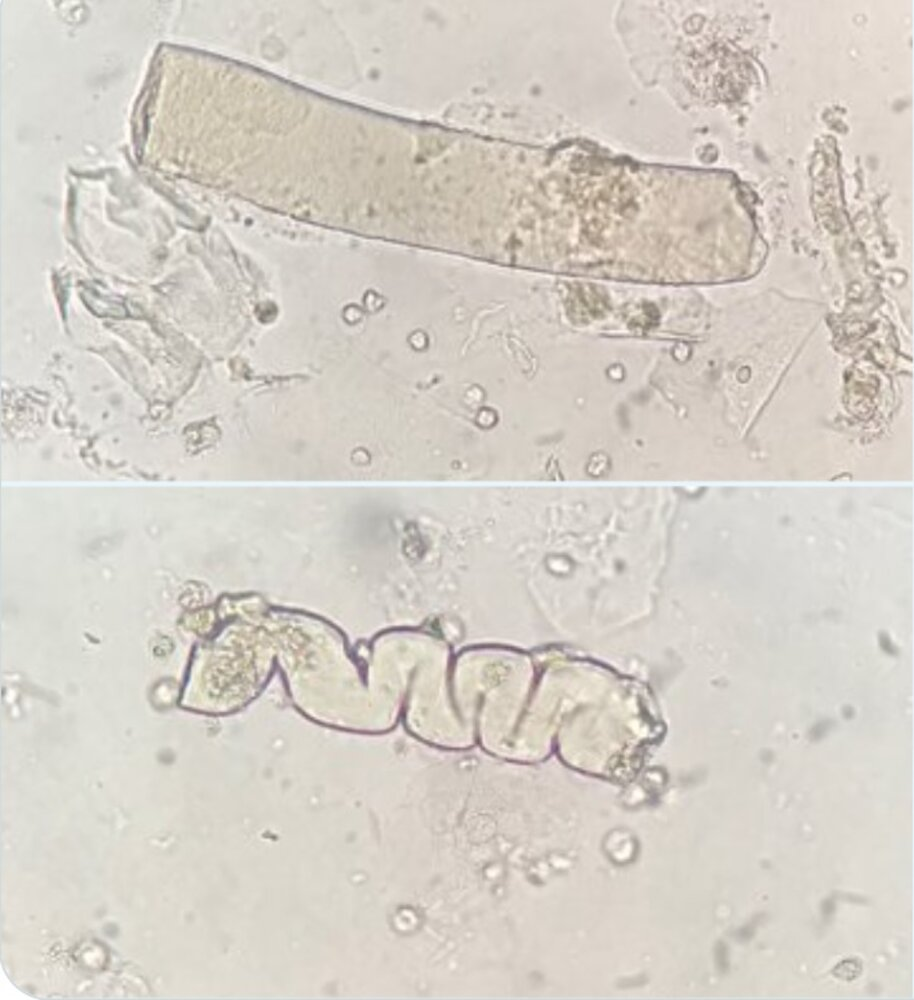
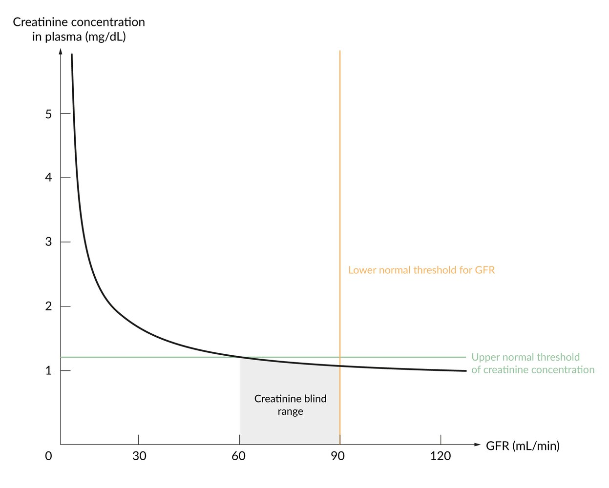
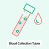

# Diagnostic evaluation of the kidney and urinary tract

*Categories: Clinical knowledge > Urology > Basics of urology > Diagnostic evaluation of the kidney and urinary tract*

[Original Article Link](https://coursology-qbank.com/amboss/article/kg0mv2)

---

## Summary

This article covers important clinical findings of urological and renal conditions, including changes in <u>micturition</u> (e.g., <u>dysuria</u>, <u>anuria</u>) and changes in urine (e.g., <u>hematuria</u>, <u>proteinuria</u>) as well as the routine diagnostics for the initial evaluation of patients with urological and renal symptoms, including <u>urinalysis</u> and <u>renal function testing</u>. <u>Urinalysis</u> helps to evaluate urinary abnormalities and involves gross assessment of urine, <u>dipstick</u>, and microscopy of <u>urine sediment</u>. <u>Dipstick</u> is a diagnostic tool consisting of a urine test strip that allows for quick assessment of potentially pathological changes of various parameters (e.g., <u>pH</u>, <u>glucose</u>, protein). <u>Urine sediment</u> allows for microscopic detection of cells, <u>urinary casts</u>, urinary crystals, bacteria, and <u>yeast</u> in a urine sample. <u>Renal function testing</u> involves a panel of parameters to assess for renal dysfunction. <u>Inulin clearance</u> and <u>creatinine clearance</u> provide the most accurate calculation of the <u>GFR</u> while serum <u>creatinine</u> can be used together with demographic data to provide an <u>estimated GFR</u>. The <u>BUN/creatinine ratio</u> and <u>fractional excretion of sodium</u> can be used to evaluate the cause of <u>acute kidney injury</u>. The findings of these tests may be diagnostic or provide guidance for further diagnostic evaluation (e.g., <u>renal biopsy</u>, imaging)

For more on imaging and <u>urodynamic tests</u>, see “<u>Diagnostic investigations in urology</u>.” For more on <u>urine culture</u>, see “Laboratory tests” under diagnostics in “<u>Urinary tract infections</u>.” Current <u>NBME</u> laboratory reference values can be found under “Tips and Links” below.”

---

## History and physical examination

### <u>Clinical examination</u>

* Changes in urine and <u>micturition</u>: evaluate amount, frequency, appearance, and discomfort (see table below for details)

* Flank <u>pain</u>

* Colicky <u>pain</u> radiating to the groin or genitals is most commonly seen in <u>urolithiasis</u>

* Persistent <u>pain</u>: indicative of inflammatory diseases (e.g., <u>pyelonephritis</u>)

* <u>Costovertebral angle tenderness</u>: : characteristic of <u>pyelonephritis</u>

* <u>Nausea</u>/<u>vomiting</u>: can be a sign of <u>end-stage renal disease</u>:   or <u>urolithiasis</u>

* <u>Hypertension</u>: can be an extrarenal manifestation of <u>kidney injury</u>

* Peripheral <u>edema</u>: See “<u>Proteinuria</u>.”

* <u>Pericardial friction rub</u>: See “<u>Uremic pericarditis</u>.”

* <u>Pulmonary edema</u>: can indicate <u>volume overload</u> due to <u>renal injury</u> with low urine output

* <u>Skin</u> changes: can be indicative of an underlying systemic disease

* Allergic <u>rash</u> (e.g., <u>tubulointerstitial nephritis</u>, <u>systemic lupus erythematosus</u>)

* <u>Petechiae</u>, <u>purpura</u> (e.g., <u>IgA vasculitis</u>, <u>thrombotic thrombocytopenic purpura</u>)

Percussion of the Kidneys - Clinical Examination

> [!TIP]
> <u>Acute appendicitis</u> should be differentiated from right-sided <u>renal colic</u>. Findings that suggest <u>appendicitis</u> include <u>nausea</u>, <u>fever</u>, and <u>pain</u> at <u>McBurney point</u> (see <u>appendicitis signs</u>).

### Changes in <u>micturition</u>

| Overview of <u>micturition</u> changes |  |  |  |
| --- | --- | --- | --- |
|  |  | Definition | Common diagnoses |
| Quality of <u>micturition</u> |  |  |  |
| <u>Dysuria</u> |  |  * <u>Pain</u> or discomfort during <u>micturition</u>   |  * Lower <u>urinary tract infection</u>   |
| Pollakiuria |  |  * Increased daytime <u>urinary frequency</u> ≥ 8 times during waking hours   |   * <u>♀</u>: <u>pregnancy</u>  * <u>♂</u>: <u>BPH</u>    |
| Nocturia |  |  * Waking up to urinate ≥ 2 times at night   |   * <u>Congestive heart failure</u>  * <u>Bladder outlet obstruction</u> (e.g. <u>BPH</u>)    |
| Quantity of urine excretion |  |  |  |
| Polyuria |  |  * Urine output > 3 L/day in adults   |   * <u>Diabetes mellitus</u>  * <u>Diabetes insipidus</u>  * <u>Primary polydipsia</u>    |
| <u>Oliguria</u> |  |  * Urine output < 400 mL/day  [[1]](https://coursology-qbank.com/amboss/article/vrYAQq)   |  * <u>Acute kidney injury</u>   |
| <u>Anuria</u> |  |  * Urine output < 50 mL/day   |   * <u>Shock</u>  * <u>Urinary tract obstruction</u>    |

### Changes in urine

| Overview of urine changes |  |  |  |
| --- | --- | --- | --- |
|  |  | Definition | Common diagnoses |
| Isosthenuria |  |   * Loss of ability to concentrate or dilute urine due to damage to tubular cells  * <u>Urine osmolality</u> similar to that of <u>plasma osmolality</u>    |   * <u>Acute kidney injury</u>  * <u>Sickle cell disease</u>    |
| Glycosuria |  |   * <u>Glucose</u> in the urine  * Occurs when blood <u>glucose</u> levels exceed 180 mg/dL (renal threshold for reabsorption of <u>glucose</u>)    |  * <u>Diabetes mellitus</u>   |
| Ketonuria |  |  * <u>Ketones</u> in the urine   |   * <u>Diabetic ketoacidosis</u>  * States of <u>starvation</u>    |
| <u>Proteinuria</u> |  |  * > 150 mg/24 h in the urine   |   * <u>Diabetic kidney disease</u>  * <u>Hypertensive nephropathy</u>  * <u>Glomerulonephritis</u> (e.g., <u>minimal change disease</u>, <u>focal segmental glomerulosclerosis</u>)  * <u>Fever</u>, intense exercise, <u>dehydration</u>  * <u>Multiple myeloma</u>    |
| Bacteriuria |  |   * <u>Bacteriuria</u>: presence of <u>bacteria in urine</u>  * <u>Significant bacteriuria</u>: ≥ 105<u>colony-forming units</u>/mL in midstream urinary sample    |  * <u>Urinary tract infection</u>   |
| Pyuria |  |  * <u>White blood cells</u> in the urine   |   * <u>Urinary tract infection</u>  * Sterile pyuria  * <u>Acute tubulointerstitial nephritis</u>  * <u>Glomerulonephritis</u> (see <u>nephritic syndrome</u>)  * <u>Urogenital tuberculosis</u>    |
| <u>Hematuria</u> |  |  * <u>Red blood cells</u> in the urine   |   * <u>Benign prostatic hyperplasia</u>  * <u>Urinary tract infection</u>  * <u>Urolithiasis</u>  * <u>Glomerulonephritis</u> (see <u>nephritic syndrome</u>)  * <u>Polycystic kidney disease</u>  * <u>Malignancy</u> (e.g., <u>bladder cancer</u>, <u>renal cell carcinoma</u>)    |
| Hemoglobinuria |  |  * <u>Hemoglobin</u> in the urine   |  * Severe <u>intravascular hemolysis</u>  * <u>Microangiopathic hemolytic anemia</u>  * <u>Paroxysmal nocturnal hemoglobinuria</u>  * <u>G6PD deficiency</u>  * <u>Malaria</u> (especially <u>Plasmodium falciparum</u>)   |
| Myoglobinuria |  |  * <u>Myoglobin</u> in the urine   |  * <u>Rhabdomyolysis</u>   |

---

## Urinalysis

<u>Urinalysis</u> involves the gross examination of urine, chemical evaluation using <u>urine dipstick</u>, and microscopic assessment of <u>urine sediment</u>. Further tests include <u>urine culture</u> and urinary <u>electrolyte</u> levels. Indications for <u>urinalysis</u> include renal, urinary, and metabolic conditions.

### Gross urine assessment

* Urine color

* Normal: pale yellow to dark amber

* <u>Red urine</u>: See “<u>Hematuria</u>.”

* Black urine: <u>alkaptonuria</u>

* Turbidity (cloudiness of the urine): cloudy urine suggests infection or <u>chyluria</u>

> [!NOTE]
> Certain drugs (e.g., <u>rifampin</u>, <u>phenazopyridine</u>), foods (e.g., beetroot), and types of <u>porphyria</u> cause red discoloration of urine.

### Urine dipstick

A diagnostic tool consisting of a urine test strip that allows for quick assessment of potentially pathological changes of various parameters.

* <u>pH</u> (urine <u>pH</u> usually ranges from 4.5–8)

* Urine specific gravity: Measures the <u>ratio</u> of urine density over pure water density (normally 1.005–1.030) 

* High <u>urine specific gravity</u>: volume loss, <u>heart failure</u>, presence of large molecules (e.g., <u>glucose</u>, radiocontrast media)

* Low <u>urine specific gravity</u>: <u>renal failure</u>, <u>diabetes insipidus</u>

* <u>Heme</u>: > 90% <u>sensitivity</u> for <u>hematuria</u> (low <u>specificity</u>)

* <u>Leukocyte esterase</u>: enzyme produced by <u>WBC</u> that indicates a <u>urinary tract infection</u>

* Protein (<u>albumin</u>): See “<u>Proteinuria</u>.”

* <u>Glucose</u>: <u>glycosuria</u> is a key finding of <u>diabetes mellitus</u>

* <u>Ketones</u>: <u>ketonuria</u> can help diagnose <u>diabetic ketoacidosis</u>, a complication of <u>type 1 diabetes mellitus</u>

* <u>Urobilinogen</u>: See “<u>Prehepatic jaundice</u>” and “<u>Intrahepatic jaundice</u>.”

* Nitrite: indicative of <u>urinary tract infection</u> caused by <u>gram-negative bacteria</u> (e.g., <u>Enterobacteriaceae</u>)

Urinalysis (urine analysis) test strip

> [!TIP]
> A <u>urine dipstick</u> cannot differentiate between <u>hematuria</u>, <u>hemoglobinuria</u>, or <u>myoglobinuria</u>. Therefore, every positive test result for <u>heme</u> must be confirmed with the presence of <u>RBCs</u> on microscopy.

### Urine sediment

* Indications: can help identify acute and chronic <u>kidney</u> diseases, classify <u>renal calculi</u>, and diagnose <u>UTIs</u>

* Method: Urine is centrifuged and the pellets are examined under the microscope (supernatant is discarded).

* Assessment: provides valuable information about the underlying cause of <u>kidney</u> damage

* Cells

* <u>Erythrocytes</u>

* <u>Leukocytes</u>

* <u>Acanthocytes</u>

* <u>Urinary casts</u>: Tubular structures formed in the <u>distal convoluted tubule</u> and <u>collecting duct</u> of the <u>kidneys</u> that are indicative of a disease affecting the renal tubules and/or <u>glomeruli</u>
* See table below for details.

* Crystals: See <u>overview of urinary calculi</u>.

* Bacteria

* <u>Yeast</u>

|  Urinary casts [[2]](https://coursology-qbank.com/amboss/article/NfY-mo) |  |  |  |
| --- | --- | --- | --- |
|  | Structure | Microscopy | Interpretation |
| Hyaline casts |  * Composed of Tamm-Horsfall mucoproteins, which are secreted by renal tubular cells in order to prevent <u>urinary tract infections</u>   |  * Homogeneous, transparent, and eosinophilic   |   * Nonspecific finding in <u>chronic renal disease</u> or <u>diuretic</u> therapy  * Can be found in healthy individuals (e.g., in <u>dehydration</u> and/or after strenuous physical exercise)    |
| Granular casts |   * Caused by degeneration of cellular casts  * Composed of a <u>hyaline</u> matrix with cellular debris    |   * Usually bigger than <u>hyaline casts</u>  * Droplets are refractive.    |   * Indicate stasis in the <u>nephron</u>  * Seen in <u>acute tubular necrosis</u>, advanced <u>glomerulonephritis</u>, <u>pyelonephritis</u>, <u>malignant nephrosclerosis</u>)    |
| Muddy brown casts |  * <u>Granular casts</u> with dark pigmentation   |   * Subtype of <u>granular casts</u>  * Specific for <u>acute tubular necrosis</u>    |  |
| Hemoglobin casts |  * Result from degeneration of <u>RBCs</u> within the cast matrix.   |  * Cells are no longer visible, but <u>hemoglobin</u> pigment remains, giving the casts an orange-yellow or red-brown color.   |  * Indicate <u>intravascular hemolysis</u>   |
| Fatty casts |  * Formed from congregated fat droplets and “oval fat bodies” with a protein matrix   |   * Round fat droplets with variable size  * “<u>Maltese cross</u>” appearance within fat droplets under polarized light    |  * Indicate <u>nephrotic syndrome</u>   |
| Renal tubular epithelial cell casts |  * Consist of congregated tubular <u>epithelial</u> cells   |   * <u>Tubular casts</u>  * Can contain multiple layers of cells  * Can be hard to differentiate from <u>WBC casts</u>    |   * May be seen in proliferative <u>glomerulonephritis</u>, <u>interstitial</u> nephritis, or <u>acute tubular necrosis</u>  * Can occasionally be found in healthy individuals    |
| White blood cell casts |  * Accumulated <u>WBCs</u> within a protein matrix   |   * Casts with sharp margins  * Central <u>nuclei</u> are seen.  * Can be hard to differentiate from <u>renal tubular epithelial cell casts</u>    |   * Strong indication of acute <u>pyelonephritis</u>  * Can also be seen in <u>tubulointerstitial nephritis</u> or <u>glomerulonephritis</u>  * <u>Transplant rejection</u>    |
| Red blood cell casts |  * Accumulated <u>RBCs</u> in a mucoprotein matrix   |  * Cluster of biconcave <u>RBCs</u> with darkly-staining <u>hemoglobin</u>   |   * Indicate <u>glomerulonephritis</u>  * Can be seen with <u>hypertensive emergency</u>    |
| Waxy casts |  * Degenerating granular cast   |   * Homogeneous, sharp indentations  * Edges that appear more distinct and dark    |   * Indicate renal stasis  * Nonspecific finding  * May be seen in both acute and <u>chronic kidney disease</u>  (<u>end-stage renal disease</u>)    |
| Broad casts |   * Wide casts  * Formed in dilated tubules or <u>collecting ducts</u> with extremely low flow    |  * Wider than other casts   |  * Seen in advanced <u>chronic kidney disease</u>   |

Hyaline cast

Granular cast in urine sediment

White blood cell casts

Red blood cell cast

Red blood cell (RBC) casts in urine sediment

Waxy casts

Maltese cross sign

### Further laboratory tests

* Urine osmolality 

* Can be used to evaluate <u>urine concentration</u>

* More accurate than the <u>dipstick</u> measurement for specific gravity

* Urine osmolar gap (<u>UOG</u>): The difference between measured <u>urine osmolality</u> and calculated <u>urine osmolality</u>, used to estimate urine NH4+ concentration in <u>metabolic acidosis</u>.

* Urine <u>electrolytes</u>

* Urine <u>sodium</u> (Na+): e.g., low urine <u>sodium</u> indicates that the <u>kidneys</u> are trying to retain free water by reabsorbing Na+ (e.g., due to <u>dehydration</u>)

* <u>Fractional excretion of sodium</u>: can help determine the cause of <u>acute kidney injury</u>

* Urine <u>creatinine</u>: used to calculate <u>creatinine clearance</u>

* <u>Urine culture</u>: See diagnosis section in “<u>Urinary tract infections</u>.”

---

## Renal function test

### Overview

* <u>Parameters of renal function</u> allow for the evaluation of changes in renal function.

* <u>Inulin clearance</u> and <u>creatinine clearance</u> (with 24-hour urine collection): allow for the most accurate calculation of the <u>glomerular filtration rate</u>

* Serum <u>creatinine</u> and serum <u>cystatin C</u> allow for indirect measurement of the <u>glomerular filtration rate</u> (see <u>estimated GFR</u>).

* <u>Urea</u> (<u>BUN</u>) and <u>uric acid</u> are largely dependent on <u>renal excretion</u>; however, they only provide an inaccurate assessment of renal function.

* <u>Fractional excretion</u> of urine is used to establish the cause of <u>acute kidney injury</u>.

* Current <u>NBME</u> laboratory reference values can be found under “Tips and Links” below.”

### Glomerular filtration rate (<u>GFR</u>) [[3]](https://coursology-qbank.com/amboss/article/0SYeyo)[[4]](https://coursology-qbank.com/amboss/article/aSYQyo)

* Defined as the volume of primary urine that is filtrated by the <u>kidneys</u> over a certain amount of time per standardized body surface area (1.73 m2)

* Normal <u>GFR</u>: ≥ 90 mL/min/1.73m2

* <u>GFR</u> is ∼ 120 mL/min/1.73m2 in young adults, decreases with age, and varies considerably between males and females

* After the age of 29, a physiological decrease in the <u>GFR</u> of about 10 mL/min/1.73m2 occurs every 10 years.

* <u>GFR</u> can be calculated or estimated using various methods (e.g., <u>estimated GFR</u>).

### Serum creatinine

* Indirect indicator of renal function

* <u>Creatinine</u> is a metabolite of <u>creatine</u> in the muscle (<u>creatine</u> + <u>ATP</u> ⇄ <u>phosphocreatine</u> + <u>ADP</u>).

* <u>Creatinine</u> is entirely removed by <u>glomerular filtration</u>.

* Because <u>creatinine</u> is produced at a relatively constant rate and freely filtered by the <u>glomeruli</u>, it can be used to estimate <u>GFR</u>.

* Creatinine-blind range 

* Serum <u>creatinine</u> levels do not start rising until the <u>GFR</u> is reduced by approx. 50%.

* If the <u>GFR</u> is > 60 mL/min, serum <u>creatinine</u> cannot be used to assess <u>kidney function</u>.

* Additional interfering factors:

* Increased <u>creatinine</u> levels

* High-protein diet

* High muscle mass

* Rigorous exercise

* Decreased <u>creatinine</u> levels: low muscle mass

Creatinine concentration curve

> [!NOTE]
> Serum <u>creatinine</u> levels do not start rising until the <u>GFR</u> is reduced by approx. 50%.

#### Creatinine clearance

* Used in clinical settings to approximate the <u>glomerular filtration rate</u> (<u>GFR</u>)

* Slightly overestimates <u>GFR</u> because of minimal <u>creatinine</u> secretion in the <u>proximal</u> tubules  [[5]](https://coursology-qbank.com/amboss/article/YSYnyo)

* A precise evaluation of <u>creatinine clearance</u> requires measuring <u>creatinine</u> in the urine over a 24-hour period.

* <u>Creatinine clearance</u> = (CreaUrine x V) / CreaPlasma ≈ <u>GFR</u>

* CreaUrine = <u>creatinine</u> concentration in urine

* V = rate of urine flow in mL/min (volume/time)

* CreaPlasma = <u>creatinine</u> concentration in plasma

> [!NOTE]
> <u>Creatinine clearance</u> can be used to approximate the <u>GFR</u>.

#### <u>Estimated GFR</u> (<u>eGFR</u>)

* Calculated using serum <u>creatinine</u> concentration and demographic data

* Several prediction equations can be used in clinical practice.

* Cockcroft-Gault equation: <u>creatinine</u> clearance = [(140 – age) x weight (kg) x constant]  / serum <u>creatinine</u> (mmol/L)

* Modification of Diet in Renal Disease (MDRD) study equation

* Chronic <u>Kidney</u> Disease <u>Epidemiology</u> Collaboration (<u>CKD</u>-EPI) equation

#### Serum cystatin C

* A more precise indicator of the <u>GFR</u> than serum <u>creatinine</u>

* <u>Cystatin C</u> is a small protein that inhibits <u>cysteine</u> proteinases and is produced by all nucleated cells.

* Analysis is more complex and expensive; therefore, not routinely ordered.

* Lower “blind range” than serum <u>creatinine</u>: used particularly when urine sampling is not feasible (e.g., in <u>infants</u>)

### Blood urea nitrogen (<u>BUN</u>)

* A waste product produced by the <u>liver</u> in the <u>urea cycle</u> after <u>protein degradation</u>

* Filtered and excreted by the <u>kidneys</u>

* Elevated with

* Reduced <u>GFR</u>

* High protein diet

* <u>Protein catabolism</u>

#### BUN/creatinine ratio

* Can help diagnose the underlying cause in <u>acute kidney injury</u>

* 10:1–20:1 can be normal or may indicate a postrenal cause.

* ≥ 20:1 indicates <u>prerenal</u> cause: <u>Urea</u> reabsorption is increased, which is typical in patients with <u>dehydration</u> or <u>hypoperfusion</u>.

* ≤ 15:1 indicates intrarenal cause: Renal damage causes decreased <u>urea</u> reabsorption.

### Fractional excretion of sodium (FeNa)

* Definition: percentage of the <u>glomerular</u> filtered <u>sodium</u> (NaFiltered) that is eventually excreted in the urine (NaExcreted)

* Usage

* Can help establish the cause of <u>acute kidney injury</u>

* Can help distinguish between renal and extrarenal etiology in <u>hypotonic hyponatremia</u> (see “<u>Diagnostic approach to hyponatremia</u>”)

* Calculation

* Filtered Na = NaPlasma x <u>GFR</u>

* Excretion rate of Na = NaUrine x V

* FeNa= NaExcreted/ NaFiltered

* FeNa = (NaUrine x V) / (NaPlasma x <u>GFR</u>)

* FeNa= (NaUrine x V) / (NaPlasmax [CreaUrine x V / CreaPlasma])

* FeNa= (NaUrine x CreaPlasma) / (NaPlasmax CreaUrine)

* Interpretation

* In <u>acute kidney injury</u>

* Low FeNa (< 1%): indicates a <u>prerenal</u> cause (renal <u>hypoperfusion</u>)

* High FeNa (> 2%): indicates an intrarenal etiology (e.g., <u>acute tubular necrosis</u>)

* Inconclusive FeNa (1–2%): can be seen with either disorder

* In <u>hypotonic hyponatremia</u>

* Low FeNa (< 1%): extrarenal cause

* High FeNa(> 1%): renal cause

### Additional blood tests

* <u>Autoantibodies</u>: : particularly <u>antinuclear antibodies</u> (<u>ANCA</u>) as an indication of <u>glomerulonephritis</u>

* Uric acid: a metabolite of <u>purine</u> bases

* <u>Uric acid crystals</u> can form in the <u>joints</u>, where they can trigger inflammatory reactions and <u>pain</u> (i.e., <u>gout</u> attack).

* <u>Hyperuricosuria</u> can lead to <u>uric acid nephropathy</u>.

* Other

* Other parameters that should be evaluated in renal disease (particularly in <u>chronic renal failure</u>) are serum <u>electrolytes</u> (Na+, <u>K+</u>, <u>Ca2+</u>, <u>phosphate</u>), <u>vitamin D</u>, and <u>parathyroid hormone</u> (<u>PTH</u>).

* See “Diagnostics” in “<u>Chronic kidney disease</u>” for details.

Blood Collection Tubes: Common Types

### Renal parameter changes

| Overview of renal parameters |  |  |
| --- | --- | --- |
| Laboratory parameter | Causes of increased values | Causes of decreased values |
| <u>Creatinine</u> |   * Acute or chronic <u>renal failure</u> * See <u>creatinine clearance</u>  * ↑ <u>Glucose</u>  * ↑ <u>Ketone</u> bodies  * ↑ Protein intake  * High muscle mass  * Strenuous exercise    |   * Low muscle mass  * Underweight individuals  * <u>Pregnancy</u>    |
| <u>Cystatin C</u> |   * Acute or <u>chronic renal failure</u>  * <u>Glucocorticoid</u> administration  * <u>Hyperthyroidism</u>    |  * <u>Hypothyroidism</u>   |
| <u>Blood urea nitrogen</u> (<u>BUN</u>) |   * Severe <u>renal failure</u>  * <u>Catabolic</u> states  * <u>Dehydration</u>  * <u>Liver</u> diseases  * <u>Urinary tract obstruction</u>  * <u>Congestive heart failure</u>  * <u>Gastrointestinal bleeding</u>    |   * <u>Malnutrition</u>  * <u>Urea cycle disorders</u> (e.g., <u>ornithine transcarbamylase deficiency</u>)    |
| <u>Uric acid</u> |   * Renal disorders  * <u>Uric acid nephrolithiasis</u>  * <u>Acute uric acid nephropathy</u>  * <u>Acute renal failure</u>  * Increased <u>cell death</u> (e.g., <u>tumor lysis syndrome</u>)  * <u>Lesch-Nyhan syndrome</u>  * Fanconi Syndrome  * Antiuricosuric drugs (e.g., all <u>diuretics</u>, <u>ethambutol</u>, <u>niacin</u>, <u>aspirin</u>, <u>diclofenac</u>)    |  * Treatment with <u>allopurinol</u> or <u>uricosuric medication</u> (e.g., <u>probenecid</u>)   |

---

## Renal biopsy

### Overview

* Usually performed percutaneously under <u>local anesthesia</u> and with <u>ultrasound</u> guidance.

* Examination of the tissue sample includes light, <u>immunofluorescence</u>, and <u>electron microscopy</u>.

* The most common complication is bleeding.

### Indications

* Nephritic and/or <u>nephrotic syndrome</u> with no apparent underlying disease: allows diagnosing type of <u>glomerulonephritis</u>

* Suspected <u>lupus nephritis</u>

* <u>Rapidly progressive glomerulonephritis</u>

* <u>Renal transplant</u> rejection or dysfunction

* Unexplained <u>acute kidney injury</u>

### Contraindications

* Solitary <u>kidney</u> (<u>relative contraindication</u>)

* Infection of the <u>kidneys</u>

* <u>Coagulation disorders</u> (e.g., <u>thrombocytopenia</u>, disorders of the <u>platelet</u> function, <u>bleeding diathesis</u>)

* Uncontrolled <u>hypertension</u>

* Anatomic abnormalities

* Abnormal position of the <u>kidneys</u>

* <u>Atrophic</u> <u>kidneys</u>

* Vascular <u>malformations</u> in the <u>kidney</u> region

* <u>Hydronephrosis</u>

* Multiple, bilateral <u>renal cysts</u>

---