# Female reproductive organs

*Categories: Clinical knowledge > Urology > Basics of urology > Female reproductive organs*

[Original Article Link](https://coursology-qbank.com/amboss/article/O60IOS)

---

## Summary

The female reproductive organs can be divided into the upper genital tract (i.e., <u>uterus</u>, <u>fallopian tubes</u>, <u>ovaries</u>, and <u>cervix</u>) and the lower genital tract (i.e., the <u>vagina</u> and <u>vulva</u>). The upper genital organs and the <u>vagina</u> are located in the <u>pelvis</u>, while the <u>vulva</u> is a part of the <u>perineum</u>. These organs participate in several hormonal and mechanical pathways that are responsible for secondary <u>sexual development</u> and reproduction. The <u>uterine cavity</u> is the site of embryonic implantation and <u>fetal development</u>. The <u>cervix</u> is the lower portion of the <u>uterus</u> and provides a passageway for the expulsion of uterine contents or the entry of spermatozoa into the <u>uterine cavity</u>. The <u>ovaries</u> are paired organs responsible for <u>gametogenesis</u> and sex <u>hormone</u> synthesis in females. In the middle of each <u>menstrual cycle</u>, a mature <u>ovum</u> ruptures out of a <u>Graafian follicle</u> and travels along the <u>fallopian tubes</u>, where it may be fertilized by <u>sperm</u>. The <u>vagina</u> is a hollow muscular structure that receives ejaculate during copulation and serves as a conduit for the expulsion of uterine contents. The <u>vulva</u> is the <u>anterior</u> portion of the <u>perineum</u> and is composed of the <u>labia majora</u>, the <u>labia minora</u>, the <u>clitoris</u>, and the <u>mons pubis</u>. The labia envelop the <u>clitoris</u>, the urethral orifice, and the vaginal introitus.

---

## Overview

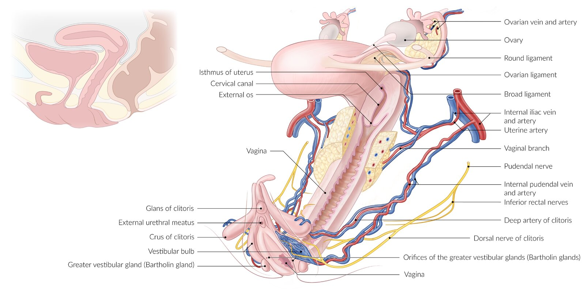

Female reproductive organs and their neurovascular supply

---

## Uterus and cervix

### Function [[1]](https://coursology-qbank.com/amboss/article/ES08Yf)

* <u>Uterus</u>

* Site of implantation of the fertilized <u>ovum</u>

* Protects and supports the growth of the fetus

* Site of <u>menstruation</u>; see physiology of <u>the menstrual cycle</u>.

* <u>Cervix</u>

* Promotes entry of <u>sperm</u> into the <u>uterus</u> for <u>fertilization</u>

* Allows menstrual blood to flow from the <u>uterus</u> into the <u>vagina</u>

* The <u>endocervix</u> secretes a clear, alkaline fluid to facilitate the passage of <u>sperm</u>.

### Gross anatomy [[1]](https://coursology-qbank.com/amboss/article/ES08Yf)

#### Overview

* Location

* The <u>uterus</u> and <u>cervix</u> are located within the <u>pelvis</u>.

* The <u>uterus</u> is located <u>posterior</u> to the <u>bladder</u> and <u>anterior</u> to the <u>rectum</u>.

* The <u>cervix</u> is the most <u>distal</u> aspect of the <u>uterus</u> and protrudes into the fundus of the <u>vagina</u>.

* Most of the uterine body and <u>posterior</u> supravaginal <u>cervix</u> are covered by <u>peritoneum</u>.

* Position

* The <u>uterus</u> is most commonly <u>anteverted</u> by 90° and <u>anteflexed</u> by 120°.

* Other variants (e.g., retroflexion) occur in 10% of women and may impair <u>conception</u>.

* Neighboring structures

* Anteriorly: <u>uterovesical pouch</u>

* Posteriorly: <u>rectouterine pouch</u>

* Laterally: <u>fallopian tubes</u>, folds of <u>peritoneum</u> (including <u>broad ligament</u>), <u>round ligament</u>, <u>ovarian ligament</u>, <u>cardinal ligament</u>

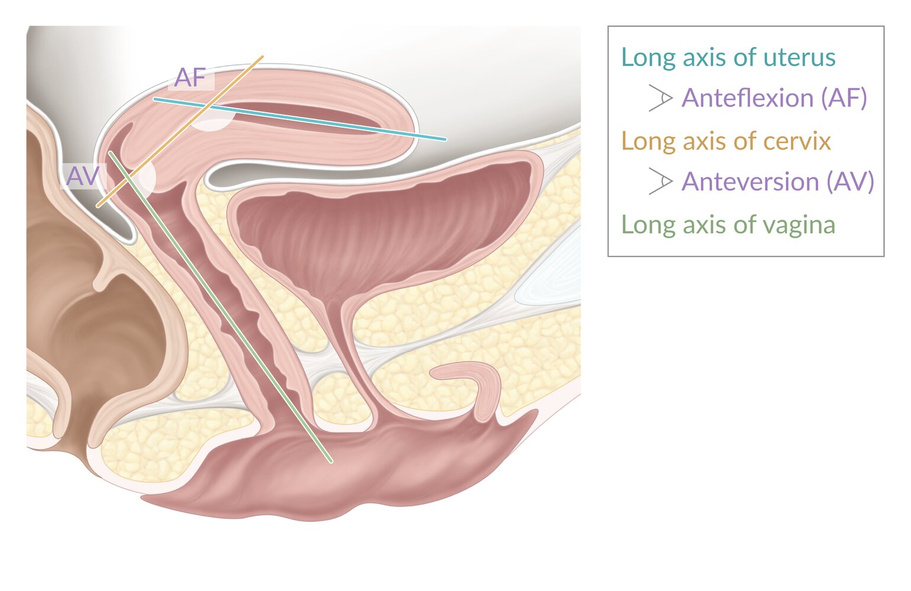

Angles of anteflexion and anteversion of the uterus

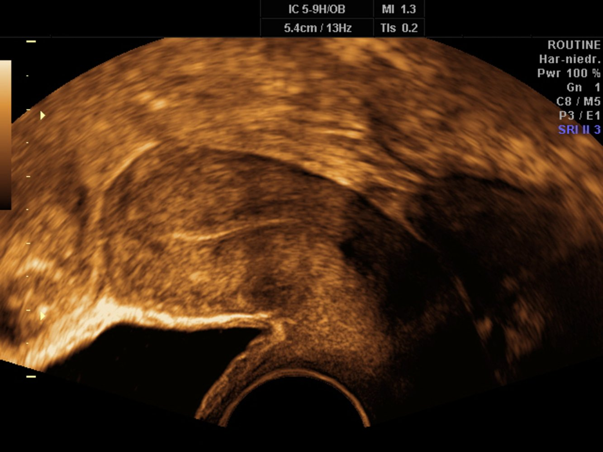

Normal uterus

#### Structure

* Uterine fundus: superior, rounded aspect of the <u>uterus</u>

* Body

* Uterine horns: site of the opening of the <u>fallopian tubes</u> bilaterally

* Uterine cavity: triangular; continuous with the <u>uterine tube</u> and internal os

* <u>Isthmus</u>:

* Constriction between the body and the <u>cervix</u>

* Corresponds to the level of the internal os of the <u>uterus</u>

* <u>Cervix</u>: fibrous, cylindrical part of the <u>distal</u> <u>uterus</u> between the internal and external orifice

* Supravaginal <u>cervix</u>: portion of the <u>cervix</u> superior to the <u>vagina</u>

* Vaginal <u>cervix</u>: portion of the <u>cervix</u> that protrudes into the fundus of the <u>vagina</u>

* Cervical canal

* Cervical os: the opening of the <u>cervix</u> into the <u>vagina</u>

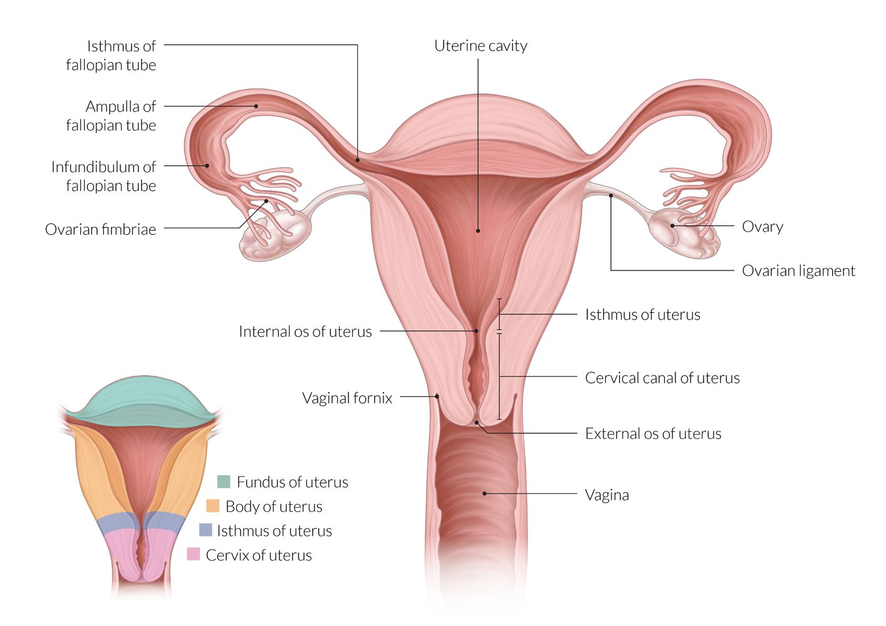

Uterus, fallopian tubes, and ovaries

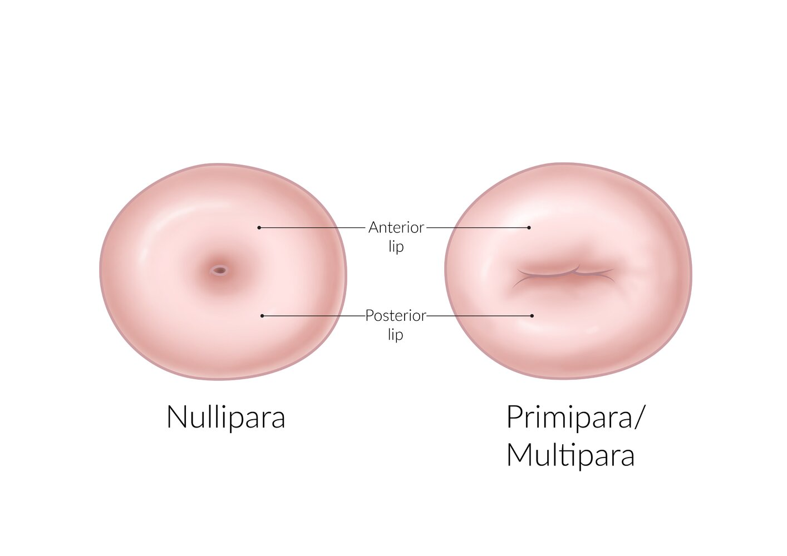

Ectocervix and the external os

Ectocervix

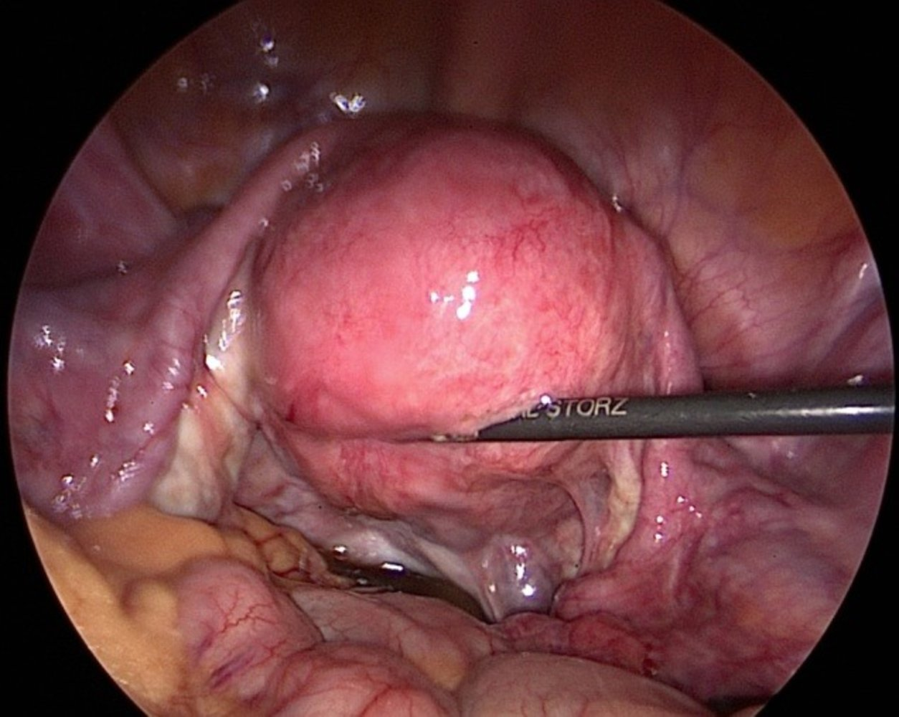

Uterus and associated structures

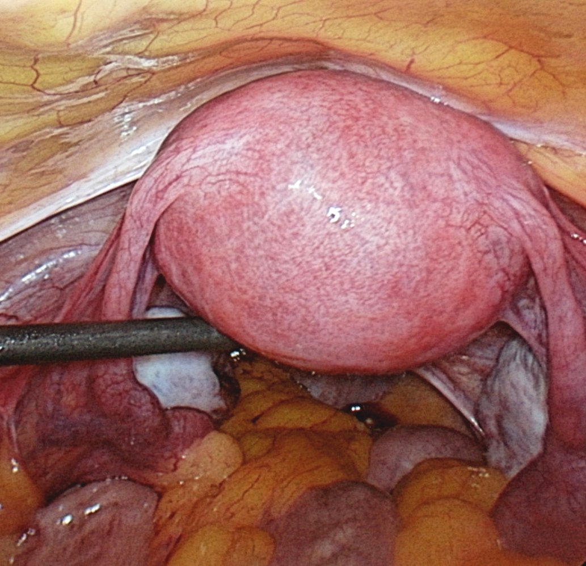

Uterus and associated structures

#### Vasculature

| <u>Blood vessels</u> of the <u>uterus</u> |  |  |
| --- | --- | --- |
| Vessel | Course | Function |
| <u>Ovarian artery</u> |  * A <u>branch of the abdominal aorta</u>   |  * Supplies the <u>proximal</u> portion of the uterine body   |
| Uterine artery |   * A branch of the <u>internal iliac artery</u>  * Crosses the <u>ureter</u> anteriorly in the <u>broad ligament</u>    |  * Supplies the <u>distal</u> portion of the <u>uterus</u> and the <u>cervix</u>   |
| Uterine vein |   * Venous plexus in the uterine wall (<u>broad ligament</u>) → <u>uterine veins</u> → <u>internal iliac veins</u>  * <u>Uterine veins</u> cross the <u>ureter</u> in the <u>broad ligament</u>    |  * Drains the <u>uterus</u>   |

> [!NOTE]
> Ligation of the uterine <u>arteries</u> (e.g., during <u>hysterectomy</u>) carries a risk of <u>ureter</u> injury!

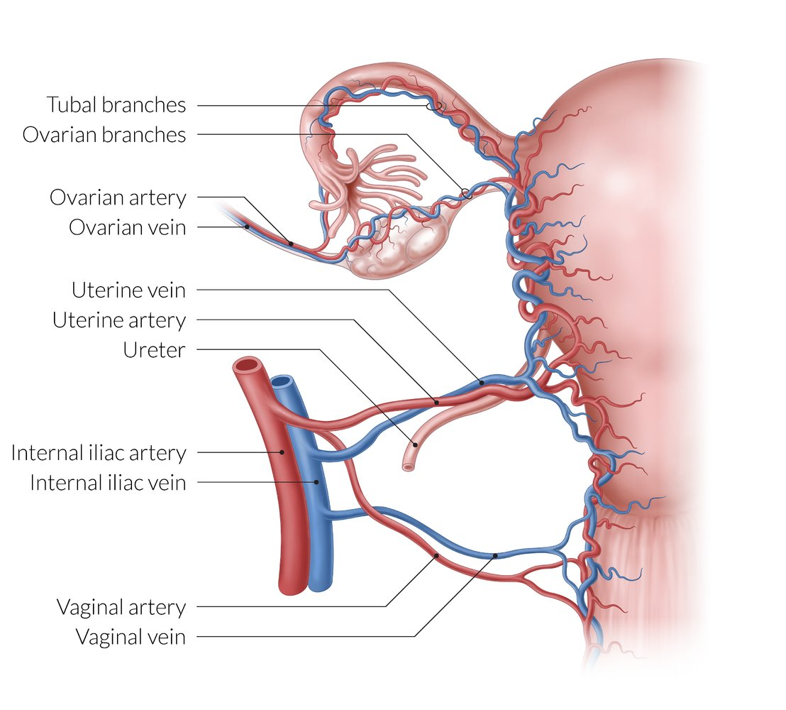

Blood supply of the female reproductive organs (dorsal view)

#### <u>Lymphatics</u>

| <u>Lymphatic drainage</u> of the <u>uterus</u> |  |  |
| --- | --- | --- |
| Structure | Drainage | Course |
| Fundus |   * <u>Preaortic nodes</u>  * <u>Paraaortic nodes</u>    |  * Ovarian vessels   |
| Body and сervix |  * <u>External iliac nodes</u>   |  * <u>Broad ligament</u>   |
|  * <u>Internal iliac nodes</u>   |  * Uterine vessels   |  |
|  * Obturator nodes   |  * Obturator fossa   |  |
|  * Laterally; some into <u>superficial inguinal nodes</u>   |  * <u>Round ligament</u>   |  |

#### Innervation [[1]](https://coursology-qbank.com/amboss/article/ES08Yf)[[2]](https://coursology-qbank.com/amboss/article/N5Y-4p)

| Innervation of the <u>uterus</u> |  |  |
| --- | --- | --- |
| Type | Course | Function |
| <u>Sympathetic</u> |  * T10–L2 → <u>superior hypogastric plexus</u> → <u>inferior hypogastric plexus</u> → <u>uterovaginal plexus</u>   |   * Uterine contraction  * <u>Vasoconstriction</u>    |
| <u>Parasympathetic</u> |  * <u>S2</u>–<u>S4</u> → <u>pelvic splanchnic nerves</u> → <u>inferior hypogastric plexus</u> → <u>uterovaginal plexus</u>   |  * <u>Vasodilation</u>   |
| Viscerosensory |   * <u>Uterus</u>: Afferent fibers follow <u>sympathetic</u> efferent fibers to T10–L2.  * <u>Cervix</u>: Some afferent fibers follow <u>parasympathetic</u> efferent fibers to <u>S2</u>–<u>S4</u>.    |  * <u>Visceral pain</u> * Includes <u>referred pain</u> to relevant <u>dermatome</u>   |

#### <u>Ligaments</u>

* See “<u>Ligaments of the female pelvis</u>” below.

#### <u>Uterus</u>

The <u>uterus</u> is composed of three layers. From internal to external:

1. * Endometrium: <u>mucosal</u> layer consisting of two layers
1. * Simple <u>columnar epithelium</u> with <u>tubular glands</u>

* <u>Functional layer of the endometrium</u>: proliferates and then sloughs during <u>the menstrual cycle</u>

* <u>Tubular glands</u> are long during the <u>proliferative phase</u> and coiled during the <u>secretory phase</u>.
2. * <u>Connective tissue</u> (stroma)
2. * Myometrium: <u>smooth muscle</u> layer

* Contains <u>blood vessels</u>, nerves, and <u>lymphatics</u>

* Composed of <u>smooth muscle</u> and <u>loose connective tissue</u>
3. * Perimetrium

* Uterine body: covered by <u>peritoneal</u> serosa

* <u>Anterior</u> <u>cervix</u> and <u>lateral</u> uterine body: adventitia (not covered by <u>peritoneum</u>)

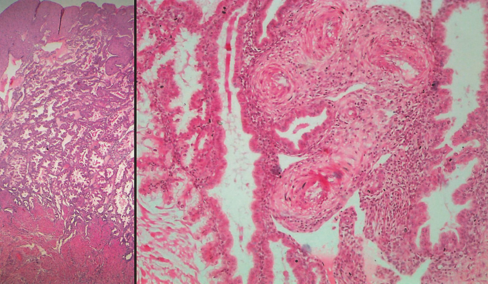

Endometrium (secretory phase)

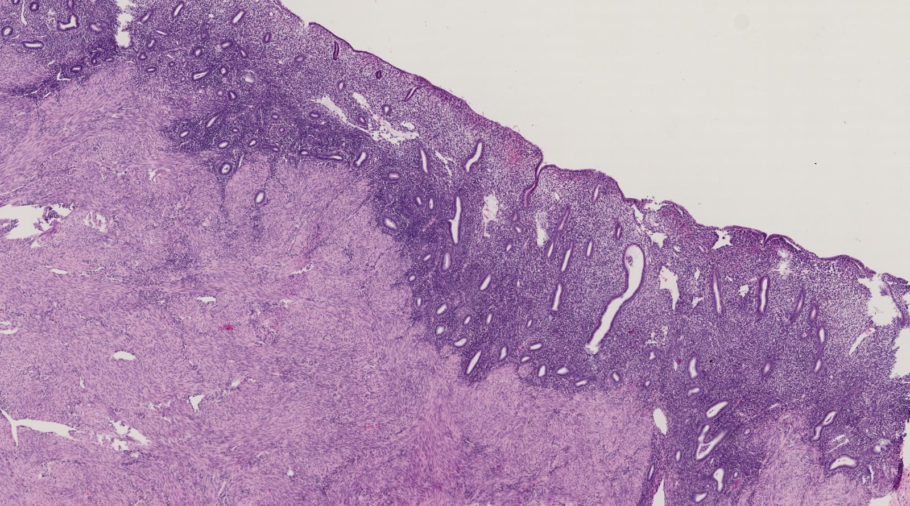

Endometrium, early follicular phase

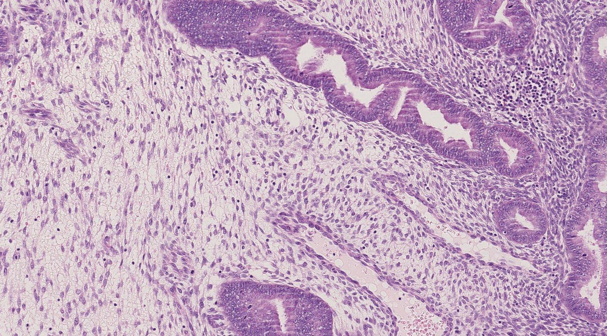

Endometrium, mid-follicular phase

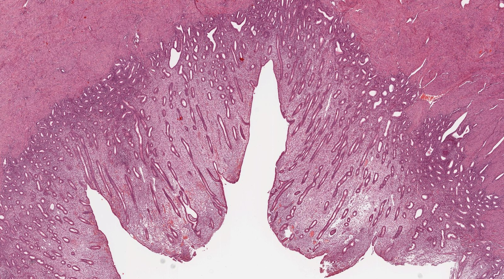

Endometrium, late proliferative phase

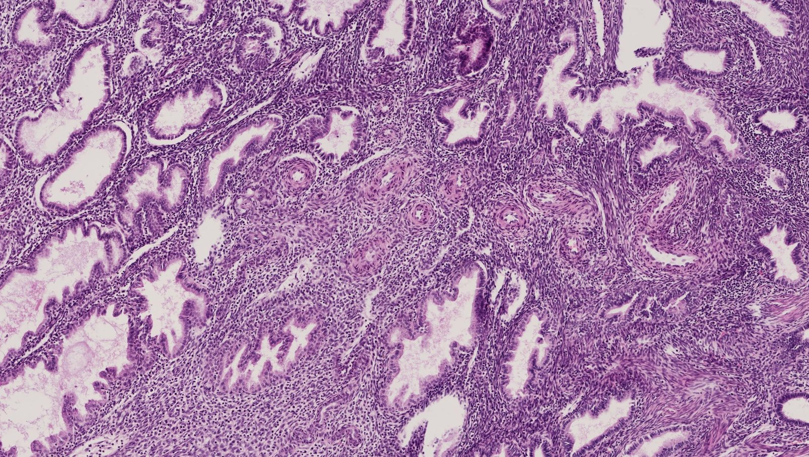

Endometrium, luteal phase

#### <u>Cervix</u>

Composed primarily of fibroelastic <u>connective tissue</u>. Can be divided into:

1. * Endocervix: inner part of the <u>cervix</u> <u>proximal</u> to the uterine external os
* Composed of simple <u>columnar epithelium</u> with mucous-producing cells
2. * Cervical transformation zone: physiologic transition zone between the <u>endocervix</u> and <u>ectocervix</u>

* Exact location is variable

* Site of the <u>squamocolumnar junction</u>: the border between <u>metaplastic</u> <u>squamous epithelium</u> and simple <u>columnar epithelium</u>

* <u>Cervical cancer</u> most commonly occurs in this zone.
3. * Ectocervix: outer part of the <u>cervix</u> <u>distal</u> to the uterine external os
* Composed of <u>stratified</u> <u>squamous epithelium</u> (nonkeratinized)

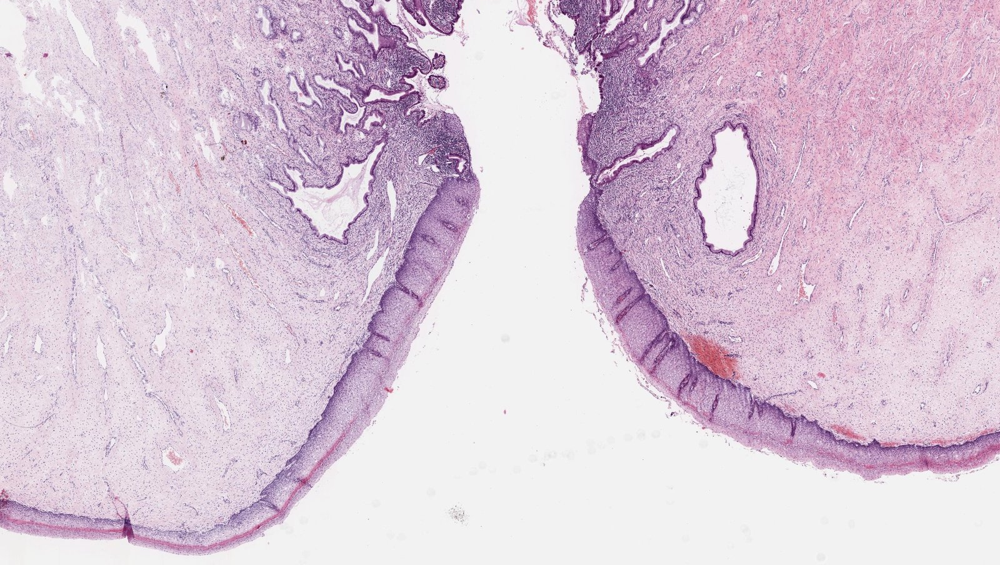

Cervix with external os of uterus

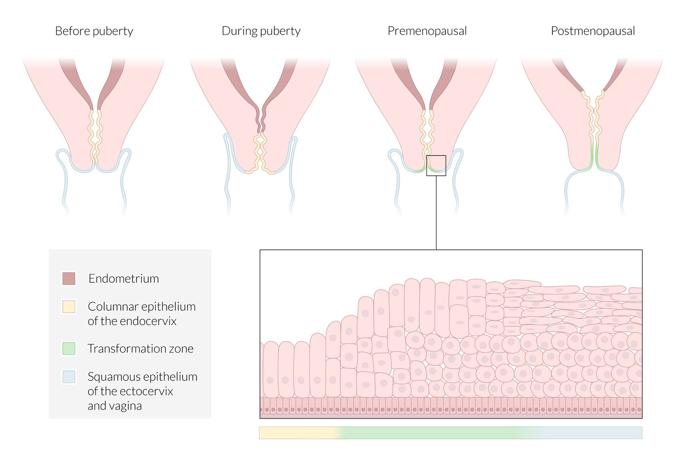

Transformation zone of the cervix

### <u>Embryology</u> [[1]](https://coursology-qbank.com/amboss/article/ES08Yf)[[3]](https://coursology-qbank.com/amboss/article/LNYwbp)

* Derivatives

* <u>Paramesonephric duct</u> (<u>Müllerian duct</u>) → <u>uterus</u>, <u>cervix</u>, <u>fallopian tubes</u>, and <u>proximal</u> part of the <u>vagina</u>

* See <u>development of the reproductive system</u> and <u>anomalies of the female genital tract</u>.

* Timing

* Fusion of the two <u>paramesonephric ducts</u> begins in the 7th–8th week of <u>gestation</u> and is complete by the 12th week.

* The <u>cervix</u> differentiates from the body of the <u>uterus</u> by the 10th week of <u>gestation</u>.

* The uterine septum disappears by the 22nd week of <u>gestation</u>.

* <u>Paramesonephric duct</u> anomalies 

* <u>Septate uterus</u>

* <u>Bicornuate uterus</u>

* <u>Didelphic uterus</u>

Imaging of uterine anomalies

---

## Fallopian tubes

### Function [[1]](https://coursology-qbank.com/amboss/article/ES08Yf)

* During <u>ovulation</u>, an <u>oocyte</u> from the <u>ovary</u> enters the <u>distal</u> segment of a <u>fallopian tube</u>.

* Most common site of <u>fertilization</u> by <u>sperm</u>: the ampulla

* Movement of <u>cilia</u> and contraction of the muscular layer facilitate the transport of <u>ovum</u> to the <u>uterus</u> for implantation.

* Secretion of <u>nutrients</u> for <u>gametes</u>

### Gross anatomy [[1]](https://coursology-qbank.com/amboss/article/ES08Yf)

#### Overview

* Location

* Extend bilaterally from the horns of the <u>uterus</u>

* Contained in the <u>proximal</u> part of the <u>broad ligament</u>

* Neighboring structures: open near the <u>ovaries</u> into the <u>abdominal cavity</u>

#### Structure

* <u>Fimbria</u>

* Ciliated end of the <u>fallopian tube</u>

* Receives the <u>ovum</u> from the <u>ovary</u>

* Infundibulum: funnel-shaped opening with attached <u>fimbriae</u>

* Ampulla: widest part; most common site of <u>fertilization</u>

* <u>Isthmus</u>: narrowest part

* Intramural: located in the <u>myometrium</u> of the <u>uterus</u>; connects the <u>isthmus</u> to the <u>uterus</u>

Organ fact sheet: ovary and fallopian tube

Uterus, fallopian tubes, and ovaries

#### Vasculature

| <u>Blood vessels</u> of the <u>fallopian tubes</u> |  |  |
| --- | --- | --- |
| Course |  | Function |
| <u>Ovarian artery</u> |  * A <u>branch of the abdominal aorta</u>   |  * Supplies <u>lateral</u> two-thirds of the <u>fallopian tubes</u>   |
| <u>Uterine artery</u> |   * A branch of the <u>internal iliac artery</u>  * Crosses the <u>ureter</u> anteriorly in the <u>broad ligament</u>    |  * Supplies <u>medial</u> third of the <u>fallopian tubes</u>   |
| <u>Ovarian veins</u> |  * <u>Pampiniform plexus</u> → <u>ovarian vein</u> → <u>renal vein</u> (left) and <u>IVC</u> (right)   |  * Drains <u>lateral</u> two-thirds of the <u>fallopian tubes</u>   |
| <u>Uterine veins</u> |   * Venous plexus in the uterine wall (<u>broad ligament</u>) → <u>uterine veins</u> → <u>internal iliac veins</u>  * <u>Uterine veins</u> cross the <u>ureter</u> in the <u>broad ligament</u>    |  * Drains <u>medial</u> third of the <u>fallopian tubes</u>   |

Blood supply of the female reproductive organs (dorsal view)

#### <u>Lymphatics</u>

* <u>Paraaortic nodes</u>

* <u>Internal iliac nodes</u>

* <u>Round ligament</u> → <u>inguinal nodes</u>

#### Innervation

| Nerves of the <u>fallopian tubes</u> |  |  |
| --- | --- | --- |
| Type | Course | Function |
| <u>Sympathetic</u> |  * <u>Superior hypogastric plexus</u> (T10–L2) → <u>inferior hypogastric plexus</u>   |   * Contraction  * <u>Vasoconstriction</u>    |
| <u>Parasympathetic</u> |  * <u>Vagus nerve</u> and <u>pelvic splanchnic nerves</u> (<u>S2</u>–4) → <u>inferior hypogastric plexus</u>   |  * <u>Vasodilation</u>   |
| Viscerosensory |  * Afferent fibers follow <u>sympathetic</u> efferent fibers to T11–L1   |  * <u>Visceral pain</u>   |

#### <u>Ligaments</u>

* <u>Broad ligament</u>

* See “<u>Ligaments of the female pelvis</u>” below.

### Microscopic anatomy [[1]](https://coursology-qbank.com/amboss/article/ES08Yf)

The <u>fallopian tubes</u> are made up of three layers. From internal to external:

* <u>Mucosa</u>: : lined with <u>simple ciliated columnar epithelium</u> and secretory Peg cells

* Muscular layer: <u>smooth muscle</u> layer that facilitates the transportation of the <u>ovum</u>

* Inner circular <u>smooth muscle</u> layer

* Outer longitudinal <u>smooth muscle</u> layer

* Contraction is sensitive to <u>estrogen</u>.

* Serosa: highly vascular layer surrounding the <u>fallopian tubes</u>

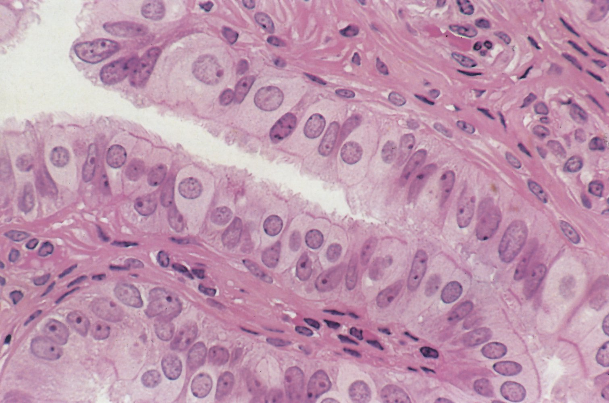

Fallopian tube

### <u>Embryology</u> [[3]](https://coursology-qbank.com/amboss/article/LNYwbp)

* Derived from the paramesonephric duct

* See “<u>Development of the reproductive system</u>.”

---

## Ovaries

### Function

* Site of <u>oogenesis</u>

* Sex <u>hormone</u> synthesis: <u>estrogen</u>, <u>progesterone</u>, <u>testosterone</u>

### Gross anatomy [[1]](https://coursology-qbank.com/amboss/article/ES08Yf)

#### Overview

* Description: paired, ovoid-shaped reproductive organs

* Location

* <u>Lateral</u> to the <u>uterus</u> and close to the <u>lateral</u> <u>pelvic</u> wall

* Suspended in the <u>mesovarium</u> (attached to the <u>posterior</u> part of the <u>broad ligament</u>)

* Neighboring structures: close proximity to the <u>cecum</u> and <u>appendix</u> on the right side and the <u>sigmoid colon</u> on the left side

Organ fact sheet: ovary and fallopian tube

Uterus, fallopian tubes, and ovaries

#### Vasculature

| <u>Blood vessels</u> of the <u>ovaries</u> |  |  |
| --- | --- | --- |
|  | Course | Function |
| Ovarian artery |   * Branches off the aorta at the level of the L2 <u>vertebra</u>  * Located in the <u>infundibulopelvic ligament</u>  * <u>Anastomosis</u> with ovarian branches from the <u>uterine artery</u>    |  * Supplies the <u>ovaries</u>, <u>lateral</u> two-thirds of the <u>fallopian tubes</u>, and the <u>proximal</u> portion of the uterine body.   |
| Ovarian vein |   * Pampiniform plexus drains to <u>ovarian veins</u>  * Left ovarian <u>vein</u> → left <u>renal vein</u> → inferior vena cava  * Right ovarian <u>vein</u> → <u>inferior vena cava</u>  * Located in the <u>mesovarium</u> and <u>infundibulopelvic ligament</u>    |  * Drains the <u>ovaries</u> and the <u>lateral</u> two-thirds of the <u>fallopian tubes</u>   |

> [!NOTE]
> The Left Gonadal <u>vein</u> is the LonGest.

Blood supply of the female reproductive organs (dorsal view)

Abdominal aorta and inferior vena cava

#### <u>Lymphatics</u>

* Primarily: <u>paraaortic nodes</u>

* Rarely: <u>inguinal nodes</u> (via <u>round ligament</u>)

#### Innervation

* <u>Ovarian plexus</u> and uterine plexus via the suspensory <u>ligament</u>

* <u>Sympathetic</u> (T10–11) → <u>vasoconstriction</u>

* <u>Parasympathetic</u> (<u>S2</u>–<u>S4</u>)

* <u>Visceral</u> afferent fibers

#### <u>Ligaments</u>

* <u>Mesovarium</u>

* <u>Ovarian ligament</u>

* <u>Infundibulopelvic ligament</u>

* See <u>ligaments of the female pelvis</u> below.

### Microscopic anatomy [[1]](https://coursology-qbank.com/amboss/article/ES08Yf)

#### Layers of the <u>ovary</u>

* Outer layer: : <u>peritoneum</u> (simple <u>cuboidal epithelium</u>, germinal epithelium)

* Capsule (<u>tunica albuginea</u>): thick layer of <u>collagen</u>

* Cortex: <u>dense connective tissue</u> surrounding the <u>ovarian follicles</u> and corpora lutea

* Medulla: <u>loose connective tissue</u> containing vessels and nerves

#### Ovarian follicle

The <u>ovarian follicle</u> is a functional unit of the <u>ovaries</u> that matures during <u>the menstrual cycle</u> (see “<u>Folliculogenesis</u>” below).

* <u>Oocyte</u>: Each follicle contains a single <u>oocyte</u>.

* Granulosa cells (follicular cells): form the <u>stratum granulosum</u>

* Surround the <u>oocyte</u> and form the follicular cavity

* Stimulated by <u>FSH</u>

* <u>Theca cells</u>

* Surround the <u>granulosa cells</u> and form a <u>basement membrane</u>

* Theca interna: <u>androstenedione</u> synthesis

* Theca externa: layer of <u>connective tissue</u>

### <u>Embryology</u>

* <u>Mesoderm</u> → undifferentiated <u>gonads</u> → <u>ovaries</u>

* See “<u>Development of the reproductive system</u>.”

---

## Oogenesis and folliculogenesis

### Oogenesis [[1]](https://coursology-qbank.com/amboss/article/ES08Yf)

* <u>Oogenesis</u> is the development of an immature oocyte into a <u>secondary oocyte</u> or mature <u>ovum</u> (if <u>fertilization</u> occurs).

* Begins in utero during fetal growth and ends with <u>menopause</u>

* At <u>birth</u>, a normal <u>ovary</u> contains about 1–2 million primary <u>oocytes</u>.

* There is a continuous decline in the number of primary <u>oocytes</u> after <u>birth</u>.

Oogenesis and spermatogenesis

| Steps of <u>oogenesis</u> |  |  |  |  |
| --- | --- | --- | --- | --- |
| Period |  | Events | Resulting cell | <u>Chromosome</u> count |
| <u>Fetal period</u> | 4th week of <u>gestation</u> |  * Replication (<u>mitosis</u>) of <u>oogonia</u> begins   |  * Oogonium   |   * <u>Diploid</u> (46 single <u>chromosomes</u>)  * 2N, 2C    |
| Until ∼ 4 weeks before <u>birth</u> |  * All <u>oogonia</u> have formed into primary <u>oocytes</u>, which have started <u>meiosis I</u>   |  * Primary oocyte   |   * <u>Diploid</u> (46 sister <u>chromatids</u>)  * 2N, 4C    |  |
| Until <u>ovulation</u> |  |  * <u>Meiosis I</u> is arrested in <u>prophase I</u>   |  |  |
| During <u>ovulation</u> |  |  * <u>Meiosis I</u> resumes → secondary <u>oocytes</u> form   |  * Secondary oocyte   |   * <u>Haploid</u> (23 sister <u>chromatids</u>)  * 1N, 2C    |
| Until <u>fertilization</u> |  |  * <u>Meiosis II</u> is arrested in <u>metaphase II</u> until <u>fertilization</u>   |  |  |
| <u>Fertilization</u> | If it does not occur |  * <u>Secondary oocyte</u> degenerates   |  |  |
| If it occurs |  * <u>Meiosis II</u> resumes and <u>secondary oocyte</u> → ootid → mature <u>ovum</u>   |  * Ovum   |   * <u>Haploid</u> (23 single <u>chromatids</u>)  * 1N, 1C    |  |

### Folliculogenesis [[1]](https://coursology-qbank.com/amboss/article/ES08Yf)

* Definition: the maturation of <u>ovarian follicles</u> (required for <u>oogenesis</u>)

* Sequence: <u>primordial follicle</u> → <u>primary follicle</u> → <u>secondary follicle</u> → <u>tertiary follicle</u> → <u>corpus luteum</u>

* See “<u>Oogenesis</u>” above and “<u>Menstrual cycle</u> and <u>menstrual cycle abnormalities</u>.”

| Steps of <u>folliculogenesis</u> |  |  |
| --- | --- | --- |
| Period | Follicle stage | Description |
| <u>Birth</u> |  * Primordial follicle   |   * Primary <u>oocytes</u> surrounded by flat <u>granulosa cells</u>  * If activated during <u>puberty</u> → <u>primary follicles</u>  * If not activated → degenerate    |
| <u>Puberty</u> |  * Primary follicle   |   * Flat <u>granulosa cells</u> proliferate, transforming into a layer of cuboidal <u>granulosa cells</u> surrounding the <u>primary oocyte</u>.  * The <u>oocyte</u> secretes zona pellucida: a thick, <u>proteoglycan</u>-rich material (important for <u>fertilization</u>).  * Stromal cells differentiate into <u>theca interna</u> and <u>externa</u> cells.    |
| <u>Menstrual cycle</u>: 1st week |  * Secondary follicle   |   * Cuboidal <u>granulosa cells</u> continue to proliferate → multiple layers of thick <u>granulosa cells</u> surround eccentrically located <u>oocyte</u>  * <u>Theca interna</u> cells produce <u>androstenedione</u> → transformed to <u>estradiol</u> by <u>granulosa cells</u> (under influence of <u>FSH</u>)  * Most <u>secondary follicles</u> become <u>atretic</u>, but usually only one becomes a <u>tertiary follicle</u>    |
| <u>Menstrual cycle</u>: 2nd week |  * Tertiary follicle (<u>Graafian follicle</u>)   |   * The <u>oocyte</u> is surrounded by the corona radiata and floats in follicular fluid.  * <u>Primary oocyte</u> completes <u>meiosis I</u> → secondary <u>oocyte</u> + <u>polar body</u>  * <u>Secondary oocyte</u> starts <u>meiosis II</u> → arrests in <u>metaphase II</u>  * Follicle moves to surface of <u>ovary</u> → follicle ruptures and <u>secondary oocyte</u> is released    |
| After <u>ovulation</u> |  * Corpus luteum   |   * Empty <u>tertiary follicle</u> collapses  * <u>Granulosa cells</u> increase in size → granulosa <u>lutein</u> cells (secrete <u>lutein</u>, <u>progesterone</u>, <u>estradiol</u>)  * If no <u>fertilization</u> occurs → no <u>hCG</u> present → <u>corpus luteum</u> atrophies    |

> [!NOTE]
> Primary <u>oocyte</u> arrest occurs in <u>prophase I</u> of <u>meiosis I</u> (think PROphase = PRior to Ovulation).
> Secondary <u>oocyte</u> arrest occurs in <u>metaphase II</u> of <u>meiosis II</u> (think <u>MET</u>aphase = before egg <u>MET</u> <u>sperm</u>).

> [!NOTE]
> Primary <u>oocytes</u> are formed prior to <u>birth</u> to serve as an <u>ovarian reserve</u>.

---

## Vagina and vulva

### Function [[1]](https://coursology-qbank.com/amboss/article/ES08Yf)

* <u>Vagina</u>

* Passageway for menstrual blood

* Conduit for <u>childbirth</u>

* Barrier against ascending infections: due to its acidic <u>pH</u> 4–4.5

* <u>Vulva</u>

* Secretion of alkaline fluid for lubrication during sex (<u>greater vestibular glands</u>)

* Sexual arousal and female <u>sexual response</u>

* See “<u>Sexuality and sexual medicine</u>.”

### Gross anatomy [[1]](https://coursology-qbank.com/amboss/article/ES08Yf)

The <u>vagina</u> and <u>vulva</u> collectively make up the lower genital tract.

#### <u>Vagina</u>

##### Position

* Location

* Extraperitoneal, in the <u>pelvis</u>

* Extends from the <u>uterus</u> to the <u>vaginal vestibule</u>

* Neighboring structures

* Supported by the <u>levator ani muscle</u>, <u>urogenital diaphragm</u>, and several <u>ligaments</u>: <u>transverse cervical ligament</u>, pubocervical <u>ligament</u>, and sacrocervical <u>ligament</u>

* Anteriorly: <u>urethra</u> and <u>bladder</u>

* Posteriorly: <u>rectum</u> and <u>anal canal</u> (separated by <u>perineal body</u>)

* Superiorly: <u>rectouterine pouch</u>

* Distally: <u>pelvic floor</u> and <u>vulva</u>

* The <u>ureter</u> courses close to the <u>lateral</u> fornices.

##### Structures

* Vaginal fornix: recess between the <u>vagina</u> and the <u>cervix</u>

* Four fornices: <u>anterior</u>, <u>posterior</u>, and two <u>lateral</u>

* The <u>posterior</u> <u>vaginal fornix</u> is the deepest and lies below the <u>rectouterine pouch</u>.

* Hymen: membrane that partially covers or surrounds the vaginal opening

> [!NOTE]
> <u>Hymen</u> <u>atresia</u> causes complete occlusion of the <u>vagina</u>, which obstructs blood flow at <u>menarche</u>, causing <u>primary amenorrhea</u>.

Organ fact sheet: vagina

#### Vulva

##### Position

* Location: external to the <u>pelvis</u>

* Neighboring structures: continuous with the <u>perineum</u>

##### Structures

* Labia majora: folds of <u>skin</u> that surround and cover the vaginal ostium and the <u>labia minora</u>

* Labia minora: folds of <u>hairless skin</u> that surround the <u>vaginal vestibule</u>

* Vulval vestibule: cavity between the <u>labia minora</u> that contains the vaginal and urethral orifices

* Greater vestibular glands (<u>Bartholin gland</u>)

* Homologous to the male bulbourethral glands

* Secrete alkaline fluid for lubrication

* Skene glands:

* Homologous to the male <u>prostate gland</u>

* Exact function is unknown

* Bulbs of the vestibule: erectile tissue that flanks the vaginal orifice

* Clitoris: <u>anterior</u> to the <u>labia minora</u>; erectile tissue composed of <u>corpora cavernosa</u>

> [!NOTE]
> <u>Estrogen</u> stimulates <u>proliferation</u> and <u>keratinization</u> of the vulvar <u>epithelium</u>. <u>Menopause</u> with decreased <u>estrogen</u> levels results in vulvar <u>atrophy</u>.

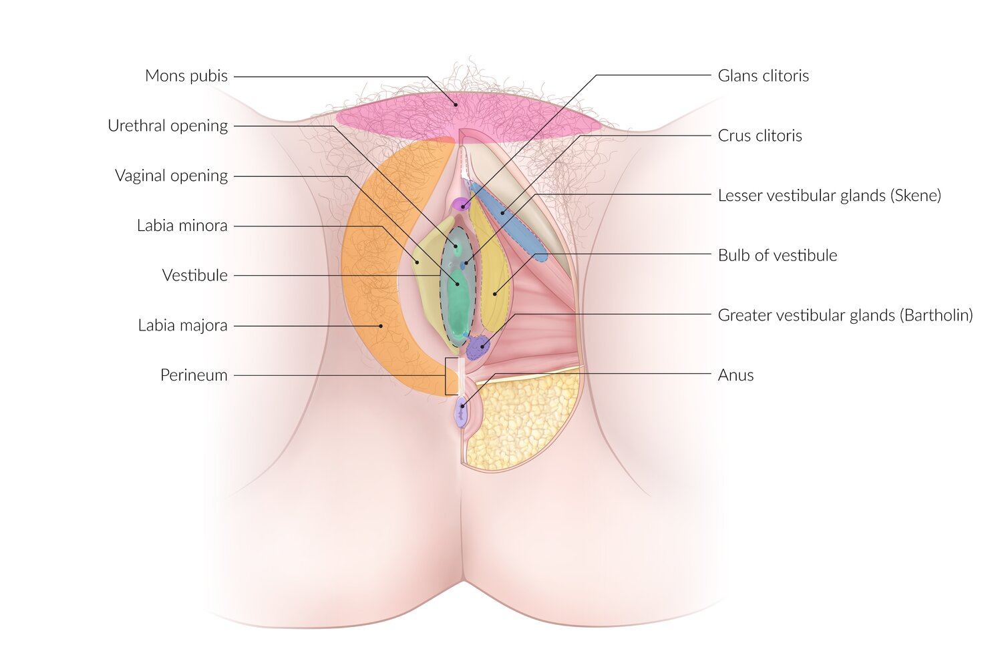

Vulva and neighboring structures

|  Vasculature, <u>lymphatics</u>, and innervation of <u>vagina</u> and <u>vulva</u> [[1]](https://coursology-qbank.com/amboss/article/ES08Yf) |  |  |
| --- | --- | --- |
|  | <u>Vagina</u> | <u>Vulva</u> |
| <u>Arteries</u> |  * Vaginal branches of the <u>internal iliac artery</u>   |   * <u>Superficial</u> and deep external pudendal <u>arteries</u> (branches of the <u>femoral artery</u>)  * <u>Internal pudendal artery</u>    |
| <u>Veins</u> |  * <u>Lateral</u> plexus → vaginal <u>veins</u> → <u>internal iliac veins</u>   |   * External pudendal <u>vein</u> → <u>long saphenous vein</u>  * <u>Clitoris</u>: deep and <u>superficial</u> <u>dorsal</u> <u>veins</u> → internal and external pudendal <u>veins</u>    |
| <u>Lymphatics</u> |   * Upper third: <u>external iliac nodes</u>  * Middle third: common and <u>internal iliac nodes</u>  * <u>Distal</u> third: <u>superficial inguinal nodes</u>  * Eventually drain into the <u>paraaortic nodes</u>    |   * The <u>superficial inguinal nodes</u> (primary) → deep inguinal → <u>pelvic</u> and <u>external iliac lymph nodes</u> → <u>paraaortic lymph nodes</u>  * <u>Clitoris</u>: <u>deep inguinal nodes</u>    |
| <u>Parasympathetic</u> innervation |  * <u>Pelvic splanchnic nerves</u> (<u>S2</u>–4)   |  * <u>Pelvic splanchnic nerves</u> (<u>S2</u>–4)   |
| <u>Sympathetic</u> innervation |  * <u>Uterovaginal plexus</u> (L1–2) * Contraction of the <u>proximal</u> <u>vagina</u>   |  * <u>Uterovaginal plexus</u> (T12–L2)  * <u>Smooth muscle</u> contraction  * Gland secretion   |
| Sensory innervation |  * <u>Pudendal nerve</u> (<u>S2</u>–4) * <u>Posterior</u> labial nerve   |   * <u>Pudendal nerve</u> (<u>S2</u>–4)  * Inferior rectal branch  * <u>Dorsal</u> nerve of the <u>clitoris</u>  * Perineal nerve (<u>labia minora</u>)  * <u>Posterior</u> labial branch (<u>posterior</u> <u>labia majora</u>)  * <u>Ilioinguinal nerve</u> (<u>anterior</u> <u>labia majora</u>)    |
| Motor innervation |  * <u>Pudendal nerve</u> (<u>S2</u>–4) * <u>Posterior</u> labial nerve: contraction of the <u>distal</u> <u>vagina</u> and <u>labia majora</u>   |  |

> [!NOTE]
> <u>Pudendal nerve block</u> is often used for anesthesia prior to vaginal procedures, <u>childbirth</u>, or <u>episiotomy</u>.

### Microscopic anatomy [[1]](https://coursology-qbank.com/amboss/article/ES08Yf)

#### <u>Vagina</u>

The <u>vagina</u> is a fibromuscular structure with numerous transverse vaginal rugae.

* Inner <u>mucosal</u> layer

* <u>Nonkeratinized stratified squamous epithelium</u>

* <u>Epithelial</u> cells are rich in <u>glycogen</u>.

* Vaginal bacteria break down <u>glycogen</u> → <u>lactic acid</u>, forming a highly acidic environment

* <u>Glycogen</u> content increases after <u>ovulation</u>

* External muscular layer

* Outer longitudinal <u>smooth muscle</u> layer

* Inner circular <u>smooth muscle</u> layer

* <u>Hymen</u>: <u>nonkeratinized stratified squamous epithelium</u>

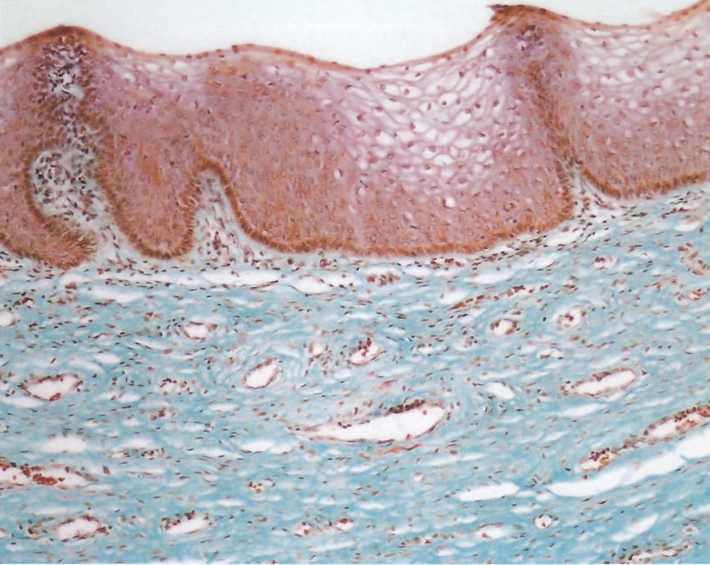

Vaginal epithelium

#### <u>Vulva</u>

* <u>Labia minora</u>

* Nonkeratinized <u>stratified</u> <u>squamous epithelium</u>

* Rich in <u>sebaceous glands</u>

* <u>Labia majora</u>

* Keratinized <u>stratified</u> <u>squamous epithelium</u>

* <u>Hair follicles</u>

* Eccrine, apocrine, and <u>sebaceous glands</u>

* Vestibule: <u>nonkeratinized squamous epithelium</u> with major vestibular and <u>minor vestibular glands</u>

* <u>Urethra</u>: <u>columnar epithelium</u> with <u>minor vestibular glands</u>

Normal vulvar epithelium

### <u>Embryology</u> [[1]](https://coursology-qbank.com/amboss/article/ES08Yf)

* <u>Paramesonephric ducts</u> (<u>Müllerian ducts</u>) → upper third of the <u>vagina</u>

* <u>Urogenital sinus</u> → lower two-thirds of the <u>vagina</u>, <u>vaginal vestibule</u>, vestibular glands

* <u>Urogenital folds</u> → <u>labia minora</u>

* <u>Labioscrotal swelling</u> → <u>labia majora</u>

* <u>Genital tubercle</u> → <u>clitoris</u>

* See “<u>Development of the reproductive system</u>.”

References:[[4]](https://coursology-qbank.com/amboss/article/IPYYT6)

---

## Ligaments of the female pelvis

| Overview of female <u>pelvic</u> <u>ligaments</u> |  |  |  |
| --- | --- | --- | --- |
| <u>Ligament</u> | Structures connected | Description | Structures contained |
| Broad ligament |  * <u>Lateral</u> <u>uterus</u>, <u>fallopian tubes</u>, and <u>ovaries</u> with the <u>lateral</u> <u>pelvic</u> wall   |  * <u>Lateral</u> <u>peritoneal fold</u> that is divided into the mesosalpinx, mesometrium (covers the <u>uterus</u> and extends laterally, connecting it to the <u>pelvic</u> wall), mesovarium (serves as the attachment of the <u>ovary</u> to the <u>broad ligament</u>)   |   * <u>Ovaries</u>  * <u>Fallopian tubes</u>  * <u>Round ligament of the uterus</u>    |
| Round ligament of the uterus |  * <u>Uterine horn</u> with the <u>labia majora</u>   |   * Embryonic derivate of the <u>gubernaculum</u>  * Responsible for the <u>anteversion</u>-<u>anteflexion</u> position of the <u>uterus</u>  * Passes through the <u>inguinal canal</u>, above the artery of Sampson    |  * <u>Lymphatic drainage</u> of the <u>uterine horn</u> to the <u>inguinal nodes</u>   |
| Cardinal ligament |  * <u>Cervix</u> with the <u>lateral</u> <u>pelvic</u> wall   |   * <u>Distal</u> portion of the <u>broad ligament</u>  * Close to the <u>ureter</u> → risk of <u>ureter</u> injury during <u>hysterectomy</u> (uterine vessel ligation)    |  * <u>Uterine artery</u> and <u>vein</u>   |
| Ovarian ligament |  * <u>Medial</u> pole of the <u>ovary</u> with the <u>lateral</u> <u>uterus</u> horn   |  * Embryonic derivate of the <u>gubernaculum</u>   |  * Ovarian branches of the <u>uterine artery</u>   |
| Infundibulopelvic ligament |  * <u>Ovaries</u> with the <u>lateral</u> <u>pelvic</u> wall   |   * <u>Suspensory ligament of the ovaries</u>  * Close to the <u>ureter</u> → risk of <u>ureter</u> injury during <u>oophorectomy</u> (ovarian vessel ligation to avoid bleeding)    |  * <u>Ovarian artery</u> and <u>vein</u>   |

> [!WARNING]
> During ligation of the <u>ovarian artery</u> and <u>vein</u>, care must be taken not to damage the <u>ureter</u>, which is located directly <u>posterior</u> to the <u>infundibulopelvic ligament</u>, close to the <u>medial</u> leaf of the <u>broad ligament</u>.

> [!NOTE]
> The Cardinal <u>ligament</u> connects the Cervix with the <u>pelvic</u> wall.

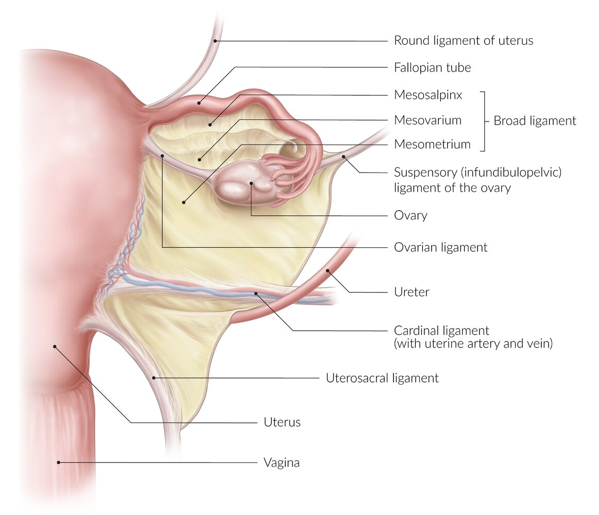

Supporting ligaments of the uterus (dorsal view)

Uterus and associated structures

References: [[1]](https://coursology-qbank.com/amboss/article/ES08Yf)

---

## Clinical significance

### General conditions

* <u>Differences (disorders) of sex development</u>

* <u>Anomalies of the female genital tract</u>

* <u>Menstrual cycle</u> and <u>menstrual cycle abnormalities</u>

* <u>Sexually transmitted infections</u>

* <u>Urethritis</u>

### Uterine conditions

* <u>Adenomyosis</u>

* <u>Uterine leiomyoma</u>

* <u>Endometriosis</u>

* <u>Endometrial hyperplasia</u>

* <u>Endometrial carcinoma</u>

* <u>Endometritis</u>

* <u>Endometrial polyp</u>

* <u>Abnormal uterine bleeding</u>

* <u>Septate uterus</u>

* <u>Bicornuate uterus</u>

* <u>Uterus didelphys</u>

* <u>Asherman syndrome</u>

### Cervical conditions

* <u>Cervical dysplasia</u>

* <u>Cervical cancer</u>

### Ovarian conditions

* <u>Polycystic ovarian syndrome</u>

* <u>Primary ovarian insufficiency</u>

* <u>Ovarian cysts</u>

* <u>Ovarian cancer</u>

* <u>Germ cell tumors</u>

* <u>Sex cord-stromal tumors of the ovary</u>

### Vaginal and vulvar conditions

* <u>Imperforate hymen</u>

* <u>Vulvovaginitis</u>

* <u>Bartholin gland cyst</u>

* <u>Vulvar and vaginal cancer</u>

---