# Male reproductive organs

*Categories: Clinical knowledge > Urology > Basics of urology > Male reproductive organs*

[Original Article Link](https://coursology-qbank.com/amboss/article/l60vOS)

---

## Summary

The male reproductive system consists of the <u>penis</u>, <u>testes</u>, <u>epididymis</u>, <u>ejaculatory ducts</u>, <u>prostate</u>, and <u>accessory glands</u>. These organs function together to produce <u>sperm</u> and deliver semen from the <u>testes</u> via <u>ejaculation</u>. For more information on the embryological development of the male reproductive system, see “<u>Development of the reproductive system</u>”.

---

## Penis

### Function

<u>Urination</u> and release of semen

### Gross anatomy [[1]](https://coursology-qbank.com/amboss/article/BfYzoo)[[2]](https://coursology-qbank.com/amboss/article/iRYJ5K)

Primarily composed of erectile tissue, <u>blood vessels</u>, nerves, and <u>connective tissue</u>

Median section of the male pelvis with detail of a testicle

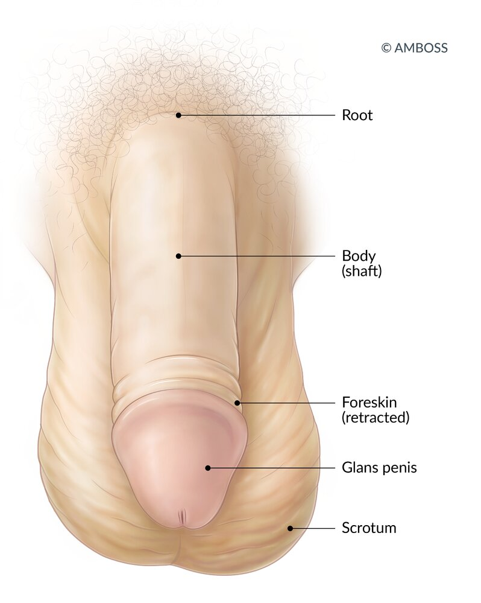

The penis

Organ fact sheet: penis

#### Structure

* Root: composed of the bulb of the <u>penis</u> and two crura

* Two crura anchor the <u>corpora cavernosa</u> to the pubic arch.

* The bulb is a continuation of the <u>corpus spongiosum</u>.

* Body (shaft): contains the erectile tissue

* Corpus spongiosum

* Location: lies ventrally between the <u>corpora cavernosa</u>

* Function: keeps the <u>urethra</u> open during <u>erection</u>

* Corpora cavernosa (paired)

* Location: <u>dorsal</u> and <u>proximal</u> to the <u>corpus spongiosum</u>

* Function: enable <u>erection</u>

* Glans penis: the <u>distal</u> end of the <u>corpus spongiosum</u>

* Attached to the frenulum and covered by foreskin

* Runs from the deep surface of the body to the <u>prepuce</u>

* <u>Medial</u> fold located ventrally

* Corona: margin of the <u>glans penis</u>

* Contains the <u>external urethral meatus</u>

* Fossa navicularis: opening of the external <u>urethra</u>

* Urethral glands (<u>glands of Littre</u>): present along the length of the <u>penile urethra</u>

* Muscles

* Bulbospongiosus muscle (paired)

* Cover the bulb of the <u>penis</u>

* Empty the <u>urethra</u> of residual semen/urine and contribute to <u>erection</u>

* Ischiocavernosus muscle (paired)

* Cover the crura of the <u>penis</u>

* Compress the crura to move blood into the body of the <u>penis</u> and maintain erections

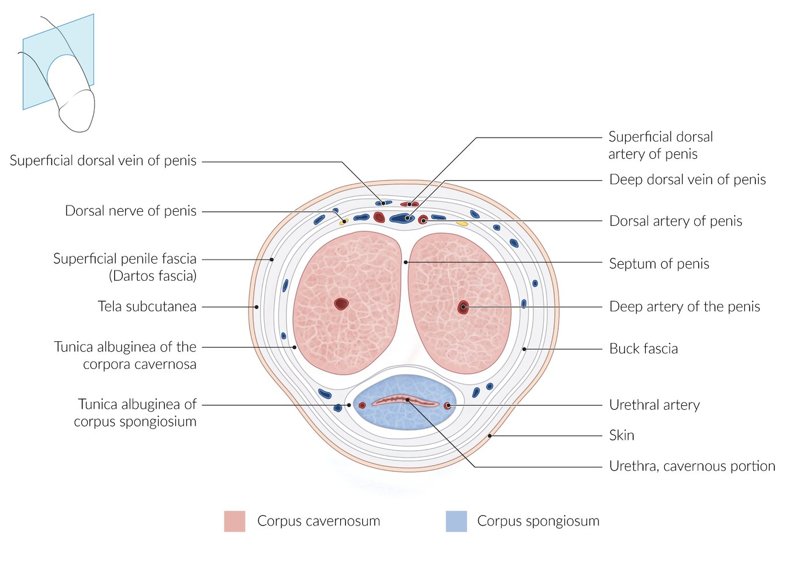

Penis (cross-section)

#### <u>Arteries</u> [[1]](https://coursology-qbank.com/amboss/article/BfYzoo)[[2]](https://coursology-qbank.com/amboss/article/iRYJ5K)

|  Arterial supply to the <u>penis</u>  |  |  |
| --- | --- | --- |
| <u>Artery</u> | Course | Supplies |
| Internal pudendal artery |   * Branch of the <u>internal iliac artery</u>  * Exits the <u>pelvis</u> through the <u>greater sciatic foramen</u>  * Enters the <u>perineum</u> through the <u>lesser sciatic foramen</u>    |  * External genitalia   |
| Bulbourethral artery |   * Branch of the <u>internal pudendal artery</u>  * Travels between superior and <u>inferior fascia of the urogenital diaphragm</u>  * Exits the inferior <u>fascia</u>  * Travels to the bulb of the <u>urethra</u> and the <u>posterior</u> <u>corpus spongiosum</u>    |   * Bulb of the <u>penis</u>  * <u>Bulbourethral gland</u>    |
| Deep artery of the penis |   * Branch of the <u>internal pudendal artery</u>  * Travels between superior and <u>inferior fascia of the urogenital diaphragm</u>  * Exits the inferior <u>fascia</u>  * Enters the crus <u>penis</u>  * Travels to <u>corpus cavernosum</u> <u>penis</u>    |  * Erectile tissue   |
| Dorsal artery of the penis |   * Branch of the <u>internal pudendal artery</u>  * Travels between the crus <u>penis</u> and <u>pubic symphysis</u>  * Exits <u>inferior fascia of the urogenital diaphragm</u>  * Travels in the suspensory <u>ligament</u> of the <u>penis</u>  * Runs on the dorsum of the <u>penis</u>  to the glans    |   * <u>Glans penis</u>  * <u>Prepuce</u>    |
| Urethral artery |  * Travels through the <u>corpus spongiosum</u>   |  * Glans of the <u>penis</u>   |
| External pudendal artery |   * Branch of the <u>femoral artery</u>  * Enters through the saphenous ring    |  * <u>Skin</u> above the <u>pubis</u>, <u>penis</u>, and <u>scrotum</u>   |

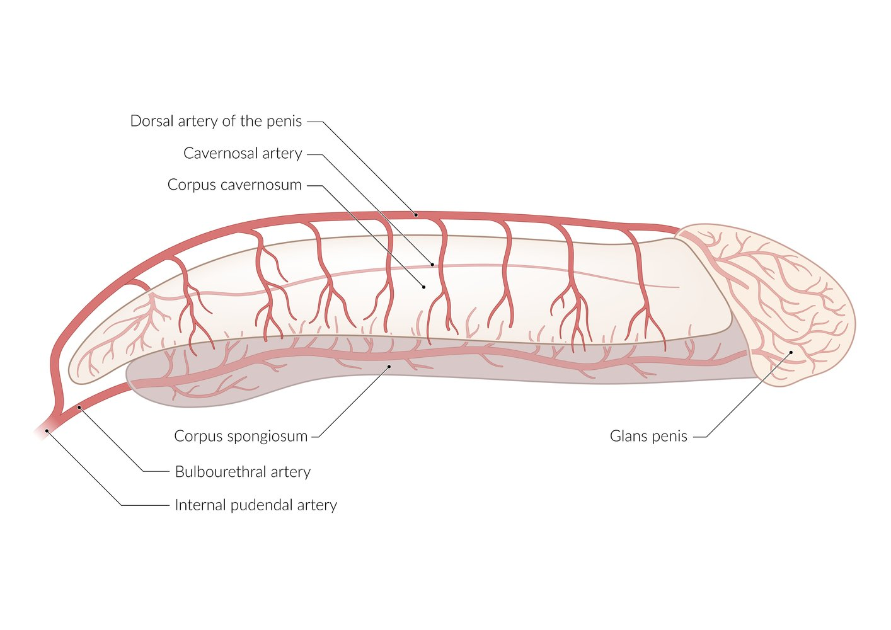

Arterial supply of the penis

#### <u>Veins</u>

| Venous drainage of the <u>penis</u> |  |  |
| --- | --- | --- |
| <u>Vein</u> | Anatomy | Drains into |
| Deep dorsal vein of the penis |   * Single <u>vein</u> on the midline, in the dorsum of the <u>penis</u>  * Travels deep to Buck fascia of the <u>penis</u>  * <u>Superficial</u> to the <u>tunica albuginea</u>    |  * <u>Prostatic</u> and <u>pelvic</u> venous plexuses   |
| Superficial dorsal vein of the penis |  * Travels along the <u>superficial</u> and deep <u>fascia</u>   |  * External pudendal <u>veins</u> → greater saphenous <u>vein</u>   |

#### <u>Lymphatics</u>

| <u>Lymphatic drainage</u> of the <u>penis</u> |  |  |
| --- | --- | --- |
| Structure | <u>Lymph nodes</u> | Course |
| <u>Perineum</u>, <u>penis</u>, and <u>scrotum</u> |  * <u>Superficial inguinal lymph nodes</u>   |  * <u>External iliac nodes</u> → <u>paraaortic nodes</u>   |
| <u>Glans penis</u> |  * <u>Deep inguinal lymph nodes</u>   |  * <u>Internal iliac nodes</u> → <u>common iliac nodes</u> → <u>paraaortic nodes</u>   |
| <u>Corpora cavernosa</u> |  * <u>Internal iliac nodes</u>   |  * <u>Common iliac nodes</u> → <u>paraaortic nodes</u>   |

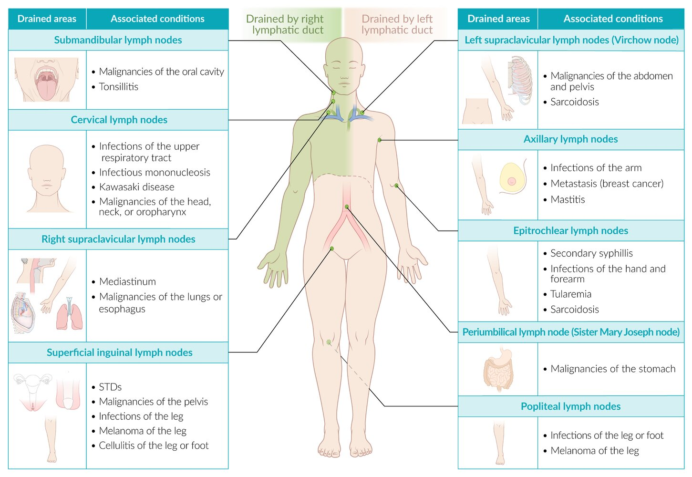

Palpable lymph nodes

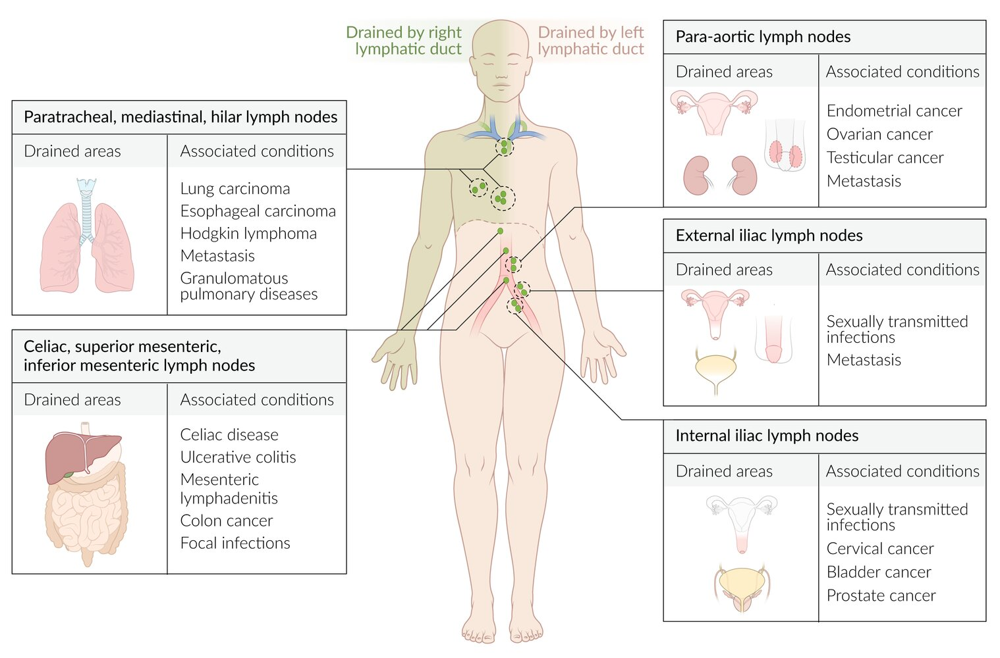

Deep lymph nodes

#### Innervation

| Innervation of the <u>penis</u> |  |  |
| --- | --- | --- |
| Innervation | Structures | Function |
| <u>Parasympathetic</u> |  * <u>Pelvic splanchnic nerves</u> (<u>S2</u>–<u>S4</u>)   |  * <u>Erection</u>   |
| <u>Sympathetic</u> |  * Hypogastric nerve (T11–L4)   |  * Emission   |
| Sensory |  * <u>Dorsal nerve of the penis</u> (a branch of the <u>pudendal nerve</u>)   |  * Innervates the <u>skin</u>, <u>prepuce</u>, and glans   |

### Microscopic anatomy  [[1]](https://coursology-qbank.com/amboss/article/BfYzoo)[[2]](https://coursology-qbank.com/amboss/article/iRYJ5K)

* <u>Tunica albuginea</u>: thick <u>fibrous layer</u> of <u>connective tissue</u> surrounding the <u>corpora cavernosa</u> and the <u>corpus spongiosum</u>

* <u>Corpora cavernosa</u>: composed of <u>connective tissue</u> and <u>smooth muscle</u>

* <u>Corpus spongiosum</u>: composed of <u>connective tissue</u> (primarily <u>elastic fibers</u>) and <u>smooth muscle</u>

Urethra, corpora cavernosa, and corpus spongiosus of the penis

### <u>Embryology</u> [[1]](https://coursology-qbank.com/amboss/article/BfYzoo)

* <u>Genital tubercle</u> → <u>glans penis</u>, <u>corpora cavernosa</u>, <u>corpus spongiosum</u>

* <u>Urogenital folds</u> → <u>ventral</u> shaft of the <u>penis</u>

* See “<u>Development of the reproductive system</u>”.

Development of male external genitalia

---

## Testes, scrotum, and spermatic cord

* The <u>testes</u> are paired organs composed of <u>seminiferous tubules</u>, the site of <u>spermatogenesis</u>. They are also responsible for the secretion of <u>male sex hormones</u>.

* The <u>scrotum</u> encases the <u>testes</u> and is connected to the abdominal wall via the <u>spermatic cord</u>.

Organ fact sheet: testes

---

## Gross anatomy

### Structure [[1]](https://coursology-qbank.com/amboss/article/BfYzoo)[[2]](https://coursology-qbank.com/amboss/article/iRYJ5K)[[3]](https://coursology-qbank.com/amboss/article/XNY9-6)

* <u>Testes</u>

* Ellipsoid-shaped

* Composed of ∼ 600 seminiferous tubules, which connect to the rete testis

* Surrounded by a thick capsule (<u>tunica albuginea</u>)

* Connect to the abdominal wall via the <u>spermatic cord</u>

* Testicular lobules

* Interlobular septa divide the <u>testis</u> into testicular lobules.

* Each testicular lobule contains 1–4 <u>seminiferous tubules</u>.

* Spermatic cord

* Extension of the abdominal wall into the <u>scrotum</u>

* Contents of the <u>spermatic cord</u>

* Three <u>arteries</u>: <u>testicular artery</u>, <u>ductus deferens</u> <u>artery</u>, cremasteric <u>artery</u>

* Three nerves: genital branch of genitofemoral, cremasteric nerve, <u>sympathetic</u> nerve fibers

* Three other structures: <u>ductus deferens</u>, <u>pampiniform plexus</u>, lymphatic vessels

* Scrotum  

* <u>Distal</u> sac-like end of the <u>spermatic cord</u> that is continuous with the <u>anterior abdominal wall</u>

* Layers of the <u>scrotum</u> (from internal to external)

* Tunica albuginea: highly vascular, <u>fibrous layer</u> of <u>connective tissue</u>

* Tunica vaginalis: <u>visceral</u> layer; derived from <u>peritoneum</u>

* Internal spermatic fascia: derived from the <u>transversalis fascia</u>

* Cremasteric fascia and cremaster muscle: originates from the <u>internal oblique muscle</u>

* External spermatic fascia: derived from the <u>aponeurosis</u> of the <u>external oblique muscle</u>

* Dartos fascia and dartos muscle: contraction causes <u>skin</u> <u>wrinkles</u> → regulates temperature

* Scrotal <u>skin</u>: <u>wrinkles</u> → ↑ <u>skin</u> thickness → ↓ <u>heat loss</u>

> [!NOTE]
> “<u>TIE</u> turns into ICE”:
> Transversalis <u>fascia</u> → Internal spermatic <u>fascia</u>
> Internal oblique → Cremasteric muscle and <u>fascia</u>
> External oblique → External spermatic <u>fascia</u>

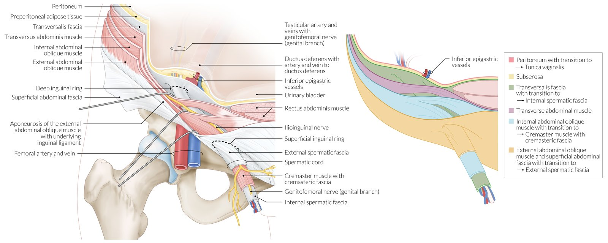

Inguinal canal and spermatic cord

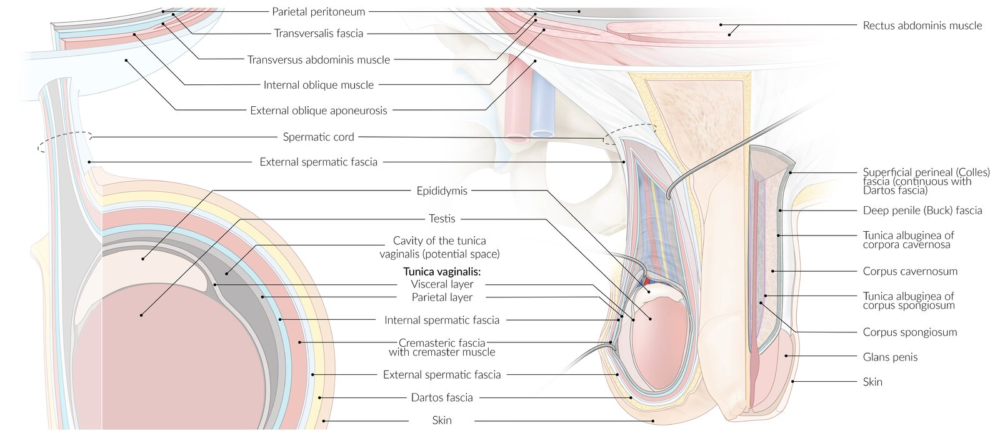

Layers of the abdominal wall and male reproductive organs

### Vasculature, <u>lymphatics</u>, and innervation of the <u>testes</u> and <u>scrotum</u> [[3]](https://coursology-qbank.com/amboss/article/XNY9-6)

| Vasculature, <u>lymphatics</u>, and innervation of the <u>testes</u> and <u>scrotum</u> |  |  |
| --- | --- | --- |
|  <u>Testes</u>   |  | <u>Scrotum</u> |
| <u>Arteries</u> |   * <u>Testicular arteries</u> (<u>branches of the abdominal aorta</u>)  * Pass through the <u>inguinal canal</u>    |   * <u>Anterior</u> scrotal <u>arteries</u> (a branch of the <u>external pudendal artery</u>)  * <u>Posterior</u> scrotal <u>arteries</u> (a branch of the <u>internal pudendal artery</u>)    |
| <u>Veins</u> |   * Pampiniform venous plexus drains to testicular vein → <u>renal vein</u> (left) and <u>inferior vena cava</u> (right)  * High risk of left-sided <u>varicocele</u> because of the perpendicular orientation of the <u>left gonadal vein</u> to the left <u>renal vein</u> (see “<u>Varicocele</u>”)    |  * Scrotal <u>veins</u> drain to external pudendal <u>vein</u>   |
| <u>Lymphatics</u> |   * <u>Lumbar lymph nodes</u> drain to <u>paraaortic lymph nodes</u>  * See “<u>Lymphatic drainage</u>” for more information.    |  * Drain to <u>superficial inguinal nodes</u>   |
| Autonomic Innervation |   * <u>Abdominal aortic plexus</u>  * T10 → <u>testicular plexus</u>    |  * <u>Sympathetic</u> fibers from the genital branch of the <u>genitofemoral nerve</u> → <u>dartos muscle</u> contraction   |
| Motor innervation |  * None   |   * Genital branch of the <u>genitofemoral nerve</u> → cremasteric muscle contraction  * See “<u>Cremasteric reflex</u>”.    |
| Sensory innervation |  * <u>Genitofemoral nerve</u> → genital branch (L2) → <u>tunica vaginalis</u> of the <u>testes</u>   |   * <u>Anterior</u> scrotal nerves (genital branch of the <u>genitofemoral nerve</u> and <u>ilioinguinal nerve</u>)  * <u>Posterior</u> scrotal nerves (perineal branch of the internal <u>pudendal nerve</u> and <u>posterior femoral cutaneous nerve</u>)    |

> [!NOTE]
> The Left Gonadal <u>vein</u> is the LonGest.

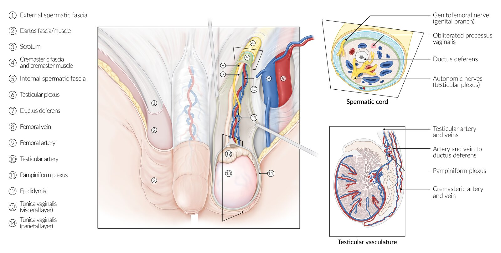

Anatomy of the male reproductive system

Arteries and veins of the testis, spermatic cord, and testicular tunics

Abdominal aorta and inferior vena cava

Urinary tract and vasculature of the testes

---

## Microscopic anatomy

### Microscopic anatomy [[1]](https://coursology-qbank.com/amboss/article/BfYzoo)[[2]](https://coursology-qbank.com/amboss/article/iRYJ5K)

#### Spermatogonia

* Description: undifferentiated germ cells lining the <u>seminiferous tubules</u>

* Type A (dark): do not undergo <u>mitosis</u>

* Type A (pale): form type B <u>spermatogonia</u>

* Type B: undergo <u>mitosis</u> → mature into primary spermatocytes

* Function: differentiate into primary spermatocytes

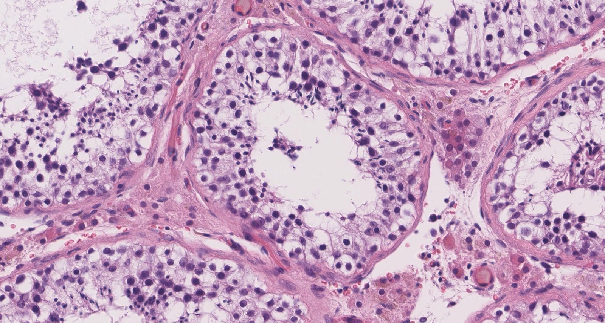

Germinal epithelium (testicle)

#### Sertoli cells

* Description

* Columnar <u>epithelial</u> cells lining <u>seminiferous tubules</u> (non-germ cells)

* Homologous to <u>granulosa cells</u> in females

* Connected to one another via <u>tight junctions</u>

* Form the <u>blood-testis barrier</u>: separation of <u>gametes</u> in <u>seminiferous tubules</u> from the <u>immune system</u>

* Sensitive to temperature: ↑ temperature (e.g., due to <u>cryptorchidism</u> or <u>varicocele</u>) → ↓ <u>inhibin B</u> secretion and ↓ production of spermatozoa

* Function

* Produce <u>inhibin B</u>

* Stimulated by <u>FSH</u>

* Increased <u>inhibin B</u> levels lead to decreased <u>FSH</u> secretion (negative feedback loop).

* Contain <u>aromatase</u>, which is responsible for the conversion of <u>testosterone</u> and <u>androstenedione</u> to <u>estrogen</u> [[4]](https://coursology-qbank.com/amboss/article/PNYWYp)

* Secrete <u>androgen</u>-binding protein

* Produce <u>Mullerian inhibitory factor</u>

* Regulate <u>spermatogenesis</u>

* Provide protection and nourishment for developing spermatocytes

> [!NOTE]
> The S-rule for Sertoli cells: line the Seminiferous tubes, Sustain Sperm Synthesis, and Suppress FSH.

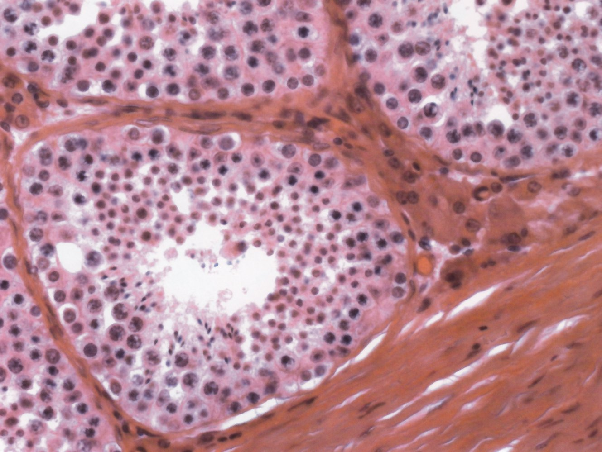

Convoluted seminiferous tubule

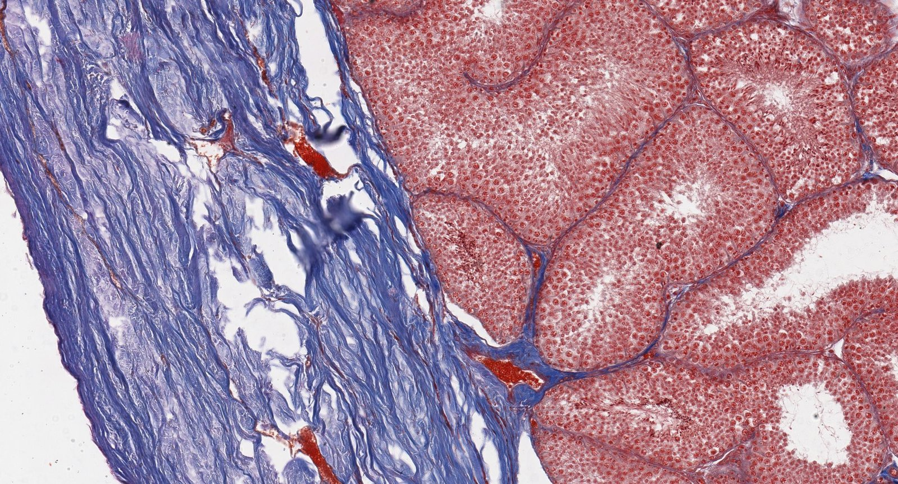

Seminiferous tubules and tunica albuginea

#### Leydig cells

* Description

* <u>Interstitial</u> endocrine cells with <u>cytoplasm</u> rich in <u>cholesterol</u> (used for <u>testosterone</u> production)

* Homologous to <u>theca interna</u> cells in females

* Not affected by temperature

* Function

* Produce <u>testosterone</u>  

* Stimulated by <u>LH</u>

* Increased serum <u>testosterone</u> levels lead to decreased <u>LH</u> secretion (negative feedback loop).

* <u>Testosterone</u> also diffuses to <u>Sertoli cells</u>, where it stimulates <u>spermatogenesis</u>.

* Secrete <u>androgens</u> during the <u>embryonic period</u>

* During <u>puberty</u>, <u>testosterone</u> production increases, which allows for the start/maintenance of full <u>spermatogenesis</u>.

* Conversion of <u>testosterone</u> to <u>estrogen</u> via <u>aromatase</u> [[4]](https://coursology-qbank.com/amboss/article/PNYWYp)

> [!NOTE]
> “Leydis Love <u>Testosterone</u>”: Leydig cells are LH-stimulated and secrete <u>Testosterone</u>.

Hypothalamic-pituitary-gonadal axis (male)

#### Sperm

* Head: formed by the <u>acrosome</u> and the <u>nucleus</u>

* Tail: formed by the midpiece (<u>mitochondria</u> and <u>microtubules</u>), principal piece (<u>flagellum</u>), and the end piece

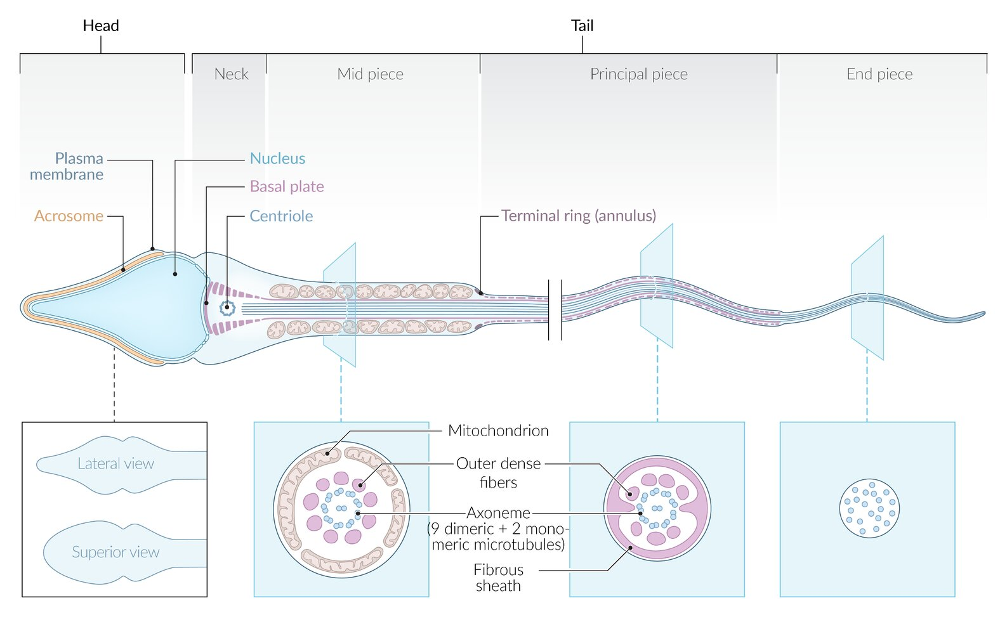

Structure of a sperm

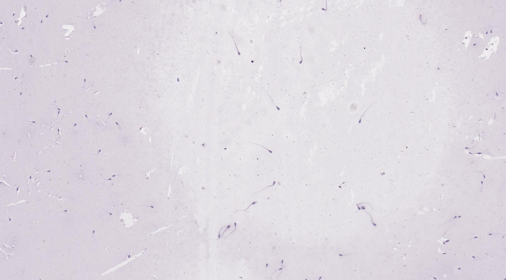

Spermatozoa

#### Blood-testis barrier

* Formed by <u>tight junctions</u> between <u>Sertoli cells</u>

* Separates <u>gametes</u> in <u>seminiferous tubules</u> from the <u>immune system</u>

* Divides <u>seminiferous tubules</u> into:

* Basal compartment

* Contains <u>spermatogonia</u> and immature primary spermatocytes

* In contact with blood and <u>lymph</u>

* Adluminal compartment

* Contains mature spermatocytes and spermatids

* Not in contact with blood and <u>lymph</u>

> [!NOTE]
> “Sertoli fence for <u>sperm</u> defense”: Sertoli cells form the blood-<u>testes</u> barrier.

---

## Spermatogenesis and spermiogenesis

### <u>Spermatogenesis</u> and <u>spermiogenesis</u> [[1]](https://coursology-qbank.com/amboss/article/BfYzoo)[[2]](https://coursology-qbank.com/amboss/article/iRYJ5K)

#### Spermatogenesis

* The process by which <u>spermatogonia</u> (see “Microscopic anatomy” above) become spermatids

* Begins in <u>puberty</u>

* Occurs in the <u>seminiferous tubules</u>

* As <u>spermatogonia</u> mature, they move from the basal layer of the <u>seminiferous tubule</u> to its lumen

* <u>Spermatogonia</u> (2n, <u>diploid</u>) cross the <u>blood-testis barrier</u> → primary spermatocytes (2n, <u>diploid</u>) → secondary spermatocytes (1n, <u>haploid</u>) → spermatids (1n, <u>haploid</u>)

* Duration: ∼ 2 months

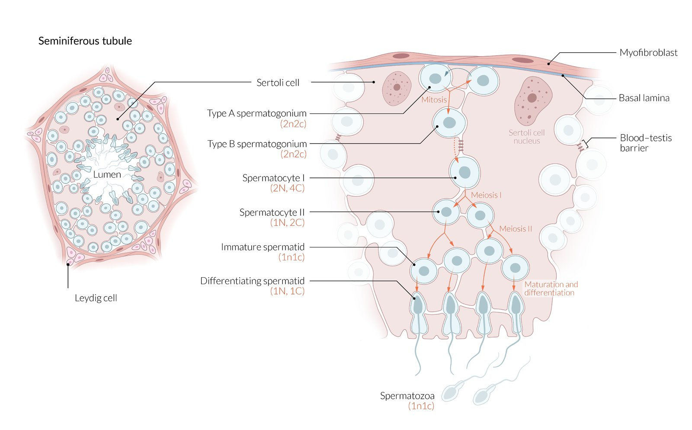

Spermatogenesis

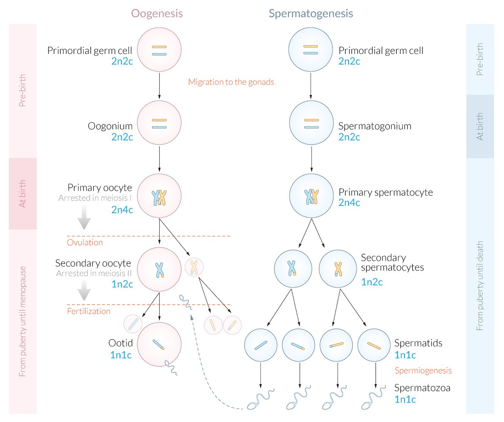

Oogenesis and spermatogenesis

#### Spermiogenesis

* The process by which spermatids become spermatozoa

* Requires <u>testosterone</u>

* Formation of the acrosome

* Derived from the <u>Golgi apparatus</u>

* Contains acid <u>phosphatase</u>, <u>neuraminidase</u>, and <u>hyaluronidase</u>

* Loss of <u>cytoplasmic</u> content

* Condensation of genetic material

* Spermatid elongation

* Development of the <u>flagellum</u> (dysfunctional or absent in <u>primary ciliary dyskinesia</u>/<u>Kartagener syndrome</u>)

> [!NOTE]
> GONIUM is GOING to be <u>sperm</u>: Spermatogonia becomes a spermatid.
> ZOON ZOOMS to the egg: Mature spermatozoon travel to the egg.

---

## Embryology

* <u>Testes</u>: <u>SRY</u> <u>gene</u> on Y <u>chromosome</u> encodes for <u>testis determining factor</u> → primitive sex cords development → <u>testes</u> formation [[1]](https://coursology-qbank.com/amboss/article/BfYzoo)

* <u>Testes</u> develop in the <u>retroperitoneum</u>, then descend into the <u>scrotum</u>:

* Transabdominal migration of both <u>testes</u> begins during week 7 and is usually complete by 32 weeks' <u>gestation</u>.

* <u>Testes</u> descend through the <u>inguinal canal</u>, along with their associated vasculature, nerves, and <u>ductus deferens</u>.

* The descending <u>testes</u> are supported by a layer of the <u>peritoneum</u> (<u>tunica vaginalis</u>), which is normally secured to the superior and inferior <u>posterior</u> pole of the <u>testis</u>.

* With the assistance of the <u>gubernaculum</u> at the lower pole, the <u>testes</u> are pulled into the <u>scrotum</u>.

* The <u>spermatic cord</u>, which holds the <u>vas deferens</u> and testicular vasculature, meets the <u>testis</u> within the <u>scrotum</u>.

* Play a role in further <u>sexual development</u>

* <u>Mullerian inhibitory factor</u> (<u>Sertoli cells</u>) suppresses the development of the <u>paramesonephric ducts</u>.

* <u>Androgens</u> (<u>Leydig cells</u>) stimulate the development of the <u>mesonephric ducts</u>.

* <u>Scrotum</u> [[1]](https://coursology-qbank.com/amboss/article/BfYzoo)

* Derived from the <u>labioscrotal swelling</u>

* Development driven by <u>dihydrotestosterone</u> (<u>DHT</u>)

* See “<u>Development of the reproductive system</u>” for more information.

---

## Epididymis, ductus deferens, and accessory glands

### Epididymis [[1]](https://coursology-qbank.com/amboss/article/BfYzoo)

* Gross anatomy: long, coiled duct along the <u>posterior</u> aspect of the <u>testis</u> → <u>distal</u> end is continuous with <u>ductus deferens</u>

* Function

* Storage and maturation of spermatozoa

* Propulsion of spermatozoa into the <u>ductus deferens</u>

* <u>Embryology</u>: derived from the <u>mesonephric duct</u> (differentiation requires <u>testosterone</u>)

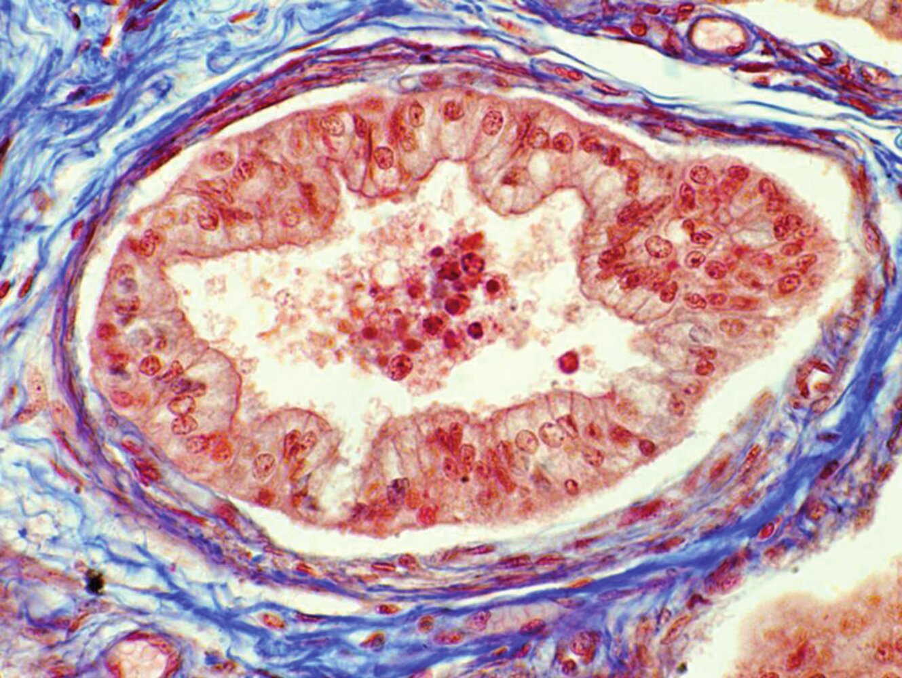

Efferent duct of the epididymis

### Ductus deferens [[1]](https://coursology-qbank.com/amboss/article/BfYzoo)

* Gross anatomy

* Long, muscular duct that enters the <u>pelvis</u> at the <u>deep inguinal ring</u> (<u>lateral</u> to <u>inferior epigastric artery</u>)

* Crosses the <u>umbilical artery</u> and <u>obturator nerve</u> → passes superior to the <u>ureter</u> → expands at the <u>distal</u> end to form the ampulla → joins the <u>ejaculatory duct</u>

* Function: transports spermatozoa from the <u>epididymis</u> to the <u>ejaculatory duct</u> and provides fructose to the spermatozoa

* <u>Embryology</u>: derived from the <u>mesonephric duct</u> (differentiation requires <u>testosterone</u>)

### Ejaculatory ducts [[1]](https://coursology-qbank.com/amboss/article/BfYzoo)

* Gross anatomy: formed by the <u>ductus deferens</u> and <u>seminal vesicle</u> ducts → open into the <u>prostatic urethra</u>

* Function: propel spermatozoa with seminal fluid into the <u>urethra</u>

* <u>Embryology</u>: derived from the <u>mesonephric duct</u> (differentiation requires <u>testosterone</u>)

### Accessory glands [[2]](https://coursology-qbank.com/amboss/article/iRYJ5K)

#### <u>Prostate</u> (see below)

#### Seminal vesicles

* Gross anatomy

* Paired glands located on the inferoposterior surface of the <u>bladder</u>

* Connect with the <u>ductus deferens</u> to form the <u>ejaculatory ducts</u> → empty into the <u>prostatic urethra</u>

* Microscopic anatomy

* Lobulated <u>glandular tissue</u>

* Lined with <u>pseudostratified</u> <u>columnar epithelium</u>

* Contain secretory granules

* Function: secrete an alkaline fluid that makes up the greater part of seminal fluid

* Contains <u>sorbitol dehydrogenase</u> which converts <u>sorbitol</u> into fructose and thus provides energy for spermatozoa motility

* Contains <u>citrate</u>, fructose, <u>prostaglandins</u>, and other <u>proteins</u>

* <u>Embryology</u>: derived from the <u>mesonephric duct</u> (differentiation requires <u>testosterone</u>)

#### Bulbourethral gland (Cowper gland)

* Gross anatomy: located in the <u>deep perineal pouch</u> within the <u>urogenital diaphragm</u>

* Function: secretes mucus into the <u>bulbar urethra</u> for lubrication during <u>ejaculation</u>

* <u>Embryology</u>: : derived from the <u>pelvic</u> portion of the <u>urogenital sinus</u> (differentiation requires <u>DHT</u>)

---

## Prostate gland

An <u>accessory gland</u> of reproduction located at the base of the <u>bladder</u> and composed primarily of glandular, fibrous, and <u>smooth muscle tissue</u>.

### Function [[2]](https://coursology-qbank.com/amboss/article/iRYJ5K)

Secretion of:

* Components of semen

* Proteolytic enzymes (regulated by <u>DHT</u>) to maintain the fluidity of semen

* Acid <u>phosphatase</u>, citric acid, <u>prostaglandins</u>, fibrinolysins, lipids, <u>amylase</u>

* <u>Prostate-specific antigen</u> (<u>PSA</u>)

### Gross anatomy [[1]](https://coursology-qbank.com/amboss/article/BfYzoo)[[2]](https://coursology-qbank.com/amboss/article/iRYJ5K)

* Location

* <u>Posterior</u> to the <u>pubic symphysis</u>, inferior to the <u>bladder</u>, <u>anterior</u> to the <u>rectum</u>, superior to the <u>perineal membrane</u>

* The base wraps around the neck of the <u>urinary bladder</u>.

* The apex surrounds the <u>proximal</u> <u>urethra</u> (<u>prostatic urethra</u>).

Urinary bladder (male)

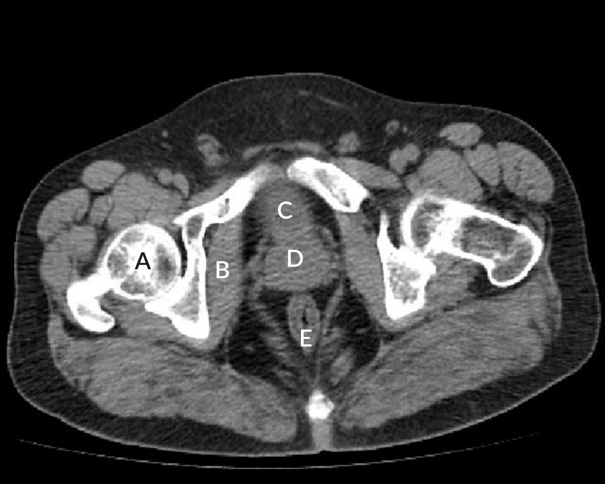

Pelvic CT

#### Structure

* Capsules

* External: continuation of the <u>pelvic</u> <u>fascia</u> (false capsule)

* Internal: true capsule

* Five anatomic lobes: Lobe location is described relative to the <u>urethra</u> (e.g., <u>anterior</u> = <u>anterior</u> to the <u>urethra</u>).

* <u>Anterior</u> (<u>isthmus</u>)

* <u>Anterior</u> to the <u>urethra</u>

* Does not contain <u>glandular tissue</u>

* <u>Posterior</u>

* Below the <u>ejaculatory ducts</u> and behind the <u>urethra</u>

* Contains <u>glandular tissue</u>

* Most common anatomic location of malignant transformation → <u>prostate cancer</u> [[2]](https://coursology-qbank.com/amboss/article/iRYJ5K)

* Middle (median): between the <u>ejaculatory ducts</u> and the <u>urethra</u>

* <u>Lateral</u> (paired; right and left lobe)

* On both sides of the <u>urethra</u>

* Most common anatomic site of <u>benign prostatic hyperplasia</u> (<u>BPH</u>) → causes obstruction of urinary flow [[5]](https://coursology-qbank.com/amboss/article/YNYn-6)

#### Vasculature, <u>lymphatics</u>, and innervation of the <u>prostate gland</u> [[5]](https://coursology-qbank.com/amboss/article/YNYn-6)

| Vasculature, <u>lymphatics</u>, and innervation of the <u>prostate gland</u> |  |
| --- | --- |
| <u>Arteries</u> |  * <u>Prostatic</u> <u>arteries</u> (branches of the <u>internal iliac artery</u>)   |
| <u>Veins</u> |  * Prostatic venous plexus → <u>internal iliac vein</u> → internal <u>vertebral</u> plexus (<u>Batson plexus</u>)  * Located between the true and false capsule  * Covered by the <u>anterior</u> <u>prostatic</u> <u>fascia</u> and the endopelvic <u>fascia</u>   |
| <u>Lymphatics</u> |  * Periprostatic subcapsular network → <u>internal iliac nodes</u>  [[6]](https://coursology-qbank.com/amboss/article/bNYH-6)   |
| <u>Sympathetic</u> innervation |  * <u>Superior hypogastric plexus</u>: contraction of <u>smooth muscle</u> during <u>ejaculation</u>   |
| <u>Parasympathetic</u> innervation |  * <u>Pelvic splanchnic nerves</u> (sacral levels <u>S2</u>–<u>S4</u>) → <u>pelvic plexus</u> → cavernous nerves (located within the <u>lateral</u> <u>prostatic</u> <u>fascia</u>; also contain <u>sympathetic</u> fibers)  * <u>Prostatic</u> secretion  * <u>Pelvic plexus</u> and <u>cavernous nerves</u> are at risk of damage during <u>radical prostatectomy</u>.   |

### Microscopic anatomy [[7]](https://coursology-qbank.com/amboss/article/cNYaZp)

#### General

* Composed of glandular, fibrous, and <u>smooth muscle tissue</u>

* <u>Glandular epithelium</u> contains foamy <u>cytoplasm</u> and abundant secretory granules, <u>RER</u>, and <u>lysosomes</u>

* The fibrous capsule forms septae that penetrate the gland and divide it into lobes.

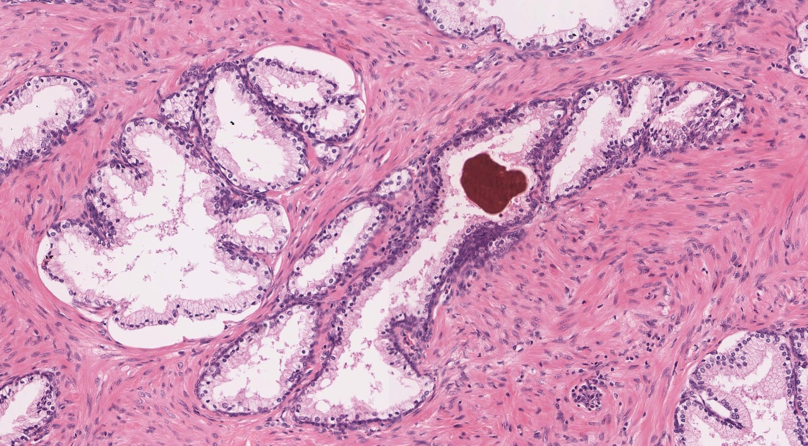

Prostate glands with corpus amylacea

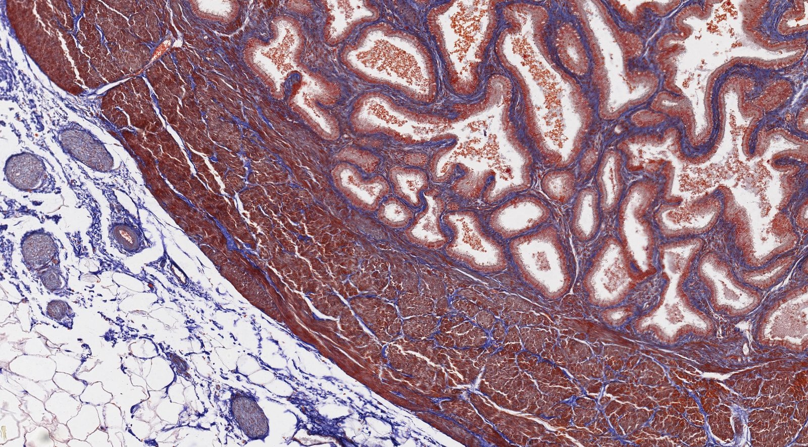

Fine structure of the prostate

#### Functional zones

* Peripheral zone 

* Largest area of <u>glandular tissue</u> with some <u>smooth muscle</u>

* Palpable on <u>digital rectal examination</u> (<u>DRE</u>)

* Most common site of <u>prostate cancer</u>

* Central zone (periurethral zone)

* Fibromuscular tissue

* Surrounds the <u>ejaculatory ducts</u>

* Accounts for 20–25% of the <u>prostate</u>'s tissue

* Site of origin for 1–5% of <u>prostate cancer</u>

* Location: from the base of the <u>prostate</u> to the seminal colliculus (verumontanum)

* Transitional zone

* Smallest area of <u>glandular tissue</u>: tubuloalveolar glands with <u>columnar epithelium</u>

* Surrounds the <u>urethra</u>

* Most common site of <u>benign prostatic hypertrophy</u>

* Accounts for 10% of the <u>prostate</u>'s tissue

* Site of origin for 20% of <u>prostate cancer</u>

* Location: <u>proximal</u> to the seminal colliculus (verumontanum)

* Contains two <u>lateral</u> lobes and a median lobe

* Urethral crest → on the <u>posterior</u> midline

* Surrounds the <u>distal</u> end of the preprostatic <u>urethra</u>

* <u>Prostatic</u> ducts: drain into the <u>prostatic</u> sinus, a groove on the sides of the urethral crest

* <u>Ejaculatory ducts</u>: open into the <u>prostatic urethra</u>, on the seminal colliculus

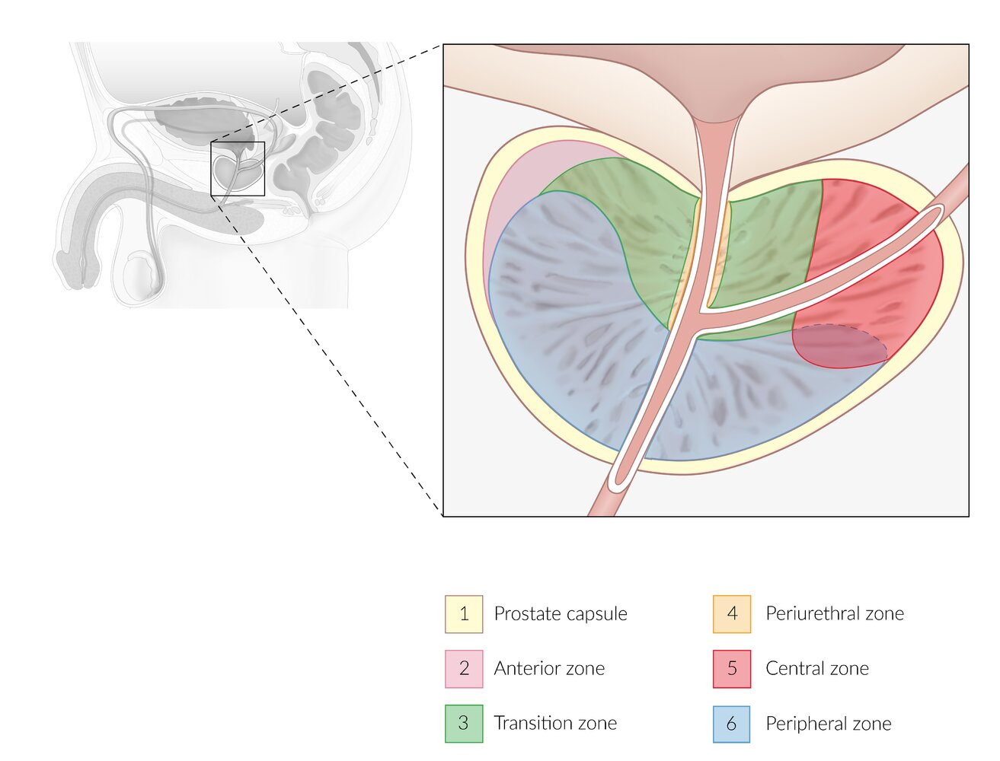

Zones of the prostate

#### Glands

* There are ∼ 30–50 branched tubuloalveolar glands

* Main <u>prostatic</u> glands are located peripherally

* Periurethral <u>submucosal</u> glands

### <u>Embryology</u> [[8]](https://coursology-qbank.com/amboss/article/7PY4T6)

* <u>Prostate</u> derives from the <u>urogenital sinus</u> (differentiation depends upon the presence of <u>DHT</u>)

* See “<u>Development of the reproductive system</u>.”

---

## Male sexual response

There are three parts of the <u>male sexual response</u>: <u>erection</u>, emission, and expulsion.

### Erection [[2]](https://coursology-qbank.com/amboss/article/iRYJ5K)[[9]](https://coursology-qbank.com/amboss/article/ydYdsL)

* Description: The <u>penis</u> becomes rigid as its <u>corpora cavernosa</u> fill with blood due to sensory and/or mental stimulation of primarily <u>parasympathetic</u> nerves.

* Autonomic control

* <u>Parasympathetic</u>: <u>pelvic splanchnic nerves</u> (<u>S2</u>–<u>S4</u>) → <u>cavernous nerves</u> → <u>nitric oxide</u> (NO) release → ↑<u>cGMP</u> → cavernous muscle relaxation → <u>vasodilation</u> → <u>erection</u>  [[10]](https://coursology-qbank.com/amboss/article/XKY9UJ)

* <u>Sympathetic</u>: <u>superior hypogastric plexus</u> (T11–L2) → fibers travel along <u>pelvic plexus</u> → <u>norepinephrine</u> release → ↑ <u>calcium</u> influx → cavernous muscle contraction → <u>vasoconstriction</u> → antagonizes <u>erection</u> (detumescence)

* Types of <u>erection</u>

* Reflex erection (mostly sensory stimulation)

* Genital stimulation → <u>pudendal nerve</u> afferents → sacral <u>erection</u> center <u>S2</u>–<u>S4</u> (<u>parasympathetic nervous system</u>) → <u>erection</u>

* Injuries to the cervical or thoracic spinal cord may result in an <u>erection</u>.

* Psychogenic erection (mostly mental stimulation)

* Cortical stimulation via visual, auditory, and sensory stimuli or fantasy → impact on the thoracolumbar <u>erection</u> center T11–L2 (<u>sympathetic nervous system</u>) → <u>inferior mesenteric plexus</u> and <u>superior hypogastric plexus</u> → some <u>sympathetic</u> <u>neurons</u> act synergistically with sacral <u>parasympathetic</u> signals (<u>S2</u>–<u>S4</u>) to increase blood flow to <u>corpora cavernosa</u> → <u>erection</u>

* <u>Sympathetic</u> innervation to the <u>smooth muscle</u> of <u>vas deferens</u>, <u>seminal vesicle</u>, and internal sphincter of the <u>bladder</u>

* Nocturnal penile tumescence

* Spontaneous <u>erection</u> while sleeping or upon waking up

* The cause is not entirely understood.

* <u>Nocturnal tumescence monitoring</u> serves as a means of differentiating psychological from physiological <u>erectile dysfunction</u>.

> [!NOTE]
> <u>PDE-5 inhibitors</u> (e.g., <u>sildenafil</u>) inhibit <u>hydrolysis</u> of <u>cGMP</u> → ↑ NO → <u>vasodilation</u> → prolonged <u>erection</u>

> [!NOTE]
> <u>S2</u>, <u>S3</u>, and <u>S4</u> keep the <u>penis</u> off the floor.

### Ejaculation [[2]](https://coursology-qbank.com/amboss/article/iRYJ5K)[[9]](https://coursology-qbank.com/amboss/article/ydYdsL)[[11]](https://coursology-qbank.com/amboss/article/4NY3Yp)

#### Emission

* During the first phase of <u>ejaculation</u>, <u>sperm</u> and secretions from the reproductive glands are transported through the reproductive ducts (<u>epididymis</u>, <u>vas deferens</u>, and <u>ejaculatory duct</u>) into the internal <u>urethra</u>.

* Ejaculate consists of <u>prostatic</u> secretion, <u>seminal vesicle</u> fluid, and spermatozoa

* Secretion of fluid from <u>accessory glands</u> promotes <u>sperm</u> survival.

* Stimulated primarily by the <u>sympathetic nervous system</u> (<u>hypogastric nerve</u>; T11–L2) → closure of the <u>bladder neck</u> and contraction of reproductive glands (<u>seminal vesicle</u>, bulbourethral, and <u>prostate glands</u>)

#### Expulsion

* During the second phase of <u>ejaculation</u>, the semen is transported through the <u>urethra</u> and expelled from the body.

* Stimulated by:

* <u>Sympathetic nervous system</u>: <u>hypogastric nerve</u> (T11–L2)

* Somatic nervous system: <u>pudendal nerve</u> → rhythmic contraction of the <u>bulbocavernosus muscle</u> → expulsion of semen from the <u>urethra</u>

> [!NOTE]
> Remember the ejaculatory pathway of <u>sperm</u> with SEVEn UP: Seminiferous tubules → Epididymis → Vas (ductus) deferens → Ejaculatory duct → Urethra → Penis

> [!NOTE]
> Innervation of <u>male sexual response</u>: Point, Squeeze, and Shoot.
> 1. Parasympathetic → Point (<u>erection</u>)
> 2. Sympathetic → Squeeze (emission)
> 3. Somatic (<u>pudendal nerve</u>) → Shoot (expulsion)

---

## Clinical significance

### <u>Penis</u>

* <u>Priapism</u>

* <u>Erectile dysfunction</u>

* <u>Phimosis</u>

* <u>Paraphimosis</u>

* <u>Balanitis</u>

* <u>Carcinoma of the penis</u>

* <u>Penile fracture</u>

* <u>Sexually transmitted infections</u>

* <u>Peyronie disease</u>

### <u>Testes</u> and <u>scrotum</u>

* <u>Testicular tumors</u>

* <u>Testicular torsion</u>

* <u>Hydrocele</u>

* <u>Varicocele</u>

* <u>Cryptorchidism</u>

### <u>Prostate</u>

* <u>Benign prostatic hyperplasia</u>

* <u>Prostate cancer</u>

* <u>Prostatitis</u>

### Other

* <u>Epididymitis</u>

* <u>Anterior urethral injury</u>

* <u>Posterior urethral injury</u>

---