# Overview of the urinary tract

*Categories: Clinical knowledge > Urology > Basics of urology > Overview of the urinary tract*

[Original Article Link](https://coursology-qbank.com/amboss/article/Rp0l6S)

---

## Summary

The urinary system is composed of the <u>kidneys</u>, <u>ureters</u>, <u>urinary bladder</u>, and the <u>urethra</u>. This group of organs functions to maintain the <u>fluid balance</u> of the body and to filter toxic substances from the bloodstream. Urine is generated by the <u>kidneys</u> and carried to the <u>bladder</u> through the <u>ureters</u>. From the <u>bladder</u>, it is released through the <u>urethra</u>. The <u>ureters</u> have <u>smooth muscle</u> fibers that contract in a <u>peristaltic</u> fashion to propel urine to the <u>bladder</u>. They have a narrow lumen at the <u>ureteropelvic junction</u>, the <u>pelvic inlet</u>, and the <u>ureterovesical junction</u>, which renders them susceptible to stone impaction. The <u>bladder</u> is located in the extraperitoneal space, behind the <u>pubic symphysis</u>, within the <u>pelvis</u>, and has a <u>detrusor muscle</u> that contracts during <u>micturition</u>. It is divided into apex, body, fundus, and neck. The <u>bladder</u> can rupture from <u>blunt abdominal trauma</u>, resulting in extravasation of urine and, potentially, <u>peritonitis</u>. The <u>internal urethral sphincter</u> is a circular <u>smooth muscle</u> that surrounds the neck of the <u>bladder</u> and prevents urine leakage. The <u>urethra</u> is a tubular structure that transports urine from the <u>bladder</u> to the <u>external urethral meatus</u>. The <u>male urethra</u>, which also transports semen, is divided into three parts: <u>prostatic urethra</u>, <u>membranous urethra</u>, and <u>penile urethra</u> (<u>spongy urethra</u>), while the <u>female urethra</u> has only one part. The <u>membranous urethra</u>, <u>penile urethra</u>, and <u>female urethra</u> are lined by <u>stratified</u> <u>squamous epithelium</u>. The <u>ureters</u>, <u>bladder</u>, and <u>prostatic urethra</u> are lined by <u>transitional epithelium</u>., which is derived from the <u>endoderm</u>.

---

## Ureters

### Overview

* <u>Retroperitoneal</u>, hollow tubes that extend from the <u>renal medulla</u> (<u>renal pelvis</u>) to the <u>urinary bladder</u>

* Contain <u>smooth muscles</u> that contract and relax in a wave-like manner (<u>peristalsis</u>) to propel urine forward towards the <u>bladder</u>

* Course along the <u>anterior</u> surface of <u>transverse processes</u> of the <u>lumbar spine</u> and the <u>psoas major</u> muscles

### Gross anatomy [[1]](https://coursology-qbank.com/amboss/article/iRYJ5K)

* <u>Renal pelvis</u>

* The dilated, funnel-shaped, <u>proximal</u> part of the <u>ureter</u>

* The point of <u>convergence</u> of 2 or 3 major calyces

* Common site for <u>struvite stone</u> precipitation (<u>staghorn calculi</u>)

* Close proximity to both the <u>iliohypogastric nerve</u> and <u>ilioinguinal nerve</u>: renal pathologies (e.g., <u>kidney stones</u>) can cause <u>referred pain</u> in the groin

* Constrictions of the ureters 

* <u>Ureteropelvic junction</u> (in the <u>kidneys</u>)

* <u>Pelvic inlet</u> (where the <u>ureter</u> crosses the common iliac or the <u>external iliac artery</u>)

* Ureterovesical junction (where the <u>ureters</u> enter the <u>posterior</u> wall of the <u>urinary bladder</u>)

* Entry into the <u>bladder</u>

* The <u>ureters</u> travel down the posterolateral surface of the <u>urinary bladder</u> towards its inferior region, where they insert into the <u>trigone of the bladder</u>.

* The intramural parts of the <u>ureters</u> are compressed during <u>bladder</u> contraction, preventing <u>vesicoureteral reflux</u>.

* Relationship to neighboring structures: The <u>ureters</u> travel from the <u>kidneys</u> (<u>cranial</u>) down to the <u>urinary bladder</u> (<u>caudal</u>). 
* They are located:

* <u>Posterior</u> to the <u>gonadal arteries</u>

* <u>Anterior</u> to the common <u>iliac arteries</u> at the level of the bifurcation or <u>anterior</u> to the <u>external iliac arteries</u>

* <u>Posterior</u> to the <u>vas deferens</u> (in males) and the <u>uterine artery</u> (in females)

* Vasculature

| Vasculature of the <u>ureters</u> |  |  |  |
| --- | --- | --- | --- |
|  | Abdominal part |  | <u>Pelvic</u> part |
|  | <u>Proximal</u> <u>ureters</u> | Middle <u>ureters</u> | <u>Distal</u> <u>ureters</u> |
| <u>Arteries</u> |  * <u>Renal arteries</u>   |  * <u>Gonadal arteries</u> (i.e., <u>testicular artery</u>/ <u>ovarian artery</u>) and branches of the aorta, the common <u>iliac arteries</u>, and the <u>internal iliac arteries</u>   |  * Branches of the common iliac and <u>internal iliac arteries</u> (e.g., superior and <u>inferior vesical arteries</u>) and the <u>ovarian arteries</u> in females   |
| <u>Veins</u> |  * <u>Renal veins</u>   |  * <u>Renal veins</u>, gonadal (i.e., testicular or ovarian) <u>veins</u>   |  * Branches of the common iliac and <u>internal iliac vein</u> (e.g., superior and inferior vesical <u>vein</u>) and the <u>ovarian vein</u> in females   |

* Innervation

* <u>Sympathetic</u>: <u>lumbar splanchnic nerves</u>

* <u>Parasympathetic</u>: <u>pelvic splanchnic nerves</u>, <u>vagus nerve</u> (<u>CN X</u>)

> [!TIP]
> Common sites of <u>ureteral obstruction</u> are the three <u>constrictions of the ureters</u>: the <u>ureteropelvic junction</u>, the <u>pelvic inlet</u>, and the <u>ureterovesical junction</u>.

> [!TIP]
> The <u>ureter</u> travels <u>posterior</u> to the <u>gonadal artery</u>, <u>ventral</u> to the <u>common iliac artery</u>, and <u>posterior</u> to the <u>vas deferens</u>/<u>uterine artery</u>.

> [!WARNING]
> Due to their close anatomical association with the <u>female reproductive organs</u>, the <u>ureters</u> are at risk of injury during gynecological procedures (e.g., ligation, dissection of the uterine or ovarian vessels). <u>Ureteral injury</u> is a serious complication and may lead to <u>ureterovaginal fistula</u> formation as well as <u>ureteral obstruction</u> and discontinuity.

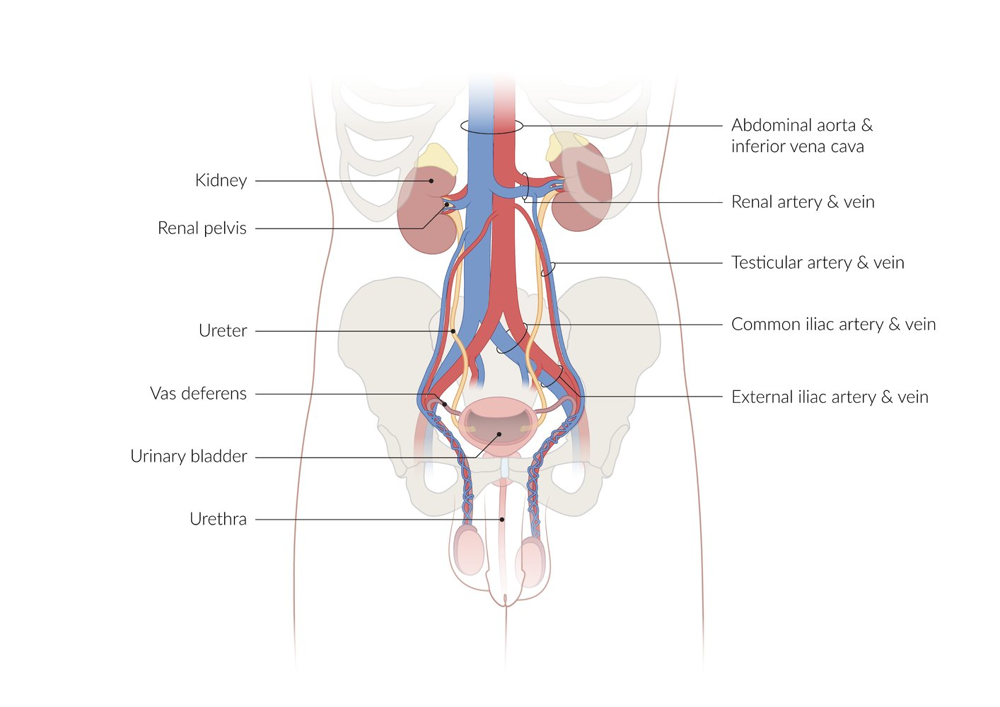

Urinary tract and vasculature of the testes

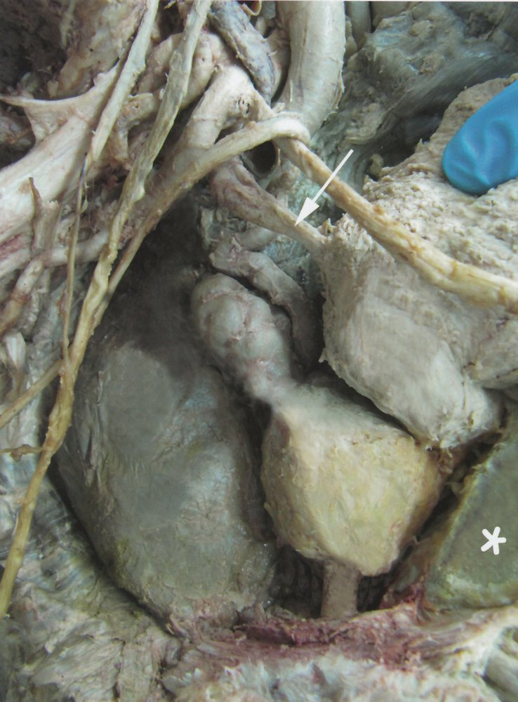

Male pelvic region

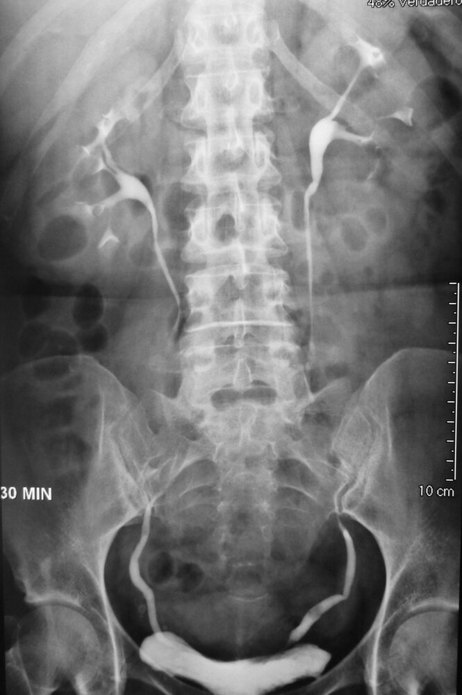

Intravenous urography (IVU)

### Microscopic anatomy [[2]](https://coursology-qbank.com/amboss/article/kkYmL6)

* <u>Epithelium</u>: <u>transitional epithelium</u>

* Muscular layers: contract and relax in a <u>peristaltic</u> pattern

* Inner longitudinal layer

* Outer circular layer

* Outer longitudinal layer (mainly present in the <u>distal</u> third of the <u>ureter</u>)

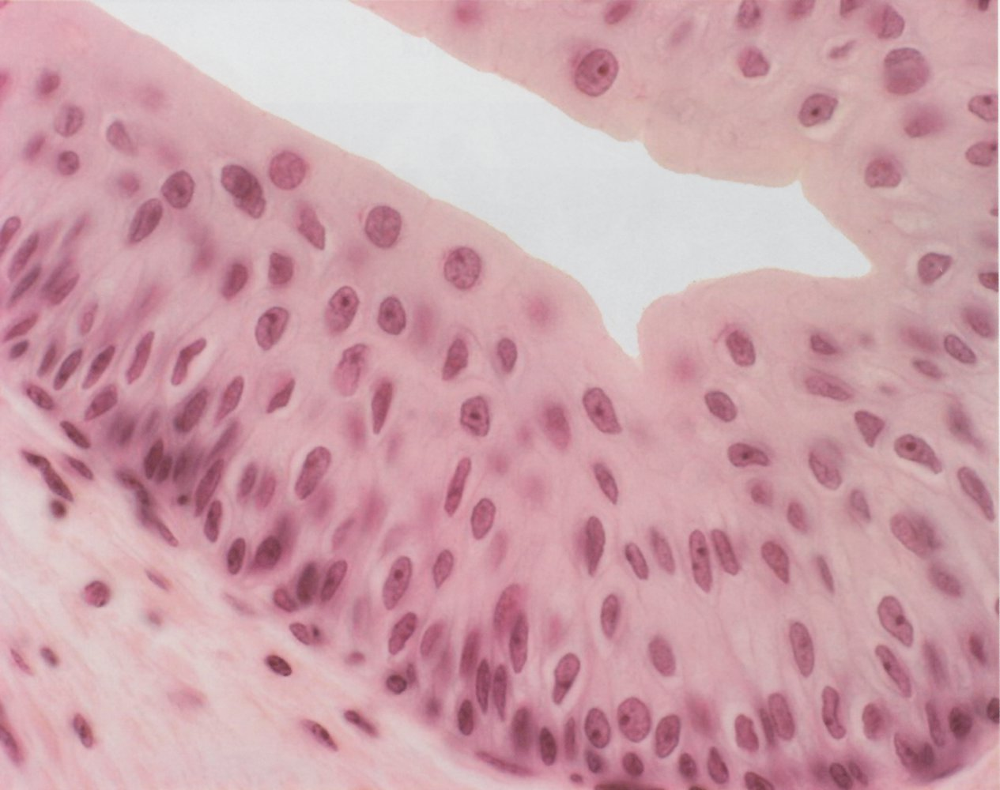

Urothelium

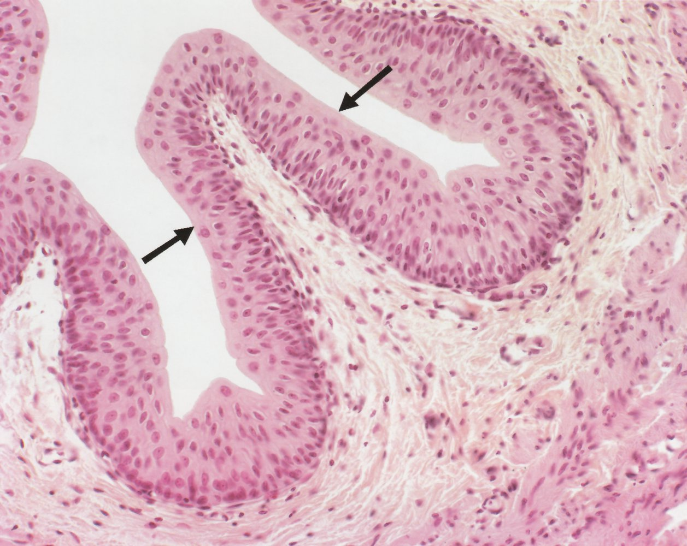

Mucosa of the ureter

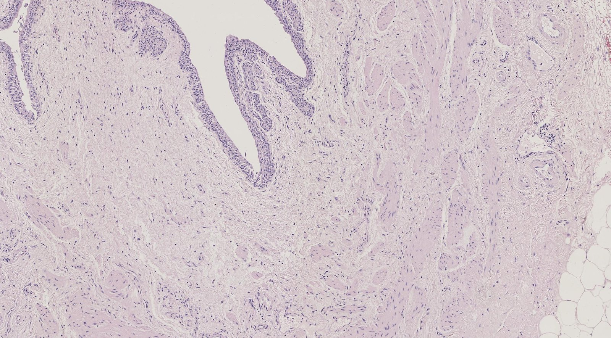

Layers of the ureteral wall

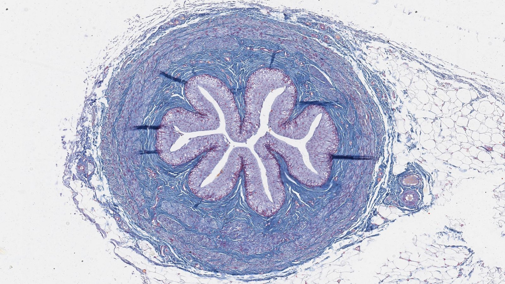

Cross section of the ureter

---

## Urinary bladder

### Overview [[1]](https://coursology-qbank.com/amboss/article/iRYJ5K)

* Hollow, triangular-shaped organ

* Located extraperitoneally, behind the <u>pubic symphysis</u>, within the <u>pelvis</u>, and beneath the <u>peritoneum</u>

* Can hold ∼ 500–1,000 ml of urine

* Sensation of <u>bladder</u> fullness is felt at ∼ 300–500 mL.

* Contains <u>smooth muscle</u> (the <u>detrusor muscle</u> of the <u>bladder</u>) that contracts during <u>micturition</u>.

Organ fact sheet: urinary bladder

### Gross anatomy [[1]](https://coursology-qbank.com/amboss/article/iRYJ5K)

| Structures of the <u>bladder</u> |  |  |
| --- | --- | --- |
|  | Location | Characteristics |
| Apex |  * Uppermost aspect of the <u>bladder</u> dome   |   * The <u>median umbilical ligament</u> is attached to the apex and extends to the <u>umbilicus</u>.  * The superior portion (dome) of the <u>bladder</u> is covered by <u>peritoneum</u>.    |
| Body |  * Hollow and muscular cavity located between the apex and the fundus   |   * Supported inferiorly by the <u>prostate</u> in males and the <u>pelvic diaphragm</u> in females  * Supported laterally by the <u>levator ani</u> and the <u>internal obturator</u> muscles    |
| Fundus |  * Located posteriorly   |  * Forms the <u>bladder neck</u>   |
| Bladder neck |   * Joins the <u>bladder</u> and the <u>urethra</u>  * Formed by the fundus and the inferolateral surfaces of the <u>bladder</u> cavity  * Attached to the <u>posterior</u> surface of the <u>pubis</u> via the pubourethral <u>ligament</u>    |  * Comprise the <u>internal urethral sphincter</u>   |
| Trigone of the bladder |  * Triangular area of <u>mucosa</u> located in the internal surface of the <u>bladder</u>   |  * Formed by the two ureteral openings superiorly (base), and the opening of the <u>urethra</u> (apex)   |

Urinary bladder (male)

Median section of the male pelvis with detail of a testicle

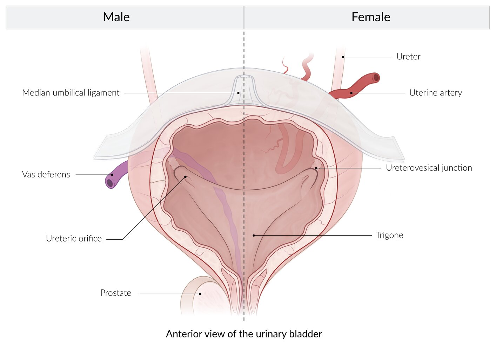

#### Muscles

* Detrusor muscle

* Primary <u>smooth muscle</u> of the <u>bladder</u>

* Contracts during <u>micturition</u> to enhance <u>bladder</u> emptying

* Controlled by the <u>parasympathetic nervous system</u>

* <u>Internal urethral sphincter</u>

* Circular <u>smooth muscle</u> surrounding the neck of the <u>bladder</u>, where the <u>urethra</u> begins

* Constriction prevents urinary leakage

* Controlled by the <u>sympathetic nervous system</u>

Urinary bladder (female)

Female pelvic organs

#### Vasculature

* <u>Arteries</u>

* Branches of the <u>internal iliac arteries</u>

* Superior vesical artery (supplies the superior <u>bladder</u>, <u>seminal vesicles</u>, <u>ductus deferens</u>, and portions of the <u>ureter</u>)

* <u>Inferior vesical artery</u>

* <u>Vaginal artery</u> (in females)

* Branches of the <u>obturator artery</u> and <u>inferior gluteal artery</u>

* <u>Veins</u>

* Branches that mirror the arterial supply

* Drain into the <u>internal iliac veins</u>

* <u>Lymphatics</u>

* <u>Internal iliac nodes</u>

* Superior part: <u>external iliac nodes</u>

#### Innervation

* <u>Sympathetic</u>: causes relaxation of the <u>detrusor muscle</u> and constriction of the <u>internal urethral sphincter</u> → retention of urine

* <u>Parasympathetic</u>: <u>pelvic splanchnic nerves</u> (<u>S2</u>–<u>S4</u>) → stimulate contraction of the <u>detrusor muscle</u> and relaxation of the <u>internal urethral sphincter</u> → emptying of the <u>bladder</u>

> [!TIP]
> <u>Rupture of the bladder</u> dome (e.g., <u>blunt abdominal trauma</u>), especially when the <u>bladder</u> is full, can cause <u>peritonitis</u> due to extravasation of urine into the <u>peritoneal cavity</u>

### Microscopic anatomy [[2]](https://coursology-qbank.com/amboss/article/kkYmL6)

* <u>Epithelium</u>: <u>transitional epithelium</u>

* Empty <u>bladder</u>

* Composed of 5–6 layers of cells

* Cells are round and thick

* Full <u>bladder</u>

* Composed of 3–4 layers of cells

* Cells are flat and thin

* Muscular layers

* Inner longitudinal layer

* Middle circular layer

* Outer longitudinal layer

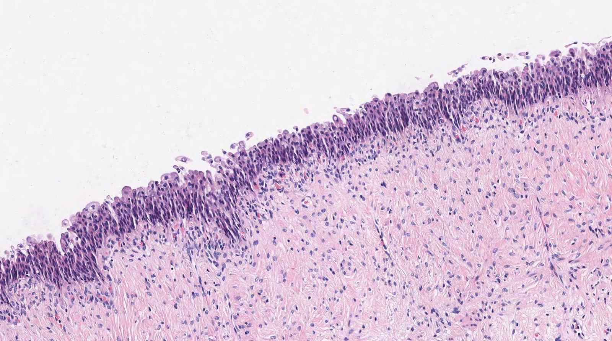

Urothelium (transitional epithelium)

### Function

#### Micturition [[3]](https://coursology-qbank.com/amboss/article/e6cxPW0)[[4]](https://coursology-qbank.com/amboss/article/U6cb4W0)

* Definition: the action of urinating, triggered by a <u>spinal reflex</u> that is subject to voluntary control

* Process
1. * Filling of the <u>urinary bladder</u>
2. * Increase in intravesical pressure
3. * Stretching of the <u>bladder</u> wall
4. * Activation of <u>mechanoreceptors</u>
5. * Sensory information is sent to the spinal cord through <u>pelvic splanchnic nerves</u>
6. * Information is relayed to the pontine micturition center (PMC), a collection of neuronal cell bodies located in the <u>pons</u> that coordinate the process of <u>micturition</u>
7. * Information is integrated in higher (cortical) <u>brain</u> centers
8. * Perception of <u>bladder</u> fullness

* <u>Urination</u> is feasible: activation of the PMC → stimulation of <u>parasympathetic</u> fibers and inhibition of somatic pudendal nerve fibers → contraction of the <u>detrusor muscle</u> and relaxation of the external urethral sphincter → <u>micturition</u>

* <u>Urination</u> is unfeasible: cortical inhibition of the PMC → no stimulation of <u>parasympathetic</u> fibers or inhibition of somatic pudendal nerve fibers → no contraction of the <u>detrusor muscle</u> or relaxation of the external urethral sphincter → no <u>micturition</u>

> [!NOTE]
> The involuntary function of the <u>bladder</u> is regulated through the coordination of the <u>sympathetic</u> and <u>parasympathetic</u> nervous systems by the <u>micturition</u> center in the <u>pons</u>.

---

## Urethra

### Overview

* A hollow and tubular structure that begins in the neck of the <u>bladder</u>, continues through the <u>urogenital sinus</u>, and ends in the external urethral meatus

* Transports urine from the <u>urinary bladder</u> to the exterior of the body under control of the <u>urethral sphincter</u> (see “<u>Urogenital diaphragm</u>”)

### Gross anatomy [[1]](https://coursology-qbank.com/amboss/article/iRYJ5K)

| Gross anatomy of the male and <u>female urethra</u> |  |  |  |
| --- | --- | --- | --- |
|  |  |  Male urethra   |  Female urethra  |
| Length |  |  * ∼ 20 cm long   |  * ∼ 4 cm long   |
| Gross anatomy |  |   * Prostatic urethra  * Courses through the <u>prostate gland</u>  * Can be compressed by <u>benign prostatic hyperplasia</u> (<u>BPH</u>)  * Membranous urethra  * Courses from the apex of the <u>prostate</u> to the bulb of the <u>penis</u>  * <u>Posterior urethral injury</u> (e.g., due to <u>pelvic fracture</u>): rupture of this part of the <u>urethra</u> causes extravasation of urine into the deep perineal space and can spread retropubically, around the <u>bladder</u>, and <u>prostate</u>.  * Spongy urethra (<u>penile urethra</u>)  * Courses from the bulb of the <u>penis</u> through the <u>corpus spongiosum</u>  * Ends in the urethral meatus  * Site of drainage of bulbourethral glands (Cowper glands)  * <u>Anterior urethral injury</u> (e.g., <u>perineal straddle injury</u>, an injury to the <u>perineum</u> caused by falling astride an object): Rupture of this part of the <u>urethra</u> below the <u>urogenital diaphragm</u> causes urine to extravasate into the <u>superficial perineal space</u> and surrounding areas.  * Inferior: into the <u>scrotum</u>  * Superior: in the lower abdominal wall  * <u>Anterior</u>: around the <u>penis</u>    |  * The <u>female urethra</u> consists of only one part   |
| <u>Ligaments</u> |  |   * <u>Prostatic urethra</u>: supported by the <u>perineal membrane</u>  * <u>Membranous urethra</u>  * Supported by the <u>perineal membrane</u> and the <u>external urethral sphincter</u>  * Fixed portion of the <u>male urethra</u> due to the supporting <u>ligaments</u> that attach it to the inferior pubic rami, and the ischial rami    |   * Suspended proximally by urethropelvic <u>ligaments</u> bilaterally  * Attached to the inferior border of the pubic rami  * Suspended distally by the pubovesical <u>ligament</u> and suspensory <u>ligament</u> of the <u>clitoris</u>    |
| <u>External urethral sphincter</u> |  |  * <u>External urethral sphincter</u> consists of only 1 part   |  * Composed of three distinct parts: See “<u>External urethral sphincter</u>.”   |
| Vasculature | <u>Arteries</u> |   * <u>Inferior vesical artery</u>  * <u>Middle rectal artery</u>  * <u>Bulbourethral artery</u>  * <u>Deep penile artery</u>    |   * Internal pudendal <u>arteries</u>  * Vaginal <u>arteries</u>    |
| <u>Veins</u> |   * Inferior vesical <u>vein</u>  * <u>Middle rectal vein</u>  * Bulbourethral <u>vein</u>  * Deep penile <u>vein</u>  * Drain into the <u>prostatic venous plexus</u>    |   * <u>Internal pudendal veins</u>  * Vaginal <u>veins</u>    |  |
| <u>Lymphatics</u> |  |   * <u>Proximal</u>: <u>prostatic</u> and <u>membranous urethra</u> → obturator and <u>internal iliac nodes</u>  * <u>Distal</u>: <u>spongy urethra</u> → <u>superficial</u> and <u>deep inguinal nodes</u>    |   * <u>Proximal</u>: <u>internal iliac nodes</u>  * <u>Distal</u>: <u>superficial inguinal lymph nodes</u>    |
|  Microscopic anatomy [[2]](https://coursology-qbank.com/amboss/article/kkYmL6) |  <u>Epithelium</u> [[5]](https://coursology-qbank.com/amboss/article/NLX-BA) |   * <u>Prostatic urethra</u>: <u>transitional epithelium</u>  * <u>Membranous urethra</u>: <u>transitional epithelium</u> changes into <u>pseudostratified</u> <u>columnar epithelium</u>  * <u>Spongy urethra</u>: <u>pseudostratified</u> <u>columnar epithelium</u>, <u>stratified</u> <u>columnar epithelium</u> in terminal portion    |   * <u>Stratified</u> <u>squamous epithelium</u>  * Some <u>stratified</u> <u>columnar epithelium</u> can also be present    |
| Muscular layers |   * <u>Prostatic</u>: inner longitudinal and outer circular layers  * Membranous: <u>skeletal muscle</u> fibers from the <u>urogenital diaphragm</u> make up the <u>external urethral sphincter</u>  * Spongy: sparse <u>smooth muscle</u> with more <u>elastic fibers</u>    |   * Inner longitudinal layer  * Outer circular layer  * <u>Skeletal muscle</u> fibers from the <u>urogenital diaphragm</u> make up the <u>external urethral sphincter</u>    |  |
| Function |  |  * Transports urine and semen through the <u>penis</u> to the exterior   |  * Transmits only urine to the exterior   |

> [!WARNING]
> <u>Urinary catheterization</u> (e.g., <u>Foley catheter</u>) should be avoided in patients with suspected <u>urethral injury</u>!

Urinary bladder (male)

Median section of the male pelvis with detail of a testicle

Urinary bladder (female)

Female pelvic organs

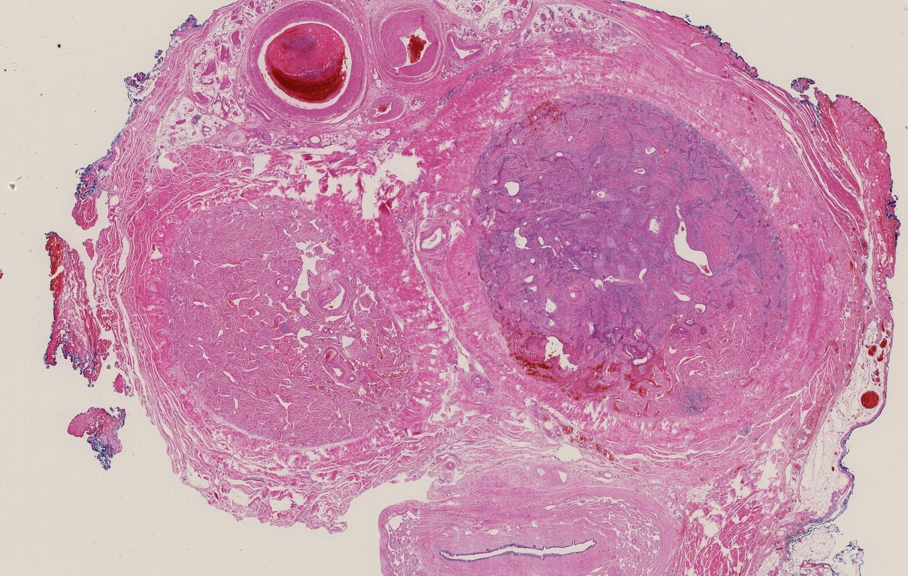

Urethra, corpora cavernosa, and corpus spongiosus of the penis

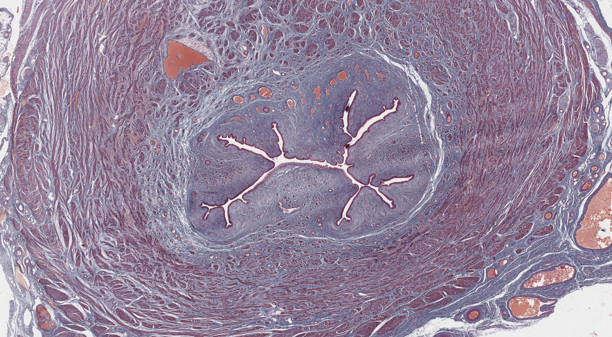

Urethra

---

## Embryology

* Germ layer derivatives

* <u>Mesoderm</u>: the <u>kidneys</u> and <u>ureters</u>

* <u>Endoderm</u>: <u>epithelium</u> of the <u>urinary bladder</u> and the <u>urethra</u>

* <u>Kidney</u> and <u>ureters</u>

* The <u>kidneys</u> and <u>ureters</u> develop from a succession of events that involve the appearance of three renal precursors: <u>pronephros</u>, <u>mesonephros</u>, and <u>metanephros</u>.

* See “<u>Embryology</u>” in “<u>Kidneys</u>.”

* <u>Urinary bladder</u> and <u>urethra</u>

* Derived from the cloaca

* Communicates with the <u>surface ectoderm</u> and the <u>allantois</u>

* Divided by the urorectal septum

* <u>Ventral</u> portion develops into the <u>bladder</u> and <u>urogenital sinus</u>

* <u>Dorsal</u> portion develops into the <u>rectum</u> and <u>anal canal</u>

* <u>Trigone</u>: derived from <u>mesonephric ducts</u> (<u>mesoderm</u>)

* Allantois

* <u>Endodermal</u> origin (<u>hindgut</u>)

* Formed from the <u>yolk sac</u> in the 3rd week

* Extends into the <u>urogenital sinus</u> and communicates with the <u>umbilicus</u>

* Gives rise to the <u>umbilical arteries</u> and <u>umbilical vein</u>

* Becomes the <u>urachus</u>

* Urachus

* Connects the fetal <u>bladder</u> to the <u>umbilicus</u>

* Removes fetal <u>nitrogenous waste</u>

* Becomes the median umbilical ligament when obliterated, which is:

* Attached to the apex and extends to the <u>umbilicus</u>

* Covered by the median umbilical fold, a layer of <u>peritoneum</u> that is a remnant of the obliterated <u>urachus</u> that extends from the apex of the <u>urinary bladder</u> to the <u>umbilicus</u>

* Failure of the <u>urachus</u> to obliterate causes the following abnormalities: 

* Patent urachus (<u>urachal fistula</u>): complete failure to obliterate → urine discharge from the <u>umbilicus</u>

* Urachal cyst

* Partial failure to obliterate results in a fluid-filled cavity covered by <u>urothelium</u> between the <u>bladder</u> and the <u>umbilicus</u>.

* Suspect <u>urachal cyst</u> infection in a patient with a painful mass under the <u>umbilicus</u>.

* Urachal sinus: partial failure of the <u>cranial</u> end to obliterate → cloudy, serous (or even bloody) fluid from the <u>umbilicus</u>

* Vesicourachal diverticulum: partial failure of the <u>caudal</u> end to obliterate → outpouching of the <u>bladder</u>

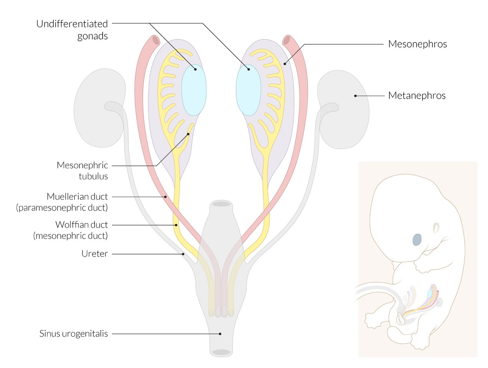

Genital embryology (first stage)

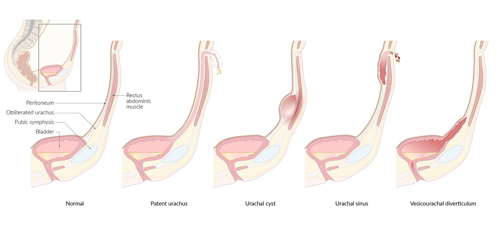

Urachus and urachal abnormalities

References:[[6]](https://coursology-qbank.com/amboss/article/OkYIL6)

---

## Clinical significance

* <u>Bladder exstrophy</u>, <u>abnormalities of the male urethra</u>, and <u>webbed penis</u>

* <u>Congenital anomalies of the kidneys</u>

* <u>Disorders of the glans penis and foreskin</u>

* <u>Glomerular diseases</u>

* <u>Nephritic syndrome</u>

* <u>Nephrotic syndrome</u>

* <u>Penile fracture</u>

* <u>Polycystic kidney disease</u>

* <u>Posterior urethral valves</u>

* <u>Renal artery stenosis</u>

* <u>Renal cell carcinoma</u>

* <u>Stress incontinence</u>

* <u>Scrotal abnormalities</u>

* Traumatic injuries of the <u>kidney</u> and <u>bladder</u>

* <u>Urethritis</u>

* <u>Urge incontinence</u>

* <u>Urinary incontinence</u>

* <u>Urinary retention</u>

* <u>Urinary tract infections</u>

* <u>Urolithiasis</u>

* <u>Urinary tract cancer</u>

* <u>Vasculitides</u>

* <u>Vesicoureteral reflux</u>

* <u>Nephroblastoma</u>

---