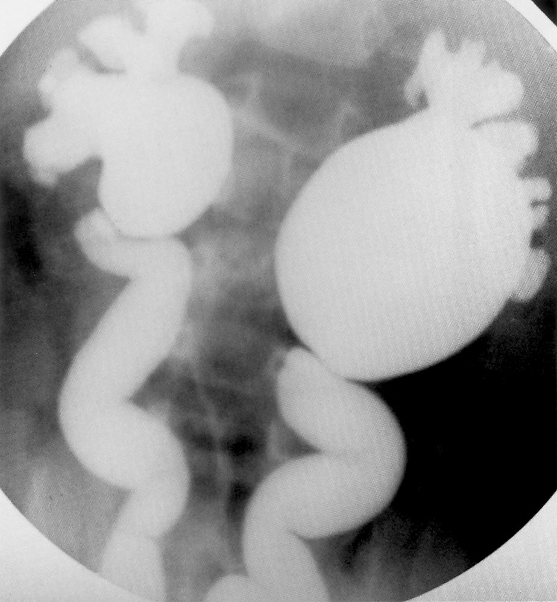
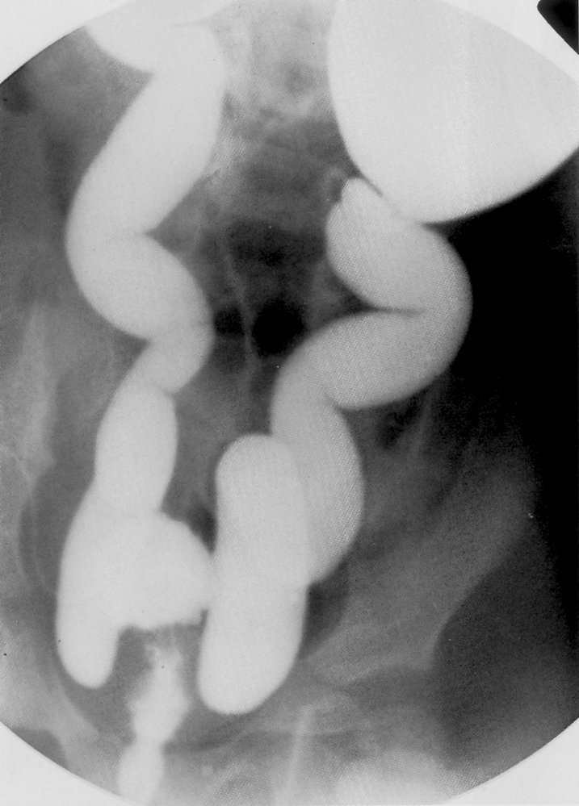

# Megaureter

*Categories: Clinical knowledge > Urology > Congenital defects and malformations > Megaureter*

[Original Article Link](https://coursology-qbank.com/amboss/article/Uo0bYS)

---

## Summary

Megaureter is defined as ureteral dilation > 7 mm. Primary megaureter is due to obstructed or refluxing vesicoureteral junction, while secondary megaureter is caused by <u>bladder outlet obstruction</u>. Although rare, primary megaureter is responsible for up to 20% of <u>hydronephrosis</u> cases in <u>neonates</u>. About half of the patients with megaureter are asymptomatic. The other half may present with a <u>urinary tract infection</u>, abdominal <u>pain</u>, or features of <u>uremia</u>. <u>Ultrasound</u> (prenatal and postnatal) shows ureteral dilation, which may be accompanied by <u>hydronephrosis</u>. CT or <u>MR urography</u> shows a constricted terminal <u>ureter</u> with <u>proximal</u> dilation, while voiding cystogram detects <u>vesicoureteral reflux</u> in refluxing megaureter. Prophylactic <u>antibiotics</u> and regular follow-ups are sufficient in patients with primary megaureter and preserved renal function. <u>Surgery</u> (terminal <u>ureter</u> resection and reimplantation into the <u>bladder</u>) is indicated in patients with deteriorating renal parameters. Patients with secondary megaureter require treatment of the underlying cause. Those who do not receive treatment can develop <u>recurrent urinary tract infections</u>, <u>hydronephrosis</u>, and <u>obstructive nephropathy</u> with permanent <u>kidney</u> damage.

---

## Clinical features

* Prenatal detection of <u>hydronephrosis</u> and dilated <u>ureter</u> on antenatal <u>ultrasonography</u>

* Postnatal presentation

* ∼ 50% are asymptomatic, with normal renal parameters

* Often an incidental finding on <u>ultrasound</u> [[5]](https://coursology-qbank.com/amboss/article/ZyXZd00)

* <u>Symptoms of urinary tract infection</u>

* Abdominal / flank <u>pain</u>

* Features of <u>uremia</u>

---

## Diagnosis

* <u>Ultrasound</u>: best initial and <u>confirmatory test</u>

* <u>Hydronephrosis</u>

* Ureteral dilation > 7 mm

* Further evaluation

* <u>Voiding cystourethrography</u> (<u>VCUG</u>): to identify retrograde reflux of urine into the <u>ureters</u>

* Radionuclide renal scanning : to identify obstruction and evaluate renal function

Refluxing megaureter in a voiding cystourethrogram (1/2)

Refluxing megaureter in a voiding cystourethrogram (2/2)

---

## Treatment

### Primary megaureter

* <u>Conservative therapy</u>

* Indicated in children with preserved renal function

* Prophylactic <u>antibiotics</u>

* Regular follow-up

* <u>Surgery</u>

* Indicated in children with deteriorating renal function

* Procedure: resection of the <u>distal</u> segment of the <u>ureter</u> and re-implantation into the <u>bladder</u> (ureteroneocystostomy)

### Secondary megaureter

* Treatment of the underlying disease

---

## Complications

* <u>Urinary tract infections</u>

* <u>Hydronephrosis</u>

* <u>Obstructive nephropathy</u>

We list the most important complications. The selection is not exhaustive.

---