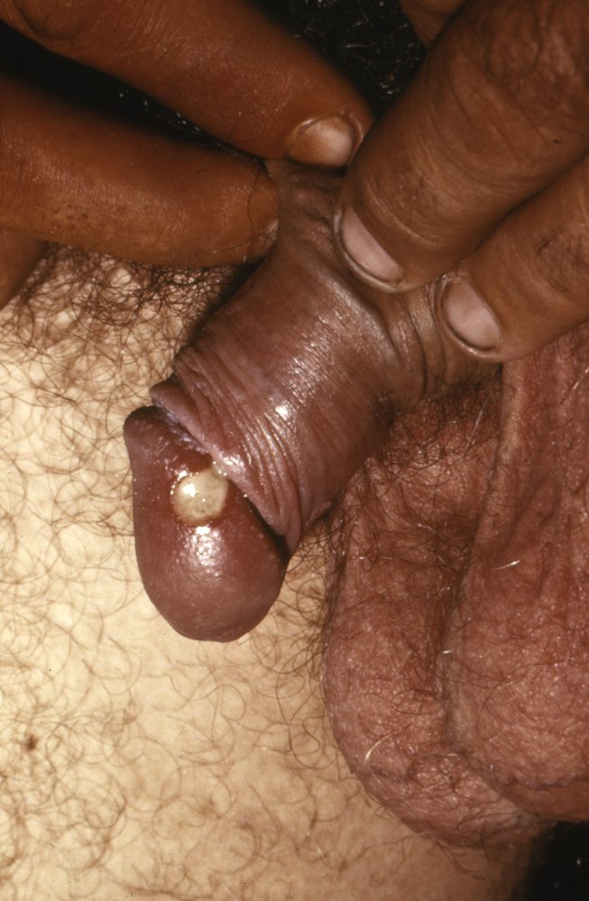
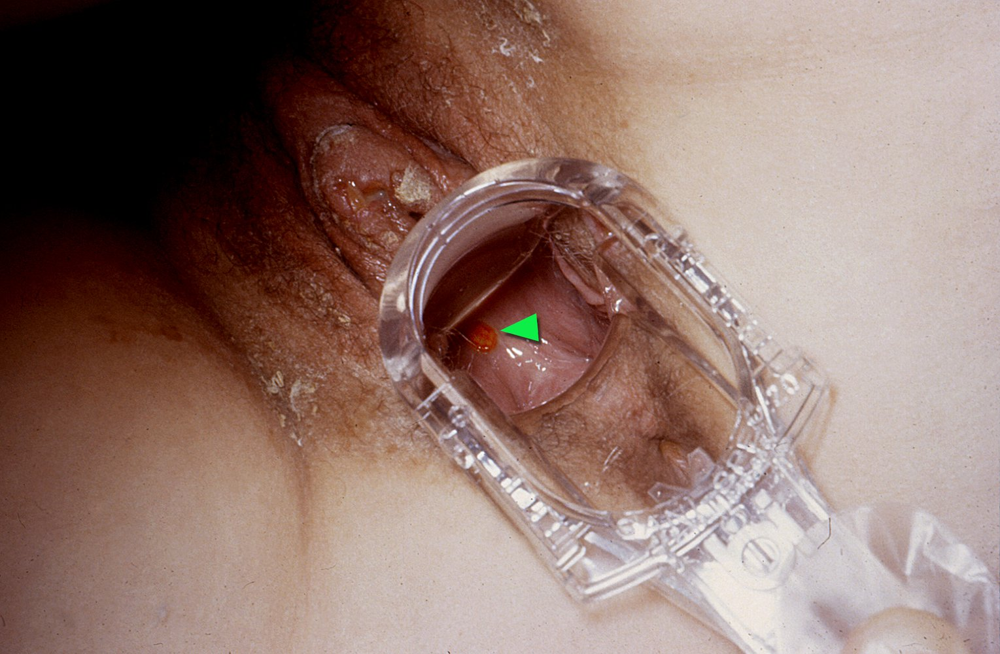
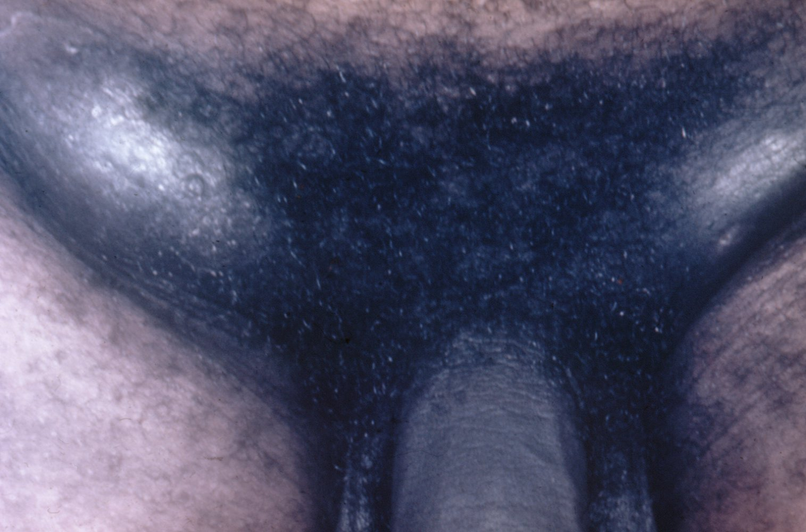

# Chancroid

*Categories: Clinical knowledge > Urology > Infectious diseases > Chancroid*

[Original Article Link](https://coursology-qbank.com/amboss/article/650jOg)

---

## Summary

Chancroid (also known as soft <u>chancre</u>) is a highly contagious <u>sexually transmitted infection</u> (<u>STI</u>) caused by <u>Haemophilus ducreyi</u>. Although chancroid is a rare infection in the US, it may occur in <u>immunocompromised</u> patients and is a common cause of genital <u>ulcers</u> in tropical and subtropical regions. It is characterized by the formation of small, painful <u>ulcers</u> on the genitalia and regional <u>lymphadenopathy</u>. The diagnosis is primarily based on clinical findings and is probable if <u>genital herpes</u> and syphilitic <u>chancre</u> have been ruled out. Culture confirms the diagnosis but is not widely available. Treatment usually involves administration of an <u>antibiotic</u> such as <u>ceftriaxone</u> or <u>azithromycin</u>.

---

## Etiology

* <u>Pathogen</u>: Haemophilus ducreyi

* Transmission: <u>sexually transmitted infection</u>

---

## Clinical features

* <u>Incubation period</u>: typically 4–10 days

* Clinical features

* Very painful genital <u>ulcers</u> 

* <u>♂</u>: <u>glans penis</u>, <u>penis</u> shaft, and <u>scrotum</u>

* <u>♀</u>: <u>vulva</u> and perineal area

* Deep, small (10–20 mm in diameter), well-demarcated lesions with a grayish <u>necrotic</u> base

* Painful inguinal <u>lymphadenopathy</u>  [[3]](https://coursology-qbank.com/amboss/article/fU1kcT0)

* An asymptomatic course is more likely in women.

> [!NOTE]
> In contrast to <u>chancre</u>, chancroid is often painful: The causative <u>pathogen</u> is <u>Haemophilus</u> du-creyi ("do cry")!

Chancroid lesion on the penis

Vaginal ulcer in chancroid

Inguinal lymphadenopathy in chancroid

References:[[4]](https://coursology-qbank.com/amboss/article/nm07Tg)[[5]](https://coursology-qbank.com/amboss/article/Xn097g)

---

## Diagnosis

* Diagnostic criteria for chancroid: A probable diagnosis of chancroid can be made if all the following criteria are met. [[1]](https://coursology-qbank.com/amboss/article/2NcT010)

* Presence of painful deep genital <u>ulcers</u> and tender <u>lymphadenopathy</u>

* Negative tests for <u>T. pallidum</u> (see “<u>Diagnostics for syphilis</u>”)

* Negative tests for <u>HSV1</u> and <u>HSV2</u> (see “Diagnostics for <u>genital herpes</u>”).

* Confirmatory studies: rarely performed  [[1]](https://coursology-qbank.com/amboss/article/2NcT010)

* <u>Gram-stain</u>: gram-negative rods in <u>ulcer</u> <u>exudate</u> (swab sample) suggestive of <u>Haemophilus ducreyi</u> infection

* Culture  : Consider in areas where chancroid is highly prevalent. [[1]](https://coursology-qbank.com/amboss/article/2NcT010)[[2]](https://coursology-qbank.com/amboss/article/9AWNNL0)

* <u>NAAT</u>

> [!TIP]
> Chancroid is a nationally <u>notifiable disease</u> in the United States. Report all cases to the local or state health department. [[6]](https://coursology-qbank.com/amboss/article/-Q1DAg0)

---

## Treatment

* Antibiotics for chancroid [[1]](https://coursology-qbank.com/amboss/article/2NcT010)

* Single-dose therapy with <u>azithromycin</u>  DOSAGE OR <u>ceftriaxone</u> DOSAGE [[1]](https://coursology-qbank.com/amboss/article/2NcT010)

* OR multidose therapy with <u>ciprofloxacin</u> DOSAGE OR <u>erythromycin</u> base DOSAGE [[1]](https://coursology-qbank.com/amboss/article/2NcT010)

* Follow-up in 3–7 days.

* No improvement : Consider alternative diagnoses, treatment resistance, or <u>HIV</u> <u>coinfection</u>.

* Persistent <u>fluctuant</u> <u>lymphadenopathy</u> may require drainage.

* Trace and treat all partners within 10 days prior to symptom onset: See "<u>Management of sexual partners</u>." [[1]](https://coursology-qbank.com/amboss/article/2NcT010)

> [!TIP]
> Symptoms may take longer to resolve in uncircumcised patients and those with <u>HIV</u>. [[1]](https://coursology-qbank.com/amboss/article/2NcT010)

---