# Renal cell carcinoma

*Categories: Clinical knowledge > Urology > Neoplastic disorders > Renal cell carcinoma*

[Original Article Link](https://coursology-qbank.com/amboss/article/Ki0Usf)

---

## Summary

Renal cell <u>carcinoma</u> (RCC), which originates from the renal tubular <u>epithelium</u>, is the most common <u>renal malignancy</u> in adults. Most cases are sporadic, but some hereditary disorders are also associated with the development of RCC. Major <u>risk factors</u> for RCC include smoking, acquired cystic disease of the <u>kidney</u>, <u>nephrolithiasis</u>, and long-term <u>acetaminophen</u> use. In the majority of cases, RCC is diagnosed following an incidental finding on imaging, and most patients are asymptomatic. Rarely, patients may present with the classic triad of flank <u>pain</u>, <u>hematuria</u>, and a palpable abdominal mass. Patients may also present with <u>anemia</u>, weight loss, and/or paraneoplastic manifestations such as <u>hypercalcemia</u> and <u>hypertension</u>. The primary imaging modality is an abdominal <u>ultrasound</u>, or CT or <u>MRI</u> with contrast. Most RCC tumors are resistant to <u>radiotherapy</u> and classical <u>chemotherapeutic agents</u>. Surgical resection is first-line treatment in nonmetastatic disease, and immunotherapy and <u>targeted therapy</u>, e.g., <u>vascular endothelial growth factor</u> (<u>VEGF</u>) and <u>mammalian target of rapamycin</u> (<u>mTOR</u>) inhibitors, are used in <u>metastatic</u> RCC. Patients with early-stage RCC with <u>tumor</u> growth limited to the <u>kidney</u> have a very good prognosis.

---

## Epidemiology

* <u>Prevalence</u>: most common <u>malignancy</u> of the renal <u>parenchyma</u> (70% of renal cancers in adults are renal cell <u>carcinoma</u>)

* <u>Incidence</u> [[1]](https://coursology-qbank.com/amboss/article/dRXoNB)

* In 2020, an estimated 73,750 new cases will be diagnosed in the US.

* <u>♂</u> > <u>♀</u> (∼ 2:1)

* Peak <u>incidence</u> between 55 and 74 years

* Median age at diagnosis: 64 years

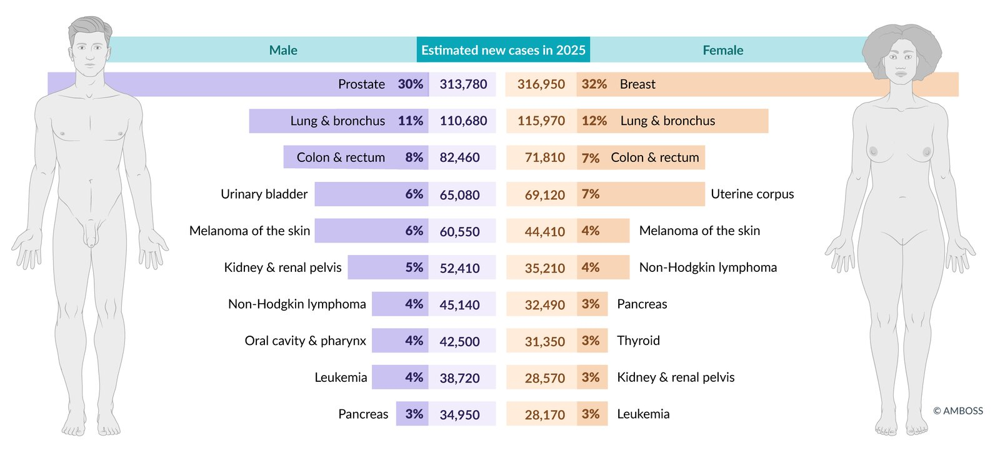

Incidence of cancers in the US (2025 estimates)

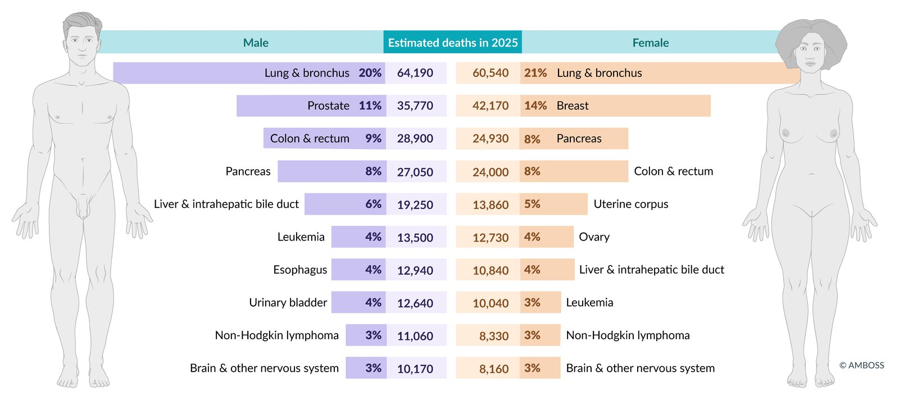

Cancer mortality in the US (2025 estimates)

Epidemiological data refers to the US, unless otherwise specified.

---

## Etiology

### Overview

* Most renal cell <u>carcinomas</u> (RCCs) occur sporadically.

* Approx. 4% of renal cell <u>carcinomas</u> are associated with hereditary factors.

* Both forms show structural alterations of the short arm of <u>chromosome</u> 3 (3p) and subsequent alterations of the <u>VHL gene</u>.

### <u>Risk factors</u> for sporadic RCC  [[2]](https://coursology-qbank.com/amboss/article/XQX9uB)[[3]](https://coursology-qbank.com/amboss/article/CiXqFB)

* Lifestyle

* Smoking

* <u>Obesity</u>

* Associated conditions

* <u>Sickle cell disease</u>

* <u>Acquired cystic kidney disease</u>  [[4]](https://coursology-qbank.com/amboss/article/jaa_4Q)

* Renal <u>pelvic</u> stones

* <u>Hypertension</u>

* <u>Immunodeficiency</u>

* <u>Chronic hepatitis C infection</u>

* Substance exposure

* <u>Occupational exposure</u> to:

* <u>Cadmium</u>

* <u>Asbestos</u>

* Petroleum by-products such as <u>trichloroethylene</u> (a degreasing agent)

* <u>Chemotherapeutic agents</u> (e.g., <u>cisplatin</u>) during childhood

* Chronic <u>analgesic</u> use (<u>acetaminophen</u>, <u>aspirin</u>)

### Hereditary renal cell <u>carcinomas</u> [[3]](https://coursology-qbank.com/amboss/article/CiXqFB)

* <u>Von Hippel-Lindau syndrome</u>: Approx. 40% of patients with <u>VHL syndrome</u> develop renal cell <u>carcinomas</u> (usually <u>clear cell RCC</u>).

* <u>Tuberous sclerosis</u>

* ∼ 5% of people with <u>tuberous sclerosis</u> develop renal cell <u>carcinomas</u> (usually <u>clear cell RCC</u>).

* RCC that is associated with <u>tuberous sclerosis</u> occurs more commonly in women.

* Birt-Hogg-Dube syndrome

* Inherited <u>autosomal dominant</u> condition caused by a mutation in the <u>folliculin</u> (<u>FLCN</u>) <u>gene</u> on <u>chromosome</u> 17

* Characterized by the following symptoms:

* <u>Skin</u> lesions: fibrofolliculomas, benign hamartomatous tumors of <u>hair follicles</u>

* <u>Lung</u> cysts

* Renal cell <u>carcinoma</u> (usually chromophobic RCC or <u>oncocytic RCC</u>)

* Hereditary leiomyomatosis and renal cancer syndrome (<u>HLRCC</u>)

* <u>Autosomal dominant</u> condition caused by a mutated <u>fumarate</u> <u>dehydrogenase</u> <u>gene</u> located on <u>chromosome</u> 1

* Characterized by cutaneous and <u>uterine leiomyomas</u>

* 15% develop type 2 <u>papillary</u> RCC

* Hereditary papillary renal cell carcinoma (<u>HPRCC</u>)

* <u>Autosomal dominant</u> condition with a high <u>penetrance</u>

* Caused by <u>activating mutations</u> of the <u>MET</u> <u>proto-oncogene</u> located on the long arm of <u>chromosome</u> 7

* Usually associated with type 1 <u>papillary</u> RCC

* <u>Succinate dehydrogenase</u> deficiency: <u>autosomal dominant</u> condition associated with <u>pheochromocytomas</u>, extra-<u>adrenal</u> <u>paragangliomas</u>, and renal cell <u>carcinoma</u>.

> [!TIP]
> Hereditary renal cell <u>carcinomas</u> are <u>autosomal dominant</u> and tend to affect patients at a younger age than sporadic renal cell <u>carcinomas</u>.

---

## Clinical features

* Overview

* Usually asymptomatic in the early stages

* Patients become symptomatic when the <u>tumor</u> has reached a large size (usually > 10 cm) and/or if <u>metastases</u> are present.

* <u>Constitutional symptoms</u>

* Weight loss, fatigue

* <u>Fever</u>, night sweats

* <u>Anemia</u>

* Symptoms caused by primary <u>tumor</u>

* <u>Hematuria</u>

* Flank <u>pain</u>

* Palpable renal mass

* Symptoms of local spread and <u>metastatic</u> disease: see “Complications” below

> [!TIP]
> The classical triad of renal cell <u>carcinoma</u> consists of <u>hematuria</u>, flank <u>pain</u>, and a palpable flank mass. However, only 10–15% of patients present with all three components of the triad and > 25% present with one or more atypical symptoms related to <u>paraneoplastic syndromes</u> and/or disseminated disease. [[5]](https://coursology-qbank.com/amboss/article/XH09Kh)

---

## Diagnosis

### Approach [[6]](https://coursology-qbank.com/amboss/article/bBcHze0)[[7]](https://coursology-qbank.com/amboss/article/cBca-e0)

Most renal masses are detected incidentally on imaging performed for another indication or to evaluate nonspecific symptoms.

* Obtain additional imaging in patients with an <u>indeterminate mass</u>. [[8]](https://coursology-qbank.com/amboss/article/AJcR9W0)

* Preferred: CT or <u>MRI</u> abdomen (with IV contrast)

* Alternative: <u>ultrasound</u> abdomen (with IV contrast)

* Pursue workup based on imaging findings (e.g., repeat imaging for Bosniak IIF cystic mass).

> [!TIP]
> <u>Hematuria</u> may be the initial presentation of RCC. Patients ≥ 35 years of age with asymptomatic <u>microhematuria</u>, and all patients with <u>gross hematuria</u> in the absence of a <u>UTI</u>, should be referred to urology. [[7]](https://coursology-qbank.com/amboss/article/cBca-e0)

### Imaging

* Overview: Most renal masses are detected incidentally on imaging performed for another indication or to evaluate nonspecific symptoms.

* Indications

* Characterization of lesions (e.g., size, regular or irregular walls).

* Identification of <u>lymph node</u> and/or <u>renal vein</u> involvement. [[9]](https://coursology-qbank.com/amboss/article/iqcJyW0)[[10]](https://coursology-qbank.com/amboss/article/QqcuyW0)

* Modalities and characteristic findings: Abdominal CT, <u>MRI</u>, or <u>ultrasound</u> (with IV contrast) are first-line modalities. ;  [[6]](https://coursology-qbank.com/amboss/article/bBcHze0)[[8]](https://coursology-qbank.com/amboss/article/AJcR9W0)

* CT abdomen (with IV contrast; multiphase renal protocol)

* Lesion(s) with thickened irregular walls, calcification, and variable <u>enhancement</u>   [[10]](https://coursology-qbank.com/amboss/article/QqcuyW0)[[11]](https://coursology-qbank.com/amboss/article/jqc_yW0)[[12]](https://coursology-qbank.com/amboss/article/rxcfBe0)

* Distorted renal outline

* <u>MRI</u> abdomen (with IV contrast; multiphase renal protocol) [[8]](https://coursology-qbank.com/amboss/article/AJcR9W0)[[9]](https://coursology-qbank.com/amboss/article/iqcJyW0)

* May be preferred for the assessment of small lesions (< 1.5 cm) and Bosniak IIF or III <u>cystic renal masses</u>

* Can provide additional information on <u>IVC</u> invasion if findings are unclear on a <u>CT scan</u> [[9]](https://coursology-qbank.com/amboss/article/iqcJyW0)

* <u>Ultrasound</u> abdomen (with IV contrast)

* Preferred study in patients with contraindications to iodinated contrast for CT and <u>gadolinium</u>-based contrast for <u>MRI</u>.

* Can identify renal lesion(s) with variable <u>echogenicity</u>   [[10]](https://coursology-qbank.com/amboss/article/QqcuyW0)

|  Workup based on imaging findings [[6]](https://coursology-qbank.com/amboss/article/bBcHze0)[[7]](https://coursology-qbank.com/amboss/article/cBca-e0)[[10]](https://coursology-qbank.com/amboss/article/QqcuyW0)  |  |
| --- | --- |
| Findings | Next steps |
|  * Bosniak I and II cystic mass   |  * Follow-up is usually not required, see also “<u>Renal cysts</u>.” [[13]](https://coursology-qbank.com/amboss/article/fPXkVy)   |
|  * Bosniak IIF cystic mass   |   * Repeat imaging at 6 and 12 months, then yearly for a total of 5 years.  * Refer to urology if there is any change in appearance or > 3 mm growth per year.    |
|   * Bosniak III or IV cystic mass  * Solid mass > 1 cm with no fat    |   * Obtain <u>CBC</u>, <u>BMP</u>, and <u>urinalysis</u>.  [[14]](https://coursology-qbank.com/amboss/article/AFcRkV0)  * Refer to urology for consideration of further investigations (e.g., staging, <u>biopsy</u>).    |

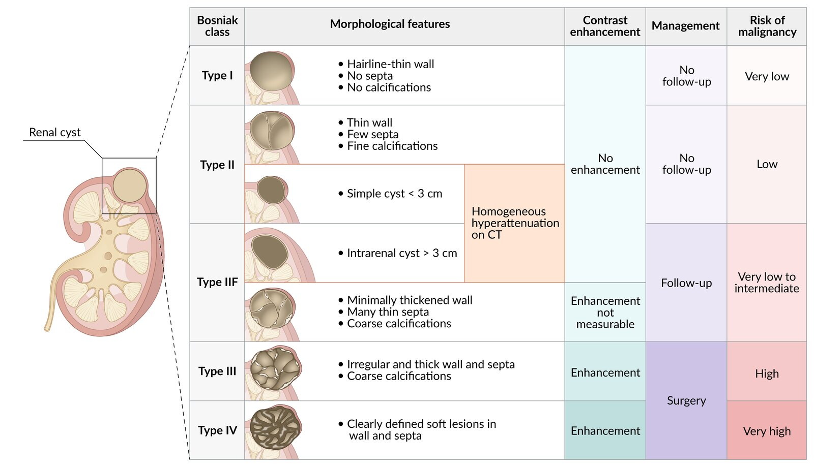

Bosniak classification of cystic renal masses

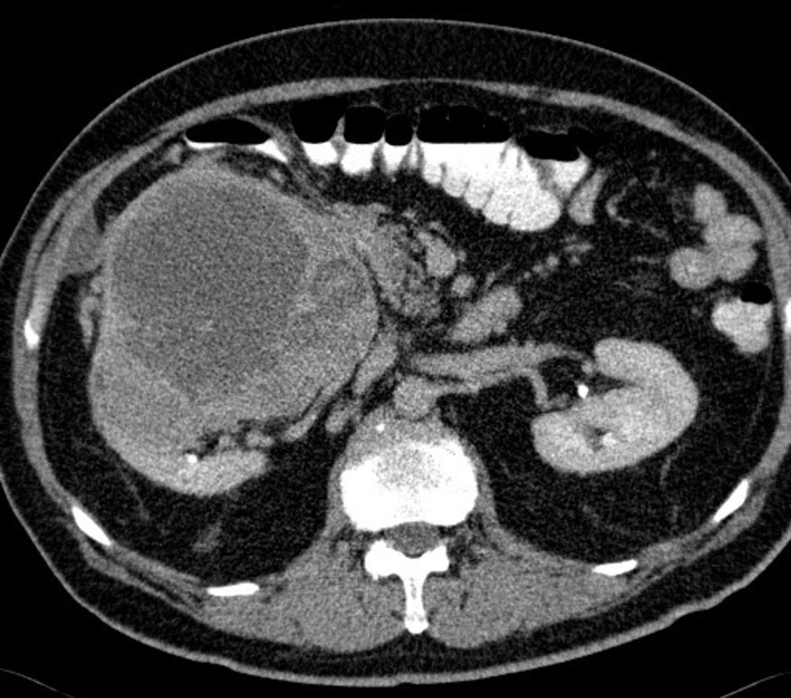

Renal cell carcinoma (2/3)

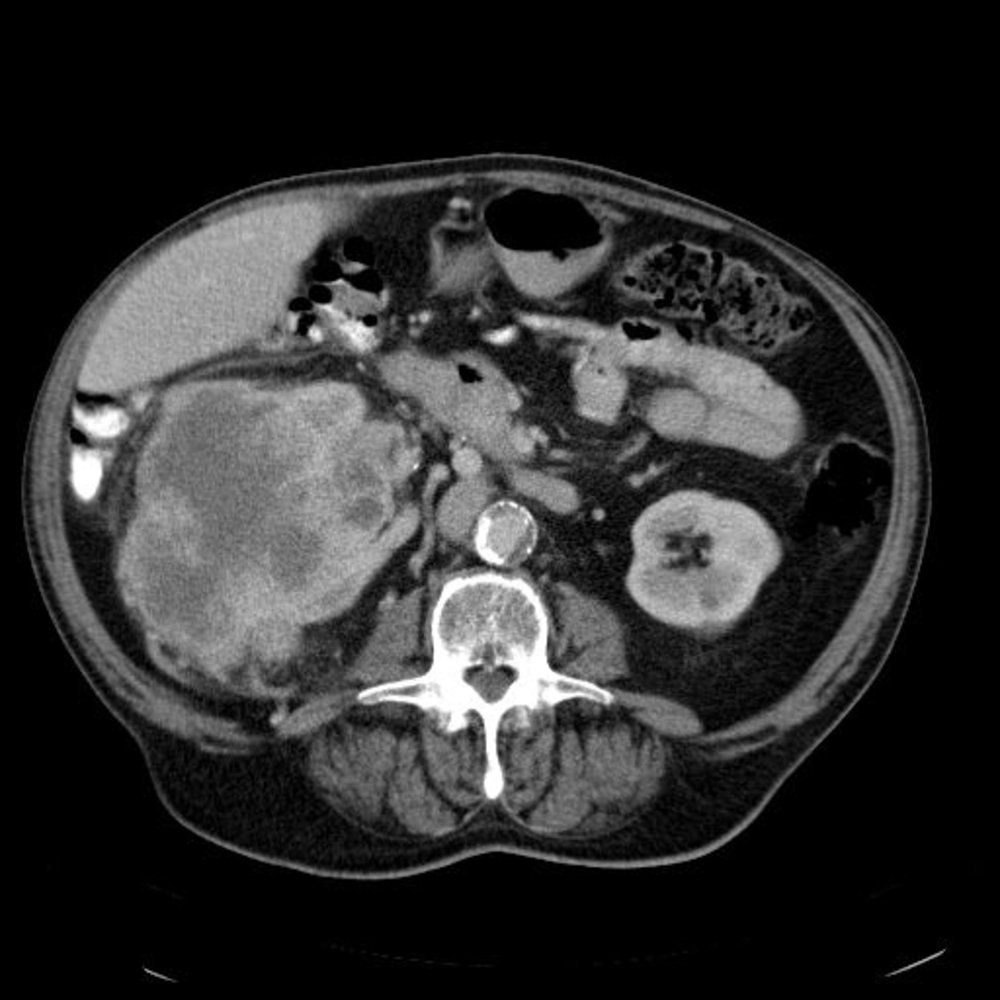

Renal cell carcinoma (1/3)

Renal cell carcinoma (3/3)

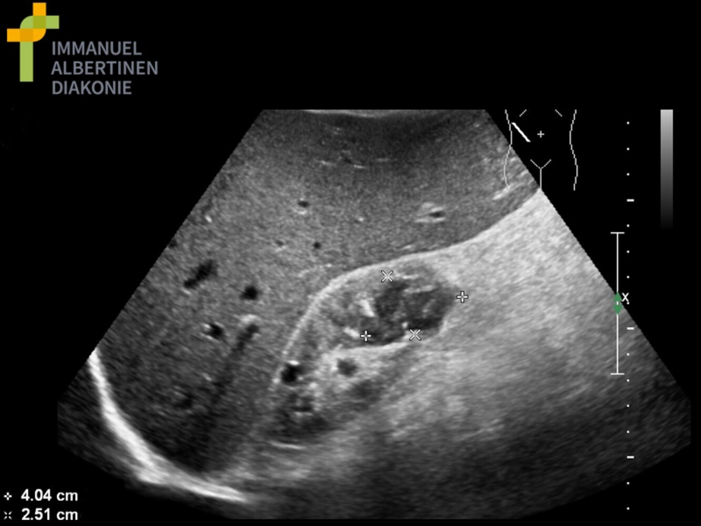

Renal mass

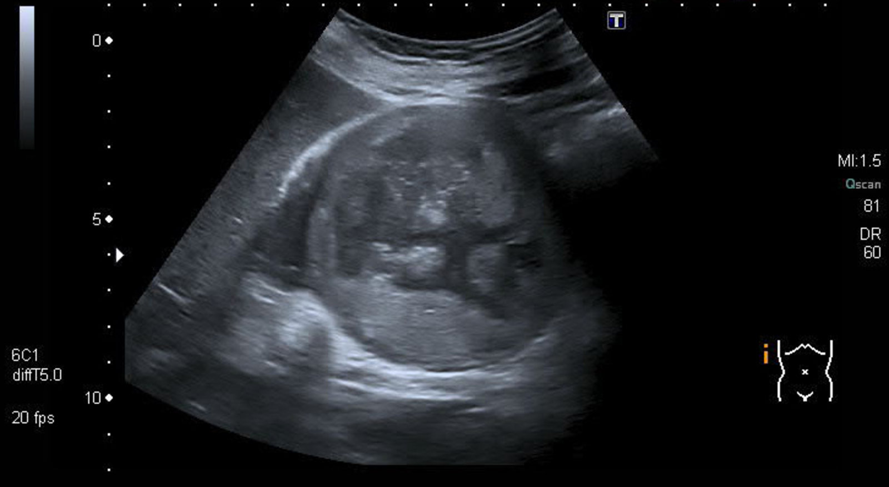

Complex renal mass

#### <u>Metastatic</u> evaluation

These may be considered in consultation with a urologist.

* CT or <u>MRI</u> chest (with IV contrast): indicated in patients with large tumors  [[15]](https://coursology-qbank.com/amboss/article/Eqc8Zd0)[[16]](https://coursology-qbank.com/amboss/article/ZHcZKd0)

* May reveal pulmonary <u>cannonball metastases</u> [[17]](https://coursology-qbank.com/amboss/article/eBcx-e0)

* Other common <u>metastatic</u> sites: bone, <u>lymph nodes</u>, <u>liver</u> [[18]](https://coursology-qbank.com/amboss/article/AqcRad0)

* <u>Bone scan</u>: may be indicated in patients with bone <u>pain</u> and/or ↑ <u>ALP</u> [[9]](https://coursology-qbank.com/amboss/article/iqcJyW0)

* CT or <u>MRI</u> head: indicated in patients with neurological signs or symptoms [[15]](https://coursology-qbank.com/amboss/article/Eqc8Zd0)

* Other modalities: <u>Metastases</u> may be an incidental finding on initial imaging, e.g., abdominal <u>ultrasound</u>.

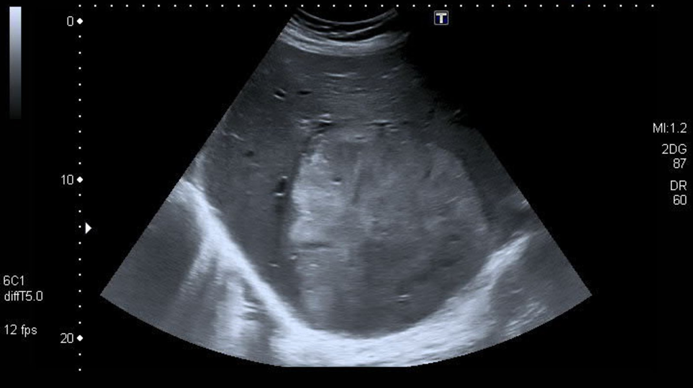

Liver metastasis in renal cell carcinoma

### <u>Laboratory studies</u> and <u>urinalysis</u>

* <u>Urinalysis</u>

* Can show frank and microscopic <u>hematuria</u> [[19]](https://coursology-qbank.com/amboss/article/yJcd9W0)

* Measure <u>albumin:creatinine ratio</u> if <u>proteinuria</u> is detected. [[6]](https://coursology-qbank.com/amboss/article/bBcHze0)

* <u>Laboratory studies</u> [[6]](https://coursology-qbank.com/amboss/article/bBcHze0)[[14]](https://coursology-qbank.com/amboss/article/AFcRkV0)[[19]](https://coursology-qbank.com/amboss/article/yJcd9W0)

* <u>CBC</u>

* Abnormal <u>hemoglobin</u> levels

* ↑ <u>WBC</u> and/or ↑ <u>platelets</u>  [[20]](https://coursology-qbank.com/amboss/article/HDcKfe0)[[21]](https://coursology-qbank.com/amboss/article/sDctfe0)[[22]](https://coursology-qbank.com/amboss/article/7xc4Be0)

* <u>CMP</u>

* <u>Hypercalcemia</u>

* ↑ <u>AST</u>, <u>ALT</u>, and/or <u>ALP</u>

* ↑ <u>BUN:creatinine ratio</u>

### Further investigations

* Renal mass <u>biopsy</u>: only required if it may alter the management or is requested by the patient.  [[6]](https://coursology-qbank.com/amboss/article/bBcHze0)[[23]](https://coursology-qbank.com/amboss/article/XBc9ze0)

* <u>Split renal function</u>  [[9]](https://coursology-qbank.com/amboss/article/iqcJyW0)

> [!TIP]
> Refer patients ≤ 46 years of age with <u>renal malignancy</u> and those with multifocal or bilateral renal masses or other findings suggestive of familial RCC for <u>genetic counseling</u>. [[6]](https://coursology-qbank.com/amboss/article/bBcHze0)

---

## Pathology

Renal cell <u>carcinomas</u> are <u>adenocarcinomas</u> that usually arise from the <u>epithelial</u> cells of the <u>proximal convoluted tubule</u>.

|  Overview of the most important types of renal cell <u>carcinoma</u> [[24]](https://coursology-qbank.com/amboss/article/p30Ljf)[[25]](https://coursology-qbank.com/amboss/article/xiXEFB)  |  |  |  |  |  |
| --- | --- | --- | --- | --- | --- |
|  | Clear cell renal cell carcinoma | Non-clear cell renal cell <u>carcinomas</u> |  |  |  |
| <u>Papillary</u> (chromophilic) RCC | Chromophobe RCC | Oncocytic RCC | <u>Collecting duct carcinoma</u> (Bellini duct carcinoma) |  |  |
| Relative frequency |  * ∼ 70%   |  * ∼ 10–15%   |  * ∼ 5%   |  * ∼ 1%   |  * ∼ 1%   |
| Cell of origin |  * <u>Proximal convoluted tubule</u>   |  |  * Intercalated cells of the cortical <u>collecting duct</u>   |  |  * Medullary <u>collecting duct</u>   |
| Etiology |  * Sporadic or inherited mutation of <u>VHL gene</u> on <u>chromosome</u> 3p   |   * <u>Trisomy</u> 7  * <u>Trisomy</u> 17  * Loss of Y <u>chromosome</u>    |  * <u>Hypodiploidy</u>   |  * Unknown   |  * Unknown   |
| Macroscopic appearance |  * Yellow or golden due to high intracellular lipid concentration   |  |  |  |  |
|  Microscopic appearance  |   * Clear cells   * Polygonal cells arranged as cords or tubules (non-<u>papillary</u> growth)  * Clear, <u>glycogen</u> and/or lipid-filled <u>cytoplasm</u>  * Unifocal, unilateral growth    |   * Cuboidal, low columnar cells  * Cells grow in <u>papillary</u> formations  * Bilateral, multifocal growth possible    |   * Large polygonal cells with a prominent <u>cell membrane</u>  * Eosinophilic <u>cytoplasm</u>  * Perinuclear halo    |   * Originate from oncocytomas  * Similar to chromophobic RCC, but without perinuclear halo  * Cells occur as <u>tumor</u> nests    |   * Hobnail pattern: irregularly arranged malignant glandular cells within a fibrous stroma  * Medullary duct <u>carcinoma</u>: A variant that is associated with <u>sickle cell disease</u>.    |
| Prognosis |  * Depending on <u>tumor stage</u>   |   * Type 1 <u>papillary</u> RCC: better than type 2 <u>papillary</u> RCC  * Type 2 <u>papillary</u> RCC: aggressive <u>tumor</u> with a poor prognosis    |  * Excellent prognosis   |  |  * Aggressive <u>tumor</u> with a poor prognosis   |

> [!NOTE]
> Rule of 3: A mutation in the <u>VHL</u> (von Hippel-Lindau) <u>gene</u> on <u>chromosome</u> 3 causes RCC (renal cell carcinoma).

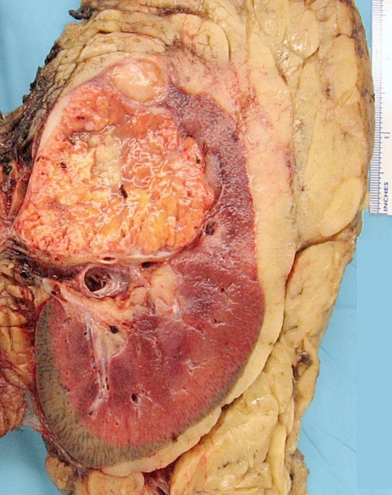

Renal cell carcinoma

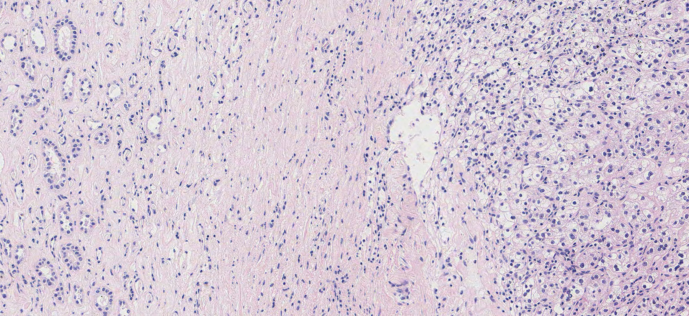

Clear cell renal cell carcinoma

Papillary renal cell carcinoma type 2

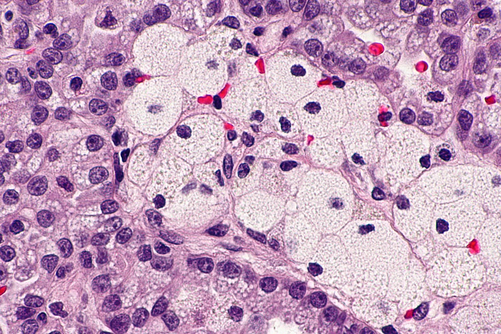

Papillary renal cell carcinoma type 2

---

## Differential diagnoses

### Malignant renal masses

* Renal cell <u>carcinoma</u>

* <u>Metastasis</u> from extrarenal tumors

* <u>Urothelial carcinoma</u> of the <u>renal pelvis</u> (∼ 8% of renal tumors)

* Other rare primary malignancies

* <u>Lymphomas</u>

* <u>Soft tissue sarcomas</u>

* <u>Neuroendocrine neoplasms</u>

> [!TIP]
> All renal masses > 1 cm in size are presumed to be renal cell <u>carcinoma</u> and treated as such.

### Benign renal masses

#### Angiomyolipoma [[26]](https://coursology-qbank.com/amboss/article/_iX58B)

* Definition: benign renal tumors that arise from perivascular <u>epithelioid cells</u> and consist of <u>blood vessels</u>, <u>smooth muscle</u>, and mature fat cells

* <u>Epidemiology</u>

* Most common benign renal <u>tumor</u>

* Sex: <u>♀</u> > <u>♂</u> (4:1)

* Etiology

* Sporadic

* Associated with the following syndromes:

* <u>Tuberous sclerosis</u> (<u>TSC</u>)

* Sporadic <u>lymphangioleiomyomatosis</u>

* Clinical features

* Mostly asymptomatic

* Large <u>angiomyolipomas</u> may present with the following symptoms:

* <u>Hematuria</u>

* <u>Retroperitoneal hemorrhage</u>

* Impaired renal function

* Symptoms of <u>tuberous sclerosis</u> may be present.

* Diagnostics 

* Abdominal <u>ultrasound</u>: round, well-circumscribed, highly echogenic (similar <u>echogenicity</u> to <u>renal pelvis</u>) renal <u>tumor</u> often located near the <u>renal capsule</u>

* Abdominal CT

* <u>Tumor</u> with macroscopic fat deposits

* No calcification

* Pathology 

* Classic <u>angiomyolipomas</u>: slow growing tumors

* Epithelioid <u>angiomyolipomas</u> 

* Greater number of <u>epithelioid cells</u>

* Acidophilic and granular <u>cytoplasm</u>

* Less fat than classic type

* Treatment: Surgical resection of the <u>tumor</u> is indicated for <u>angiomyolipomas</u> that measure > 4 cm in diameter.

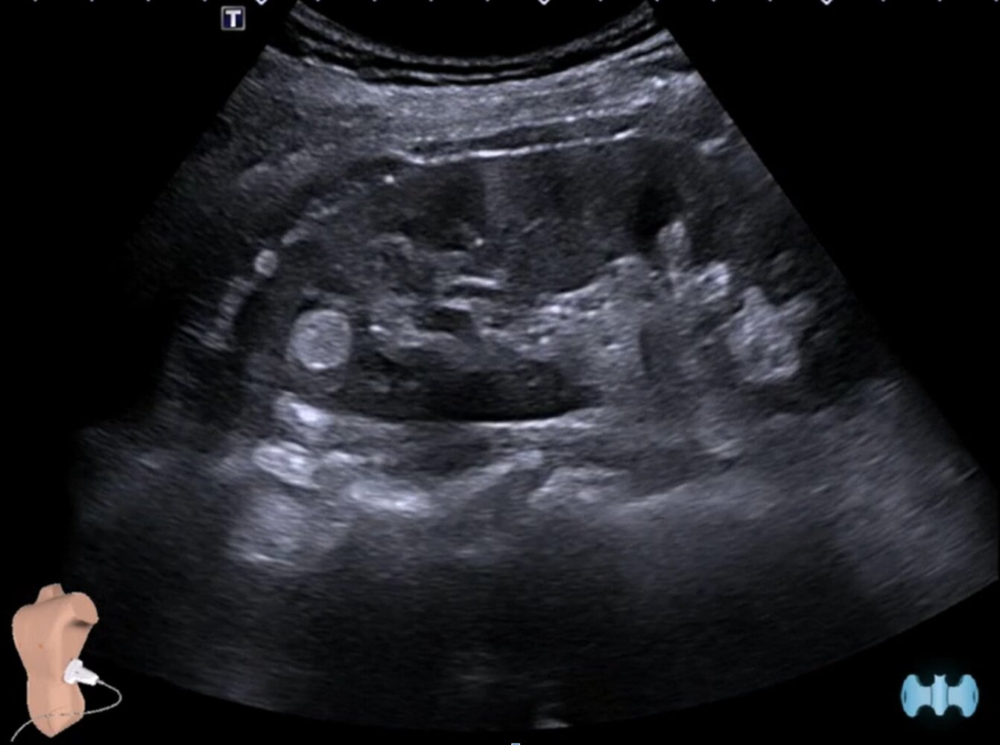

Renal angiomyolipoma

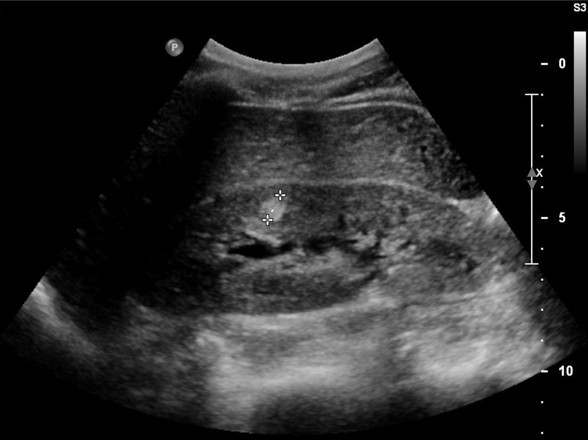

Angiomyolipoma

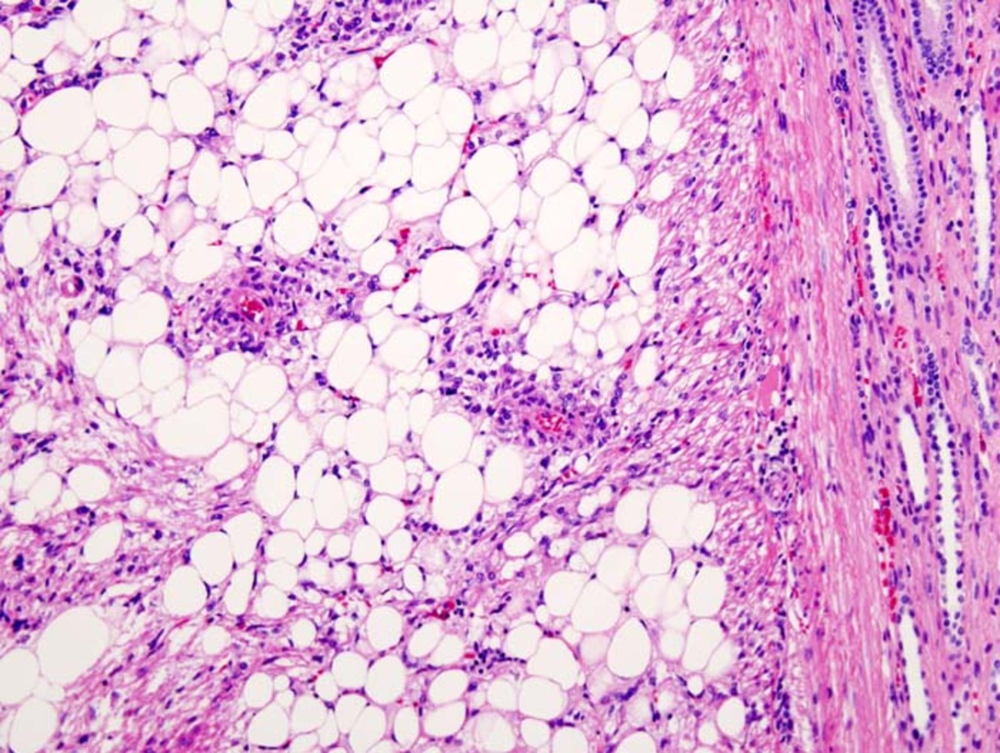

Angiomyolipoma

#### Oncocytoma

* Definition: benign <u>epithelial</u> <u>tumor</u> arising from the intercalated tubular cells in the <u>collecting duct</u>

* Clinical features 

* <u>Painless hematuria</u>

* Abdominal mass

* Flank <u>pain</u>

* Pathology

* Macroscopy: smooth, clearly defined <u>brown tumor</u> with central radial <u>scar</u>

* Microscopy

* Large acidophilic cells

* Excessive amount of <u>mitochondria</u> → acidophilic, granular <u>cytoplasm</u> without perinuclear clearing (unlike <u>chromophobe RCC</u>)

* Treatment

* Often resected in order to exclude RCC

* Surveillance

* <u>Nephrectomy</u> in case of increase in <u>tumor</u> size

* Prognosis: Oncocytomas are not invasive, but they may transform into a malignant <u>oncocytic RCC</u>.

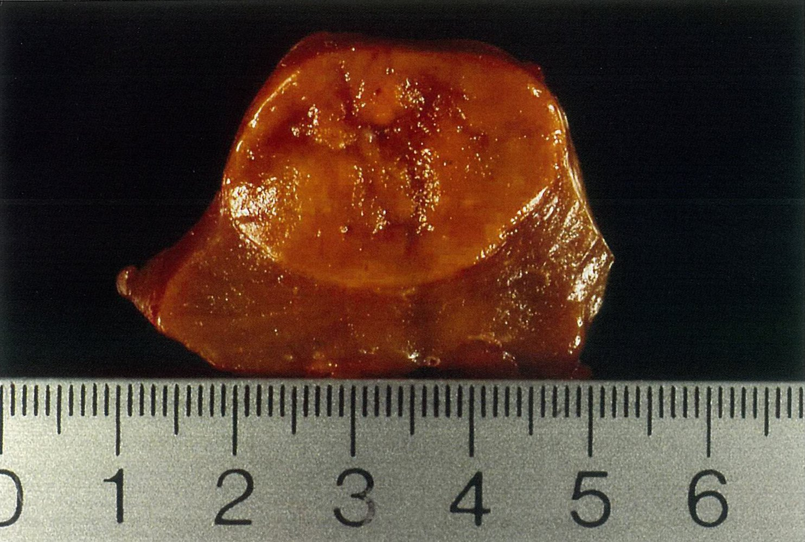

Oncocytoma

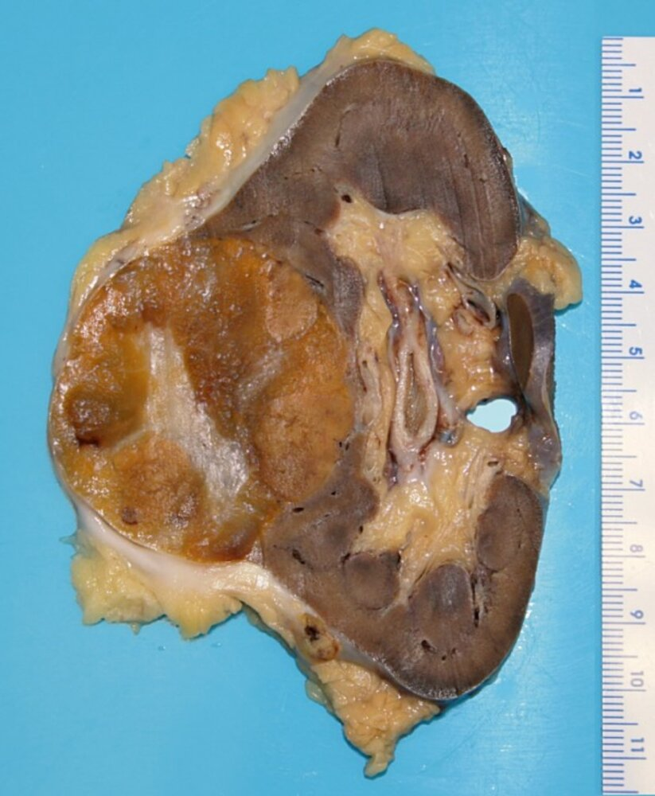

Renal oncocytoma

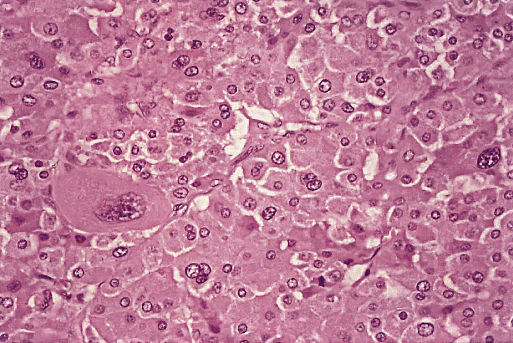

Renal oncocytoma

#### Others

* <u>Renal abscess</u>

* <u>Renal cysts</u> (e.g., <u>polycystic kidney disease</u>)

* Metanephric <u>adenoma</u>

* Granulomatous renal disease (e.g., renal <u>tuberculosis</u>, <u>xanthogranulomatous pyelonephritis</u>)

The differential diagnoses listed here are not exhaustive.

---

## Treatment

### Approach

* Local or locoregional disease: curative treatment intent ;  [[19]](https://coursology-qbank.com/amboss/article/yJcd9W0)[[27]](https://coursology-qbank.com/amboss/article/yqcdad0)

* <u>Standard of care</u>: <u>nephrectomy</u> (partial or radical) [[6]](https://coursology-qbank.com/amboss/article/bBcHze0)

* Consider <u>adrenalectomy</u>, <u>lymph node dissection</u>, and <u>adjuvant therapy</u> with <u>sunitinib</u>. [[6]](https://coursology-qbank.com/amboss/article/bBcHze0)

* <u>Metastatic</u> disease: mostly <u>palliative treatment</u> intent but may be curative for patients with a solitary <u>metastasis</u> or <u>oligometastatic disease</u> [[9]](https://coursology-qbank.com/amboss/article/iqcJyW0) [[19]](https://coursology-qbank.com/amboss/article/yJcd9W0)

* Targeted and/or immunotherapy

* In selected patients, <u>surgery</u> (i.e., cytoreductive <u>nephrectomy</u>, <u>metastasectomy</u>) or other local therapies (e.g., embolization) [[28]](https://coursology-qbank.com/amboss/article/-xcD_e0)

* Consider <u>active surveillance</u> for patients with: [[23]](https://coursology-qbank.com/amboss/article/XBc9ze0)

* Solid masses < 2 cm

* Complex masses that are predominantly cystic

* Limited <u>life expectancy</u>

* High surgical risk

### <u>Surgery</u> [[6]](https://coursology-qbank.com/amboss/article/bBcHze0)

The following applies to patients with solid renal masses or <u>renal cysts</u> with <u>Bosniak classification</u> III or IV. The approach may be open, robotic, or <u>laparoscopic</u>.

* Partial nephrectomy: Only the mass and some surrounding renal tissue are removed; the rest of the <u>kidney</u> is spared. [[6]](https://coursology-qbank.com/amboss/article/bBcHze0)

* Absolute indications: patients with a T1a renal mass , a solitary <u>kidney</u>, bilateral masses, familial RCC, preexisting <u>chronic kidney disease</u>, or <u>proteinuria</u> [[27]](https://coursology-qbank.com/amboss/article/yqcdad0)

* Relative indications: patients who are young and/or have a longer <u>life expectancy</u>, multifocal masses, or comorbidities that impact renal function

* Radical <u>nephrectomy</u>

* Removal of the entire <u>kidney</u> along with the <u>adrenal gland</u> and surrounding <u>perinephric fat</u>, with or without <u>lymph node dissection</u>

* Preferred in patients with increased oncological risk  [[6]](https://coursology-qbank.com/amboss/article/bBcHze0)

### Medical therapy [[19]](https://coursology-qbank.com/amboss/article/yJcd9W0)[[28]](https://coursology-qbank.com/amboss/article/-xcD_e0)

| Agents for the <u>treatment of renal cell carcinoma</u> |  |  |
| --- | --- | --- |
| Drug type |  | Examples |
|  <u>Targeted therapy</u> [[28]](https://coursology-qbank.com/amboss/article/-xcD_e0)[[29]](https://coursology-qbank.com/amboss/article/zxcr_e0)  | <u>VEGF</u> <u>receptor</u> <u>tyrosine kinase inhibitors</u> |   * Pazopanib  * <u>Sunitinib</u>  * <u>Sorafenib</u>  * <u>Cabozantinib</u>  * Tivozanib  * Axitinib  * <u>Lenvatinib</u>    |
| Anti-<u>VEGF</u> <u>antibodies</u> |  * <u>Bevacizumab</u>   |  |
| <u>mTOR inhibitors</u> |   * <u>Everolimus</u>  * Temsirolimus    |  |
| Immunotherapy |  <u>Anti-PD-1 antibodies</u>  |   * <u>Pembrolizumab</u>  * <u>Nivolumab</u>  * <u>Avelumab</u>    |
|  Anti-<u>CTLA-4</u> <u>antibodies</u>  |  * <u>Ipilimumab</u>   |  |
| <u>Cytokines</u> |   * <u>Interleukin-2</u> (<u>aldesleukin</u>)  * <u>Interferon alpha</u>    |  |

* Regimens vary (e.g., axitinib combined with <u>pembrolizumab</u>)  and are determined by risk level.  [[28]](https://coursology-qbank.com/amboss/article/-xcD_e0)[[30]](https://coursology-qbank.com/amboss/article/SIcyXd0)

### Other

* <u>Radiochemotherapy</u>

* <u>Radiation therapy</u> is not typically used because RCC is usually radioresistant.  [[28]](https://coursology-qbank.com/amboss/article/-xcD_e0)[[31]](https://coursology-qbank.com/amboss/article/c7bakE)

* Conventional <u>chemotherapy</u> is not used to treat RCC because RCC is highly resistant to most <u>chemotherapeutic agents</u>. [[19]](https://coursology-qbank.com/amboss/article/yJcd9W0)

* Local therapies [[6]](https://coursology-qbank.com/amboss/article/bBcHze0)[[27]](https://coursology-qbank.com/amboss/article/yqcdad0)

* <u>Thermal ablation</u> (e.g., <u>cryoablation</u>): may be appropriate for patients with tumors ≤ 3 cm and/or high surgical risk

* Embolization of the primary <u>tumor</u> and/or <u>metastases</u>: for symptom control in patients with nonresectable disease  [[9]](https://coursology-qbank.com/amboss/article/iqcJyW0)

> [!TIP]
> Many RCC tumors are also resistant to <u>chemotherapy</u> due to the expression of <u>multidrug resistance protein 1</u> (<u>MDR-1</u>) by <u>tumor</u> cells. [[9]](https://coursology-qbank.com/amboss/article/iqcJyW0)[[32]](https://coursology-qbank.com/amboss/article/JucsHV0)

---

## Complications

### Complications caused by <u>paraneoplastic syndromes</u>

* <u>Secondary hypercortisolism</u>: due to <u>ectopic</u> <u>ACTH</u> release

* <u>Secondary polycythemia</u>: due to <u>ectopic</u> <u>erythropoietin</u> (<u>EPO</u>) secretion

* <u>Hypertension</u>: due to the release of <u>renin</u>

* <u>Hypercalcemia</u>: due to the release of <u>PTHrP</u> (<u>parathyroid hormone-related protein</u>)

* <u>Leukemoid reaction</u>: due to <u>bone marrow</u> stimulation

* <u>Limbic encephalitis</u> [[33]](https://coursology-qbank.com/amboss/article/zaarMQ)

* <u>Memory</u> loss

* <u>Psychosis</u>

* <u>Depression</u>

> [!NOTE]
> Paraneoplastic RCC: Polycythemia (<u>EPO</u>), Renin (<u>hypertension</u>), hyperCalcemia (<u>PTHrP</u>) and hyperCortisolism (<u>ACTH</u>).

### Complications caused by local spread

* <u>Varicocele</u>

* Rare, classically associated with left-sided RCC

* Malignant cells grow inside the left <u>renal vein</u> and occlude the ostium of the <u>left gonadal vein</u>.

* <u>Budd-Chiari syndrome</u>: caused by involvement of the <u>IVC</u>

* Lower limb <u>edema</u>

* <u>Ascites</u>

* Hepatic dysfunction

### Complications caused by <u>metastatic</u> disease

* Overview

* Spread beyond the <u>renal capsule</u> affects the <u>lymph nodes</u> of the <u>renal hilum</u> and para-aortic nodes.

* Hematogenous spread occurs via <u>renal vein</u> and <u>IVC</u>.

* <u>Pulmonary metastases</u>: most common site of <u>metastases</u>

* <u>Hemoptysis</u>

* <u>Dyspnea</u>

* <u>Bone metastases</u>: second most common site of <u>metastases</u>

* Bone <u>pain</u>

* <u>Pathological fractures</u>

### <u>Reactive amyloidosis</u> [[34]](https://coursology-qbank.com/amboss/article/DiX1FB)

* <u>Epidemiology</u>: RCC accounts for 25 to 42% of all reported <u>AA amyloidosis</u> cases caused by solid organ malignancies.

* Clinical features

* <u>Nephrotic syndrome</u> [[35]](https://coursology-qbank.com/amboss/article/AaaRMQ)[[36]](https://coursology-qbank.com/amboss/article/_aa5MQ)

* <u>Primary adrenal insufficiency</u>

* <u>Hepatosplenomegaly</u>

* <u>Malabsorption</u>

We list the most important complications. The selection is not exhaustive.

---

## Prognosis

### Survival of <u>kidney cancer</u> patients

* Overall prognosis is determined by the anatomic extent of the disease (stage of cancer at diagnosis) and the <u>histopathology</u> of the <u>tumor</u>.

* <u>Targeted therapies</u> have significantly prolonged survival time.

* Early stage RCC with <u>tumor</u> growth limited to the <u>kidney</u> generally has a good prognosis.

|  5-year survival of <u>kidney cancer</u> patients [[37]](https://coursology-qbank.com/amboss/article/cQXaEB) |  |  |
| --- | --- | --- |
| SEER stage | Description | <u>5-year survival rate</u> |
| Localized |  * <u>Tumor</u> is confined to the <u>kidney</u>   |  * 93%   |
| Regional |  * <u>Tumor</u> has invaded nearby structures or <u>lymph nodes</u>   |  * 70%   |
| Distant |  * <u>Tumor</u> has formed distant <u>metastases</u> (e.g., in <u>lungs</u>, <u>brain</u>, bones)   |  * 12%   |
| All stages combined |  * Combination of all three SEER stages   |  * 75%   |

> [!TIP]
> Increased awareness and screening (e.g., <u>ultrasound</u>) of high-risk patients in recent years has led to earlier <u>tumor</u> detection and improved the prognosis of RCC.

### Motzer score [[38]](https://coursology-qbank.com/amboss/article/WQXPEB)

#### Overview

* Used to determine prognosis of patients with stage IV (distant) disease

* A point is assigned for each of the following criteria.

* Based on the resulting score, the prognosis of the <u>metastatic</u> RCC patient is estimated.

* High scores are associated with a poorer prognosis.

#### Instrument

| <u>Motzer score</u> |  |  |
| --- | --- | --- |
| Parameter |  | Description |
| <u>Karnofsky performance status</u> | < 80% |  < 80%: 1 point  |
|  > 80%: 0 points  |  |  |
| <u>Hemoglobin</u> level |  <u>♀</u> < 12 g/dL  |  < 12 g/dL: 1 point  |
|  > 12.0 g/dL: 0 points  |  |  |
|  <u>♂</u> < 13.5 g/dL  |  < 13.5 g/dL: 1 point  |  |
|  > 13.5 g/dL: 0 points  |  |  |
| ↑ <u>LDH</u> (> 1.5 times the upper normal limit) | > 420 U/L |  > 420 U/L: 1 point  |
|  < 420 U/L: 0 point  |  |  |
| ↑ Serum <u>calcium</u>  | > 10 mg/dL (> 2.5 mmol/L) |  > 10 mg/dL (> 2.5 mmol/L): 1 point  |
|  < 10 mg/dL (< 2.5 mmol/L): 0 points  |  |  |
| Time from diagnosis to systemic treatment | < 1 year |  < 1 year: 1 point  |
|  > 1 year: 0 points  |  |  |

#### Interpretation

| <u>Motzer score</u> interpretation |  |  |
| --- | --- | --- |
| Points | Risk | Median survival |
| 0 |  * Low   |  * 20 months   |
| 1–2 |  * Intermediate   |  * 10 months   |
| ≥ 3 |  * High   |  * 4 months   |

---