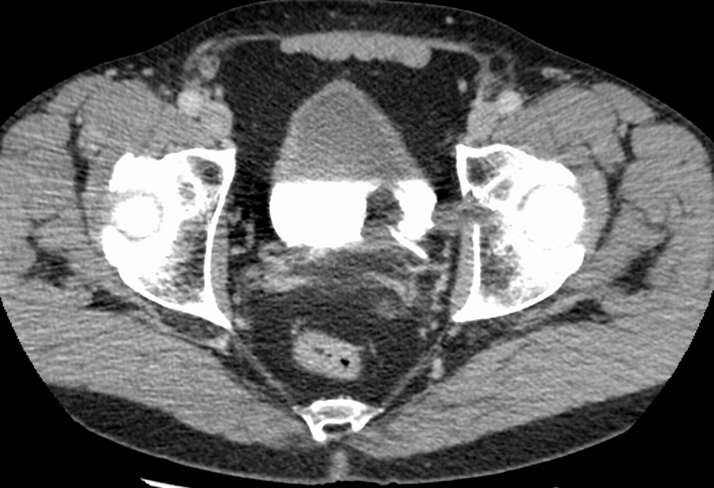
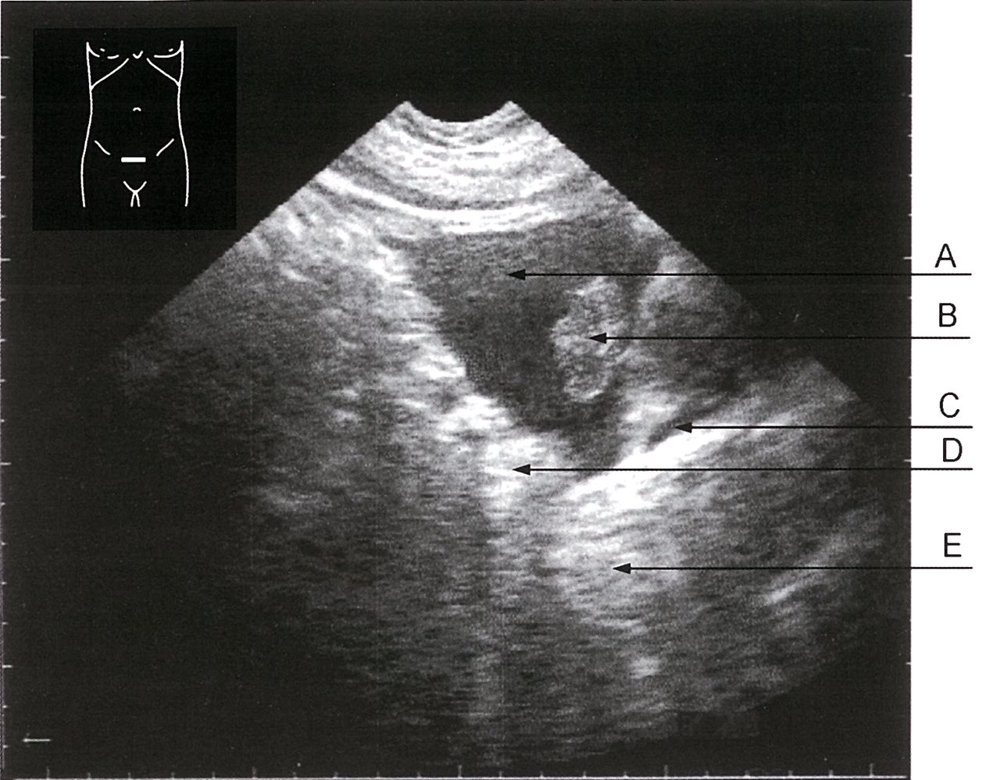
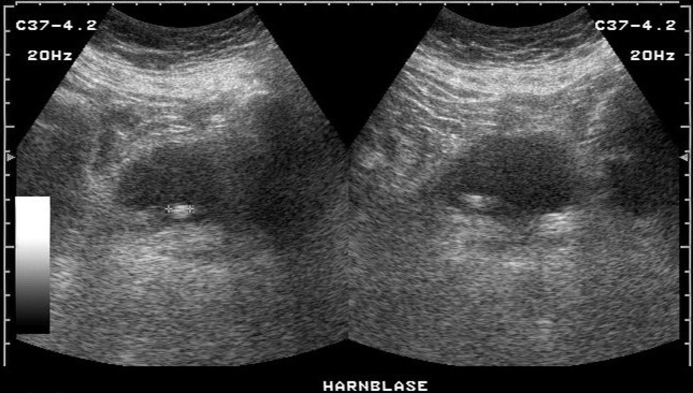
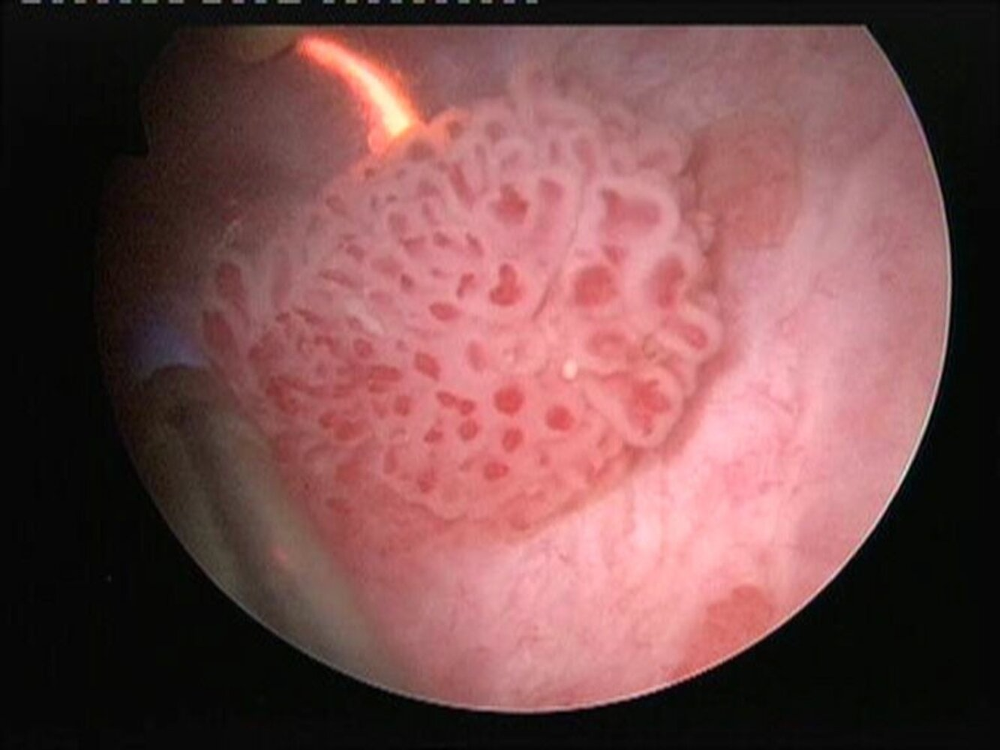
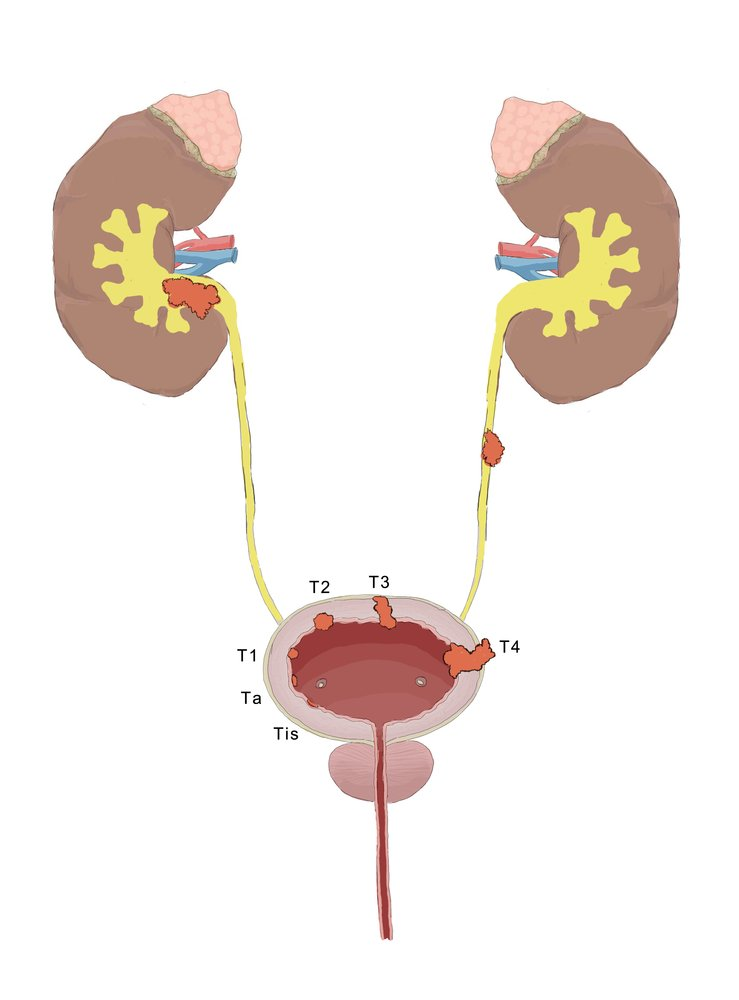
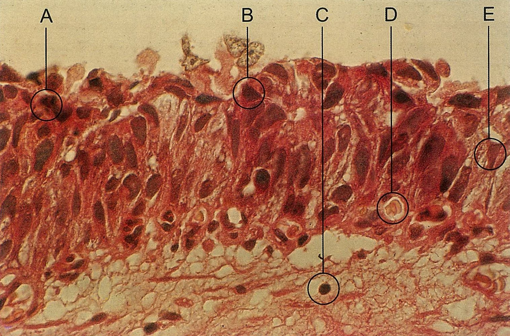
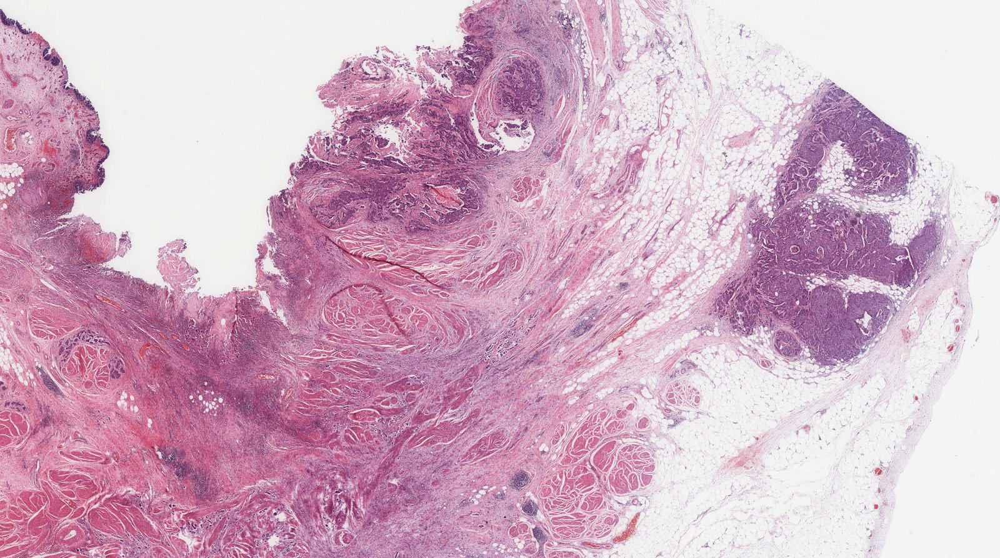
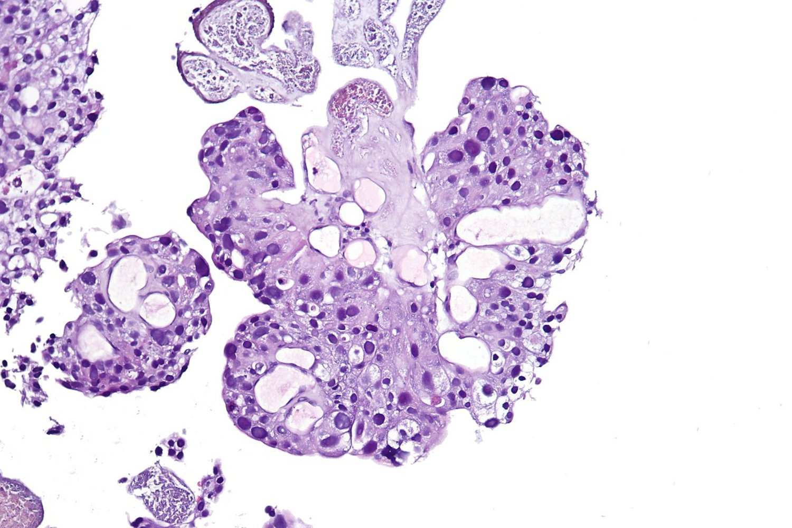
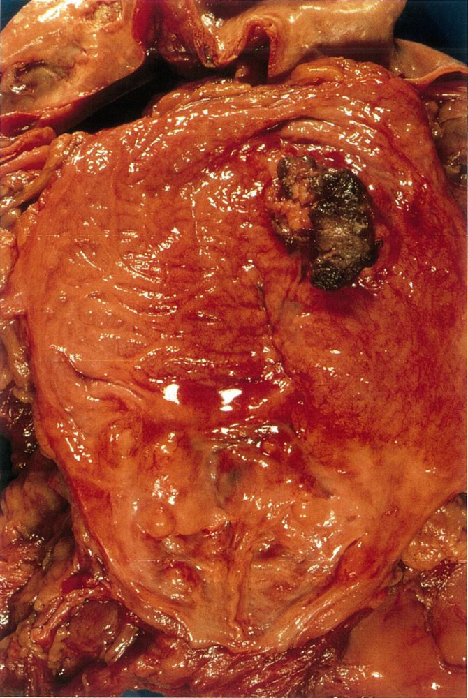
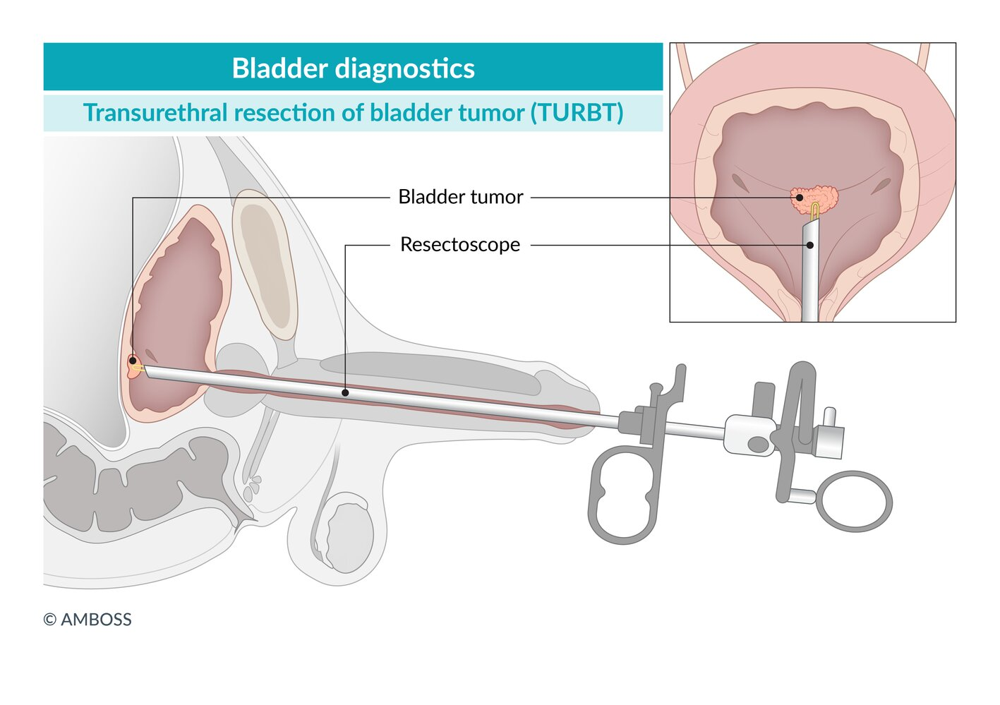

# Urinary tract cancer

*Categories: Clinical knowledge > Urology > Neoplastic disorders > Urinary tract cancer*

[Original Article Link](https://coursology-qbank.com/amboss/article/6i0jsf)

---

## Summary

<u>Urinary tract</u> cancer most commonly involves the <u>bladder</u>, although it may also occur in the <u>renal pelvis</u>, <u>ureters</u>, and, rarely, the <u>urethra</u>. The most common histological type of <u>urinary tract</u> cancer is <u>urothelial carcinoma</u>, followed by <u>squamous cell carcinoma</u> and <u>adenocarcinoma</u>. Symptomatic patients often present with painless <u>gross hematuria</u> and/or irritative voiding symptoms. <u>Urinary tract</u> cancer may also be diagnosed in patients with an incidental finding of <u>microhematuria</u>. All patients with unexplained <u>gross hematuria</u> should be evaluated for <u>urinary tract</u> <u>carcinoma</u>, while patients with <u>microhematuria</u> should undergo risk <u>stratification</u> to determine the need for further evaluation. Diagnostic evaluation includes <u>laboratory studies</u>, imaging, and direct visualization with collection of <u>biopsy</u> samples. Treatment selection is guided by <u>histology</u>, location, and <u>tumor grade</u> and stage. Upper <u>urinary tract</u> <u>carcinomas</u> (i.e., in the <u>renal pelvis</u> and/or <u>ureters</u>) and urethral <u>carcinomas</u> are rare, and there are no standardized treatment protocols. For <u>bladder cancer</u>, nonmuscle invasive disease is treated with <u>transurethral resection of the bladder tumor</u> (<u>TURBT</u>) and either intravesical <u>chemotherapy</u> or <u>bacillus Calmette-Guérin</u> (<u>BCG</u>). Muscle invasive <u>bladder cancer</u> is usually treated more aggressively with <u>neoadjuvant chemotherapy</u> followed by <u>radical cystectomy</u>. <u>Metastatic</u> <u>bladder cancer</u> is managed with <u>palliative chemotherapy</u>. Disease recurrence is common; therefore, close follow-up surveillance is required.

<u>Renal cancer</u> is covered separately in “<u>Renal cell carcinoma</u>.”

---

## Epidemiology

* Sex: : <u>♂</u> > <u>♀</u> [[1]](https://coursology-qbank.com/amboss/article/WF1PSi0)

* Race

* <u>Transitional cell carcinoma</u>: White individuals > African American (2:1) [[2]](https://coursology-qbank.com/amboss/article/1F12Si0)

* <u>Squamous cell carcinoma</u>: most common in African Americans [[3]](https://coursology-qbank.com/amboss/article/_nX5DA)

* Peak <u>incidence</u>: 60–70 years [[3]](https://coursology-qbank.com/amboss/article/_nX5DA)[[4]](https://coursology-qbank.com/amboss/article/znXrDA)

* Cancer sites

* <u>Bladder</u> (90%)

* <u>Renal pelvis</u> and renal calyces (8%)

* <u>Ureter</u>  and <u>urethra</u> (2%)

* Histological types

* Transitional cell (<u>urothelial</u>) <u>carcinoma</u>: most common (∼ 95%) type of cancer of the <u>bladder</u>, <u>ureter</u>, <u>renal pelvis</u>, and <u>proximal</u> <u>urethra</u> in male individuals

* <u>Squamous cell carcinoma</u>: most common (∼ 60%) type of cancer of the <u>distal</u> <u>urethra</u> in male individuals and the entire <u>urethra</u> in female individuals

* <u>Adenocarcinoma</u>: the rarest type of <u>urinary tract</u> cancer (< 5%) [[5]](https://coursology-qbank.com/amboss/article/7LX4_A)[[6]](https://coursology-qbank.com/amboss/article/HLXK_A)

Urinary bladder (male)

Urinary bladder (female)

References:[[7]](https://coursology-qbank.com/amboss/article/-aaDMQ)

Epidemiological data refers to the US, unless otherwise specified.

---

## Risk factors

### Transitional cell <u>urothelial carcinoma</u> [[4]](https://coursology-qbank.com/amboss/article/znXrDA)[[8]](https://coursology-qbank.com/amboss/article/rG1f0i0)[[9]](https://coursology-qbank.com/amboss/article/bYaHnQ)[[10]](https://coursology-qbank.com/amboss/article/XYa9nQ)

* <u>Carcinogens</u>

* Tobacco (esp. due to <u>2-naphthylamine</u> in <u>cigarette smoke</u>)

* <u>Aromatic amines</u> (e.g., <u>benzidine</u>, <u>aniline dye</u>, <u>azo dye</u>, arylamines)

* Medications

* <u>Cyclophosphamide</u>

* <u>Phenacetin</u>

* High-dose, long-term <u>pioglitazone</u> treatment [[11]](https://coursology-qbank.com/amboss/article/IG1Y0i0)

* Heavy metals (e.g., <u>chlorine</u> and <u>arsenic</u> content in drinking water) [[12]](https://coursology-qbank.com/amboss/article/ag1QFT0)

* <u>Polycyclic aromatic hydrocarbons</u>

* Medical procedures

* <u>Pelvic</u> <u>irradiation</u>

* <u>Augmentation cystoplasty</u> [[13]](https://coursology-qbank.com/amboss/article/Yg1nFT0)

* <u>Kidney transplantation</u> [[14]](https://coursology-qbank.com/amboss/article/-T1DtT0)

* Genetic predisposition: personal and <u>family history</u> of <u>urothelial carcinoma</u> (e.g., <u>hereditary nonpolyposis colorectal cancer</u>)

### <u>Squamous cell carcinoma</u> [[3]](https://coursology-qbank.com/amboss/article/_nX5DA)[[9]](https://coursology-qbank.com/amboss/article/bYaHnQ)[[10]](https://coursology-qbank.com/amboss/article/XYa9nQ)

* <u>Carcinogens</u>

* Tobacco

* Medications: <u>cyclophosphamide</u>

* Medical procedures

* <u>Pelvic</u> <u>irradiation</u>

* Previous intravesical <u>bacillus Calmette-Guerin</u> treatment

* Chronic indwelling <u>bladder</u> catheters [[15]](https://coursology-qbank.com/amboss/article/Zg1ZFT0)

* Infection: <u>chronic inflammation</u> of the <u>urinary tract</u> that can lead to the transformation of <u>urothelial</u> cells into squamous <u>epithelial</u> cells (squamous <u>metaplasia</u>)

* <u>Schistosomiasis</u> (<u>endemic</u> throughout the Middle East and Africa, mainly in rural areas with poor sanitation near freshwater bodies)

* Chronic and/or <u>recurrent UTIs</u>

* Chronic <u>nephrolithiasis</u> and <u>bladder calculi</u>

* Gonococcal <u>urethritis</u>

### <u>Adenocarcinoma</u>

* <u>Medical history</u>

* <u>Urachus</u> remnant  [[16]](https://coursology-qbank.com/amboss/article/kpXmp_)

* <u>Cystitis</u> cystica

* <u>Bladder exstrophy</u> [[17]](https://coursology-qbank.com/amboss/article/Xg19FT0)

> [!NOTE]
> A <u>carcinogen</u> ACTS on the <u>bladder</u>: Aniline dye, Cyclophosphamide, Tobacco, Schistosomiasis

---

## Clinical features

| Clinical features of urinary tract cancer |  |  |
| --- | --- | --- |
| Location | Symptoms | Features of advanced/<u>metastatic</u> disease |
| Bladder carcinoma |   * Painless <u>gross hematuria</u> throughout <u>micturition</u> (most common)  * Irritative voiding symptoms (<u>dysuria</u>, <u>urinary frequency</u>, urgency)  * <u>Bladder outlet obstruction</u> (rare)  * Suprapubic/rectal/perineal <u>pain</u>  * Palpable suprapubic mass (advanced cases)    |   * Features of <u>uremia</u>  * <u>Constitutional symptoms</u>: <u>anorexia</u>, weight loss, fatigue  * <u>Metastatic</u> symptoms  * <u>Enlarged lymph nodes</u>  * <u>Liver</u>: <u>right upper quadrant</u> <u>pain</u>, <u>hepatomegaly</u>, <u>jaundice</u>, <u>ascites</u>  * <u>Lungs</u>: <u>dyspnea</u>, <u>cough</u>, <u>chest pain</u>, <u>pleural effusion</u>  * Bone: <u>pain</u> in <u>long bones</u>/<u>vertebrae</u>, <u>pathological fractures</u>    |
| Carcinoma of the renal pelvis and ureteral carcinoma |   * Painless <u>gross hematuria</u> throughout <u>micturition</u>  * Flank <u>pain</u>    |  |
| Urethral carcinoma |   * Painless <u>gross hematuria</u> at the beginning of <u>micturition</u>  * <u>Bladder outlet obstruction</u>  * Irritative voiding symptoms (common, esp. in women)  * Palpable inguinal <u>lymphadenopathy</u>  * Urethral discharge  * A mass may be palpable along the <u>urethra</u> (<u>bimanual examination</u> in women).    |  |

> [!TIP]
> <u>Gross hematuria</u> is more commonly associated with cancer than <u>microhematuria</u> is. [[18]](https://coursology-qbank.com/amboss/article/ZLXZwA)[[19]](https://coursology-qbank.com/amboss/article/OJ1I830)

References:[[20]](https://coursology-qbank.com/amboss/article/VH0G6h)[[21]](https://coursology-qbank.com/amboss/article/iH0JJh)[[22]](https://coursology-qbank.com/amboss/article/271TOR0)

---

## Diagnosis

### General principles [[18]](https://coursology-qbank.com/amboss/article/ZLXZwA)[[23]](https://coursology-qbank.com/amboss/article/h5ccP10)[[24]](https://coursology-qbank.com/amboss/article/Z5cZi10)

* Follow a risk-based <u>approach to hematuria</u>.

* Confirm the diagnosis with imaging and direct visualization of the <u>urinary tract</u>.

* <u>Staging studies for urinary tract cancer</u> should be guided by a uro-oncologist.

> [!TIP]
> Evaluate the entire <u>urinary tract</u> if <u>malignancy</u> is suspected. Use imaging to assess the <u>renal pelvis</u> and <u>ureters</u> and perform <u>cystoscopy</u> to assess the <u>bladder</u> and <u>urethra</u>.

### Initial <u>laboratory studies</u>

#### Urine studies

* <u>Urinalysis with microscopy</u>: Obtain for all patients to confirm <u>hematuria</u>.

* <u>Urine dipstick</u>: high <u>sensitivity</u> but low <u>specificity</u> for <u>hematuria</u>  [[18]](https://coursology-qbank.com/amboss/article/ZLXZwA)

> [!WARNING]
> Assessment of urine <u>tumor markers</u> is not recommended, as their diagnostic value is uncertain. [[18]](https://coursology-qbank.com/amboss/article/ZLXZwA)[[24]](https://coursology-qbank.com/amboss/article/Z5cZi10)

#### Blood tests [[18]](https://coursology-qbank.com/amboss/article/ZLXZwA)

* <u>Renal function tests</u>

* Suspected <u>metastatic</u> disease: <u>CBC</u> and <u>CMP</u>

### Imaging [[19]](https://coursology-qbank.com/amboss/article/OJ1I830)[[23]](https://coursology-qbank.com/amboss/article/h5ccP10)[[24]](https://coursology-qbank.com/amboss/article/Z5cZi10)

* Modalities

* Preferred: <u>CT urography</u>  [[18]](https://coursology-qbank.com/amboss/article/ZLXZwA)[[25]](https://coursology-qbank.com/amboss/article/oMc0p10)

* Alternative

* <u>MR urography</u>  [[25]](https://coursology-qbank.com/amboss/article/oMc0p10)[[26]](https://coursology-qbank.com/amboss/article/LMcw610)

* <u>Renal bladder ultrasound</u>  [[24]](https://coursology-qbank.com/amboss/article/Z5cZi10)

* Findings

* Filling defects

* <u>Hydronephrosis</u> (suggestive of intraluminal <u>tumor</u> obstruction)

* Mural thickening

* Visualization of masses

* Evidence of disease spread (e.g., <u>lymphadenopathy</u>)

> [!TIP]
> Perform <u>urinary tract</u> imaging prior to direct visualization as inflammation from instrumentation/<u>biopsy</u> can make radiological interpretation challenging. [[18]](https://coursology-qbank.com/amboss/article/ZLXZwA)

Bladder mass

Ultrasound of the bladder in urothelial carcinoma

Urinary bladder mass

### Direct visualization (<u>cystoscopy</u>/<u>ureteroscopy</u>) [[23]](https://coursology-qbank.com/amboss/article/h5ccP10)[[24]](https://coursology-qbank.com/amboss/article/Z5cZi10)[[27]](https://coursology-qbank.com/amboss/article/1Mc2n10)

<u>TURBT</u> may be performed during <u>cystoscopy</u> if lesions are detected.

* Indications [[23]](https://coursology-qbank.com/amboss/article/h5ccP10)[[24]](https://coursology-qbank.com/amboss/article/Z5cZi10)[[27]](https://coursology-qbank.com/amboss/article/1Mc2n10)

* <u>Cystoscopy</u> 

* <u>Gross hematuria</u>

* Unexplained urinary symptoms

* Known upper <u>urinary tract</u> cancer: to evaluate for concurrent lesions

* <u>Microhematuria</u>, depending on <u>risk stratification for microhematuria</u>

* <u>Ureteroscopy</u>

* Upper <u>urinary tract</u> lesion identified on imaging

* Normal results on <u>cystoscopy</u> but high suspicion for <u>malignancy</u>

* Characteristic findings [[20]](https://coursology-qbank.com/amboss/article/VH0G6h)[[28]](https://coursology-qbank.com/amboss/article/bX1H920)[[29]](https://coursology-qbank.com/amboss/article/mr1V3R0)

* Single or multiple lesions  [[28]](https://coursology-qbank.com/amboss/article/bX1H920)

* Appearance may be a:

* <u>Papillary</u>, <u>sessile</u>, or nodular mass   [[29]](https://coursology-qbank.com/amboss/article/mr1V3R0)[[30]](https://coursology-qbank.com/amboss/article/Nr1-hR0)

* Flat <u>erythematous</u> area (<u>carcinoma in situ</u>)  [[29]](https://coursology-qbank.com/amboss/article/mr1V3R0)

* Areas of <u>necrosis</u> may be visible.  [[29]](https://coursology-qbank.com/amboss/article/mr1V3R0)

> [!TIP]
> Direct visualization is the <u>gold standard</u> for diagnosing <u>urinary tract</u> cancer. [[24]](https://coursology-qbank.com/amboss/article/Z5cZi10)[[31]](https://coursology-qbank.com/amboss/article/FY1gI20)

> [!TIP]
> During <u>cystoscopy</u>, <u>TURBT</u> can allow for simultaneous diagnosis and treatment.

Urothelial carcinoma of the bladder

### Pathology studies

#### <u>Biopsy</u> [[24]](https://coursology-qbank.com/amboss/article/Z5cZi10)[[31]](https://coursology-qbank.com/amboss/article/FY1gI20)

* Not routinely required: <u>Histology</u> is usually performed on tissue removed during <u>TURBT</u>.

* Image-guided or endoscopic <u>biopsy</u> may be used as an alternative.

* For findings, see “<u>Pathology of urinary tract cancers</u>.”

#### <u>Urine cytology</u> [[24]](https://coursology-qbank.com/amboss/article/Z5cZi10)

* Indication: an adjunct study for patients with <u>gross hematuria</u>  [[18]](https://coursology-qbank.com/amboss/article/ZLXZwA)[[23]](https://coursology-qbank.com/amboss/article/h5ccP10)[[24]](https://coursology-qbank.com/amboss/article/Z5cZi10)

* Findings: can detect sloughed malignant cells, especially from high-grade <u>urothelial</u> tumors [[23]](https://coursology-qbank.com/amboss/article/h5ccP10)

### Staging studies for urinary tract cancer [[32]](https://coursology-qbank.com/amboss/article/u5cpN10)[[33]](https://coursology-qbank.com/amboss/article/ob10u20)[[34]](https://coursology-qbank.com/amboss/article/or10RR0)

* First line

* <u>Chest x-ray</u> and/or CT chest with IV contrast

* CT abdomen/<u>pelvis</u> with and without IV contrast (if not already performed)

* Consider additional studies.

* <u>Bone scan</u>  [[34]](https://coursology-qbank.com/amboss/article/or10RR0)

* <u>FDG-PET/CT scan</u>  [[34]](https://coursology-qbank.com/amboss/article/or10RR0)

> [!TIP]
> Examination under anesthesia may be used to determine locoregional extension. [[32]](https://coursology-qbank.com/amboss/article/u5cpN10)

---

## Pathology

* <u>Papillary urothelial carcinoma</u>

* A thick <u>papilla</u> with a fibrovascular core

* <u>CIS</u>: focal or diffuse <u>erythematous</u>, flat, velvety lesion(s) in the <u>bladder</u> <u>mucosa</u>  [[29]](https://coursology-qbank.com/amboss/article/mr1V3R0)

* Low-grade tumors: usually <u>pedunculated</u> with a <u>papillary</u> surface; and noninvasive [[29]](https://coursology-qbank.com/amboss/article/mr1V3R0)[[30]](https://coursology-qbank.com/amboss/article/Nr1-hR0)

* High-grade tumors: usually <u>sessile</u> and nodular/solid; and invasive (invading <u>lamina propria</u> or deeper tissues) [[29]](https://coursology-qbank.com/amboss/article/mr1V3R0)[[30]](https://coursology-qbank.com/amboss/article/Nr1-hR0)

* <u>Squamous cell carcinoma</u>

* Chronic inflammatory stimuli (e.g., <u>schistosomiasis</u>, chronic <u>cystitis</u>) can lead to transformation of <u>urothelial</u> cells into squamous <u>epithelial</u> cells (squamous <u>metaplasia</u>)

* Squamous <u>epithelial</u> cells that are constantly exposed to urine are <u>prone</u> to <u>dysplasia</u> and <u>squamous cell carcinoma</u>

Urinary tract tumors

Papillary urothelial carcinoma

Urothelial carcinoma of the bladder (transitional cell carcinoma)

Papillary urothelial carcinoma

Urothelial cancer

---

## Differential diagnoses

Other <u>causes of hematuria</u> and flank <u>pain</u>

* <u>Urolithiasis</u>

* Infections: <u>cystitis</u>, <u>urethritis</u>

* <u>Renal cell carcinoma</u>

* <u>Glomerular disease</u>, nephropathies

* Systemic disease (e.g., <u>SLE</u>, <u>GPA</u>, <u>IgA vasculitis</u>)

* <u>Coagulopathy</u>

* Trauma (see “Traumatic injuries of the <u>kidney</u> and <u>bladder</u>”)

* Physical strain, <u>rhabdomyolysis</u>

References:[[35]](https://coursology-qbank.com/amboss/article/2H0Tph)[[36]](https://coursology-qbank.com/amboss/article/0YaenQ)

The differential diagnoses listed here are not exhaustive.

---

## Treatment

This article primarily discusses treatment options for <u>urothelial carcinoma</u>, as <u>squamous cell carcinoma</u> and <u>adenocarcinoma</u> of the <u>urinary tract</u> are less common and protocols are less established.

### General principles

* Treatment usually consists of surgical resection along with <u>neoadjuvant chemotherapy</u> and/or <u>radiation therapy</u>.

* <u>Metastatic</u> disease is managed with palliative systemic <u>chemotherapy</u>, and, in some cases, palliative <u>surgery</u> (e.g., removal of urethral obstructions).

### Treatment of bladder cancer

<u>Bladder cancer</u> is the most common <u>urothelial cancer</u>; treatment differs based on the presence of muscular invasion and/or <u>metastases</u>.

#### Nonmuscle invasive [[37]](https://coursology-qbank.com/amboss/article/w5chm10)

* First line: transurethral resection of bladder tumor (<u>TURBT</u>)

* Indicated in all patients with visible <u>bladder</u> tumors on <u>cystoscopy</u>

* Visible tumors are resected  using an electrocautery resectoscope.

* May be repeated after 4–6 weeks for high-grade or incompletely resected lesions

* Additional treatments include:

* Intravesical <u>adjuvant chemotherapy</u> (e.g., <u>mitomycin</u> C or epirubicin)  [[37]](https://coursology-qbank.com/amboss/article/w5chm10)

* Immunotherapy with intravesical <u>bacillus Calmette-Guérin</u> (<u>BCG</u>)  [[37]](https://coursology-qbank.com/amboss/article/w5chm10)[[38]](https://coursology-qbank.com/amboss/article/NH0-qh)

* <u>Radical cystectomy</u>: for refractory lesions, lymphovascular invasion, selected variants  [[37]](https://coursology-qbank.com/amboss/article/w5chm10)

TURBT

#### Nonmetastatic muscle invasive  [[32]](https://coursology-qbank.com/amboss/article/u5cpN10)

* First-line treatment

* <u>Neoadjuvant chemotherapy</u> (<u>cisplatin</u>-based combination regimens)

* AND radical cystectomy with bilateral <u>pelvic</u> <u>lymph node dissection</u> and urinary diversion  [[32]](https://coursology-qbank.com/amboss/article/u5cpN10)

* For patients who are ineligible for <u>radical cystectomy</u> or prefer to retain their <u>bladder</u>, <u>bladder</u>-preserving treatment involves a combination of:

* Maximal <u>debulking</u> <u>TURBT</u>  [[39]](https://coursology-qbank.com/amboss/article/D5c1m10)

* <u>Chemotherapy</u>

* <u>Radiation therapy</u> [[32]](https://coursology-qbank.com/amboss/article/u5cpN10)

#### <u>Metastatic</u> disease [[40]](https://coursology-qbank.com/amboss/article/rr1fiR0)

* First line: palliative <u>cisplatin</u>-based systemic <u>chemotherapy</u> [[40]](https://coursology-qbank.com/amboss/article/rr1fiR0)

* Palliative immunotherapy, <u>radiation therapy</u>, and/or <u>surgery</u> may also be used. [[23]](https://coursology-qbank.com/amboss/article/h5ccP10)

### Treatment of carcinoma of the renal pelvis and ureters [[27]](https://coursology-qbank.com/amboss/article/1Mc2n10)

* Upper <u>urinary tract</u> cancer is rare and there are no standardized treatment protocols.

* Surgical treatments include:

* <u>Radical nephroureterectomy</u> with or without regional <u>lymphadenectomy</u>: <u>gold standard</u> for high-grade tumors  [[27]](https://coursology-qbank.com/amboss/article/1Mc2n10)

* <u>Kidney</u>-sparing alternatives

* Consider for some low-grade cancers or if <u>radical nephroureterectomy</u> is contraindicated.

* Options include endoscopic resection or <u>ablation</u>, segmental ureteral resection, and <u>distal</u> ureterectomy.

* Medical treatments include: 

* <u>Neoadjuvant</u> and/or adjuvant systemic <u>chemotherapy</u>

* Others: adjuvant topical <u>chemotherapy</u> or immunotherapy

### Treatment of urethral carcinoma [[5]](https://coursology-qbank.com/amboss/article/7LX4_A)[[41]](https://coursology-qbank.com/amboss/article/UMcbL10)[[42]](https://coursology-qbank.com/amboss/article/VMcGn10)

* <u>Urethral cancer</u> is rare and there are no standardized treatment protocols.

* Treatment is overseen by a specialist using a combination of the following:

* Surgical resection or <u>ablation</u>

* <u>Radiation therapy</u> (e.g., <u>external beam radiotherapy</u>, <u>brachytherapy</u>)

* Systemic <u>chemotherapy</u>

### Monitoring [[27]](https://coursology-qbank.com/amboss/article/1Mc2n10)[[32]](https://coursology-qbank.com/amboss/article/u5cpN10)[[37]](https://coursology-qbank.com/amboss/article/w5chm10)

* <u>Urothelial carcinoma</u> commonly recurs; therefore, close monitoring for recurrence and progression is required.  [[27]](https://coursology-qbank.com/amboss/article/1Mc2n10)

* Surveillance studies may include repeat <u>cystoscopy</u>, imaging, and <u>laboratory studies</u> (e.g., <u>urine cytology</u>).

* The frequency of surveillance depends on patient characteristics and disease features (e.g., <u>tumor grade</u> and stage).

---